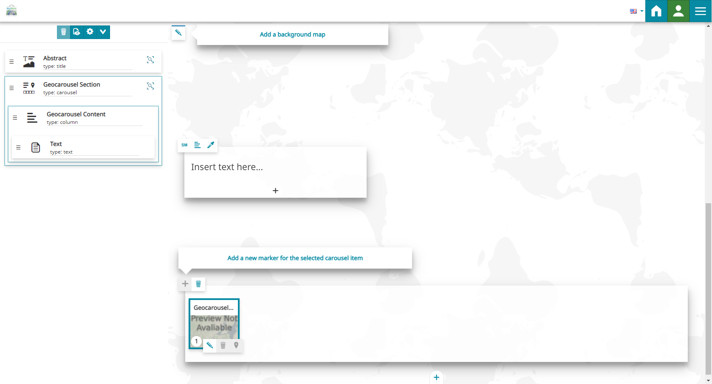
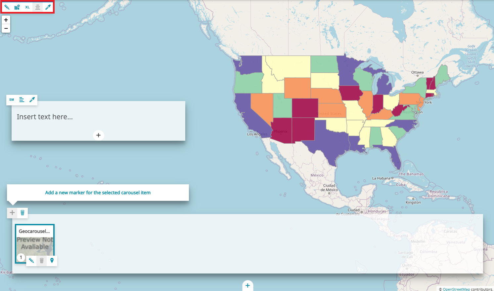
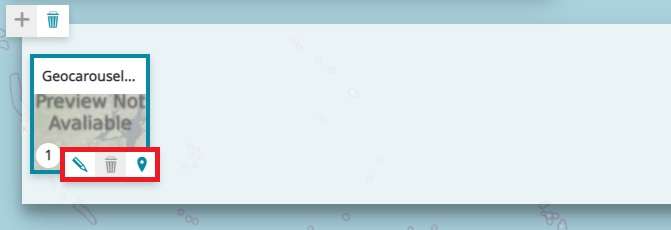
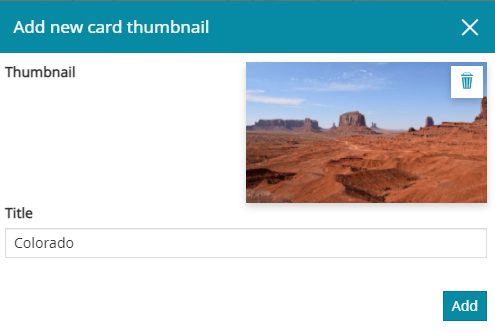
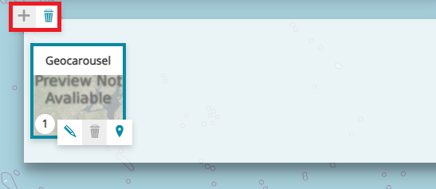

# Секцыя "Геа-карусель"

**********************

Секцыя "Геа-карусель" дазваляе стварыць яшчэ адзін від імерсіўнага досведу, адрозны ад [імерсіўнай секцыі](immersive-section.md#immersive-section). Рэдактар гісторыі можа вызначыць спіс картак каруселі, якія будуць прадстаўлены з суправаджальным апісальным зместам і геаграфічным месцазнаходжаннем. У рэжыме рэдагавання яна складаецца з трох элементаў: фонавай карты, апісальнай панэлі і панэлі каруселі, дзе рэдактар можа кіраваць элементамі каруселі.

## Фон

Панэль рэдагавання фону дазваляе дадаць карту ў якасці фону секцыі з дапамогай кнопкі **Змяніць крыніцу медыя** , якая, як звычайна, адкрывае [рэдактар медыя](media-editor-window.md#media-editor-window).

!!! заўвага

    У *секцыі "Геа-карусель"*, у адрозненне ад [імерсіўнай секцыі](immersive-section.md#immersive-section) і [секцыі "Загаловак"](title-section.md#title-section), рэдактар гісторыі можа дадаць у якасці фону толькі **карту**.

Пасля выбару *карты* для фону ў левым верхнім куце секцыі з'яўляецца панэль рэдагавання, якая дазваляе рэдактару гісторыі кіраваць фонавым зместам.

**Панэль рэдагавання фону** дазваляе выконваць наступныя дзеянні:

* **Змяніць крыніцу медыя**  дазваляе выбраць медыя-змест для выкарыстання ў секцыі; пры націску гэтай кнопкі адкрываецца [рэдактар медыя](media-editor-window.md#media-editor-window).

* **Рэдагаваць канфігурацыю карты** дазваляе [наладзіць карту](configure-map.md#configure-the-map).

* **Змяніць памер**  секцыі паміж *маленькім*, *сярэднім*, *вялікім* або *поўным*.

* **Выраўнаваць змест**  па *левым краі*, *цэнтры* або *правым краі*.

* **Змяніць тэму фону** , каб усталяваць колер пустога фону: *па змаўчанні* (тыя ж наладкі тэмы па змаўчанні, што і ў гісторыі, гл. [Наладкі гісторыі](story-setting.md#story-settings)), *светлы*, *цёмны* або *карыстальніцкі* (дазваляе наладзіць колер фону).

!!! увага
    Кнопкі *Выраўнаваць змест* і *Змяніць тэму фону* адключаны, калі памер карты ўсталяваны на поўны экран.

## Апісальная панэль

Апісальная панэль дазваляе размяшчаць апісальны змест, такі як *тэкст*, *выява*, *відэа* або *карта* для розных картак, якія складаюць секцыю "Геа-карусель". Рэдактар гісторыі можа наладжваць яе з дапамогай **панэлі інструментаў зместу**, як тлумачыцца ў раздзеле [Змест](immersive-section.md#content).

## Карусель

Карусель складаецца са спіса картак, якія павінны быць звязаны з геаграфічным месцазнаходжаннем. Яна размешчана ў ніжняй частцы секцыі "Геа-карусель", і як толькі секцыя дадаецца ў гісторыю, па змаўчанні ў ёй ёсць наступная пустая картка, гатовая да наладкі:

Пасля выбару карткі ў рэжыме рэдагавання рэдактар гісторыі можа выконваць наступныя аперацыі з дапамогай **панэлі рэдагавання картак**:

* **Рэдагаваць**  картку: пры націску гэтай кнопкі адкрываецца панэль **Рэдагаваць картку**, якая дазваляе дадаць *эскіз* і *загаловак*. Прыкладам можа быць наступны:

* **Выдаліць**  картку.

* **Дадаць маркер**  на карту або змяніць бягучае становішча маркера: пры націску гэтай кнопкі адкрываецца **ўбудаваны рэдактар карты**, і рэдактар гісторыі можа пстрыкнуць па кропцы на карце, каб дадаць новы маркер або змяніць яго становішча, як паказана ніжэй:

<video class="ms-docimage" controls><source src="../../../ru/user-guide/map/img/geocarousel-section/add_marker.mp4"/></video>

У левым верхнім куце панэлі каруселі **панэль інструментаў каруселі** дазваляе:

* **Дадаць картку**  ў карусель.

* **Выдаліць**  *секцыю "Геа-карусель"*.

!!! заўвага
    Кожны элемент каруселі, а таксама яго маркер на карце, пранумараваны для лепшай ідэнтыфікацыі.

## Секцыя "Геа-карусель" у рэжыме прагляду

У секцыі "Геа-карусель", у [рэжыме прагляду](exploring-stories.md#view-mode), карыстальнік можа выконваць наступныя аперацыі:

* Выбраць *картку каруселі* для прагляду звязанага з ёй апісальнага зместу.

<video class="ms-docimage" style="width:700px" controls><source src="../../../ru/user-guide/map/img/geocarousel-section/items.mp4"/></video>

* Выбраць *маркер* на карце, каб адлюстраваць усплывальнае акно з назвай яго карткі каруселі і прагледзець яго апісальны змест.

<video class="ms-docimage" style="width:700px" controls><source src="../../../ru/user-guide/map/img/geocarousel-section/marker.mp4"/></video>

* Выкарыстоўваць левую і правую стрэлкі  для прагляду рознага зместу геа-каруселі.

<video class="ms-docimage" style="width:700px" controls><source src="../../../ru/user-guide/map/img/geocarousel-section/arrows.mp4"/></video>