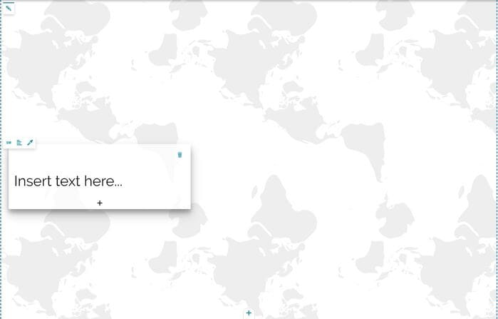
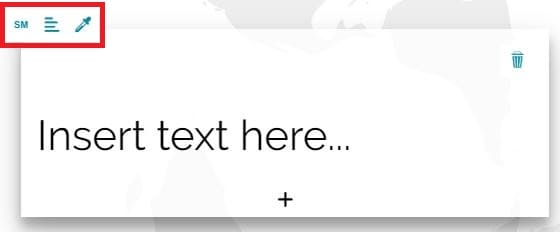
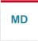
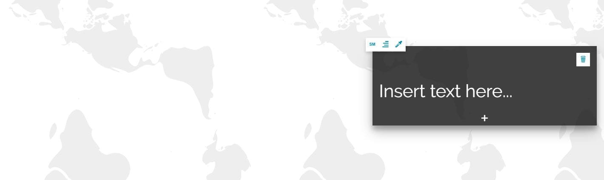
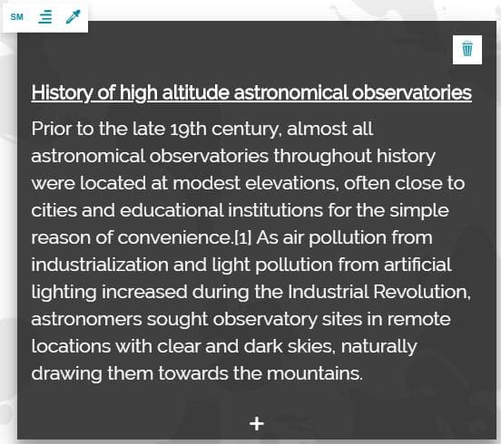
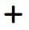
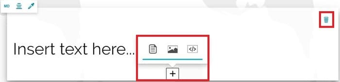
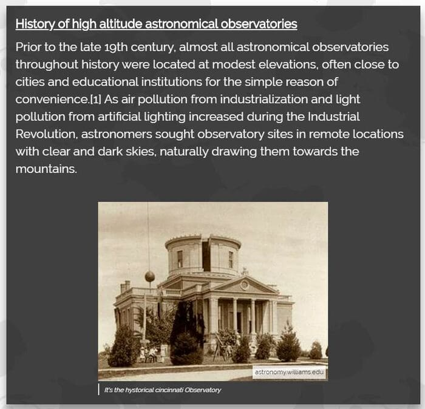
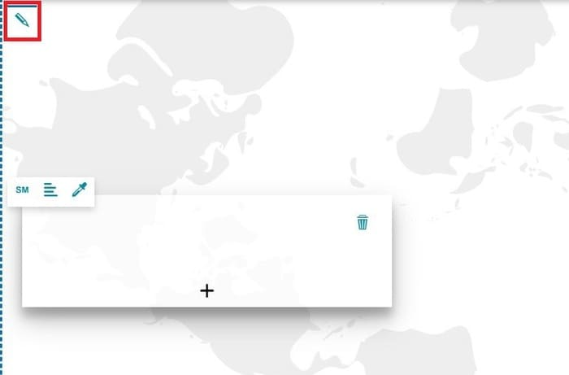
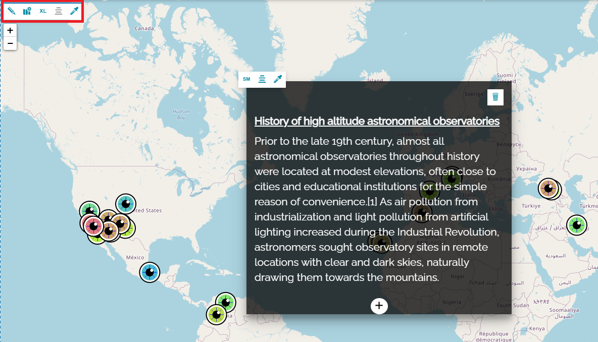

# Імерсіўная секцыя

**********************

Імерсіўная секцыя складаецца з двух элементаў: фону і імерсіўнага зместу. Як толькі вы дадаяце імерсіўную секцыю ў сваю гісторыю, адлюстроўваецца пусты фон з пустым тэкставым зместам.

## Змест

Унутры *імерсіўнай секцыі* рэдактар гісторыі можа наладжваць вобласць зместу з дапамогай **панэлі інструментаў імерсіўнага зместу**:

У прыватнасці, можна:

* Кнопка **Змяніць памер**  дазваляе змяніць памер тэкставага акна на *маленькі*, *сярэдні*, *вялікі* або *поўны*.

* Кнопка **Выраўнаваць змест**  дазваляе выраўнаваць тэкставае акно ўнутры кантэйнера па *левым краі*, *цэнтры* або *правым краі*.

* Кнопка **Змяніць тэму поля**  дазваляе змяніць тэму тэкставага акна на *па змаўчанні* (тыя ж наладкі тэмы па змаўчанні, што і ў гісторыі, гл. [Наладкі гісторыі](story-setting.md#story-settings)), *светлую*, *цёмную* або *карыстальніцкую* (дазваляе наладзіць колеры фону і тэксту і ўключыць або выключыць цень).

Ніжэй прыведзены прыклад невялікага імерсіўнага зместу, выраўнаванага па *правым краі* і з *цёмнай* тэмай поля:

Як толькі вы дадаяце тэкставы змест, ён становіцца даступным адразу пад бягучым. Простым пстрычкай унутры яго карыстальнік можа напісаць тэкст і наладзіць фарматаванне тэксту з дапамогай [панэлі інструментаў тэкставага рэдактара](text-editor-toolbar.md#text-editor-toolbar). Прыкладам тэкставага зместу можа быць наступны:

Імерсіўны змест можа ўключаць тэкст, медыя-змест або вэб-старонкі. Новы змест можна дадаць у слупок імерсіўнага зместу з дапамогай кнопкі  або выдаліць з дапамогай кнопкі .

Пры даданні медыя-зместу з'яўляецца [рэдактар медыя](media-editor-window.md#media-editor-window), які дазваляе рэдактару гісторыі дадаць выяву, карту або відэа. Таксама можна дадаць змест вэб-старонкі, як тлумачыцца ў раздзеле [Секцыя "Вэб-старонка"](web-section.md#web-page-section). Прыкладам імерсіўнага зместу з тэкстам і выявай можа быць наступны:

## Фон

Для імерсіўных секцый можна наладзіць фон з дапамогай панэлі рэдагавання фону:

Панэль рэдагавання фону, калі медыяфайлы не прыменены, дазваляе:

* Дадаць медыяфайл у якасці фону секцыі з дапамогай кнопкі **Змяніць крыніцу медыя** , якая адкрывае [рэдактар медыя](media-editor-window.md#media-editor-window).

Пасля дадання медыяфайла (*выява*, *відэа* або *карта*) ў фон, у левым верхнім куце секцыі з'яўляецца панэль рэдагавання, якая дазваляе карыстальніку кіраваць фонавым зместам.

**Панэль рэдагавання фону** змяняецца ў залежнасці ад тыпу медыя, дададзенага ў фон, як тлумачыцца ў раздзеле [Фон](title-section.md#images).

!!! заўвага
    Толькі для імерсіўнай секцыі, калі карыстальнік спрабуе дадаць яшчэ адну секцыю таго ж тыпу адразу пад бягучай, дададзеная секцыя на самай справе з'яўляецца яшчэ адным імерсіўным зместам, які ўпісваецца ў тую ж імерсіўную секцыю.