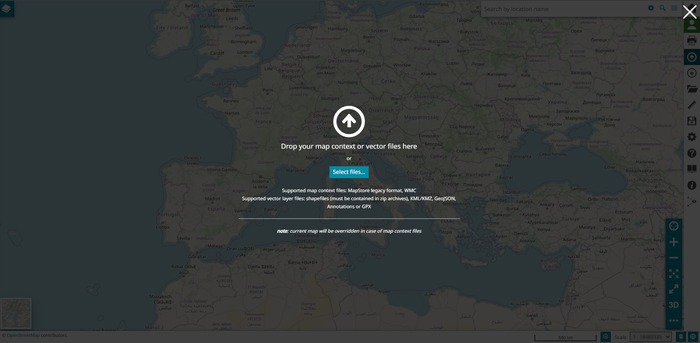
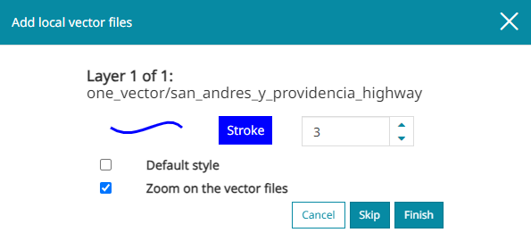

# Імпарт файлаў

**************

На карту можна дадаваць файлы кантэксту або вектарныя файлы. Гэтую аперацыю можна выканаць, націснуўшы  на [Бакавой панэлі інструментаў](mapstore-toolbars.md#side-toolbar). Пасля гэтага з'явіцца экран імпарту:

Тут карыстальнік, каб імпартаваць файл, можа перацягнуць яго на экран імпарту або выбраць з папак на лакальным камп'ютары з дапамогай кнопкі . У цяперашні час ёсць магчымасць імпартаваць два розныя тыпы файлаў:

* *Файлы кантэксту карты* (падтрымліваюцца фарматы: састарэлы фармат MapStore, WMC)

* *Файлы вектарных слаёў* (падтрымліваюцца фарматы: шэйп-файлы, KML/KMZ, GeoJSON і GPX)

!!! Папярэджанне
    Шэйп-файлы павінны ўтрымлівацца ў архівах .zip.

## Экспарт і імпарт файлаў кантэксту карты

Кантэкст карты — гэта, напрыклад, файл, які карыстальнік спампоўвае, выбраўшы кнопку  на [Бакавой панэлі інструментаў](mapstore-toolbars.md#side-toolbar). Кантэксты карты можна экспартаваць у двух розных фарматах:

* Файл  — гэта экспарт у фармаце `json` бягучага стану кантэксту карты: бягучыя праекцыі, каардынаты, маштаб, экстэнт, слаі, якія прысутнічаюць на карце, віджэты і многае іншае.

Пры даданні канфігурацыйнага файла MapStore паводзіны будуць наступнымі:

<video class="ms-docimage" controls><source src="../../../ru/user-guide/map/img/import/export-import.mp4"/></video>

* Файл  (Web Map Context) — гэта файл у фармаце `xml`, у які экспартуюцца толькі WMS-слаі, якія прысутнічаюць на карце, уключаючы іх наладкі, звязаныя з праекцыямі, каардынатамі, маштабам і экстэнтам.

Пры даданні канфігурацыйнага файла WMC паводзіны будуць наступнымі:

<video class="ms-docimage" controls><source src="../../../ru/user-guide/map/img/import/wmc_import.mp4"/></video>

!!! Папярэджанне
    Пры даданні файла кантэксту карты бягучы кантэкст карты будзе перазапісаны.

## Імпарт вектарных файлаў

Пры імпарце вектарных файлаў адкрываецца акно **Дадаць лакальныя вектарныя файлы**:

У гэтым акне, у прыватнасці, можна:

* Выбраць слой (калі адначасова імпартуецца больш за адзін слой)

* Усталяваць стыль слоя або пакінуць стыль па змаўчанні

* Уключыць/выключыць **Набліжэнне да вектарных файлаў**

Пасля завяршэння наладак вектарныя файлы можна канчаткова дадаць на карту з дапамогай кнопкі , якая робіць іх даступнымі ў выглядзе новых вектарных слаёў у [Панэлі зместу](toc.md#table-of-contents).

!!! Папярэджанне
    У цяперашні час немагчыма прачытаць [Табліцу атрыбутаў](attributes-table.md) імпартаваных вектарных файлаў, і па гэтай прычыне для гэтых слаёў таксама не дазволены [Фільтр слоя](filtering-layers.md) і стварэнне [Віджэтаў](widgets.md).