# Выкананне вымярэнняў

Інструмент "Вымярэнне" дазваляе карыстальніку выконваць розныя віды вымярэнняў (такія як адлегласць, плошча, азімут і г. д.) на карце. Ён таксама прадастаўляе некаторыя дадатковыя функцыі, якія апісаны ў гэтым раздзеле дакументацыі. Інструмент даступны з [Бакавой панэлі інструментаў](mapstore-toolbars.md#бакавая-панэль-інструментаў) пры выбары кнопкі , якая адкрывае наступную панэль інструментаў:

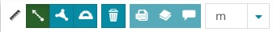

З дапамогай гэтага акна можна:

* Вымераць адлегласць 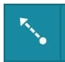

* Вымераць плошчу 

* Вымераць азімут 

* Ачысціць вымярэнні 

* Экспартаваць вымярэнні ў *GeoJSON* 

* Дадаць вымярэнне ў якасці слоя ў [Панэль зместу](toc.md) 

* Дадаць вымярэнне ў якасці [Анатацыі](annotations.md) 

!!! note "Заўвага"
    Карыстальнік можа выконваць некалькі вымярэнняў адначасова на карце, а затым адмяніць іх з дапамогай кнопкі **Ачысціць вымярэнні** 

## Вымярэнне адлегласці

Як толькі адкрываецца акно вымярэння, па змаўчанні абрана опцыя вымярэння адлегласці 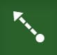. Для выканання вымярэння адлегласці кожны пстрык на карце адпавядае сегменту лініі (патрабуецца як мінімум адзін сегмент), а двайны пстрык ўстаўляе апошні сегмент лініі і завяршае сеанс малявання.

<video class="ms-docimage" style="max-width:600px;" controls><source src="img/measure/measure-distance-ex.mp4"/></video>

Даступныя адзінкі вымярэння:

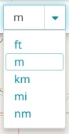

!!! note "Заўвага"
    Даўжыня сегмента лініі адлюстроўваецца на карце разам з вымярэннем агульнай даўжыні ўсіх сегментаў.

## Вымярэнне плошчы

Пасля выбару кнопкі **Вымераць плошчу**  можна пачаць сеанс малявання (у гэтым выпадку неабходна ўказаць як мінімум 3 вяршыні). Як і пры вымярэнні адлегласці, кожны пстрык адпавядае вяршыні, а двайны пстрык паказвае апошнюю.

<video class="ms-docimage" style="max-width:600px;" controls><source src="img/measure/measure-area-ex.mp4"/></video>

У гэтым выпадку даступныя наступныя адзінкі вымярэння:

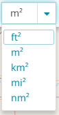

!!! note "Заўвага"
    Даўжыня кожнага боку палігона адлюстроўваецца на карце разам з яго перыметрам і плошчай.

## Вымярэнне азімута

Вымярэнне азімута дазваляе вымяраць напрамкі і вуглы. У сістэме квадрантных румбаў азімут лініі вымяраецца як вугал ад апорнага мерыдыяна, альбо паўночнага, альбо паўднёвага, у бок усходу ці захаду. Азімуты ў сістэме квадрантных румбаў запісваюцца як мерыдыян, вугал і напрамак. Напрыклад, азімут N 30 W вызначае вугал 30 градусаў на захад ад поўначы. Азімут S 15 E вызначае вугал 15 градусаў на ўсход ад поўдня.
Пасля выбару кнопкі **Вымераць азімут** 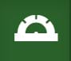 карыстальнік можа намаляваць лінію толькі з дзвюма вяршынямі, якія паказваюць адпаведна пачатковую і канчатковую кропкі.

<video class="ms-docimage" style="max-width:600px;" controls><source src="img/measure/measure-bearing-ex.mp4"/></video>

## Экспарт вымярэння

Вымярэнні, намаляваныя на карце, можна экспартаваць у фармат `GeoJson` з дапамогай кнопкі .

## Даданне вымярэння ў якасці слоя

Пасля таго як вымярэнне намалявана, яго можна дадаць у якасці слоя з дапамогай кнопкі . Створаны слой дадаецца ў [Панэль зместу](toc.md) наступным чынам:

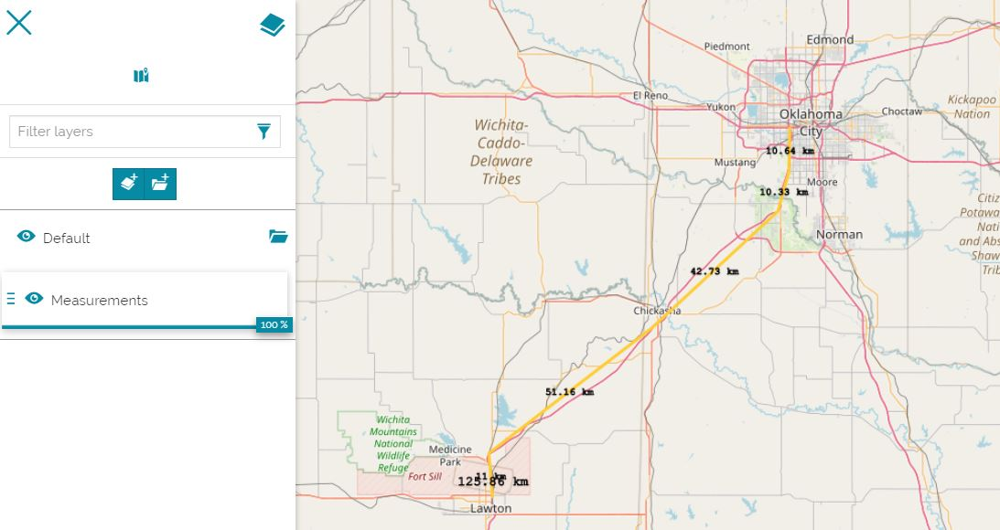

## Даданне вымярэння ў якасці анатацыі

Пасля таго як вымярэнне намалявана, яго можна дадаць у якасці [Анатацыі](annotations.md) з дапамогай кнопкі . Адкрыецца наступная панэль:

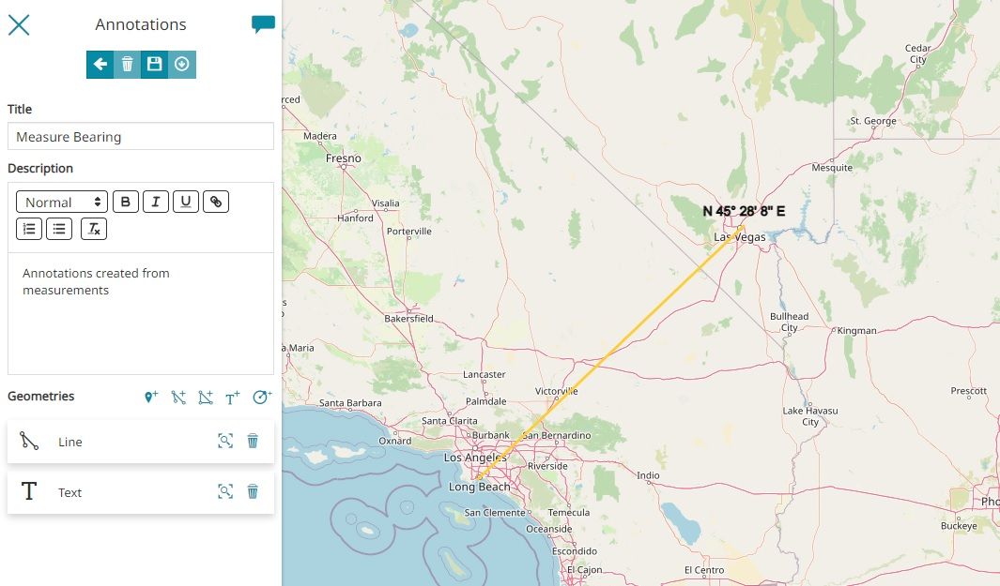

Пачынаючы з гэтага кроку, працэс стварэння такі ж, як апісана ў раздзеле [Анатацыі](annotations.md).

## Вымярэнні ў 3D-навігацыі

Калі ўключана [3D-навігацыя](navigation-toolbar.md#3d-навігацыя), у карыстальніка ёсць магчымасць выконваць вымярэнні адлегласці, плошчы, каардынат кропак, вышыні ад рэльефу, вуглоў і ўхілаў на 3D-карце.

!!! note "Заўвага"
    3D-рэжым прыкладання працуе на базе бібліятэкі картаграфавання CesiumJS, дзе для прадстаўлення картаграфічных аб'ектаў выкарыстоўваецца эліпсоідная сістэма каардынат. Па гэтай прычыне ўсе вымярэнні, выкананыя з дапамогай інструмента вымярэння, варта інтэрпрэтаваць як тыя, што маюць вышыню, разлічаную над эліпсоідам.

### Вымярэнне адлегласці ў 3D-навігацыі

Як толькі адкрываецца акно вымярэння, па змаўчанні абрана опцыя **Вымераць адлегласць у 3D-прасторы** 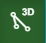. Для выканання вымярэння адлегласці кожны пстрык на карце адпавядае сегменту лініі (патрабуецца як мінімум адзін сегмент), а двайны пстрык ўстаўляе апошні сегмент лініі і завяршае сеанс малявання.

<video class="ms-docimage" style="max-width:600px;" controls><source src="img/measure/measure-distance-3d-ex.mp4"/></video>

### Вымярэнне геадэзічнай адлегласці

Пасля выбару кнопкі **Вымераць геадэзічную адлегласць**  можна пачаць сеанс малявання. Як і пры вымярэнні адлегласці, кожны пстрык адпавядае вяршыні (патрабуецца як мінімум дзве вяршыні), а двайны пстрык паказвае апошнюю. З гэтым тыпам вымярэння таксама магчыма ў 3D-рэжыме атрымаць геадэзічную адлегласць, разлічаную на абсалютным нулі эліпсоіда WGS84.

<video class="ms-docimage" style="max-width:600px;" controls><source src="img/measure/measure-geodesic-ex.mp4"/></video>

### Вымярэнне плошчы ў 3D-навігацыі

Пасля выбару кнопкі **Вымераць плошчу ў 3D-прасторы** 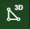 можна пачаць сеанс малявання (у гэтым выпадку неабходна ўказаць як мінімум 3 вяршыні). Як і пры вымярэнні адлегласці, кожны пстрык адпавядае вяршыні, а двайны пстрык паказвае апошнюю.

<video class="ms-docimage" style="max-width:600px;" controls><source src="img/measure/measure-area-3d-ex.mp4"/></video>

### Вымярэнне каардынат кропкі

Пасля выбару кнопкі **Вымераць каардынаты кропкі**  рэдактар можа пстрыкнуць па кропцы на карце і даведацца шырату, даўгату і вышыню гэтай кропкі.

<video class="ms-docimage" style="max-width:600px;" controls><source src="img/measure/measure-point-3d-ex.mp4"/></video>

### Вымярэнне вышыні ад рэльефу

Пасля выбару кнопкі **Вымераць вышыню ад рэльефу**  можна пстрыкнуць па кропцы на карце і даведацца адлегласць ад гэтай кропкі да рэльефу.

<video class="ms-docimage" style="max-width:600px;" controls><source src="img/measure/measure-height-from-terrain-3d-ex.mp4"/></video>

### Вымярэнне вугла

Пасля выбару кнопкі **Вымераць вугал у 3D-прасторы** 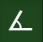 рэдактар можа намаляваць тры кропкі на карце і атрымаць значэнне вугла.

<video class="ms-docimage" style="max-width:600px;" controls><source src="img/measure/measure-angle-3d-ex.mp4"/></video>

### Вымярэнне ўхілу

Пасля выбару кнопкі **Вымераць ухіл**  рэдактар можа намаляваць тры кропкі на карце, каб стварыць трохвугольную паверхню і атрымаць значэнне ўхілу.

<video class="ms-docimage" style="max-width:600px;" controls><source src="img/measure/measure-slope-3d-ex.mp4"/></video>