# Акно рэдактара медыя

**********************

Кнопка **Змяніць крыніцу медыя**  дазваляе атрымаць доступ да рэдактара медыя:

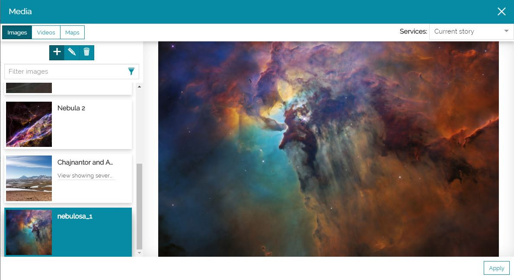

У гэтым акне вы можаце дадаваць або рэдагаваць тры розныя тыпы медыя:

* Выявы

* Відэа

* Карты

## Выявы

Каб дадаць выяву, рэдактар гісторыі можа націснуць на ўкладку **Выявы** , каб перайсці ў раздзел выяў. У гэтым раздзеле акна рэдактара медыя, пры націску на кнопку **Дадаць** , можна вызначыць наладкі выявы.

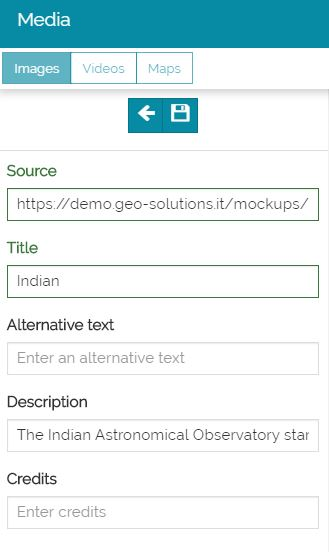

У прыватнасці, можна ўвесці наступныя параметры:

* **Крыніца** выявы (яе URL)

* **Загаловак** выявы

* **Альтэрнатыўны тэкст**, які з'яўляецца, калі спасылка не працуе

* **Апісанне**, якое выкарыстоўваецца для тлумачэння зместу выявы. Апісанне даступна ў спісе папярэдняга прагляду выяў і, калі выява дададзена ў якасці зместу ў *секцыю "Параграф"*, *імерсіўную секцыю* або *медыя-секцыю*, пад выявай, як паказана ніжэй:

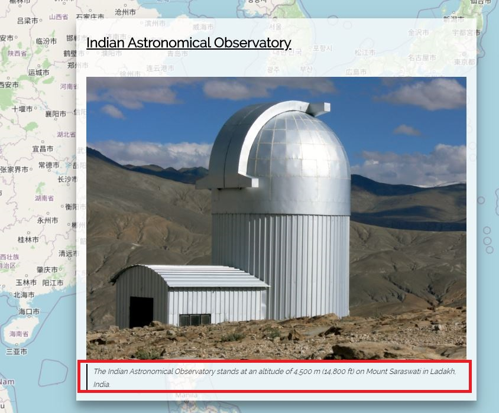

* **Аўтарства**, якое адлюстроўваецца ў правым ніжнім куце выявы

!!! увага
    **Крыніца** і **Загаловак** з'яўляюцца абавязковымі палямі.

Пры націску на **Захаваць** , выява ўключаецца ў спіс даступных выяў, гатовых да выбару для бягучай гісторыі. Выява таксама адразу становіцца даступнай для папярэдняга прагляду.

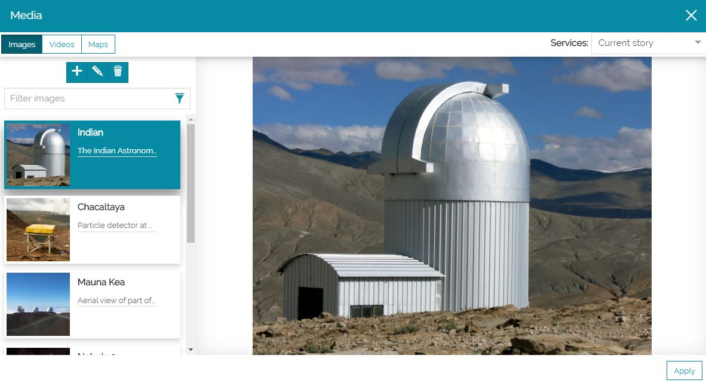

!!! заўвага
    Заўсёды можна змяніць наладкі выявы з дапамогай кнопкі **Рэдагаваць** , у тым ліку і пазней.

Пасля выбару ў спісе, выяву можна ўключыць у гісторыю, націснуўшы на кнопку **Прымяніць** .

## Відэа

Каб дадаць відэа, рэдактар гісторыі можа націснуць на ўкладку **Відэа** , каб перайсці ў раздзел відэа. У гэтым раздзеле акна рэдактара медыя, пры націску на кнопку **Дадаць** , можна вызначыць наладкі відэа.

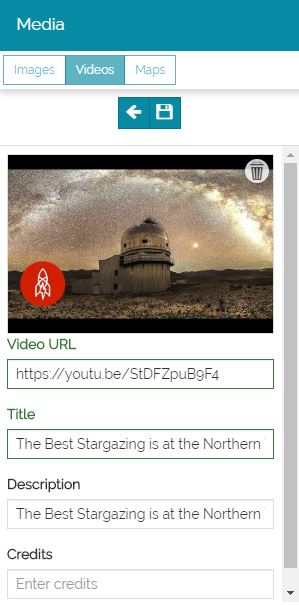

У прыватнасці, можна ўвесці наступныя параметры:

* **URL** відэа

* **Загаловак** відэа

* **Апісанне**, якое выкарыстоўваецца для тлумачэння зместу відэа. Апісанне даступна ў спісе папярэдняга прагляду відэа і можа з'яўляцца пад самім відэа, калі відэа дададзена ў якасці зместу секцыі (*секцыя "Параграф"*, *імерсіўная секцыя* або *медыя-секцыя*)

* **Аўтарства**, якое адлюстроўваецца ў правым ніжнім куце відэа

!!! увага
    **URL відэа** і **Загаловак** з'яўляюцца абавязковымі палямі.

Пры націску на **Захаваць** , відэа ўключаецца ў спіс даступных відэа, гатовых да выбару для бягучай гісторыі. Відэа таксама адразу становіцца даступным для папярэдняга прагляду.

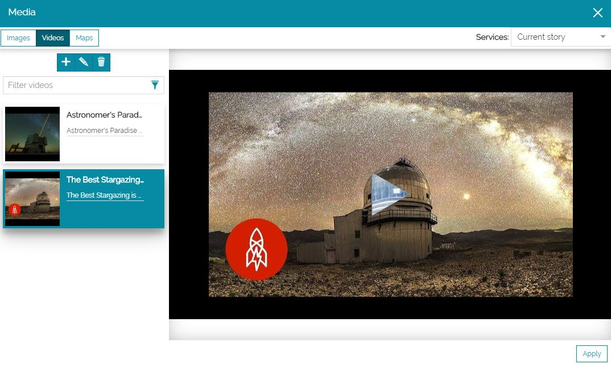

Пасля выбару ў спісе, відэа можна ўключыць у гісторыю, націснуўшы на кнопку **Прымяніць** .

## Карты

Каб дадаць карту ў гісторыю, рэдактар гісторыі можа націснуць на ўкладку **Карты**  і такім чынам перайсці ў раздзел карт рэдактара медыя. Тут даступны спіс карт, гатовых да выкарыстання ў гісторыі: рэдактар можа знайсці і выбраць карту ў спісе, каб прымяніць яе ў гісторыі, або стварыць карту з нуля, націснуўшы на кнопку **Дадаць** , каб адкрыць [рэдактар карт](configure-map.md#advanced-map-editor).

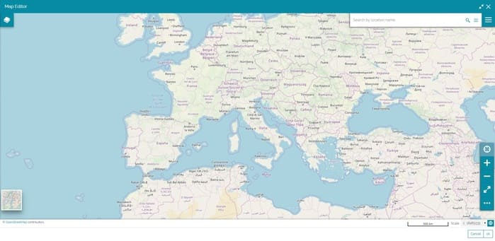

Калі карта гатова, рэдактар гісторыі можа націснуць кнопку **Ок**, каб перайсці да наступнага кроку і ўвесці адпаведныя метаданыя карты, такія як **Эскіз**, **Загаловак** і **Апісанне**.

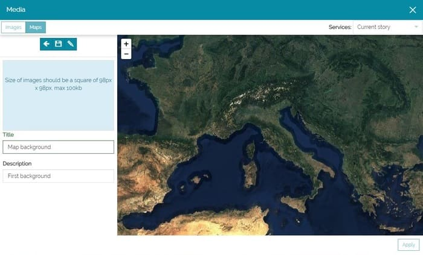

!!! заўвага
    Апісанне даступна ў спісе папярэдняга прагляду карт і можа з'яўляцца пад самой картай, калі карта дададзена ў якасці зместу секцыі (*секцыя "Параграф"*, *імерсіўная секцыя* або *медыя-секцыя*).

Пры націску на кнопку **Захаваць**  карта захоўваецца і становіцца даступнай у спісе карт *бягучай гісторыі*. Рэдактар гісторыі можа выбраць яе для выкарыстання ў якасці кампанента карты ў гісторыі, націснуўшы на кнопку **Прымяніць** .

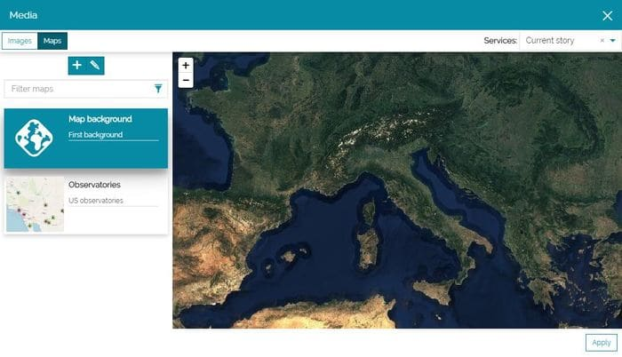

!!! заўвага
    Па змаўчанні выпадальны спіс у правым верхнім куце рэдактара медыя дазваляе пераключацца паміж картамі, якія выкарыстоўваюцца ў дадзены момант у гісторыі (такім чынам, рэдактар гісторыі можа пры неабходнасці зноў выкарыстоўваць карту, якая ўжо прысутнічае ў гісторыі), і існуючымі картамі, якія ўжо даступныя ў каталогу (гэта азначае, што класічныя карты, створаныя ў прыкладанні, таксама можна выкарыстоўваць у гісторыі).
    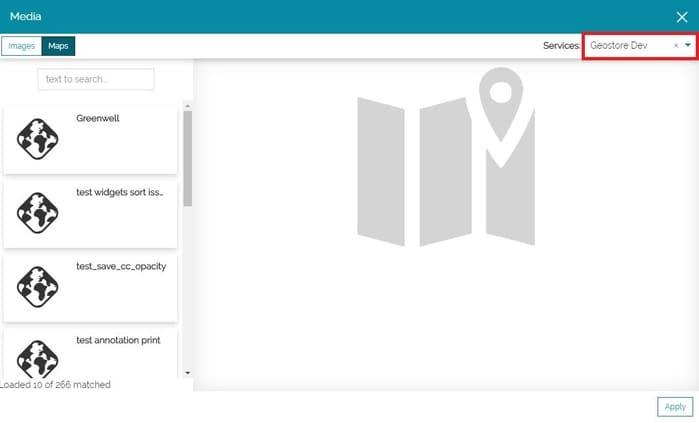

Ніжэй прыведзены прыклад *карты*, якая выкарыстоўваецца ў якасці фону секцыі "Загаловак":

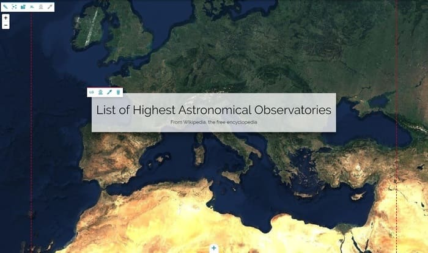