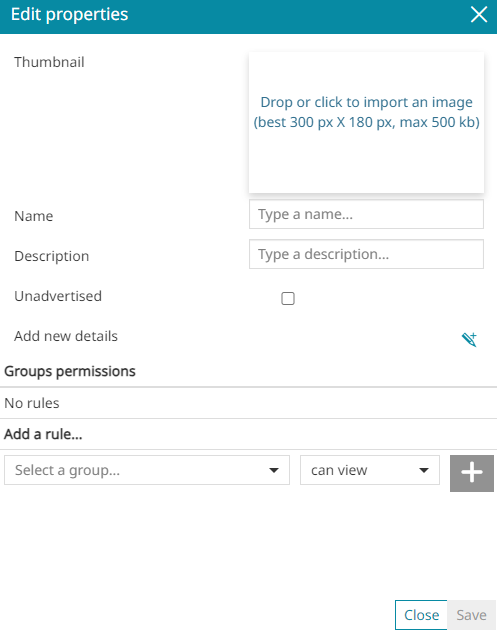
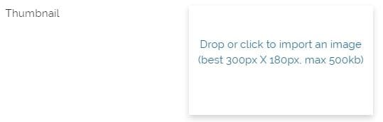
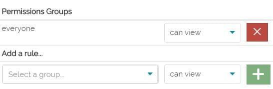
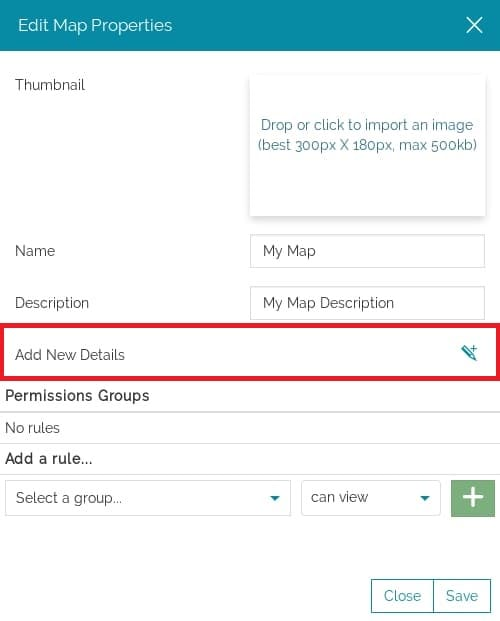
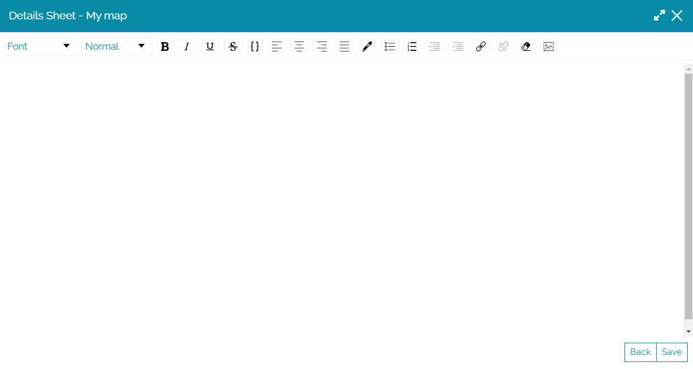
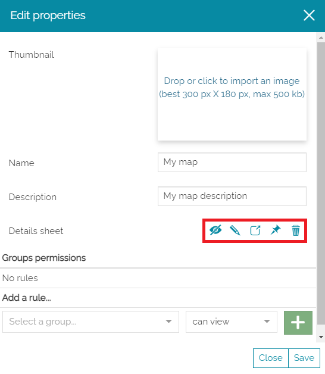
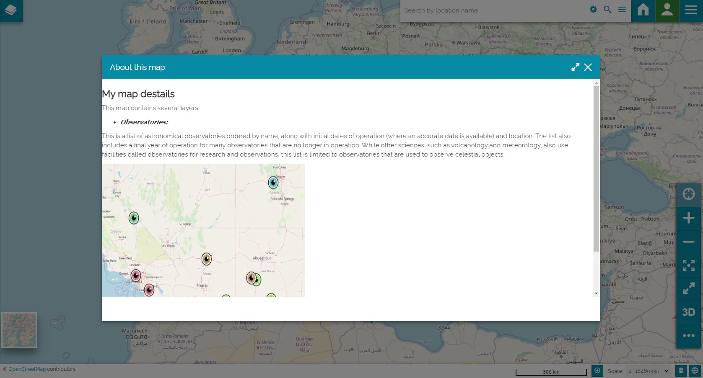
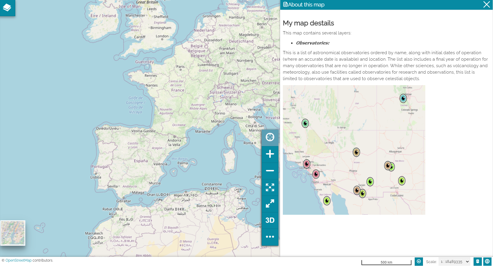
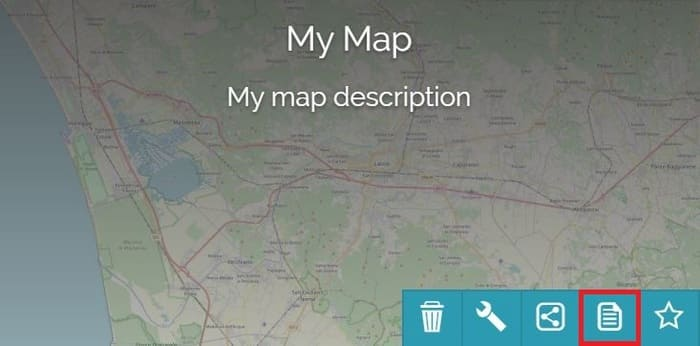
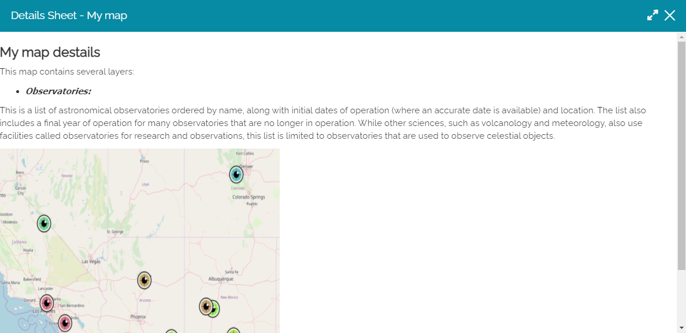

# Уласцівасці рэсурсу

*********************

Каб наладзіць уласцівасці рэсурсу, Адміністратар або звычайны карыстальнік з адпаведнымі правамі можа атрымаць доступ да акна *Рэдагаваць уласцівасці* з дапамогай кнопкі **Рэдагаваць уласцівасці**  на хатняй старонцы або з дапамогай кнопак **Захаваць** і **Захаваць як** у акне прагляду рэсурсу.

У акне *Рэдагаваць уласцівасці* карыстальнік можа выконваць наступныя аперацыі:

* Дадаць *Эскіз*

* Дадаць *Назву* і *Апісанне*

* Дадаць правіла *Доступу*

!!! увага
    Назва рэсурсу — адзінае абавязковае поле. Звярніце ўвагу, што не дазваляецца выбіраць назву, якая ўжо прысвоена іншаму рэсурсу.

## Эскіз

Можна дадаць выяву ў якасці эскіза, перацягнуўшы яе або пстрыкнуўшы ўнутры наступнага поля:

!!! увага
    Памер дадаванай выявы не павінен перавышаць 500 КБ, а яе аптымальныя памеры — 300x180 пікселяў. Падтрымліваюцца фарматы: `jpg` (або `jpeg`) і `png`.

## Правілы доступу

У раздзеле *Дадаць правіла...* можна ўсталяваць адно або некалькі правіл доступу, каб дазволіць групе доступ да рэсурсу. У прыватнасці, можна выбраць паміж пэўнай групай аўтэнтыфікаваных карыстальнікаў або групай *усе*, якая ўключае ўсіх аўтэнтыфікаваных карыстальнікаў, а таксама ананімных карыстальнікаў (дадатковую інфармацыю пра розныя тыпы карыстальнікаў можна знайсці ў раздзеле [Хатняя старонка](home-page.md#home-page)).
Акрамя таго, можна выбраць адзін з двух спосабаў, якімі абраная група можа ўзаемадзейнічаць з рэсурсам:

* *Праглядаць* карту і захоўваць копію

* *Рэдагаваць* карту і перазахоўваць яе

Каб дадаць правіла, карыстальнік можа выбраць групу і ўсталяваць дазволы ў раздзеле *Дадаць правіла...*. Пасля ўстаноўкі правіла, з дапамогай кнопкі **Дадаць**  яго можна дадаць у спіс *Групы з правамі доступу*.
Напрыклад, рэсурс, які можа быць бачны *ўсім*, павінен мець правіла, падобнае на наступнае:

Пасля ўстаноўкі правіла карыстальнік заўсёды можа выдаліць яго з дапамогай кнопкі **Выдаліць** .

## Падрабязнасці

Для рэсурсаў *Карта* і *Інфармацыйная панэль* можна дадаваць падрабязнасці. Гэта карысна для звязвання пэўнай інфармацыі з картай/інфармацыйнай панэллю або для агульнага апісання іх зместу. У гэтым выпадку акно *Рэдагаваць уласцівасці* выглядае наступным чынам:

Пры націску на кнопку **Дадаць новыя падрабязнасці**  адкрываецца панэль, дзе карыстальнік можа напісаць падрабязнасці.

Тэкст можна рэдагаваць, а таксама дадаваць спасылкі і выявы з дапамогай [Панэлі інструментаў тэкставага рэдактара](text-editor-toolbar.md#text-editor-toolbar).
Пасля завяршэння рэдагавання падрабязнасці можна захаваць з дапамогай кнопкі **Захаваць** , і на панэлі *Рэдагаваць уласцівасці* з'явяцца іншыя кнопкі.

Тут карыстальніку дазволена:

* Паказаць **папярэдні прагляд** падрабязнасцей 

* **Рэдагаваць** падрабязнасці 

* Уключыць кнопку **Паказваць у мадальным акне** , каб паказваць падрабязнасці ў мадальным акне, калі карыстальнік націскае кнопку , якая знаходзіцца ў опцыях [Бакавой панэлі інструментаў](mapstore-toolbars.md#side-toolbar).

!!! заўвага
    Калі кнопка **Паказваць у мадальным акне** не актывавана, калі карыстальнік адкрывае кнопку *Аб гэтай карце/інфармацыйнай панэлі*, падрабязнасці адлюстроўваюцца на панэлі. 

!!! увага
    Кнопка *Аб гэтай карце/інфармацыйнай панэлі* бачная на [Бакавой панэлі інструментаў](mapstore-toolbars.md#side-toolbar) толькі тады, калі на карце/інфармацыйнай панэлі ёсць падрабязнасці.

* Уключыць кнопку **Паказваць пры запуску** . Калі яна актыўная, як толькі карыстальнік адкрывае карту/інфармацыйную панэль, панэль з падрабязнасцямі адлюстроўваецца.

* **Выдаліць** ліст з падрабязнасцямі 

Пасля захавання падрабязнасцей, кнопка **Паказаць падрабязнасці**  з'яўляецца таксама на картцы карты/інфармацыйнай панэлі на хатняй старонцы.

З дапамогай яе можна адкрыць панэль з падрабязнасцямі таксама з хатняй старонкі.
