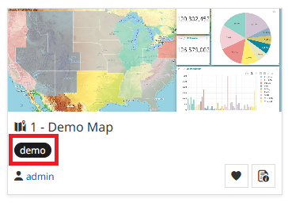
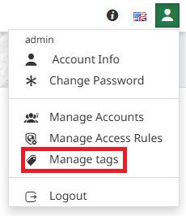
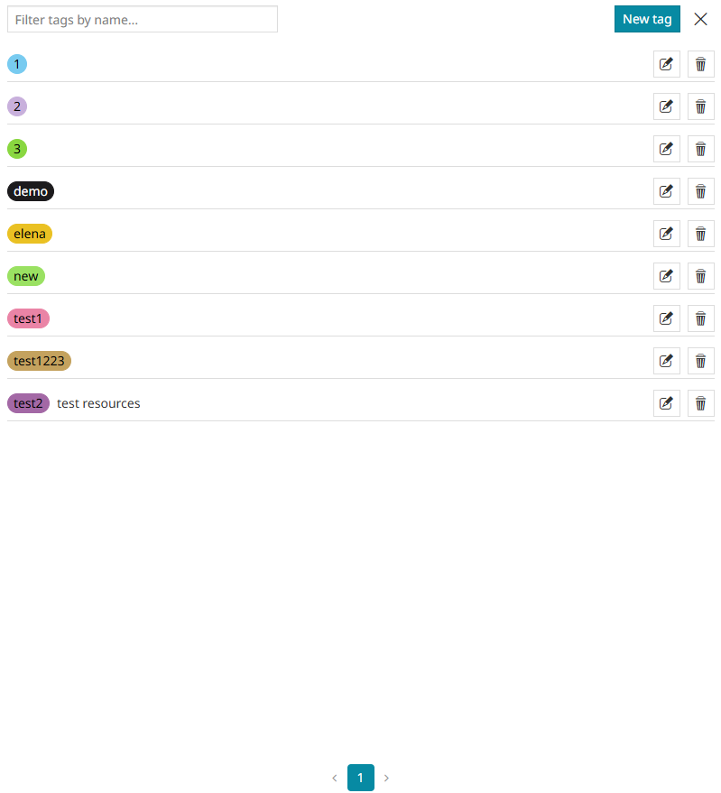
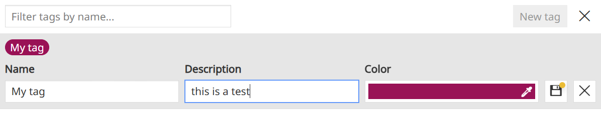
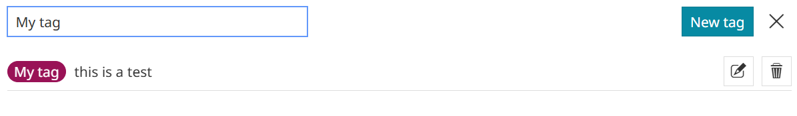

# Кіраванне тэгамі

*******************

**Менеджар тэгаў** — гэта адміністрацыйны інструмент, прызначаны для кіравання тэгамі, якія выкарыстоўваюцца ў якасці свайго роду ключавых слоў для рэсурсаў. Аўтэнтыфікаваныя карыстальнікі з правамі рэдагавання пэўнага рэсурсу (карты, інфармацыйнай панэлі і г.д.) могуць прысвойваць адзін або некалькі існуючых тэгаў самому рэсурсу ва ўласцівасцях рэсурсу. Створаныя такім чынам **тэгі** адлюстроўваюцца на картках рэсурсаў, і ўсе карыстальнікі, уключаючы ананімных, могуць фільтраваць рэсурсы па тэгах, націскаючы непасрэдна на адзін з іх або выкарыстоўваючы даступную панэль фільтрацыі на хатняй старонцы.

Як адміністратар, вы можаце кіраваць **тэгамі**, выбраўшы опцыю **Кіраваць тэгамі** з меню кнопкі  на хатняй старонцы:

Адкрыецца *панэль тэгаў*, якая дазваляе адміністратару:

* Стварыць **Новы тэг** з дапамогай кнопкі  і наладзіць яго, дадаўшы *Назву*, *Апісанне* і выбраўшы *Колер* для меткі.

* **Шукаць** тэг з дапамогай радка пошуку.

* **Рэдагаваць** тэг з дапамогай кнопкі  побач з кожным тэгам у спісе.

* **Выдаліць** тэг з дапамогай кнопкі  побач з кожным тэгам у спісе.