# Часавая шкала

**********

Часавая шкала — гэта інструмент для кіравання слаямі з часавым вымярэннем.
Ён дазваляе назіраць за эвалюцыяй слаёў у часе, правяраць канфігурацыю слоя ў пэўны момант часу (або ў дыяпазоне часу) і дынамічна праглядаць розныя канфігурацыі слаёў з цягам часу з дапамогай анімацыі.

!!! Увага
    Інструмент "Часавая шкала" ў цяперашні час працуе толькі са слаямі WMS з GeoServer, дзе ўсталявана пашырэнне [WMTS-Multidim](https://docs.geoserver.org/stable/en/user/community/wmts-multidimensional/index.html) (значэнні часу WMS у WMS Capabilities пакуль не падтрымліваюцца). Для выкарыстання часавай шкалы патрабуецца як мінімум **GeoServer 2.14.5**, але рэкамендуемая версія — **GeoServer 2.15.2**, каб мець поўную падтрымку ўсіх функцый, якія можа прадаставіць інструмент "Часавая шкала" (напрыклад, фільтрацыю па бачным экстэнце).
    З гэтага моманту слаі, якімі можа кіраваць часавая шкала, будуць называцца *часавымі слаямі*.
    З гэтага моманту слаі, якімі можа кіраваць часавая шкала, будуць называцца *часавымі слаямі*.

Калі на карту дадаецца слой з часавым вымярэннем, панэль часавай шкалы аўтаматычна становіцца бачнай і дазваляе карыстальніку праглядаць слой у часе.

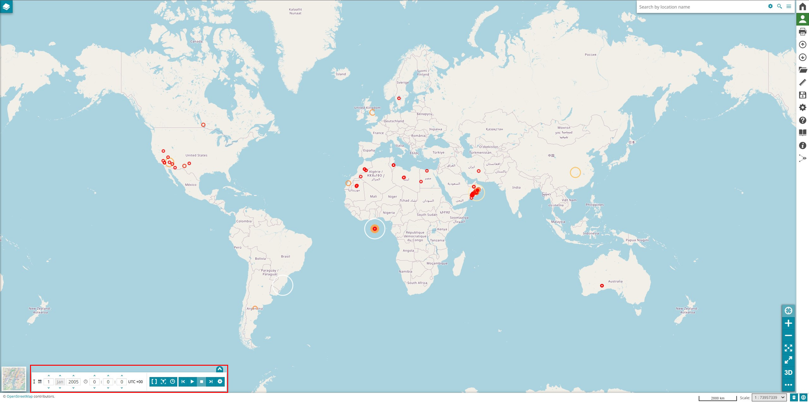

!!! Заўвага
    Віджэты і часавая шкала не могуць быць разгорнуты на адной карце адначасова. Падрабязней пра гэта гл. у [гэтым раздзеле](widgets.md#manage-existing-widgets).

## Гістаграма часавай шкалы

Панэль гістаграмы адкрываецца з дапамогай кнопкі **Разгарнуць часавую шкалу** .

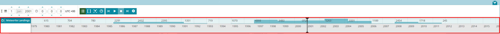

На панэлі гістаграмы найбольш важнымі элементамі з'яўляюцца наступныя:

* Спіс слаёў, якія прысутнічаюць на карце, з даступным часавым вымярэннем. Гэты спіс можна схаваць з дапамогай кнопкі **Схаваць назвы слаёў** 

* Адносная гістаграма, якая паказвае даныя слоя для кожнага моманту часу, у якім яны вызначаны. Для кіравання панэллю карыстальнік можа павялічваць/памяншаць гістаграму, пракручваць вось часу і перацягваць па ёй курсор бягучага часу

!!! Заўвага
    Падсвечаны слой — гэта той, чыя гістаграма адлюстроўваецца на панэлі.

!!! Заўвага
    Падсвечаны слой у спісе *часавых слаёў* кіруе часам, з гэтага моманту ён будзе называцца *вядучым слоем* (гл. у [Наладках анімацыі](#наладкі-анімацыі) > **Наладкі часавай шкалы** > опцыя **Прывязка да вядучага слоя**).

## Устаноўка часавага дыяпазону

Каб убачыць слой у пэўны момант часу, карыстальнік можа ўвесці дату і час на панэлі, як паказана ніжэй:

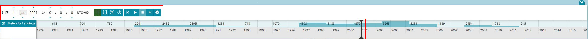

!!! Заўвага
    Курсор бягучага часу мяняе сваё становішча ў залежнасці ад абранай даты, і наадварот: калі карыстальнік перацягвае гэты курсор па восі часу, значэнні ў ячэйках даты/часу будуць абнаўляцца.

Каб назіраць за слаямі ў канчатковым фіксаваным часавым інтэрвале, карыстальнік можа ўсталяваць часавы дыяпазон з дапамогай кнопкі **Часавы дыяпазон** . Адкрыецца панэль кіравання датай/часам для ўстаноўкі межаў дыяпазону альбо шляхам прамога ўводу значэнняў у гэтыя ячэйкі, альбо шляхам перацягвання курсораў межаў па восі часу гістаграмы, як паказана ніжэй:

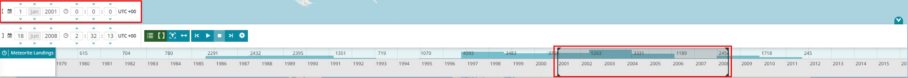

### Скід часавай шкалы

У залежнасці ад канфігурацыі часавай шкалы, кнопка скіду  можа быць бачная на панэлі інструментаў часавай шкалы. Яна дазваляе карыстальніку скінуць часавыя даныя ў залежнасці ад бягучага рэжыму часавай шкалы.

* Калі бягучы рэжым **адзінкавы**, значок прадстаўлены як , і слой *абраны* на часавай шкале, час усталёўваецца на `бліжэйшы да цяперашняга`, а калі слой *не абраны*, час усталёўваецца на `цяперашні час`.

* Калі бягучы рэжым **дыяпазон**, значок прадстаўлены як , час усталёўваецца на поўны дыяпазон слоя.

!!! Заўвага
    Кнопка скіду становіцца бачнай праз канфігурацыю плагіна, г. зн. `resetButton: true`

## Паказаць даступны час на карце

Часам можа быць цікава адлюстраваць на гістаграме часавай шкалы толькі тыя моманты часу, якія ў дадзены момант бачныя на карце, асабліва пры даследаванні вялікага набору даных. Гэту функцыю можна ўключыць, націснуўшы кнопку **Сінхранізацыя з картай** . Калі гэты інструмент актыўны, часавая шкала будзе паказваць толькі час аб'ектаў, даступных у бягучым бачным экстэнце карты.

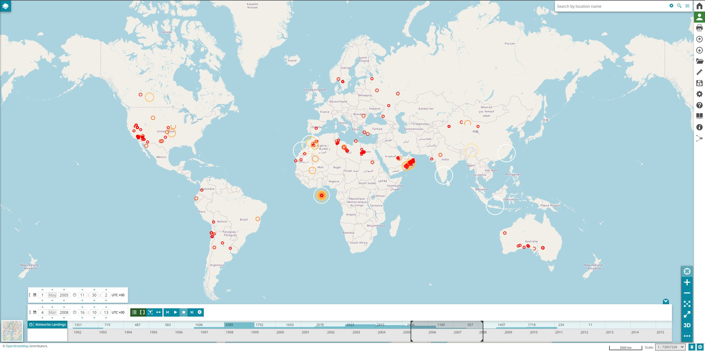

!!! Заўвага
    Для функцыі "Сінхранізацыя з картай" патрабуецца як мінімум GeoServer 2.15.2

## Анімацыі

Карыстальнік можа запусціць часавую анімацыю з дапамогай інструмента часавай шкалы, выкарыстоўваючы наступныя кнопкі (па змаўчанні анімацыя слаёў на карце заснавана на значэннях часу, якія адносяцца да **вядучага слоя**, гл. раздзел [Наладкі анімацыі](#наладкі-анімацыі) > **Наладкі часавай шкалы** > опцыя **Прывязка да вядучага слоя**):

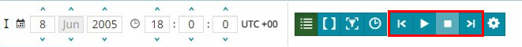

Каб запусціць анімацыю, карыстальнік можа націснуць кнопку **Прайграць** . Пасля запуску анімацыі часавыя слаі на карце абнаўляюцца адпаведным чынам, і карыстальнік можа бачыць прагрэс анімацыі таксама на гістаграме часавай шкалы. Прытрымліваючыся паслядоўнасці крокаў, курсор будзе кожны раз зрушвацца да наступнага кроку ў пэўным часавым інтэрвале, *працягласці кадра*.
З дапамогай кнопкі **Стоп**  карыстальнік можа спыніць анімацыю, і курсор бягучага часу застанецца ў апошняй дасягнутай пазіцыі.
Кнопка **Крок назад**  і кнопка **Крок наперад**  дазваляюць карыстальніку змяняць бягучы час. Такім чынам, пры націску на адну з іх курсор мяняе сваё становішча (на папярэдні або наступны крок) на гістаграме, значэнні даты/часу ў ячэйках кіравання будуць абноўлены адпаведным чынам, і слаі на карце таксама абновяцца.
Карыстальнік можа прыпыніць анімацыю з дапамогай кнопкі **Паўза** , як паказана ніжэй:

<video class="ms-docimage"  style="max-width:700px;" controls><source src="../../../ru/user-guide/map/img/timeline/timeline-animation.mp4"/></video>

!!! Заўвага
    Карыстальнік таксама можа пазначыць *часавы дыяпазон*. Падчас анімацыі ўвесь дыяпазон будзе зрушвацца крок за крокам па восі часу, і на кожным кроку слаі на карце будуць паказваць даныя, якія адпавядаюць гэтаму дыяпазону часу.
    <video class="ms-docimage"  style="max-width:700px;"controls><source src="../../../ru/user-guide/map/img/timeline/timeline-animation-range.mp4"/></video>

### Наладкі анімацыі

Паводзіны анімацыі можна наладзіць з дапамогай кнопкі **Наладкі** . Яна дазваляе карыстальніку наладжваць опцыі *часавай шкалы* і *прайгравання*.

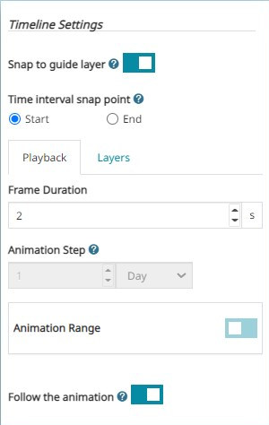

Па змаўчанні опцыя **Прывязка да вядучага слоя** ўключана. Яна дазваляе прымусова прывязваць курсор часу да даных абранага слоя.

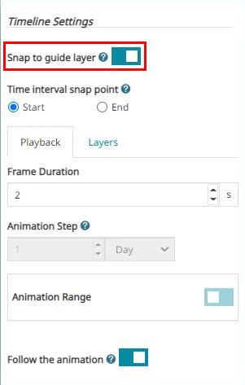

Калі часавае вымярэнне слоя мае вызначаныя часавыя дыяпазоны (час пачатку/заканчэння) замест момантаў часу, карыстальнік можа выбраць **Кропку прывязкі часавага інтэрвалу**, выбраўшы опцыю `Пачатак` або `Канец`. Прыкладам прывязкі да кропкі `Канец` можа быць наступны:

<video class="ms-docimage"controls><source src="../../../ru/user-guide/map/img/timeline/time-interval-snap-point.mp4"/></video>

Карыстальнік можа адключыць *Прывязку да вядучага слоя*, каб выбраць пераважны часавы крок з дапамогай опцыі **Крок анімацыі**. Напрыклад, працэс можа быць падобны на наступны:

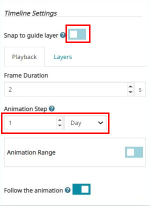

Карыстальнік можа ўсталяваць колькасць секунд паміж адным кадрам анімацыі і іншым з дапамогай **Працягласці кадра** і ўключыць **Сачыць за анімацыяй**, каб візуалізаваць працэс анімацыі таксама ўнутры гістаграмы: гістаграма будзе аўтаматычна перамяшчацца, ідучы за анімацыяй.

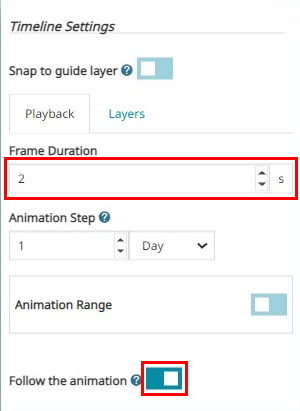

Уключыўшы **Дыяпазон анімацыі**, карыстальнік можа абмежаваць выкананне анімацыі фіксаваным часавым інтэрвалам, *зялёным дыяпазонам*. *Зялёны дыяпазон* можна вызначыць як перацягваннем курсораў *прайгравання/спынення* непасрэдна на гістаграме, так і запаўненнем ячэек кіравання *датай/часам* на дадатковай панэлі, як паказана ніжэй:

<video class="ms-docimage"controls><source src="../../../ru/user-guide/map/img/timeline/timeline-animation-green-range.mp4"/></video>

Для правільнай наладкі дыяпазону анімацыі даступныя некаторыя элементы кіравання, якія дапамагаюць карыстальніку:

* Павялічыць гістаграму да таго часу, пакуль яна не будзе адпавядаць часаваму пашырэнню *зялёнага дыяпазону* анімацыі, з дапамогай кнопкі **Павялічыць да бягучага дыяпазону прайгравання** 

* Пашырыць *зялёны дыяпазон* анімацыі да таго часу, пакуль ён не будзе адпавядаць бягучаму дыяпазону прагляду гістаграмы, з дапамогай кнопкі **Усталяваць да бягучага дыяпазону прагляду** 

* Пашырыць зялёны дыяпазон анімацыі да таго часу, пакуль ён не будзе адпавядаць часаваму пашырэнню вядучага слоя, з дапамогай кнопкі **Падагнаць пад дыяпазон абранага слоя** 

## Наладкі слаёў

Укладка **слаі** пералічвае ўсе даступныя часавыя слаі, якія прысутнічаюць на карце. Карыстальнік можа пераключыць слой, каб ён быў *паказаны/схаваны* на часавай шкале, пстрыкнуўшы сцяжок побач з загалоўкам слоя.

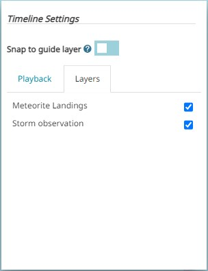