# Секцыя "Загаловак"

**********************

Як толькі вы ствараеце новую гісторыю, па змаўчанні ў рабочай прасторы прысутнічае толькі секцыя "Загаловак" (вокладка). У гэтай секцыі рэдактар гісторыі можа наладжваць два розныя элементы: тэкст загалоўка і фон вокладкі.

## Змест

Па змаўчанні секцыя загалоўка мае наступны запаўняльнік з пустым фонам за ім:

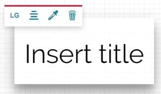

Пры пстрычцы ўнутры тэкставай вобласці яна пашыраецца, і з'яўляецца [панэль інструментаў тэкставага рэдактара](text-editor-toolbar.md#text-editor-toolbar), якая дазваляе рэдактару гісторыі ўводзіць і/або рэдагаваць тэкст загалоўка:

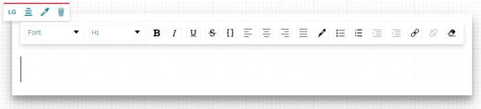

Пасля таго як тэкст напісаны, можна наладзіць становішча тэкставай вобласці і яе стыль з дапамогай панэлі інструментаў кампанента:

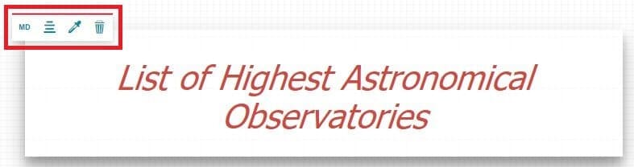

Панэль інструментаў тэкставага акна дазваляе карыстальніку змяняць наступныя наладкі:

* Кнопка **Змяніць памер**  дазваляе змяніць памер тэкставага акна на *маленькі*, *сярэдні*, *вялікі* або *поўны*.

* Кнопка **Выраўнаваць змест**  дазваляе выраўнаваць тэкставае акно ўнутры кантэйнера па *левым краі*, *цэнтры* або *правым краі*.

* Кнопка **Змяніць тэму поля**  дазваляе змяніць тэму тэкставага акна на *па змаўчанні* (тыя ж наладкі тэмы па змаўчанні, што і ў гісторыі, гл. [Наладкі гісторыі](story-setting.md#story-settings)), *светлую*, *цёмную* або *карыстальніцкую* (дазваляе наладзіць колеры фону і тэксту і ўключыць або выключыць цень).

* Кнопка **Выдаліць**  дазваляе выдаліць секцыю загалоўка.

!!! заўвага
    Калі секцыя змяшчае толькі адзін элемент зместу, і рэдактар гісторыі выдаляе гэты змест, уся секцыя таксама будзе аўтаматычна выдалена.

Пры ўстаноўцы загалоўка з *вялікім* памерам, выраўнаванага па *цэнтры* кантэйнера і са *светлай* тэмай, вынік будзе прыкладна такім:

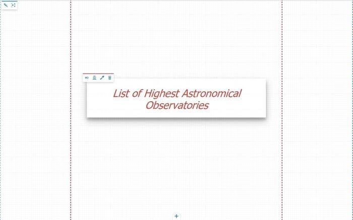

## Фон

Для секцый "Загаловак" можна наладзіць фон з дапамогай панэлі рэдагавання фону:

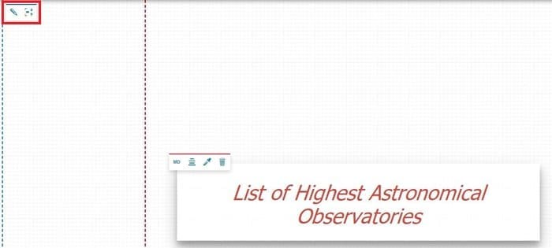

У выпадку пустога фону панэль рэдагавання фону дазваляе:

* Дадаць медыя-змест у якасці фону з дапамогай кнопкі **Змяніць крыніцу медыя** , якая адкрывае [рэдактар медыя](media-editor-window.md#media-editor-window).

* Змяніць вышыню секцыі з дапамогай кнопкі **Падагнаць/адаптаваць змест** 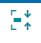.

У якасці фону можна дадаваць тры тыпы медыя-зместу: выявы, відэа або карты.

### Выявы

Пасля дадання выявы ў фон вынік будзе прыкладна такім:

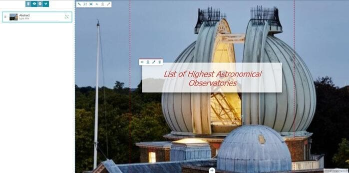

У гэтым выпадку панэль рэдагавання фону дазваляе наладзіць фон выявы з дапамогай наступных наладак:

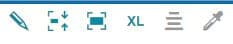

* **Змяніць крыніцу медыя**  дазваляе выбраць медыя-змест для выкарыстання ў секцыі; пры націску гэтай кнопкі адкрываецца [рэдактар медыя](media-editor-window.md#media-editor-window).

* Змяніць вышыню зместу з дапамогай кнопкі **Падагнаць/адаптаваць змест** .

* Змяніць суадносіны выявы/кантэйнера, выбіраючы паміж запаўненнем усяго кантэйнера фонам або адлюстраваннем усяго фону ўнутры кантэйнера 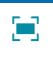.

* **Змяніць памер**  паміж *маленькім*, *сярэднім*, *вялікім* або *поўным*.

* **Выраўнаваць змест**  па *левым краі*, *цэнтры* або *правым краі*.

* **Змяніць тэму фону** , каб усталяваць колер пустога фону: *па змаўчанні* (тыя ж наладкі тэмы па змаўчанні, што і ў гісторыі, гл. [Наладкі гісторыі](story-setting.md#story-settings)), *светлы*, *цёмны* або *карыстальніцкі* (дазваляе наладзіць колер фону).

!!! увага
    Кнопкі *Выраўнаваць змест* і *Змяніць тэму фону* адключаны, калі памер выявы ўсталяваны на поўны экран.

### Відэа

Пасля дадання відэа ў фон вынік будзе прыкладна такім:

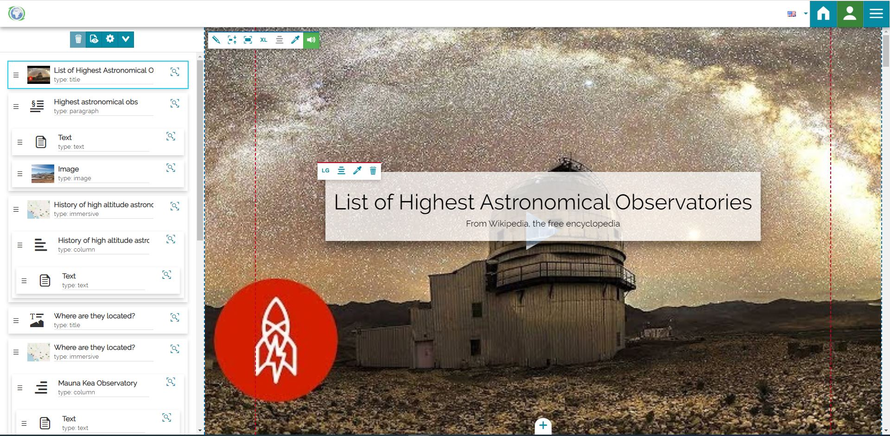

Панэль інструментаў фону ў гэтым выпадку крыху змяняецца, уключаючы дадатковую кнопку:

* **Аўдыё**, уключанае па змаўчанні, з дапамогай якога можна ўключыць або выключыць гук відэа.

Пры націску на кнопку *Зрабіць увесь фон бачным унутры кантэйнера*  з'яўляюцца яшчэ дзве кнопкі для выканання наступных аперацый:

* **Уключыць аўтапрайграванне** , каб відэа прайгравалася аўтаматычна, як толькі карыстальнік на яго трапляе.

* **Уключыць зацыкленне** , каб відэа бесперапынна паўтаралася.

!!! заўвага
    Прайграванне відэа будзе даступна толькі ў *рэжыме прагляду* гісторыі: яно недаступна ў рэжыме рэдагавання, за выключэннем папярэдняга прагляду ў рэдактары медыя.

### Карты

У гэтым выпадку, пры даданні карты ў якасці фону, вынік будзе такім:

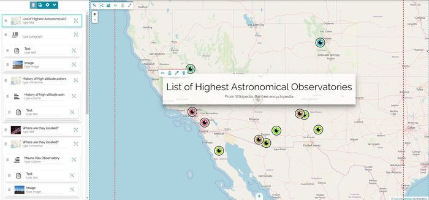

Панэль інструментаў фону ў гэтым выпадку крыху змяняецца, уключаючы дадатковую кнопку:

* **Рэдагаваць канфігурацыю карты**, з дапамогай якой можна [наладзіць карту](configure-map.md#configure-the-map).