# Панэль зместу

**************************

Панэль зместу (далей скарочана TOC - Table of Contents) — гэта прастора, дзе пералічаны ўсе слаі і групы слаёў. З дапамогай гэтай панэлі таксама можна выконваць наступныя аперацыі:

* Дадаваць і выдаляць слаі і групы

* Выконваць пошук сярод слаёў

* Змяняць становішча (і, такім чынам, парадак адлюстравання на карце) слаёў і груп

* Усталёўваць некаторыя опцыі адлюстравання непасрэдна з панэлі

* Кіраваць слаямі і групамі, а таксама запытваць слаі з дапамогай дзеянняў на панэлі інструментаў

## Наладкі і панэль інструментаў TOC

Карыстальнік можа атрымаць доступ да TOC з дапамогай кнопкі  ў левым верхнім куце акна прагляду карты. Пасля гэтага з'явіцца наступная панэль:

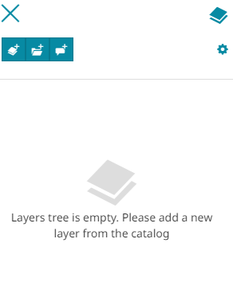

З дапамогай *панэлі інструментаў TOC* карыстальнік можа:

* **Дадаць новы слой** з дапамогай кнопкі : адкрыецца панэль [Каталога](catalog.md), і карыстальнік зможа выбраць жаданы слой для дадання яго на карту з дапамогай кнопкі .

<video class="ms-docimage" controls><source src="img/toc/add-layer.mp4"/></video>

* **Дадаць новую групу** з дапамогай кнопкі : адкрыецца наступнае акно, дзе карыстальнік можа ўвесці назву групы і дадаць яе ў TOC з дапамогай кнопкі .

<video class="ms-docimage" controls><source src="img/toc/add-group.mp4"/></video>

* **Дадаць новыя Анатацыі** з дапамогай кнопкі , як апісана ў раздзеле [Анатацыі](annotations.md).

Прыкладанне дазваляе карыстальніку наладжваць адлюстраванне груп і слаёў у *TOC*, уключаючы/выключаючы некаторыя опцыі з дапамогай кнопкі :

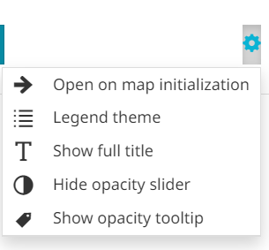

Тут карыстальнік можа:

* Уключыць/выключыць адкрыццё TOC пры ініцыялізацыі карты з дапамогай кнопкі .

* Змяніць тэму TOC, выбраўшы паміж **Тэмай па змаўчанні** або **Тэмай легенды** з дапамогай кнопкі . З *Тэмай легенды* ў карыстальніка няма магчымасці перацягваць становішча груп/слаёў. Гэты рэжым прадастаўляе спрошчаны і больш лёгкі TOC пры неабходнасці.

* Уключыць/выключыць магчымасць адлюстравання поўнай назвы груп/слаёў з дапамогай кнопкі .

* **Паказаць/схаваць паўзунок празрыстасці** для слаёў з дапамогай кнопкі .

* Калі *Паўзунок празрыстасці* ўключаны, **Паказаць/схаваць падказку аб празрыстасці** для слаёў з дапамогай кнопкі .

Пры пстрычцы правай кнопкай мышы па целе TOC, у дадатак да опцый, даступных у меню *Наладкі TOC*, апісаным вышэй, карыстальнік можа атрымаць доступ да некаторых дадатковых наладак, такіх як:

<video class="ms-docimage" controls><source src="img/toc/toc-settings-panel2.mp4"/></video>

* Паказаць усе групы і слаі, якія прысутнічаюць у TOC, уключыўшы **Паказаць усе даччыныя вузлы** з дапамогай кнопкі .

* Схаваць усе групы і слаі, якія прысутнічаюць у TOC, уключыўшы **Схаваць усе даччыныя вузлы** з дапамогай кнопкі .

* Згарнуць усе групы, якія прысутнічаюць у TOC, уключыўшы **Згарнуць усе даччыныя вузлы** з дапамогай кнопкі .

* Разгарнуць усе групы, якія прысутнічаюць у TOC, уключыўшы **Разгарнуць усе даччыныя вузлы** з дапамогай кнопкі . Легенда кожнага слоя таксама разгортваецца.

* Дадаць новую групу ў TOC з дапамогай кнопкі .

* Наблізіць карту да экстэнту, які ахоплівае ўсе слаі TOC, з дапамогай кнопкі 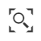.

### Пошук слаёў

З дапамогай TOC таксама можна выконваць пошук сярод дададзеных слаёў. Гэтую аперацыю можна выканаць, проста ўвёўшы назву (або яе частку) слоя ў радок пошуку:

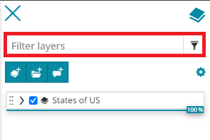

### Выбар становішча слаёў і груп

Карыстальнік можа змяніць становішча *Слоя* ў TOC, пстрыкнуўшы па значку перацягвання слоя .
Можна змяніць становішча слоя ўнутры яго групы або перамясціць яго ў іншую групу. Пасля гэтага парадак слоя на карце таксама зменіцца адпаведным чынам.
Ніжэй прыведзены прыклад змены становішча слоя з дапамогай функцыі перацягвання.

<video class="ms-docimage" controls><source src="img/toc/ded-layers.mp4"/></video>

Ту ж аперацыю можна выканаць і з любой *Групай* слаёў.

<video class="ms-docimage" controls><source src="img/toc/ded-groups.mp4"/></video>

Становішча слаёў таксама можна змяніць, націснуўшы на кнопку **Наладкі слоя** , даступную на панэлі інструментаў. Яна з'яўляецца пасля выбару слоя ў TOC. Гэтая кнопка адкрывае панэль, дзе карыстальнік можа выбраць групу прызначэння:

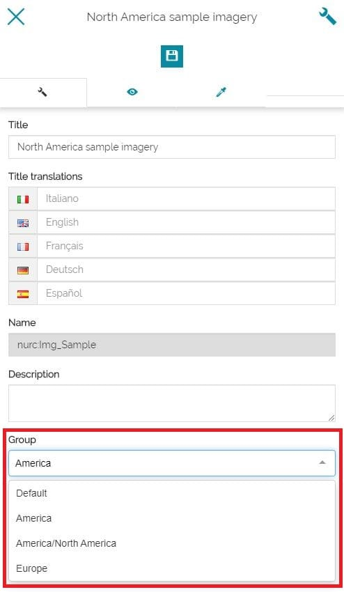

### Опцыі адлюстравання на панэлі

Непасрэдна з інтэрфейсу TOC карыстальнік можа атрымаць доступ да розных опцый адлюстравання. У прыватнасці, для слаёў можна:

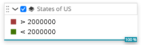

* Уключыць/выключыць бачнасць слоя з дапамогай сцяжка злева ад элемента слоя 

* Разгарнуць  або згарнуць  легенду слоя.

* Наладзіць празрыстасць слоя на карце, перамяшчаючы паўзунок празрыстасці.

Для груп карыстальнік можа:

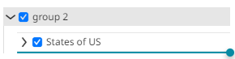

* Разгарнуць  або згарнуць  слаі або групы ўнутры.

* Уключыць/выключыць бачнасць групы з дапамогай сцяжка злева ад элемента групы 

!!! note "Заўвага"
   Калі карыстальнік выключае бачнасць групы, бачнасць на карце ўсіх слаёў і груп унутры яе змяняецца адпаведным чынам, але іх зыходны стан бачнасці ў TOC застаецца нязменным; проста ўсе ўкладзеныя элементы становяцца шэрымі, каб паказаць, што яны не бачныя на карце, а іншыя функцыі (напрыклад, праз кантэкстнае меню) застаюцца даступнымі.

## Наладкі і панэль інструментаў групы

Пасля выбару групы з'яўляецца наступная панэль інструментаў, і карыстальнік можа:

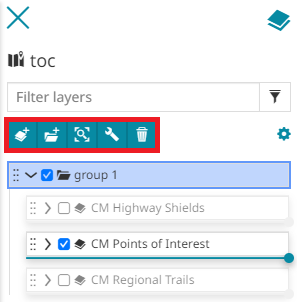

* **Дадаць слой у выбраную групу** з дапамогай кнопкі  (можна дадаць адзін або некалькі слаёў у групу)

* **Дадаць падгрупу ў выбраную групу** з дапамогай кнопкі  (можна дадаць адну або некалькі падгруп у выбраную групу)

* **Наблізіць да экстэнту выбраных слаёў**, каб наблізіць карту да экстэнту, які ахоплівае ўсе слаі, што належаць дадзенай групе, з дапамогай кнопкі 

* Адкрыць **Наладкі групы** з дапамогай кнопкі : адкрыецца панэль *Наладкі*, і карыстальнік можа:
  **-** Змяніць **Загаловак**
  **-** Усталяваць пераклад загалоўка групы, адкрыўшы ўсплывальнае акно **Лакалізаваць тэкст** з дапамогай кнопкі . Такім чынам, мова загалоўка будзе мяняцца ў адпаведнасці з бягучай мовай прыкладання
  **-** Рэдагаваць **Апісанне** групы
  **-** Наладзіць **Падказку**, якая з'яўляецца пры навядзенні курсора на элемент групы ў TOC. У гэтым выпадку карыстальнік можа вырашыць, ці будзе адлюстроўвацца *Загаловак*, *Апісанне*, абодва або нічога. Акрамя таго, можна ўсталяваць *Размяшчэнне* падказкі, выбраўшы *Зверху*, *Справа* або *Знізу*. У любым выпадку, калі загаловак цалкам бачны ў TOC, падказка не з'яўляецца.

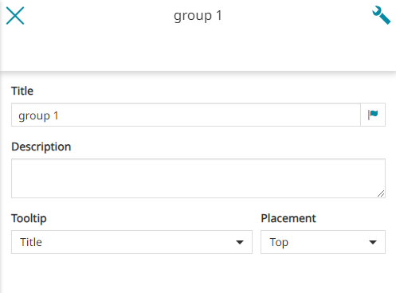

* **Выдаліць выбраную групу** і яе змесціва з дапамогай кнопкі 

Пстрыкнуўшы правай кнопкай мышы па групе, карыстальнік можа змяніць некаторыя ўласцівасці групы, такія як:

<video class="ms-docimage" controls><source src="img/toc/group-settings-panel.mp4"/></video>

* Паказаць усе групы і слаі, якія прысутнічаюць у выбранай групе, уключыўшы **Паказаць усе даччыныя вузлы** з дапамогай кнопкі .

* Схаваць усе групы і слаі, якія прысутнічаюць у выбранай групе, уключыўшы **Схаваць усе даччыныя вузлы** з дапамогай кнопкі .

* Актываваць узаемавыключальную бачнасць груп і слаёў унутры выбранай групы, уключыўшы **Актываваць узаемавыключальную бачнасць даччыных вузлоў** з дапамогай кнопкі . Такім чынам, на карце адначасова можа быць бачны толькі адзін слой або падгрупа.

* Згарнуць усе групы, якія прысутнічаюць у выбранай групе, уключыўшы **Згарнуць усе даччыныя вузлы** з дапамогай кнопкі .

* Разгарнуць усе групы, якія прысутнічаюць у выбранай групе, уключыўшы **Разгарнуць усе даччыныя вузлы** з дапамогай кнопкі . Легенда кожнага слоя таксама разгортваецца.

* Дадаць падгрупу пад выбранай групай з дапамогай кнопкі .

* Наблізіць карту да экстэнту слаёў выбранай групы з дапамогай кнопкі .

* Выдаліць выбраную групу з дапамогай кнопкі .

## Наладкі і панэль інструментаў слоя

Пры выбары слоя панэль інструментаў выглядае наступным чынам:

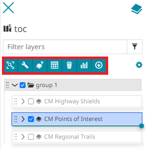

У гэтым выпадку карыстальніку дазволена:

* **Наблізіць да экстэнту выбранага слоя** : каб наблізіць карту да экстэнту слоя

* Атрымаць доступ да [Наладак выбранага слоя](layer-settings.md) 

* [Усталяваць фільтр](filtering-layers.md) для гэтага слоя 

* Атрымаць доступ да [Табліцы атрыбутаў](attributes-table.md) 

* **Выдаліць** выбраны слой 

* [Стварыць віджэты](widgets.md) для выбранага слоя 

* [Экспартаваць](export-data.md) дадзеныя выбранага слоя 

* Адкрыць **Метаданыя слоя**  (калі наладжана), каб атрымаць метададзеныя слоя з аддаленай крыніцы каталога.

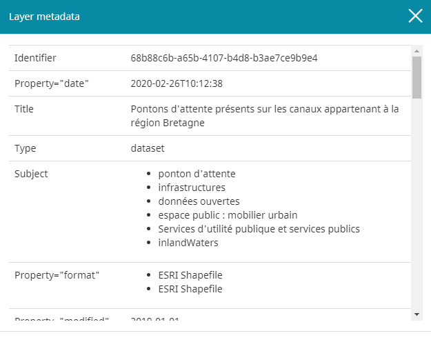

!!! note "Заўвага"
    
    Сродак картаграфічнага прагляду каталога метададзеных можа загружаць метададзеныя слоя з аддаленай службы CSW і аналізаваць іх для прадстаўлення карыстальніку ў адпаведнасці з прадастаўленай канфігурацыяй плагіна. Гэтая функцыя аўтаматычна працуе ў выпадку слаёў WMS, якія паступаюць з крыніцы каталога CSW, у той час як для слаёў, якія паступаюць непасрэдна з крыніцы каталога WMS, у GetCapabilities слоя WMS павінна прысутнічаць Спасылка на метададзеныя.

Пстрыкнуўшы правай кнопкай мышы па слоі, карыстальнік можа кіраваць некаторымі ўласцівасцямі слоя, такімі як:

<video class="ms-docimage" controls><source src="img/toc/layer-settings-panel.mp4"/></video>

* Наблізіць карту да экстэнту выбранага слоя з дапамогай кнопкі .

* Выдаліць выбраны слой з дапамогай кнопкі .

* Уключыць інструмент **Шторка** на карце для выбранага слоя з дапамогай кнопкі 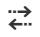.

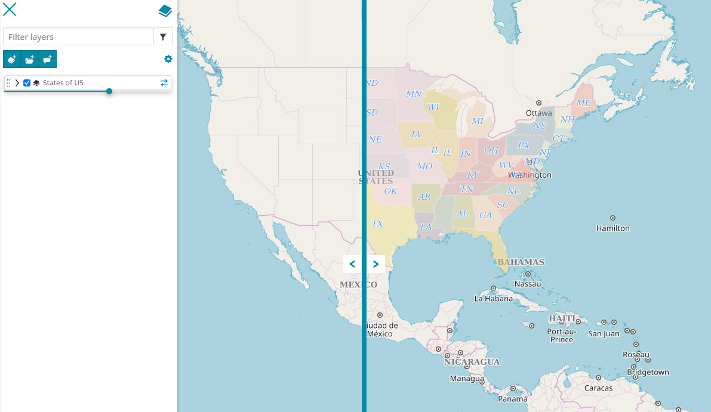

Карыстальнік можа змяніць арыентацыю шторкі з *Вертыкальнай* на *Гарызантальную*, націснуўшы на кнопку , якая з'явілася справа ад назвы слоя.

* Уключыць інструмент **Лупа** на карце для выбранага слоя з дапамогай кнопкі .

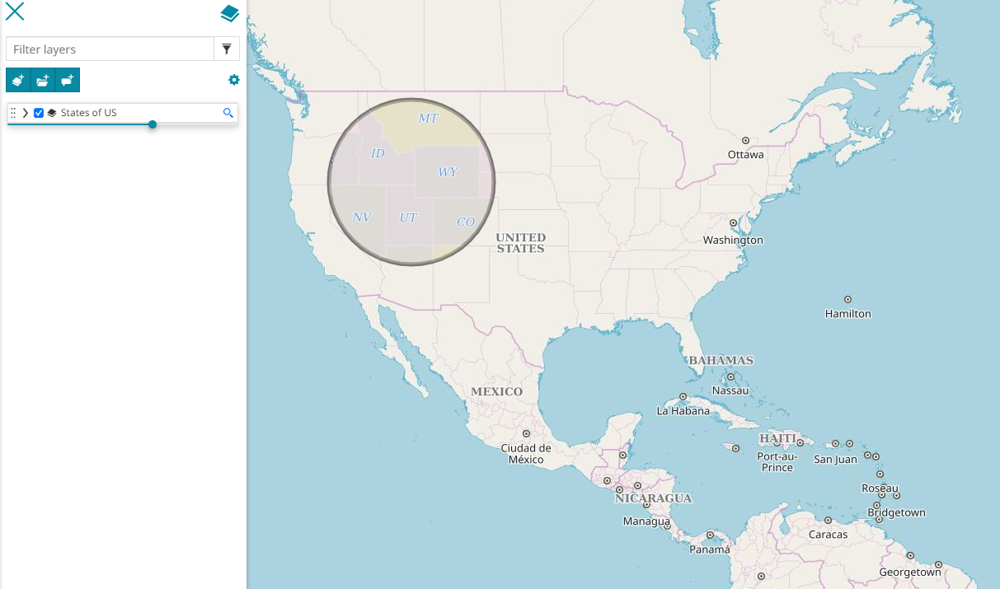

Карыстальнік можа змяніць памер лупы (`радыус`), націснуўшы на кнопку , якая з'явілася справа ад назвы слоя.