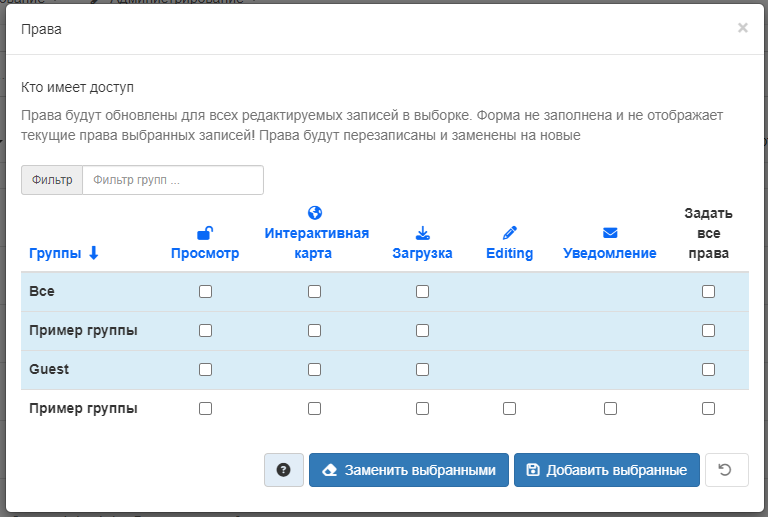

# Упраўленне правамі доступу

Каб кіраваць правамі доступу для запісаў метададзеных і любых прымацаваных дадзеных,
неабходна вызначыць **групы карыстальнікаў** і **правы доступу** карыстальнікаў у гэтых групах (прагляд метададзеных, загрузка дадзеных, прымацаваных да запісу і г. д.).

Напрыклад, можна паказаць, што метададзеныя і злучаныя з імі службы бачныя ўсім карыстачы інтэрнэту ці толькі карыстачам унутранай сеткі.
Правы доступу прызначаюцца для кожнай групы. У залежнасці ад профіля карыстальніка (Госць, Зарэгістраваны карыстач, Рэдактар, Адміністратар і т. д.)
будзе адрознівацца доступ да гэтых функцый.

## Прызначэнне правоў доступу

Каб прызначыць правы доступу, трэба выканаць наступныя дзеянні:

1. Знайсці запіс метададзеных у панэлі рэдактара. У радку кожнага запісу справа размяшчаецца кнопка `Правы`. Таксама ў рэжыме прагляду запісу можна націснуць `Кіраванне запісам` - `Правы`.
2. Націснуўшы кнопку `Правы`, з'явіцца выпадальнае меню. З дапамогай сцяжкоў можна прызначыць пэўныя правы доступу канкрэтным групам карыстальнікаў.
3. Кнопкі "Усталяваць усё" і "Зняць усё" дазваляюць усталёўваць і здымаць сцяжкі адначасова.

Ніжэй прыведзена кароткае апісанне правоў доступу, каб вызначыць, якія з іх трэба прызначыць той ці іншай групе (групам).

- **Прагляд**: Карыстальнікі з указанай групы/груп могуць праглядаць метададзеныя, напрыклад, калі яны адпавядаюць крытэрам пошуку, уведзеным такім карыстальнікам.

- **Загрузка**: Карыстальнікі з указанай групы/груп могуць загрузіць дадзеныя.

- **Інтэрактыўная карта**: Карыстальнікі названай групы/груп могуць атрымаць інтэрактыўную карту. Інтэрактыўная карта павінна быць створана асобна з дапамогай сервера вэб-карт, напрыклад GeoServer, які распаўсюджваецца разам з GeoNetwork.

- **Рэдагаванне**: Пры выпадковым выбары GeoNetwork запіс метададзеных можа з'явіцца ў раздзеле `Выбранае` на галоўнай старонцы GeoNetwork.

- **Апавяшчэнне**: Карыстальнікі ў названай групе атрымліваюць апавяшчэнне аб загрузцы дадзеных, прымацаваных да запісу метададзеных.

Перш чым пачынаць настройку правоў доступу, варта азнаёміцца ​​з раздзелам [Карыстальнікі, групы і ролі](../../administrator-guide/managing-users-and-groups/index.md#карыстальнікі-групы-і-ролі) у раздзеле “Адміністраванне карыстальнікаў і груп” дадзенага кіраўніцтва.

!!! Заўвага 

Агульнадаступны запіс метададзеных - гэта запіс метададзеных, які мае правы доступу прагляду для групы з імем "Усе".

Да дазволаў на прагляд і рэдагаванне запісу метададзеных ужываюцца наступныя правілы:

## Прагляд

*Адміністратар* можа праглядаць любыя метададзеныя.

*Рэцэнзент* можа праглядаць метададзеныя, калі:

- Метададзеныя з'яўляюцца агульнадаступнымі або
- Метададзеныя ўваходзяць у групу карыстальнік, членам якой з'яўляецца рэцэнзент.

*Карыстальнік-адміністратар* і *рэдактар* могуць праглядаць:

- Усе метададзеныя, для якіх абраны прывілей прагляду ў адной з груп, у якіх яны складаюцца.
- Усе метададзеныя, створаныя імі.

*Зарэгістраваны карыстальнік* можа праглядаць:

- Усе метададзеныя, для якіх абраны прывілей прагляду ў адной з груп, у якіх яны складаюцца.

Любы карыстач (які ўвайшоў у сістэму ці не) можа праглядаць агульнадаступныя метададзеныя.

## Рэдагаванне

*Адміністратар* можа рэдагаваць любыя метададзеныя.

*Рэцэнзент* можа рэдагаваць метададзеныя, калі:

- Уладальнік метададзеных з'яўляецца чальцом адной з груп, прызначаных рэцэнзенту.
- Ён з'яўляюцца ўладальнікамі метададзеных.

*Карыстальнік-адміністратар* ці *Рэдактар* можа рэдагаваць толькі створаныя ім метададзеныя.

# Ўстаноўка прывілеяў

## Устаноўка прывілеяў для запісу метададзеных

Кнопка для доступу да старонкі правоў доступу для запісу метададзеных адлюстроўваецца ў выніках пошуку або пры праглядзе запісу:

- Усіх адміністратараў
- Усіх рэцэнзентаў, якія з'яўляюцца членамі адной з груп, прызначаных уладальніку метададзеных.
- Уладальнік метададзеных

Толькі адміністратары і рэцэнзенты могуць рэдагаваць прывілеі для груп "Усе" і "Унутраная сетка".

## Устаноўка правоў доступу для выбранага набору запісаў метададзеных

Можна ўсталяваць прывілеі для абранага набору запісаў у выніках пошуку з дапамогай меню "дзеянні над абраным наборам".

Прымяняюцца наступныя правілы:

- групы - гэта тыя групы, да якіх належыць карыстальнік
- названыя прывілеі будуць прыменены толькі да запісаў, на якія ў карыстальніка ёсць правы валодання або адміністравання - любыя іншыя запісы будуць прапушчаны
- бягучыя правы доступу запісаў будуць скінуты і заменены выбраным прывілеем