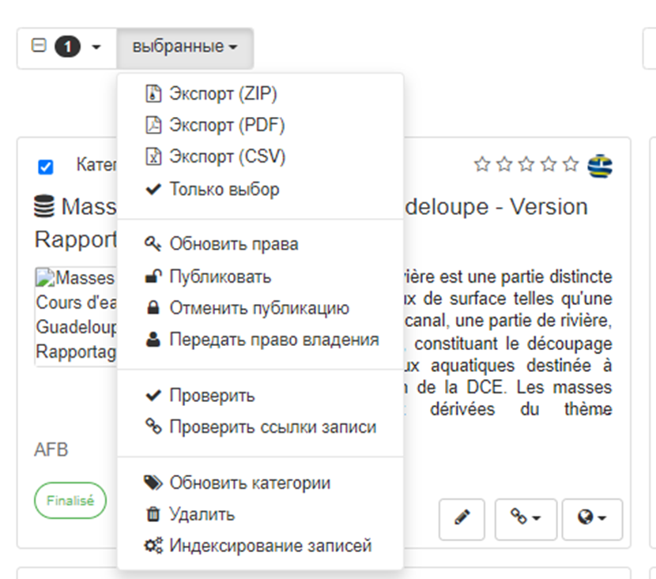
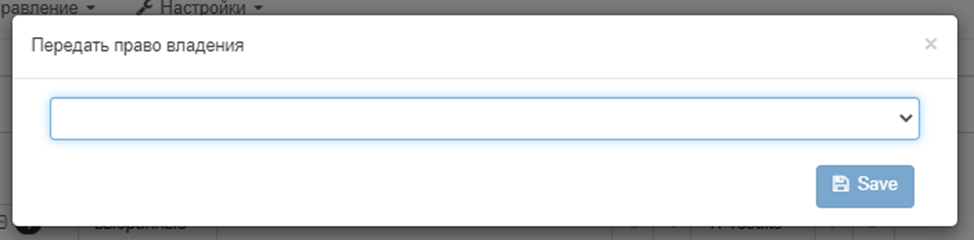

# Перадача правоў доступу

## Перадача права ўласнасці на метададзеныя

Калі неабходна перадаць права валодання метададзенымі ад аднаго карыстальніка іншаму для ўсіх ці вызначаных запісаў метададзеных,
варта выкарыстоўваць опцыю "Перадача права валодання".

Каб *перадаць права валодання* трэба:

1. З "дзеянняў над абраным наборам" у панелі рэдактара націснуць `Перадаць права валодання`.

Дзеянні ў панэлі `Перадача права валодання`:

- **Выбраць новага ўладальніка**: трэба выбраць карыстальніка з дапамогай поля з аўтададаткам.

!!! Заўвага 

Які расчыняецца спіс утрымоўвае толькі рэдактараў, якіх карыстач *можа* бачыць. Калі карыстальнік не з'яўляецца адміністратарам, ён зможа ўбачыць толькі пэўную колькасць усіх рэдактараў.

- **Абраць групу**: трэба абраць адну з груп, чальцом якой з'яўляецца гэты карыстач. Правы для груп "Усе" і "Унутраная сетка" не перадаюцца.