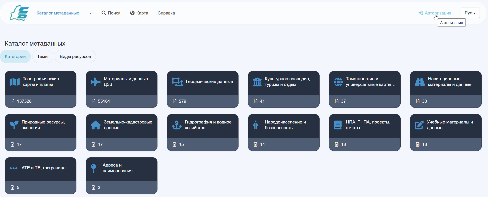
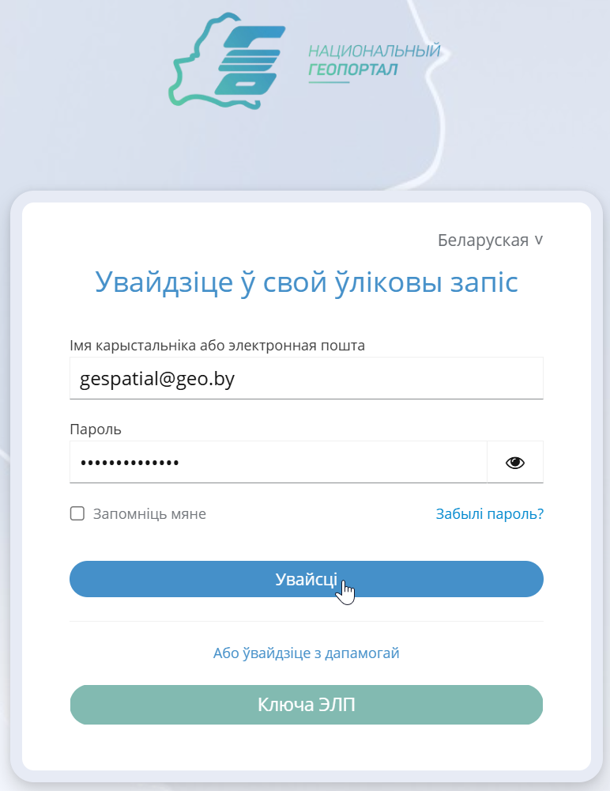
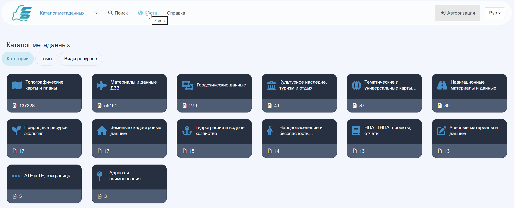

# Хуткі старт {#quick_start}

У якасці праграмнай асновы Каталога метададзеных Нацыянальнага геапартала выступае GeoNetwork - гэта дадатак, прызначанае для кіравання прасторава прывязанымі рэсурсамі. Яно дае карыстальнікам Нацыянальнага геапартала шырокі функцыянал для пошуку і рэдагавання метададзеных.

!!! Увага 
У гэтым артыкуле не апісваецца ўвесь магчымы функцыянал GeoNetwork. Для поўнага апускання ў магчымасці GeoNetwork рэкамендуем Вам поўнасцю азнаёміцца ​​са [*даведачнай дакументацыяй Каталога метададзеных*](https://nipd.by/geonetwork/doc/index.html).

Пераход у Каталог метададзеных даступны па спасылцы - [Каталог метададзеных](https://nipd.by/geonetwork). Рэкамендуем адкрыць Каталог метададзеных у суседняй укладцы Вашага вэб-браўзэра і азнаёміцца ​​з першапачатковымі дзеяннямі ў Каталогу, апісанымі ў гэтым артыкуле.

## Уваход у Каталог метададзеных

Для аўтарызацыі ў Каталогу метададзеных націсніце кнопку націсніце кнопку **Аўтарызацыя**, размешчаную ў правым верхнім куце інтэрфейсу:

Адкрыецца старонка ўводу дадзеных аўтарызацыі, запоўніўшы якія ў адпаведныя палі, націсніце **Увайсці**.

Таксама магчымы ўваход з выкарыстаннем ключа *Электроннага лічбавага подпісу*: для гэтага віду аўтарызацыі падрыхтуйце настроенае праграмнае забеспячэнне і сам лічбавы ключ, а таксама пры з'яўленні дыялогавага акна будзьце гатовы ўвесці пароль доступу.

!!! Увага 
Калі Вы забылі або згубілі пароль ад свайго ўліковага запісу, націсніце кнопку  і на адрас электроннай пошты, указаны пры рэгістрацыі (або ўказаны адміністратарам Вашага субпартала), будзе накіраваны аўтаматычнае ліст са спасылкай на скід пароля.

## Спосабы пошуку прасторавых дадзеных

Для таго, каб ажыццявіць пошук запісаў (у рэжыме паўнатэкставага пошуку або пошуку па выглядзе/катэгорыі/аўтару дадзеных) у Каталогу метададзеных або яго субпарталах, націсніце на кнопку **Пошук**.

**Спосабы ажыццяўлення пошуку метададзеных і іх фільтрацыі** у Каталогу метададзеных з прыкладамі падрабязна апісаны ў адпаведным артыкуле даведачнай дакументацыі - [Старонка пошуку](../../help/search/index.md).

## Выкарыстанне картаграфічнага прыкладання Каталога

Каталог метададзеных дазваляе нават незарэгістраваным карыстачам адчыняць для прагляду вэб-карты абавязковых набораў прасторавых дадзеных з выкарыстаннем *картаграфічнага прыкладання* - прагляд даступны па націску кнопкі **Карта**.

Інтэрфейс картаграфічнага дадатку падрабязна апісаны ў адпаведным раздзеле даведачнай дакументацыі - [Старонка карты](../../help/map/index.md).

## Прагляд і стварэнне запісаў метададзеных у Каталогу

Неаўтарызаваныя карыстачы могуць праглядаць апублікаваныя для ўсеагульнага доступу запісы ў сваіх субпартала і ў Каталогу метададзеных. Магчымасці па прагляду запісаў (настройка віду прагляду, экспарт метададзеных і г.д.) апісаны ў адпаведным артыкуле - [Прагляд запісу](../../help/record/index.md).

Аўтарызаваныя карыстачы могуць ствараць запісы метададзеных у сваіх электронных кабінетах. Для азнаямлення з парадкам стварэння запісаў, кіравання шаблонамі, імпарту метададзеных Вам варта вывучыць раздзел [Праца з запісамі метададзеных](../describing-information/index.md) даведачнай дакументацыі.