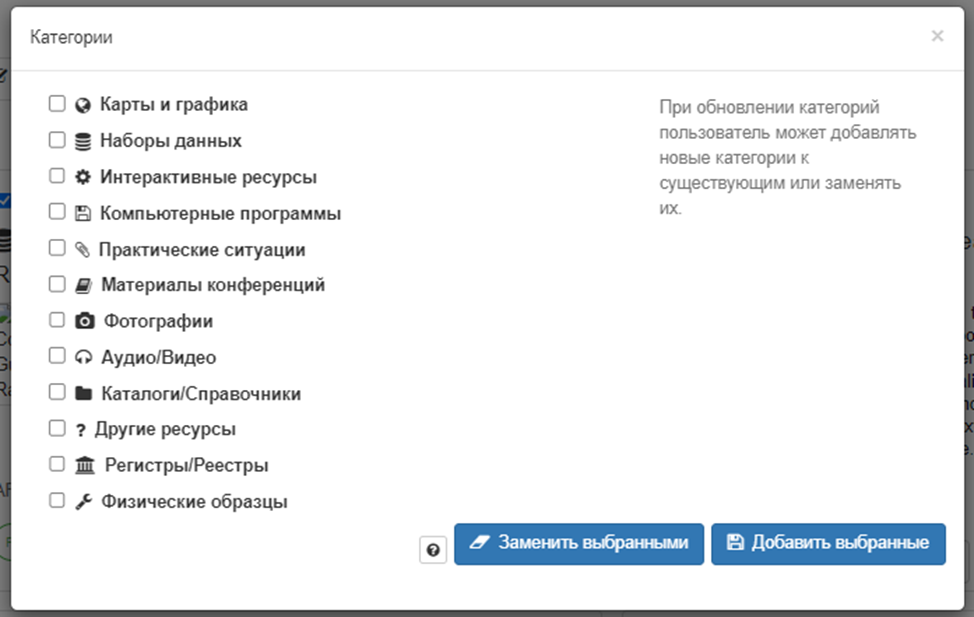
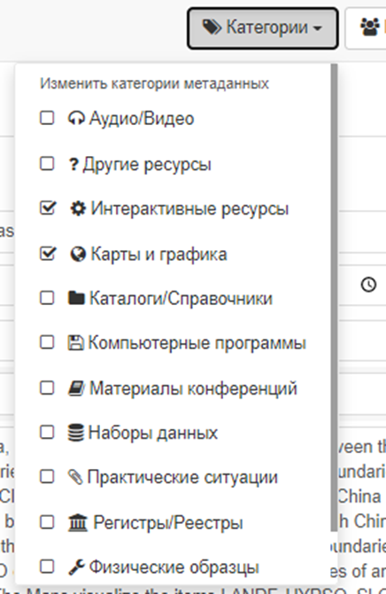

# Класіфікацыя па катэгорыях

Каталог у GeoNetwork можа вызначыць набор катэгорый,
якія карыстальнік можа выкарыстоўваць для класіфікацыі запісаў метададзеных для зручнасці пошуку або кіравання (гл. [Кіраванне катэгорыямі](../../administrator-guide/managing-classification-systems/managing-categories.md)).
Катэгорыі дадаюцца ў сам запіс метададзеных і не могуць быць экспартаваны пры зборы запісу (напрыклад, пры выкарыстанні пратаколу CSW).
Калі катэгорыя павінна распаўсюджвацца разам з метададзенымі, варта выкарыстоўваць іншыя пратаколы збору (напрыклад, GeoNetwork)
або выкарыстоўваць ключавыя словы (гл. [Тэгі па ключавых словах](tagging-with-keywords.md)).

Існуе 2 спосабы прысвоіць катэгорыі для запісу метададзеных:

- Знайдзіце патрэбную запіс, абярыце адну або некалькі запісаў і націсніце `Абнавіць катэгорыі` пры выбары. З дапамогай **тэгаў** карыстальнік можа альбо замяніць катэгорыі, альбо дадаць новыя.

- Знайдзіце запіс метададзеных, адкрыйце рэдактар ​​і націсніце на кнопку `Катэгорыі`. З'явіцца выпадальнае меню. Выкарыстоўваючы выпадальнае меню можна змяніць катэгорыі ў запісы метададзеных, прызначце адну або некалькі катэгорый, усталяваўшы адпаведныя сцяжкі.

