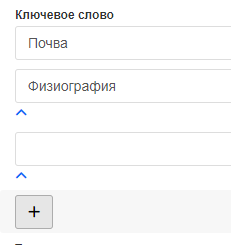

# Класіфікацыя па ключавых словах

Для запісу метададзеных таксама можна задаць **ключавыя словы**, якія дапамагаюць коратка апісаць рэсурс.
У рэжыме рэдагавання націсніце `Дадаць новыя ключавыя словы`. Пры стварэнні ключавога слова трэба запоўніць 2 палі:
- Назва ключавога слова
- Тып ключавога слова. Па змаўчанні можна абраць наступныя тыпы: часавы, месца, вобласць ведаў, пласт, тэма

