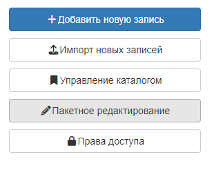
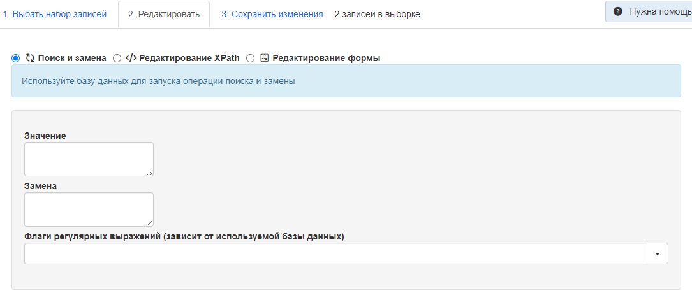
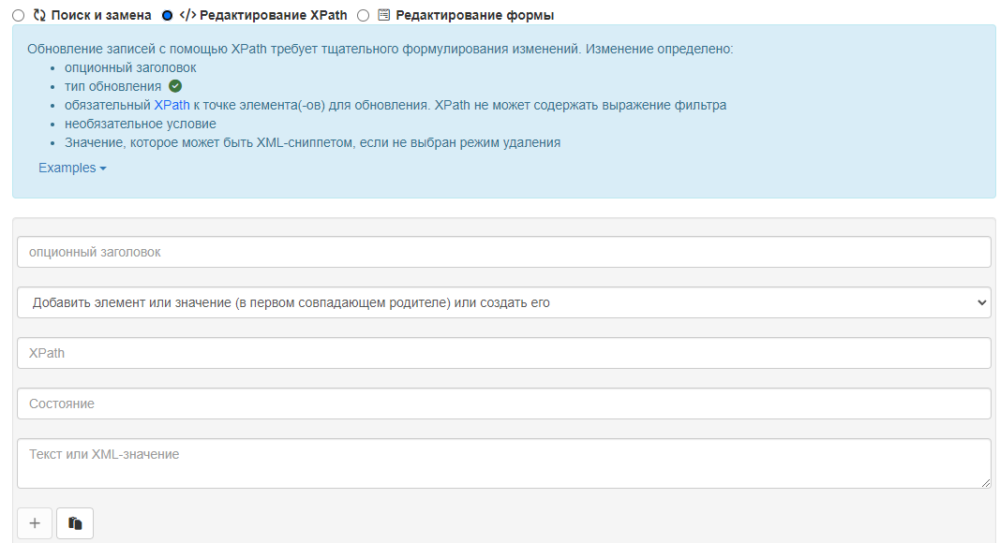
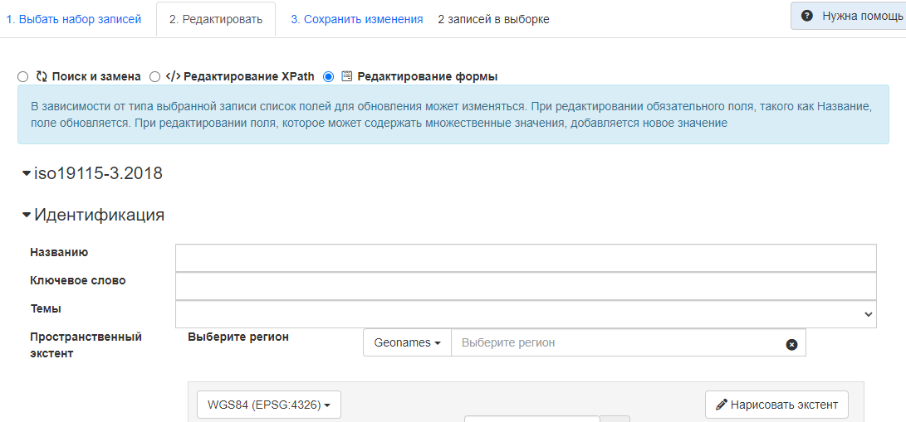
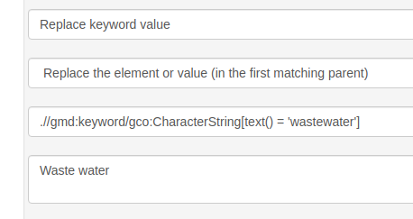
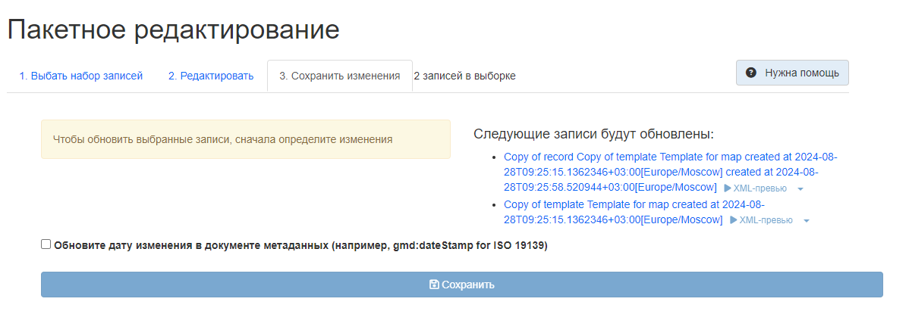

# Пакетнае рэдагаванне з кансолі рэдактара {#batchediting}

З панэлі рэдактара можна адкрыць акно пакетнага рэдагавання (адначасовае рэдагаванне некалькіх запісаў), 
дзе выконваецца рэдагаванне набору запісаў метададзеных (`Рэдагаванне`-`Панэль рэдактара`-`Пакетнае рэдагаванне`). 



Пакетнае рэдагаванне запісаў складаецца з 3 этапаў:

- Выбар набору запісаў (`Выбраць набор запісаў`)
- Вызначэнне тыпу правак (`Рэдагаваць`)
- Прымяненне правак (`Захаваць змены`)

## Вызначэнне правак

!!! warning "Папярэджанне"
    Няправільнае вызначэнне правак можа сапсаваць адразу некалькі запісаў. Рэкамендуецца зрабіць рэзервовую копію ўсіх запісаў.

Вызначыць праўкі можна 3 спосабамі:

-  Пошук і замена
-  Рэдагаванне XPath (мова запытаў да элементаў XML-дакумента)
-  Рэдагаванне формы

## Пошук і замена

Мае наступныя палі:
- `Значэнне` - элемент, які павінен быць заменены 
- `Замена` - элемент, на які павінна быць заменена `Значэнне`
- `Сцягі рэгулярных выразаў` - умовы, пры якіх павінна адбыцца замена



## Рэдагаванне XPath

Даступны пашыраны рэжым для вызначэння карыстальніцкіх правак, рэдагуючы XML-дакумент напрамую. Пашыраны рэжым складаецца з:

  - неабавязковай назвы
  - тып абнаўлення (`gn_add`-`Дадаць або стварыць элемент`, `gn_replace`-`Замяніць элемент`, `gn_delete`-`Выдаліць элемент`)
  - абавязковага XPath, які ўказвае на элемент(ы) для абнаўлення. XPath можа ўтрымліваць выраз фільтра.
  - значэнне, якое можа быць фрагментам XML або тэкставым радком, калі рэжым не `Выдаліць элемент`.



# Рэдагаванне формы

Змены вызначаюцца на аснове кожнага стандарту. Набор палёў па змаўчанні для рэдагавання даступны 
і можа быць пашыраны ў файле `config-editor.xml` стандарту.



Каб дадаць элемент, напрыклад, дадаць новы раздзел з ключавым словам у першую пазіцыю:

``` json
[{
  "xpath": "/gmd:identificationInfo/gmd:MD_DataIdentification/gmd:descriptiveKeywords[1]",
  "value": "<gn_add><gmd:descriptiveKeywords xmlns:gmd=\"http://www.isotc211.org/2005/gmd\" xmlns:gco=\"http://www.isotc211.org/2005/gco\"><gmd:MD_Keywords><gmd:keyword><gco:CharacterString>Waste water</gco:CharacterString></gmd:keyword><gmd:type><gmd:MD_KeywordTypeCode codeList=\"./resources/codeList.xml#MD_KeywordTypeCode\" codeListValue=\"theme\"/></gmd:type></gmd:MD_Keywords></gmd:descriptiveKeywords></gn_add>"
}]
```

Выдаліць элемент, напрыклад, выдаліць усе анлайн-рэсурсы, якія маюць пратакол `OGC:WMS`:

``` json
[{
  "xpath": ".//gmd:onLine[*/gmd:protocol/*/text() = 'OGC:WMS']",
  "value":"<gn_delete></gn_delete>"
}]
```

Замена элемента, напрыклад, замена значэння ключавога слова:

``` json
[{
  "xpath":".//gmd:keyword/gco:CharacterString[text() = 'wastewater']",
  "value":"<gn_replace>Waste water</gn_replace>"
}]
```



## Прымяненне змяненняў

Пры прымяненні змяненняў прымяняюцца прывілеі карыстальніка, таму калі карыстальнік не можа рэдагаваць абраны запіс, 
пакетнае рэдагаванне не будзе прыменена да гэтага запісу.

Справаздача аб пакетным рэдагаванні паказвае, колькі запісаў было апрацавана:



Пакетнае рэдагаванне таксама можа быць прыменена з дапамогай API: ``doc/api/index.html#/records/batchEdit>``.

## Прыклады

### Даданне новых ключавых слоў

- Рэжым: Дадаць элемент

- XPath (бацькоўскі элемент фрагмента XML для дадання). XML устаўляецца ў пазіцыю, вызначаную ў XSD.

    ``` xslt
    .//srv:SV_ServiceIdentification
    ```

-   XML

    ``` xml
    <mri:descriptiveKeywords xmlns:mri="http://standards.iso.org/iso/19115/-3/mri/1.0"
                             xmlns:gcx="http://standards.iso.org/iso/19115/-3/gcx/1.0"
                             xmlns:xlink="http://www.w3.org/1999/xlink">
      <mri:MD_Keywords>
        <mri:keyword>
          <gcx:Anchor xlink:href="http://inspire.ec.europa.eu/metadata-codelist/SpatialDataServiceCategory/infoMapAccessService">Service d’accès aux cartes</gcx:Anchor>
        </mri:keyword>
      </mri:MD_Keywords>
    </mri:descriptiveKeywords>
    ```

### Замена кадзіроўкі ключавога слова з CharacterString на якар

- Рэжым: Замяніць элемент

- XPath (бацькоўскі элемент фрагмента XML для ўстаўкі)

    ``` xslt
    .//mri:descriptiveKeywords[*/mri:keyword/gco:CharacterString/text() = 'infoMapAccessService']
    ```

-   XML

    ``` xml
    <mri:MD_Keywords  xmlns:cit="http://standards.iso.org/iso/19115/-3/cit/2.0"
                      xmlns:mri="http://standards.iso.org/iso/19115/-3/mri/1.0"
                      xmlns:mcc="http://standards.iso.org/iso/19115/-3/mcc/1.0"
                      xmlns:gco="http://standards.iso.org/iso/19115/-3/gco/1.0"
                      xmlns:gcx="http://standards.iso.org/iso/19115/-3/gcx/1.0"
                      xmlns:xlink="http://www.w3.org/1999/xlink">
      <mri:keyword>
        <gcx:Anchor xlink:href="http://inspire.ec.europa.eu/metadata-codelist/SpatialDataServiceCategory/infoMapAccessService">Service d’accès aux cartes</gcx:Anchor>
      </mri:keyword>
      <mri:type>
        <mri:MD_KeywordTypeCode codeList="http://standards.iso.org/iso/19115/resources/Codelists/cat/codelists.xml#MD_KeywordTypeCode"
                                 codeListValue="theme"/>
      </mri:type>
      <mri:thesaurusName>
         <cit:CI_Citation>
            <cit:title>
               <gcx:Anchor xlink:href="http://inspire.ec.europa.eu/metadata-codelist/SpatialDataServiceCategory#">Classification of spatial data services</gcx:Anchor>
            </cit:title>
            <cit:date>
               <cit:CI_Date>
                  <cit:date>
                     <gco:Date>2008-12-03</gco:Date>
                  </cit:date>
                  <cit:dateType>
                     <cit:CI_DateTypeCode codeList="http://standards.iso.org/iso/19115/resources/Codelists/cat/codelists.xml#CI_DateTypeCode"
                                          codeListValue="publication"/>
                  </cit:dateType>
               </cit:CI_Date>
            </cit:date>
            <cit:identifier>
               <mcc:MD_Identifier>
                  <mcc:code>
                     <gcx:Anchor xlink:href="http://metawal.wallonie.be/geonetwork/srv/fre/thesaurus.download?ref=external.theme.httpinspireeceuropaeumetadatacodelistSpatialDataServiceCategory-SpatialDataServiceCategory">geonetwork.thesaurus.external.theme.httpinspireeceuropaeumetadatacodelistSpatialDataServiceCategory-SpatialDataServiceCategory</gcx:Anchor>
                  </mcc:code>
               </mcc:MD_Identifier>
            </cit:identifier>
         </cit:CI_Citation>
      </mri:thesaurusName>
    </mri:MD_Keywords>
    ```

### Выдаленне XML-блока ключавога слова

- Рэжым: Выдаліць элемент

- XPath (бацькоўскі элемент фрагмента XML для ўстаўкі)

    ``` xslt
    (.//mri:descriptiveKeywords
        [*/mri:thesaurusName/*/cit:title/gcx:Anchor = 'Champ géographique'])[2]
    ```

-   XML (N/A)

### Выдаленне ключавога слова

- Рэжым: Выдаленне элемента

- XPath (бацькоўскі элемент фрагмента XML для ўстаўкі)

    ``` xslt
    .//gmd:keyword[*/text() = 'IDP_reference']
    ```

-   XML (N/A)

### Выдаліце associatedResource з тыпам partOfSeamlessDatabase, толькі калі гэта серыя

- Рэжым: Выдаленне элемента

- XPath (бацькоўскі элемент фрагмента XML для ўстаўкі)

    ``` xslt
    .[mdb:metadataScope/*/mdb:resourceScope/*/@codeListValue = 'series']//mri:associatedResource[*/mri:associationType/*/@codeListValue = "partOfSeamlessDatabase"]
    ```

-   XML (N/A)