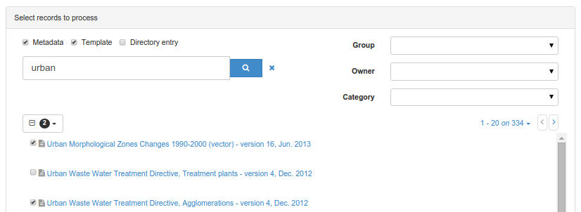
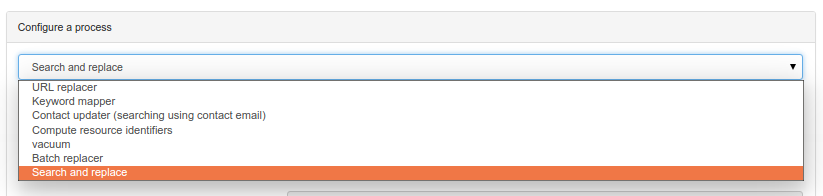
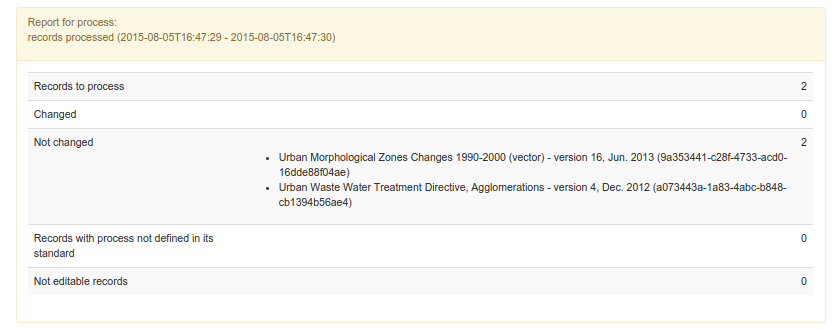
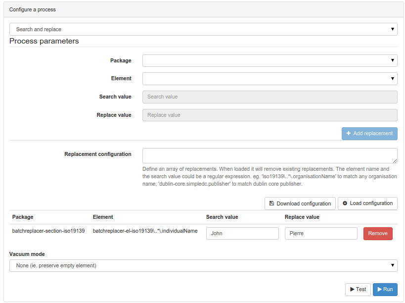
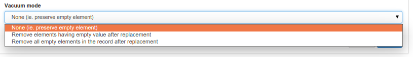

# Пакетнае рэдагаванне з кансолі адміністратара {#batchupdate_from_admin}

Карыстальнікі-адміністратары могуць з `кансолі адміністратара` адкрыць старонку `інструменты`, `Пакетны працэс`.

На гэтай старонцы адміністратар можа:

- Выбраць набор запісаў

    

- Выбраць працэс са спісу

    

> Гл. таксама

> Можна дадаць новы працэс. Глядзіце [Даданне пакетнага працэсу](batchupdate-xsl.md#даданне-пакетнага-працэсу).


- Вызначыць параметры працэсу (калі такія ёсць).
- Запусціць працэс і сачыць за ходам выканання.

Працэс можа быць ужыты толькі да тых запісаў, якія бягучы карыстальнік можа рэдагаваць. Калі гэта не так, запіс, для змянення якога карыстальніку не хапае прывілеяў, ігнаруецца і працэс працягваецца. Справаздача змяшчае наступную інфармацыю:

- Колькасць запісаў, якія падлягаюць апрацоўцы
- Колькасць запісаў, закранутых працэсам
- Колькасць запісаў без зменаў (для працэсу пошуку і замены)
- Колькасць запісаў, для якіх працэс не быў знойдзены (працэс залежыць ад стандарту і можа не існаваць у залежнасці ад стандарту).
- Колькасць запісаў, якія бягучы карыстальнік не можа рэдагаваць



Перад запускам працэсу рэкамендуецца зрабіць рэзервовую копію ўсіх запісаў метададзеных, якія падлягаюць абнаўленню, на выпадак, калі нешта пойдзе не так у працэсе.

!!! info «Todo»

    Дакументаванне іншых працэсаў


## Пошук і замена

Гэты працэс ажыццяўляе пошук значэнняў у элементах і замену іх іншымі значэннямі. Ён падтрымлівае запісы ISO19139 і Dublin Core. Канфігурацыя выглядае наступным чынам:



- Выберыце пакет (ISO19139 або Dublin Core)
- Выберыце элемент з гэтага пакета для замены (папярэдне наладжаным з'яўляецца элемент пра кантакт, але яго можна пашырыць - гл. ніжэй)
- Вызначце значэнне пошуку
- Вызначце замену
- Націсніце кнопку `Дадаць замену`.

Можна наладзіць і дадаць некалькі замен. Пасля наладкі карыстальнік можа захаваць канфігурацыю, націснуўшы `Загрузіць канфігурацыю`. Канфігурацыя загружаецца ў фармаце JSON і можа быць абноўлена і перазагружана пазней шляхам капіравання/ўстаўкі ў тэкставую вобласць канфігурацыі замены і націскання `Загрузіць канфігурацыю`.

Прыклад наладкі:
``` json
[{
  "package":"iso19139",
  "element":"iso19139\\..*\\.individualName",
  "searchval":"John",
  "replaceval":"Pierre"
  }]
```

У канфігурацыі `Элемент` вызначае мэтавы элемент у запісе метададзеных. Ён пачынаецца з ідэнтыфікатара схемы, а затым вызначае шлях да элемента. Гэта рэгулярны выраз, які можа выкарыстоўваць `.*` для пошуку ўсіх элементаў у дакуменце. Каб знайсці больш канкрэтны элемент, карыстальнік можа вызначыць поўны шлях, напрыклад `iso19139\\\.contact\\\.individualName`, каб знайсці толькі індывідуальнае імя кантакту ў метададзеных.

Значэнне `searchval` таксама ўяўляе сабой [рэгулярны выраз](https://www.regular-expressions.info/tutorial.html). Гэта можа быць просты тэкст або больш складаны выраз. Напрыклад, пры адлове груп пошук па `(.*)` і замена на `Mr $1` заменіць `John` на `Mr John`.

Апошні параметр - гэта рэжым "вакууму", які вызначае, што рабіць з пустымі элементамі:



Пасля завяршэння наладкі карыстальнік можа праглядзець змены, націснуўшы кнопку `Test`, а затым прымяніць іх з дапамогай `Run`.