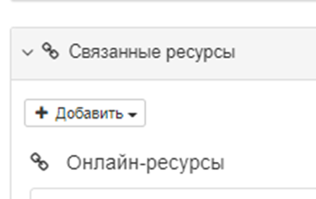
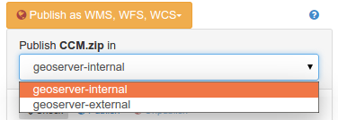
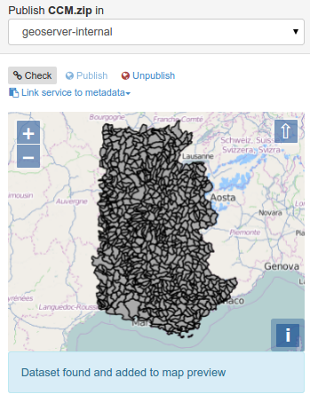
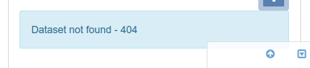
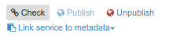

# Публікацыя ГІС-даных у картаграфічным серверы {#geopublication-usage}

У гэтым раздзеле апісваецца, як публікаваць даныя ГІС на картаграфічным серверы.

## Перш чым пачаць

- Адміністратару каталога неабходна наладзіць падключэнне да картаграфічных сервераў у інтэрфейсе адміністравання (гл. [Канфігурацыя картаграфічных сервераў для геапублікацый](../../administrator-guide/configuring-the-catalog/map-server-configuration.md)).
- Запісы метаданых павінны спасылацца на файлы ГІС або табліцы прасторавых баз даных (гл. [Звязванне табліцы базы даных або файла ГІС у сетцы](../associating-resources/linking-online-resources.md#linking-online-resources-georesource)).

Каб апублікаваць даныя з рэдактара метаданых на аддалены картаграфічны сервер, трэба выканаць наступныя дзеянні:

1.  Калі выяўлены прасторавы рэсурс і наладжаны адзін або некалькі картаграфічных сервераў, у рэдактары метаданых становіцца даступным акно для публікацыі геаданых.

    

2.  Са спіса трэба выбраць **рэсурс** для публікацыі. Адкрыецца акно, дзе прадстаўлены спіс даступных картаграфічных сервераў:

    

3.  Далей трэба выбраць **сервер**, на якім трэба апублікаваць даныя. Пасля выбару каталог праверыць, ці апублікаваны набор даных.

    Калі ён апублікаваны, то дадаецца на карту.

    

    Калі не, то ў паведамленні пра стан указваецца, што набор даных недаступны.

    

4.  З меню можна кіраваць працэсам публікацыі:

    

    - Кнопка `Праверка` - праверыць, ці апублікаваны ўжо набор даных на выбраным серверы.
    - Кнопка `Публікацыя` - зарэгістраваць даныя на выбраным картаграфічным серверы.
    - Кнопка `Не публікаваць` - зняць рэгістрацыю даных на выбраным картаграфічным серверы.
    - Кнопка `Звязаць службу з метаданымі` - дадаць спасылкі на службу OGC ў бягучы запіс метаданых для апублікаванага слоя.

## Наступныя крокі

Пасля рэгістрацыі слоя WMS у запісе метаданых можна стварыць агляд з дапамогай сэрвісу (гл. раздзел [Стварэнне мініяцюры з выкарыстаннем слаёў WMS](../associating-resources/linking-thumbnail.md#linking-thumbnail-from-wms)).