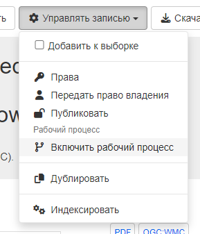
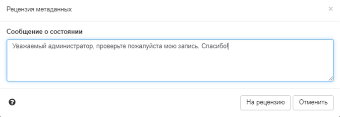
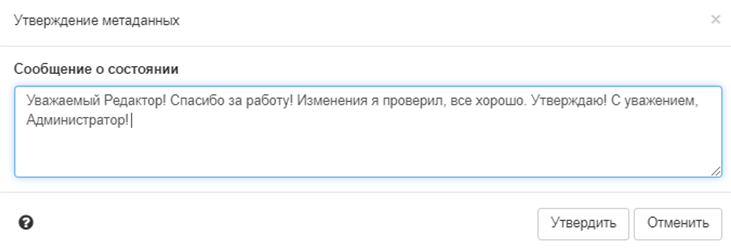
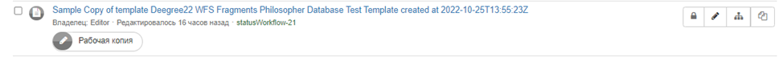

# Жыццёвы цыкл запісу

## Жыццёвы цыкл запісу

Запісы метададзеных маюць жыццёвы цыкл, у працэсе якога яны праходзяць праз некалькі станаў. Напрыклад, калі запіс:

- ствараецца і рэдагуецца `рэдактарам`, ён знаходзіцца ў стане `чарнавік`.
- праглядаецца `рэцэнзентам зместу` або запытваецца рэцэнзія, запіс пераходзіць у стан `Адпраўлена`.
- завершаны і выпраўлены `рэцэнзентам зместу`, ён знаходзіцца ў стане `Зацверджана`.
- заменены або выцеснены запіс знаходзіцца ў стане `Выдалена`.

У каталогу ёсць (пашыраемы) набор станаў, якія можа мець запіс метададзеных:

- `Невядома (Unknown)` - гэта стан па змаўчанні - пра статус запісу метададзеных нічога не вядома.
- `Чарнавік (Draft)` - запіс знаходзіцца ў працэсе стварэння або рэдагавання.
- `Адпраўлена (Submitted)` - запіс быў адпраўлены на зацвярджэнне для праверкі зместу.
- `Ухвалена (Approved)` - рэцэнзент зместу разгледзеў і ўхваліў запіс метададзеных.
- `Адхілена (Rejected)` - спецыяліст па аглядзе зместу прагледзеў і адхіліў запіс метададзеных.
- `Выдалена (Retired)` - запіс быў выдалены.

Працоўны працэс можа быць уключаны для ўсяго каталога, пэўных груп або на ўзроўні асобных запісаў.

!!! note "Заўвага"

    Каб уключыць працоўны працэс для ўсяго каталога або пэўных груп, варта зайсці ў Адміністраванне --> Наладкі --> Працоўны працэс метададзеных. У рэжыме працоўнага працэсу ў выпадку змены ўхваленых запісаў вы працуеце з копіяй ухваленага запісу. Змены ў запісе не будуць бачныя карыстальнікам па-за вашай групай да таго часу, пакуль зменены запіс не будзе ўхвалены зноў.

Каб уключыць працоўны працэс у асобнага запісу і змяніць статус з `Невядома` на `Чарнавік`, 
трэба выбраць `Кіраваць запісам` - `Уключыць працоўны працэс` у праглядзе метададзеных:



Пасля завяршэння рэдагавання можна адправіць запіс на праверку рэцэнзенту (`Кіраваць запісам` - `На праверку`). 
Адкрыецца ўсплывальнае акно, у якім можна пакінуць паведамленне для рэцэнзента.



Карыстальнік з роляй «Рэцэнзент» можа зацвердзіць запіс: імгненна ўхваліць свой запіс (без адпраўкі) або ўхваліць запіс, 
які быў адпраўлены яму на разгляд. У працэсе праверкі рэцэнзент можа скарыстацца опцыяй гісторыі версій, 
якая паказвае адрозненні паміж рознымі версіямі запісу. У працэсе зацвярджэння рэцэнзент зместу таксама можа ўсталяваць узровень доступу да запісу, 
напрыклад, усталяваць узровень доступу public (бачны для ўсіх).



Рэдактарам і рэцэнзентам будуць адпраўляцца апавяшчэнні аб змене статусу адпаведнага запісу. 
На старонцы панэлі рэдактара можна ўбачыць, якія запісы абнаўляюцца або праглядаюцца на бягучы момант. 
Адлюстроўваецца метка, якая паказвае, што для гэтага запісу даступная «працоўная копія». Вы можаце націснуць на ярлык, каб перайсці да бягучай працы.




## Дзеянні пры змене статусу

Існуе два дзеянні для змены статусу (на Java), якія могуць быць выкарыстаны сайтамі для забеспячэння пэўных паводзін:

- `statusChange (статус змяніўся)` - Гэта дзеянне выклікаецца, калі статус змяняецца карыстальнікам, напрыклад, калі запісы `Чарнавік` усталёўваюцца на `Адпраўлена`, і можа быць выкарыстана, напрыклад, для адпраўкі апавяшчэнняў іншым карыстальнікам, закранутым гэтай зменай.
- `onEdit (рэдагуецца)` - Гэта дзеянне выклікаецца, калі запіс рэдагуецца і захоўваецца, і можа выкарыстоўвацца, напрыклад, для скіду запісаў са статусам `Ухвалена` ў статус `Чарнавік`.

Набор дзеянняў прадастаўляецца па змаўчанні. Яны могуць быць наладжаны або заменены сайтамі, якія хочуць забяспечыць іншыя або больш шырокія паводзіны.

Пара дзеянняў па змене статусу метададзеных, вызначаных у Java, прадастаўляецца па змаўчанні ў GeoNetwork з дапамогай класа org.fao.geonet.services.metadata.DefaultStatusActions.java (гл. `core/src/main/java/org/fao/geonet/kernel/metadata/DefaultStatusActions.java`).

### Пры змене статусу

Гэта дзеянне выклікаецца пры змене статусу карыстальнікам. Тое, што адбываецца, залежыць ад змены статусу:

- калі карыстальнік-рэдактар змяняе стан запісу (запісаў) метададзеных з `Чарнавік` або `Невядома` на `Адпраўлена`, рэцэнзенты запісу атрымліваюць апавяшчэнне аб змене статусу па электроннай пошце, якое выглядае наступным чынам. Яны могуць увайсці ў сістэму і перайсці па спасылцы, указанай у лісце, каб атрымаць доступ да адпраўленых запісаў. Вось прыклад ліста, адпраўленага гэтым дзеяннем:

    ``` text
    Date: Tue, 13 Dec 2011 12:58:58 +1100 (EST)
    From: Metadata Workflow <feedback@localgeonetwork.org.au>
    Subject: Metadata records SUBMITTED by userone@localgeonetwork.org.au (User One) on 2011-12-13T12:58:58
    To: "reviewer@localgeonetwork.org.au" <Reviewer@localgeonetwork.org.au>
    Reply-to: User One <userone@localgeonetwork.org.au.au>
    Message-id: <1968852534.01323741538713.JavaMail.geonetwork@localgeonetwork.org.au>

    These records are complete. Please review.

    Records are available from the following URL:
    http://localgeonetwork.org.au/geonetwork/srv/en/main.search?_status=4&_statusChangeDate=2011-12-13T12:58:58
    ```

- калі `Рэцэнзент` змяняе стан запісу (запісаў) метададзеных з `Адпраўлена` на `Прынята` або `Адхілена`, уладальнік запісу метададзеных атрымлівае апавяшчэнне аб змене статусу па электроннай пошце. Электронны ліст, атрыманы ўладальнікам запісу метададзеных, выглядае наступным чынам. Карыстальнік таксама можа ўвайсці ў сістэму і скарыстацца спасылкай, указанай у лісце, каб атрымаць доступ да ўхваленых/адхіленых запісаў. Вось прыклад электроннага ліста, адпраўленага гэтым дзеяннем:

    ``` text
    Date: Wed, 14 Dec 2011 12:28:01 +1100 (EST)
    From: Metadata Workflow <feedback@localgeonetwork.org.au>
    Subject: Metadata records APPROVED by reviewer@localgeonetwork.org.au (Reviewer) on 2011-12-14T12:28:00
    To: "User One" <userone@localgeonetwork.org.au>
    Message-ID: <1064170697.31323826081004.JavaMail.geonetwork@localgeonetwork.org.au>
    Reply-To: Reviewer <reviewer@localgeonetwork.org.au>

    Records approved - please resubmit for approval when online resources attached

    Records are available from the following URL:
    http://localgeonetwork.org.au/geonetwork/srv/en/main.search?_status=2&_statusChangeDate=2011-12-14T12:28:00
    ```


### Пры рэдагаванні

Гэта дзеянне выклікаецца, калі запіс рэдагуецца і захоўваецца карыстальнікам. Калі карыстальнік не ўказаў, што змены былі нязначнай праўкай і бягучы статус запісу `Ухвалена`, то па змаўчанні будзе ўсталяваны статус `Чарнавік`.

## Змена дзеянняў са статусам

Гэтыя дзеянні могуць быць заменены на розныя варыянты паводзін шляхам:

- напісання Java-кода ў выглядзе новага класа, які рэалізуе інтэрфейс, вызначаны ў `org.fao.geonet.services.metadata.StatusActions.java`, і размяшчэння скампіляванай версіі класа ў шляху класаў GeoNetwork
- вызначэння назвы новага класа ў параметры канфігурацыі statusActionsClass у файле `web/geonetwork/WEB-INF/config.xml`.