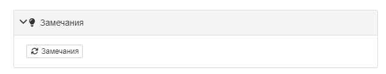
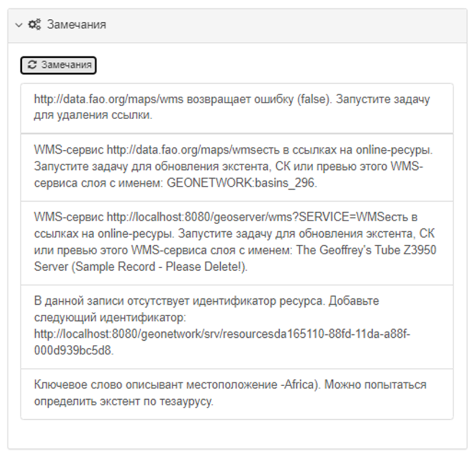

# Падказкі па паляпшэнні метаданых {#metadata_suggestion}

Рэдактар метаданых можна наладзіць так, каб ён аналізаваў метаданыя і даваў падказкі па іх паляпшэнні.

Працэсы, даступныя ў дадзенай схеме метаданых, вызначаюцца ў файле схемы `suggest.xsl`, напрыклад <https://github.com/metadata101/iso19139.mcp/blob/master/src/main/plugin/iso19139.mcp/suggest.xsl>.

Файлы xsl для кожнага працэсу знаходзяцца ў папцы `process` унутры схемы.

Каб выкарыстоўваць службу падказак для метаданых, яна павінна быць вызначана хаця б у адным з праглядаў макета рэдагавання шаблона.

У рэжыме рэдагавання карыстальнік павінен націснуць на значок у майстры прапаноў, каб запусціць службу падказак для метаданых:

Калі ў працэсе аналізу праграма не знойдзе магчымыя паляпшэнні метаданых, працэс не дасць вынікаў. 
Калі праграма вызначыць месцы, якія можна палепшыць у запісе метаданых, гэта будзе паказана ў выніках:

