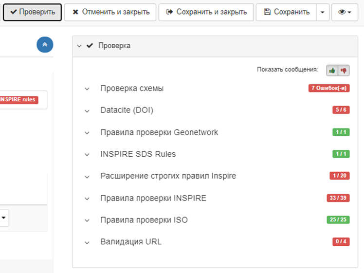
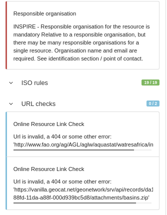
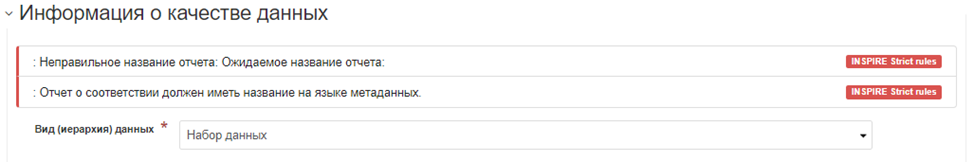
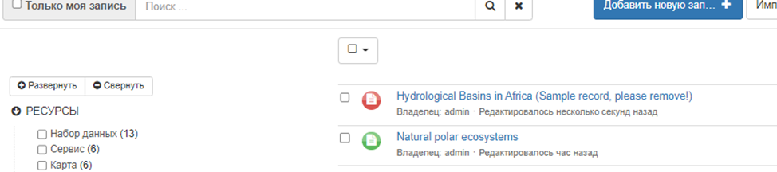

# Праверка запісаў метададзеных {#validation}

1.  У рэдактары запісу метададзеных трэба націснуць кнопку `Праверка`, каб запусціць праверку. На правай панэлі адлюстроўваюцца ўсе вынікі праверкі па ўзроўнях праверкі:

    

2.  Для адлюстравання памылак націсніце на значкі вялікіх пальцаў уверх ці ўніз. Памылкі, вылучаныя сінім колерам, прызначаны толькі для інфармацыі і не ўплываюць на глабальную праверку запісу:

    

    Рэдактар таксама паведамляе пра паведамленні аб памылках непасрэдна ў форме каля праблемных элементаў, дзе гэта магчыма:

    

3.  Пасля праверкі запісу статус праверкі захоўваецца і адлюстроўваецца на старонцы панэлі рэдактара:

    

Карыстальнік можа адфільтраваць запісы метададзеных у адпаведнасці з іх статусам праверкі з дапамогай множнага выбару на панэлі рэдактара.

## Наладка праверкі

Адміністратары каталога могуць наладзіць працэс праверкі запісу метададзеных, каб яна аўтаматычна праводзілася кожны раз, 
калі карыстальнік-рэдактар выходзіць або закрывае інтэрфейс рэдагавання метададзеных (гл. раздзел [Канфігурацыя сістэмы](../../administrator-guide/configuring-the-catalog/system-configuration.md)), 
а таксама наладзіць узроўні праверкі (гл. [Наладка ўзроўняў праверкі](../../administrator-guide/managing-metadata-standards/configure-validation.md)). У выпадку запісаў INSPIRE можна выкарыстоўваць аддалены валідатар (інструмент праверкі) (гл. [Валідацыя INSPIRE](../../administrator-guide/configuring-the-catalog/inspire-configuration.md#праверка-inspire)).