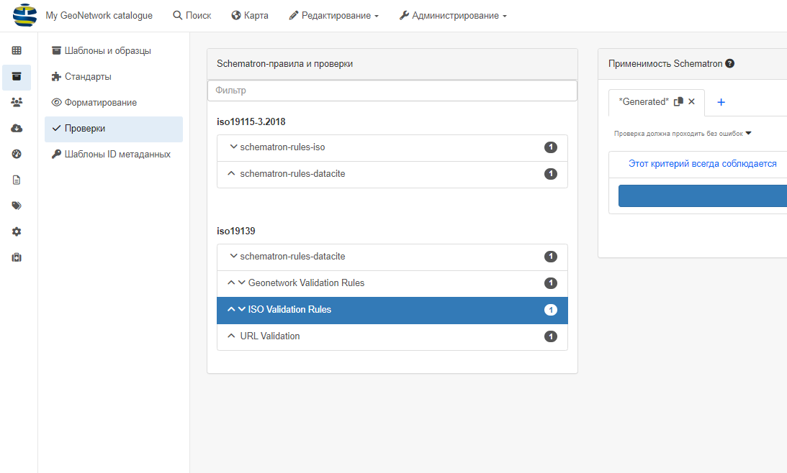
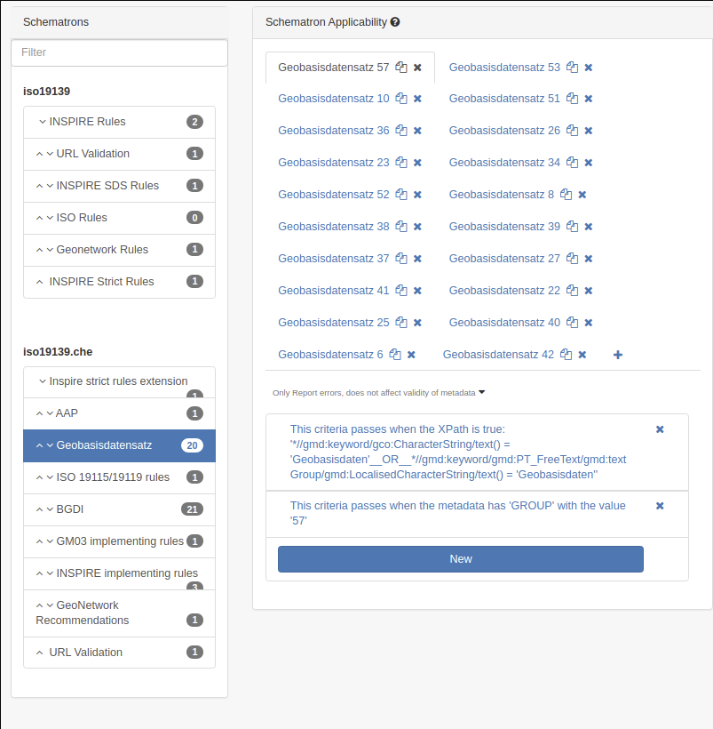

# Настройка уровней проверки {#configure-validation}

Каждый стандарт определяет уровни проверки. Перейдите в `Администрирование` --> `Стандарты и шаблоны` --> `Проверки`. 
(с помощью schematron - см. раздел [Использование плагинов схемы](../../customizing-application/implementing-a-schema-plugin.md)). 
По умолчанию ISO19139 предлагает проверку с использованием:

- правила ISO
- правила INSPIRE (TG v1.3)
- Правила GeoNetwork (только для многоязычных записей)
- Проверка URL

Все уровни будут применяться по умолчанию при проверке, а интерфейс администратора позволяет настраивать правила:

- является обязательным для проверки (будет отображаться зеленым/красным цветом в зависимости от статуса)
- только для информации (будет отображаться синим цветом)
- игнорируется.

Также можно задать условия, чтобы применять правила только к определенным записям. Условие может быть определено на:

- XPath
- группа
- Профиль пользователя
- Ключевое слово

Например, [geocat.ch](https://www.geocat.ch/) определяет для профиля GM03 ISO19139 правила в зависимости от групп (т. е. партнеров) 
и типа набора данных, например, базовых геоданных.

