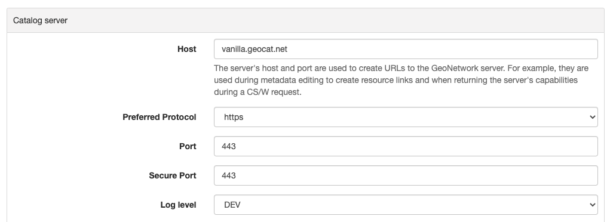

# Режим аутентификации

По умолчанию каталог использует внутреннюю базу данных для управления пользователями и аутентификации. 
Однако доступны и другие механизмы аутентификации:

- [Настройка LDAP](authentication-mode.md#authenticatio-ldap)
- [Настройка иерархии LDAP] (authentication-mode.md#authentication-ldap-hierarchy)
- [Настройка CAS] (authentication-mode.md#authentication-cas)
- [Настройка OpenID Connect в OAUTH2] (authentication-mode.md#authentication-openid)
- [Настройка Keycloak] (authentication-mode.md#authentication-keycloak)
- [Настройка Shibboleth](authentication-mode.md#authentication-shibboleth)

Какой режим использовать, определяется в **`WEB-INF/config-security/config-security.xml`** или с помощью переменной среды `geonetwork.security.type`.

Раскомментируйте соответствующую строку в **`WEB-INF/config-security/config-security.xml`**:

``` xml
<import resource="config-security-{mode}.xml"/>
```

## Настройка LDAP {#authenticatio-ldap}

[Протокол упрощенного доступа к каталогам (LDAP)](https://en.wikipedia.org/wiki/Ldap) 
позволяет GeoNetwork проверять имена пользователей и пароли к удаленному хранилищу идентификационных данных. 
В реализации LDAP используются элементы пользовательского интерфейса для входа в GeoNetwork по умолчанию.

В настоящее время в GeoNetwork есть 2 подхода к настройке LDAP. 
Проверьте также альтернативный подход в разделе [Настройка иерархии LDAP](authentication-mode.md#authentication-ldap-hierarchy).

Конфигурация LDAP определена в `WEB-INF/config-security/config-security.properties`.
Администратор может настроить свою среду, обновив предыдущий файл или переопределив свойства в файле 
`WEB-INF/config-security/config-security-overrides.properties`.


1.  Определите LDAP-соединение:

    - `ldap.base.provider.url`: Указывает порталу, где находится сервер LDAP. 
       Убедитесь, что компьютер с каталогом может подключиться к компьютеру с LDAP-сервером. 
       Также убедитесь, что открыты соответствующие порты и т. д.
    
    - `ldap.base.dn`: обычно это выглядит примерно так: «dc=[organizationnamehere],dc=org».
    
    - `ldap.security.principal` / `ldap.security.credentials`: Определите пользователя администратора LDAP, 
       который будет использоваться для привязки к LDAP. Если не определить, то будет произведена анонимная привязка. 
       Principal - это имя пользователя, а credentials - пароль.

    ``` text
    # LDAP security properties
    ldap.base.provider.url=ldap://localhost:389
    ldap.base.dn=dc=fao,dc=org
    ldap.security.principal=cn=admin,dc=fao,dc=org
    ldap.security.credentials=ldap
    ```

    Чтобы убедиться в правильности настроек, попробуйте подключиться к LDAP-серверу с помощью приложения LDAP-браузера.

2.  Определите, где искать пользователей в структуре LDAP для аутентификации:

    - `ldap.base.search.base`: это место, где каталог будет искать пользователей для аутентификации.
    - `ldap.base.dn.pattern`: это отличительное имя пользователя для привязки. `{0}` заменяется именем пользователя, введенным на экране регистрации.
    
    ``` text
    ldap.base.search.base=ou=people
    ldap.base.dn.pattern=uid={0},${ldap.base.search.base}
    #ldap.base.dn.pattern=mail={0},${ldap.base.search.base}
    ```

### Настройки авторизации

При использовании LDAP информация о пользователе и привилегии для GeoNetwork могут быть определены из атрибутов LDAP.

#### Информация о пользователе

Информация о пользователе может быть получена из настройки LDAP для каждого пользовательского атрибута в базе данных каталога, 
которому соответствуют атрибуты LDAP. Если атрибут пуст или не определен, можно задать значение по умолчанию. 
Значение свойства состоит из двух частей, разделенных символом `,`. Первая часть - это имя атрибута, 
а вторая часть - значение по умолчанию на случай, если имя атрибута не определено или значение атрибута в LDAP пустое.

Конфигурация следующая:

``` text
# Map user information to LDAP attributes and default values
# ldapUserContextMapper.mapping[name]=ldap_attribute,default_value
ldapUserContextMapper.mapping[name]=cn,
ldapUserContextMapper.mapping[surname]=givenName,
ldapUserContextMapper.mapping[mail]=mail,data@myorganization.org
ldapUserContextMapper.mapping[organisation]=,myorganization
ldapUserContextMapper.mapping[kind]=,
ldapUserContextMapper.mapping[address]=,
ldapUserContextMapper.mapping[zip]=,
ldapUserContextMapper.mapping[state]=,
ldapUserContextMapper.mapping[city]=,
ldapUserContextMapper.mapping[country]=,
```

#### Настройка прав доступа (привелегий)

Группы пользователей и роли пользователей могут быть установлены как на основе информации LDAP, так и без нее. 
По умолчанию управление привилегиями пользователей осуществляется из локальной базы данных. 
Если для определения привилегий пользователя необходимо использовать информацию LDAP, 
установите для свойства `ldap.privilege.import` значение "true":

``` text
ldap.privilege.import=true
```

При импорте привилегий из LDAP администратор каталога может принять решение о создании групп, 
определенных в LDAP и не определенных в локальной базе данных. Для этого установите значение true для следующего свойства:

``` text
ldap.privilege.create.nonexisting.groups=false
```

Чтобы определить, к каким группам принадлежит пользователь и какой профиль является его профилем:

``` text
ldapUserContextMapper.mapping[privilege]=groups,sample
# If not set, the default profile is RegisteredUser
# Valid profiles are ADMINISTRATOR, USER_ADMIN, REVIEWER, EDITOR, REGISTERED_USER, GUEST
ldapUserContextMapper.mapping[profile]=privileges,RegisteredUser
```

Настройка атрибутов:

- атрибут `privilege` содержит группу, членом которой является данный пользователь. Допускается использование более чем одной группы.
- атрибут `profile` содержит профиль пользователя.

Допустимыми ролями пользователя являются:

- Администратор
- Пользователь-администратор (группы)
- Рецензент
- Редактор
- Зарегистрированный пользователь
- Гость

Если атрибут LDAP, содержащий профили, не соответствует списку профилей в каталоге, может быть определено сопоставление:

``` text
# Map LDAP custom profiles to catalog profiles. Not used if ldap.privilege.pattern is defined.
ldapUserContextMapper.profileMapping[Admin]=Administrator
ldapUserContextMapper.profileMapping[Editor]=Reviewer
ldapUserContextMapper.profileMapping[Public]=RegisteredUser
```


Например, в предыдущей конфигурации значение атрибута `Admin` будет сопоставлено с `Administrator` (это действительный профиль для каталога).

Атрибут может определять как профиль, так и группу пользователя. Чтобы извлечь эту информацию, 
можно определить пользовательский шаблон для заполнения привилегий пользователя в соответствии с этим атрибутом:

1.  Определите один атрибут для профиля и один для групп в файле `WEB-INF/config-security/config-security-overrides.properties`.

    ``` text
    # In config-security-overrides.properties
    ldapUserContextMapper.mapping[privilege]=cat_privileges,sample
    ```

2.  Определите один атрибут для привилегии и задайте пользовательский шаблон:

    ``` text
    # In config-security.properties
    ldap.privilege.pattern=CAT_(.*)_(.*)
    ldap.privilege.pattern.idx.group=1
    ldap.privilege.pattern.idx.profil=2
    ```

    Включите `er` для `LDAPUserDetailsContextMapperWithPattern` (в `WEB-INF/config-security/config-security-ldap.xml`).

    ``` xml
    <!--<bean id="ldapUserContextMapper"
        class="org.fao.geonet.kernel.security.ldap.LDAPUserDetailsContextMapper">
        <property name="mapping">
          <map/>
        </property>
        <property name="profileMapping">
          <map/>
        </property>
        <property name="ldapBaseDn" value="${ldap.base.dn}"/>
        <property name="importPrivilegesFromLdap" value="${ldap.privilege.import}"/>
        <property name="createNonExistingLdapGroup"
                  value="${ldap.privilege.create.nonexisting.groups}"/>
        <property name="createNonExistingLdapUser" value="${ldap.privilege.create.nonexisting.users}"/>
        <property name="ldapManager" ref="ldapUserDetailsService"/>
        <property name="contextSource" ref="contextSource"/>
        <property name="ldapUsernameCaseInsensitive" value="${ldap.usernameCaseInsensitive:#{true}}"/>
    </bean>-->

    <bean id="ldapUserContextMapper" class="org.fao.geonet.kernel.security.ldap.LDAPUserDetailsContextMapperWithPattern">
      <property name="mapping">
          <map/>
      </property>
      <property name="profileMapping">
          <map/>
      </property>
      <property name="importPrivilegesFromLdap" value="${ldap.privilege.import}"/>
      <property name="createNonExistingLdapGroup" value="${ldap.privilege.create.nonexisting.groups}" />
      <property name="createNonExistingLdapUser" value="${ldap.privilege.create.nonexisting.users}" />

      <property name="ldapManager" ref="ldapUserDetailsService" />

      <property name="privilegePattern" value="${ldap.privilege.pattern}" />
      <property name="groupIndexInPattern" value="${ldap.privilege.pattern.idx.group}"/>
      <property name="profilIndexInPattern" value="${ldap.privilege.pattern.idx.profil}"/>

      <property name="contextSource" ref="contextSource" />
    </bean>
    ```

3.  Определите пользовательское место для извлечения группы и роли (нет поддержки комбинации группа/роль) 
    (используйте LDAPUserDetailsContextMapperWithProfileSearch в **`config-security.xml`**).

    ``` text
    ldap.privilege.search.group.attribute=cn
    ldap.privilege.search.group.object=ou=groups
    #ldap.privilege.search.group.query=(&(objectClass=*)(memberUid=uid={0},${ldap.base.search.base},${ldap.base.dn})(cn=EL_*))
    ldap.privilege.search.group.queryprop=memberuid
    ldap.privilege.search.group.query=(&(objectClass=*)(memberUid=uid={0},${ldap.base.search.base},${ldap.base.dn})(|(cn=SP_*)(cn=EL_*)))
    ldap.privilege.search.group.pattern=EL_(.*)
    ldap.privilege.search.privilege.attribute=cn
    ldap.privilege.search.privilege.object=ou=groups
    ldap.privilege.search.privilege.query=(&(objectClass=*)(memberUid=uid={0},${ldap.base.search.base},${ldap.base.dn})(cn=SV_*))
    ldap.privilege.search.privilege.pattern=SV_(.*)
    ```

    Атрибут LDAP может содержать следующую конфигурацию для определения различных типов пользователей, например:

    ``` text
    cat_privileges=CAT_ALL_Administrator

    -- Define a reviewer for the group GRANULAT
    cat_privileges=CAT_GRANULAT_Reviewer

    -- Define a reviewer for the group GRANULAT and editor for MIMEL
    cat_privileges=CAT_GRANULAT_Reviewer
    cat_privileges=CAT_MIMEL_Editor

    -- Define a reviewer for the group GRANULAT and editor for MIMEL and RegisteredUser for NATURA2000
    cat_privileges=CAT_GRANULAT_Reviewer
    cat_privileges=CAT_MIMEL_Reviewer
    cat_privileges=CAT_NATURA2000_RegisteredUser

    -- Only a registered user for GRANULAT
    cat_privileges=CAT_GRANULAT_RegisteredUser
    ```

#### Синхронизация

Задача синхронизации заключается в удалении пользователей LDAP, которые могут быть удалены. Например:

- T0: Пользователь A входит в каталог. В базе данных пользователей создается локальный пользователь A.
- T1: Пользователь A удаляется из LDAP (пользователь A больше не может войти в каталог).
- T2: Задача синхронизации проверит, все ли локальные пользователи LDAP существуют в LDAP:
    - Если пользователь не владеет никакими записями, он будет удален.
    - Если пользователь владеет записями метаданных, в систему регистрации каталога будет записано предупреждение. 
      Владелец записи должен быть изменен на другого пользователя, прежде чем задача сможет удалить текущего владельца.

По умолчанию задача запускается один раз в день. Это можно изменить в следующем свойстве:

``` text
# Run LDAP sync every day at 23:30
ldap.sync.cron=0 30 23 * * ?
```

Следующие свойства позволяют дополнительно настроить процесс синхронизации:

``` text
ldap.sync.user.search.base=${ldap.base.search.base}
ldap.sync.user.search.filter=(&(objectClass=*)(mail=*@*)(givenName=*))
ldap.sync.user.search.attribute=uid
ldap.sync.group.search.base=ou=groups
ldap.sync.group.search.filter=(&(objectClass=posixGroup)(cn=EL_*))
ldap.sync.group.search.attribute=cn
ldap.sync.group.search.pattern=EL_(.*)
```

#### Отладка

В случае сбоя подключения попробуйте увеличить уровень ведения журнала для LDAP в `WEB-INF/classes/log4j.xml`:

``` xml
<logger name="geonetwork.ldap" additivity="false">
    <level value="DEBUG"/>
</logger>
```

Или в настройках конфигурации временно установите `Уровень логирования` на `DEV`:



## Настройка LDAP - Иерархии {#authentication-ldap-hierarchy}

В середине 2020 года был введен несколько иной метод настройки LDAP.

Это расширяет инфраструктуру исходной конфигурации (исходные конфигурации по-прежнему работают без каких-либо изменений).

Прежде чем приступить к настройке, вам необходимо знать;

1. URL-адрес вашего сервера LDAP
2. Имя пользователя/пароль для входа на сервер LDAP (для выполнения запросов)
3. Запрос LDAP для поиска пользователя (с учетом того, что он вводит на экране входа в систему)
4. Подробные сведения о том, как преобразовать атрибуты пользователя LDAP в атрибуты пользователя GeoNetwork
5. Запрос LDAP для поиска групп, членом которых является пользователь
6. Как преобразовать группу LDAP в группу/роль GeoNetwork 

!!! note

    Существует [видеочат разработчика] (https://www.youtube.com/watch?v=f8rvbEdnE-g), 
    в котором подробно рассказывается о том, как настроить LDAP, включая настройку предварительно настроенного сервера LDAP 
    (с использованием Apache Directory Studio) для тестирования/отладки/обучения.

!!! note

    Следует ли мне использовать иерархию или исходную конфигурацию?
    
    Если уже есть существующая (исходная) конфигурация, нет необходимости переходить на новую. 
    Большая часть кода в обоих вариантах одинакова.
    
    Если вы запускаете новую конфигурацию, я бы рекомендовал использовать иерархическую конфигурацию. 
    Это немного проще и поддерживается тестовыми примерами и инфраструктурой тестирования. 
    Также поддерживается протокол Ldap, в котором пользователи/ группы находятся в нескольких каталогах.

### Настройка LDAP-бинов (Иерархия)

GeoNetwork поставляется с образцом конфигурации LDAP, 
который можно использовать в Apache Directory Studio для создания того же сервера LDAP, который использовался в тестовых примерах. 
Существует также пример конфигурации GeoNetwork, которая подключается к этому серверу LDAP. 
Пожалуйста, ознакомьтесь с инструкциями в разделе `core-geonetwork/blob/master/core/src/test/resources/org/fao/geonet/kernel/security/ldap/README.md`{.interpreted-text role="repo"} 
или в [видео разработчика](https://www.youtube.com/watch?v=f8rvbEdnE-g).

!!! note

    Чтобы использовать эту конфигурацию, откомментируйте строку «<import resource=»config-security-ldap-recursive.xml«/>» 
    в файле ``web/src/main/webapp/WEB-INF/config-security/config-security.xml``.

1.  Сконфигурируйте `ce` бин со ссылкой на LDAP-сервер и пользователем, который может выполнять LDAP-запросы.

    ``` xml
    <bean id="contextSource"   class="org.springframework.security.ldap.DefaultSpringSecurityContextSource">
        <constructor-arg value=“ldap://localhost:3333/dc=example,dc=com"/>

        <property name="userDn" value="cn=admin,ou=GIS Department,ou=Corporate Users,dc=example,dc=com"/>
        <property name="password" value="admin1"/>
    </bean>
    ```

2.  Сконфигурируйте `ce` бин со ссылкой на LDAP-сервер и пользователем, который может выполнять LDAP-запросы.

    Примечание: Установите `ee` в `ue`, чтобы выполнить рекурсивный поиск в LDAP. 
    Используйте `se`, чтобы контролировать, в какой директории начинается поиск («» означает начинать с корня).

    ``` xml
    <bean id="ldapUserSearch" class="…">
       <constructor-arg name="searchBase" value=""/>
       <constructor-arg name="searchFilter" value="(sAMAccountName={0})"/>
       <constructor-arg name="contextSource" ref="contextSource"/>

       <property name="searchSubtree" value="true"/>
    </bean>
    ```

3.  Настройте `er` бин для преобразования атрибутов пользователя LDAP в атрибуты пользователя GeoNetwork (см. исходную документацию по настройке, выше).

    ПРИМЕЧАНИЕ: Часть `ue` состоит из двух частей. Первая часть - это имя атрибута LDAP (может быть пустым). 
    Вторая часть - значение по умолчанию, если атрибут LDAP отсутствует или пуст (см. исходную документацию по конфигурации, выше).

    ``` xml
    <bean id="ldapUserContextMapper" class=“LDAPUserDetailsContextMapperWithProfileSearchEnhanced">

        <property name="mapping">
          <map>
            <entry key="name" value="cn,"/>
            <entry key="surname" value="sn,"/>
            <entry key="mail" value="mail,"/>
            <entry key="organisation" value=","/>
            <entry key="address" value=","/>
            <entry key="zip" value=","/>
            <entry key="state" value=","/>
            <entry key="city" value=","/>
            <entry key="country" value=","/>

            <entry key="profile" value=",RegisteredUser"/>
            <entry key="privilege" value=",none"/>
          </map>
        </property>

    </bean>
    ```

4.  Продолжайте настройку `er` бина, чтобы LDAP мог также предоставлять групповые/профильные роли для пользователя.

    ПРИМЕЧАНИЕ: `ry` - это каталог LDAP, с которого будет начинаться запрос членства («» означает начало с корня LDAP).

    ``` xml
    <bean id="ldapUserContextMapper" class="LDAPUserDetailsContextMapperWithProfileSearchEnhanced">

        <property name="importPrivilegesFromLdap" value=“true"/>

        <!-- typically, don't want GN to modify the LDAP server! -->
        <property name="createNonExistingLdapGroup" value="false" />
        <property name="createNonExistingLdapUser" value="false" />
        <property name="ldapManager" ref="ldapUserDetailsService" />

        <property name="membershipSearchStartObject" value=""/>
        <property name="ldapMembershipQuery" value="(&amp;(objectClass=*)(member=cn={2})(cn=GCAT_*))"/>

    </bean>
    ```

5.  Продолжайте настройку `er` бина, чтобы роли LDAP можно было преобразовать в группы/профили GeoNetwork.

    ПРИМЕЧАНИЕ: Вы можете использовать несколько `rs`.

    ``` xml
    <bean id="ldapUserContextMapper" class="LDAPUserDetailsContextMapperWithProfileSearchEnhanced">

       <property name="ldapRoleConverters">
         <util:list>
           <ref bean="ldapRoleConverterGroupNameParser"/>
         </util:list>
       </property>

    </bean>
    ```
    
В настоящее время существует два способа преобразования группы LDAP в группы/профайлы GeoNetwork.

- Способ `er`, который работает так же, как и оригинальная конфигурация LDAP. 
  Он использует регулярное выражение для разбора имени группы LDAP в группу/профиль GeoNetwork. 
  Это преобразует роль LDAP `OR` в группу GeoNetwork `AL` с профилем `r`.

    ``` xml
    <bean id="ldapRoleConverterGroupNameParser"  class="LDAPRoleConverterGroupNameParser">

        <property name="ldapMembershipQueryParser" value="GCAT_(.*)_(.*)"/>
        <property name="groupIndexInPattern" value="1"/>
        <property name="profileIndexInPattern" value=“2"/>

        <property name="profileMapping">
          <map>
            <entry key="ADMIN" value="Administrator"/>
            <entry key="EDITOR" value="Editor"/>
          </map>
        </property>

    </bean>
    ```

- Существует также более прямой способ с использованием `er`. Это напрямую преобразует имя группы LDAP в список групп/профилей GeoNetwork.

    ``` xml
    <bean id=“ldapRoleConverterGroupNameParser" class="LDAPRoleConverterGroupNameConverter">

        <property name="convertMap">
          <map>

            <entry>
                <key>
                    <value>HGIS_GeoNetwork_Admin</value>
                </key>
                <list>

                    <bean class="org.fao.geonet.kernel.security.ldap.LDAPRole">
                      <constructor-arg name="groupName" type="java.lang.String" value="myGroup"/>
                      <constructor-arg name="profileName" type="java.lang.String" value="Administrator"/>
                    </bean>

                </list>
            </entry>
            <entry>
              <key>
                    <value>HGIS_GeoNetwork_Editor</value>
              </key>
              <list>

                <bean class="org.fao.geonet.kernel.security.ldap.LDAPRole">
                  <constructor-arg name="groupName" type="java.lang.String" value=“myGroup"/>
                  <constructor-arg name="profileName" type="java.lang.String" value="Editor"/>
                </bean>

              </list>
            </entry>
          </map>
        </property>
    </bean>
    ```

## Настройка CAS {#authentication-cas}

Чтобы включить CAS, настройте аутентификацию, включив `WEB-INF/config-security/config-security-cas.xml` в `WEB-INF/config-security/config-security.xml`, 
откомментировав следующие строки:

``` xml
<import resource="config-security-cas.xml"/>
<import resource="config-security-cas-ldap.xml"/>
```

Для управления пользователями CAS может использовать либо LDAP, либо базу данных. 
Чтобы использовать базу данных, откомментируйте следующие строки:

``` xml
<import resource="config-security-cas.xml"/>
<import resource="config-security-cas-database.xml"/>
```

Конфигурация CAS определена в файле `WEB-INF/config-security/config-security.properties`. 
Можно настроить свое окружение, обновив предыдущий файл или определив переопределения свойств в файле `WEB-INF/config-security/config-security-overrides.properties`:

``` text
cas.baseURL=https://localhost:8443/cas
cas.ticket.validator.url=${cas.baseURL}
cas.login.url=${cas.baseURL}/login
cas.logout.url=${cas.baseURL}/logout?url=${geonetwork.https.url}/
```

## Настройка OAUTH2 OpenID Connect {#authentication-openid}

[OAUTH2 OpenID_Connect](https://openid.net/connect/) - это система аутентификации и авторизации, основанная на OAUTH2. 
Плагин OpenID Connect от Geonetwork был протестирован с [Keycloak](https://keycloak.org) 
и [Azure AD](https://azure.microsoft.com/en-ca/services/active-directory/), но должен работать с любым провайдером.

Основные шаги по настройке:

1.  Настройте IDP-сервер (например, Keycloak или Azure AD).
    1.  Убедитесь, что ID-токен предоставляет информацию о роли/группе.
    2.  Авторизуйте URL-адреса Geonetwork для перенаправления (например, `http://localhost:8080/geonetwork/login/oauth2/code/geonetwork-oicd`).
    3.  Запишите идентификатор клиента
    4.  Запишите секрет клиента
    5.  Получение документа метаданных JSON сервера
2.  Настройка Geonetwork с помощью переменных окружения
    1.  ``GEONETWORK_SECURITY_TYPE=openidconnect``.
    2.  ``OPENIDCONNECT_CLIENTSECRET=\...`` (с вашего IDP сервера)
    3.  ``OPENIDCONNECT_CLIENTID=\...`` (с вашего IDP-сервера)
    4.  ``OPENIDCONNECT_SERVERMETADATA_JSON_TEXT='\...'`` (текст JSON-документа метаданных вашего сервера)
    5.  ``OPENIDCONNECT_IDTOKENROLELOCATION=\...`` (расположение ролей пользователя в ID-токене)

Плагин Open ID Connect от Geonetwork имеет множество настроек - смотрите файлы `WEB-INF/config-security/config-security-openidconnect.xml` 
и `WEB-INF/config-security/config-security-openidconnect-overrides.properties`.

### Переменная окружения и ее значение

**GEONETWORK_SECURITY_TYPE**.

Должно быть `ct`.

**OPENIDCONNECT_CLIENTID**

Имя клиента/приложения, настроенного на сервере OpenID.

**OPENIDCONNECT_CLIENTSECRET**.

Секрет `et`, который вы настроили на сервере OpenID.

**OPENIDCONNECT_SERVERMETADATA_CONFIG_URL**.

URL-адрес JSON-документа метаданных внешнего сервера OIDC. Обычно он находится по адресу ``/.well-known/openid-configuration`` на сервере IDP.

!!! note

    Это будет загружать конфигурацию сервера при каждом запуске GeoNetwork, 
    что может быть связано с проблемой безопасности. Для безопасности используйте `ps` URL.


**OPENIDCONNECT_SERVERMETADATA_JSON_TEXT**.

Должен быть текстом конфигурации метаданных вашего сервера OpenID (JSON).

**OPENIDCONNECT_SERVERMETADATA_FNAME**.

Вместо того чтобы помещать конфигурацию метаданных сервера OpenID в виде текста в переменную (``OPENIDCONNECT_SERVERMETADATA_JSON_TEXT``), 
следует поместить содержимое JSON в файл и сослаться на него с помощью этой переменной (например, ``/WEB-INF/config-security/openid-configuration.json``)

**OPENIDCONNECT_IDTOKENROLELOCATION**.

Где в ID-токене хранятся роли/группы пользователей (т.е. «groups», «roles» или «resource_access.gn-key.roles»)

**OPENIDCONNECT_ROLECONVERTER**

Обеспечивает простое преобразование ролей с сервера OpenID в роли Geonetwork.

Т.е. ``GeonetworkAdmin=Administrator,GeonetworkEditor=Editor``.

Это преобразует «GeonetworkAdmin» (с сервера OpenID) в роль Geonetwork «Administrator».

!!! обратите внимание

    Как и в плагине keycloak, вы можете использовать имена ролей/групп вида «group:role» для назначения пользователя группе Geonetwork и уровню прав.


**OPENIDCONNECT_MINIMUMPROFILE**.

Каждому пользователю, который аутентифицируется на сервере OpenID, будет присвоена эта роль.

По умолчанию это ``RegisteredUser``.

**OPENIDCONNECT_USERPROFILEUPDATEENABLED**.

Когда пользователь входит в систему, обновлять его профиль Geotwork на основе ID-токена сервера OpenID.

По умолчанию ``«true»``.

**OPENIDCONNECT_USERGROUPUPDATEENABLED**.

При входе пользователя в систему обновлять его разрешения на группы/роли в Geotwork.

По умолчанию ``«true»``.


**OPENIDCONNECT_SCOPES**.

Ограничение запрашиваемого диапазона доступа к серверу OpenID.

По умолчанию «openid email profile» и «openid email profile offline_access» (для токенов на предъявителя).

**OPENIDCONNECT_LOGINTYPE**.

Как Geonetwork будет работать с пользователями, которые не вошли в систему.

По умолчанию «LINK» - пользователи могут нажать на ссылку «login» на главной странице.

«AUTOLOGIN» - не предусмотрена форма входа, которая будет автоматически вводить пользователя в систему, когда это возможно.

**OPENIDCONNECT_LOGSENSITIVE_INFO**.

«true» или „false“ (по умолчанию)

Журналы: CODE, ACCESS TOKEN, ID TOKEN, результат userinfo конечной точки и вычисленные полномочия GeoNetwork.

ЗАПИСЬ ЭТОЙ ИНФОРМАЦИИ В ЖУРНАЛ, ВЕРОЯТНО, ПРЕДСТАВЛЯЕТ СОБОЙ РИСК ДЛЯ БЕЗОПАСНОСТИ И ЛИЧНОЙ ИНФОРМАЦИИ. 
НЕ ВКЛЮЧАЙТЕ ЭТУ ФУНКЦИЮ В СИСТЕМЕ, КОТОРАЯ ДЕЙСТВИТЕЛЬНО ИСПОЛЬЗУЕТСЯ.

Следует избегать регистрировать очень чувствительную информацию, а также полный токен доступа или id (только часть требований). 
Следует регистрировать одноразовый CODE, но он уже должен быть деактивирован сервером до того, как пользователь его зарегистрирует.

Токен доступа, userinfo и id-токен содержат конфиденциальную информацию (например, реальные имена, адреса электронной почты, etc\...).

### Конфигурация сервера Keycloak

Полное описание шагов по настройке keycloak выходит за рамки этого документа, но это должно послужить руководством.

Здесь описана настройка keycloak на основе **другого OpenID IDP** (например, Azure AD). В keycloak:

1.  Создайте царство (например, `lm`).
2.  Создайте openid-клиента (например, `nt`). Это ваш ClientID.
    1.  Корневой URL: ``http://localhost:7777/geonetwork`` (это корневой URL GN).
    2.  Допустимые URI перенаправления: ``http://localhost:7777/geonetwork/*``.
    3.  Тип доступа: Конфиденциальный .
    4.  На вкладке `ls` получите секрет (это ваш клиентский секретный ключ)
    5.  На вкладке `es` создайте несколько ролей: Администратор, Редактор, Рецензент, Зарегистрированный гость

Нужно иметь идентификатор клиента Keycloak («myclient») и секретный ключ клиента. 
Конфигурационный JSON доступен по адресу `https://YOUR_KEYCLOAK_HOST/realms/{YOUR REALM NAME}/.well-known/openid-configuration`

Переменные окружения будут выглядеть следующим образом:

``` properties
GEONETWORK_SECURITY_TYPE=openidconnect
OPENIDCONNECT_CLIENTSECRET='...'
OPENIDCONNECT_CLIENTID='...'
OPENIDCONNECT_SERVERMETADATA_JSON_TEXT='...big json text...'
OPENIDCONNECT_IDTOKENROLELOCATION='resource_access.{your client id}.roles'
```

### Конфигурация Azure AD

Существует два способа настройки Azure AD. Первый - с помощью пользователей и групп (более традиционный метод LDAP) или с помощью ролей приложений.

#### С помощью пользователей и групп

Настройте приложение Azure:

1.  Создайте новое `on`.
2.  Используйте `http://localhost:8080/geonetwork/login/oauth2/code/geonetwork-oicd` в качестве URI перенаправления
3.  В разделе «Сертификаты и секреты» добавьте новый секрет и запишите его (убедитесь, что вы получаете значение секрета, а не идентификатор объекта).
4.  Убедитесь, что группы находятся в ID-токене - на вкладке «Manifest» отредактируйте JSON так, чтобы «groupMembershipClaims»: «SecurityGroup».
5.  На странице сводки получите идентификатор приложения (клиента)
6.  На странице сводки выберите «Конечные точки» (вверху) и получите текст JSON из документа «OpenID Connect metadata document» Endpoints.

Настройте пользователей и группы:

1.  В Azure AD перейдите в раздел «Группы
2.  Добавьте новые группы - «geonetworkAdmin», «geonetworkReviewer» и т. д.\... Запишите название и **Object ID** группы.
3.  Отредактируйте пользователя, выберите «Группы» и добавьте его в соответствующую группу.

Переменные окружения будут выглядеть следующим образом:

``` properties
GEONETWORK_SECURITY_TYPE=openidconnect
OPENIDCONNECT_CLIENTSECRET='...'
OPENIDCONNECT_CLIENTID='...'
OPENIDCONNECT_SERVERMETADATA_JSON_TEXT='...big json text...'
OPENIDCONNECT_IDTOKENROLELOCATION='groups'
OPENIDCONNECT_ROLECONVERTER='3a94275f-7d53-4205-8d78-11f39e9ffa5a=Administrator,d93c6444-feee-4b67-8c0f-15d6796370cb=Reviewer'
```

!!! note

        Роли находятся в части «roles» ID-токена.


!!! note

    OPENIDCONNECT_ROLECONVERTER преобразует идентификатор объекта группы Azure AD в роль Geonetwork Role.


#### Роли приложений

Настройте приложение Azure:

1.  Создайте новое приложение Enterprise
2.  Используйте `http://localhost:8080/geonetwork/login/oauth2/code/geonetwork-oicd` в качестве URI перенаправления
3.  В разделе «Сертификаты и секреты» добавьте новый секрет и запишите его (убедитесь, что вы получаете значение секрета, а не идентификатор объекта).
4.  Убедитесь, что группы находятся в ID-токене - на вкладке «Manifest» отредактируйте JSON так, чтобы «groupMembershipClaims»: «ApplicationGroup».
5.  На странице сводки получите идентификатор приложения (клиента)
6.  На странице сводки выберите «Конечные точки» (вверху) и получите текст JSON из документа «OpenID Connect metadata document» Endpoints

Настройте роли приложения:

1.  В созданном вами приложении перейдите в раздел «Роли приложения».
2.  Добавьте новые группы - «Редактор», «Рецензент» и т.д.\...

Назначьте пользователей:

1.  Перейдите в Azure AD, Enterprise Application, затем в созданное вами приложение.
2.  Выберите «Назначить пользователей и группы».
3.  Нажмите кнопку «Добавить пользователя/группу» (вверху).
4.  Нажмите «Нет выбранных» (в разделе «Пользователи») и выберите несколько пользователей
5.  Нажмите «Не выбрано» (в разделе «Выбрать роль») и выберите несколько ролей.
6.  Настройте всех пользователей с ролями

Ваши переменные окружения будут выглядеть следующим образом:

``` properties
GEONETWORK_SECURITY_TYPE=openidconnect
OPENIDCONNECT_CLIENTSECRET='...'
OPENIDCONNECT_CLIENTID='...'
OPENIDCONNECT_SERVERMETADATA_JSON_TEXT='...big json text...'
OPENIDCONNECT_IDTOKENROLELOCATION='roles'
```

!!! note

    Роли находятся в части «roles» ID-токена.

!!! note

    Как правило, преобразование роли не требуется, поскольку имя роли будет использоваться в ID-токене.


### OIDC Bearer токены {#oidc_bearer_tokens}

Токены носителя также поддерживаются - вы можете прикрепить токен носителя JWT к любому запросу, установив HTTP-заголовок следующим образом:

``` properties
Authorization: Bearer:  <JWT token>
```

Bearer Tokens are mostly used for automated (desktop or application) API calls - real users should just login normally using OIDC.


Токены носителя в основном используются для автоматизированных (настольных или прикладных) вызовов API - 
реальные пользователи должны просто входить в систему обычным образом, используя OIDC.

1.  Настройте конфигурацию OIDC (см. [Настройка OAUTH2 OpenID Connect](authentication-mode.md#authentication-openid)).
2.  Установите конфигурацию токена носителя OIDC (см. [Конфигурация](authentication-mode.md#bearer_token_configuration)).
3.  Получите токен Bearer с сервера OIDC. Это самая сложная часть, и есть несколько способов сделать это. 
    Один из способов, который используется - это рабочий процесс OAuth 2.0 Device Authorization Grant («Device Flow»).

4.  Прикрепите его к заголовкам запроса (см. [OIDC Bearer Tokens](authentication-mode.md#oidc_bearer_tokens)).
5.  Выполните защищенные запросы к API Geonetwork.

Этот способ был протестирован с Keycloak и Azure AD. Он должен работать и с другими сервисами OIDC на основе JWT.

#### Проверка

Токен проверяется тремя основными способами:

1.  Токен носителя будет использоваться для доступа к конечной точке `fo` («проверка токена»), указанной в конфигурации OIDC. 
    Это означает, что IDP проверяет токен (по крайней мере, его подпись и срок действия).

2.  Токен на предъявителя (JWT) будет проверен на то, что его аудитория совпадает с нашей конфигурацией OIDC. 
    Это гарантирует, что кто-то не получит токен из другого сервиса и не попытается использовать его здесь. Смотрите ``AudienceAccessTokenValidator.java``.

3.  Токен на предъявителя (JWT) будет проверен на то, что субъект JWT и `fo` (возвращаемый от IDP) совпадают. 
    В нашем случае это не должно быть проблемой, но спецификация OAUTH2 рекомендует такую проверку. Смотрите ``SubjectAccessTokenValidator.java``.

#### Настройка {#bearer_token_configuration}

Настройте OIDC, как указано выше - убедитесь, что все работает.

Вместо `GEONETWORK_SECURITY_TYPE=openidconnect`, используйте `GEONETWORK_SECURITY_TYPE=openidconnectbearer`.

Внутри `WEB-INF/config-security/config-security-openidconnectbearer.xml`:

1.  Если вы используете keycloak (настроенный с помощью Groups в ответе `fo`), то откомментируйте боб `er` и закомментируйте боб `er`.
2.  Если вы используете Azure AD (MS Graph API для групп пользователей), то откомментируйте боб `er` и закомментируйте боб `er`.

Самый простой способ проверить - получить токен Bearer, а затем с помощью плагина для браузера добавить ``Авторизация: Bearer <token>`` ко всем запросам. 
Когда пользователь зайдёт в Geonetwork, он должен увидеть себя вошедшим в систему с соответствующими правами.

#### Другие провайдеры

Это было протестировано с Azure AD (группы в MS Graph API) и KeyCloak (группы в `fo`).

Для других IDP, возможно, придется внести некоторые изменения.

1.  Убедитесь, что `or` и `or` корректно работают для ваших JWT-токенов.
2.  Убедитесь, что группы пользователей доступны - см. интерфейс `er` и две его реализации - `er` и `er`.

## Настройка Keycloak {#authentication-keycloak}

[Keycloak](https://keycloak.org) - это программное решение для хранения данных аутентификации, 
объединения пользователей, посредничества в идентификации и социального входа. 
GeoNetwork может быть настроен на использование экземпляра keycloak для аутентификации.

Установите keycloak из инструкции или воспользуйтесь этим примером установки в docker <https://www.keycloak.org/getting-started/getting-started-docker>.

Детали Keycloak определяются через переменные окружения

``` text
KEYCLOAK_AUTH_SERVER_URL={keycloak url}
KEYCLOAK_REALM={realm name}
KEYCLOAK_RESOURCE={client name}
KEYCLOAK_SECRET={client secret}
KEYCLOAK_DISABLE_TRUST_MANAGER={true|false}
```

Можно установить более подробные настройки keycloak, отредактировав файл **`WEB-INF/config-security/keycloak.json`**.

### Конфигурация URL-адреса клиента Geonetwork

Убедитесь, что при настройке клиента был установлен правильный URL 
для перенаправления на установку geonetwork, т.е. `https://localhost:8443/geonetwork/*`. 
При неправильной настройке вы можете получить ошибку, указывающую на то, что был задан неверный URL перенаправления. 
Также если вы хотите протестировать выход из обратного канала клиента, убедитесь, 
что URL-адрес администратора также установлен на установку geonetwork.

### Пример настройки пользователя/роли/группы

#### Пример настройки роли

В настройках роли клиента (клиенты -> мой_клиент -> роли). Добавьте следующие роли

``` text
Administrator
RegisteredUser
Guest
sample:UserAdmin
sample:Reviewer
sample:Editor
sample:RegisteredUser
```

#### Образец конфигурации группы

1.  Перейдите в раздел «Группы keycloak» (левое меню).
2.  Создайте новую группу под названием «Администратор».
3.  Отредактируйте группу. Перейдите в Role Mappings -> Client Roles (myclient) -> выберите роли администратора 
    и нажмите кнопку «Add selected» Любой пользователь, присоединенный к группе Administrator, будет администратором сети geonetwork.

#### Пример конфигурации пользователя

1.  Перейдите в раздел «Пользователи keycloak» (левое меню).
2.  Добавьте или выберите существующего пользователя. Затем перейдите к этому пользователю.
3.  Перейдите в раздел «Сопоставление ролей» -> «Роли клиента» (myclient) -> выберите доступные роли для применения 
    и нажмите «Добавить выбранные» или перейдите в раздел «Группы» -> «Доступные группы» -> выберите группу «Администратор» и нажмите «Присоединиться».

Аналогичная настройка описана для geoserver в [документации geoserver](https://docs.geoserver.org/latest/en/user/community/keycloak/index.html).

## Настройка EU Login {#authentication-ecas}

EU Login - это центральный механизм входа в систему Европейской комиссии. 
Можно включить вход в систему с помощью этого центрального сервиса в случае, если ваши предполагаемые пользователи имеют или могут получить EU Login.

Чтобы включить EU Login, настройте аутентификацию, включив `WEB-INF/config-security/config-security-ecas.xml` в `WEB-INF/config-security/config-security.xml`, откомментировав следующую строку:

``` xml
<import resource="config-security-ecas.xml"/>
```

Для EU-login требуется плагин ecas-plugin, предоставленный Европейским Союзом. 
Плагин ecas доступен через [CITnet](https://citnet.tech.ec.europa.eu/CITnet/nexus) для различных java-контейнеров, таких как Tomcat и JBoss.

Для tomcat добавьте в папку tomcat lib два файла: ecas-tomcat-x.y.z.jar и log4j-x.y.z.jar. 
В папку lib скопируйте две папки из **`eulogin-tomcat-x.y.z-config.zip`**: **`org/apache/catalina/authenticator`** и **`org/apache/catalina/startup`**. 
Папка mbeans содержит файл **`mbeans-descriptors.xml`**. Папка startup содержит файл **`Authenticators.properties`**. 
Убедитесь, что JDK доверяет [сертификатам ECAS](https://webgate.ec.europa.eu/CITnet/confluence/display/IAM/Downloads-Certificates), 
иначе импортируйте их в хранилище ключей JVM.

Конфигурация EU Login определена в **`WEB-INF/config-security/config-security.properties`**. 
Можно настроить свое окружение, обновив предыдущий файл или определив переопределения свойств 
в файле **`WEB-INF/config-security/config-security-overrides.properties`**:

``` text
cas.baseURL=https://webgate.ec.europa.eu/cas
```

Перезапустите службу и проверьте механизм аутентификации.

## Настройка Shibboleth {#authentication-shibboleth}

Каталог может работать в федерации, защищенной SAML. Shibboleth должен быть установлен в Apache, 
как описано [здесь](https://wiki.shibboleth.net/confluence/display/SHIB2/Installation). 
Доступ к каталогу осуществляется через Apache. Настройте аутентификацию Shibboleth, включив `WEB-INF/config-security/config-security-shibboleth.xml` 
в `WEB-INF/config-security/config-security.xml`. Затем вы можете настроить свое окружение в файле `config-security-shibboleth-overrides.properties`.
