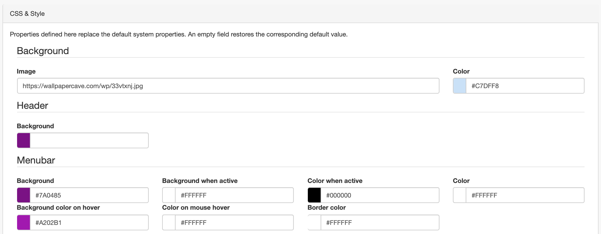

# Настройка CSS и стилей {#css-configuration}

Чтобы перейти к настройке CSS и стилей, нужно войти в систему как администратор и 
открыть `Панель админа` --> `Настройки` --> `CSS и стили`.

На этой странице вы можете изменять различные цвета элементов страницы (по умолчанию, большинство из них белые). 
Обратите внимание, что "фон" относится к цвету фона элементов, а "цвет" - к цвету шрифта, используемого в элементе. 
Приведенная выше настройка приведет к визуализации, представленной ниже:

Также есть возможность создать ссылку на фоновое изображение. 
При создании ссылки на изображение стоит использовать веб-адрес изображения из источника https, 
если GeoNetwork используется по протоколу https. Размещение изображения (загружаемого в виде логотипа) на том же сервере - 
лучший способ предотвратить возможные блокировки браузера.

!!! note "Примечание"
    Можно сохранить конфигурацию локально для последующего использования или на альтернативных серверах. 
    Сохранение конфигурации займет много времени, поскольку все скрипты и стили будут восстановлены из исходных текстов. 
    Временные файлы хранятся на сервере в папке приложения и возможно возникнет необходимость вернуться 
    на эту страницу после обновления системы (или повторного развертывания контейнера docker).
