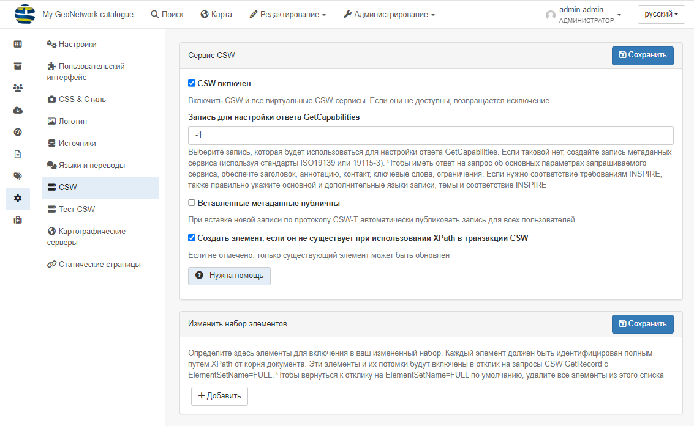

# Настройка CSW

Чтобы перейти к настройке сервера CSW, нужно войти в систему как администратор и 
открыть `Панель админа` --> `Настройки` --> `CSW`.



Служба CSW предоставляет описание информацию о своих настройках посредством запроса `es` 
(например, <http://localhost:8080/geonetwork/srv/en/csw?request=GetCapabilities&service=CSW&version=2.0.2>). 
Такой способ позволяет настроить сервер CSW и заполнить некоторые свойства, возвращаемые в ответ на запрос GetCapabilities.

## Параметры конфигурации

- **CSW включен**: По умолчанию конечная точка CSW включена, но ее можно отключить.

- **Запись для настройки ответа GetCapabilities**: Выберите запись, которая будет использоваться для настройки ответа GetCapabilities. 
  Если таковой нет, создайте запись метаданных сервиса (используя стандарты ISO19139 или 19115-3). 
  Чтобы иметь ответ на запрос об основных параметрах запрашиваемого сервиса, обеспечте заголовок, аннотацию, контакт, ключевые слова, ограничения. 
  Если нужно соответствие требованиям INSPIRE, также правильно укажите основной и дополнительные языки записи, темы и соответствие INSPIRE

- **Вставленные метаданные являются общедоступными**: По умолчанию метаданные, вставленные с помощью операций сбора данных CSW и транзакций CSW, 
  недоступны для публичного просмотра. Пользователь с соответствующими правами доступа может сделать это после операций сбора данных CSW и транзакций CSW, 
  но это не всегда удобно. Если этот параметр установлен, все метаданные, вставленные с помощью операций сбора данных CSW и транзакции CSW, 
  будут доступны для общего просмотра.

- **Создать элемент, если он не существует при использовании XPath в транзакции CSW**: Если флажок не установлен, можно обновлять только существующие элементы.

## Запись сервисных метаданных 

Для создания пользовательских возможностей рекомендуется создать специальную запись служебных метаданных (используя стандарты ISO19115-3 или ISO19139). 
Эта запись используется для создания документа о возможностях с использованием шаблона `web/src/main/webapp/xml/csw/capabilities.xml`.

При создании такой записи для создания возможностей будет использоваться следующая информация:

- название
- аннотация
- ключевые слова
- сборы (из поля "Распределение" -> "Инструкции по заказу")
- Ограничения доступа (из поля Ограничения доступа -> Другие ограничения)
- Контакт (из поля Идентификация -> Первый контакт)

Служебная запись ДОЛЖНА быть общедоступной.

Если при создании документа о возможностях из служебной записи произошла ошибка, выдается предупреждение с комментарием и используются возможности по умолчанию.:


## Настройка CSW для INSPIRE {#csw-конфигурация_inspire}

Если каталог также ориентирован на INSPIRE (см. [Настройка для директивы INSPIRE](inspire-configuration.md)), 
может быть целесообразным также заполнить следующие поля, чтобы правильно настроить службу обнаружения:

- язык метаданных (+ дополнительные языки, если таковые имеются) (используется для поддерживаемых языков, язык по умолчанию)
- Темы для вдохновения
- временной охват
- контакты по метаданным
- соответствие метаданных регламенту Комиссии 1089/2010

С помощью этой информации CSW может быть проверен с помощью средства проверки INSPIRE.

## Последующая обработка CSW

В какой-то ситуации пользователь может захотеть изменить XML-кодировку записей при извлечении с помощью CSW. Например:

- чтобы сделать запись более согласованной
- адаптировать кодировку для проверки записей с помощью правил INSPIRE 
  (например, в качестве обходного пути для <https://github.com/inspire-eu-validation/community/issues/95>)

Для этого пользователь может добавить дополнительный шаг преобразования во время вывода операций GetRecords и GetRecordById:

- Добавление процесса post в srv/eng/csw путем создания для каждой выходной схемы файла. 
  Например для gmd укажите/csw/gmd-csw-postprocessing.xsl
- Добавление постобработки на портал inspire/eng/csw путем создания файла для каждой выходной схемы. 
  Например, для gmd /csw/gmd-inspire-postprocessing.xsl

Для создания портала INSPIRE создайте портал "inspire" в разделе `Панель админа` --> `Настройки` --> `Источники`. 
Затем пользователь может настроить этап последующей обработки для CSW портала INSPIRE. 
Создайте файл постобработки gmd-inspire-postprocessing.xsl в вашей папке schema/present/csw. 
В следующем примере удалите контакт без электронной почты и ссылку, начинающуюся не с HTTP, чтобы соответствовать правилам проверки INSPIRE.

``` xml
<?xml version="1.0" encoding="UTF-8"?>
<xsl:stylesheet version="2.0" xmlns:xsl="http://www.w3.org/1999/XSL/Transform"
                xmlns:gn="http://www.fao.org/geonetwork"
                xmlns:gmd="http://www.isotc211.org/2005/gmd"
                xmlns:gco="http://www.isotc211.org/2005/gco"
                xmlns:srv="http://www.isotc211.org/2005/srv"
                exclude-result-prefixes="#all">

  <!-- Remove all contact not having an email -->
  <xsl:template match="*[gmd:CI_ResponsibleParty
                         and count(gmd:CI_ResponsibleParty/gmd:contactInfo/*/gmd:address/*/gmd:electronicMailAddress[*/text() != '']) = 0]"
                priority="2"/>

  <!-- Remove all online source not using HTTP to conform with
  https://github.com/inspire-eu-validation/community/issues/95
  -->
  <xsl:template match="*[gmd:CI_OnlineResource
                         and count(gmd:CI_OnlineResource/gmd:linkage/gmd:URL[not(starts-with(text(), 'http'))]) > 0]"
                priority="2"/>


  <!-- Remove geonet:* elements. -->
  <xsl:template match="gn:*" priority="2"/>

  <!-- Copy everything. -->
  <xsl:template match="@*|node()">
    <xsl:copy>
      <xsl:apply-templates select="@*|node()"/>
    </xsl:copy>
  </xsl:template>
</xsl:stylesheet>
```

Сервис может быть протестирован с помощью bash-скрипта:

``` shell
curl 'http://localhost:8080/geonetwork/inspire/eng/csw' \
  -H 'Content-type: application/xml' \
  --data-binary $'<csw:GetRecordById xmlns:csw="http://www.opengis.net/cat/csw/2.0.2" service="CSW" version="2.0.2"                   outputSchema="http://www.isotc211.org/2005/gmd"><csw:ElementSetName>full</csw:ElementSetName><csw:Id>3de9790e-529f-431f-ac4f-e86d827bde8e</csw:Id>\n</csw:GetRecordById>'
```
