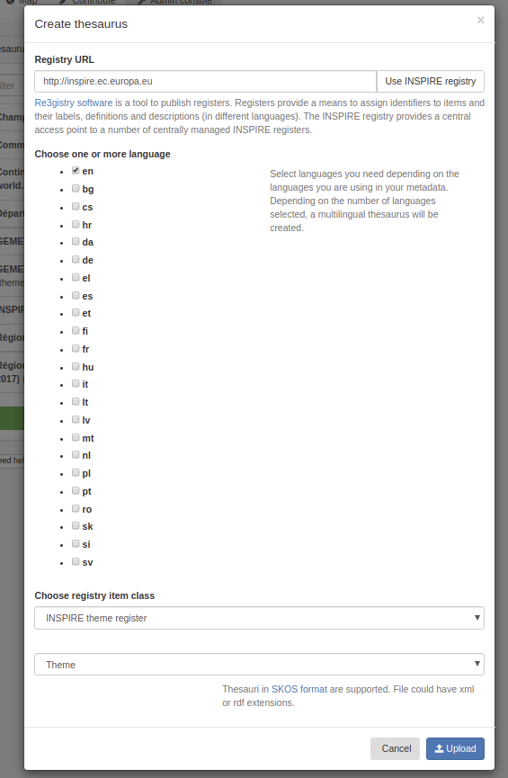
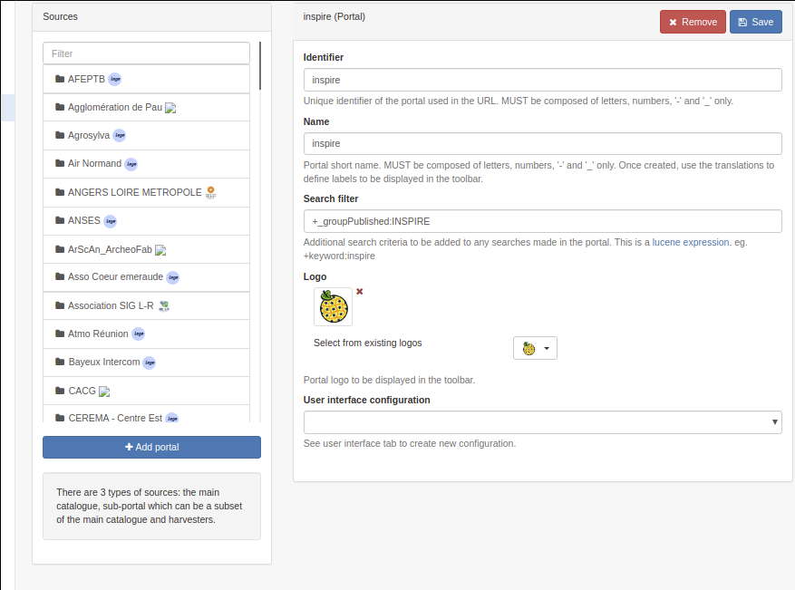

# Настройка для директивы INSPIRE {#inspire-configuration}

## Включение INSPIRE

В **Панели админа --> Настройки** пользователь может настроить поддержку директивы INSPIRE.

При включении поддержка INSPIRE активирует следующее:

- Включить индексацию тем и приложений INSPIRE 
  (тезаурус тем INSPIRE ДОЛЖЕН быть добавлен в список тезаурусов из реестра INSPIRE - 
  см. [Управление тезаурусом](../managing-classification-systems/managing-thesaurus.md)).

  

Для настройки службы обнаружения НЕОБХОДИМО создать специальную запись метаданных службы, 
чтобы предоставить полный документ GetCapabilities ([Конфигурация CSW для INSPIRE](csw-configuration.md)).

## Загрузка списков кодов INSPIRE

Для описания наборов данных и серий INSPIRE рекомендуется загружать соответствующие списки кодов 
из [Реестра INSPIRE](https://inspire.ec.europa.eu/registry/), следующие списки кодов соответствуют требованиям руководства по метаданным версии 2.0:

- [Тема INSPIRE](https://inspire.ec.europa.eu/theme)
- [Схема приложения](https://inspire.ec.europa.eu/applicationschema)
- [Типы носителей](https://inspire.ec.europa.eu/media-types)
- Реестр кодовых данных -> [Протоколы](https://inspire.ec.europa.eu/metadata-codelist/ProtocolValue)
- Реестр кодовых данных -> [Пространственный охват](https://inspire.ec.europa.eu/metadata-codelist/SpatialScope)
- Реестр кодовых списков метаданных --> [Набор приоритетных данных INSPIRE](https://inspire.ec.europa.eu/metadata-codelist/PriorityDataset)
- Реестр кодовых данных метаданных -> [Категория службы пространственных данных](https://inspire.ec.europa.eu/metadata-codelist/SpatialDataServiceCategory)
- Реестр кодовых данных метаданных -> [Условия доступа и использования](https://inspire.ec.europa.eu/metadata-codelist/ConditionsApplyingToAccessAndUse)
- Реестр кодовых данных метаданных -> [Ограничения на публичный доступ](https://inspire.ec.europa.eu/metadata-codelist/LimitationsOnPublicAccess)
- Зарегистрировать список кодов метаданных --> [Онлайн-код описания](https://inspire.ec.europa.eu/metadata-codelist/OnLineDescriptionCode)
- Реестр кодовых списков метаданных -> [Критерии качества обслуживания](https://inspire.ec.europa.eu/metadata-codelist/QualityOfServiceCriteria)

Администраторы могут управлять тезаурусами из "Панели админа" -> "Системы классификации" -> "Тезаурус". 
Одним из вариантов является загрузка тезауруса непосредственно из реестра.


Нажмите "Использовать реестр INSPIRE", чтобы использовать реестр INSPIRE по умолчанию, 
но можно использовать любой экземпляр [программного обеспечения для ведения реестра](https://joinup.ec.europa.eu/solution/re3gistry).



Выберите один или несколько языков в зависимости от потребностей. 
Выберите категорию или непосредственно тезаурус, в зависимости от тематики тезауруса. 
По умолчанию тип тезауруса - "Тема", но при необходимости вы можете адаптировать его.

Нажав на кнопку "Загрузить", каталог свяжется с реестром, загрузит файлы для каждого языка и 
объединит их в тезаурус в формате SKOS, поддерживаемом каталогом.

Пользователь также может использовать хорошо известный [тезаурус GEMET](https://www.eionet.europa.eu/gemet/en/themes/). 
Некоторые версии тезауруса в формате SKOS доступны [здесь](https://github.com/geonetwork/util-gemet/tree/master/thesauri).

После загрузки тезаурус можно использовать в записях метаданных для выбора ключевых слов из:


Тип кодировки ключевых слов можно определить с помощью значка шестеренки (дополнительную информацию смотрите в разделе проверка):


С помощью формы настройки плагина schema можно настроить тезаурус, который будет использоваться для определенного элемента "или". 
Понятия тезауруса используются для заполнения текстового поля автоматического заполнения для этого элемента.


## Проверка INSPIRE

Проверка записей метаданных INSPIRE доступна по адресу [the INSPIRE Validator](https://inspire.ec.europa.eu/validator/about/). 
В нем используется [ETF, который является платформой тестирования пространственных данных и сервисов с открытым исходным кодом](https://github.com/etf-validator/etf-webapp). GeoNetwork может "обработать" любую запись, используя сервис, предоставляемый экземпляром ETF. Чтобы настроить удаленную проверку, перейдите в "Консоль администратора" -> "Настройки" и укажите URL-адрес средства проверки. URL-адрес основного средства проверки INSPIRE - это `https://inspire.ec.europa.eu/validator/`.


После включения редактор отобразит опцию удаленной проверки в меню:


Стандартная опция проверки будет использовать внутреннюю систему проверки 
(т.е. XSD, правила Schematron для ISO, INSPIRE, \... в зависимости от конфигурации). 
Во внутренней системе проверка INSPIRE основана на техническом руководстве INSPIRE версии 1.3, и результаты будут отличаться от отчетов ETF.

При удаленной проверке INSPIRE во всплывающем окне откроется средство проверки. 
Выберите один из вариантов в зависимости от уровня проверки и типа ресурса для проверки. 
Список параметров можно настроить в [эта конфигурация file](https://github.com/geonetwork/core-geonetwork/blob/master/services/src/main/resources/config-spring-geonetwork.xml#L61-L94). Настройка производится путем выбора одного или нескольких наборов тестов из параметров ETF:


Во время проверки запись отправляется в службу ETF и обрабатывается. Как только ETF завершит проверку, в каталоге появится ссылка на отчет о проверке.


Обратите внимание, что если вы проверяете личную запись, эта запись будет передана в средство проверки. 
Для обеспечения безопасности этого процесса мы рекомендуем настроить локальную (частную) установку средства проверки.

### Настройка наборов тестов для проверки

Набор тестов, выполняемых для каждой схемы, 
можно настроить с помощью файла [WEB-INF/config-etf-validator.xml](https://github.com/geonetwork/core-geonetwork/blob/5156bae32d549e6d09cd6a86065791265eb09027/web/src/main/webapp/WEB-INF/config-etf-validator.xml).

Список доступных наборов тестов определен в компоненте inspireEtfValidatorTestsuites. 
Это карта с записью для каждого набора тестов. Атрибут `key` - это название набора тестов. 
Каждая запись карты представляет собой "массив" с тестами, которые необходимо выполнить в наборе тестов. 
Значение каждого элемента массива ("<значение>") - это название теста, записанное в точности так, как определено в сервисе удаленной проверки INSPIRE. Например:

``` xml
<util:map id="inspireEtfValidatorTestsuites" key-type="java.lang.String" value-type="java.lang.String[]">
 <entry key="TG version 1.3">
   <array value-type="java.lang.String">
     <value>Conformance class: INSPIRE Profile based on EN ISO 19115 and EN ISO 19119</value>
     <value>Conformance class: XML encoding of ISO 19115/19119 metadata</value>
     <value>Conformance class: Conformance class: Metadata for interoperability</value>
   </array>
 </entry>
 <entry key="TG version 2.0 - Data sets and series">
   <array value-type="java.lang.String">
     <value>Common Requirements for ISO/TC 19139:2007 based INSPIRE metadata records.</value>
     <value>Conformance Class 1: INSPIRE data sets and data set series baseline metadata.</value>
     <value>Conformance Class 2: INSPIRE data sets and data set series interoperability metadata.</value>
   </array>
 </entry>
 <entry key="TG version 2.0 - Network services">
   <array value-type="java.lang.String">
     <value>Common Requirements for ISO/TC 19139:2007 based INSPIRE metadata records.</value>
     <!--<value>Conformance Class 1: INSPIRE data sets and data set series baseline metadata.</value>
     <value>Conformance Class 2: INSPIRE data sets and data set series interoperability metadata.</value>-->
     <value>Conformance Class 3: INSPIRE Spatial Data Service baseline metadata.</value>
     <value>Conformance Class 4: INSPIRE Network Services metadata.</value>
     <!--<value>Conformance Class 5: INSPIRE Invocable Spatial Data Services metadata.</value>
     <value>Conformance Class 6: INSPIRE Interoperable Spatial Data Services metadata.</value>
     <value>Conformance Class 7: INSPIRE Harmonised Spatial Data Services metadata.</value>-->
   </array>
 </entry>
</util:map>
```

Атрибут `value-type` массива должен быть определен как Java strings: `<тип значения массива="java.lang.Строка">`.

Чтобы определить, какие наборы тестов будут выполняться при использовании опции проверки INSPIRE на панели инструментов редактора, 
вы можете изменить компонент inspireEtfValidatorTestsuitesConditions. Это карта с записью для каждой схемы и набора тестов, которые необходимо выполнить. 
Атрибут ключа ввода карты должен быть в формате `SCHEMA_ID::TEST_SUITE_NAME`, 
где `TEST_SUITE_NAME` является одним из ключей ввода карты `inspireEtfValidatorTestsuites`. 
Для каждой записи вы можете определить условие XPath, которое должны выполнять метаданные для отправки валидатору.

!!! note

    Если схема метаданных не соответствует, проверяется иерархия зависимостей схемы, 
    чтобы проверить, соответствует ли какая-либо родительская схема каким-либо правилам.


!!! warning

    Xpath должен возвращать набор узлов или node для работы. XPaths, возвращающий логическое значение `true` или `false`, 
    будет интерпретироваться GeoNetwork как всегда совпадающий.

``` xml
<util:map id="inspireEtfValidatorTestsuitesConditions">
  <!--
     key format:
     SCHEMAID::TG_RULE_NAME
     If a metadata schema doesn't match, the schema dependency hierarchy
     is checked to verify if any parent schema matches any rules.
    -->
  <entry key="iso19139::TG version 2.0 - Data sets and series"
         value="gmd:hierarchyLevel[*/@codeListValue = 'dataset' or */@codeListValue = 'series']"/>
  <entry key="iso19139::TG version 2.0 - Network services" value=".//srv:SV_ServiceIdentification"/>
  <entry key="iso19115-3.2018::TG version 2.0 - Data sets and series"
         value="mdb:metadataScope[*/mdb:resourceScope/*/@codeListValue = 'dataset' or */mdb:resourceScope/*/@codeListValue = 'series']"/>
  <entry key="iso19115-3.2018::TG version 2.0 - Network services" value=".//srv:SV_ServiceIdentification"/>
</util:map>
```

## Точка доступа INSPIRE

Во многих случаях только часть записей метаданных в каталоге связана с директивой INSPIRE. 
В этом случае может оказаться целесообразным отфильтровать набор записей, подпадающих под действие Директивы, и продвигать их через вспомогательный портал. 
Таким образом, европейский портал может легко собирать записи, относящиеся к INSPIRE.

Сначала определите механизм фильтрации, чтобы идентифицировать записи, подпадающие под действие директивы. Часто используемый метод:

- Создайте группу "INSPIRE" и опубликуйте эти записи в этой группе (или категории).
- Добавьте конкретное ключевое слово в запись метаданных.
- Выполните фильтрацию на основе отчета о качестве соответствия, содержащего ссылку на директиву ЕС.

В "Консоли администратора" -> "Настройки" -> "Источники" администратор может создать дополнительный портал. 
Создайте субпортал `inspire` и установите фильтр для выбора только записей, связанных с INSPIRE (например, "+_group Published:INSPIRE", 
чтобы выбрать все записи, опубликованные в группе "INSPIRE").



После сохранения портал будет доступен по адресу <http://localhost:8080/geonetwork/inspire>, 
а служба CSW - по адресу <http://localhost:8080/geonetwork/inspire/eng/csw>.

## INSPIRE ссылки

-   [INSPIRE IR](https://inspire.ec.europa.eu/)
-   [INSPIRE Technical Guidelines Metadata v2.0.1](https://inspire.ec.europa.eu/sites/default/files/documents/metadata/inspire-tg-metadata-iso19139-2.0.1.pdf)
-   [INSPIRE validator](https://inspire.ec.europa.eu/validator/)
-   [GeoNetwork at the INSPIRE forum](https://inspire.ec.europa.eu/forum/search?q=geonetwork)
