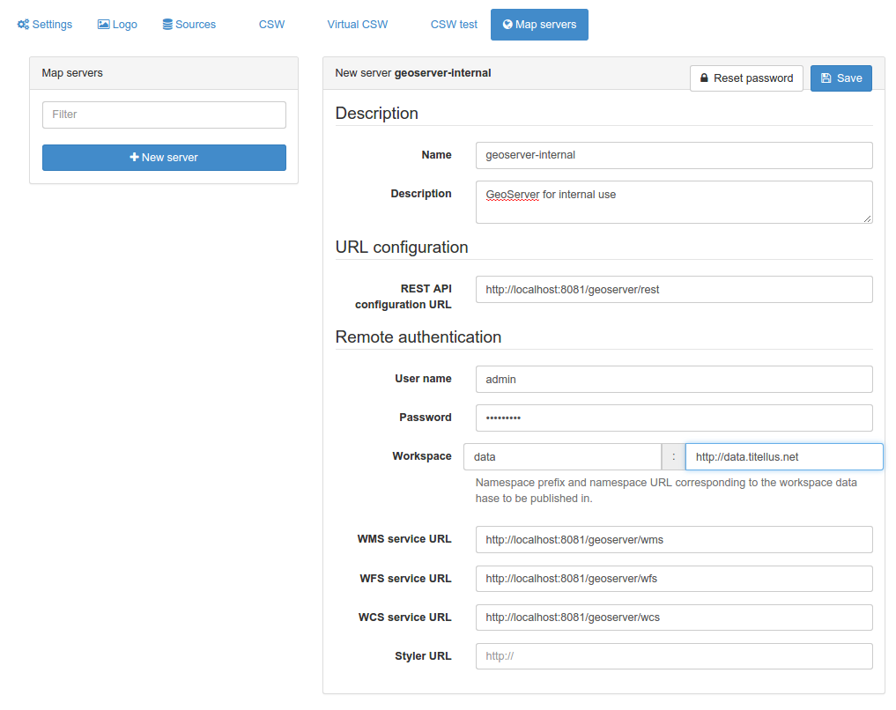

# Настройка картографических серверов для публикации 

Чтобы опубликовать информацию из каталога в виде сервисов OGC (WMS, WFS, WCS), 
администратору каталога необходимо зарегистрировать один или несколько картографических серверов для публикации. 
Картографические серверы ДОЛЖНЫ поддерживать GeoServer REST API для работы с каталогом. Были протестированы 2 следующие реализации:

- [GeoServer](https://geoserver.org)
- [Mapserver](https://mapserver.org) и [Mapserver REST API](https://github.com/neogeo-technologies/mra).

Настройте свой картографический сервер, а затем зарегистрируйте его в административном интерфейсе:

Необходимы следующие параметры:

- Название: Метка картографического сервера, которая будет отображаться при публикации информации о геопубликациях.
- Описание: Описание картографического сервера.
- Конфигурация REST API: URL-адрес службы, предоставляющей доступ к удаленной конфигурации с использованием REST API.
- Имя пользователя и пароль, которые будут использоваться для подключения к REST API.
- Префикс рабочей области и URL-адрес: информация о рабочей области, в которую будут помещаться данные.
- URL сервиса WMS/WFS/WCS: URL-адреса сервисов, которые будут использоваться при добавлении ссылок на сервисы в запись метаданных после публикации.

Смотрите [Публикация ГИС-данных на картографическом сервере] (../../руководство пользователя/рабочий процесс/geopublication.md).
