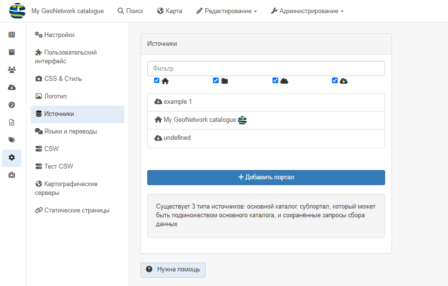
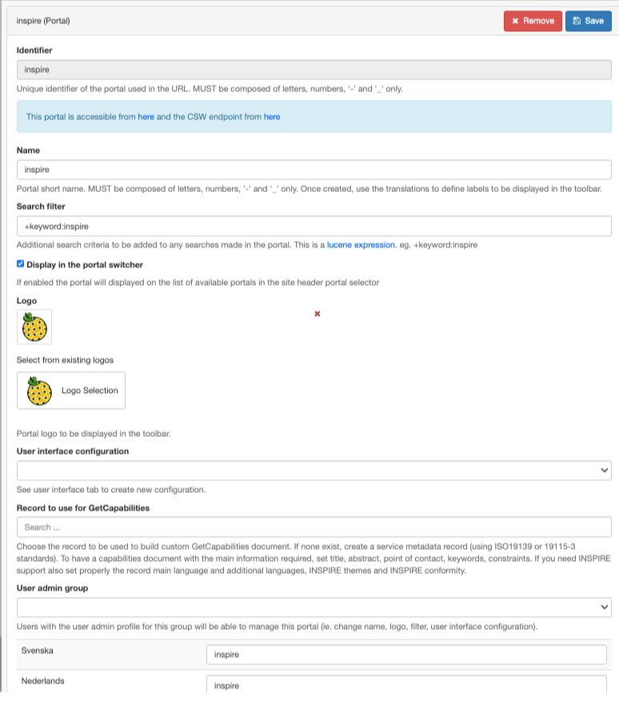
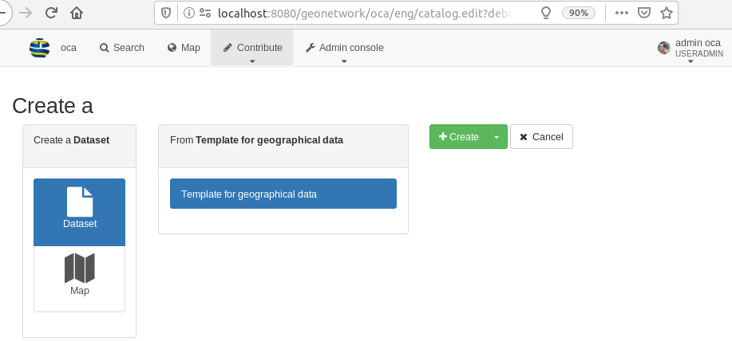

# Настройка порталов

Порталы можно настроить в `Панель админа` --> `Настройки` --> `Источники`.

Существует 3 типа источников:

- Основной каталог (соответствует текущей установке). 

- Сборщики данных (харвестеры). При сборе данных с другого узла GeoNetwork также собираются данные из целевого каталога, 
  чтобы отслеживать истинное происхождение записей. Это относится только к протоколам GeoNetwork, 
  использующим MEF ([Формат обмена метаданными (MEF)](../../annexes/mef-format.md)), которые содержат информацию исходного каталога.

- Субпортал, который может быть частью основного каталога. Его настройка описана ниже.

## Создание субпортала

Субпорталы можно использовать ориентируясь только на подмножество определённых записей.

Выберите `+ Добавить портал `, чтобы создать новый субпортал. Откроется окно:

Например, при создании субпортала с идентификатором "inspire" будет доступна новая точка входа в каталог: <http://localhost:8080/geonetwork/inspire/>. 
Доступ к каталогу через него обеспечит доступ только к записям, соответствующим фильтру, определенному для этого подпортала. 
Значение параметра "фильтр поиска" использует синтаксис анализатора запросов Lucene (см. <http://lucene.apache.org/java/2_9_1/queryparsersyntax.html>) 
и применяется ко всем поисковым запросам.

Права пользователя применяются так же, как и в основном экземпляре.

Логотип и название субпортала будут отображаться вместо основной информации об экземпляре, если выбрана опция "Отображать в переключателе портала":

Для этого субпортала также доступна служба CSW <http://localhost:8080/geonetwork/inspire/eng/csw> (которая заменяет функцию виртуальной CSW).

Субпортал также может использовать определенную конфигурацию пользовательского интерфейса.

Список доступных субпорталов приведен по адресу <http://localhost:8080/geonetwork/srv/api/sources>

## Пример использования

### Создание субпортала директивы INSPIRE

Для директивы INSPIRE администратору каталога необходимо опубликовать точку входа, предоставляющую доступ только к связанным с INSPIRE записям. 
Субпортал INSPIRE можно создать с помощью фильтра по ключевым словам "+название тезауруса: "Темы GEMET - INSPIRE, версия 1.0"".

### Создание подпортала для партнеров

Некоторым организациям необходимо открыть каталог для нескольких партнеров. 
В таких случаях каждый партнер, как правило, получает доступ к каталогу и создает свои записи в специальных группах. 
Хорошим примером является <https://www.geocat.ch/> предоставление основного поискового фильтра `каталог`.

Концепция субпортала предусматривает возможность создания специального URL-адреса для каждого партнера. 
Заголовок может содержать идентификацию партнера с указанием имени и логотипа. 
При желании пользовательский интерфейс также может быть настроен (см. [Настройка пользовательского интерфейса](user-interface-configuration.md)).

Чтобы настроить такую конфигурацию, основным принципом является наличие:

- Одной группы для каждого партнера с одним или несколькими пользователями
- Одного субпортала для каждого партнера с фильтром, соответствующим записям в этой группе

Чтобы настроить это, выполните следующие действия:

- Создайте группу для партнера, например группа `A` (см. [Создание группы](../managing-users-and-groups/creating-group.md)).

- Создайте хотя бы одного пользователя для партнера (см. [Создание пользователя](../managing-users-and-groups/creating-user.md)). 
  Пользователь должен быть членом группы `A`. Если нужно, чтобы пользователь мог настраивать подпортал (например, изменять название, выбирать логотип), 
  у пользователя должен быть как минимум профиль "UserAdmin" для группы `A`.
 
- Создайте cубпортал. Он может иметь то же название, что и группа, например, "A", но это не обязательно. 
  Фильтр можно создать, используя тот факт, что запись, опубликованная в группе "A", должна быть на этом подпортале, 
  используя синтаксис "+_groupPublished:A". После создания подпортал доступен по адресу <http://localhost:8080/geonetwork/oca>.

- (Необязательно) Свяжите подпортал с группой администраторов пользователей, чтобы разрешить "UserAdmin" настраивать свой cубпортал.

При такой конфигурации, т.е. один партнер = одна группа = один cубпортал, и
пользователи являются членами только одной группы, тогда при подключении к cубпорталу партнера:

- пользователь будет видеть только записи, опубликованные в этой группе, во всем приложении
- при создании новых записей выбор группы не предусмотрен, поскольку пользователь является членом только одной группы

Помните, что запись видна на cубпортале "A", потому что она опубликована в группе "A":

Если операция "публикация" будет удалена из группы "A", то записи больше не будут отображаться на этом cубпортале.

В некоторых ситуациях есть необходимость поделиться шаблонами между партнерами. Для этого есть 2 варианта:

- Опубликовать шаблон во всех группах партнеров. 
  Основным недостатком в этом случае является то, что при добавлении новой группы шаблоны должны быть опубликованы в этой новой группе.

- Создайте специальную группу для общих записей, например. `sharedGroup`. 
  Опубликуйте шаблоны в этом общем пространтве. Измените фильтр субпортала, чтобы он соответствовал либо партнерской группе,
  либо общей группе. `+_groupPublished:(A ИЛИ sharedGroup)`.
