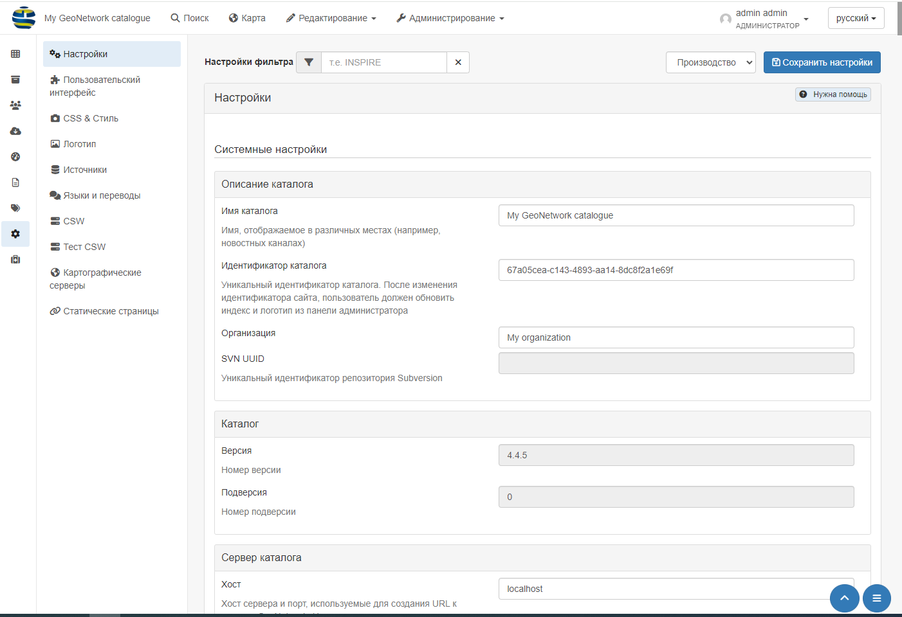
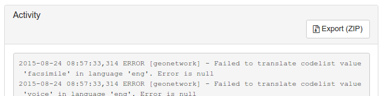
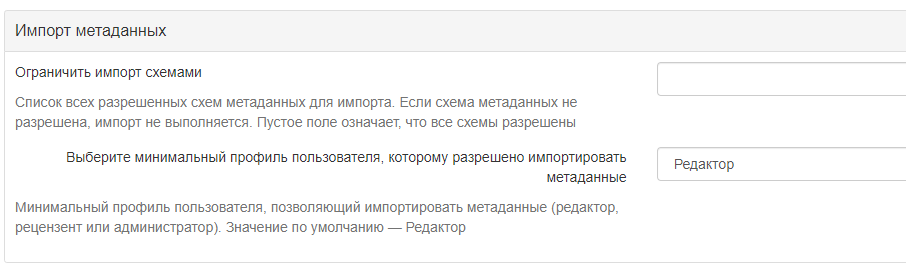
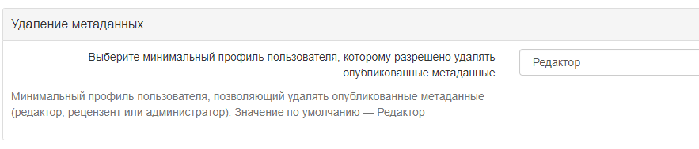
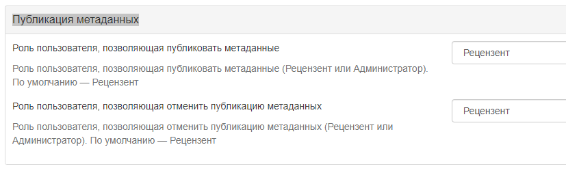
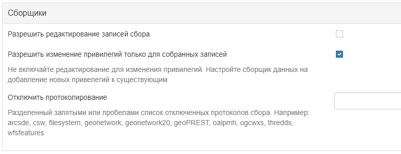

# Настройка системы

Большинство настраиваемых параметров системы могут быть изменены пользователями-администраторами с помощью веб-интерфейса в `Администрирование` -> `Настройки`.

!!! info "Важно"

    Изменение системных параметров существенно влияет на работу каталога. 
    Неправильное использование некоторых настроек может привести к тому, что система будет работать не так, как ожидалось. 
    

Поскольку страница системных настроек относительно длинная, кнопка `Сохранить настройки` может повторяться между разделами.

## Описание каталога

-    **Имя каталога** - Название узла. Информация, которая помогает пользователю идентифицировать каталог.

-    **Идентификатор каталога** - Универсальный уникальный идентификатор (uuid), который отличает каталог от любого другого каталога. 
      Рекомендуется оставить его в виде uuid. Он будет использоваться сборщиком данных для идентификации исходного каталога.

-    **Организация** - Организация, к которой принадлежит узел. Это также информация, которая помогает идентифицировать каталог обычному пользователю.

-    **SVN UUID** - Репозиторий [Subversion](https://ru.wikipedia.org/wiki/Subversion), прикрепленный к узлу. 
     Репозиторий используется для управления версиями метаданных.

## Каталог

-    **Версия** - Версия GeoNetwork (только для чтения). 
-    **Подверсия** - Дополнительная версия каталога (2только для чтения).

## Сервер каталога {#system-config-server}

-    **Хост** - Имя или IP-адрес узла (без <http://>). Имя используется при редактировании метаданных для создания ссылок на ресурсы.
     -    Если узел общедоступен из Интернета, вы должны использовать доменное имя.
     -    Если узел скрыт в вашей частной сети и у вас есть брандмауэр или веб-сервер, который перенаправляет входящие запросы на этот узел, вам необходимо ввести общедоступный адрес брандмауэра или веб-сервера. Типичная конфигурация - это веб-сервер Apache по адресу A, который является общедоступным и перенаправляет запросы на сервер Tomcat по частному адресу B. В этом случае вам необходимо ввести A в параметре host.
-    **Порт** - Номер порта сервера (обычно 80 или 8080). Если используется протокол HTTP, установите его равным 80.

-    **Предпочтительный протокол** - Определяет протокол для доступа к каталогу. 
     Протокол HTTP, используемый для доступа к серверу. Выбор http означает, что все сообщения с каталогом будут видны всем, кто использует этот протокол. 
     Поскольку это включает имена пользователей и пароли, это небезопасно. Выбор https означает, что вся связь с каталогом будет зашифрована.

-    **Уровень логов** - Определяет уровень логирования в журнале приложения. 
     После внесения изменений в журнал можно будет проверить в разделе "Статистика и статус" в разделе `Активность`.

-    **Часовой пояс** - Часовой пояс задаётся для корректной работы времени в каталоге. Если не установлен, будет использоваться часовой пояс JVM по умолчанию.

## Параметры "Интранета" (внутренней сети)

Часто организации требуется наладить процесс автоматическое распознавание анонимных внутренних пользователей, 
которые получают доступ к узлу внутри организации (Интрасеть), и анонимных внешних пользователей из Интернета. 
Каталог определяет анонимных пользователей внутри организации как принадлежащих к группе *Интранет*, 
в то время как анонимные пользователи за пределами организации определяются группой *Все*. 
Чтобы автоматически распознавать пользователей, принадлежащих к группе Интранет, необходимо указать каталогу IP-адрес интрасети и сетевую маску.

-    **Сеть** - Адрес внутренней сети в виде IP-адреса (например, 147.109.100.0). Это может быть список IP-адресов, разделенных запятыми.
-    **Маска сети** - Маска сети интрасети (например, 255.255.255.0). Укажите как можно больше масок сети и IP-адресов.

Если параметры внутренней сети не заданы, группа *Интранет* не будет отображаться на панели общего доступа.

## Прокси-сервер

На странице настроек предлагается задать конфигурацию прокси-сервера. 
Эта конфигурация используется приложением для доступа к Интернету для получения онлайн-ресурсов, например, в рамках процесса сбора урожая.

-    **Использовать прокси** - Включите прокси-сервер, если каталог используется в связке с прокси-сервером и если необходимо использовать его для доступа к удаленным ресурсам.
-    **Хост прокси** - IP-адрес или имя прокси-сервера.
-    **Порт прокси** - Порт прокси-сервера.
-    **Имя пользователя прокси** - Имя пользователя на прокси-сервере.
-    **Пароль пользователя прокси** - Пароль пользователя прокси. 
-    **Игнорировать список хостов** - Чтобы обойти определенные хосты, нужно ввести IP-адрес или имя хоста, например www.mydomain.com, или диапазон адресов, используя подстановочные знаки, например 192.168.2.*. Символ | используется для разделения значений разных хостов.

Параметры прокси-сервера JVM также могут потребоваться для правильной настройки прокси-сервера для всего удаленного доступа.

## Обратная связь {#system-config-feedback}

При надобности каталог может отправлять электронные письма. Это возможно, если:

- используется система регистрации пользователей
- используются статусы состояния рабочего процесса (см. [Жизненный цикл](../../руководство пользователя/рабочий процесс/life-cycle.md))
- загружен файл с записью метаданных и выбрана привилегия уведомлять

В этом разделе настраивается используемый почтовый сервер.

-    **Электронная почта** - Это адрес электронной почты администратора, используемый для отправки сообщений.
-    **SMTP хост** - Имя почтового сервера или IP-адрес, используемые для отправки электронных писем.
-    **SMTP-порт** - SMTP-порт.
-    **Использовать SSL** - Использовать SSL-верификацию.
-    **Имя пользователя** - Имя пользователя на SMTP-сервере, если он подключён.
-    **Пароль** - Пароль пользователя на SMTP-сервере, если он подключён.

## Результаты поиска метаданных

Параметры поиска метаданных определяют ограничения на результаты поиска для пользователя.

-    **Максимум выбранных записей** - Максимальное количество результатов поиска, которые пользователь может выбрать и обработать с помощью пакетных операций, 
     например, установить права доступа, категории и т. д. Этот параметр позволяет избежать длительных действий, которые могут привести к ошибке нехватки памяти.

## Служба каталогов Web (CSW)

См. раздел [Настройка CSW](csw-configuration.md).

## Самостоятельная регистрация пользователей

См. раздел [Саморегистрация пользователей](../managing-users-and-groups/user-self-registration.md).

## Обратная связь пользователей

-    **Включить обратную связь приложения** - Включение этой опции позволяет отправлять отзыв о приложении системному администратору. 
     Для этого также необходимо настроить почтовый сервер.

-    **Включить обратную связь по метаданным** - Включение этой опции позволяет оставить отзыв владельцу метаданных и системному администратору о записи метаданных. 
     Для этого необходимо, чтобы почтовый сервер также был настроен.

## Ссылка в записях метаданных

-    **Активные гиперссылки** - Если флажок поставлен, GeoNetwork будет показывать активные гиперссылки в метаданных.

## Рейтинг метаданных

-    **Локальный рейтинг** - Если этот параметр включен, каталог будет рассчитывать оценки пользователей только для метаданных с текущего узла 
     (не распределенных между другими узлами GeoNetwork). Это относится только к записям, собранным с использованием протокола GeoNetwork.
-    **Уровень уведомления о рейтинге** - Определяет, каких пользователей следует уведомлять в случае изменения рейтинга.
-    **Группы для уведомления в случае изменения рейтинга** - Список групп, разделенных символом |, 
     для уведомления в случае изменения оценки (для уровня уведомления «Уведомить группу(ы) по электронной почте»).

# XLink метаданных {#xlink_config}

Распознаватель XLink заменяет содержимое элементов с атрибутом @xlink:href (за исключением некоторых элементов, таких как srv:operatesOn) содержимым, 
полученным из содержимого URL-адреса @xlink:href. Распознаватель XLink должен быть включен, если нужно собирать фрагменты метаданных 
или повторно использовать фрагменты метаданных в своих записях метаданных (например. при использовании справочника контактов).

-    **Включить анализ XLink**: - Если включено, будут анализироваться XLinks к фрагментам метаданных в записях
-    **Включить локальные XLink** - Локальные ссылки XLinks используют URL-адрес local://<land>/<service> для создания ссылок на соответствующие разделы вместо URL-адреса HTTP. Локальные ссылки обычно работают быстрее, чем HTTP-ссылки.
-    **При анализе XLink пропускать элементы** - Список элементов для пропуска при анализе XLink через запятую.
-    **Разрешить удаление подшаблонов, на которые ссылается xlink** - Если отмечено, то разрешить.

!!! info "Смотреть также"

    Для повышения производительности каталог будет кэшировать содержимое, которого нет в локальном каталоге. 
    Чтобы очистить кэш XLink, нужно зайти в `Администрирование` -> `Инструменты`, если фрагменты были обновлены.

## Обновление метаданных

Для каждой схемы метаданных в каталоге есть преобразование XSL (`update-fixed-info.xsl`), которое можно применить к записи метаданных, принадлежащей этой схеме. 
Цель этого преобразования - обеспечить возможность применения определённой схемы, информации о сайте и каталоге 
к записи метаданных при каждом сохранении записи метаданных в редакторе. 
В качестве примера, это преобразование используется для создания и сохранения URL-адреса любых файлов, 
загруженных и сохраненных вместе с записью метаданных в редакторе.

-    **Автоматические правки**: Включено по умолчанию. Рекомендуется не использовать редактор метаданных, если автоматическое исправление отключено. 
     Более подробную информацию смотрите в разделе <http://trac.osgeo.org/geonetwork/ticket/368>.

## Статистика поиска {#search_stats_config}

Если включено, поисковая статистика будет собираться и храниться в базе данных. 
Статистика поиска хранится в базе данных и может быть запрошена с помощью страницы `Статистика поиска`.

## Открыть провайдер Archive Initiative (OAI-PMH)

Опции в этой группе управляют тем, как сервер OAI отвечает на OAIPMH-запросы из удаленных ресурсов.

- **Поиск по дате**: Сборщики OAI могут запрашивать у GeoNetwork записи в определенном диапазоне дат. 
  GeoNetwork может использовать одно из двух полей даты из метаданных для проверки совпадения с этим диапазоном дат. 
  По умолчанию используется поле *Протяженность во времени*, которая представляет собой временную протяженность из записи метаданных. 
  Другой вариант, *Дата модификации*, использует дату модификации записи метаданных в базе данных GeoNetwork. Дата модификации - это последний раз, когда запись метаданных обновлялась или собиралась в GeoNetwork.

- **Лимит времени ResumptionToken**: Записи метаданных, соответствующие поисковому запросу OAI-сборщика, 
  обычно возвращаются сборщику в группах с фиксированным размером (например, в группах по 10 записей). 
  В каждую группу включается маркер возобновления, чтобы сборщик мог запросить следующую группу записей. 
  Таймаут маркера возобновления - это время (в секундах), в течение которого сервер GeoNetwork OAI будет ожидать использования маркера возобновления. 
  Если таймаут превышен, сервер GeoNetwork OAI отбросит результаты поиска и откажется распознавать маркер возобновления. 
  Цель этой функции - обеспечить освобождение ресурсов на сервере GeoNetwork OAI.

- **Размер кэша**: Максимальное количество одновременных сборов OAI, которые могут храниться в кэше.

Перезапустите каталог, чтобы запустить настройки OAI.

## Конфигурация директивы INSPIRE

Смотреть [Настройка директивы INSPIRE](inspire-configuration.md).

## Индексация

Данный параметр определяет, сколько процессорных потоков выделено для задач индексирования в GeoNetwork. 
Если на компьютере, на котором запущен GeoNetwork, много процессорных ядер, то возможно определить, 
сколько из них будет участвовать в индексации. Это может значительно ускорить выполнение крупных задач индексации 
(например, изменение привилегий для 20 000 записей), поскольку GeoNetwork может разделить задачу индексации на несколько частей 
и назначить их разным процессорным ядрам.

**Количество потоков обработки** - Максимальное количество потоков обработки, которое может быть выделено для задачи индексирования.

Примечание: этот параметр доступен только для проверенных баз данных. 
Это базы данных PostGIS и Oracle. Также следует тщательно продумать, сколько подключений к базе данных будет выделено в конфигурации, 
поскольку каждый поток может установить одно подключение к базе данных на время длительного сеанса индексации. 
Более подробную информацию о том, как настроить количество подключений в пуле подключений к базе данных, смотрите в разделе **Расширенная конфигурация**.

## Страница прав на метаданные

**Отображать только группы, к которым принадлежит пользователь**: если включено, то на странице прав доступа метаданных будут отображаться только те группы, 
к которым принадлежит пользователь (если пользователь не является администратором). На данный момент эта опция не может быть отключена и, вероятно, 
будет признана устаревшей в следующей версии GeoNetwork.

## Импорт метаданных {#editing_harvested_records}

- **Ограничить импорт схемами**: Список всех разрешенных схем для импорта метаданных. Если схема метаданных не разрешена, импорт не выполняется. Используйте пустое значение, чтобы разрешить все схемы.
- **Выберите минимальный профиль пользователя, которому разрешено импортировать метаданные**: Минимальный профиль пользователя, разрешенный для импорта метаданных ("Редактор", `Рецензент` или `Администратор`). Значение по умолчанию - `Редактор`.

## Удаление метаданных

Позволяет выбрать тип пользователя, которому разрешено удалять опубликованные метаданные.

## Публикация метаданных

Позволяет выбрать пользователя, которому разрешено публиковать и отменять публикацию метаданных.

## Сборщики

- **Разрешить редактирование записей сбора**: Включает/отключает редактирование собранных записей в каталоге. По умолчанию собранные записи не могут быть отредактированы.
- **Разрешить изменение привилегий только для собранных записей**: Не включайте редактирование для изменения привилегий. Настройте сборщик данных на добавление новых привелегий к существующим
- **Отключить протоколирование**: Разделенный запятыми или пробелами список отключенных протоколов сбора. Например: arcsde, csw, filesystem, geonetwork, geonetwork20, geoPREST, oaipmh, ogcwxs, thredds, wfsfeatures

