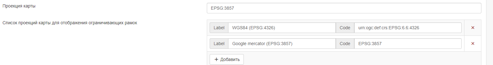
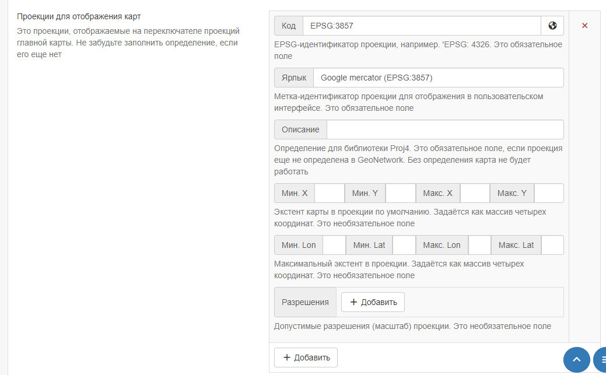
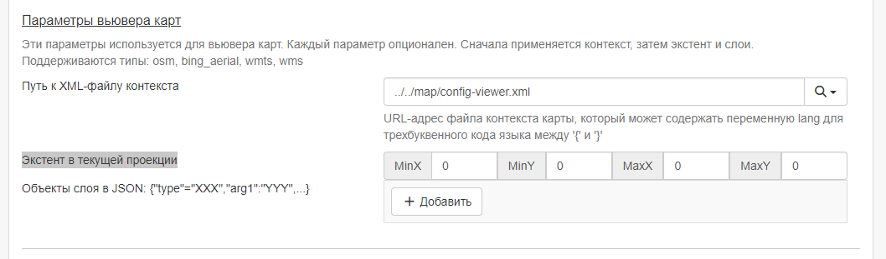
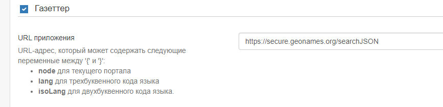
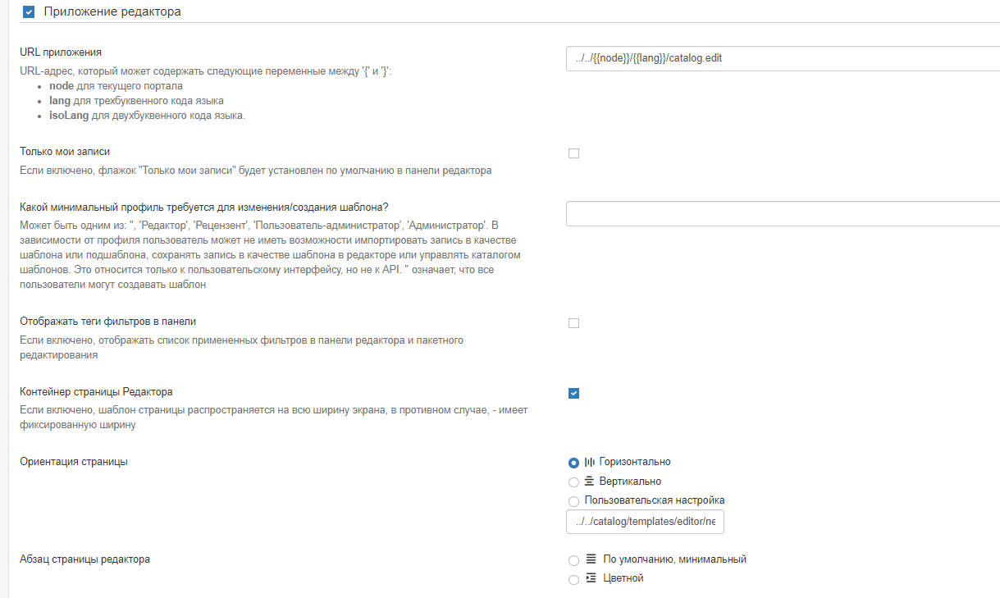
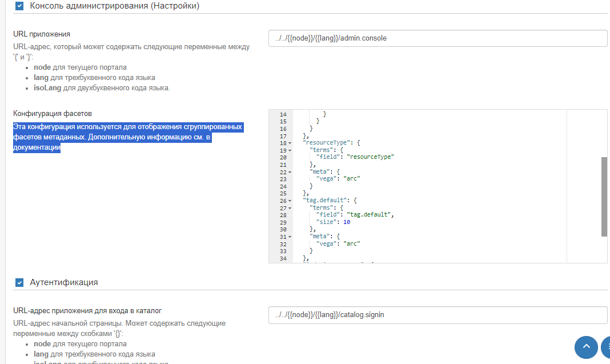

# Настройка пользовательского интерфейса

Большинство параметров конфигурации пользовательского интерфейса могут быть изменены администратором 
с помощью веб-интерфейса в `Панели админа` --> `Настройки` --> `Пользовательский интерфейс`.

!!! info "Примечание"

    Настройка этих параметров критически важна для работы каталога. 
    Неправильное использование некоторых настроек может привести к тому, что система будет работать не так, как ожидалось.


По умолчанию в каталоге будет использоваться конфигурация пользовательского интерфейса с именем "srv". 
Чтобы просмотреть и отредактировать настройки для этой конфигурации, выберите `Задать параметры пользовательского интерфейса по умолчанию`.

Чтобы добавить новую конфигурацию, например, для портала (см. [Конфигурация портала](portal-configuration.md)), 
в форме `Добавить новую конфигурацию интерфейса` нужно либо создать новую конфигурацию (ввести имя и нажать `+`), 
либо выбрать уже существующую конфигурацию из выпадающего списка.


Параметров пользовательского интерфейса довольно много. В выпадающем списке `Выберите параметры для редактирования` администратор может:

- Открыть все параметры сразу (пункт `Все параметры`)


- Открыть нужный параметр отдельно от всех


Дополнительные конфигурации также могут быть использованы для создания внешнего приложения на JS, которое может загружать определенную конфигурацию.

- **Настройки фильтра**: Это поле поиска можно использовать для фильтрации настроек в форме, 
  например, при поиске "социальные сети" будут отображаться только настройки, относящиеся к социальной панели.


## Общие параметры

- **Ярлыки ключевых слов**: если выбрано, у ключевых слов будут созданы ярлыки.
- **Удобочитаемое время**: если выбрано, даты будут отображены в удобном для пользователя формате. Если он не установлен, будет отображаться полная дата.
- **Формат даты**: поле, где можно задать формат даты.
- **Часовой пояс пользовательского интерфейса**: Часовой пояс, который будет использоваться для отображения даты.
  Если нет необходимости обрабатывать несколько часовых поясов в каталоге, установите для этого значения часовой пояс сервера. 
  Значение `Browser` (по умолчанию) указывает на использование часового пояса браузера.


## Футер (нижний колонтитул)

- **Нижний колонтитул**: Установите этот флажок, чтобы определить, отображается ли нижний колонтитул GeoNetwork. 
   Если он не установлен, нижний колонтитул отображаться не будет.
- **Панель социальных сетей**: Установите этот флажок, чтобы отображать панель социальных сетей (ссылки на twitter, facebook, linkedin и т.д.) в нижнем колонтитуле.
- **Показать версию GeoNetwork и ссылки**: Показывать версию приложения и ссылки в нижнем колонтитуле страницы каталога.
- **Пункты пользовательского меню в нижнем колонтитуле**
- **Список RSS-каналов**


## Хедер (верхний колонтитул) 
- **Верхний колонтитул**: Установите этот флажок, чтобы определить, будет ли отображаться верхняя панель инструментов GeoNetwork. 
  Если этот параметр не задан, панель инструментов отображаться не будет.
- **Список языков**: Выберите языки из списка, которые должны быть доступны для перевода строк интерфейса. 
  Если останется только один язык, то выпадающий список отображаться не будет. 
  Обратите внимание, что при наличии перевода можно добавить дополнительные языки, нажав кнопку "+" под списком и добавив соответствующие ISO-коды.


- **Показать логотип в заголовке**: Этот параметр определяет, где должен располагаться логотип каталога. 
  Если выбран этот параметр, логотип будет размещен в верхнем колонтитуле над верхней панелью инструментов, 
  а логотип панели инструментов (по умолчанию) будет удален. Если этот параметр не установлен, логотип будет отображаться на верхней панели инструментов.
- **Расположение логотипа**: Эти параметры определяют, в каком месте заголовка будет размещен логотип.
- **Контейнер раздела Головного меню**: Если включено, шаблон страницы распространяется на всю ширину экрана, в противном случае, имеет фиксированную ширину.
- **Показать название каталога в Головном меню**: Если включено, имя GeoNetwork будет отображаться в Головном меню, когда отключено, имя будет скрыто.
- **Фиксировать заголовок**: Заголовок фиксирован и остается вверху страницы. 
- **Отображать меню портала вверху**: по умолчанию true.

## Домашняя страница

- **Домашняя страница**: Установите этот флажок, чтобы определить, отображаются ли логотип и ссылка на домашнюю страницу на верхней панели инструментов. 
  Если флажок не установлен, логотип и ссылка не отображаются.
- **URL приложения**: Укажите URL для домашней страницы. В большинстве случаев это можно оставить по умолчанию.
- **Контейнер главной страницы**: Установите этот флажок, чтобы определить, будет ли поле поиска на странице браузера иметь полную ширину или фиксированную ширину и центрироваться.


## Поисковое приложение

- **Приложение для поиска**: Установите этот флажок, чтобы определить, отображается ли приложение для поиска на верхней панели инструментов. 
  Если он не установлен, ссылка не отображается.
- **URL приложения**: Укажите URL для приложения для поиска. В большинстве случаев это значение можно оставить по умолчанию.
- **Количество записей на странице**: Укажите параметры для определения количества записей, отображаемых на странице результатов, и значения по умолчанию.
- **Базовый запрос**: Задайте фильтр по умолчанию для поиска.


- **Фасетный фильтр для отображения с помощью вкладок**: Эта опция создает вкладку для каждого настроенного фасета над результатами поиска. 
  Это может быть использовано для дальнейшего сужения результатов поиска. 
  Список названий фасетов можно найти по адресу <https://github.com/geonetwork/core-geonetwork/blob/master/web/src/main/webapp/WEB-INF/config-summary.xml#L82>. 
  Например, чтобы включить фильтр тематических категорий над результатами поиска, администратор должен добавить "topicCat" в качестве поля для отображения аспекта.

- **Конфигурация фасетов**: Определяет набор фасетов поиска, которые должны быть видны на странице поиска. 
  По умолчанию используется "подробности", но можно использовать "менеджер" для отображения фасетов, которые чаще всего используются на странице редактора.

- **Фильтры**: Определяют дополнительные критерии поиска, которые добавляются ко всем поисковым запросам 
  и снова используются в основном для внешних приложений и подпорталов.


- **Варианты сортировки**: Определяет различные способы, с помощью которых пользователь может сортировать набор результатов поиска. 
  Ниже приведен параметр сортировки по умолчанию. Обратите внимание, что для поиска, например, по "названию" в алфавитном порядке 
  необходимо установить порядок "в обратном порядке".

- **Шаблоны результатов поиска**: Эта настройка позволяет администратору настраивать шаблоны для оформления результатов поиска. 
  По умолчанию используется "Grid", в то время как для панели редактирования используется "List".


- **Шаблон результата поиска по умолчанию**: Определяет страницу шаблона для поиска. Как правило, это можно оставить по умолчанию.
- **Список formatter'ов для экспорта записей**: Определяет форматирование, используемое для отображения результатов поиска. 
  Смотрите [Настройка представлений метаданных](../../customizing-application/creating-custom-view.md) для получения информации 
  о создании нового средства форматирования. Чтобы добавить дополнительное представление, нажмите синюю кнопку "+" под списком и укажите имя и URL-адрес.


### Настройка результатов поиска

- **Соответствующие типы метаданных запроса**: Используйте этот раздел для определения типов метаданных, отображаемых при отображении результатов поиска в таблице. 
  Формат для добавления дополнительных типов нажмите синюю кнопку `+`. Возможные типы указаны под формой.


### Список типов ссылок

- **Ссылки**: В этом разделе определяются типы ссылок, отображаемых при отображении результатов поиска в формате таблицы. 
  Они разделены на "ссылки" (links), "загрузки" (downloads), "слои" (layers) и "карты" (maps), и для каждого типа можно добавить новую запись, 
  нажав синюю кнопку "+" под списком.


- **Отображать теги фильтров в результатах поиска**: Если флажок установлен, теги фильтров отображаются над результатами поиска. По умолчанию они не отображаются.

### Пользовательский поиск

- **Включено**: Если этот флажок установлен, пользователь сможет создавать и сохранять пользовательские поисковые запросы на вкладке "Поиск". 
  Эта функция будет отображаться над списком аспектов слева.

- **Отображение панели популярных поисков на главной странице**: 
  Если эта функция также включена, на домашней странице будет отображаться дополнительная вкладка рядом с "Последними новостями" и "Наиболее популярными".

### Сохраненные выборки

- **Включено**: Если флажок установлен, у пользователя будет возможность сохранять выбранные записи на вкладке поиска.


## Картографическое приложение

В этом разделе описывается, как администратор может настроить различные карты в пользовательском интерфейсе: 
основную карту, мини-карту, отображаемую на странице результатов поиска, и карту, используемую в редакторе для построения экстента.

- **Картографическое приложение**: Начальный флажок позволяет отключить основную вкладку "Карта". 
  В этом случае вкладка "карта" не будет отображаться на верхней панели инструментов, но мини-карта и карта-экстент, описанные выше, по-прежнему будут видны.
- **URL приложения**: Определяет URL-адрес для вкладки "Карта". В большинстве случаев это значение можно оставить по умолчанию.

### Внешний вьюер

- **Использовать внешний вьюер**: Этот параметр позволяет использовать стороннее картографическое приложение вместо карты Геосети по умолчанию. 
  В этом случае большинство приведенных ниже настроек больше использоваться не будут.

- **Разрешить 3D-режим**: Если он включен, у пользователя есть возможность переключиться в 3D-режим на главной карте 
  (см. [Быстрый запуск] (../../user-guide/quick-start/index.md)).

- **Разрешить пользователям сохранять карты как запись метаданных**: Эта опция позволяет пользователям сохранять слои 
  и конфигурацию базовых карт в виде записей в каталоге. При желании пользователи могут добавить название и аннотацию.

- **Экспорт карты как изображения**: Если эта опция включена, пользователи могут экспортировать карту в виде изображения, 
  но для любых внешних сервисов WMS, отображаемых на карте, требуется включить CORS. По умолчанию эта опция отключена, чтобы избежать проблем со слоями WMS.


- **Хранение предпочтений пользователя**: Этот параметр определяет поведение файлов cookie, связанных с картой. Ниже перечислены различные параметры.
- **Ключ Bing Map**: Если этот параметр задан, то можно использовать карты Bing в качестве базовых слоев в картографическом приложении. 
  Чтобы это сработало, вы должны получить свой собственный ключ.


### Список предпочитаемых служб OGC

Здесь можно определить службы по умолчанию **wms** и **wmts**, которые будут доступны конечному пользователю по умолчанию. 
Новые службы можно добавить, нажав синюю кнопку `+` под списком протоколов.

Вы можете настроить для каждой карты разные слои и проекции.

- **Проекция карты** Это проекция карты по умолчанию. Убедитесь, что проекция определена в **Проекции для отображения карт**, приведенном ниже.

- **Список проекций карты для отображения ограничивающих рамок**: Используется на карте при редактировании записи 
  и определении экстента ограничивающего прямоугольника. Обратите внимание, что координаты будут сохранены в WGS84 независимо от того, 
  какая проекция использовалась для их отображения.



- **Проекции для отображения карт**: Здесь определяются различные проекции, доступные для карты. 
  Все проекции будут отображаться в инструменте `Переключатель проекций` карты.



Чтобы включить новую проекцию, ее необходимо определить здесь, используя синтаксис **proj4js**, 
который можно найти по адресу <https://proj4js.io>. Дополнительно можно определить размер ограничивающего прямоугольника по умолчанию, 
максимальный размер ограничивающего прямоугольника и допустимые разрешения (если требуется).

Убедитесь, что введенные координаты указаны в правильных единицах измерения и являются локальными для проекции. 
Список разрешений актуален только в том случае, если основной слой карты имеет источник XYZ, который не соответствует общепринятому шаблону листов.

Проверьте правильность этой конфигурации, открыв карту.

!!! info "Примечание"

    Если конфигурация проекции является неполной или неверной, карта может не загрузиться.

Если определена проекция, которая не поддерживается источником картографического слоя, 
картографическое приложение перепроектирует изображения карты на стороне клиента. 
Это может привести к неожиданному поведению, например, к повороту или искажению надписей.

- **Дополнительные инструменты вьювера карт**: Флажки в этом разделе определяют инструменты, доступные пользователю на правой панели инструментов главной карты. 
  Элементы, которые не отмечены, не отображаются.

- **Сервис OGC для использования в качестве сетки**: Это необязательно и позволяет использовать внешнюю службу для отображения сетки на карте.

### Параметры вьювера карт

Этот раздел предназначен для настройки карты, отображаемой при просмотре записи.

- **Путь к XML-файлу контекста**: Необязательный путь к XML-файлу, определяющему базовые слои и другие параметры конфигурации. 
  Пример смотрите в разделе `web/src/main/webapp/WEB-INF/data/data/resources/map/config-viewer.xml`.

- **Экстент в текущей проекции**: Используйте эту опцию, чтобы переопределить экстент, определенный в контекстном файле.



- **Объекты слоев в JSON**: Определяют дополнительные слои, которые будут отображаться на карте, используя синтаксис JSON. Поддерживаемые типы:
    - **wms**: общий слой WMS, обязательные свойства: `имя, URL`.
    - **wmts**: общий слой WMTS, обязательные свойства: "имя, url".
    - **tms**: общий слой TMS, обязательное свойство: `url`.
    - **osm**: слой OpenStreetMap по умолчанию, никаких других свойств не требуется.
    - **stamen**: Слои с тычинками, обязательное свойство: "название".
    - **bing_aerial**: фон с воздушными изображениями Bing, обязательное свойство: "ключ", содержащий лицензионный ключ.


Все слои также могут иметь некоторые необязательные дополнительные свойства:

- **заголовок** Заголовок/метка слоя.
- **ProjectionList** Массив проекций, позволяющий ограничить этот слой определенными проекциями на карте.

Примеры слоев:

В этом слое будет использоваться стиль OpenStreetMap Stamen, но только если карта находится в формате `EPSG:3857`:

``` json
{"type":"stamen","projectionList":["EPSG:3857"]}
```

Этот WMS-слой будет показан, но только если на карте указан `EPSG:4326`:

``` json
{"type":"wms","title":"OI.OrthoimageCoverage","name":"OI.OrthoimageCoverage",
"url":"http://www.ign.es/wms-inspire/pnoa-ma?request=GetCapabilities&service=WMS",
"projectionList":["EPSG:4326"]}
```

### Параметры карты поиска

В этом разделе определяется конфигурация мини-карты, отображаемой на странице поиска. 
В ней используются те же параметры, что и в [Настройка карты просмотра](user-interface-configuration.md).

### Настройка карты редактора

В этом разделе определяется конфигурация карты, отображаемой при редактировании записи. 
В нем используются те же параметры, что и в [Настройка карты для просмотра](user-interface-configuration.md).

## Газеттер (географический справочник)

- **Газеттер**: Если он включен, географический справочник будет отображаться в левом верхнем углу главной карты.
- **URL приложения**: Укажите URL приложения, используемый для справочника. 
  В общем случае, это следует оставить по умолчанию, но можно применить дополнительную фильтрацию, 
  используя синтаксис, описанный в <https://www.geonames.org/export/geonames-search.html>, 
  например, для ограничения результатов по конкретной стране (`country=FR`).



## Просмотр записей

- **Показывать панель социальных сетей**: Если включена функция, 
  в режиме просмотра записей отображается панель социальных сетей (ссылки на facebook, Twitter и т.д.).

## Приложение-редактор

- **Приложение редактора**: Если оно включено, страница "Редактор" или вкладка "Участие" доступны пользователям с соответствующими привилегиями. 
  Если не включено, вкладка "Участие" не отображается на верхней панели инструментов.

- **URL приложения**: Это URL-адрес приложения editor, который обычно можно оставить по умолчанию.

- **Только мои записи**: Если этот флажок установлен, то флажок "Только мои записи" на панели инструментов редактора будет установлен по умолчанию.

- **Отображать теги фильтров в панели**: Если включено, выбранные в данный момент фасеты будут отображаться над результатами поиска 
  как на панели инструментов редактора, так и на странице пакетного редактора.

- **Контейнер страницы Редактор**: Если включено, приложение editor будет иметь полноразмерный контейнер. 
  Если этот параметр отключен, он будет иметь фиксированную ширину и центрированный контейнер.

- **Ориентация страницы**: Выберите один из вариантов макета страницы `добавить новые метаданные`. 
  По умолчанию используется "Горизонтальный", но можно выбрать вертикальный макет или пользовательский макет на основе предоставленного шаблона.

- **Абзац страницы редактора**: Выберите один из вариантов стиля отступа при редактировании записи. 
  По умолчанию используются минимальные отступы.



## Консоль администратора

- **Консоль администратора**:
- **URL приложения**: Задайте URL приложения для консоли администратора. В общем, это следует оставить по умолчанию.
- **Конфигурация фасетов**: Эта конфигурация используется для отображения сгруппированных фасетов метаданных. 

## Аутентификация

- **Аутентификация**:
- **URL-адрес приложения для входа в каталог**: Укажите URL приложения для страницы входа. В целом, это значение следует оставить по умолчанию.
- **URL-адрес приложения для выхода из каталога**: Укажите URL приложения для выхода из системы. Как правило, это значение следует оставить по умолчанию.


