# Настройка пользовательского интерфейса

Большинство параметров конфигурации пользовательского интерфейса могут быть изменены администратором 
с помощью веб-интерфейса в `Панели админа` --> `Настройки` --> `Пользовательский интерфейс`.

!!! info "Примечание"

    Настройка этих параметров критически важна для работы каталога. 
    Неправильное использование некоторых настроек может привести к тому, что система будет работать не так, как ожидалось.


По умолчанию в каталоге будет использоваться конфигурация пользовательского интерфейса с именем "srv". 
Чтобы просмотреть и отредактировать настройки для этой конфигурации, выберите `Задать параметры пользовательского интерфейса по умолчанию`.

Чтобы добавить новую конфигурацию, например, для портала (см. [Конфигурация портала](portal-configuration.md)), 
в форме `Добавить новую конфигурацию интерфейса` нужно либо создать новую конфигурацию (ввести имя и нажать `+`), 
либо выбрать уже существующую конфигурацию из выпадающего списка.

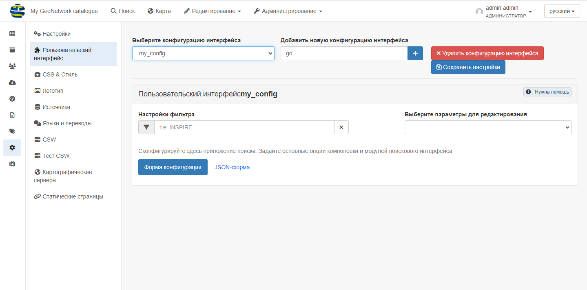

Параметров пользовательского интерфейса довольно много. В выпадающем списке `Выберите параметры для редактирования` администратор может:

- Открыть все параметры сразу (пункт `Все параметры`)

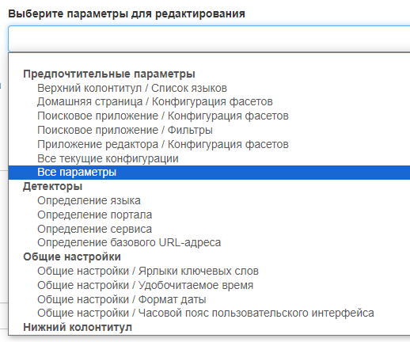

- Открыть нужный параметр отдельно от всех

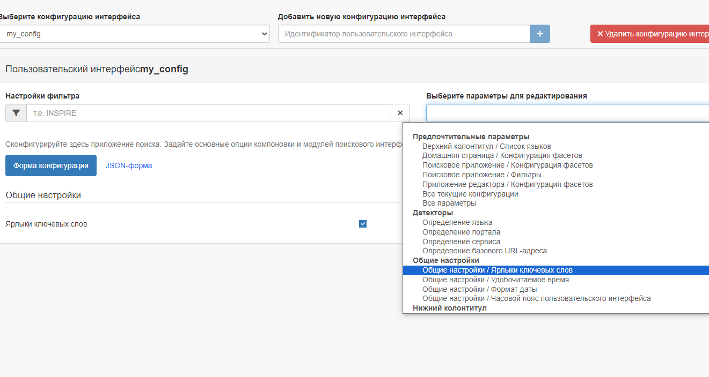

Дополнительные конфигурации также могут быть использованы для создания внешнего приложения на JS, которое может загружать определенную конфигурацию.

- **Настройки фильтра**: Это поле поиска можно использовать для фильтрации настроек в форме, 
  например, при поиске "социальные сети" будут отображаться только настройки, относящиеся к социальной панели.

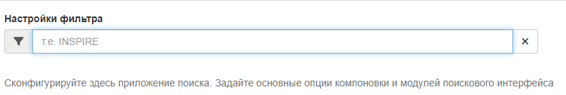

## Общие параметры

- **Ярлыки ключевых слов**: если выбрано, у ключевых слов будут созданы ярлыки.
- **Удобочитаемое время**: если выбрано, даты будут отображены в удобном для пользователя формате. Если он не установлен, будет отображаться полная дата.
- **Формат даты**: поле, где можно задать формат даты.
- **Часовой пояс пользовательского интерфейса**: Часовой пояс, который будет использоваться для отображения даты.
  Если нет необходимости обрабатывать несколько часовых поясов в каталоге, установите для этого значения часовой пояс сервера. 
  Значение `Browser` (по умолчанию) указывает на использование часового пояса браузера.

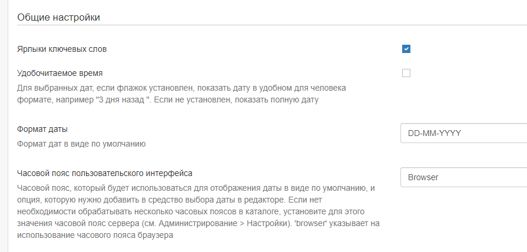

## Футер (нижний колонтитул)

- **Нижний колонтитул**: Установите этот флажок, чтобы определить, отображается ли нижний колонтитул GeoNetwork. 
   Если он не установлен, нижний колонтитул отображаться не будет.
- **Панель социальных сетей**: Установите этот флажок, чтобы отображать панель социальных сетей (ссылки на twitter, facebook, linkedin и т.д.) в нижнем колонтитуле.
- **Показать версию GeoNetwork и ссылки**: Показывать версию приложения и ссылки в нижнем колонтитуле страницы каталога.
- **Пункты пользовательского меню в нижнем колонтитуле**
- **Список RSS-каналов**

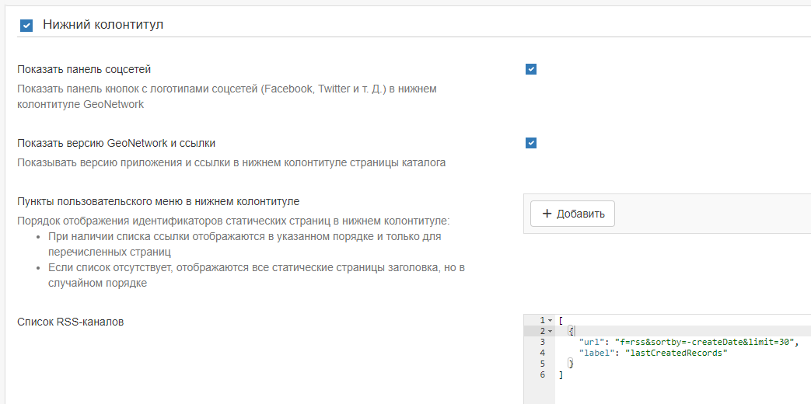

## Хедер (верхний колонтитул) 
- **Верхний колонтитул**: Установите этот флажок, чтобы определить, будет ли отображаться верхняя панель инструментов GeoNetwork. 
  Если этот параметр не задан, панель инструментов отображаться не будет.
- **Список языков**: Выберите языки из списка, которые должны быть доступны для перевода строк интерфейса. 
  Если останется только один язык, то выпадающий список отображаться не будет. 
  Обратите внимание, что при наличии перевода можно добавить дополнительные языки, нажав кнопку "+" под списком и добавив соответствующие ISO-коды.

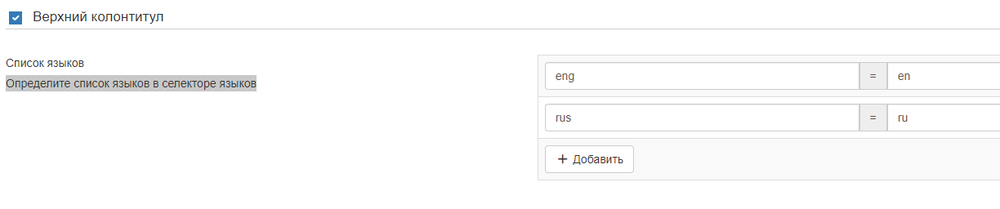

- **Показать логотип в заголовке**: Этот параметр определяет, где должен располагаться логотип каталога. 
  Если выбран этот параметр, логотип будет размещен в верхнем колонтитуле над верхней панелью инструментов, 
  а логотип панели инструментов (по умолчанию) будет удален. Если этот параметр не установлен, логотип будет отображаться на верхней панели инструментов.
- **Расположение логотипа**: Эти параметры определяют, в каком месте заголовка будет размещен логотип.
- **Контейнер раздела Головного меню**: Если включено, шаблон страницы распространяется на всю ширину экрана, в противном случае, имеет фиксированную ширину.
- **Показать название каталога в Головном меню**: Если включено, имя GeoNetwork будет отображаться в Головном меню, когда отключено, имя будет скрыто.
- **Фиксировать заголовок**: Заголовок фиксирован и остается вверху страницы. 
- **Отображать меню портала вверху**: по умолчанию true.

## Домашняя страница

- **Домашняя страница**: Установите этот флажок, чтобы определить, отображаются ли логотип и ссылка на домашнюю страницу на верхней панели инструментов. 
  Если флажок не установлен, логотип и ссылка не отображаются.
- **URL приложения**: Укажите URL для домашней страницы. В большинстве случаев это можно оставить по умолчанию.
- **Контейнер главной страницы**: Установите этот флажок, чтобы определить, будет ли поле поиска на странице браузера иметь полную ширину или фиксированную ширину и центрироваться.

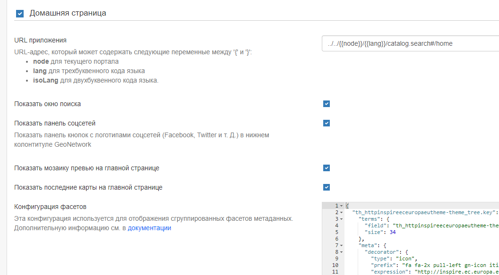

## Поисковое приложение

- **Приложение для поиска**: Установите этот флажок, чтобы определить, отображается ли приложение для поиска на верхней панели инструментов. 
  Если он не установлен, ссылка не отображается.
- **URL приложения**: Укажите URL для приложения для поиска. В большинстве случаев это значение можно оставить по умолчанию.
- **Количество записей на странице**: Укажите параметры для определения количества записей, отображаемых на странице результатов, и значения по умолчанию.
- **Базовый запрос**: Задайте фильтр по умолчанию для поиска.

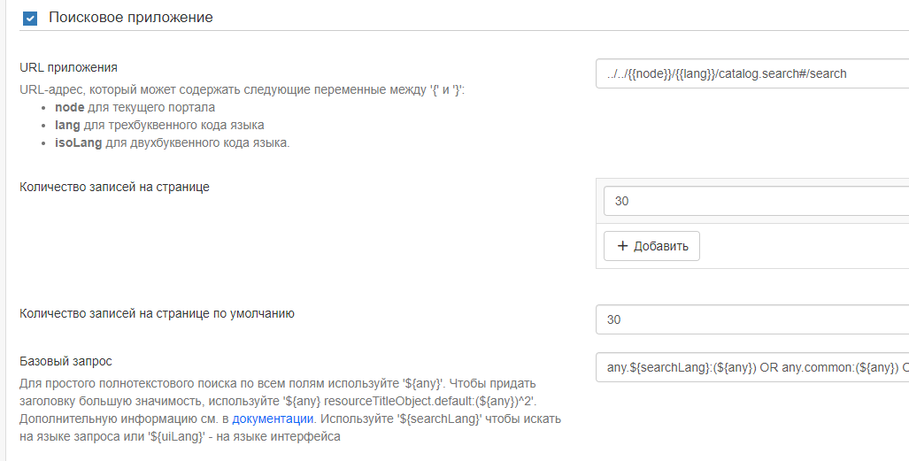

- **Фасетный фильтр для отображения с помощью вкладок**: Эта опция создает вкладку для каждого настроенного фасета над результатами поиска. 
  Это может быть использовано для дальнейшего сужения результатов поиска. 
  Список названий фасетов можно найти по адресу <https://github.com/geonetwork/core-geonetwork/blob/master/web/src/main/webapp/WEB-INF/config-summary.xml#L82>. 
  Например, чтобы включить фильтр тематических категорий над результатами поиска, администратор должен добавить "topicCat" в качестве поля для отображения аспекта.

- **Конфигурация фасетов**: Определяет набор фасетов поиска, которые должны быть видны на странице поиска. 
  По умолчанию используется "подробности", но можно использовать "менеджер" для отображения фасетов, которые чаще всего используются на странице редактора.

- **Фильтры**: Определяют дополнительные критерии поиска, которые добавляются ко всем поисковым запросам 
  и снова используются в основном для внешних приложений и подпорталов.

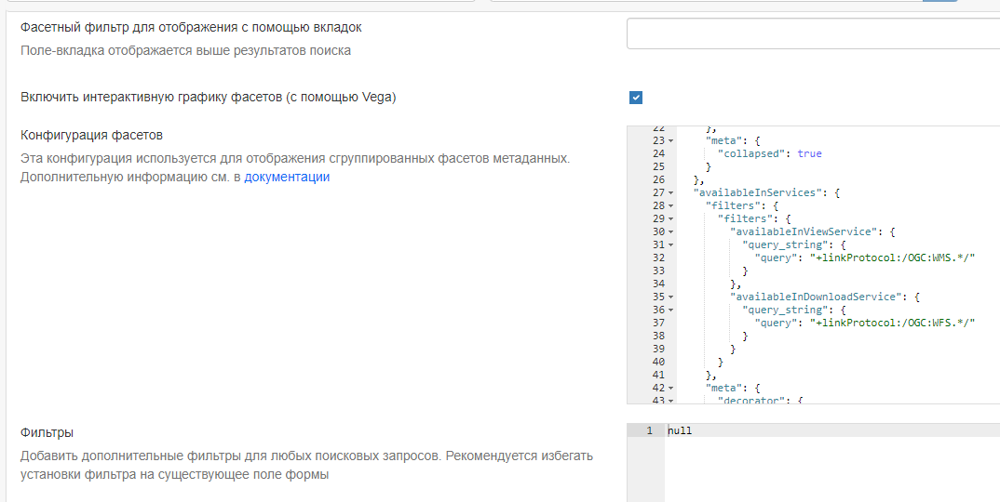

- **Варианты сортировки**: Определяет различные способы, с помощью которых пользователь может сортировать набор результатов поиска. 
  Ниже приведен параметр сортировки по умолчанию. Обратите внимание, что для поиска, например, по "названию" в алфавитном порядке 
  необходимо установить порядок "в обратном порядке".

- **Шаблоны результатов поиска**: Эта настройка позволяет администратору настраивать шаблоны для оформления результатов поиска. 
  По умолчанию используется "Grid", в то время как для панели редактирования используется "List".

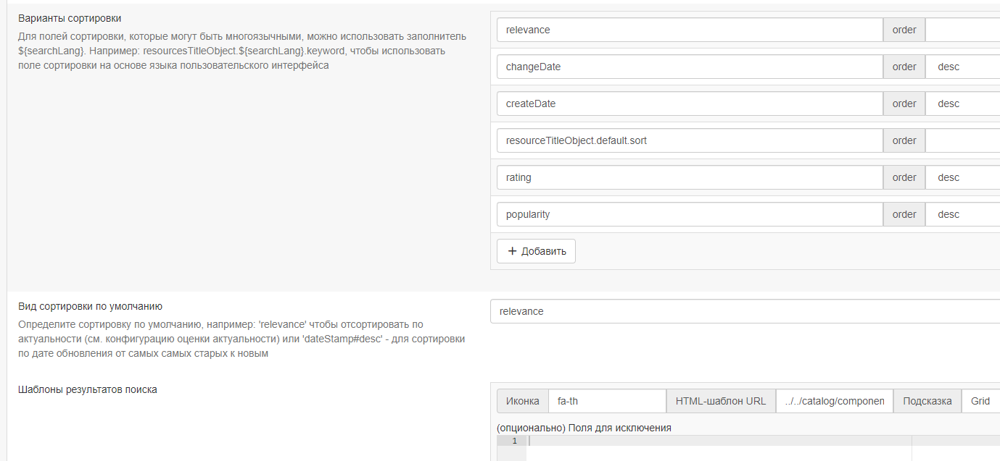

- **Шаблон результата поиска по умолчанию**: Определяет страницу шаблона для поиска. Как правило, это можно оставить по умолчанию.
- **Список formatter'ов для экспорта записей**: Определяет форматирование, используемое для отображения результатов поиска. 
  Смотрите [Настройка представлений метаданных](../../настройка-приложения/создание-пользовательского-представления.md) для получения информации 
  о создании нового средства форматирования. Чтобы добавить дополнительное представление, нажмите синюю кнопку "+" под списком и укажите имя и URL-адрес.

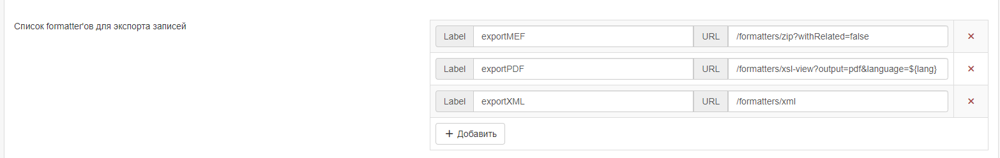

### Настройка результатов поиска

- **Соответствующие типы метаданных запроса**: Используйте этот раздел для определения типов метаданных, отображаемых при отображении результатов поиска в таблице. 
  Формат для добавления дополнительных типов нажмите синюю кнопку `+`. Возможные типы указаны под формой.

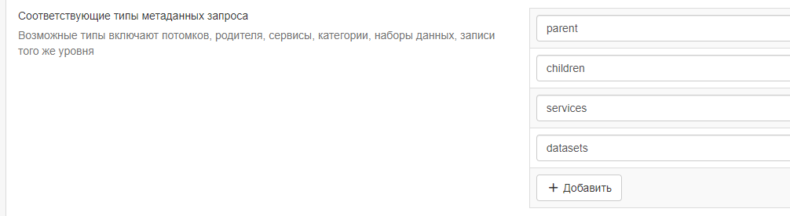

### Список типов ссылок

- **Ссылки**: В этом разделе определяются типы ссылок, отображаемых при отображении результатов поиска в формате таблицы. 
  Они разделены на "ссылки" (links), "загрузки" (downloads), "слои" (layers) и "карты" (maps), и для каждого типа можно добавить новую запись, 
  нажав синюю кнопку "+" под списком.

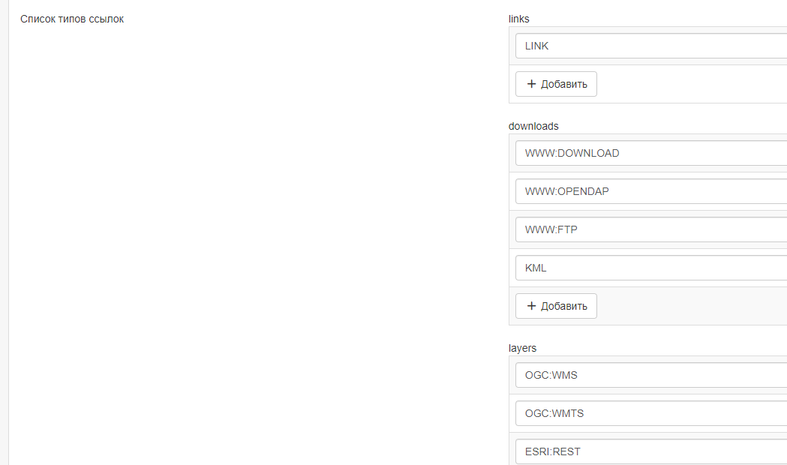

- **Отображать теги фильтров в результатах поиска**: Если флажок установлен, теги фильтров отображаются над результатами поиска. По умолчанию они не отображаются.

### Пользовательский поиск

- **Включено**: Если этот флажок установлен, пользователь сможет создавать и сохранять пользовательские поисковые запросы на вкладке "Поиск". 
  Эта функция будет отображаться над списком аспектов слева.

- **Отображение панели популярных поисков на главной странице**: 
  Если эта функция также включена, на домашней странице будет отображаться дополнительная вкладка рядом с "Последними новостями" и "Наиболее популярными".

### Сохраненные выборки

- **Включено**: Если флажок установлен, у пользователя будет возможность сохранять выбранные записи на вкладке поиска.

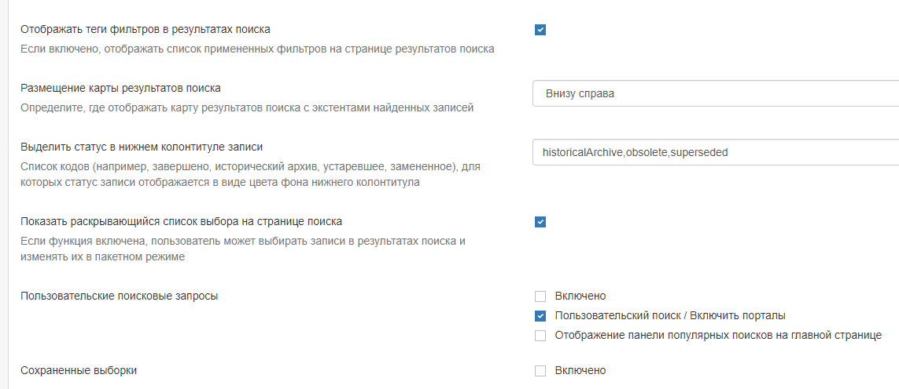


## Картографическое приложение

В этом разделе описывается, как администратор может настроить различные карты в пользовательском интерфейсе: 
основную карту, мини-карту, отображаемую на странице результатов поиска, и карту, используемую в редакторе для построения экстента.

- **Картографическое приложение**: Начальный флажок позволяет отключить основную вкладку "Карта". 
  В этом случае вкладка "карта" не будет отображаться на верхней панели инструментов, но мини-карта и карта-экстент, описанные выше, по-прежнему будут видны.
- **URL приложения**: Определяет URL-адрес для вкладки "Карта". В большинстве случаев это значение можно оставить по умолчанию.

### Внешний вьюер

- **Использовать внешний вьюер**: Этот параметр позволяет использовать стороннее картографическое приложение вместо карты Геосети по умолчанию. 
  В этом случае большинство приведенных ниже настроек больше использоваться не будут.

- **Разрешить 3D-режим**: Если он включен, у пользователя есть возможность переключиться в 3D-режим на главной карте 
  (см. [Быстрый запуск] (../../user-guide/quick-start/index.md)).

- **Разрешить пользователям сохранять карты как запись метаданных**: Эта опция позволяет пользователям сохранять слои 
  и конфигурацию базовых карт в виде записей в каталоге. При желании пользователи могут добавить название и аннотацию.

- **Экспорт карты как изображения**: Если эта опция включена, пользователи могут экспортировать карту в виде изображения, 
  но для любых внешних сервисов WMS, отображаемых на карте, требуется включить CORS. По умолчанию эта опция отключена, чтобы избежать проблем со слоями WMS.

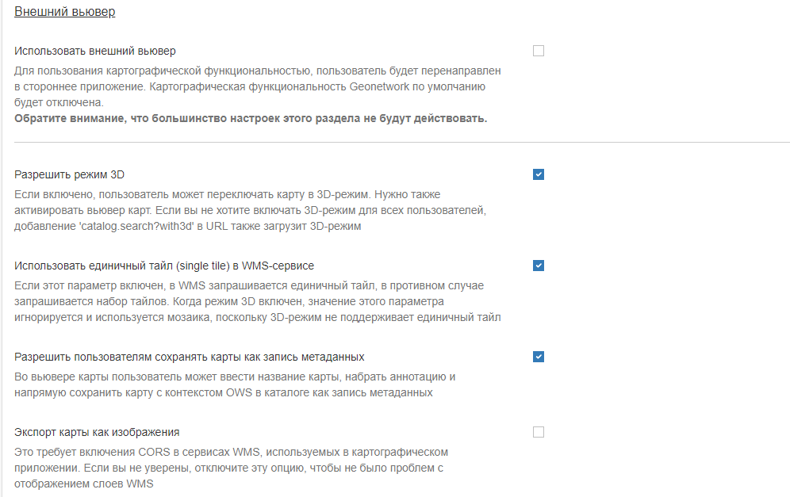

- **Хранение предпочтений пользователя**: Этот параметр определяет поведение файлов cookie, связанных с картой. Ниже перечислены различные параметры.
- **Ключ Bing Map**: Если этот параметр задан, то можно использовать карты Bing в качестве базовых слоев в картографическом приложении. 
  Чтобы это сработало, вы должны получить свой собственный ключ.

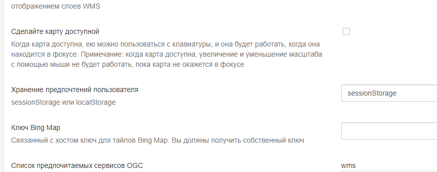


### List of preferred OGC services

Default **wms** and **wmts** services can be defined here that will be available by default to the end user. New services can be added using the blue `+` button below the protocol lists.

You can configure each map with different layers and projections.

-   **Map Projection** This is the default projection of the map. Make sure the projection is defined in **Projections to display maps into** below.

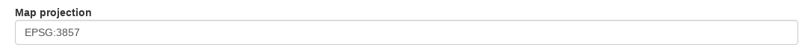

-   **List of map projections to display bounding box coordinates in** This is used in the map when editing a record and defining the bounding box extent. Note that the coordinates will be stored in WGS84 regardless of the projection used to draw them.

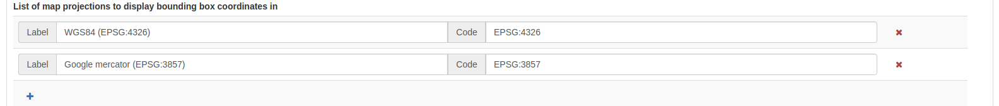

-   **Projections to display maps into** This is where the different projections available to the map are defined. All projections will be shown in the `Projection Switcher` tool of the map.

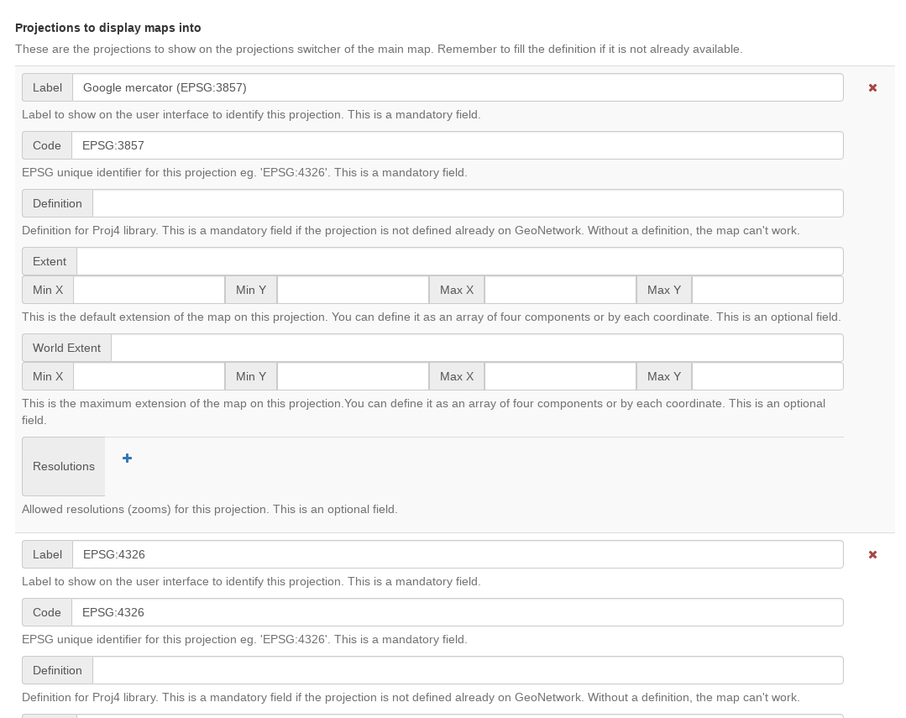

In order to enable a new projection it must be defined here using the **proj4js** syntax, which can be found at <https://proj4js.io>. Additionally the default bounding box extent, maximum bounding box extent, and allowed resolutions (if required) can be defined.

Ensure that the coordinates inserted are in the correct units for and are local to the projection. A list of resolutions is only relevant if the main map layer has a XYZ source, which does not follow the common tiling pattern.

Check that this configuration is valid by opening the map.


!!! info "Important"

    If the configuration of a projection is incomplete or invalid, the map may fail to load.


If a projection is defined which is not supported by the source of the map layer, the map application will reproject map images at the client side. This may cause unexpected behaviour, such as rotated or distorted labels.

-   **Optional Map Viewer Tools** The checkboxes in this section define the tools available to the user in the right toolbar of the main map. Elements that are not checked are not visible.
-   **OGC Service to use as a graticule**: This is optional and allows the use of an external service to display the graticule on the map.

### Viewer Map Configuration {#user-interface-config-viewermap}

This section is for configuring the map shown when viewing a record.

-   **Path to the context file (XML)**: An optional path to an XML file defining base layers and other configuration options. See `web/src/main/webapp/WEB-INF/data/data/resources/map/config-viewer.xml` for an example.
-   **Extent, expressed in current projection**: Use this option to override the extent defined in the context file.


-   **Layer objects in JSON**: Define additional layers to be shown on the map using JSON syntax. The supported types are:
    -   **wms**: generic WMS layer, required properties: `name, url`.
    -   **wmts**: generic WMTS layer, required properties: `name, url`.
    -   **tms**: generic TMS layer, required property: `url`.
    -   **osm**: OpenStreetMap default layer, no other property required.
    -   **stamen**: Stamen layers, required property: `name`.
    -   **bing_aerial**: Bing Aerial background, required property: `key` containing the license key.


All layers can also have some optional extra properties:

-   **title** The title/label of the layer.
-   **projectionList** Projection array to restrict this layer to certain projections on the map.

Examples of layers:

This layer will use OpenStreetMap Stamen style, but only when the map is in `EPSG:3857`:

``` json
{"type":"stamen","projectionList":["EPSG:3857"]}
```

This WMS layer will be shown but only when the map is on `EPSG:4326`:

``` json
{"type":"wms","title":"OI.OrthoimageCoverage","name":"OI.OrthoimageCoverage",
"url":"http://www.ign.es/wms-inspire/pnoa-ma?request=GetCapabilities&service=WMS",
"projectionList":["EPSG:4326"]}
```

### Search Map Configuration

This section defines the configuration for the mini map shown on the search page. It uses the same options as in [Viewer Map Configuration](user-interface-configuration.md#user-interface-config-viewermap).

### Editor Map Configuration

This section defines the configuration for the map shown when editing a record. It uses the same options as in [Viewer Map Configuration](user-interface-configuration.md#user-interface-config-viewermap).

## Gazetteer

-   **Gazetteer**: If enabled a gazetteer will be shown in the top left of the main map.
-   **Application URL**: Set the application URL used for the gazetteer. In general this should be left as the default, but additional filtering can be applied using the syntax described at <https://www.geonames.org/export/geonames-search.html>, for example to restrict results to a particular country (`country=FR`).

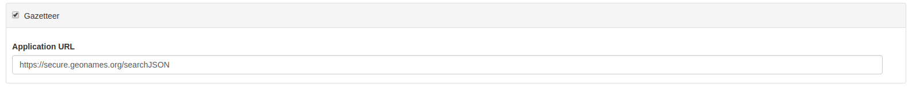

## Record View

-   **Record view**:
-   **Show Social bar**: If enabled the social bar (links to facebook, twitter etc) are enabled in record view.

## Editor Application

-   **Editor application**: If enabled the editor page, or contribute tab is available to users with the appropriate privileges. If not enabled the contribute tab is not shown in the top toolbar.
-   **Application URL**: This is the URL to the editor application and can generally be left as the default.
-   **Only my records**: If this checkbox is enabled then the "Only my records" checkbox in the editor dashboard will be checked by default.
-   **Display filters in dashboard**: If enabled, the currently selected facets will be shown above the search results in both the editor dashboard the batch editor page.
-   **Fluid container for the Editor**: If enabled, the editor application will have a full width container. If disabled it will have a fixed width and centered container.
-   **New metadata page layout**: Choose from the options for the layout of the `add new metadata` page. The default is `Horizontal` but a vertical layout can be chosen, or a custom layout based on a supplied template.
-   **Editor page indent type**: Choose from the options for the indent style when editing a record. The default is for minimal indents, select `Colored indents` to use the style shown below:

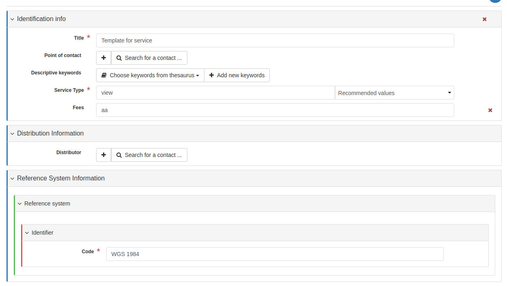

## Admin console

-   **Admin console**:
-   **Application URL**: Set the application URL for the admin console. In general this should be left as the default.

## Sign in application

-   **Sign in application**:
-   **Application URL**: Set the application URL for the sign in page. In general this should be left as the default.

## Sign out application

-   **Application URL**: Set the application URL for the sign out. In general this should be left as the default.

## Search application

-   **Search application**:
-   **Application URL**: Set the application URL for the search page. In general this should be left as the default.

## JSON Configuration

This section shows the JSON configuration for the currently applied User Interface settings. From here, the json can be saved to a file (by copying and pasting).

-   **Test client configuration**: Click this button to test the configuration in a new browser tab.
-   **Reset configuration**: Click this button to reset the configuration back to the default. Note that this will revert any changes you have made in the above page.

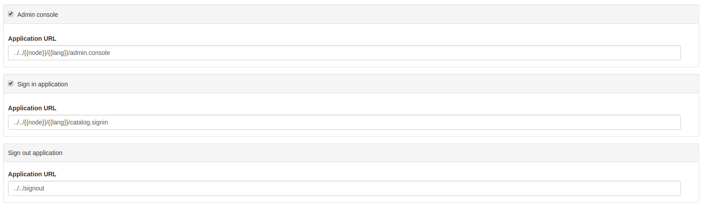
