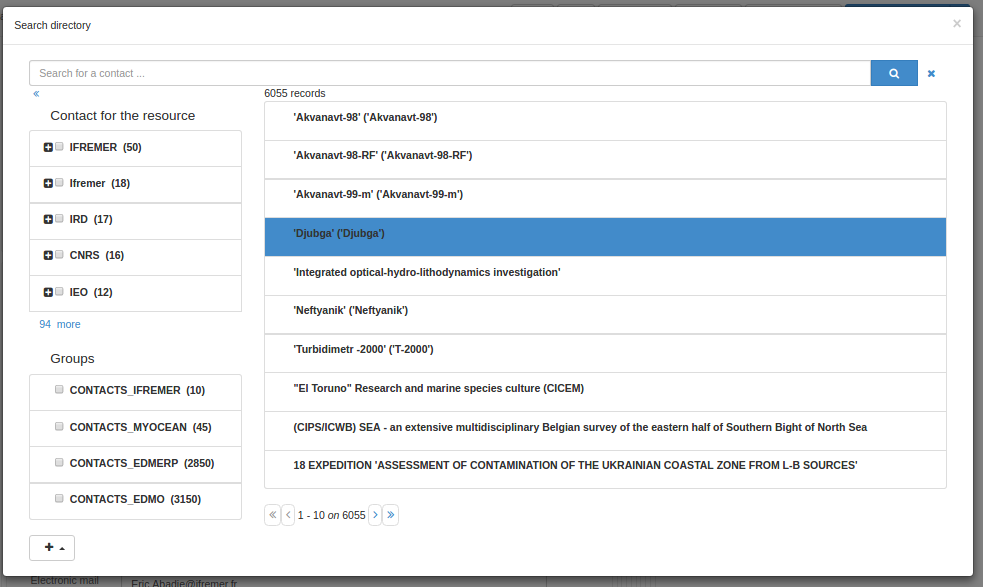
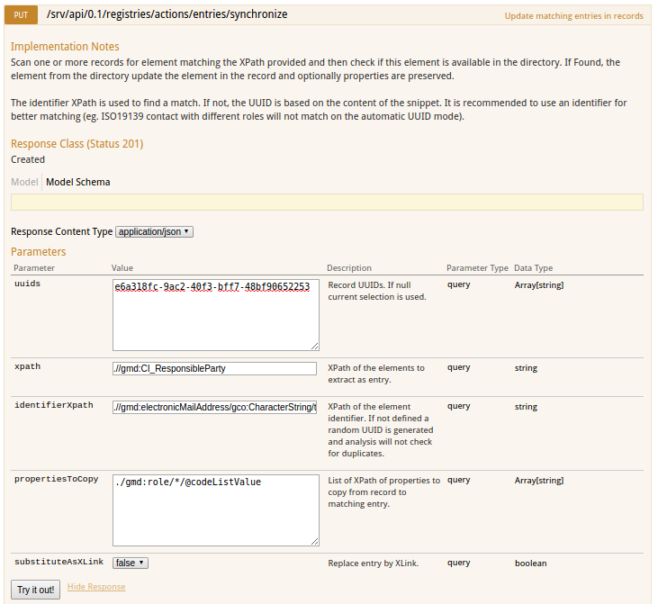

# Управление подшаблонами

Каталог поддерживает записи метаданных, которые состоят из фрагментов метаданных. 
Идея заключается в том, что фрагменты метаданных могут использоваться более чем в одной записи метаданных.

Вот типичный пример фрагмента. Это ответственная сторона, и она может использоваться в одной и 
той же записи метаданных более одного раза или в нескольких записях метаданных, если это применимо.

``` xml
<gmd:CI_ResponsibleParty xmlns:gmd="http://www.isotc211.org/2005/gmd" xmlns:gco="http://www.isotc211.org/2005/gco">
  <gmd:individualName>
    <gco:CharacterString>John D'Ath</gco:CharacterString>
  </gmd:individualName>
  <gmd:organisationName>
    <gco:CharacterString>Mulligan &amp; Sons, Funeral Directors</gco:CharacterString>
  </gmd:organisationName>
  <gmd:positionName>
    <gco:CharacterString>Undertaker</gco:CharacterString>
  </gmd:positionName>
  <gmd:role>
    <gmd:CI_RoleCode codeList="./resources/codeList.xml#CI_RoleCode" codeListValue="pointOfContact"/>
  </gmd:role>
</gmd:CI_ResponsibleParty>
```

Фрагменты метаданных, которые сохраняются в базе данных каталога, называются **подшаблонами**. 
В основном это делается по историческим причинам, так как подшаблон подобен шаблонной записи метаданных, 
поскольку он может быть использован в качестве «шаблона» для создания новой записи метаданных.

Фрагменты могут быть вставлены в запись метаданных двумя способами:

- копированием/вставкой
- по ссылке (если включена поддержка xlink. См. [Metadata XLink](../configuring-the-catalog/system-configuration.md#xlink_config)).

При использовании XLinks, если фрагмент обновляется, то связанный с ним фрагмент во всех записях метаданных также будет обновлен (проверьте кэш XLink).

Фрагменты могут быть созданы путем сбора 
(см. [Сбор фрагментов метаданных для поддержки повторного использования](../../user-guide/harvesting/index.md#harvesting_fragments)) 
или импортированы с помощью страницы импорта метаданных.

В этом разделе руководства описано:

- как управлять каталогами подшаблонов
- как извлекать фрагменты из существующего набора записей метаданных и сохранять их в виде подшаблонов
- как управлять кэшем фрагментов, используемым для ускорения доступа к фрагментам, которых нет в локальном каталоге

## Управление каталогами подшаблонов

Существуют некоторые различия между работой с подшаблонами и записями метаданных. 
В отличие от записей метаданных, подшаблоны не имеют согласованного корневого элемента, 
используемая ими схема метаданных может быть нераспознаваема, они не появляются в основных результатах поиска 
(если только не являются частью записи метаданных). Поэтому панель редактора позволяет искать и управлять привилегиями для записей каталогов.


На панели редактора выберите `Управление каталогом`, чтобы получить доступ к редактору записей каталога:


Если вкладку `Организации и контакты` не видно, убедитесь, что были созданы подшаблоны для контактов для своего профиля метаданных 
и были загружены их с помощью раздела `Метаданные и шаблоны`.

На этой странице редакторы могут выбрать тип каталога с помощью верхних вкладок, редактировать/удалять/импортировать новые подшаблоны.

Для импорта новых записей используйте страницу импорта метаданных и выберите соответствующий тип записи:


Как и записям метаданных, им присваивается целочисленный идентификатор, и они хранятся в таблице метаданных каталога (с полем шаблона, установленным на «y»).
## Вставьте запись каталога в запись метаданных

В редакторе метаданных каталог можно использовать, например, для заполнения контактов.


Откройте селектор каталогов, выберите контакт, а затем выберите роль контакта.



## Извлечение вложенных шаблонов из записей метаданных

На многих сайтах уже существуют записи метаданных с общей информацией, например. контактная информация в элементе ISO CI_Contact. 
Записи каталога, подобные этим, могут быть извлечены из выбранного набора записей метаданных с помощью API "Extract subtemplates".

Чтобы использовать эту функцию, необходимо выполнить следующий набор действий:

- Убедитесь, что вы понимаете, что такое XPath - смотрите, например, <http://www.w3schools.com/xpath/default.asp>.
- Определить фрагменты метаданных, которыми они хотели бы управлять как подтемплатами повторного использования в записи метаданных. 
  Это можно сделать с помощью XPath. например, XPath `.//gmd:CI_ResponsibleParty` определяет всю ответственную сторону в записи. 
  Пример такого фрагмента (взятого из одной из выборочных записей) показан в следующем примере:

``` xml
<gmd:CI_ResponsibleParty xmlns:gmd="http://www.isotc211.org/2005/gmd" xmlns:gco="http://www.isotc211.org/2005/gco">
   <gmd:individualName>
      <gco:CharacterString>Jippe Hoogeveen</gco:CharacterString>
   </gmd:individualName>
   <gmd:organisationName>
      <gco:CharacterString>FAO - NRCW</gco:CharacterString>
   </gmd:organisationName>
   <gmd:positionName>
      <gco:CharacterString>Technical Officer</gco:CharacterString>
   </gmd:positionName>
   <gmd:contactInfo>
      <gmd:CI_Contact>
         <gmd:phone>
            <gmd:CI_Telephone>
               <gmd:voice gco:nilReason="missing">
                  <gco:CharacterString/>
               </gmd:voice>
               <gmd:facsimile gco:nilReason="missing">
                  <gco:CharacterString/>
               </gmd:facsimile>
            </gmd:CI_Telephone>
         </gmd:phone>
         <gmd:address>
            <gmd:CI_Address>
               <gmd:deliveryPoint>
                  <gco:CharacterString>Viale delle Terme di Caracalla</gco:CharacterString>
               </gmd:deliveryPoint>
               <gmd:city>
                  <gco:CharacterString>Rome</gco:CharacterString>
               </gmd:city>
               <gmd:administrativeArea gco:nilReason="missing">
                  <gco:CharacterString/>
               </gmd:administrativeArea>
               <gmd:postalCode>
                  <gco:CharacterString>00153</gco:CharacterString>
               </gmd:postalCode>
               <gmd:country>
                  <gco:CharacterString>Italy</gco:CharacterString>
               </gmd:country>
               <gmd:electronicMailAddress>
                  <gco:CharacterString>jippe.hoogeveen@fao.org</gco:CharacterString>
               </gmd:electronicMailAddress>
            </gmd:CI_Address>
         </gmd:address>
      </gmd:CI_Contact>
   </gmd:contactInfo>
   <gmd:role>
      <gmd:CI_RoleCode codeList="http://standards.iso.org/ittf/PubliclyAvailableStandards/ISO_19139_Schemas/resources/codelist/ML_gmxCodelists.xml#CI_RoleCode"
                       codeListValue="pointOfContact"/>
   </gmd:role>
</gmd:CI_ResponsibleParty>
```


- Определите и запишите XPath к полю или полям фрагмента, текстовое содержимое которых будет использоваться в качестве идентификатора подшаблона. 
  Этот XPath должен быть относительным к корневому элементу фрагмента, определенному на предыдущем шаге. 
  Например, в приведенном выше фрагменте мы можем выбрать `.//gmd:electronicMailAddress/gco:CharacterString/text()` 
  в качестве идентификатора для создаваемых фрагментов.

- На странице API выберите операцию registries / collect:


- Заполните форму информацией, собранной на предыдущих шагах.
- Извлеченные подшаблоны можно предварительно просмотреть с помощью режима GET, а после проверки использовать метод PUT для сохранения результатов в каталоге.

Наконец, перейдите в интерфейс управления каталогом подшаблонов, 
и вы сможете выбрать корневой элемент ваших подшаблонов, чтобы просмотреть извлеченные подшаблоны.

Индексирование подшаблонов основано на схеме (подробности см. в папке index-fields). 
В настоящее время ISO19139 индексирует подшаблоны, используя в качестве корневого элемента:

- gmd:CI_ResponsibleParty
- gmd:MD_Distribution
- gmd:CI_OnlineResource
- gmd:EX_Extent

В стандарте ISO19115-3

- cit:CI_Responsibility
- *[mdq:result]
- gex:EX_Extent

Другие примеры конфигурации для сбора:

- Стороны в ISO19115-3
    - `xpath`: `.//cit:CI_Responsibility`
    - `identifierXpath`: `.//cit:electronicMailAddress/*/text()`.
- Спецификации качества в стандарте ISO19115-3
    - `xpath`: `.//*[mdq:result]`
    - `identifierXpath`: `.//cit:title/*/text()`
- Экстент в ISO19115-3
    - `xpath`: `.//gex:EX_Extent`
    - `identifierXpath`: `concat(.//gex:westBoundLongitude/*/text(), ', ', .//gex:eastBoundLongitude/*/text(), ', ', .//gex:southBoundLatitude/*/text(), ', ', .//gex:northBoundLatitude/*/text())` или `gex:description/*/text()`.
- Ограничения в ISO19115-3
    - `xpath`: `.//mri:resourceConstraints/*`


## Синхронизация подшаблонов с записями метаданных

После создания каталог предоставляет возможность синхронизировать записи метаданных с записями каталога. Для этого используйте страницу тестирования API.

Процесс синхронизации использует те же параметры, что и процесс сбора, с двумя дополнительными аргументами:

- `propertiesToCopy` для сохранения некоторого элемента, который может быть определен во фрагменте в метаданных (например, роль контакта)
- `substituteAsXLink`, чтобы указать, следует ли использовать режим копирования/вставки или режим XLink.



## Управление кэшем фрагментов

Если записи метаданных в вашем каталоге содержат фрагменты ссылок с внешних сайтов, 
каталог кэширует эти фрагменты после первого поиска, чтобы уменьшить объем сетевого трафика 
и ускорить отображение записей метаданных в результатах поиска.

Кэш обрабатывается автоматически с помощью системы кэширования Java (JCS). JCS интеллектуально обрабатывает большие кэши, определяя:

- определения максимального количества кэшируемых объектов
- использования максимально возможного объема оперативной памяти перед переходом на вторичное хранилище (диск)
- обеспечения постоянства кэша: кэш сохраняется на диск при завершении работы веб-приложения и восстанавливается с диска при перезапуске.

Настроить параметры JCS в GeoNetwork можно с помощью файла конфигурации JCS в **INSTALL_DIR/web/geonetwork/WEB-INF/classes/cache.ccf**.

Некоторые операции в каталоге (например, сбор урожая), генерирующие фрагменты метаданных, 
будут автоматически обновлять кэш XLink при генерации нового фрагмента. Однако если фрагменты будут связаны с внешнего сайта, 
то, в зависимости от частоты изменений, придется вручную обновлять кэш XLink. 
Для этого необходимо перейти на страницу администрирования и выбрать функцию «Очистить кэш XLink и перестроить индекс записей с XLinks»,
как показано на следующем скриншоте страницы «Администрирование».


