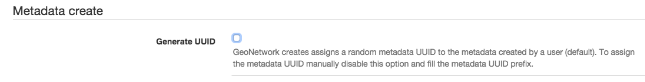
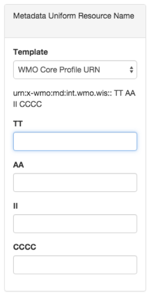

# Настройка идентификатора метаданных {#metadata_identifier}

Некоторые организации требуют определения идентификаторов метаданных с помощью шаблонов [URN](https://en.wikipedia.org/wiki/Uniform_Resource_Name).

В `консоли админа` --> `Метаданные и шаблоны` --> `Шаблоны ID метаданных` пользователи могут настроить поведение каталога при создании новых метаданных:

- Создавать случайный UUID. Это «стандартное» поведение GeoNetwork, и оно установлено по умолчанию.
- Использовать шаблоны URN метаданных для определения идентификаторов метаданных. 
  Эта опция позволяет пользователю вводить идентификатор метаданных из шаблонов метаданных URN, определенных пользователем-администратором.

Чтобы включить использование шаблонов URN метаданных для идентификаторов метаданных, пользователь должен отключить следующую настройку:

После включения этой функции на странице создания метаданных появится новая панель, позволяющая пользователю выбрать шаблон идентификатора метаданных:

- Пользовательский идентификатор: Позволяет пользователю ввести произвольное текстовое значение для идентификатора метаданных.

- Автогенерируемый идентификатор: каталог создает случайный UUID.
- Список пользовательских шаблонов: Список шаблонов идентификаторов метаданных. 
  Когда пользователь выбирает один из этих шаблонов, форма запрашивает различные значения шаблона.

Новые шаблоны можно добавить в интерфейсе конфигурации:

Для каждого шаблона пользователь может определить некоторые параметры для заполнения формы создания метаданных. 
Параметры задаются между фигурными скобками. Например:

- <urn:x-wmo:md:int.wmo.wis>::{TT}{AA}{II}{CCCC}
- au.gov.bom::{IDCODE}
