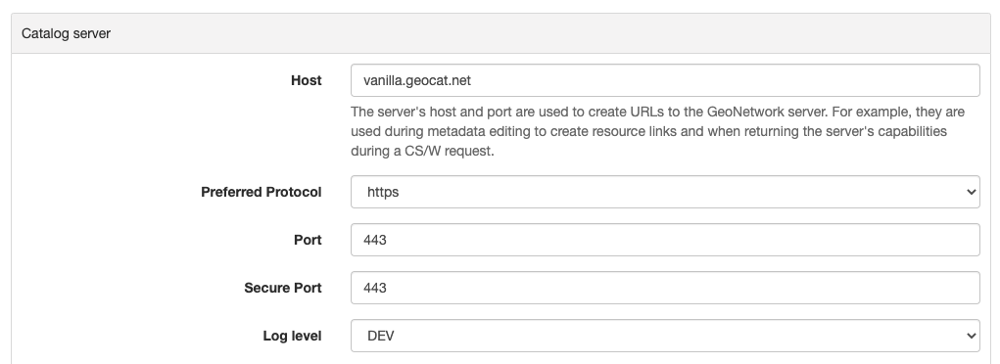

# Режим аутентификации

По умолчанию каталог использует внутреннюю базу данных для управления пользователями и аутентификации. Однако существуют и другие механизмы аутентификации:

- [Настройка LDAP](authentication-mode.md#authentication-ldap)
- [Настройка LDAP - Иерархия](authentication-mode.md#authentication-ldap-hierarchy)
- [Настройка CAS](authentication-mode.md#authentication-cas)
- [Настройка OAUTH2 OpenID Connect](authentication-mode.md#authentication-openid)
- [Настройка Keycloak](authentication-mode.md#authentication-keycloak)
- [Настройка Shibboleth](authentication-mode.md#authentication-shibboleth)

Используемый режим настраивается в **`WEB-INF/config-security/config-security.xml`** или через переменную окружения `geonetwork.security.type`.

Раскомментируйте соответствующую строку в **`WEB-INF/config-security/config-security.xml`**:

```xml
<import resource="config-security-{mode}.xml"/>
```

## Настройка LDAP {#authentication-ldap}

[Облегченный протокол доступа к каталогам (LDAP)](https://en.wikipedia.org/wiki/Ldap) позволяет GeoNetwork проверять имена пользователей и пароли в удаленном хранилище идентификационных данных. Реализация LDAP использует стандартные элементы интерфейса входа GeoNetwork.

В GeoNetwork есть 2 подхода к настройке LDAP. Проверьте также альтернативный подход в [Настройка LDAP - Иерархия](authentication-mode.md#authentication-ldap-hierarchy).

Конфигурация LDAP определена в `WEB-INF/config-security/config-security.properties`. Вы можете настроить среду, обновив этот файл или переопределив свойства в файле `WEB-INF/config-security/config-security-overrides.properties`.

1. Определите подключение LDAP:

    - `ldap.base.provider.url`: Указывает порталу, где находится сервер LDAP. Убедитесь, что компьютер с каталогом может подключиться к компьютеру с сервером LDAP. Проверьте, открыты ли соответствующие порты и т.д.
    - `ldap.base.dn`: обычно это выглядит примерно так: "dc=[organizationnamehere],dc=org"
    - `ldap.security.principal` / `ldap.security.credentials`: Определите пользователя администратора LDAP для привязки к LDAP. Если не определено, выполняется анонимная привязка. Principal - это имя пользователя, а credentials - пароль.

    ```text
    # Свойства безопасности LDAP
    ldap.base.provider.url=ldap://localhost:389
    ldap.base.dn=dc=fao,dc=org
    ldap.security.principal=cn=admin,dc=fao,dc=org
    ldap.security.credentials=ldap
    ```

    Чтобы проверить правильность настроек, попробуйте подключиться к серверу LDAP с помощью браузера LDAP.

2. Определите, где искать пользователей в структуре LDAP для аутентификации:

    - `ldap.base.search.base`: здесь каталог будет искать пользователей для аутентификации.
    - `ldap.base.dn.pattern`: это отличительное имя пользователя для привязки. `{0}` заменяется именем пользователя, введенным на экране входа.

    ```text
    ldap.base.search.base=ou=people
    ldap.base.dn.pattern=uid={0},${ldap.base.search.base}
    #ldap.base.dn.pattern=mail={0},${ldap.base.search.base}
    ```

### Настройки авторизации

При использовании LDAP информация о пользователе и привилегии для GeoNetwork могут быть определены из атрибутов LDAP.

#### Информация о пользователе

Информация о пользователе может быть получена из LDAP, настроив для каждого атрибута пользователя в базе данных каталога соответствующий атрибут LDAP. Если атрибут пуст или не определен, можно задать значение по умолчанию. Значение свойства состоит из двух частей, разделенных символом `,`. Первая часть - это имя атрибута, а вторая - значение по умолчанию, если имя атрибута не определено или значение атрибута в LDAP пусто.

Конфигурация следующая:

```text
# Сопоставление информации о пользователе с атрибутами LDAP и значениями по умолчанию
# ldapUserContextMapper.mapping[name]=ldap_attribute,default_value
ldapUserContextMapper.mapping[name]=cn,
ldapUserContextMapper.mapping[surname]=givenName,
ldapUserContextMapper.mapping[mail]=mail,data@myorganization.org
ldapUserContextMapper.mapping[organisation]=,myorganization
ldapUserContextMapper.mapping[kind]=,
ldapUserContextMapper.mapping[address]=,
ldapUserContextMapper.mapping[zip]=,
ldapUserContextMapper.mapping[state]=,
ldapUserContextMapper.mapping[city]=,
ldapUserContextMapper.mapping[country]=,
```

#### Конфигурация привилегий

Группы пользователей и профили пользователей могут быть установлены опционально из информации LDAP или нет. По умолчанию привилегии пользователей управляются из локальной базы данных. Если информация LDAP должна использоваться для определения привилегий пользователей, установите свойство `ldap.privilege.import` в `true`:

```text
ldap.privilege.import=true
```

При импорте привилегий из LDAP администратор каталога может решить создавать группы, определенные в LDAP и не определенные в локальной базе данных. Для этого установите следующее свойство в true:

```text
ldap.privilege.create.nonexisting.groups=false
```

Чтобы определить, членом каких групп является пользователь и какой профиль имеет пользователь:

```text
ldapUserContextMapper.mapping[privilege]=groups,sample
# Если не установлено, профиль по умолчанию - RegisteredUser
# Допустимые профили: ADMINISTRATOR, USER_ADMIN, REVIEWER, EDITOR, REGISTERED_USER, GUEST
ldapUserContextMapper.mapping[profile]=privileges,RegisteredUser
```

Конфигурация атрибутов:

- атрибут privilege содержит группу, членом которой является этот пользователь. Допускается более одной группы.
- атрибут profile содержит профиль пользователя.

Допустимые профили пользователей:

- Administrator
- UserAdmin
- Reviewer
- Editor
- RegisteredUser
- Guest

Если атрибут LDAP, содержащий профили, не соответствует списку профилей каталога, можно определить сопоставление:

```text
# Сопоставление пользовательских профилей LDAP с профилями каталога. Не используется, если определен ldap.privilege.pattern.
ldapUserContextMapper.profileMapping[Admin]=Administrator
ldapUserContextMapper.profileMapping[Editor]=Reviewer
ldapUserContextMapper.profileMapping[Public]=RegisteredUser
```

Например, в предыдущей конфигурации значение атрибута `Admin` будет сопоставлено с `Administrator` (который является допустимым профилем для каталога).

Атрибут может определять как профиль, так и группу для пользователя. Чтобы извлечь эту информацию, можно определить пользовательский шаблон для заполнения привилегий пользователя в соответствии с этим атрибутом:

1. Определите один атрибут для профиля и один для групп в `WEB-INF/config-security/config-security-overrides.properties`

    ```text
    # В config-security-overrides.properties
    ldapUserContextMapper.mapping[privilege]=cat_privileges,sample
    ```

2. Определите один атрибут для привилегии и определите пользовательский шаблон:

    ```text
    # В config-security.properties
    ldap.privilege.pattern=CAT_(.*)_(.*)
    ldap.privilege.pattern.idx.group=1
    ldap.privilege.pattern.idx.profil=2
    ```

    Включите бин `er` для `LDAPUserDetailsContextMapperWithPattern` (в `WEB-INF/config-security/config-security-ldap.xml`).

    ```xml
    <!--<bean id="ldapUserContextMapper"
        class="org.fao.geonet.kernel.security.ldap.LDAPUserDetailsContextMapper">
        <property name="mapping">
          <map/>
        </property>
        <property name="profileMapping">
          <map/>
        </property>
        <property name="ldapBaseDn" value="${ldap.base.dn}"/>
        <property name="importPrivilegesFromLdap" value="${ldap.privilege.import}"/>
        <property name="createNonExistingLdapGroup"
                  value="${ldap.privilege.create.nonexisting.groups}"/>
        <property name="createNonExistingLdapUser" value="${ldap.privilege.create.nonexisting.users}"/>
        <property name="ldapManager" ref="ldapUserDetailsService"/>
        <property name="contextSource" ref="contextSource"/>
        <property name="ldapUsernameCaseInsensitive" value="${ldap.usernameCaseInsensitive:#{true}}"/>
    </bean>-->

    <bean id="ldapUserContextMapper" class="org.fao.geonet.kernel.security.ldap.LDAPUserDetailsContextMapperWithPattern">
      <property name="mapping">
          <map/>
      </property>
      <property name="profileMapping">
          <map/>
      </property>
      <property name="importPrivilegesFromLdap" value="${ldap.privilege.import}"/>
      <property name="createNonExistingLdapGroup" value="${ldap.privilege.create.nonexisting.groups}" />
      <property name="createNonExistingLdapUser" value="${ldap.privilege.create.nonexisting.users}" />

      <property name="ldapManager" ref="ldapUserDetailsService" />

      <property name="privilegePattern" value="${ldap.privilege.pattern}" />
      <property name="groupIndexInPattern" value="${ldap.privilege.pattern.idx.group}"/>
      <property name="profilIndexInPattern" value="${ldap.privilege.pattern.idx.profil}"/>

      <property name="contextSource" ref="contextSource" />
    </bean>
    ```

3. Определите пользовательское местоположение для извлечения группы и роли (нет поддержки комбинации группа/роль) (используйте LDAPUserDetailsContextMapperWithProfileSearch в **`config-security.xml`**).

    ```text
    ldap.privilege.search.group.attribute=cn
    ldap.privilege.search.group.object=ou=groups
    #ldap.privilege.search.group.query=(&(objectClass=*)(memberUid=uid={0},${ldap.base.search.base},${ldap.base.dn})(cn=EL_*))
    ldap.privilege.search.group.queryprop=memberuid
    ldap.privilege.search.group.query=(&(objectClass=*)(memberUid=uid={0},${ldap.base.search.base},${ldap.base.dn})(|(cn=SP_*)(cn=EL_*)))
    ldap.privilege.search.group.pattern=EL_(.*)
    ldap.privilege.search.privilege.attribute=cn
    ldap.privilege.search.privilege.object=ou=groups
    ldap.privilege.search.privilege.query=(&(objectClass=*)(memberUid=uid={0},${ldap.base.search.base},${ldap.base.dn})(cn=SV_*))
    ldap.privilege.search.privilege.pattern=SV_(.*)
    ```

    Атрибут LDAP может содержать следующую конфигурацию для определения различных типов пользователей, например:

    ```text
    cat_privileges=CAT_ALL_Administrator

    -- Определить рецензента для группы GRANULAT
    cat_privileges=CAT_GRANULAT_Reviewer

    -- Определить рецензента для группы GRANULAT и редактора для MIMEL
    cat_privileges=CAT_GRANULAT_Reviewer
    cat_privileges=CAT_MIMEL_Editor

    -- Определить рецензента для группы GRANULAT и редактора для MIMEL и RegisteredUser для NATURA2000
    cat_privileges=CAT_GRANULAT_Reviewer
    cat_privileges=CAT_MIMEL_Reviewer
    cat_privileges=CAT_NATURA2000_RegisteredUser

    -- Только зарегистрированный пользователь для GRANULAT
    cat_privileges=CAT_GRANULAT_RegisteredUser
    ```

#### Синхронизация

Задача синхронизации заботится об удалении пользователей LDAP, которые могут быть удалены. Например:

- T0: Пользователь А входит в каталог. Локальный пользователь А создается в базе данных пользователей.
- T1: Пользователь А удаляется из LDAP (Пользователь А больше не может войти в каталог).
- T2: Задача синхронизации проверит, что все локальные пользователи LDAP существуют в LDAP:
    - Если пользователь не владеет никакими записями, он будет удален.
    - Если пользователь владеет записями метаданных, в систему логирования каталога будет записано предупреждающее сообщение. Владелец записи должен быть изменен на другого пользователя, прежде чем задача сможет удалить текущего владельца.

По умолчанию задача выполняется один раз в день. Это можно изменить в следующем свойстве:

```text
# Запускать синхронизацию LDAP каждый день в 23:30
ldap.sync.cron=0 30 23 * * ?
```

Следующие свойства позволяют выполнить расширенную настройку процесса синхронизации:

```text
ldap.sync.user.search.base=${ldap.base.search.base}
ldap.sync.user.search.filter=(&(objectClass=*)(mail=*@*)(givenName=*))
ldap.sync.user.search.attribute=uid
ldap.sync.group.search.base=ou=groups
ldap.sync.group.search.filter=(&(objectClass=posixGroup)(cn=EL_*))
ldap.sync.group.search.attribute=cn
ldap.sync.group.search.pattern=EL_(.*)
```

#### Отладка

Если подключение не удается, попробуйте увеличить уровень логирования для LDAP в `WEB-INF/classes/log4j.xml`:

```xml
<logger name="geonetwork.ldap" additivity="false">
    <level value="DEBUG"/>
</logger>
```

Или в настройках конфигурации временно установите `Log level` на `DEV`:



## Настройка LDAP - Иерархия {#authentication-ldap-hierarchy}

Несколько иной метод настройки LDAP был введен в середине 2020 года.

Он расширяет исходную инфраструктуру конфигурации (исходные конфигурации по-прежнему работают без изменений).

Перед началом настройки вам потребуется знать:

1. URL вашего сервера LDAP
2. Имя пользователя/пароль для входа на сервер LDAP (для выполнения запросов)
3. Запрос LDAP для поиска пользователя (учитывая то, что они вводят на экране входа)
4. Подробности о том, как преобразовать атрибуты пользователя LDAP в атрибуты пользователя GeoNetwork
5. Запрос LDAP для поиска групп, членом которых является пользователь
6. Как преобразовать группу LDAP в группу/профиль GeoNetwork

!!! note

    Существует [видеочат разработчиков]( в котором подробно рассказывается, как настроить LDAP, включая настройку предварительно сконфигурированного сервера LDAP (с использованием Apache Directory Studio) для тестирования/отладки/обучения.

!!! note

    Стоит ли использовать иерархическую или исходную конфигурацию?

    Если у вас уже есть существующая (исходная) конфигурация, нет необходимости переходить на новую. Большая часть кода между ними одинакова.

    Если вы начинаете новую конфигурацию, я бы рекомендовал иерархическую конфигурацию. Она немного проще и поддерживается тестовыми примерами и инфраструктурой тестирования. Она также поддерживает LDAP, где пользователи/группы находятся в нескольких каталогах.

### Настройка бинов LDAP (Иерархия)

GeoNetwork поставляется с примером конфигурации LDAP, который вы можете использовать в Apache Directory Studio для создания того же сервера LDAP, который используется в тестовых примерах. Также есть пример конфигурации GeoNetwork, которая подключается к этому серверу LDAP. См. `core-geonetwork/blob/master/core/src/test/resources/org/fao/geonet/kernel/security/ldap/README.md`{.interpreted-text role="repo"} или [видеочат разработчиков]( для инструкций.

!!! note

    Чтобы использовать эту конфигурацию, раскомментируйте строку "<import resource="config-security-ldap-recursive.xml"/>" в ``web/src/main/webapp/WEB-INF/config-security/config-security.xml``

1. Настройте бин `ce` со ссылкой на ваш сервер LDAP и пользователя, который может выполнять запросы LDAP.

    ```xml
    <bean id="contextSource"   class="org.springframework.security.ldap.DefaultSpringSecurityContextSource">
        <constructor-arg value=“ldap://localhost:3333/dc=example,dc=com"/>

        <property name="userDn" value="cn=admin,ou=GIS Department,ou=Corporate Users,dc=example,dc=com"/>
        <property name="password" value="admin1"/>
    </bean>
    ```

2. Настройте бин `ch` с запросом, используемым для поиска пользователя (учитывая то, что было введено на странице входа).

    ПРИМЕЧАНИЕ: Установите `ee` в `ue` для выполнения рекурсивного поиска в LDAP. Используйте `se` для управления тем, в каком каталоге начинается поиск ("" означает начало с корня).

    ```xml
    <bean id="ldapUserSearch" class="…">
       <constructor-arg name="searchBase" value=""/>
       <constructor-arg name="searchFilter" value="(sAMAccountName={0})"/>
       <constructor-arg name="contextSource" ref="contextSource"/>

       <property name="searchSubtree" value="true"/>
    </bean>
    ```

3. Настройте бин `er` с тем, как преобразовать атрибуты пользователя LDAP в атрибуты пользователя GeoNetwork (см. документацию по исходной конфигурации выше).

    ПРИМЕЧАНИЕ: Часть `ue` состоит из двух частей. Первая часть — это имя атрибута LDAP (может быть пустой). Вторая часть — значение по умолчанию, если атрибут LDAP отсутствует или пуст (см. документацию по исходной конфигурации выше).

    ```xml
    <bean id="ldapUserContextMapper" class=“LDAPUserDetailsContextMapperWithProfileSearchEnhanced">

        <property name="mapping">
          <map>
            <entry key="name" value="cn,"/>
            <entry key="surname" value="sn,"/>
            <entry key="mail" value="mail,"/>
            <entry key="organisation" value=","/>
            <entry key="address" value=","/>
            <entry key="zip" value=","/>
            <entry key="state" value=","/>
            <entry key="city" value=","/>
            <entry key="country" value=","/>

            <entry key="profile" value=",RegisteredUser"/>
            <entry key="privilege" value=",none"/>
          </map>
        </property>

    </bean>
    ```

4. Продолжите настройку бина `er`, чтобы LDAP также мог предоставлять роли групп/профилей для пользователя.

    ПРИМЕЧАНИЕ: `ry` — это каталог LDAP, в котором начнется запрос членства ("" означает начало в корне LDAP).

    ```xml
    <bean id="ldapUserContextMapper" class="LDAPUserDetailsContextMapperWithProfileSearchEnhanced">

        <property name="importPrivilegesFromLdap" value=“true"/>

        <!-- обычно мы не хотим, чтобы GN изменял сервер LDAP! -->
        <property name="createNonExistingLdapGroup" value="false" />
        <property name="createNonExistingLdapUser" value="false" />
        <property name="ldapManager" ref="ldapUserDetailsService" />

        <property name="membershipSearchStartObject" value=""/>
        <property name="ldapMembershipQuery" value="(&amp;(objectClass=*)(member=cn={2})(cn=GCAT_*))"/>

    </bean>
    ```

5. Продолжите настройку бина `er`, чтобы роли LDAP можно было преобразовать в группы/профили GeoNetwork.

    ПРИМЕЧАНИЕ: Вы можете использовать несколько `rs`.

    ```xml
    <bean id="ldapUserContextMapper" class="LDAPUserDetailsContextMapperWithProfileSearchEnhanced">

       <property name="ldapRoleConverters">
         <util:list>
           <ref bean="ldapRoleConverterGroupNameParser"/>
         </util:list>
       </property>

    </bean>
    ```

В настоящее время существует два способа преобразования группы LDAP в группы/профили GeoNetwork.

- `er`, который работает так же, как исходная конфигурация LDAP. Он использует регулярное выражение для разбора имени группы LDAP в группу/профиль GeoNetwork. Это преобразует роль LDAP `OR` в группу GeoNetwork `AL` с профилем `r.`

    ```xml
    <bean id="ldapRoleConverterGroupNameParser"  class="LDAPRoleConverterGroupNameParser">

        <property name="ldapMembershipQueryParser" value="GCAT_(.*)_(.*)"/>
        <property name="groupIndexInPattern" value="1"/>
        <property name="profileIndexInPattern" value=“2"/>

        <property name="profileMapping">
          <map>
            <entry key="ADMIN" value="Administrator"/>
            <entry key="EDITOR" value="Editor"/>
          </map>
        </property>

    </bean>
    ```

- Существует также более прямой способ с использованием `er`. Это напрямую преобразует имя группы LDAP в список групп/профилей GeoNetwork.

    ```xml
    <bean id=“ldapRoleConverterGroupNameParser" class="LDAPRoleConverterGroupNameConverter">

        <property name="convertMap">
          <map>

            <entry>
                <key>
                    <value>HGIS_GeoNetwork_Admin</value>
                </key>
                <list>

                    <bean class="org.fao.geonet.kernel.security.ldap.LDAPRole">
                      <constructor-arg name="groupName" type="java.lang.String" value="myGroup"/>
                      <constructor-arg name="profileName" type="java.lang.String" value="Administrator"/>
                    </bean>

                </list>
            </entry>
            <entry>
              <key>
                    <value>HGIS_GeoNetwork_Editor</value>
              </key>
              <list>

                <bean class="org.fao.geonet.kernel.security.ldap.LDAPRole">
                  <constructor-arg name="groupName" type="java.lang.String" value=“myGroup"/>
                  <constructor-arg name="profileName" type="java.lang.String" value="Editor"/>
                </bean>

              </list>
            </entry>
          </map>
        </property>
    </bean>
    ```

## Настройка CAS {#authentication-cas}

Чтобы включить CAS, настройте аутентификацию, включив `WEB-INF/config-security/config-security-cas.xml` в `WEB-INF/config-security/config-security.xml`, раскомментировав следующие строки:

```xml
<import resource="config-security-cas.xml"/>
<import resource="config-security-cas-ldap.xml"/>
```

CAS может использовать либо LDAP, либо базу данных для управления пользователями. Чтобы использовать базу данных, вместо этого раскомментируйте следующие строки:

```xml
<import resource="config-security-cas.xml"/>
<import resource="config-security-cas-database.xml"/>
```

Конфигурация CAS определена в `WEB-INF/config-security/config-security.properties`. Вы можете настроить свою среду, обновив предыдущий файл или определив переопределения свойств в файле `WEB-INF/config-security/config-security-overrides.properties`:

```text
cas.baseURL=https://localhost:8443/cas
cas.ticket.validator.url=${cas.baseURL}
cas.login.url=${cas.baseURL}/login
cas.logout.url=${cas.baseURL}/logout?url=${geonetwork.https.url}/
```

## Настройка OAUTH2 OpenID Connect {#authentication-openid}

[OAUTH2 OpenID Connect](https://openid.net/connect/) — это система аутентификации и авторизации, основанная на OAUTH2. Плагин OpenID Connect для Geonetwork был протестирован с [Keycloak](https://keycloak.org) и [Azure AD](https://azure.microsoft.com/en-ca/services/active-directory/), но должен работать с любым провайдером.

Основные шаги настройки:

1. Настройте ваш сервер IDP (например, Keycloak или Azure AD)
    1. Убедитесь, что токен ID предоставляет информацию о роли/группе
    2. Авторизуйте ваши URL Geonetwork для перенаправления (например, `http://localhost:8080/geonetwork/login/oauth2/code/geonetwork-oicd`)
    3. Запишите Client ID
    4. Запишите Client Secret
    5. Получите JSON-документ метаданных сервера
2. Настройте Geonetwork через переменные окружения
    1. ``GEONETWORK_SECURITY_TYPE=openidconnect``
    2. ``OPENIDCONNECT_CLIENTSECRET=\...`` (с вашего сервера IDP)
    3. ``OPENIDCONNECT_CLIENTID=\...`` (с вашего сервера IDP)
    4. ``OPENIDCONNECT_SERVERMETADATA_JSON_TEXT='\...'`` (текст JSON-документа метаданных вашего сервера)
    5. ``OPENIDCONNECT_IDTOKENROLELOCATION=\...`` (расположение ролей пользователя в токене ID)

У плагина Open ID Connect для Geonetwork много опций конфигурации — пожалуйста, см. файлы `WEB-INF/config-security/config-security-openidconnect.xml` и `WEB-INF/config-security/config-security-openidconnect-overrides.properties`.

### Переменные окружения и их значение

**GEONETWORK_SECURITY_TYPE**

Должно быть `ct`.

**OPENIDCONNECT_CLIENTID**

Имя клиента/приложения, которое вы настроили на своем сервере OpenID.

**OPENIDCONNECT_CLIENTSECRET**

`et`, который вы настроили на своем сервере OpenID.

**OPENIDCONNECT_SERVERMETADATA_CONFIG_URL**

URL к JSON-документу метаданных внешнего сервера OIDC. Обычно это ``/.well-known/openid-configuration`` на сервере IDP.

!!! note

    Это будет загружать конфигурацию сервера каждый раз при запуске GeoNetwork, что может быть проблемой безопасности. Для безопасности используйте URL `ps`.

**OPENIDCONNECT_SERVERMETADATA_JSON_TEXT**

Должен быть текстом конфигурации метаданных вашего сервера OpenID (JSON).

**OPENIDCONNECT_SERVERMETADATA_FNAME**

Вместо того, чтобы помещать конфигурацию метаданных сервера OpenID в виде текста в переменную (``OPENIDCONNECT_SERVERMETADATA_JSON_TEXT``), вы можете поместить содержимое JSON в файл и ссылаться на него с помощью этой переменной (например, `/WEB-INF/config-security/openid-configuration.json`)

**OPENIDCONNECT_IDTOKENROLELOCATION**

Где в токене ID хранятся роли/группы пользователей (например, "groups", "roles" или "resource_access.gn-key.roles")

**OPENIDCONNECT_ROLECONVERTER**

Это обеспечивает простое преобразование ролей с сервера OpenID в роли Geonetwork.

например, ``"GeonetworkAdmin=Administrator,GeonetworkEditor=Editor"``

Это преобразует "GeonetworkAdmin" (с сервера OpenID) в роль "Administrator" Geonetwork.

!!! note

    Как и в плагине keycloak, вы можете использовать имена ролей/групп вида "group:role", чтобы назначить пользователя в группу Geonetwork и уровень разрешений.

**OPENIDCONNECT_MINIMUMPROFILE**

Каждому пользователю, который аутентифицируется на сервере OpenID, будет присвоена эта роль.

По умолчанию ``"RegisteredUser"``.

**OPENIDCONNECT_USERPROFILEUPDATEENABLED**

При входе пользователя обновлять его профиль Geotwork из токена ID сервера OpenID.

По умолчанию ``"true"``.

**OPENIDCONNECT_USERGROUPUPDATEENABLED**

При входе пользователя обновлять его разрешения группы/роли Geotwork.

По умолчанию ``"true"``.

**OPENIDCONNECT_SCOPES**

Ограничить запрашиваемую область доступа к серверу OpenID.

По умолчанию "openid email profile" и "openid email profile offline_access" (для токенов bearer).

**OPENIDCONNECT_LOGINTYPE**

Как Geonetwork поступает с пользователями, которые не вошли в систему.

По умолчанию "LINK" - пользователи могут нажать на ссылку "войти" на главной странице.

"AUTOLOGIN" - Форма входа не предоставляется, пользователь будет автоматически входить в систему, когда это возможно.

**OPENIDCONNECT_LOGSENSITIVE_INFO**

"true" или "false" (по умолчанию)

Логирует: КОД, ТОКЕН ДОСТУПА, ТОКЕН ID, результат конечной точки userinfo и вычисленные полномочия GeoNetwork.

ЛОГИРОВАНИЕ ЭТОЙ ИНФОРМАЦИИ, ВЕРОЯТНО, ЯВЛЯЕТСЯ РИСКОМ ДЛЯ БЕЗОПАСНОСТИ И ПЕРСОНАЛЬНОЙ ИНФОРМАЦИИ. НЕ ВКЛЮЧАЙТЕ ЭТО В СИСТЕМЕ, КОТОРАЯ ИСПОЛЬЗУЕТСЯ В РЕАЛЬНОСТИ.

Мы стараемся не логировать очень конфиденциальную информацию - мы не логируем полный токен доступа или id (только часть claims). Мы логируем одноразовый КОД, но он уже должен быть деактивирован сервером, прежде чем мы его залогируем.

Токен доступа, userinfo и токен id содержат конфиденциальную информацию (например, настоящие имена, адреса электронной почты и т.д...)

### Конфигурация для сервера Keycloak

Полное описание шагов по настройке keycloak выходит за рамки этого документа, но это должно послужить руководством.

Это настроит keycloak, поддерживаемый **другим OpenID IDP** (например, Azure AD). В keycloak:

1. Создайте realm (например, `lm`)
2. Создайте клиент openid (например, `nt`). Это ваш ClientID.
    1. Root URL: ``http://localhost:7777/geonetwork`` (это корневой URL GN)
    2. Valid Redirect URIs: ``http://localhost:7777/geonetwork/*``
    3. Access Type: Confidential
    4. На вкладке `ls` получите секрет (это ваш Client Secret)
    5. На вкладке `es` создайте несколько ролей: Administrator, Editor, Reviewer, RegisteredGuest
3. Создайте поддерживающего поставщика удостоверений (например, к другому серверу OpenID). Или вы можете настроить пользователей непосредственно в keycloak.
    1. В нижней части страницы выберите "import from URL" и импортируйте расположение конфигурации поддерживающего сервера.
    2. Добавьте Client Secret (из поддерживающего сервиса)
    3. Добавьте Client ID (из поддерживающего сервиса)
    4. установите "Client Authentication" на "Client secret sent as post"
4. Настройте перевод ролей
    1. Отредактируйте "Identity Provider", который вы только что создали, и перейдите на вкладку "Mappers".
    2. Нажмите "Create" и добавьте "Claim to Role".
    3. Установите Sync Mode Override на "Force"
    4. Claim: `es`
    5. Claim Value: `DP`
    6. Role: выберите роль "Administrator" из клиента `nt`.
    7. Повторите вышеописанное для Administrator, Editor, Reviewer и RegisteredGuest
5. Настройте детали для вашего поддерживающего IDP
    1. Отредактируйте "Identity Provider", который вы только что настроили
    2. На вкладке Mappers, "Add Builtin" и отметьте "client roles (User Client Role)", затем "Add selected"
    3. Отредактируйте маппер "client roles" и убедитесь, что "Add to ID token" и "Add to userinfo" включены

У вас должны быть Client id Keycloak ("myclient") и секрет клиента. JSON конфигурации доступен по адресу `https://YOUR_KEYCLOAK_HOST/realms/{YOUR REALM NAME}/.well-known/openid-configuration`

Ваши переменные окружения будут выглядеть так:

```properties
GEONETWORK_SECURITY_TYPE=openidconnect
OPENIDCONNECT_CLIENTSECRET='...'
OPENIDCONNECT_CLIENTID='...'
OPENIDCONNECT_SERVERMETADATA_JSON_TEXT='...big json text...'
OPENIDCONNECT_IDTOKENROLELOCATION='resource_access.{your client id}.roles'
```

### Конфигурация Azure AD

Существует два способа настройки Azure AD. Первый - с пользователями и группами (более традиционный метод LDAP) или с ролями приложения.

#### С пользователями и группами

Настройка приложения Azure:

1. Создайте новое `on`
2. используйте `http://localhost:8080/geonetwork/login/oauth2/code/geonetwork-oicd` в качестве URI перенаправления
3. На вкладке "Certificates & Secrets" добавьте новый секрет и запишите его (убедитесь, что вы получили значение секрета, а НЕ id объекта)
4. Убедитесь, что группы находятся в токене ID - на вкладке "Manifest" отредактируйте JSON так, чтобы было установлено "groupMembershipClaims": "SecurityGroup"
5. На странице сводки получите Application (client) ID
6. На странице сводки выберите "Endpoints" (вверху) и получите текст JSON из "OpenID Connect metadata document" Endpoints

Настройка пользователей и групп:

1. В Azure AD перейдите в группы
2. Добавьте новые группы - "geonetworkAdmin", "geonetworkReviewer" и т.д. Запишите имя и **Object ID** группы
3. Отредактируйте пользователя, выберите группы и добавьте его в соответствующую группу.

Ваши переменные окружения будут выглядеть так:

```properties
GEONETWORK_SECURITY_TYPE=openidconnect
OPENIDCONNECT_CLIENTSECRET='...'
OPENIDCONNECT_CLIENTID='...'
OPENIDCONNECT_SERVERMETADATA_JSON_TEXT='...big json text...'
OPENIDCONNECT_IDTOKENROLELOCATION='groups'
OPENIDCONNECT_ROLECONVERTER='3a94275f-7d53-4205-8d78-11f39e9ffa5a=Administrator,d93c6444-feee-4b67-8c0f-15d6796370cb=Reviewer'
```

!!! note

    Роли находятся в части "roles" токена ID.

!!! note

    OPENIDCONNECT_ROLECONVERTER преобразует Object ID группы Azure AD в роль Geonetwork.

#### С ролями приложения

Настройка приложения Azure:

1. Создайте новое Enterprise application
2. используйте `http://localhost:8080/geonetwork/login/oauth2/code/geonetwork-oicd` в качестве URI перенаправления
3. На вкладке "Certificates & Secrets" добавьте новый секрет и запишите его (убедитесь, что вы получили значение секрета, а НЕ id объекта)
4. Убедитесь, что группы находятся в токене ID - на вкладке "Manifest" отредактируйте JSON так, чтобы было установлено "groupMembershipClaims": "ApplicationGroup"
5. На странице сводки получите Application (client) ID
6. На странице сводки выберите "Endpoints" (вверху) и получите текст JSON из "OpenID Connect metadata document" Endpoints

Настройка ролей приложения:

1. В приложении, которое вы создали, перейдите в "App Roles".
2. Добавьте новые группы - "Editor", "Reviewer" и т.д.

Назначение пользователей:

1. Перейдите в Azure AD, Enterprise Application, затем в приложение, которое вы создали
2. Выберите "Assign users and groups"
3. Нажмите "Add user/group" (вверху)
4. Нажмите "None Selected" (в разделе Users) и выберите некоторых пользователей
5. Нажмите "None Selected" (в разделе Select a Role) и выберите некоторые роли
6. Настройте всех ваших пользователей с ролями

Ваши переменные окружения будут выглядеть так:

```properties
GEONETWORK_SECURITY_TYPE=openidconnect
OPENIDCONNECT_CLIENTSECRET='...'
OPENIDCONNECT_CLIENTID='...'
OPENIDCONNECT_SERVERMETADATA_JSON_TEXT='...big json text...'
OPENIDCONNECT_IDTOKENROLELOCATION='roles'
```

!!! note

    Роли находятся в части "roles" токена ID.

!!! note

    Вам обычно не нужно выполнять преобразование ролей, так как имя роли будет использоваться в токене ID.

### OIDC Bearer Tokens {#oidc_bearer_tokens}

Bearer Tokens также поддерживаются - вы можете прикрепить токен JWT Bearer к любому запросу, установив заголовок HTTP следующим образом:

```properties
Authorization: Bearer:  <JWT token>
```

Bearer Tokens в основном используются для автоматизированных (настольных или прикладных) вызовов API - реальные пользователи должны просто входить в систему обычным образом с помощью OIDC.

1. Настройте вашу конфигурацию OIDC (см. [Настройка OAUTH2 OpenID Connect](authentication-mode.md#authentication-openid))
2. Настройте конфигурацию токена OIDC Bearer (см. [Конфигурация](authentication-mode.md#bearer_token_configuration))
3. Получите токен Bearer с сервера OIDC. Это сложная часть, и есть несколько способов сделать это. Один из используемых способов - через рабочий процесс OAuth 2.0 Device Authorization Grant ("Device Flow").
4. Прикрепите его к заголовкам вашего запроса (см. [OIDC Bearer Tokens](authentication-mode.md#oidc_bearer_tokens))
5. Делайте защищенные запросы к API Geonetwork

Это было протестировано с Keycloak и с Azure AD. Это должно работать с другими сервисами OIDC на основе JWT.

#### Валидация

Токен проверяется тремя основными способами:

1. Токен bearer будет использоваться для доступа к конечной точке `fo` ("валидация токена"), указанной в конфигурации OIDC. Это означает, что IDP проверяет токен (как минимум его подпись и срок действия).
2. Токен bearer (JWT) будет проверен на то, что аудитория для него совпадает с нашей настроенной конфигурацией OIDC. Это гарантирует, что кто-то не получает токен от другого сервиса и не пытается использовать его здесь. См. ``AudienceAccessTokenValidator.java``
3. Токен bearer (JWT) будет проверен на то, что субъект JWT и `fo` (возвращенный от IDP) совпадают. Это не должно быть проблемой в нашем случае использования, но спецификация OAUTH2 рекомендует эту проверку. См. ``SubjectAccessTokenValidator.java``

#### Конфигурация {#bearer_token_configuration}

Настройте OIDC, как указано выше - убедитесь, что это работает.

Вместо использования `GEONETWORK_SECURITY_TYPE=openidconnect`, используйте `GEONETWORK_SECURITY_TYPE=openidconnectbearer`.

Внутри `WEB-INF/config-security/config-security-openidconnectbearer.xml`:

1. Если вы используете keycloak (настроенный с группами в ответе `fo`), то раскомментируйте бин `er` и закомментируйте бин `er`.
2. Если вы используете Azure AD (MS Graph API для групп пользователя), то раскомментируйте бин `er` и закомментируйте бин `er`.

Самый простой способ проверить - получить токен Bearer, а затем использовать плагин браузера для добавления заголовка ``Authorization: Bearer <token>`` ко всем запросам. Когда вы посещаете веб-сайт Geonetwork, вы должны увидеть, что вошли в систему с соответствующими разрешениями.

#### Другие провайдеры

Это было протестировано с Azure AD (группы в MS Graph API) и KeyCloak (группы в `fo`).

Для других IDP вам может потребоваться внести некоторые изменения.

1. Убедитесь, что `or` и `or` работают правильно для ваших токенов JWT bearer.
2. Убедитесь, что группы пользователя доступны - см. интерфейс `er` и две его реализации - `er` и `er`.

## Настройка Keycloak {#authentication-keycloak}

[Keycloak](https://keycloak.org) — это программное решение для облегчения хранения данных аутентификации, федерации пользователей, брокериджа удостоверений и социального входа. GeoNetwork можно настроить для использования экземпляра keycloak для аутентификации.

Установите keycloak по его инструкциям или используйте этот пример настройки в docker <https://www.keycloak.org/getting-started/getting-started-docker>

Данные Keycloak определяются через переменные окружения

```text
KEYCLOAK_AUTH_SERVER_URL={keycloak url}
KEYCLOAK_REALM={realm name}
KEYCLOAK_RESOURCE={client name}
KEYCLOAK_SECRET={client secret}
KEYCLOAK_DISABLE_TRUST_MANAGER={true|false}
```

Вы можете настроить более продвинутые параметры keycloak, отредактировав файл **`WEB-INF/config-security/keycloak.json`**

### Конфигурация URL клиента Geonetwork

Убедитесь, что при настройке клиента вы настроили допустимые uri перенаправления на вашу установку geonetwork. т.е. `https://localhost:8443/geonetwork/*`. Если это не настроено правильно, вы можете получить ошибку, указывающую, что был предоставлен неправильный uri перенаправления. Также, если вы хотите протестировать backchannel logout клиента, убедитесь, что URL администратора также установлен на установку geonetwork.

### Пример настройки пользователя/роли/группы

#### Пример настройки роли

В настройках роли вашего клиента (clients -> myclient -> roles). Добавьте следующие роли

```text
Administrator
RegisteredUser
Guest
sample:UserAdmin
sample:Reviewer
sample:Editor
sample:RegisteredUser
```

#### Пример конфигурации группы

1. Перейдите в группы keycloak (меню слева).
2. Создайте новую группу с именем "Administrator"
3. Отредактируйте группу. Перейдите в Role Mappings -> Client Roles (myclient) -> выберите роли администратора и нажмите "Add selected". Любой пользователь, присоединившийся к группе Administrator, будет администратором geonetwork.

#### Пример конфигурации пользователя

1. Перейдите в пользователи keycloak (меню слева)
2. Добавьте или выберите существующего пользователя. Затем перейдите к этому пользователю.
3. Перейдите в role Mappings -> Client Roles (myclient) -> выберите доступные роли для применения и нажмите "Add selected" или перейдите в Groups -> Available Groups -> Нажмите на группу Administrator, а затем нажмите "Join"

Аналогичная настройка описана для geoserver в [документации geoserver](https://docs.geoserver.org/latest/en/user/community/keycloak/index.html).

## Настройка EU Login {#authentication-ecas}

EU Login — это центральный механизм входа Европейской комиссии. Вы можете включить вход через этот центральный сервис, если ваши предполагаемые пользователи имеют или могут получить EU Login.

Чтобы включить EU Login, настройте аутентификацию, включив `WEB-INF/config-security/config-security-ecas.xml` в `WEB-INF/config-security/config-security.xml`, раскомментировав следующую строку:

```xml
<import resource="config-security-ecas.xml"/>
```

Для EU-login требуется плагин ecas, предоставляемый Европейским союзом. Плагин ecas доступен через [CITnet](https://citnet.tech.ec.europa.eu/CITnet/nexus) для различных контейнеров java, таких как Tomcat и JBoss.

Для tomcat добавьте два файла в папку lib tomcat: ecas-tomcat-x.y.z.jar и log4j-x.y.z.jar. Внутри папки lib скопируйте две папки из **`eulogin-tomcat-x.y.z-config.zip`**: **`org/apache/catalina/authenticator`** и **`org/apache/catalina/startup`**. Папка mbeans содержит файл **`mbeans-descriptors.xml`**. Папка startup содержит файл **`Authenticators.properties`**. Проверьте, доверяет ли JDK [сертификатам ECAS](https://webgate.ec.europa.eu/CITnet/confluence/display/IAM/Downloads-Certificates), в противном случае импортируйте их в хранилище ключей JVM.

Конфигурация EU Login определена в **`WEB-INF/config-security/config-security.properties`**. Вы можете настроить свою среду, обновив предыдущий файл или определив переопределения свойств в файле **`WEB-INF/config-security/config-security-overrides.properties`**:

```text
cas.baseURL=https://webgate.ec.europa.eu/cas
```

Перезапустите сервис и проверьте механизм аутентификации.

## Настройка Shibboleth {#authentication-shibboleth}

Каталог может работать в защищенной федерации SAML. Shibboleth должен быть установлен в Apache, как описано [здесь](https://wiki.shibboleth.net/confluence/display/SHIB2/Installation). Доступ к каталогу осуществляется через Apache. Настройте аутентификацию Shibboleth, включив `WEB-INF/config-security/config-security-shibboleth.xml` в `WEB-INF/config-security/config-security.xml`. Затем вы можете настроить свою среду в `config-security-shibboleth-overrides.properties`.