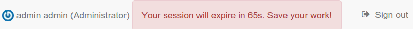
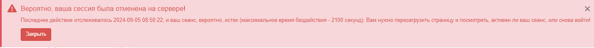

# Управление пользователями и группами

- [Создание группы](creating-group.md )
- [Создание пользователя](creating-user.md )
- [Самостоятельная регистрация пользователя](user-self-registration.md )
- [Режим аутентификации](authentication-mode.md )

## Пользователь по умолчанию 

После установки будет создан пользователь по умолчанию с именем "admin" и паролем "admin". 
Рекомендуется войти в систему с этими учетными данными непосредственно после завершения установки и изменить пароль по умолчанию.

## Пользовательская сессия

После процесса аутентификации создается пользовательский сеанс. 
В какой-то момент сервер автоматически закроет этот сеанс по соображениям безопасности. 
Время ожидания сеанса по умолчанию установлено равным 35 минутам 
(подробнее см. [Настройка времени ожидания сеанса пользователя](../../customizing-application/advanced-configuration.md)).

Если в браузере нет активности и сеанс подходит к концу, за 3 минуты до истечения времени ожидания рядом с данными пользователя отображается предупреждение:

За 1 (одну) минуту до истечения времени ожидания отображается другое сообщение:

Если сеанс закончился, в сообщении рекомендуется обновить страницу и при необходимости снова войти в систему:

## Пользователи, группы и роли 

В каталоге используется концепция пользователей, групп и профилей пользователей.

- Пользователь может быть членом одной или нескольких **групп**.
- У пользователя есть **роль** в Группе.
- Роль администратора не связана с Группой.

Сочетание **роли** и **группы** определяет, какие задачи Пользователь может выполнять в системе или с конкретными записями метаданных.

У пользователей могут быть разные роли в разных группах. Роль определяет, какие задачи может выполнять пользователь.

Роли иерархичны и основаны на наследовании. Это означает, что пользователь с профилем редактора может создавать 
и изменять новые записи метаданных, а также использовать все функции, доступные зарегистрированному пользователю.

Права, связанные с ролями, подробно описаны в списке ниже:

1. **Администратор (каталога)**

    Администратор каталога обладает особыми привилегиями, которые дают право доступа ко всем доступным функциям.

    К ним относятся:

    - Полные права на создание новых групп и новых пользователей.
    - Права на изменение профилей пользователей/групп.
    - Полные права на создание/редактирование/удаление новых/старых метаданных.
    - Выполнение задач системного администрирования и настройки.

2. **Пользователь-администратор (группы)**

    Пользователь-администратор является администратором своей собственной группы (групп) со следующими привилегиями:

    - Полные права на создание новых пользователей в своих собственных группах.
    - Права изменять роли пользователей в рамках их собственных групп.

3. **Рецензент**

    Рецензент контента является единственным лицом, которому разрешено давать окончательное разрешение 
    на публикацию метаданных во внутренней сети и/или в Интернете:

    - Права на просмотр содержимого метаданных в своих группах и разрешение на их утверждение и публикацию.

4. **Редактор**

    Редактор работает с метаданными со следующими привилегиями:

    - Полные права на создание/редактирование/ удаление новых/старых данных в своих группах.

5. **Профиль зарегистрированного пользователя**

    Зарегистрированный пользователь имеет больше прав доступа, чем гость, не прошедший проверку подлинности:

    - Право на загрузку защищенных данных.
