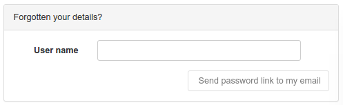

# Восстановление пароля пользователя {#user_forgot_password}

!!! note "Примечание"

	Данный функционал требует наличие настроенного сервера электронной почты. Информация о настройке находится в [соответствующем разделе](../configuring-the-catalog/system-configuration.md#system-config-feedback).

Функция восстановления пароля позволяет запросить пользователю новый пароль, если был забыт или утерян старый. На странице авторизации пользователь должен перейти по соответствующей ссылке для того, чтобы открылась форма восстановления пароля:

Указав имя пользователя и нажав на кнопку "Отправить ссылку на электронную почту" пользователь получает электронное письмо с приглашением перейти по ссылке для смены пароля:

	Вы запросили смену Вашего пароля от учётной записи в каталоге метаданных Национального геопортала.
	
	Вы можете изменить свой пароль, перейдя по следующей ссылке:
	http://localhost:8080/geonetwork/srv/en/password.change.form?username=dubya.shrub@greenhouse.gov&changeKey=635d6c84ddda782a9b6ca9dda0f568b011bb7733
	
	Ссылка доступна только в течении следующих 24 часов с момента получения данного письма.
	
	С уважением,
	Команда Национального геопортала

После получения запроса от пользователя, Каталог метаданных генерирует ключ изменения пароля (changeKey) на основе старого пароля пользователя и текущей даты (даты запроса смены пароля) и помещает ключ в ссылку, которая направляется пользователю в электронном письме.

Если Вы хотите изменить текст сообщения такого электронного письма, то изменения вносятся в файл `xslt/service/account/password-forgotten-email.xsl`.

Когда пользователь переходит по ссылке, в его браузере отобразится форма страницы смены пароля, в которой он может ввести новый пароль. После отправки заполненной формы ключ изменения пароля (changeKey) генерируется повторно и сравнивается с ключом, который был создан при получении запроса на смену пароля. В случае совпадения двух этих ключей пароль изменяется на новый, введенный пользователем.

Последним шагом процесса становится отправка электронного письма пользователю с подтверждением смены пароля от учётной записи:

	Пароль от Вашей учётной записи каталога метаданных Национального геопортала был успешно изменен.
	
	Если Вы не изменяли свой пароль, свяжитесь с нашими специалистами технической поддержки.
	
	С уважением,
	Команда Национального геопортала
	
Если Вы хотите изменить текст сообщения такого электронного письма, то изменения вносятся в файл `xslt/service/account/password-changed-email.xsl`.