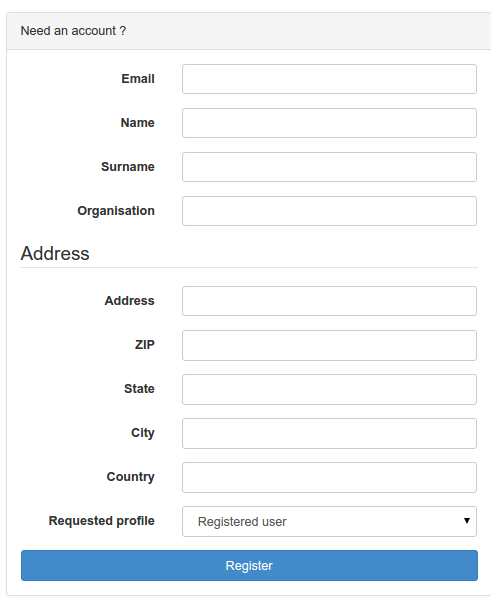
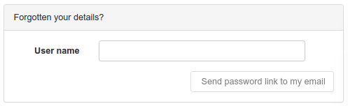

# Самостоятельная регистрация пользователя {#user_self_registration}

Чтобы включить функции саморегистрации, см. раздел [Настройки системы](../configuring-the-catalog/system-configuration.md). 
Если саморегистрация включена, для пользователей, не вошедших в систему, на странице входа в систему отображается дополнительная ссылка:

Нажмите кнопку `Создать учетную запись` и заполните регистрационную форму:

Поля в этой форме не требуют пояснений, за исключением следующих:

- **Email**: Адрес электронной почты пользователя. Он является обязательным и будет использоваться в качестве имени пользователя.
- **Профиль**: По умолчанию самостоятельно зарегистрированным пользователям присваивается профиль `Зарегистрированный пользователь` (см. предыдущий раздел). 
  Если выбран любой другой профиль:
    - пользователю все равно будет присвоен профиль `Зарегистрированный пользователь
    - на адрес электронной почты, указанный в разделе «Обратная связь» меню «Администрирование системы», 
      будет отправлено письмо с уведомлением о запросе на более привилегированный профиль
  
## Что происходит, когда пользователь самостоятельно регистрируется?

Когда происходит саморегистрация пользователя, он получает письмо с данными новой учетной записи, которое выглядит примерно следующим образом:

    Уважаемый пользователь,

    Ваша регистрация на сайте The Greenhouse GeoNetwork прошла успешно.

    Ваша учетная запись:
    имя пользователя : dubya.shrub@greenhouse.gov
    пароль : 0110O3
    группа пользователей:    GUEST
    тип пользователя :    ЗАРЕГИСТРИРОВАННЫЙ ПОЛЬЗОВАТЕЛЬ

    Вы сообщили нам, что хотите стать «Редактором», и в ближайшее время с вами свяжется наш офис.

    Чтобы войти в систему и получить доступ к своему аккаунту, пожалуйста, нажмите на ссылку ниже.
    http://greenhouse.gov/geonetwork

    Спасибо за регистрацию.

    Искренне ваш,
    Команда сайта The Greenhouse GeoNetwork

Обратите внимание, что пользователь запросил профиль «Редактор». В результате на адрес электронной почты, 
указанный в разделе Обратная связь (см. [Обратная связь](../configuring-the-catalog/system-configuration.md#system-config-feedback)) 
меню `Администрирование системы`, будет отправлено письмо, которое выглядит следующим образом:

Обратите внимание, что пользователь был добавлен во встроенную группу пользователей 'GUEST'. 
Это ограничение безопасности. Администратор/пользователь-администратор может добавить пользователя в другие группы, если это потребуется позже.

Если нужно изменить содержимое этого письма, вам следует модифицировать `xslt/service/account/registration-pwd-email.xsl`.

    Уважаемый администратор,

        Недавно зарегистрированный пользователь dubya.shrub@greenhouse.gov запросил доступ «Редактор» для:

        Instance:     The Greenhouse GeoNetwork Site
        Url: http://greenhouse.gov/geonetwork

        Регистрационные данные пользователя:

        Имя:         Дубья
        Фамилия: Кустарник
        Email: dubya.shrub@greenhouse.gov
        Организация: Теплица
        Тип: государственная организация
        Адрес:      146 Мэйн Авеню, Креавилль
        Штат:        Канцелярский
        Почтовый индекс:    92373
        Страна:      Мифическая

    Пожалуйста, действуйте.

    Сайт геосети «Теплица

Если нужно изменить содержимое этого письма, вам следует модифицировать `xslt/service/account/registration-prof-email.xsl`.

## Функция «Забыли пароль?

Эта функция позволяет пользователям, забывшим свой пароль, запросить новый. Перейдите на страницу входа в систему, чтобы получить доступ к форме:

В целях безопасности только пользователи, имеющие профиль `Зарегистрированный пользователь`, могут запросить новый пароль.

Если пользователь воспользуется этой возможностью, он получит письмо с предложением сменить пароль следующего содержания:

    Вы запросили изменение пароля к сайту Greenhouse GeoNetwork.

    Вы можете изменить свой пароль, перейдя по следующей ссылке:

    http://localhost:8080/geonetwork/srv/en/password.change.form?username=dubya.shrub@greenhouse.gov&changeKey=635d6c84ddda782a9b6ca9dda0f568b011bb7733

    Эта ссылка действительна только сегодня.

    Сайт GeoNetwork Greenhouse

Каталог сгенерировал changeKey из забытого пароля и текущей даты и отправил его пользователю в виде ссылки на форму изменения пароля.

Если нужно изменить содержимое этого письма, вам следует модифицировать `xslt/service/account/password-forgotten-email.xsl`.

Когда пользователь нажимает на ссылку, в его браузере отображается форма смены пароля, в которую можно ввести новый пароль. 
Когда форма отправлена, changeKey регенерируется и сверяется с changeKey, указанным в ссылке, и если они совпадают, 
то пароль меняется на новый, указанный пользователем.

Последним шагом в этом процессе является отправка проверочного письма на адрес электронной почты пользователя, подтверждающего, что смена пароля произошла:

    Ваш пароль к сайту Greenhouse GeoNetwork был изменен.

    Если вы не изменили этот пароль, обратитесь в службу поддержки сайта Greenhouse GeoNetwork.

    Команда сайта Greenhouse GeoNetwork

Если вы хотите изменить содержимое этого письма, следует модифицировать `xslt/service/account/password-changed-email.xsl`.
