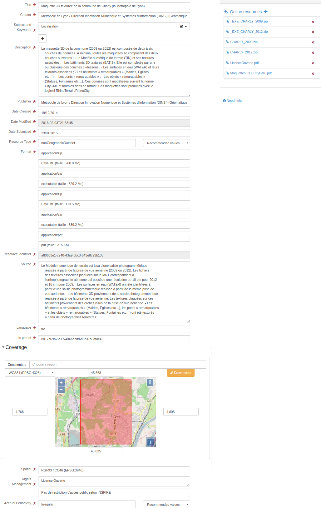

# Dublin Core (dublin-core) {#dublin-core}

Набор элементов метаданных Dublin Core — это словарь из пятнадцати свойств, используемых для описания ресурсов. Название «Dublin» обусловлено местом его происхождения — приглашенным семинаром 1995 года в Дублине, штат Огайо; «core» (ядро) означает, что его элементы являются широкими и универсальными, пригодными для описания широкого спектра ресурсов.

Более подробная информация: [Dublin Core Metadata Element Set](http://dublincore.org/documents/dces/)

## Редактор метаданных

Данный стандарт может быть закодирован с использованием 3 представлений.

-   [Вид: Простой (по умолчанию)](dublin-core.md#dublin-core-view-default)
-   [Вид: Полный (расширенный)](dublin-core.md#dublin-core-view-advanced)
-   [Вид: XML (xml)](dublin-core.md#dublin-core-view-xml)

### Вид: Простой (по умолчанию) {#dublin-core-view-default}

Это представление состоит из 1 вкладки(ок).

-   [Вкладка: Простой (по умолчанию)](dublin-core.md#dublin-core-tab-default)

Этот вид также позволяет добавить следующий элемент, даже если его нет в текущей записи:

-   Предмет и ключевые слова (dc:subject)

#### Вкладка: Простой (по умолчанию) {#dublin-core-tab-default}



На этой вкладке отображаются элементы из XML-записи метаданных.

##### Раздел: Метаданные

См. [Метаданные](dublin-core.md#dublin-core-elem-simpledc-8506dd4a73872a53513368db419204a3)

### Вид: Полный (расширенный) {#dublin-core-view-advanced}

Это представление состоит из 1 вкладки(ок).

-   [Вкладка: Полный (расширенный)](dublin-core.md#dublin-core-tab-advanced)

#### Вкладка: Полный (расширенный) {#dublin-core-tab-advanced}

На этой вкладке отображаются элементы из XML-записи метаданных, а также предоставляются элементы управления для добавления всех элементов, определенных в схеме (XSD).

##### Раздел: Метаданные

См. [Метаданные](dublin-core.md#dublin-core-elem-simpledc-8506dd4a73872a53513368db419204a3)

### Вид: XML (xml) {#dublin-core-view-xml}

Это представление состоит из 1 вкладки(ок).

-   [Вкладка: XML (xml)](dublin-core.md#dublin-core-tab-xml)

#### Вкладка: XML (xml) {#dublin-core-tab-xml}

На этой вкладке отображаются элементы из XML-записи метаданных, а также предоставляются элементы управления для добавления всех элементов, определенных в схеме (XSD).

## Технические характеристики схемы

Идентификатор стандарта

:   

> dublin-core

Версия

:   

> 1.0

Расположение схемы

:   

Пространства имен схемы

:   

-   `http://geonetwork-opensource.org/schemas/schema-ident`
-   <http://www.w3.org/2001/XMLSchema-instance>
-   <http://www.w3.org/XML/1998/namespace>

Режим определения схемы

:   

> gns:elements (root)

Элементы определения схемы

:   

-   simpledc

## Стандартные элементы

Список всех элементов, доступных в стандарте.

### Участник (Contributor) {#dublin-core-elem-dc-contributor-0974cafd6cf5302fe8501874dbe3b3ac}

Имя

:   

> dc:contributor

Описание

:   

```{=html}
Сущность, ответственная за внесение вклада в содержание ресурса.
```
### Охват (Coverage) {#dublin-core-elem-dc-coverage-8a3ad050a5c9949ad92271f646817e10}

Имя

:   

> dc:coverage

Описание

:   

```{=html}
Степень или область содержания ресурса. Как правило, «Охват» включает в себя
      пространственное местоположение (название места или географические координаты), временной период
      (обозначение периода, дата или диапазон дат) или юрисдикцию (например, именованная административная единица).
```
``` xml
<dc:coverage xmlns:dc="http://purl.org/dc/elements/1.1/" xmlns:dct="http://purl.org/dc/terms/"
             xmlns:xsi="http://www.w3.org/2001/XMLSchema-instance">
    North 45.668, South 45.635, East 4.805, West 4.768. CHARLY
  </dc:coverage>
```

### Создатель (Creator) {#dublin-core-elem-dc-creator-f6d71ca3a0b4e9aeb0e518f195f8256e}

Имя

:   

> dc:creator

Описание

:   

```{=html}
Сущность, в основном ответственная за создание содержания ресурса.
```
``` xml
<dc:creator xmlns:dc="http://purl.org/dc/elements/1.1/" xmlns:dct="http://purl.org/dc/terms/"
            xmlns:xsi="http://www.w3.org/2001/XMLSchema-instance">
    Métropole de Lyon / Direction Innovation Numérique et Systèmes d'Information
    (DINSI) (Géomatique et données métropolitaines)
  </dc:creator>
```

### Дата (Date) {#dublin-core-elem-dc-date-23c64254f66925f9eb6e3bd19c442233}

Имя

:   

> dc:date

Описание

:   

```{=html}
Дата события в жизненном цикле ресурса. Как правило, дата ассоциируется
      с созданием или доступностью ресурса.
```
### Описание (Description) {#dublin-core-elem-dc-description-8918d5eea5202286bfa9ceaac948b704}

Имя

:   

> dc:description

Описание

:   

```{=html}
Отчет о содержании ресурса.
```
``` xml
<dc:description xmlns:dc="http://purl.org/dc/elements/1.1/" xmlns:dct="http://purl.org/dc/terms/"
                xmlns:xsi="http://www.w3.org/2001/XMLSchema-instance">
    La maquette 3D de la commune (2009 ou 2012) est composée de deux à six
    couches de données. A minima, toutes les maquettes se composent des deux
    couches suivantes : - Le Modèle numérique de terrain (TIN) et ses textures
    associées ; - Les bâtiments 3D texturés (BATIS). Elle est complétée par une
    ou plusieurs des couches ci-dessous : - Les surfaces en eau (WATER) et leurs
    textures associées ; - Les bâtiments « remarquables » (Mairies, Eglises
    etc…) ; - Les ponts « remarquables » ; - Les objets « remarquables »
    (Statues, Fontaines etc…). Ces données sont modélisées suivant la norme
    CityGML et fournies dans ce format. Ces maquettes sont produites avec le
    logiciel RhinoTerrain/RhinoCity.
  </dc:description>
```

### Формат (Format) {#dublin-core-elem-dc-format-3842730cdb5c8559fe6f2737815429ea}

Имя

:   

> dc:format

Описание

:   

```{=html}
Физическое или цифровое проявление ресурса. Как правило, «Формат» включает
      тип медиа или размеры ресурса. Формат может использоваться для идентификации программного обеспечения,
      оборудования или других технических средств, необходимых для отображения или работы с ресурсом.
```
### Идентификатор ресурса (Resource Identifier) {#dublin-core-elem-dc-identifier-7d64a0a5c40868491c49bf7df7574752}

Имя

:   

> dc:identifier

Описание

:   

```{=html}
Однозначная ссылка на ресурс в рамках заданного контекста.
```
``` xml
<dc:identifier xmlns:dc="http://purl.org/dc/elements/1.1/" xmlns:dct="http://purl.org/dc/terms/"
               xmlns:xsi="http://www.w3.org/2001/XMLSchema-instance">a806d3e1-c240-43a9-bbc3-643e8c93b10d</dc:identifier>
```

### Язык (Language) {#dublin-core-elem-dc-language-74e0ef625be0b45d0e6c64d5f76e1895}

Имя

:   

> dc:language

Описание

:   

```{=html}
Язык интеллектуального содержания ресурса. Рекомендуемая практика
      заключается в использовании RFC 3066, который в сочетании с ISO 639 определяет
      двух- и трехбуквенные первичные языковые теги с необязательными подтегами.
```
``` xml
<dc:language xmlns:dc="http://purl.org/dc/elements/1.1/" xmlns:dct="http://purl.org/dc/terms/"
             xmlns:xsi="http://www.w3.org/2001/XMLSchema-instance">fre</dc:language>
```

### Издатель (Publisher) {#dublin-core-elem-dc-publisher-5534d3efaa13b75c3aa34c379dd91025}

Имя

:   

> dc:publisher

Описание

:   

```{=html}
Сущность, ответственная за обеспечение доступности ресурса.
```
``` xml
<dc:publisher xmlns:dc="http://purl.org/dc/elements/1.1/" xmlns:dct="http://purl.org/dc/terms/"
              xmlns:xsi="http://www.w3.org/2001/XMLSchema-instance">
    Métropole de Lyon / Direction Innovation Numérique et Systèmes d'Information
    (DINSI) (Géomatique et données métropolitaines)
  </dc:publisher>
```

### Связь (Relation) {#dublin-core-elem-dc-relation-3772ef19f1f075e519d2d0a60ec6f05a}

Имя

:   

> dc:relation

Описание

:   

```{=html}
Ссылка на связанный ресурс.
```
### Управление правами (Rights Management) {#dublin-core-elem-dc-rights-32dce43ec1342a098287b03b6a5cb72f}

Имя

:   

> dc:rights

Описание

:   

```{=html}
Информация о правах, имеющихся на ресурс и в отношении него.
```
### Источник (Source) {#dublin-core-elem-dc-source-104607b158c41c5855de1ed62ae223dd}

Имя

:   

> dc:source

Описание

:   

```{=html}
Ссылка на ресурс, из которого получен данный ресурс. Настоящий
      ресурс может быть получен из исходного ресурса целиком или частично.
```
``` xml
<dc:source xmlns:dc="http://purl.org/dc/elements/1.1/" xmlns:dct="http://purl.org/dc/terms/"
           xmlns:xsi="http://www.w3.org/2001/XMLSchema-instance">
    Le Modèle numérique de terrain est issu d’une saisie photogrammétrique
    réalisée à partir de la prise de vue aérienne (2009 ou 2012). Les fichiers
    des textures associées plaquées sur le MNT correspondent à
    l’orthophotographie aérienne qui possède une résolution de 10 cm pour 2012
    et 16 cm pour 2009. - Les surfaces en eau (WATER) ont été identifiées à
    partir d’une saisie photogrammétrique réalisée à partir de la même prise de
    vue aérienne. - Les bâtiments 3D proviennent de la saisie photogrammétrique
    réalisée à partir de la prise de vue aérienne. Les textures plaquées sur ces
    bâtiments proviennent des clichés issus de la prise de vue aérienne. - Les
    bâtiments « remarquables » (Mairies, Eglises etc…), les ponts « remarquables
    » et les objets « remarquables » (Statues, Fontaines etc…) ont été texturés
    à partir de photographies terrestres.
  </dc:source>
```

### Предмет и ключевые слова (Subject and Keywords) {#dublin-core-elem-dc-subject-a88bd90b4991695f8c45fe01df3f64d6}

Имя

:   

> dc:subject

Описание

:   

```{=html}
Тема содержания ресурса. Как правило, предмет выражается в виде ключевых слов,
      ключевых фраз или кодов классификации, которые описывают тему ресурса.
```
``` xml
<dc:subject xmlns:dc="http://purl.org/dc/elements/1.1/" xmlns:dct="http://purl.org/dc/terms/"
            xmlns:xsi="http://www.w3.org/2001/XMLSchema-instance">Localisation</dc:subject>
```

### Название (Title) {#dublin-core-elem-dc-title-18e3be863c870257c8b70d577038ee5f}

Имя

:   

> dc:title

Описание

:   

```{=html}
Имя, данное ресурсу. Как правило, название — это имя, под которым ресурс
      официально известен.
```
``` xml
<dc:title xmlns:dc="http://purl.org/dc/elements/1.1/" xmlns:dct="http://purl.org/dc/terms/"
          xmlns:xsi="http://www.w3.org/2001/XMLSchema-instance">
    Maquette 3D texturée de la commune de Charly (la Métropole de Lyon)
  </dc:title>
```

### Тип ресурса (Resource Type) {#dublin-core-elem-dc-type-15bbc75f8dbe617d6ed609fcf1202ee1}

Имя

:   

> dc:type

Описание

:   

```{=html}
Характер или жанр содержания ресурса. Тип включает термины, описывающие
      общие категории, функции, жанры или уровни агрегирования содержания.
```
Рекомендуемые значения

| код     | метка   |
|---------|---------|
| dataset | Набор данных |
| service | Сервис  |

``` xml
<dc:type xmlns:dc="http://purl.org/dc/elements/1.1/" xmlns:dct="http://purl.org/dc/terms/"
         xmlns:xsi="http://www.w3.org/2001/XMLSchema-instance">nonGeographicDataset</dc:type>
```

### URI {#dublin-core-elem-dc-URI-8f2cb1e27778e1b1977e670ca7e7a282}

Имя

:   

> dc:URI

Описание

:   

### Аннотация (Abstract) {#dublin-core-elem-dct-abstract-a48c3a17636153c58749c5fc29d1bd28}

Имя

:   

> dct:abstract

Описание

:   

```{=html}
Краткое изложение содержания ресурса.
```
### Права доступа (Access Rights) {#dublin-core-elem-dct-accessRights-972cd1c89a0274325b1a3b99e34c95be}

Имя

:   

> dct:accessRights

Описание

:   

```{=html}
Информация о том, кто может получить доступ к ресурсу, или указание его
      статуса безопасности.
```
### Метод накопления (Accrual Method) {#dublin-core-elem-dct-accrualMethod-6fa8ea67638a1578c231025e31dd40e9}

Имя

:   

> dct:accrualMethod

Описание

:   

```{=html}
Метод, с помощью которого элементы добавляются в коллекцию.
```
### Периодичность накопления (Accrual Periodicity) {#dublin-core-elem-dct-accrualPeriodicity-2a4c9a8426dd588e960559174a3df263}

Имя

:   

> dct:accrualPeriodicity

Описание

:   

```{=html}
Частота, с которой элементы добавляются в коллекцию.
```
Рекомендуемые значения

| код         | метка       |
|-------------|-------------|
| continual   | Постоянно   |
| daily       | Ежедневно   |
| weekly      | Еженедельно |
| fortnightly | Раз в две недели |
| monthly     | Ежемесячно  |
| quarterly   | Ежеквартально |
| biannually  | Раз в полгода |
| annually    | Ежегодно    |
| asNeeded    | По необходимости |
| irregular   | Нерегулярно |
| notPlanned  | Не запланировано |
| unknown     | Неизвестно  |

``` xml
<dct:accrualPeriodicity xmlns:dc="http://purl.org/dc/elements/1.1/" xmlns:dct="http://purl.org/dc/terms/"
                        xmlns:xsi="http://www.w3.org/2001/XMLSchema-instance">Irregular</dct:accrualPeriodicity>
```

### Политика накопления (Accrual Policy) {#dublin-core-elem-dct-accrualPolicy-0ae937a1f9081db219a5dd04ed4610d4}

Имя

:   

> dct:accrualPolicy

Описание

:   

```{=html}
Политика, регулирующая добавление элементов в коллекцию.
```
### Альтернативное название (Alternative Title) {#dublin-core-elem-dct-alternative-2518e8fc9fa67f5a10348016aae8bb0f}

Имя

:   

> dct:alternative

Описание

:   

```{=html}
Альтернативное название ресурса.
```
### Аудитория (Audience) {#dublin-core-elem-dct-audience-a610cbdc155d7cd9c87c8f22ef245521}

Имя

:   

> dct:audience

Описание

:   

```{=html}
Класс сущностей, для которых предназначен или полезен ресурс.
```
### Библиографическая ссылка (Bibliographic Citation) {#dublin-core-elem-dct-bibliographicCitation-0d3ba175bdb84be48dec71bdb6b318da}

Имя

:   

> dct:bibliographicCitation

Описание

:   

```{=html}
Библиографическая ссылка на ресурс.
```
### Соответствует стандарту (Conforms To) {#dublin-core-elem-dct-conformsTo-703d80b57bd6629b2bff3f57efd52dc5}

Имя

:   

> dct:conformsTo

Описание

:   

```{=html}
Установленный стандарт, которому соответствует описанный ресурс.
```
### Дата создания (Date Created) {#dublin-core-elem-dct-created-9aebe20151c1c962d66737fcb9b87c2c}

Имя

:   

> dct:created

Описание

:   

```{=html}
Дата создания ресурса.
```
``` xml
<dct:created xmlns:dc="http://purl.org/dc/elements/1.1/" xmlns:dct="http://purl.org/dc/terms/"
             xmlns:xsi="http://www.w3.org/2001/XMLSchema-instance">2014-12-19</dct:created>
```

### Дата принятия (Date Accepted) {#dublin-core-elem-dct-dateAccepted-9f6f7b46bae794b317c939c75170b0f1}

Имя

:   

> dct:dateAccepted

Описание

:   

```{=html}
Дата принятия ресурса.
```
### Дата регистрации авторских прав (Date Copyrighted) {#dublin-core-elem-dct-dateCopyrighted-1a3940c001fd2db761829940957d8bf7}

Имя

:   

> dct:dateCopyrighted

Описание

:   

```{=html}
Дата регистрации авторских прав.
```
### Дата подачи (Date Submitted) {#dublin-core-elem-dct-dateSubmitted-0e038c3b8ac6daca57211a938eca6154}

Имя

:   

> dct:dateSubmitted

Описание

:   

```{=html}
Дата подачи ресурса
```
``` xml
<dct:dateSubmitted xmlns:dc="http://purl.org/dc/elements/1.1/" xmlns:dct="http://purl.org/dc/terms/"
                   xmlns:xsi="http://www.w3.org/2001/XMLSchema-instance">2015-01-23</dct:dateSubmitted>
```

### Уровень образования аудитории (Audience Education Level) {#dublin-core-elem-dct-educationLevel-fa33466d34d56fb066753a6d97089631}

Имя

:   

> dct:educationLevel

Описание

:   

```{=html}
Класс сущностей, определенных с точки зрения прогресса в образовательном или
      обучающем контексте, для которых предназначен описанный ресурс.
```
### Объем (Extent) {#dublin-core-elem-dct-extent-8a3a9adeaaac054e64dff722ad23c776}

Имя

:   

> dct:extent

Описание

:   

```{=html}
Размер или продолжительность ресурса.
```
### Имеет формат (Has Format) {#dublin-core-elem-dct-hasFormat-d136ed16dc44af39fdf1b98b9fb4bc33}

Имя

:   

> dct:hasFormat

Описание

:   

```{=html}
Связанный ресурс, который по существу является тем же, что и ранее существующий описанный
      ресурс, но в другом формате.
```
### Включает часть (Has Part) {#dublin-core-elem-dct-hasPart-f251f156dd8774a81f44c13c7b4a9e7d}

Имя

:   

> dct:hasPart

Описание

:   

```{=html}
Связанный ресурс, который включен физически или логически в описанный
      ресурс.
```
### Имеет версию (Has Version) {#dublin-core-elem-dct-hasVersion-b8dc08cd4fc15cf1df605c2905b0c5e3}

Имя

:   

> dct:hasVersion

Описание

:   

```{=html}
Связанный ресурс, который является версией, редакцией или адаптацией описанного
      ресурса.
```
### Метод обучения (Instructional Method) {#dublin-core-elem-dct-instructionalMethod-d220d889250a4a0f7e3efe29fc0f0ada}

Имя

:   

> dct:instructionalMethod

Описание

:   

```{=html}
Процесс, используемый для получения знаний, взглядов и навыков, который
      ресурс призван поддерживать.
```
### Является форматом (Is Format Of) {#dublin-core-elem-dct-isFormatOf-8378903643254b5b83ae2acdc251b6a6}

Имя

:   

> dct:isFormatOf

Описание

:   

```{=html}
Связанный ресурс, который по существу является тем же, что и описанный ресурс, но в
      другом формате.
```
### Является частью (Is part of) {#dublin-core-elem-dct-isPartOf-6697c98943756abf56d4c2a50f9dc9a2}

Имя

:   

> dct:isPartOf

Описание

:   

```{=html}
Связанный ресурс, в который описанный ресурс физически или логически
      включен.
```
``` xml
<dct:isPartOf xmlns:dc="http://purl.org/dc/elements/1.1/" xmlns:dct="http://purl.org/dc/terms/"
              xmlns:xsi="http://www.w3.org/2001/XMLSchema-instance">8017c69a-5b17-404f-acdd-d9c37a0afac4</dct:isPartOf>
```

### Ссылается (Is Referenced By) {#dublin-core-elem-dct-isReferencedBy-4cf2c75a368a7773ec781eaa6f4a7c03}

Имя

:   

> dct:isReferencedBy

Описание

:   

```{=html}
Связанный ресурс, который ссылается, цитирует или иным образом указывает на описанный
      ресурс.
```
### Заменяется (Is Replaced By) {#dublin-core-elem-dct-isReplacedBy-1e391e071c75e45dcf0a309285a642a0}

Имя

:   

> dct:isReplacedBy

Описание

:   

```{=html}
Связанный ресурс, который вытесняет, замещает или заменяет описанный
      ресурс.
```
### Требуется для (Is Required By) {#dublin-core-elem-dct-isRequiredBy-def534523d854e3440e36701bea47cc4}

Имя

:   

> dct:isRequiredBy

Описание

:   

```{=html}
Связанный ресурс, который требует описанный ресурс для поддержки своей функции,
      доставки или согласованности.
```
### Дата выпуска (Date Issued) {#dublin-core-elem-dct-issued-9f6ad8cb4b5e6225c1cb755489adb774}

Имя

:   

> dct:issued

Описание

:   

```{=html}
Дата официального выпуска (например, публикации) ресурса.
```
### Является версией (Is Version Of) {#dublin-core-elem-dct-isVersionOf-d1658a9e84f777d0a335528e82921417}

Имя

:   

> dct:isVersionOf

Описание

:   

```{=html}
Связанный ресурс, которого описанный ресурс является версией, редакцией или
      адаптацией.
```
### Лицензия (License) {#dublin-core-elem-dct-license-865405c25292b886c12f7d056ebaabda}

Имя

:   

> dct:license

Описание

:   

```{=html}
Юридический документ, дающий официальное разрешение на совершение определенных действий с ресурсом.
```
### Посредник (Mediator) {#dublin-core-elem-dct-mediator-ab02c72730e6dbccbfb74b07e00edf10}

Имя

:   

> dct:mediator

Описание

:   

```{=html}
Сущность, которая опосредует доступ к ресурсу и для которой ресурс
      предназначен или полезен.
```
### Носитель (Medium) {#dublin-core-elem-dct-medium-95f834fde8ee306293ebebcfd7a3aba5}

Имя

:   

> dct:medium

Описание

:   

```{=html}
Материальный или физический носитель ресурса.
```
### Дата модификации (Date Modified) {#dublin-core-elem-dct-modified-66ecff9b0ec74fad28c5babebc1eec7d}

Имя

:   

> dct:modified

Описание

:   

```{=html}
Дата изменения метаданных
```
``` xml
<dct:modified xmlns:dc="http://purl.org/dc/elements/1.1/" xmlns:dct="http://purl.org/dc/terms/"
              xmlns:xsi="http://www.w3.org/2001/XMLSchema-instance">2016-02-03T21:33:45</dct:modified>
```

### Происхождение (Provenance) {#dublin-core-elem-dct-provenance-4ec9c18f260230d4455195d6a6f28c17}

Имя

:   

> dct:provenance

Описание

:   

```{=html}
Заявление о любых изменениях в праве собственности и хранении ресурса с момента его
      создания, которые имеют значение для его подлинности, целостности и интерпретации.
```
### Связанный ресурс (Related resource) {#dublin-core-elem-dct-references-3a44416fcd20eea0684aad2fd3228fdd}

Имя

:   

> dct:references

Описание

:   

```{=html}
Связанный ресурс, на который ссылается, цитирует или иным образом указывает
      описанный ресурс.
```
### Заменяет (Replaces) {#dublin-core-elem-dct-replaces-c5b09017642a464af7a04db426f6d74f}

Имя

:   

> dct:replaces

Описание

:   

```{=html}
Связанный ресурс, который был вытеснен, замещен или заменен описанным
      ресурсом.
```
### Требует (Requires) {#dublin-core-elem-dct-requires-2ad52ab491717dc624f79f92303f4679}

Имя

:   

> dct:requires

Описание

:   

```{=html}
Связанный ресурс, который требуется описанным ресурсом для поддержки своей
      функции, доставки или согласованности.
```
### Правообладатель (Rights Holder) {#dublin-core-elem-dct-rightsHolder-0f4304cc1135f8fc29f7a0ede8daa268}

Имя

:   

> dct:rightsHolder

Описание

:   

```{=html}
Лицо или организация, владеющая или управляющая правами на ресурс.
```
### Пространственные характеристики (Spatial) {#dublin-core-elem-dct-spatial-5100d679492a6f79fd3e53db624bcab2}

Имя

:   

> dct:spatial

Описание

:   

```{=html}
Пространственные характеристики интеллектуального содержания ресурса.
```
``` xml
<dct:spatial xmlns:dc="http://purl.org/dc/elements/1.1/" xmlns:dct="http://purl.org/dc/terms/"
             xmlns:xsi="http://www.w3.org/2001/XMLSchema-instance">RGF93 / CC46 (EPSG:3946)</dct:spatial>
```

### Содержание (Table Of Contents) {#dublin-core-elem-dct-tableOfContents-c20c496386cad7aa48ad05ca41a6340b}

Имя

:   

> dct:tableOfContents

Описание

:   

```{=html}
Список подразделов ресурса.
```
### Временной охват (Temporal Coverage) {#dublin-core-elem-dct-temporal-0a2abb1d37421418cafeb48bd21e6854}

Имя

:   

> dct:temporal

Описание

:   

```{=html}
Временные характеристики ресурса.
```
### Дата валидности (Date Valid) {#dublin-core-elem-dct-valid-343768fccc581bc0822c69e6ca19c70c}

Имя

:   

> dct:valid

Описание

:   

```{=html}
Дата (часто диапазон) валидности ресурса.
```
### Метаданные (Metadata) {#dublin-core-elem-simpledc-8506dd4a73872a53513368db419204a3}

Имя

:   

> simpledc

Описание

:   

``` xml
<simpledc xmlns:dc="http://purl.org/dc/elements/1.1/" xmlns:dct="http://purl.org/dc/terms/"
          xsi:noNamespaceSchemaLocation="http://localhost/geonetwork/xml/schemas/dublin-core/schema.xsd">
   <dc:title>
    Maquette 3D texturée de la commune de Charly (la Métropole de Lyon)
  </dc:title>
   <dc:creator>
    Métropole de Lyon / Direction Innovation Numérique et Systèmes d'Information
    (DINSI) (Géomatique et données métropolitaines)
  </dc:creator>
   <dc:subject>Localisation</dc:subject>
   <dc:description>
    La maquette 3D de la commune (2009 ou 2012) est composée de deux à six
    couches de données. A minima, toutes les maquettes se composent des deux
    couches suivantes : - Le Modèle numérique de terrain (TIN) et ses textures
    associées ; - Les bâtiments 3D texturés (BATIS). Elle est complétée par une
    ou plusieurs des couches ci-dessous : - Les surfaces en eau (WATER) et leurs
    textures associées ; - Les bâtiments « remarquables » (Mairies, Eglises
    etc…) ; - Les ponts « remarquables » ; - Les objets « remarquables »
    (Statues, Fontaines etc…). Ces données sont modélisées suivant la norme
    CityGML et fournies dans ce format. Ces maquettes sont produites avec le
    logiciel RhinoTerrain/RhinoCity.
  </dc:description>
   <dc:publisher>
    Métropole de Lyon / Direction Innovation Numérique et Systèmes d'Information
    (DINSI) (Géomatique et données métropolitaines)
  </dc:publisher>
   <dc:type>nonGeographicDataset</dc:type>
   <dc:format>application/zip</dc:format>
   <dc:format>CityGML (taille : 260.0 Mo)</dc:format>
   <dc:format>application/zip</dc:format>
   <dc:format>executable (taille : 829.2 Mo)</dc:format>
   <dc:format>application/zip</dc:format>
   <dc:format>CityGML (taille : 113.5 Mo)</dc:format>
   <dc:format>application/zip</dc:format>
   <dc:format>executable (taille : 339.2 Mo)</dc:format>
   <dc:format>application/pdf</dc:format>
   <dc:format>pdf (taille : 315 Ko)</dc:format>
   <dc:source>
    Le Modèle numérique de terrain est issu d’une saisie photogrammétrique
    réalisée à partir de la prise de vue aérienne (2009 ou 2012). Les fichiers
    des textures associées plaquées sur le MNT correspondent à
    l’orthophotographie aérienne qui possède une résolution de 10 cm pour 2012
    et 16 cm pour 2009. - Les surfaces en eau (WATER) ont été identifiées à
    partir d’une saisie photogrammétrique réalisée à partir de la même prise de
    vue aérienne. - Les bâtiments 3D proviennent de la saisie photogrammétrique
    réalisée à partir de la prise de vue aérienne. Les textures plaquées sur ces
    bâtiments proviennent des clichés issus de la prise de vue aérienne. - Les
    bâtiments « remarquables » (Mairies, Eglises etc…), les ponts « remarquables
    » et les objets « remarquables » (Statues, Fontaines etc…) ont été texturés
    à partir de photographies terrestres.
  </dc:source>
   <dc:language>fre</dc:language>
   <dc:relation>
    https://download.data.grandlyon.com/files/grandlyon/localisation/bati3d/CHARLY_2012.zip
  </dc:relation>
   <dc:relation>
    https://download.data.grandlyon.com/files/grandlyon/localisation/bati3d/_EXE_CHARLY_2012.zip
  </dc:relation>
   <dc:relation>
    https://download.data.grandlyon.com/files/grandlyon/localisation/bati3d/CHARLY_2009.zip
  </dc:relation>
   <dc:relation>
    https://download.data.grandlyon.com/files/grandlyon/localisation/bati3d/_EXE_CHARLY_2009.zip
  </dc:relation>
   <dc:relation>
    https://download.data.grandlyon.com/files/grandlyon/localisation/bati3d/Maquettes_3D_CityGML.pdf
  </dc:relation>
   <dc:relation>
    https://download.data.grandlyon.com/files/grandlyon/LicenceOuverte.pdf
  </dc:relation>
   <dc:coverage>
    North 45.668, South 45.635, East 4.805, West 4.768. CHARLY
  </dc:coverage>
   <dc:rights>Licence Ouverte</dc:rights>
   <dc:rights>Pas de restriction d'accès public selon INSPIRE</dc:rights>
   <dct:created>2014-12-19</dct:created>
   <dct:dateSubmitted>2015-01-23</dct:dateSubmitted>
   <dct:isPartOf>8017c69a-5b17-404f-acdd-d9c37a0afac4</dct:isPartOf>
   <dct:spatial>RGF93 / CC46 (EPSG:3946)</dct:spatial>
   <dct:accrualPeriodicity>Irregular</dct:accrualPeriodicity>
   <dct:modified>2016-02-03T21:33:45</dct:modified>
   <dc:identifier>a806d3e1-c240-43a9-bbc3-643e8c93b10d</dc:identifier>
</simpledc>
```

## Стандартные списки кодов (Codelists)

Список всех списков кодов, доступных в стандарте.

Списки кодов не определены.