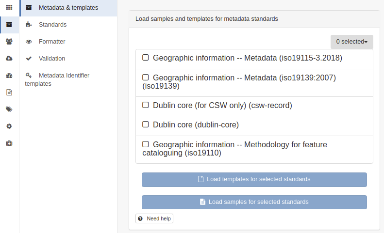

# Стандарты

Каталог метаданных поддерживает следующие стандарты:

-   [Географическая информация — Метаданные (iso19115-3.2018)](iso19115-3.2018.md)
-   [Географическая информация — Метаданные (iso19139:2007) (iso19139)](iso19139.md)
-   [Географическая информация — Методология каталогизации объектов (Устарело — используйте ISO19115-3) (iso19110)](iso19110.md)
-   [Dublin Core (dublin-core)](dublin-core.md)

ISO19110 может использоваться для кодирования каталога объектов (однако рекомендуется использовать ISO19115-3).

Dublin Core (только для CSW) используется исключительно для тестирования наборов тестов OGC CSW.

Другие стандарты и профили сообщества доступны на [GitHub (metadata101)](https://github.com/metadata101).