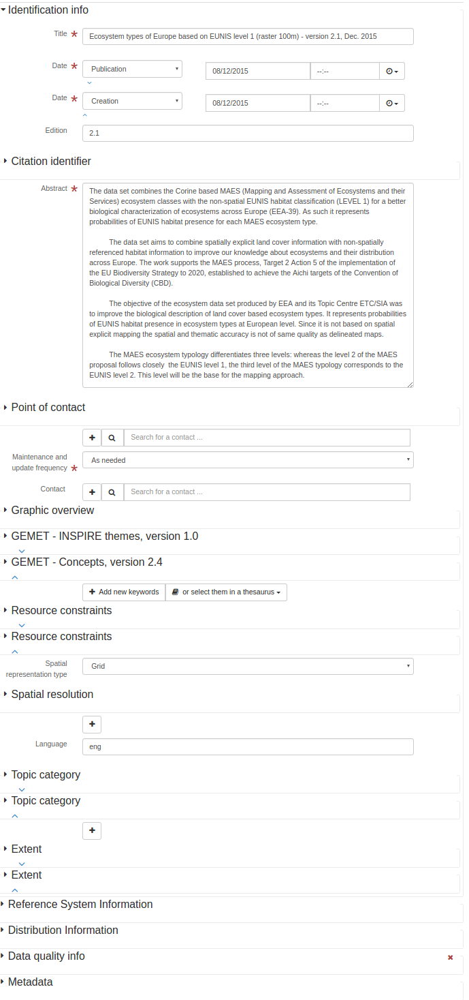
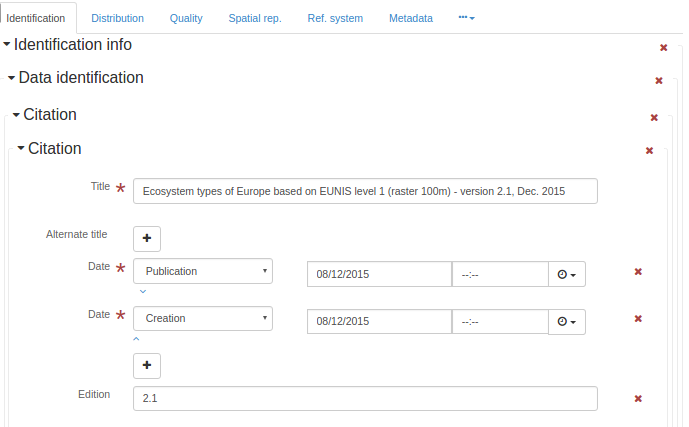

# Географическая информация — Метаданные (iso19139:2007) (iso19139) {#iso19139}

ISO 19115 определяет схему, необходимую для описания географической информации и услуг посредством метаданных. Он предоставляет информацию об идентификации, охвате, качестве, пространственных и временных аспектах, содержании, пространственной привязке, отображении, распространении и других свойствах цифровых географических данных и услуг.

ISO 19115 применим к:

-   каталогизации всех типов ресурсов, деятельности клиринговых центров и полному описанию наборов данных и услуг;
-   географическим услугам, географическим наборам данных, сериям наборов данных, а также отдельным географическим объектам и свойствам объектов.

ISO 19115 определяет:

-   обязательные и условные разделы метаданных, сущности метаданных и элементы метаданных;
-   минимальный набор метаданных, необходимый для большинства приложений метаданных (обнаружение данных, определение пригодности данных для использования, доступ к данным, передача данных, а также использование цифровых данных и услуг);
-   необязательные элементы метаданных, позволяющие при необходимости расширить стандартное описание ресурсов;
-   метод расширения метаданных для удовлетворения специализированных потребностей.

Хотя ISO 19115 применим к цифровым данным и услугам, его принципы могут быть распространены на многие другие типы ресурсов, такие как карты, диаграммы и текстовые документы, а также негеографические данные. Некоторые условные элементы метаданных могут не применяться к этим другим формам данных.

Дополнительная информация: <https://www.iso.org/iso/home/store/catalogue_tc/catalogue_detail.htm?csnumber=53798>

## Редактор метаданных

Этот стандарт может быть закодирован с использованием 4 представлений (view).

-   [Представление: INSPIRE (inspire)](iso19139.md#iso19139-view-inspire)
-   [Представление: Простое (simple)](iso19139.md#iso19139-view-default)
-   [Представление: Полное (full)](iso19139.md#iso19139-view-advanced)
-   [Представление: XML (xml)](iso19139.md#iso19139-view-xml)

### Представление: INSPIRE (inspire) {#iso19139-view-inspire}

Это представление состоит из 2 вкладок (tab).

-   [Вкладка: INSPIRE (inspire)](iso19139.md#iso19139-tab-inspire)
-   [Вкладка: SDS (inspire_sds)](iso19139.md#iso19139-tab-inspire_sds)

Это представление также позволяет добавить следующий элемент, даже если его нет в текущей записи:

-   Содержит операции (srv:containsOperations)
-   Операция (srv:SV_OperationMetadata)
-   Параметры (srv:parameters)

#### Вкладка: INSPIRE (inspire) {#iso19139-tab-inspire}


На этой вкладке отображаются элементы из XML-записи метаданных.

##### Раздел: Идентификация

##### Идентификатор файла

```{=html}
Уникальный идентификатор для этого файла метаданных
```

XPath

:   

> /gmd:MD_Metadata/gmd:fileIdentifier

См. [Идентификатор файла](iso19139.md#iso19139-elem-gmd-fileIdentifier-353be7794d17e5435ce2fe57d91966ba)

##### Заголовок (название)

```{=html}
Имя, под которым известен цитируемый ресурс
```

XPath

:   

> /gmd:MD_Metadata/gmd:identificationInfo/*/gmd:citation/gmd:CI_Citation/gmd:title

См. [Заголовок](iso19139.md#iso19139-elem-gmd-title-cc3002a2d81bcdbc5bf4c8735faf6980)

##### Аннотация

```{=html}
Краткое описательное резюме содержания ресурса(ов)
```

XPath

:   

> /gmd:MD_Metadata/gmd:identificationInfo/gmd:MD_DataIdentification/gmd:abstract

См. [Аннотация](iso19139.md#iso19139-elem-gmd-abstract-cacfcd3bd6bbd44733f828dd2903ecd8)

##### Аннотация

```{=html}
Краткое описательное резюме содержания ресурса(ов)
```

XPath

:   

> /gmd:MD_Metadata/gmd:identificationInfo/srv:SV_ServiceIdentification/gmd:abstract

См. [Аннотация](iso19139.md#iso19139-elem-gmd-abstract-cacfcd3bd6bbd44733f828dd2903ecd8)

##### Уровень иерархии

```{=html}
Область, к которой относятся метаданные (см. приложение H для получения дополнительной информации об уровнях иерархии метаданных)
```

XPath

:   

> /gmd:MD_Metadata/gmd:hierarchyLevel

См. [Уровень иерархии](iso19139.md#iso19139-elem-gmd-hierarchyLevel-2b6d53b433d8f9c0cc58606d27eecc17)

Имя

:   

> Уровень иерархии

Имя

:   

> Уровень иерархии

Тип

:   

> добавить

Отображается только если

:   

> count(gmd:MD_Metadata/gmd:identificationInfo/srv:SV_ServiceIdentification) = 0

``` xml
<gmd:hierarchyLevel xmlns:xsi="http://www.w3.org/2001/XMLSchema-instance"
                    xmlns:xlink="http://www.w3.org/1999/xlink">
   <gmd:MD_ScopeCode codeList="http://standards.iso.org/iso/19139/resources/gmxCodelists.xml#MD_ScopeCode"
                     codeListValue="dataset"/>
</gmd:hierarchyLevel>
```

Имя

:   

> Уровень иерархии

Имя

:   

> Уровень иерархии

Тип

:   

> добавить

Отображается только если

:   

> count(gmd:MD_Metadata/gmd:identificationInfo/srv:SV_ServiceIdentification) > 0

``` xml
<gmd:hierarchyLevel xmlns:xsi="http://www.w3.org/2001/XMLSchema-instance"
                    xmlns:xlink="http://www.w3.org/1999/xlink">
   <gmd:MD_ScopeCode codeList="http://standards.iso.org/iso/19139/resources/gmxCodelists.xml#MD_ScopeCode"
                     codeListValue="service"/>
</gmd:hierarchyLevel>
```

##### Онлайн-ресурс

##### Онлайн-ресурс

```{=html}
Информация об онлайн-источниках, из которых можно получить ресурс
```

XPath

:   

> /gmd:MD_Metadata/gmd:distributionInfo/gmd:MD_Distribution/gmd:transferOptions /gmd:MD_DigitalTransferOptions/gmd:onLine

См. [Онлайн-ресурс](iso19139.md#iso19139-elem-gmd-onLine-c0b191c96e7e4d7dfc2a4ba2fd8946f4)

Имя

:   

> Онлайн-ресурс

Имя

:   

> Онлайн-ресурс

Тип

:   

> добавить

``` xml
<gmd:onLine xmlns:xsi="http://www.w3.org/2001/XMLSchema-instance"
            xmlns:xlink="http://www.w3.org/1999/xlink">
   <gmd:CI_OnlineResource>
      <gmd:linkage>
         <gmd:URL/>
      </gmd:linkage>
      <gmd:protocol>
         <gco:CharacterString/>
      </gmd:protocol>
   </gmd:CI_OnlineResource>
</gmd:onLine>
```

##### Идентификатор ресурса

##### Идентификатор цитирования

```{=html}
Идентификатор цитирования
```

XPath

:   

> /gmd:MD_Metadata/gmd:identificationInfo/gmd:MD_DataIdentification/gmd:citation/gmd:CI_Citation/gmd:identifier

См. [Идентификатор](iso19139.md#iso19139-elem-gmd-identifier-c4f31fd808ee0eaa1e5525c5ff0edd23)

Имя

:   

> Идентификатор ресурса

Имя

:   

> Идентификатор ресурса

Тип

:   

> добавить

``` xml
<gmd:identifier xmlns:xsi="http://www.w3.org/2001/XMLSchema-instance"
                xmlns:xlink="http://www.w3.org/1999/xlink">
   <gmd:MD_Identifier>
      <gmd:code>
         <gco:CharacterString/>
      </gmd:code>
   </gmd:MD_Identifier>
</gmd:identifier>
```

Тип

:   

> обработка

Отображается только если

:   

> (count(gmd:MD_Metadata/gmd:identificationInfo/gmd:MD_DataIdentification) + count(gmd:MD_Metadata/gmd:identificationInfo/gmd:MD_DataIdentification/gmd:citation/gmd:CI_Citation/ gmd:identifier[ends-with(gmd:MD_Identifier/gmd:code/gco:CharacterString, //gmd:MD_Metadata/gmd:fileIdentifier/gco:CharacterString)])) = 1

##### Язык

```{=html}
Язык(и), используемый(е) в наборе данных
```

XPath

:   

> /gmd:MD_Metadata/gmd:identificationInfo/gmd:MD_DataIdentification/gmd:language

См. [Язык метаданных](iso19139.md#iso19139-elem-gmd-language-98a1fec5ea30c100ef63f1ca4bd6dbdb)

##### Тип пространственного представления

```{=html}
Метод, используемый для пространственного представления географической информации
```

XPath

:   

> /gmd:MD_Metadata/gmd:identificationInfo/gmd:MD_DataIdentification/gmd:spatialRepresentationType

См. [Тип пространственного представления](iso19139.md#iso19139-elem-gmd-spatialRepresentationType-1617a07231ac2246d0844778962d4ca0)

Имя

:   

> Тип пространственного представления

Имя

:   

> Тип пространственного представления

Тип

:   

> добавить

``` xml
<gmd:spatialRepresentationType xmlns:xsi="http://www.w3.org/2001/XMLSchema-instance"
                               xmlns:xlink="http://www.w3.org/1999/xlink">
   <gmd:MD_SpatialRepresentationTypeCode codeList="http://standards.iso.org/iso/19139/resources/gmxCodelists.xml#MD_SpatialRepresentationTypeCode"
                                         codeListValue="vector"/>
</gmd:spatialRepresentationType>
```

##### Кодировка

##### Формат распространения

```{=html}
Предоставляет описание формата распространяемых данных
```

XPath

:   

> /gmd:MD_Metadata/gmd:distributionInfo/gmd:MD_Distribution/gmd:distributionFormat

См. [Формат распространения](iso19139.md#iso19139-elem-gmd-distributionFormat-5cad81c9a7af3991db918a5e8fc0c596)

Имя

:   

> Кодировка

Имя

:   

> Кодировка

Тип

:   

> добавить

Отображается только если

:   

> count(gmd:MD_Metadata/gmd:identificationInfo/srv:SV_ServiceIdentification) = 0

``` xml
<gmd:distributionFormat xmlns:xsi="http://www.w3.org/2001/XMLSchema-instance"
                        xmlns:xlink="http://www.w3.org/1999/xlink">
   <gmd:MD_Format>
      <gmd:name>
         <gco:CharacterString/>
      </gmd:name>
      <gmd:version>
         <gco:CharacterString/>
      </gmd:version>
      <gmd:specification>
         <gco:CharacterString/>
      </gmd:specification>
   </gmd:MD_Format>
</gmd:distributionFormat>
```

##### Проекция

##### Идентификатор системы координат (ссылки)

```{=html}
Имя системы координат
```

XPath

:   

> /gmd:MD_Metadata/gmd:referenceSystemInfo/gmd:MD_ReferenceSystem/gmd:referenceSystemIdentifier

См. [Идентификатор системы ссылки](iso19139.md#iso19139-elem-gmd-referenceSystemIdentifier-5393a29789a4b6def1795d5a9e70f665)

Имя

:   

> Проекция

Имя

:   

> Система координат

Тип

:   

> добавить

``` xml
<gmd:referenceSystemInfo xmlns:xsi="http://www.w3.org/2001/XMLSchema-instance"
                         xmlns:xlink="http://www.w3.org/1999/xlink">
   <gmd:MD_ReferenceSystem>
      <gmd:referenceSystemIdentifier>
         <gmd:RS_Identifier>
            <gmd:code>
               <gco:CharacterString>http://www.opengis.net/def/crs/EPSG/0/4936</gco:CharacterString>
            </gmd:code>
         </gmd:RS_Identifier>
      </gmd:referenceSystemIdentifier>
   </gmd:MD_ReferenceSystem>
</gmd:referenceSystemInfo>
```

##### Раздел: Классификация данных и услуг

##### Тематическая категория

```{=html}
Основная(ые) тема(ы) набора данных
```

XPath

:   

> /gmd:MD_Metadata/gmd:identificationInfo/gmd:MD_DataIdentification/gmd:topicCategory

См. [Тематическая категория](iso19139.md#iso19139-elem-gmd-topicCategory-beb19f9aa38425d24bc8c438657fff74)

Имя

:   

> Код тематической категории

Имя

:   

> Код тематической категории

Тип

:   

> добавить

``` xml
<gmd:topicCategory xmlns:xsi="http://www.w3.org/2001/XMLSchema-instance"
                   xmlns:xlink="http://www.w3.org/1999/xlink">
   <gmd:MD_TopicCategoryCode/>
</gmd:topicCategory>
```

##### Раздел: Классификация данных и услуг

##### Тип услуги

```{=html}
Имя типа услуги из реестра услуг. Например, значения атрибутов nameSpace и name в GeneralName могут быть 'OGC' и 'catalogue'
```
Рекомендуемые значения

| код               | метка                                           |
|-------------------|-------------------------------------------------|
| OGC:WMS           | OGC Web Map Service (OGC:WMS)                   |
| OGC:WFS           | OGC Web Feature Service (OGC:WFS)               |
| OGC:WCS           | OGC Web Coverage Service (OGC:WCS)              |
| W3C:HTML:DOWNLOAD | Загрузка (W3C:HTML:DOWNLOAD)                    |
| W3C:HTML:LINK     | Информация (W3C:HTML:LINK)                     |
| discovery         | Услуга обнаружения INSPIRE (discovery)          |
| view              | Услуга просмотра INSPIRE (view)                 |
| download          | Услуга загрузки INSPIRE (download)              |
| transformation    | Услуга преобразования INSPIRE (transformation)  |
| other             | Другие услуги INSPIRE (other)                   |

XPath

:   

> /gmd:MD_Metadata/gmd:identificationInfo/srv:SV_ServiceIdentification/srv:serviceType

См. [Тип услуги](iso19139.md#iso19139-elem-srv-serviceType-31230933e2a7436c80955195b74bc0a0)

##### Тип сопряжения

```{=html}
Тип сопряжения
```

XPath

:   

> /gmd:MD_Metadata/gmd:identificationInfo/srv:SV_ServiceIdentification/srv:couplingType

См. [Тип сопряжения](iso19139.md#iso19139-elem-srv-couplingType-bc1606dff717a83807e97a1a3789e30a)

##### Раздел: Сопряженный ресурс

##### Сопряженный ресурс

##### Работает с (Operates On)

```{=html}
Предоставляет информацию о наборах данных, с которыми работает услуга
```

XPath

:   

> /gmd:MD_Metadata/gmd:identificationInfo/srv:SV_ServiceIdentification/srv:operatesOn

См. [Работает с](iso19139.md#iso19139-elem-srv-operatesOn-fc0165e60dcb452c05c9f1d95416b89a)

Имя

:   

> Сопряженный ресурс

Тип

:   

> добавить

Отображается только если

:   

> count(gmd:MD_Metadata/gmd:identificationInfo/srv:SV_ServiceIdentification) > 0

``` xml
<srv:operatesOn xmlns:xsi="http://www.w3.org/2001/XMLSchema-instance"
                xlink:href=""/>
```

##### Раздел: Ключевые слова

XPath

:   

> /gmd:MD_Metadata/gmd:identificationInfo/srv:SV_ServiceIdentification/ gmd:descriptiveKeywords [gmd:MD_Keywords/gmd:thesaurusName/gmd:CI_Citation/gmd:title/gco:CharacterString = 'INSPIRE Service taxonomy']

См. [Описательные ключевые слова](iso19139.md#iso19139-elem-gmd-descriptiveKeywords-d9044aa0856cf55d016da575dc037fa3)

Имя

:   

> Таксономия услуг INSPIRE

Имя

:   

> Таксономия услуг INSPIRE

Тип

:   

> добавить

Отображается только если

:   

> (count(gmd:MD_Metadata/gmd:identificationInfo/srv:SV_ServiceIdentification/ gmd:descriptiveKeywords[ contains(gmd:MD_Keywords/gmd:thesaurusName/ gmd:CI_Citation/gmd:title/gco:CharacterString, 'INSPIRE Service taxonomy')]) + count(gmd:MD_Metadata/gmd:identificationInfo/srv:SV_ServiceIdentification)) = 1

##### Раздел: Другие ключевые слова

XPath

:   

> /gmd:MD_Metadata/gmd:identificationInfo/srv:SV_ServiceIdentification/ gmd:descriptiveKeywords[not(gmd:MD_Keywords/gmd:thesaurusName)]

См. [Описательные ключевые слова](iso19139.md#iso19139-elem-gmd-descriptiveKeywords-d9044aa0856cf55d016da575dc037fa3)

##### Раздел: Географический охват

##### Географическая ограничивающая рамка

```{=html}
Географическое положение набора данных
```

XPath

:   

> /gmd:MD_Metadata/gmd:identificationInfo/srv:SV_ServiceIdentification/ srv:extent/gmd:EX_Extent/gmd:geographicElement/gmd:EX_GeographicBoundingBox

См. [Географическая ограничивающая рамка](iso19139.md#iso19139-elem-gmd-EX_GeographicBoundingBox-317fd5425b55f40c235ada8a89ee0519)

##### Раздел: Временная привязка

##### Временной охват

##### Временной элемент

```{=html}
Предоставляет временной компонент охвата ссылающегося объекта
```

XPath

:   

> /gmd:MD_Metadata/gmd:identificationInfo/gmd:MD_DataIdentification/gmd:extent/gmd:EX_Extent/gmd:temporalElement

См. [Временной элемент](iso19139.md#iso19139-elem-gmd-temporalElement-98c13f1732cd7f7c06320d907eec27ce)

##### Раздел: Качество и достоверность

##### Происхождение (Lineage)

##### Заявление

```{=html}
Общее объяснение знаний производителя данных о происхождении набора данных
```

XPath

:   

> /gmd:MD_Metadata/gmd:dataQualityInfo/gmd:DQ_DataQuality/gmd:lineage/gmd:LI_Lineage/gmd:statement

См. [Заявление](iso19139.md#iso19139-elem-gmd-statement-593ac58687a7831e3112879ec00a306e)

##### Знаменатель

```{=html}
Число под линией в простой дроби
```
Рекомендуемые значения

| код     | метка       |
|---------|-------------|
| 5000    | 1:5'000     |
| 10000   | 1:10'000    |
| 25000   | 1:25'000    |
| 50000   | 1:50'000    |
| 100000  | 1:100'000   |
| 200000  | 1:200'000   |
| 300000  | 1:300'000   |
| 500000  | 1:500'000   |
| 1000000 | 1:1'000'000 |

XPath

:   

> /gmd:MD_Metadata/gmd:identificationInfo/ */gmd:spatialResolution/ */gmd:equivalentScale/*/gmd:denominator

См. [Знаменатель](iso19139.md#iso19139-elem-gmd-denominator-e807028ba183b3decd6aa631d0ca1ca3)

##### Дистанция

```{=html}
Разрешение по земной поверхности (Ground sample distance)
```
Рекомендуемые значения

| код | метка |
|-----|-------|
| 0.10| 10 см |
| 0.25| 25 см |
| 0.50| 50 см |
| 1   | 1 м   |
| 30  | 30 м  |
| 100 | 100 м |

XPath

:   

> /gmd:MD_Metadata/gmd:identificationInfo/ */gmd:spatialResolution/*/gmd:distance

См. [Дистанция](iso19139.md#iso19139-elem-gmd-distance-7b7fc9e19c5ebb9644dc51880d95a12d)

##### Раздел: Соответствие

##### Соответствие

##### Результат

```{=html}
Значение (или набор значений), полученное в результате применения меры качества данных, или результат оценки полученного значения (или набора значений) на соответствие заданному уровню качества
```

XPath

:   

> /gmd:MD_Metadata/gmd:dataQualityInfo/gmd:DQ_DataQuality/ gmd:report/gmd:DQ_DomainConsistency/gmd:result[count(gmd:DQ_ConformanceResult/gmd:specification/ gmd:CI_Citation/gmd:title/gmx:Anchor) > 0]

См. [Результат](iso19139.md#iso19139-elem-gmd-result-83539788e54d2fc7d166ac779dc43f0b)

##### Раздел: Ограничения доступа и использования

##### Ограничение использования

```{=html}
Ограничение, влияющее на пригодность использования ресурса. Пример: _не использовать для навигации_
```

XPath

:   

> /gmd:MD_Metadata/gmd:identificationInfo/gmd:MD_DataIdentification/ gmd:resourceConstraints/gmd:MD_Constraints/gmd:useLimitation

См. [Ограничение использования](iso19139.md#iso19139-elem-gmd-useLimitation-07252e81be8d86aea4553aa3df807d8b)

##### Ограничения доступа

##### Другие ограничения

```{=html}
Другие ограничения и юридические предпосылки для доступа и использования ресурса
```

XPath

:   

> /gmd:MD_Metadata/gmd:identificationInfo/gmd:MD_DataIdentification/ gmd:resourceConstraints/gmd:MD_LegalConstraints/gmd:otherConstraints

См. [Другие ограничения](iso19139.md#iso19139-elem-gmd-otherConstraints-696de5ef421a230cf560f7566a3c5028)

##### Section: Responsible organization (s)

##### Contact for the resource

##### Point of contact

```{=html}
Идентификация и средства связи с лицом(ами) и организацией(ями), связанными с ресурсом(ами)
```

XPath

:   

> /gmd:MD_Metadata/gmd:identificationInfo/*/gmd:pointOfContact

Смотрите [Point of contact](iso19139.md#iso19139-elem-gmd-pointOfContact-2a38035f4c8b63a35a4e6c44e6f4b624)

Name

:   

> Contact for the resource

Type

:   

> add

``` xml
<gmd:pointOfContact xmlns:xsi="http://www.w3.org/2001/XMLSchema-instance"
                    xmlns:xlink="http://www.w3.org/1999/xlink">
   <gmd:CI_ResponsibleParty>
      <gmd:organisationName gco:nilReason="missing">
         <gco:CharacterString/>
      </gmd:organisationName>
      <gmd:contactInfo>
         <gmd:CI_Contact>
            <gmd:address>
               <gmd:CI_Address>
                  <gmd:electronicMailAddress gco:nilReason="missing">
                     <gco:CharacterString/>
                  </gmd:electronicMailAddress>
               </gmd:CI_Address>
            </gmd:address>
         </gmd:CI_Contact>
      </gmd:contactInfo>
      <gmd:role>
         <gmd:CI_RoleCode codeList="http://standards.iso.org/iso/19139/resources/gmxCodelists.xml#CI_RoleCode"
                          codeListValue="resourceProvider"/>
      </gmd:role>
   </gmd:CI_ResponsibleParty>
</gmd:pointOfContact>
```

##### Section: Responsible organization (s)

##### Contact for the resource

##### Point of contact

```{=html}
Идентификация и средства связи с лицом(ами) и организацией(ями), связанными с ресурсом(ами)
```

XPath

:   

> /gmd:MD_Metadata/gmd:identificationInfo/*/gmd:pointOfContact

Смотрите [Point of contact](iso19139.md#iso19139-elem-gmd-pointOfContact-2a38035f4c8b63a35a4e6c44e6f4b624)

Name

:   

> Contact for the resource

Type

:   

> add

``` xml
<gmd:pointOfContact xmlns:xsi="http://www.w3.org/2001/XMLSchema-instance"
                    xmlns:xlink="http://www.w3.org/1999/xlink">
   <gmd:CI_ResponsibleParty>
      <gmd:organisationName gco:nilReason="missing">
         <gco:CharacterString/>
      </gmd:organisationName>
      <gmd:contactInfo>
         <gmd:CI_Contact>
            <gmd:address>
               <gmd:CI_Address>
                  <gmd:electronicMailAddress gco:nilReason="missing">
                     <gco:CharacterString/>
                  </gmd:electronicMailAddress>
               </gmd:CI_Address>
            </gmd:address>
         </gmd:CI_Contact>
      </gmd:contactInfo>
      <gmd:role>
         <gmd:CI_RoleCode codeList="http://standards.iso.org/iso/19139/resources/gmxCodelists.xml#CI_RoleCode"
                          codeListValue="resourceProvider"/>
      </gmd:role>
   </gmd:CI_ResponsibleParty>
</gmd:pointOfContact>
```

##### Section: Metadata information

##### Contact for the metadata

##### Contact

```{=html}
Сторона, ответственная за информацию о метаданных
```

XPath

:   

> /gmd:MD_Metadata/gmd:contact

Смотрите [Metadata author](iso19139.md#iso19139-elem-gmd-contact-1a17bee429a4ae3c87f4026bd2da8005)

Name

:   

> Contact for the metadata

Type

:   

> add

``` xml
<gmd:contact xmlns:xsi="http://www.w3.org/2001/XMLSchema-instance"
             xmlns:xlink="http://www.w3.org/1999/xlink">
   <gmd:CI_ResponsibleParty>
      <gmd:organisationName gco:nilReason="missing">
         <gco:CharacterString/>
      </gmd:organisationName>
      <gmd:contactInfo>
         <gmd:CI_Contact>
            <gmd:address>
               <gmd:CI_Address>
                  <gmd:electronicMailAddress gco:nilReason="missing">
                     <gco:CharacterString/>
                  </gmd:electronicMailAddress>
               </gmd:CI_Address>
            </gmd:address>
         </gmd:CI_Contact>
      </gmd:contactInfo>
      <gmd:role>
         <gmd:CI_RoleCode codeList="http://standards.iso.org/iso/19139/resources/gmxCodelists.xml#CI_RoleCode"
                          codeListValue="pointOfContact"/>
      </gmd:role>
   </gmd:CI_ResponsibleParty>
</gmd:contact>
```

##### Date stamp

```{=html}
Дата создания метаданных (ГГГГ-ММ-ДДTчч:мм:сс)
```

XPath

:   

> /gmd:MD_Metadata/gmd:dateStamp

Смотрите [Date stamp](iso19139.md#iso19139-elem-gmd-dateStamp-ee89eb65741d89aef14d153887f60948)

##### Metadata language

```{=html}
Язык, используемый для документирования метаданных
```

XPath

:   

> /gmd:MD_Metadata/gmd:language

Смотрите [Metadata language](iso19139.md#iso19139-elem-gmd-language-98a1fec5ea30c100ef63f1ca4bd6dbdb)

Name

:   

> Metadata language

Name

:   

Type

:   

> add

``` xml
<gmd:language xmlns:xsi="http://www.w3.org/2001/XMLSchema-instance"
              xmlns:xlink="http://www.w3.org/1999/xlink">
   <gmd:LanguageCode codeList="http://www.loc.gov/standards/iso639-2/" codeListValue="eng"/>
</gmd:language>
```

##### Character set

```{=html}
Полное название стандарта кодировки символов, используемого для набора данных
```

XPath

:   

> /gmd:MD_Metadata/gmd:identificationInfo/gmd:MD_DataIdentification/gmd:characterSet

Смотрите [Character set](iso19139.md#iso19139-elem-gmd-characterSet-351330c9787387f916fed1143727215b)

#### Tab: SDS (inspire_sds) {#iso19139-tab-inspire_sds}

Эта вкладка отображает элементы из записи метаданных XML.

##### Section: Conformance class 1: invocable

Type

:   

> process

Displayed only if

:   

> count(gmd:MD_Metadata/gmd:dataQualityInfo/gmd:DQ_DataQuality[gmd:scope/gmd:DQ_Scope/gmd:level/gmd:<MD_ScopeCode/@codeListValue>='service'])=0

Type

:   

> process

Displayed only if

:   

> count(gmd:MD_Metadata/gmd:dataQualityInfo/gmd:DQ_DataQuality[gmd:scope/gmd:DQ_Scope/gmd:level/gmd:<MD_ScopeCode/@codeListValue>='service']/gmd:report/gmd:DQ_DomainConsistency/gmd:result/gmd:DQ_ConformanceResult/gmd:specification/gmd:CI_Citation/gmd:title/gco:CharacterString)>0

##### Category

##### Data quality

```{=html}
Информация о качестве данных, определенная областью охвата качества данных
```

XPath

:   

> /gmd:MD_Metadata/gmd:dataQualityInfo/gmd:DQ_DataQuality[gmd:scope/gmd:DQ_Scope/gmd:level/gmd:<MD_ScopeCode/@codeListValue>='service']/gmd:report/gmd:DQ_DomainConsistency/gmd:result/gmd:DQ_ConformanceResult/gmd:specification/gmd:CI_Citation/gmd:title

Смотрите [Data quality](iso19139.md#iso19139-elem-gmd-DQ_DataQuality-16d17a37284f157b42d492a5960b5171)

##### Data quality

```{=html}
Информация о качестве данных, определенная областью охвата качества данных
```

XPath

:   

> /gmd:MD_Metadata/gmd:dataQualityInfo/gmd:DQ_DataQuality[gmd:scope/gmd:DQ_Scope/gmd:level/gmd:<MD_ScopeCode/@codeListValue>='service']/gmd:report/gmd:DQ_DomainConsistency/gmd:result/gmd:DQ_ConformanceResult/gmd:pass

Смотрите [Data quality](iso19139.md#iso19139-elem-gmd-DQ_DataQuality-16d17a37284f157b42d492a5960b5171)

Name

:   

> Add pass element

Type

:   

> add

``` xml
<gmd:pass xmlns:xsi="http://www.w3.org/2001/XMLSchema-instance"
          xmlns:xlink="http://www.w3.org/1999/xlink">
   <gco:Boolean>true</gco:Boolean>
</gmd:pass>
```

##### Access Point URL

##### OnLine resource

```{=html}
Информация об онлайн-ресурсах, из которых может быть получен ресурс
```

XPath

:   

> /gmd:MD_Metadata/gmd:distributionInfo/gmd:MD_Distribution//gmd:transferOptions/gmd:MD_DigitalTransferOptions/gmd:onLine[gmd:CI_OnlineResource/gmd:description/gmx:Anchor/text() = 'accessPoint']

Смотрите [OnLine resource](iso19139.md#iso19139-elem-gmd-onLine-c0b191c96e7e4d7dfc2a4ba2fd8946f4)

Name

:   

> Add Access Point

Type

:   

> add

``` xml
<gmd:onLine xmlns:xsi="http://www.w3.org/2001/XMLSchema-instance"
            xmlns:xlink="http://www.w3.org/1999/xlink">
   <gmd:CI_OnlineResource>
      <gmd:linkage>
         <gmd:URL>http://accesspoint.url</gmd:URL>
      </gmd:linkage>
      <gmd:description>
         <gmx:Anchor xlink:href="http://inspire.ec.europa.eu/registry/metadata-codelist/ResourceLocatorDescription/accessPoint">
                        accessPoint
                      </gmx:Anchor>
      </gmd:description>
      <gmd:function>
         <gmd:CI_OnLineFunctionCode codeList="http://www.isotc211.org/2005/resources/Codelist/gmxCodelists.xml#CI_OnLineFunctionCode"
                                    codeListValue="information"/>
      </gmd:function>
   </gmd:CI_OnlineResource>
</gmd:onLine>
```

##### Endpoint URL

##### OnLine resource

```{=html}
Информация об онлайн-ресурсах, из которых может быть получен ресурс
```

XPath

:   

> /gmd:MD_Metadata/gmd:distributionInfo/gmd:MD_Distribution//gmd:transferOptions/gmd:MD_DigitalTransferOptions/gmd:onLine[gmd:CI_OnlineResource/gmd:description/gmx:Anchor/text() = 'endPoint']

Смотрите [OnLine resource](iso19139.md#iso19139-elem-gmd-onLine-c0b191c96e7e4d7dfc2a4ba2fd8946f4)

Name

:   

> Add Endpoint

Type

:   

> add

``` xml
<gmd:onLine xmlns:xsi="http://www.w3.org/2001/XMLSchema-instance"
            xmlns:xlink="http://www.w3.org/1999/xlink">
   <gmd:CI_OnlineResource>
      <gmd:linkage>
         <gmd:URL>http://endpoint.url</gmd:URL>
      </gmd:linkage>
      <gmd:description>
         <gmx:Anchor xlink:href="http://inspire.ec.europa.eu/registry/metadata-codelist/ResourceLocatorDescription/endPoint">
                        endPoint
                      </gmx:Anchor>
      </gmd:description>
      <gmd:function>
         <gmd:CI_OnLineFunctionCode codeList="http://www.isotc211.org/2005/resources/Codelist/gmxCodelists.xml#CI_OnLineFunctionCode"
                                    codeListValue="information"/>
      </gmd:function>
   </gmd:CI_OnlineResource>
</gmd:onLine>
```

##### Technical specification

##### Data quality

```{=html}
Информация о качестве данных, определенная областью охвата качества данных
```

XPath

:   

> /gmd:MD_Metadata/gmd:dataQualityInfo/gmd:DQ_DataQuality[gmd:scope/gmd:DQ_Scope/gmd:level/gmd:<MD_ScopeCode/@codeListValue>='service']/gmd:report/gmd:DQ_DomainConsistency/gmd:result

Смотрите [Data quality](iso19139.md#iso19139-elem-gmd-DQ_DataQuality-16d17a37284f157b42d492a5960b5171)

Name

:   

> Add a technical specification

Type

:   

> add

``` xml
<gmd:report xmlns:xsi="http://www.w3.org/2001/XMLSchema-instance"
            xmlns:xlink="http://www.w3.org/1999/xlink">
   <gmd:DQ_FormatConsistency>
      <gmd:result>
         <gmd:DQ_ConformanceResult>
            <gmd:specification>
               <gmd:CI_Citation>
                  <gmd:title>
                     <gmx:Anchor xlink:href=" http://link,to/the.technical.specification">
                                Description of technical specification
                              </gmx:Anchor>
                  </gmd:title>
                  <gmd:date>
                     <gmd:CI_Date>
                        <gmd:date>
                           <gco:Date>2014-12-11</gco:Date>
                        </gmd:date>
                        <gmd:dateType>
                           <gmd:CI_DateTypeCode codeList="http://www.isotc211.org/2005/resources/Codelist/gmxCodelists.xml#CI_DateTypeCode"
                                                codeListValue="publication"/>
                        </gmd:dateType>
                     </gmd:CI_Date>
                  </gmd:date>
               </gmd:CI_Citation>
            </gmd:specification>
            <gmd:explanation>
               <gco:CharacterString>Conformant to the cited specifications.
                          </gco:CharacterString>
            </gmd:explanation>
            <gmd:pass>
               <gco:Boolean>true</gco:Boolean>
            </gmd:pass>
         </gmd:DQ_ConformanceResult>
      </gmd:result>
   </gmd:DQ_FormatConsistency>
</gmd:report>
```

##### Section: Conformance class 2: interoperable

##### Section: Coordinate reference system

##### Anchor

```{=html}
Поддерживает возможности гиперссылок и обеспечивает веб-реализацию CharacterStrings
```

XPath

:   

> gmd:MD_Metadata/gmd:referenceSystemInfo/gmd:MD_ReferenceSystem/gmd:referenceSystemIdentifier/gmd:RS_Identifier/gmd:code/gmx:Anchor

Смотрите [Anchor](iso19139.md#iso19139-elem-gmx-Anchor-d0ccf7ef89bd129a31fe766fae38f1df)

Name

:   

> Projection

Type

:   

> add

``` xml
<gmd:referenceSystemInfo xmlns:xsi="http://www.w3.org/2001/XMLSchema-instance"
                         xmlns:xlink="http://www.w3.org/1999/xlink">
   <gmd:MD_ReferenceSystem>
      <gmd:referenceSystemIdentifier>
         <gmd:RS_Identifier>
            <gmd:code>
               <gmx:Anchor xlink:href="http://www.opengis.net/def/crs/EPSG/0/{{code}}"
                           xlink:title="{{description}}">{{code}}
                            </gmx:Anchor>
            </gmd:code>
         </gmd:RS_Identifier>
      </gmd:referenceSystemIdentifier>
   </gmd:MD_ReferenceSystem>
</gmd:referenceSystemInfo>
```

##### Section: Quality of Service

Type

:   

> process

Displayed only if

:   

> (count(gmd:MD_Metadata/gmd:dataQualityInfo/gmd:DQ_DataQuality[gmd:scope/gmd:DQ_Scope/gmd:level/gmd:<MD_ScopeCode/@codeListValue>='service'])>0 and (count(gmd:MD_Metadata/gmd:dataQualityInfo/gmd:DQ_DataQuality[gmd:scope/gmd:DQ_Scope/gmd:level/gmd:<MD_ScopeCode/@codeListValue>='service']/gmd:report/gmd:DQ_ConceptualConsistency/gmd:nameOfMeasure/gmx:Anchor[text()='availability'])=0 or count(gmd:MD_Metadata/gmd:dataQualityInfo/gmd:DQ_DataQuality[gmd:scope/gmd:DQ_Scope/gmd:level/gmd:<MD_ScopeCode/@codeListValue>='service']/gmd:report/gmd:DQ_ConceptualConsistency/gmd:nameOfMeasure/gmx:Anchor[text()='performance'])=0 or count(gmd:MD_Metadata/gmd:dataQualityInfo/gmd:DQ_DataQuality[gmd:scope/gmd:DQ_Scope/gmd:level/gmd:<MD_ScopeCode/@codeListValue>='service']/gmd:report/gmd:DQ_ConceptualConsistency/gmd:nameOfMeasure/gmx:Anchor[text()='capacity'])=0 ))

##### Conceptual consistency

```{=html}
Соблюдение правил концептуальной схемы
```

XPath

:   

> /gmd:MD_Metadata/gmd:dataQualityInfo/gmd:DQ_DataQuality/gmd:report/gmd:DQ_ConceptualConsistency

Смотрите [Conceptual consistency](iso19139.md#iso19139-elem-gmd-DQ_ConceptualConsistency-d42ad4a3a30578c7431606e8c1df4df8)

##### Section: Access constraints

##### Resource constraints

```{=html}
Предоставляет информацию об ограничениях, которые применяются к ресурсу(ам)
```

XPath

:   

> /gmd:MD_Metadata/gmd:identificationInfo/srv:SV_ServiceIdentification/gmd:resourceConstraints[gmd:MD_LegalConstraints[gmd:accessConstraints]/gmd:otherConstraints/gmx:Anchor]

Смотрите [Resource constraints](iso19139.md#iso19139-elem-gmd-resourceConstraints-3ce815f506c31e6b5ef8e4e7022eefad)

##### Limitation

##### Resource constraints

```{=html}
Предоставляет информацию об ограничениях, которые применяются к ресурсу(ам)
```

XPath

:   

> /gmd:MD_Metadata/gmd:identificationInfo/srv:SV_ServiceIdentification/gmd:resourceConstraints[gmd:MD_LegalConstraints[gmd:accessConstraints]/gmd:otherConstraints[gco:CharacterString]]

Смотрите [Resource constraints](iso19139.md#iso19139-elem-gmd-resourceConstraints-3ce815f506c31e6b5ef8e4e7022eefad)

Name

:   

> No Limitation

Type

:   

> add

Displayed only if

:   

> count(gmd:MD_Metadata/gmd:identificationInfo/srv:SV_ServiceIdentification/gmd:resourceConstraints/gmd:MD_LegalConstraints[gmd:accessConstraints]) = 0

``` xml
<gmd:resourceConstraints xmlns:xsi="http://www.w3.org/2001/XMLSchema-instance"
                         xmlns:xlink="http://www.w3.org/1999/xlink">
   <gmd:MD_LegalConstraints>
      <gmd:accessConstraints>
         <gmd:MD_RestrictionCode codeList="http://standards.iso.org/iso/19139/resources/gmxCodelists.xml#MD_RestrictionCode"
                                 codeListValue="otherRestrictions"/>
      </gmd:accessConstraints>
      <gmd:otherConstraints>
         <gmx:Anchor xlink:href="http://inspire.ec.europa.eu/registry/metadata-codelist/ConditionsApplyingToAccessAndUse/noConditionsApply">
                          No Conditions Apply
                        </gmx:Anchor>
      </gmd:otherConstraints>
   </gmd:MD_LegalConstraints>
</gmd:resourceConstraints>
```

Name

:   

> Unknown Limitation

Type

:   

> add

Displayed only if

:   

> count(gmd:MD_Metadata/gmd:identificationInfo/srv:SV_ServiceIdentification/gmd:resourceConstraints/gmd:MD_LegalConstraints[gmd:accessConstraints]) = 0

``` xml
<gmd:resourceConstraints xmlns:xsi="http://www.w3.org/2001/XMLSchema-instance"
                         xmlns:xlink="http://www.w3.org/1999/xlink">
   <gmd:MD_LegalConstraints>
      <gmd:accessConstraints>
         <gmd:MD_RestrictionCode codeList="http://standards.iso.org/iso/19139/resources/gmxCodelists.xml#MD_RestrictionCode"
                                 codeListValue="otherRestrictions"/>
      </gmd:accessConstraints>
      <gmd:otherConstraints>
         <gmx:Anchor xlink:href="http://inspire.ec.europa.eu/registry/metadata-codelist/ConditionsApplyingToAccessAndUse/conditionsUnknown">
                          Conditions Unknown
                        </gmx:Anchor>
      </gmd:otherConstraints>
   </gmd:MD_LegalConstraints>
</gmd:resourceConstraints>
```

Name

:   

> Customizable constraints

Type

:   

> add

Displayed only if

:   

> count(gmd:MD_Metadata/gmd:identificationInfo/srv:SV_ServiceIdentification/gmd:resourceConstraints/gmd:MD_LegalConstraints[gmd:accessConstraints]) = 0

``` xml
<gmd:resourceConstraints xmlns:xsi="http://www.w3.org/2001/XMLSchema-instance"
                         xmlns:xlink="http://www.w3.org/1999/xlink">
   <gmd:MD_LegalConstraints>
      <gmd:accessConstraints>
         <gmd:MD_RestrictionCode codeList="http://standards.iso.org/iso/19139/resources/gmxCodelists.xml#MD_RestrictionCode"
                                 codeListValue="otherRestrictions"/>
      </gmd:accessConstraints>
      <gmd:otherConstraints gco:nilReason="missing">
         <gco:CharacterString/>
      </gmd:otherConstraints>
   </gmd:MD_LegalConstraints>
</gmd:resourceConstraints>
```

##### Section: Use constraints

##### Resource constraints

```{=html}
Предоставляет информацию об ограничениях, которые применяются к ресурсу(ам)
```

XPath

:   

> /gmd:MD_Metadata/gmd:identificationInfo/srv:SV_ServiceIdentification/gmd:resourceConstraints[gmd:MD_LegalConstraints[gmd:useConstraints]/gmd:otherConstraints/gmx:Anchor]

Смотрите [Resource constraints](iso19139.md#iso19139-elem-gmd-resourceConstraints-3ce815f506c31e6b5ef8e4e7022eefad)

##### Limitation

##### Resource constraints

```{=html}
Предоставляет информацию об ограничениях, которые применяются к ресурсу(ам)
```

XPath

:   

> /gmd:MD_Metadata/gmd:identificationInfo/srv:SV_ServiceIdentification/gmd:resourceConstraints[gmd:MD_LegalConstraints[gmd:useConstraints]/gmd:otherConstraints[gco:CharacterString]]

Смотрите [Resource constraints](iso19139.md#iso19139-elem-gmd-resourceConstraints-3ce815f506c31e6b5ef8e4e7022eefad)

Name

:   

> No Limitation

Type

:   

> add

Displayed only if

:   

> count(gmd:MD_Metadata/gmd:identificationInfo/srv:SV_ServiceIdentification/gmd:resourceConstraints/gmd:MD_LegalConstraints[gmd:useConstraints]) = 0

``` xml
<gmd:resourceConstraints xmlns:xsi="http://www.w3.org/2001/XMLSchema-instance"
                         xmlns:xlink="http://www.w3.org/1999/xlink">
   <gmd:MD_LegalConstraints>
      <gmd:useConstraints>
         <gmd:MD_RestrictionCode codeList="http://standards.iso.org/iso/19139/resources/gmxCodelists.xml#MD_RestrictionCode"
                                 codeListValue="otherRestrictions"/>
      </gmd:useConstraints>
      <gmd:otherConstraints>
         <gmx:Anchor xlink:href="http://inspire.ec.europa.eu/registry/metadata-codelist/ConditionsApplyingToAccessAndUse/noConditionsApply">
                          No Conditions Apply
                        </gmx:Anchor>
      </gmd:otherConstraints>
   </gmd:MD_LegalConstraints>
</gmd:resourceConstraints>
```

Name

:   

> Unknown Limitation

Type

:   

> add

Displayed only if

:   

> count(gmd:MD_Metadata/gmd:identificationInfo/srv:SV_ServiceIdentification/gmd:resourceConstraints/gmd:MD_LegalConstraints[gmd:useConstraints]) = 0

``` xml
<gmd:resourceConstraints xmlns:xsi="http://www.w3.org/2001/XMLSchema-instance"
                         xmlns:xlink="http://www.w3.org/1999/xlink">
   <gmd:MD_LegalConstraints>
      <gmd:useConstraints>
         <gmd:MD_RestrictionCode codeList="http://standards.iso.org/iso/19139/resources/gmxCodelists.xml#MD_RestrictionCode"
                                 codeListValue="otherRestrictions"/>
      </gmd:useConstraints>
      <gmd:otherConstraints>
         <gmx:Anchor xlink:href="http://inspire.ec.europa.eu/registry/metadata-codelist/ConditionsApplyingToAccessAndUse/conditionsUnknown">
                          Conditions Unknown
                        </gmx:Anchor>
      </gmd:otherConstraints>
   </gmd:MD_LegalConstraints>
</gmd:resourceConstraints>
```

Name

:   

> Customizable constraints

Type

:   

> add

Displayed only if

:   

> count(gmd:MD_Metadata/gmd:identificationInfo/srv:SV_ServiceIdentification/gmd:resourceConstraints/gmd:MD_LegalConstraints[gmd:useConstraints]) = 0

``` xml
<gmd:resourceConstraints xmlns:xsi="http://www.w3.org/2001/XMLSchema-instance"
                         xmlns:xlink="http://www.w3.org/1999/xlink">
   <gmd:MD_LegalConstraints>
      <gmd:useConstraints>
         <gmd:MD_RestrictionCode codeList="http://standards.iso.org/iso/19139/resources/gmxCodelists.xml#MD_RestrictionCode"
                                 codeListValue="otherRestrictions"/>
      </gmd:useConstraints>
      <gmd:otherConstraints gco:nilReason="missing">
         <gco:CharacterString/>
      </gmd:otherConstraints>
   </gmd:MD_LegalConstraints>
</gmd:resourceConstraints>
```

##### Section: Responsible custodian

##### Contact for the resource

##### Point of contact

```{=html}
Идентификация и средства связи с лицом(ами) и организацией(ями), связанными с ресурсом(ами)
```

XPath

:   

> /gmd:MD_Metadata/gmd:identificationInfo/srv:SV_ServiceIdentification/gmd:pointOfContact[gmd:CI_ResponsibleParty/gmd:role/gmd:<CI_RoleCode/@codeListValue>='custodian']

Смотрите [Point of contact](iso19139.md#iso19139-elem-gmd-pointOfContact-2a38035f4c8b63a35a4e6c44e6f4b624)

Name

:   

> Contact for the resource

Type

:   

> add

##### Section: Coordinate reference system

##### Anchor

```{=html}
Поддерживает возможности гиперссылок и обеспечивает веб-реализацию CharacterStrings
```

XPath

:   

> gmd:MD_Metadata/gmd:referenceSystemInfo/gmd:MD_ReferenceSystem/gmd:referenceSystemIdentifier/gmd:RS_Identifier/gmd:code/gmx:Anchor

Смотрите [Anchor](iso19139.md#iso19139-elem-gmx-Anchor-d0ccf7ef89bd129a31fe766fae38f1df)

Name

:   

> Projection

Type

:   

> add

``` xml
<gmd:referenceSystemInfo xmlns:xsi="http://www.w3.org/2001/XMLSchema-instance"
                         xmlns:xlink="http://www.w3.org/1999/xlink">
   <gmd:MD_ReferenceSystem>
      <gmd:referenceSystemIdentifier>
         <gmd:RS_Identifier>
            <gmd:code>
               <gmx:Anchor xlink:href="http://www.opengis.net/def/crs/EPSG/0/{{code}}"
                           xlink:title="{{description}}">{{code}}
                            </gmx:Anchor>
            </gmd:code>
         </gmd:RS_Identifier>
      </gmd:referenceSystemIdentifier>
   </gmd:MD_ReferenceSystem>
</gmd:referenceSystemInfo>
```

##### Section: Quality of Service

Type

:   

> process

Displayed only if

:   

> (count(gmd:MD_Metadata/gmd:dataQualityInfo/gmd:DQ_DataQuality[gmd:scope/gmd:DQ_Scope/gmd:level/gmd:<MD_ScopeCode/@codeListValue>='service'])>0 and (count(gmd:MD_Metadata/gmd:dataQualityInfo/gmd:DQ_DataQuality[gmd:scope/gmd:DQ_Scope/gmd:level/gmd:<MD_ScopeCode/@codeListValue>='service']/gmd:report/gmd:DQ_ConceptualConsistency/gmd:nameOfMeasure/gmx:Anchor[text()='availability'])=0 or count(gmd:MD_Metadata/gmd:dataQualityInfo/gmd:DQ_DataQuality[gmd:scope/gmd:DQ_Scope/gmd:level/gmd:<MD_ScopeCode/@codeListValue>='service']/gmd:report/gmd:DQ_ConceptualConsistency/gmd:nameOfMeasure/gmx:Anchor[text()='performance'])=0 or count(gmd:MD_Metadata/gmd:dataQualityInfo/gmd:DQ_DataQuality[gmd:scope/gmd:DQ_Scope/gmd:level/gmd:<MD_ScopeCode/@codeListValue>='service']/gmd:report/gmd:DQ_ConceptualConsistency/gmd:nameOfMeasure/gmx:Anchor[text()='capacity'])=0 ))

##### Conceptual consistency

```{=html}
Соблюдение правил концептуальной схемы
```

XPath

:   

> /gmd:MD_Metadata/gmd:dataQualityInfo/gmd:DQ_DataQuality/gmd:report/gmd:DQ_ConceptualConsistency

Смотрите [Conceptual consistency](iso19139.md#iso19139-elem-gmd-DQ_ConceptualConsistency-d42ad4a3a30578c7431606e8c1df4df8)

##### Section: Access constraints

##### Resource constraints

```{=html}
Предоставляет информацию об ограничениях, которые применяются к ресурсу(ам)
```

XPath

:   

> /gmd:MD_Metadata/gmd:identificationInfo/srv:SV_ServiceIdentification/gmd:resourceConstraints[gmd:MD_LegalConstraints[gmd:accessConstraints]/gmd:otherConstraints/gmx:Anchor]

Смотрите [Resource constraints](iso19139.md#iso19139-elem-gmd-resourceConstraints-3ce815f506c31e6b5ef8e4e7022eefad)

##### Limitation

##### Resource constraints

```{=html}
Предоставляет информацию об ограничениях, которые применяются к ресурсу(ам)
```

XPath

:   

> /gmd:MD_Metadata/gmd:identificationInfo/srv:SV_ServiceIdentification/gmd:resourceConstraints[gmd:MD_LegalConstraints[gmd:accessConstraints]/gmd:otherConstraints[gco:CharacterString]]

Смотрите [Resource constraints](iso19139.md#iso19139-elem-gmd-resourceConstraints-3ce815f506c31e6b5ef8e4e7022eefad)

Name

:   

> No Limitation

Type

:   

> add

Displayed only if

:   

> count(gmd:MD_Metadata/gmd:identificationInfo/srv:SV_ServiceIdentification/gmd:resourceConstraints/gmd:MD_LegalConstraints[gmd:accessConstraints]) = 0

``` xml
<gmd:resourceConstraints xmlns:xsi="http://www.w3.org/2001/XMLSchema-instance"
                         xmlns:xlink="http://www.w3.org/1999/xlink">
   <gmd:MD_LegalConstraints>
      <gmd:accessConstraints>
         <gmd:MD_RestrictionCode codeList="http://standards.iso.org/iso/19139/resources/gmxCodelists.xml#MD_RestrictionCode"
                                 codeListValue="otherRestrictions"/>
      </gmd:accessConstraints>
      <gmd:otherConstraints>
         <gmx:Anchor xlink:href="http://inspire.ec.europa.eu/registry/metadata-codelist/ConditionsApplyingToAccessAndUse/noConditionsApply">
                          No Conditions Apply
                        </gmx:Anchor>
      </gmd:otherConstraints>
   </gmd:MD_LegalConstraints>
</gmd:resourceConstraints>
```

Name

:   

> Unknown Limitation

Type

:   

> add

Displayed only if

:   

> count(gmd:MD_Metadata/gmd:identificationInfo/srv:SV_ServiceIdentification/gmd:resourceConstraints/gmd:MD_LegalConstraints[gmd:accessConstraints]) = 0

``` xml
<gmd:resourceConstraints xmlns:xsi="http://www.w3.org/2001/XMLSchema-instance"
                         xmlns:xlink="http://www.w3.org/1999/xlink">
   <gmd:MD_LegalConstraints>
      <gmd:accessConstraints>
         <gmd:MD_RestrictionCode codeList="http://standards.iso.org/iso/19139/resources/gmxCodelists.xml#MD_RestrictionCode"
                                 codeListValue="otherRestrictions"/>
      </gmd:accessConstraints>
      <gmd:otherConstraints>
         <gmx:Anchor xlink:href="http://inspire.ec.europa.eu/registry/metadata-codelist/ConditionsApplyingToAccessAndUse/conditionsUnknown">
                          Conditions Unknown
                        </gmx:Anchor>
      </gmd:otherConstraints>
   </gmd:MD_LegalConstraints>
</gmd:resourceConstraints>
```

Name

:   

> Customizable constraints

Type

:   

> add

Displayed only if

:   

> count(gmd:MD_Metadata/gmd:identificationInfo/srv:SV_ServiceIdentification/gmd:resourceConstraints/gmd:MD_LegalConstraints[gmd:accessConstraints]) = 0

``` xml
<gmd:resourceConstraints xmlns:xsi="http://www.w3.org/2001/XMLSchema-instance"
                         xmlns:xlink="http://www.w3.org/1999/xlink">
   <gmd:MD_LegalConstraints>
      <gmd:accessConstraints>
         <gmd:MD_RestrictionCode codeList="http://standards.iso.org/iso/19139/resources/gmxCodelists.xml#MD_RestrictionCode"
                                 codeListValue="otherRestrictions"/>
      </gmd:accessConstraints>
      <gmd:otherConstraints gco:nilReason="missing">
         <gco:CharacterString/>
      </gmd:otherConstraints>
   </gmd:MD_LegalConstraints>
</gmd:resourceConstraints>
```

##### Section: Use constraints

##### Resource constraints

```{=html}
Предоставляет информацию об ограничениях, которые применяются к ресурсу(ам)
```

XPath

:   

> /gmd:MD_Metadata/gmd:identificationInfo/srv:SV_ServiceIdentification/gmd:resourceConstraints[gmd:MD_LegalConstraints[gmd:useConstraints]/gmd:otherConstraints/gmx:Anchor]

Смотрите [Resource constraints](iso19139.md#iso19139-elem-gmd-resourceConstraints-3ce815f506c31e6b5ef8e4e7022eefad)

##### Limitation

##### Resource constraints

```{=html}
Предоставляет информацию об ограничениях, которые применяются к ресурсу(ам)
```

XPath

:   

> /gmd:MD_Metadata/gmd:identificationInfo/srv:SV_ServiceIdentification/gmd:resourceConstraints[gmd:MD_LegalConstraints[gmd:useConstraints]/gmd:otherConstraints[gco:CharacterString]]

Смотрите [Resource constraints](iso19139.md#iso19139-elem-gmd-resourceConstraints-3ce815f506c31e6b5ef8e4e7022eefad)

Name

:   

> No Limitation

Type

:   

> add

Displayed only if

:   

> count(gmd:MD_Metadata/gmd:identificationInfo/srv:SV_ServiceIdentification/gmd:resourceConstraints/gmd:MD_LegalConstraints[gmd:useConstraints]) = 0

``` xml
<gmd:resourceConstraints xmlns:xsi="http://www.w3.org/2001/XMLSchema-instance"
                         xmlns:xlink="http://www.w3.org/1999/xlink">
   <gmd:MD_LegalConstraints>
      <gmd:useConstraints>
         <gmd:MD_RestrictionCode codeList="http://standards.iso.org/iso/19139/resources/gmxCodelists.xml#MD_RestrictionCode"
                                 codeListValue="otherRestrictions"/>
      </gmd:useConstraints>
      <gmd:otherConstraints>
         <gmx:Anchor xlink:href="http://inspire.ec.europa.eu/registry/metadata-codelist/ConditionsApplyingToAccessAndUse/noConditionsApply">
                          No Conditions Apply
                        </gmx:Anchor>
      </gmd:otherConstraints>
   </gmd:MD_LegalConstraints>
</gmd:resourceConstraints>
```

Name

:   

> Unknown Limitation

Type

:   

> add

Displayed only if

:   

> count(gmd:MD_Metadata/gmd:identificationInfo/srv:SV_ServiceIdentification/gmd:resourceConstraints/gmd:MD_LegalConstraints[gmd:useConstraints]) = 0

``` xml
<gmd:resourceConstraints xmlns:xsi="http://www.w3.org/2001/XMLSchema-instance"
                         xmlns:xlink="http://www.w3.org/1999/xlink">
   <gmd:MD_LegalConstraints>
      <gmd:useConstraints>
         <gmd:MD_RestrictionCode codeList="http://standards.iso.org/iso/19139/resources/gmxCodelists.xml#MD_RestrictionCode"
                                 codeListValue="otherRestrictions"/>
      </gmd:useConstraints>
      <gmd:otherConstraints>
         <gmx:Anchor xlink:href="http://inspire.ec.europa.eu/registry/metadata-codelist/ConditionsApplyingToAccessAndUse/conditionsUnknown">
                          Conditions Unknown
                        </gmx:Anchor>
      </gmd:otherConstraints>
   </gmd:MD_LegalConstraints>
</gmd:resourceConstraints>
```

Name

:   

> Customizable constraints

Type

:   

> add

Displayed only if

:   

> count(gmd:MD_Metadata/gmd:identificationInfo/srv:SV_ServiceIdentification/gmd:resourceConstraints/gmd:MD_LegalConstraints[gmd:useConstraints]) = 0

``` xml
<gmd:resourceConstraints xmlns:xsi="http://www.w3.org/2001/XMLSchema-instance"
                         xmlns:xlink="http://www.w3.org/1999/xlink">
   <gmd:MD_LegalConstraints>
      <gmd:useConstraints>
         <gmd:MD_RestrictionCode codeList="http://standards.iso.org/iso/19139/resources/gmxCodelists.xml#MD_RestrictionCode"
                                 codeListValue="otherRestrictions"/>
      </gmd:useConstraints>
      <gmd:otherConstraints gco:nilReason="missing">
         <gco:CharacterString/>
      </gmd:otherConstraints>
   </gmd:MD_LegalConstraints>
</gmd:resourceConstraints>
```

##### Section: Responsible custodian

##### Contact for the resource

##### Point of contact

```{=html}
Идентификация и средства связи с лицом(ами) и организацией(ями), связанными с ресурсом(ами)
```

XPath

:   

> /gmd:MD_Metadata/gmd:identificationInfo/srv:SV_ServiceIdentification/gmd:pointOfContact[gmd:CI_ResponsibleParty/gmd:role/gmd:<CI_RoleCode/@codeListValue>='custodian']

Смотрите [Point of contact](iso19139.md#iso19139-elem-gmd-pointOfContact-2a38035f4c8b63a35a4e6c44e6f4b624)

Name

:   

> Contact for the resource

Type

:   

> add

##### Section: Conformance class 3: harmonized

##### Contains Operations

```{=html}
Предоставляет информацию об операциях, из которых состоит сервис
```

XPath

:   

> /gmd:MD_Metadata/gmd:identificationInfo/srv:SV_ServiceIdentification/srv:containsOperations

Смотрите [Contains Operations](iso19139.md#iso19139-elem-srv-containsOperations-5765a967aadd33b5ba92cde03c9ce30e)

Name

:   

> Add Operation

Type

:   

> add

Displayed only if

:   

> count(gmd:MD_Metadata/gmd:identificationInfo/srv:SV_ServiceIdentification) > 0

``` xml
<srv:containsOperations xmlns:xsi="http://www.w3.org/2001/XMLSchema-instance"
                        xmlns:xlink="http://www.w3.org/1999/xlink">
   <srv:SV_OperationMetadata>
      <srv:operationName>
         <gco:CharacterString/>
      </srv:operationName>
      <srv:DCP>
         <srv:DCPList codeList="http://inspire.ec.europa.eu/metadata-codelist/DCPList"
                      codeListValue="webServices">Web services
                      </srv:DCPList>
      </srv:DCP>
      <srv:connectPoint>
         <gmd:CI_OnlineResource>
            <gmd:linkage>
               <gmd:URL>http://</gmd:URL>
            </gmd:linkage>
         </gmd:CI_OnlineResource>
      </srv:connectPoint>
   </srv:SV_OperationMetadata>
</srv:containsOperations>
```

### View: Simple (default) {#iso19139-view-default}

Этот вид состоит из 1 вкладки(ок).

-   [Tab: Simple (default)](iso19139.md#iso19139-tab-default)

Этот вид также позволяет добавить следующий элемент, даже если его нет в текущей записи:

-   Описательные ключевые слова (gmd:descriptiveKeywords)
-   Ключевое слово (gmd:keyword)
-   Имя (gmd:name)
-   Пространственное разрешение (gmd:spatialResolution)
-   Контактная информация (gmd:pointOfContact)
-   Дистрибьютор (gmd:distributor)
-   Формат распространения (gmd:distributionFormat)
-   Контакт (gmd:contact)
-   Процессор (gmd:processor)
-   Тематическая категория (gmd:topicCategory)
-   Параметры (srv:parameters)

#### Tab: Simple (default) {#iso19139-tab-default}



Эта вкладка отображает элементы из записи метаданных XML.

Instruction

:   

##### Linkage

```{=html}
Расположение (адрес) для онлайн-доступа с использованием адреса Uniform Resource Locator или аналогичной схемы адресации, например, http://www.statkart.no/isotc211
```

XPath

:   

> */gmd:linkage

Смотрите [Linkage](iso19139.md#iso19139-elem-gmd-linkage-ddec55285da8318007d8ba8df6febcb5)

##### Name

XPath

:   

> */gmd:name

Смотрите [Name](iso19139.md#iso19139-elem-gmd-name-9796db4d1cab411f64fa97871fd1dd7e)

Instruction

:   

##### Linkage

```{=html}
Расположение (адрес) для онлайн-доступа с использованием адреса Uniform Resource Locator или аналогичной схемы адресации, например, http://www.statkart.no/isotc211
```

XPath

:   

> */gmd:linkage

Смотрите [Linkage](iso19139.md#iso19139-elem-gmd-linkage-ddec55285da8318007d8ba8df6febcb5)

##### Name

XPath

:   

> */gmd:name

Смотрите [Name](iso19139.md#iso19139-elem-gmd-name-9796db4d1cab411f64fa97871fd1dd7e)

##### Section: Content Information

```{=html}
Предоставляет информацию о каталоге объектов и описывает характеристики покрытия и данных изображения
```
Смотрите [Content Information](iso19139.md#iso19139-elem-gmd-contentInfo-da18cd6a5e91bae67187adc15ff47622)

##### Included with dataset

```{=html}
Указание того, включен ли каталог объектов в набор данных
```

XPath

:   

> gmd:MD_FeatureCatalogueDescription/gmd:includedWithDataset

Смотрите [Included with dataset](iso19139.md#iso19139-elem-gmd-includedWithDataset-0148507e25f25653e843ec66cf6cb878)

##### Feature catalogue citation

```{=html}
Полная библиографическая ссылка на один или несколько внешних каталогов объектов
```
Смотрите [Feature catalogue citation](iso19139.md#iso19139-elem-gmd-featureCatalogueCitation-0d490aca236a02c867c265dc0656143b)

XPath

:   

> .

##### Feature catalogue citation

```{=html}
Полная библиографическая ссылка на один или несколько внешних каталогов объектов
```
Смотрите [Feature catalogue citation](iso19139.md#iso19139-elem-gmd-featureCatalogueCitation-0d490aca236a02c867c265dc0656143b)

XPath

:   

> .

Name

:   

Type

:   

> add

``` xml
<gmd:contentInfo xmlns:xsi="http://www.w3.org/2001/XMLSchema-instance"
                 xmlns:xlink="http://www.w3.org/1999/xlink">
   <gmd:MD_FeatureCatalogueDescription>
      <gmd:includedWithDataset>
         <gco:Boolean>true</gco:Boolean>
      </gmd:includedWithDataset>
      <gmd:featureCatalogueCitation uuidref=""/>
   </gmd:MD_FeatureCatalogueDescription>
</gmd:contentInfo>
```

### View: Full (advanced) {#iso19139-view-advanced}

Этот вид состоит из 11 вкладки(ок).

-   [Tab: Identification (identificationInfo)](iso19139.md#iso19139-tab-identificationInfo)
-   [Tab: Distribution (distributionInfo)](iso19139.md#iso19139-tab-distributionInfo)
-   [Tab: Quality (dataQualityInfo)](iso19139.md#iso19139-tab-dataQualityInfo)
-   [Tab: Spatial rep. (spatialRepresentationInfo)](iso19139.md#iso19139-tab-spatialRepresentationInfo)
-   [Tab: Ref. system (referenceSystemInfo)](iso19139.md#iso19139-tab-referenceSystemInfo)
-   [Tab: Content (contentInfo)](iso19139.md#iso19139-tab-contentInfo)
-   [Tab: Portrayal (portrayalCatalogueInfo)](iso19139.md#iso19139-tab-portrayalCatalogueInfo)
-   [Tab: Metadata (metadata)](iso19139.md#iso19139-tab-metadata)
-   [Tab: Md. constraints (metadataConstraints)](iso19139.md#iso19139-tab-metadataConstraints)
-   [Tab: Md. maintenance (metadataMaintenance)](iso19139.md#iso19139-tab-metadataMaintenance)
-   [Tab: Schema info (applicationSchemaInfo)](iso19139.md#iso19139-tab-applicationSchemaInfo)

#### Tab: Identification (identificationInfo) {#iso19139-tab-identificationInfo}



Эта вкладка отображает элементы из записи метаданных XML, а также предоставляет элементы управления для добавления всех элементов, определенных в схеме (XSD).

##### Section: Identification info

```{=html}
Базовая информация о ресурсе(ах), к которому(ым) применяются метаданные
```
Смотрите [Identification info](iso19139.md#iso19139-elem-gmd-identificationInfo-4fe68a205ff13feeccf0b58e08f39472)

#### Tab: Distribution (distributionInfo) {#iso19139-tab-distributionInfo}

Эта вкладка отображает элементы из записи метаданных XML, а также предоставляет элементы управления для добавления всех элементов, определенных в схеме (XSD).

##### Section: Distribution Information

```{=html}
Предоставляет информацию о дистрибьюторе и вариантах получения ресурса(ов)
```
Смотрите [Distribution Information](iso19139.md#iso19139-elem-gmd-distributionInfo-3bddab6fda29c9ebd6f0ece68843fcff)

#### Tab: Quality (dataQualityInfo) {#iso19139-tab-dataQualityInfo}


Эта вкладка отображает элементы из записи метаданных XML, а также предоставляет элементы управления для добавления всех элементов, определенных в схеме (XSD).

##### Section: Data quality info

```{=html}
Предоставляет общую оценку качества ресурса(ов)
```
Смотрите [Data quality info](iso19139.md#iso19139-elem-gmd-dataQualityInfo-9a53c25e2dacf5a7ab0aa1d155efc3dc)

#### Tab: Spatial rep. (spatialRepresentationInfo) {#iso19139-tab-spatialRepresentationInfo}

Эта вкладка отображает элементы из записи метаданных XML, а также предоставляет элементы управления для добавления всех элементов, определенных в схеме (XSD).

##### Section: Spatial representation info

```{=html}
Цифровое представление пространственной информации в наборе данных
```
Смотрите [Spatial representation info](iso19139.md#iso19139-elem-gmd-spatialRepresentationInfo-f93705d4877ccd4c41819cc79677d6f2)

#### Tab: Ref. system (referenceSystemInfo) {#iso19139-tab-referenceSystemInfo}


Эта вкладка отображает элементы из записи метаданных XML, а также предоставляет элементы управления для добавления всех элементов, определенных в схеме (XSD).

##### Section: Reference System Information

```{=html}
Описание пространственных и временных систем координат, используемых в наборе данных
```
Смотрите [Reference System Information](iso19139.md#iso19139-elem-gmd-referenceSystemInfo-c7702a2e8ac03097e306ab3a02406765)

#### Tab: Content (contentInfo) {#iso19139-tab-contentInfo}

Эта вкладка отображает элементы из записи метаданных XML, а также предоставляет элементы управления для добавления всех элементов, определенных в схеме (XSD).

##### Section: Content Information

```{=html}
Предоставляет информацию о каталоге объектов и описывает характеристики покрытия и данных изображения
```
Смотрите [Content Information](iso19139.md#iso19139-elem-gmd-contentInfo-da18cd6a5e91bae67187adc15ff47622)

#### Tab: Portrayal (portrayalCatalogueInfo) {#iso19139-tab-portrayalCatalogueInfo}

Эта вкладка отображает элементы из записи метаданных XML, а также предоставляет элементы управления для добавления всех элементов, определенных в схеме (XSD).

##### Section: Portrayal catalogue info

```{=html}
Предоставляет информацию о каталоге правил, определенных для отображения ресурса(ов)
```
Смотрите [Portrayal catalogue info](iso19139.md#iso19139-elem-gmd-portrayalCatalogueInfo-0a09defe8c7ca8431460b5690da9a52d)

#### Tab: Metadata (metadata) {#iso19139-tab-metadata}

Эта вкладка отображает элементы из записи метаданных XML, а также предоставляет элементы управления для добавления всех элементов, определенных в схеме (XSD).

##### Section: Metadata

##### File identifier

```{=html}
Уникальный идентификатор для этого файла метаданных
```

XPath

:   

> /gmd:MD_Metadata/gmd:fileIdentifier

Смотрите [File identifier](iso19139.md#iso19139-elem-gmd-fileIdentifier-353be7794d17e5435ce2fe57d91966ba)

##### Metadata language

```{=html}
Язык, используемый для документирования метаданных
```

XPath

:   

> /gmd:MD_Metadata/gmd:language

Смотрите [Metadata language](iso19139.md#iso19139-elem-gmd-language-98a1fec5ea30c100ef63f1ca4bd6dbdb)

##### Other language

```{=html}
Используйте этот раздел для определения другого языка метаданных (многоязычные метаданные).
```

XPath

:   

> /gmd:MD_Metadata/gmd:locale

Смотрите [Other language](iso19139.md#iso19139-elem-gmd-locale-826113f1d130f65f95c78f6b16227c4b)

##### Character set

```{=html}
Полное название стандарта кодировки символов, используемого для набора метаданных
```

XPath

:   

> /gmd:MD_Metadata/gmd:characterSet

Смотрите [Character set](iso19139.md#iso19139-elem-gmd-characterSet-351330c9787387f916fed1143727215b)

##### Parent identifier

```{=html}
Идентификатор файла метаданных, для которого данные метаданные являются подмножеством (дочерним элементом)
```

XPath

:   

> /gmd:MD_Metadata/gmd:parentIdentifier

Смотрите [Parent identifier](iso19139.md#iso19139-elem-gmd-parentIdentifier-e660d48fcd79782e330d99a6eee272bc)

##### Hierarchy level

```{=html}
Область, к которой применяются метаданные (дополнительную информацию об уровнях иерархии метаданных см. в приложении H)
```

XPath

:   

> /gmd:MD_Metadata/gmd:hierarchyLevel

Смотрите [Hierarchy level](iso19139.md#iso19139-elem-gmd-hierarchyLevel-2b6d53b433d8f9c0cc58606d27eecc17)

##### Hierarchy level name

```{=html}
Название уровней иерархии, для которых предоставлены метаданные
```

XPath

:   

> /gmd:MD_Metadata/gmd:hierarchyLevelName

Смотрите [Hierarchy level name](iso19139.md#iso19139-elem-gmd-hierarchyLevelName-1c79276b0501d07055d7480b292899f0)

##### Date stamp

```{=html}
Дата создания метаданных (ГГГГ-ММ-ДДTчч:мм:сс)
```

XPath

:   

> /gmd:MD_Metadata/gmd:dateStamp

Смотрите [Date stamp](iso19139.md#iso19139-elem-gmd-dateStamp-ee89eb65741d89aef14d153887f60948)

##### Metadata standard name

```{=html}
Используемое название стандарта метаданных (включая название профиля)
```

XPath

:   

> /gmd:MD_Metadata/gmd:metadataStandardName

Смотрите [Metadata standard name](iso19139.md#iso19139-elem-gmd-metadataStandardName-1e8d324f913f2da08b656d26e73e994d)

##### Metadata standard version

```{=html}
Используемая версия (профиль) стандарта метаданных
```

XPath

:   

> /gmd:MD_Metadata/gmd:metadataStandardVersion

Смотрите [Metadata standard version](iso19139.md#iso19139-elem-gmd-metadataStandardVersion-ab0dd515a6ca9c890bc32d3615cd427f)

##### Contact

```{=html}
Сторона, ответственная за информацию о метаданных
```

XPath

:   

> /gmd:MD_Metadata/gmd:contact

Смотрите [Metadata author](iso19139.md#iso19139-elem-gmd-contact-1a17bee429a4ae3c87f4026bd2da8005)

##### Dataset URI

```{=html}
Единый идентификатор ресурса (URI) набора данных, к которому применяются метаданные. Эта ссылка ведет непосредственно на машиночитаемый набор данных.
```

XPath

:   

> /gmd:MD_Metadata/gmd:dataSetURI

Смотрите [Dataset URI](iso19139.md#iso19139-elem-gmd-dataSetURI-8e14b3e6d98f92a9356ba2f3ba1ee982)

##### Series

```{=html}
Информация о серии или агрегированном наборе данных, частью которого является данный набор данных
```

XPath

:   

> /gmd:MD_Metadata/gmd:series

Смотрите [Series](iso19139.md#iso19139-elem-gmd-series-98524248b047e1a31966f4fc05c765fb)

##### Describes

```{=html}
Описывает
```

XPath

:   

> /gmd:MD_Metadata/gmd:describes

Смотрите [Describes](iso19139.md#iso19139-elem-gmd-describes-ea7ef755fceda2ec8b1bf4486f5572bf)

##### PropertyType

```{=html}
Тип свойства
```

XPath

:   

> /gmd:MD_Metadata/gmd:propertyType

Смотрите [PropertyType](iso19139.md#iso19139-elem-gmd-propertyType-12fff0b8b43529f0300c32a5e13c9f89)

##### Feature type

```{=html}
Подмножество типов объектов из цитируемого каталога объектов, присутствующих в данных
```

XPath

:   

> /gmd:MD_Metadata/gmd:featureType

Смотрите [Feature type](iso19139.md#iso19139-elem-gmd-featureType-1a7ddaf6d70b2bca513bbb097769f7a5)

##### Feature attribute

XPath

:   

> /gmd:MD_Metadata/gmd:featureAttribute

Смотрите [Feature attribute](iso19139.md#iso19139-elem-gmd-featureAttribute-ed65880b0d966b5862d0d434b26fd36b)

#### Tab: Md. constraints (metadataConstraints) {#iso19139-tab-metadataConstraints}

Эта вкладка отображает элементы из записи метаданных XML, а также предоставляет элементы управления для добавления всех элементов, определенных в схеме (XSD).

##### Section: Metadata constraints

```{=html}
Предоставляет ограничения на доступ и использование метаданных
```
Смотрите [Metadata constraints](iso19139.md#iso19139-elem-gmd-metadataConstraints-0547cb4265a8d2f9663d558a9ac72d43)

#### Tab: Md. maintenance (metadataMaintenance) {#iso19139-tab-metadataMaintenance}

Эта вкладка отображает элементы из записи метаданных XML, а также предоставляет элементы управления для добавления всех элементов, определенных в схеме (XSD).

##### Section: Metadata maintenance

```{=html}
Предоставляет информацию о частоте обновления метаданных и объеме этих обновлений
```
Смотрите [Metadata maintenance](iso19139.md#iso19139-elem-gmd-metadataMaintenance-2af9bf1fc8f71819e7361e5d6987358c)

#### Tab: Schema info (applicationSchemaInfo) {#iso19139-tab-applicationSchemaInfo}

Эта вкладка отображает элементы из записи метаданных XML, а также предоставляет элементы управления для добавления всех элементов, определенных в схеме (XSD).

##### Section: Application schema info

```{=html}
Предоставляет информацию о концептуальной схеме набора данных
```
Смотрите [Application schema info](iso19139.md#iso19139-elem-gmd-applicationSchemaInfo-45e55618bc13cc73f4ede49af591b9cb)

### View: XML (xml) {#iso19139-view-xml}

Этот вид состоит из 1 вкладки(ок).

-   [Tab: XML (xml)](iso19139.md#iso19139-tab-xml)

#### Tab: XML (xml) {#iso19139-tab-xml}

Эта вкладка отображает элементы из записи метаданных XML, а также предоставляет элементы управления для добавления всех элементов, определенных в схеме (XSD).

## Технические детали схемы

Стандартный идентификатор

:   

> iso19139

Версия

:   

> 1.0

Расположение схемы

:   

> <http://www.isotc211.org/2005/gmd> <http://schemas.opengis.net/csw/2.0.2/profiles/apiso/1.0.0/apiso.xsd>

Пространства имен схемы

:   

-   `http://geonetwork-opensource.org/schemas/schema-ident`
-   <http://www.isotc211.org/2005/gco>
-   <http://www.isotc211.org/2005/gmd>
-   <http://www.w3.org/2001/XMLSchema-instance>
-   <http://www.w3.org/XML/1998/namespace>

Режим обнаружения схемы

:   

> elements (root)

Элементы обнаружения схемы

:   

-   gmd:CI_ResponsibleParty
-   gmd:DQ_DomainConsistency
-   gmd:EX_Extent
-   gmd:MD_Format
-   gmd:MD_Metadata

## Стандартные элементы

Список всех элементов, доступных в стандарте.

### Название календарной эры {#iso19139-elem-calendarEraName-f6992f57e0b42d0d298ceab6163baa24}

Name

:   

> calendarEraName

Description

:   

### Код {#iso19139-elem-code-gmd-MD_Identifier-b9e23155977b220811ee241a27dec71c}

Name

:   

> code

Context

:   

> gmd:MD_Identifier

Description

:   

```{=html}
Буквенно-цифровое значение, идентифицирующее экземпляр в пространстве имен
```

### Системный код {#iso19139-elem-code-34002ba7723581d2ef06d2611cab31af}

Name

:   

> code

Description

:   

```{=html}
Код, например, код EPSG.
```

### Код {#iso19139-elem-code-gmd-MD_CodeValue-1315454a3efd07503687cfc5628f2cf1}

Name

:   

> code

Context

:   

> gmd:MD_CodeValue

Description

:   

```{=html}
Код значения (например, числовой)
```

### Справочный орган {#iso19139-elem-codeSpace-0e8f09aab4d7c2a27305e0cc2a489acc}

Name

:   

> codeSpace

Description

:   

```{=html}
Орган, ответственный за кодификацию, например, EPSG
```

### Система прямой проекции (для географических ресурсов) {#iso19139-elem-DirectReferenceSystem-d28cd37e0c2b9a86305c20c194bf5f79}

Name

:   

> DirectReferenceSystem

Description

:   

```{=html}
ReferenceSystem производная / уточнение, что это прямая ссылка
```

### Коэффициент {#iso19139-elem-factor-7e34666ca11658e04e31d3a614685b15}

Name

:   

> factor

Description

:   

### Рамка {#iso19139-elem-frame-4aefbf304b03d93af57daba6b7c1fa8d}

Name

:   

> frame

Description

:   

```{=html}
Атрибут Frame предоставляет URI-ссылку, которая идентифицирует описание системы координат
```

### Имя {#iso19139-elem-gco-aName-39d38a0515ba733c328d5bd1c57e7e5e}

Name

:   

> gco:aName

Description

:   

### Имя типа {#iso19139-elem-gco-aName-gco-TypeName-b5751c296623f4c8529273aaf3caa587}

Name

:   

> gco:aName

Context

:   

> gco:TypeName

Description

:   

Рекомендуемые значения

| code      | label     |
|-----------|-----------|
| BOOLEAN   | BOOLEAN   |
| BYTE      | BYTE      |
| CHARACTER | CHARACTER |
| DATE      | DATE      |
| DATETIME  | DATETIME  |
| DOUBLE    | DOUBLE    |
| FLOAT     | FLOAT     |
| INTEGER   | INTEGER   |
| NUMERIC   | NUMERIC   |
| REAL      | REAL      |
| SERIAL    | SERIAL    |
| VARCHAR   | VARCHAR   |
| TEXT      | TEXT      |

### Угол {#iso19139-elem-gco-Angle-3593960aae71b8b1bdfe5ebf0f35d2c9}

Name

:   

> gco:Angle

Description

:   

### Тип атрибута {#iso19139-elem-gco-attributeType-0b903ede9f187704365df4f997921127}

Name

:   

> gco:attributeType

Description

:   

### Бинарный {#iso19139-elem-gco-Binary-a22b5d55570c2130700e110981a19fc0}

Name

:   

> gco:Binary

Description

:   

### Текст {#iso19139-elem-gco-CharacterString-3c4a83cea72b8088a49c2cdafdcaf1c1}

Name

:   

> gco:CharacterString

Description

:   

### Дата издания {#iso19139-elem-gco-Date-gmd-CI_Citation-ca5259e4b2838d1c0558671de588f0df}

Name

:   

> gco:Date

Context

:   

> gmd:CI_Citation

Description

:   

```{=html}
Дата издания
```

### Дата {#iso19139-elem-gco-Date-c5ab2c208539dd2f12e12861e602dc91}

Name

:   

> gco:Date

Description

:   

```{=html}
Отформатировано как 2007-09-12 (ГГГГ-ММ-ДД), справочная дата и событие, используемое для его описания
```

### Дата / Время использования {#iso19139-elem-gco-DateTime-gmd-MD_Usage-5932999d2f9d3461e5820eade7175b5b}

Name

:   

> gco:DateTime

Context

:   

> gmd:MD_Usage

Description

:   

```{=html}
Отформатировано как 2007-09-12T15:00:00 (ГГГГ-ММ-ДДTЧЧ:мм:сс), дата и время первого использования или диапазона использования ресурса и/или серии ресурсов
```
``` xml
<gco:DateTime xmlns:gmd="http://www.isotc211.org/2005/gmd" xmlns:gml="http://www.opengis.net/gml"
              xmlns:xlink="http://www.w3.org/1999/xlink">2016-01-15T16:57:35</gco:DateTime>
```

### Планируемая дата / время доступности {#iso19139-elem-gco-DateTime-gmd-MD_StandardOrderProcess-c7c418ca6afb419b0c0f7978f0f70bd5}

Name

:   

> gco:DateTime

Context

:   

> gmd:MD_StandardOrderProcess

Description

:   

```{=html}
Отформатировано как 2007-09-12T15:00:00 (ГГГГ-ММ-ДДTЧЧ:мм:сс), дата и время, когда ресурс будет доступен
```
``` xml
<gco:DateTime xmlns:gmd="http://www.isotc211.org/2005/gmd" xmlns:gml="http://www.opengis.net/gml"
              xmlns:xlink="http://www.w3.org/1999/xlink">2016-01-15T16:57:35</gco:DateTime>
```

### Дата и время {#iso19139-elem-gco-DateTime-32c0a3056194945a06e26342a31c4abe}

Name

:   

> gco:DateTime

Description

:   

```{=html}
Дата и время или диапазон даты и времени, в течение которых произошел этап процесса (ГГГГ-ММ-ДДTчч:мм:сс)
```
``` xml
<gco:DateTime xmlns:gmd="http://www.isotc211.org/2005/gmd" xmlns:gml="http://www.opengis.net/gml"
              xmlns:xlink="http://www.w3.org/1999/xlink">2016-01-15T16:57:35</gco:DateTime>
```

### Дистанция {#iso19139-elem-gco-Distance-97e7c5e41f65464cfde4bdcbd0987611}

Name

:   

> gco:Distance

Description

:   

``` xml
<gco:Distance xmlns:gmd="http://www.isotc211.org/2005/gmd" xmlns:gml="http://www.opengis.net/gml"
              uom="m">100</gco:Distance>
```

### Длина {#iso19139-elem-gco-Length-caf3c113efd04589ae6f255714b3cfb5}

Name

:   

> gco:Length

Description

:   

### Имя {#iso19139-elem-gco-localName-d5d8fd10758516aba7e3e61dca6a3d06}

Name

:   

> gco:localName

Description

:   

### Локальное имя {#iso19139-elem-gco-LocalName-eab12ae644d752a8b1eff54b0477039a}

Name

:   

> gco:LocalName

Description

:   

### Нижняя кардинальность {#iso19139-elem-gco-lower-2cae58bb16663bb430a5756705195313}

Name

:   

> gco:lower

Description

:   

```{=html}
Нижняя кардинальность
```

### Имя измерения {#iso19139-elem-gco-Measure-gmd-DQ_Element-6560606f315eea7246848f93ddc3d967}

Name

:   

> gco:Measure

Context

:   

> gmd:DQ_Element

Description

:   

```{=html}
Название теста, примененного к данным
```

### Единица измерения {#iso19139-elem-gco-Measure-gmd-EX_VerticalExtent-89983ecdbd1cba38f291e34bee6c223f}

Name

:   

> gco:Measure

Context

:   

> gmd:EX_VerticalExtent

Description

:   

```{=html}
Вертикальные единицы, используемые для информации о вертикальном охвате. Примеры: метры, футы, миллиметры, гектопаскали
```

### Измерение {#iso19139-elem-gco-Measure-462aeec614da812d758659486be00b47}

Name

:   

> gco:Measure

Description

:   

### Имя члена {#iso19139-elem-gco-MemberName-b60b50f5b87b148b6615393b823e6a3b}

Name

:   

> gco:MemberName

Description

:   

### Причина отсутствия {#iso19139-elem-gco-nilReason-fab8a57f0e69d3ca1699fa818c483698}

Name

:   

> gco:nilReason

Description

:   

### Стандартные списки кодов причины отсутствия (gco:nilReason)

| code         | label        |
|--------------|--------------|
| missing      | Missing      |
| inapplicable | Inapplicable |
| template     | Template     |
| unknown      | Unknown      |
| withheld     | Withheld     |

### Запись {#iso19139-elem-gco-Record-6d9e28990789e830931b4d2ba9766597}

Name

:   

> gco:Record

Description

:   

### Масштаб {#iso19139-elem-gco-Scale-be644ab22ff8340a59eb1ea346d70bae}

Name

:   

> gco:Scale

Description

:   

### Областное имя {#iso19139-elem-gco-ScopedName-fa518f7fd322d0dc580364a3bdd0d0ba}

Name

:   

> gco:ScopedName

Description

:   

### Имя типа {#iso19139-elem-gco-TypeName-ca6ce43198031eafc2870fd56a3cca80}

Name

:   

> gco:TypeName

Description

:   

### Верхняя кардинальность {#iso19139-elem-gco-upper-bb37e0d692d0d0dd4557b3b31c16d35c}

Name

:   

> gco:upper

Description

:   

```{=html}
Верхняя кардинальность
```

### Абстракт {#iso19139-elem-gmd-abstract-cacfcd3bd6bbd44733f828dd2903ecd8}

Name

:   

> gmd:abstract

Description

:   

```{=html}
Краткое повествовательное резюме содержания ресурса(ов)
```

Condition

:   

> mandatory

``` xml
<gmd:abstract xmlns:gmd="http://www.isotc211.org/2005/gmd" xmlns:gml="http://www.opengis.net/gml"
              xmlns:xlink="http://www.w3.org/1999/xlink">
   <gco:CharacterString>The data set combines the Corine based MAES (Mapping and Assessment of
          Ecosystems and their Services) ecosystem classes with the non-spatial EUNIS habitat
          classification (LEVEL 1) for a better biological characterization of ecosystems across
          Europe (EEA-39). As such it represents probabilities of EUNIS habitat presence for each
          MAES ecosystem type.

          The data set aims to combine spatially explicit land cover information with non-spatially
          referenced habitat information to improve our knowledge about ecosystems and their
          distribution across Europe. The work supports the MAES process, Target 2 Action 5 of the
          implementation of the EU Biodiversity Strategy to 2020, established to achieve the Aichi
          targets of the Convention of Biological Diversity (CBD).

          The objective of the ecosystem data set produced by EEA and its Topic Centre ETC/SIA was
          to improve the biological description of land cover based ecosystem types. It represents
          probabilities of EUNIS habitat presence in ecosystem types at European level. Since it is
          not based on spatial explicit mapping the spatial and thematic accuracy is not of same
          quality as delineated maps.

          The MAES ecosystem typology differentiates three levels: whereas the level 2 of the MAES
          proposal follows closely the EUNIS level 1, the third level of the MAES typology
          corresponds to the EUNIS level 2. This level will be the base for the mapping approach.
        </gco:CharacterString>
</gmd:abstract>
```

### Ограничения доступа {#iso19139-elem-gmd-accessConstraints-37a2c49e23691aae70811fa8493a9501}

Name

:   

> gmd:accessConstraints

Description

:   

```{=html}
Ограничения доступа, применяемые для обеспечения защиты конфиденциальности или интеллектуальной собственности, а также любые специальные ограничения или лимиты на получение ресурса
```
``` xml
<gmd:accessConstraints xmlns:gmd="http://www.isotc211.org/2005/gmd" xmlns:gml="http://www.opengis.net/gml"
                       xmlns:xlink="http://www.w3.org/1999/xlink">
   <gmd:MD_RestrictionCode codeList="http://standards.iso.org/ittf/PubliclyAvailableStandards/ISO_19139_Schemas/resources/codelist/ML_gmxCodelists.xml#MD_RestrictionCode"
                           codeListValue="otherRestrictions"/>
</gmd:accessConstraints>
```

### Адрес {#iso19139-elem-gmd-address-gmd-CI_ResponsibleParty-f03654d869b99fc91ee4abcff33fd45a}

Name

:   

> gmd:address

Context

:   

> gmd:CI_ResponsibleParty

Description

:   

```{=html}
Адрес ответственной стороны
```

### Адрес {#iso19139-elem-gmd-address-7526bc750039dec29eb9d0d886b5b895}

Name

:   

> gmd:address

Description

:   

```{=html}
Физический адрес и адрес электронной почты, по которому можно связаться с организацией или частным лицом
```

### Административная область {#iso19139-elem-gmd-administrativeArea-7e04a671c8b9220833d4bf8cbdc92040}

Name

:   

> gmd:administrativeArea

Description

:   

```{=html}
Штат, провинция местоположения
```

### Aggregate Datasetindentifier {#iso19139-elem-gmd-aggregateDataSetIdentifier-f9f0932f51fb5f976d14dc7a9b9d27eb}

Имя

:   

> gmd:aggregateDataSetIdentifier

Описание

:   

```{=html}
Идентификационная информация об агрегированном наборе данных
```
### Aggregate Datasetname {#iso19139-elem-gmd-aggregateDataSetName-59f3c71bb683851f84e8495e4cbf6753}

Имя

:   

> gmd:aggregateDataSetName

Описание

:   

```{=html}
Информация о цитировании агрегированного набора данных
```
### Aggregation Information {#iso19139-elem-gmd-aggregationInfo-5f7895f7021de881e9a8eeb5f3cf954f}

Имя

:   

> gmd:aggregationInfo

Описание

:   

```{=html}
Предоставляет информацию об агрегированном наборе данных
```
### Alternate title {#iso19139-elem-gmd-alternateTitle-a6ad7cbd770ba390dd40d40adc3767f7}

Имя

:   

> gmd:alternateTitle

Описание

:   

```{=html}
Краткое название или название на другом языке, под которым известна цитируемая информация.
      Пример: "DCW" как альтернативное название для "Digital Chart of the World"
```
### Amendment number {#iso19139-elem-gmd-amendmentNumber-9baa9c155f39c7359de9d01c15841366}

Имя

:   

> gmd:amendmentNumber

Описание

:   

```{=html}
Номер поправки к версии формата
```
### Application profile {#iso19139-elem-gmd-applicationProfile-5705b47df6b8e82c11958958b15914a1}

Имя

:   

> gmd:applicationProfile

Описание

:   

```{=html}
Название профиля приложения, который может быть использован с онлайн-ресурсом
```
### Application schema info {#iso19139-elem-gmd-applicationSchemaInfo-45e55618bc13cc73f4ede49af591b9cb}

Имя

:   

> gmd:applicationSchemaInfo

Описание

:   

```{=html}
Предоставляет информацию о концептуальной схеме набора данных
```
### Association Type {#iso19139-elem-gmd-associationType-e943c0b17dfbb55713da9617c4b8f82d}

Имя

:   

> gmd:associationType

Описание

:   

```{=html}
Тип связи агрегированного набора данных
```

Условие

:   

> обязательный

### Attribute description {#iso19139-elem-gmd-attributeDescription-00769a0e138b43e364425bc2024f59a7}

Имя

:   

> gmd:attributeDescription

Описание

:   

```{=html}
Описание атрибута, описываемого значением измерения
```

Условие

:   

> обязательный

### Attribute instances {#iso19139-elem-gmd-attributeInstances-d2471a047af6b59087ff645bd19192cf}

Имя

:   

> gmd:attributeInstances

Описание

:   

```{=html}
Экземпляры атрибутов, к которым применяется информация
```
### Attributes {#iso19139-elem-gmd-attributes-649c8af5decae1033a93a033cc949221}

Имя

:   

> gmd:attributes

Описание

:   

```{=html}
Атрибуты, к которым применяется информация
```
### Authority {#iso19139-elem-gmd-authority-8906bfad81e05c31f72e1ea5fc426c79}

Имя

:   

> gmd:authority

Описание

:   

```{=html}
Лицо или организация, ответственные за ведение пространства имен
```
### Axis Dimensions Properties {#iso19139-elem-gmd-axisDimensionProperties-0bb4895a894113bc668ea60ab4d65b7b}

Имя

:   

> gmd:axisDimensionProperties

Описание

:   

```{=html}
Информация о свойствах пространственно-временных осей
```
### Bits per value {#iso19139-elem-gmd-bitsPerValue-c821e4cbb21edf31325b2502030f1b4a}

Имя

:   

> gmd:bitsPerValue

Описание

:   

```{=html}
Максимальное количество значащих битов в несжатом представлении значения в каждом канале каждого пикселя
```
### Camera calibration information availability {#iso19139-elem-gmd-cameraCalibrationInformationAvailability-a7b5dfec3c788d338536cb889d5a9aea}

Имя

:   

> gmd:cameraCalibrationInformationAvailability

Описание

:   

```{=html}
Указание того, доступны ли константы, позволяющие выполнять корректировку калибровки камеры
```
### Cell geometry {#iso19139-elem-gmd-cellGeometry-890a25e7df81597ba59f0485b15e434f}

Имя

:   

> gmd:cellGeometry

Описание

:   

```{=html}
Идентификация растровых данных как точки или ячейки
```

Условие

:   

> обязательный

### Center point {#iso19139-elem-gmd-centerPoint-c69510c5e9aaea576a6ec9a4d2216a1d}

Имя

:   

> gmd:centerPoint

Описание

:   

```{=html}
Местоположение на Земле в системе координат, определяемой Пространственной системой отсчета (Spatial Reference System), и координата ячейки сетки посередине между противоположными концами сетки в пространственных измерениях
```
### Character encoding {#iso19139-elem-gmd-characterEncoding-7c26199d236a428b73baf1a730615e56}

Имя

:   

> gmd:characterEncoding

Описание

:   

```{=html}
Кодировка символов (CharacterEncoding)
```
### Character set {#iso19139-elem-gmd-characterSet-gmd-MD_Metadata-754de1196395a6e9833e813ecf4adaa3}

Имя

:   

> gmd:characterSet

Контекст

:   

> gmd:MD_Metadata

Описание

:   

```{=html}
Полное название стандарта кодирования символов, используемого для набора метаданных
```

Условие

:   

> условный

``` xml
<gmd:characterSet xmlns:gmd="http://www.isotc211.org/2005/gmd" xmlns:gml="http://www.opengis.net/gml"
                  xmlns:xlink="http://www.w3.org/1999/xlink">
   <gmd:MD_CharacterSetCode codeList="http://standards.iso.org/ittf/PubliclyAvailableStandards/ISO_19139_Schemas/resources/codelist/ML_gmxCodelists.xml#MD_CharacterSetCode"
                            codeListValue="utf8"/>
</gmd:characterSet>
```

### Character set {#iso19139-elem-gmd-characterSet-gmd-MD_DataIdentification-bcb6931cff8dcf767968cfa67fd83a88}

Имя

:   

> gmd:characterSet

Контекст

:   

> gmd:MD_DataIdentification

Описание

:   

```{=html}
Полное название стандарта кодирования символов, используемого для набора данных
```
``` xml
<gmd:characterSet xmlns:gmd="http://www.isotc211.org/2005/gmd" xmlns:gml="http://www.opengis.net/gml"
                  xmlns:xlink="http://www.w3.org/1999/xlink">
   <gmd:MD_CharacterSetCode codeList="http://standards.iso.org/ittf/PubliclyAvailableStandards/ISO_19139_Schemas/resources/codelist/ML_gmxCodelists.xml#MD_CharacterSetCode"
                            codeListValue="utf8"/>
</gmd:characterSet>
```

### Character set {#iso19139-elem-gmd-characterSet-351330c9787387f916fed1143727215b}

Имя

:   

> gmd:characterSet

Описание

:   

```{=html}
Полное название стандарта кодирования символов, используемого для набора метаданных
```

Условие

:   

> условный

``` xml
<gmd:characterSet xmlns:gmd="http://www.isotc211.org/2005/gmd" xmlns:gml="http://www.opengis.net/gml"
                  xmlns:xlink="http://www.w3.org/1999/xlink">
   <gmd:MD_CharacterSetCode codeList="http://standards.iso.org/ittf/PubliclyAvailableStandards/ISO_19139_Schemas/resources/codelist/ML_gmxCodelists.xml#MD_CharacterSetCode"
                            codeListValue="utf8"/>
</gmd:characterSet>
```

### Checkpoint Availability {#iso19139-elem-gmd-checkPointAvailability-72ce5f12e30b81e5dc63f0585a98bd8a}

Имя

:   

> gmd:checkPointAvailability

Описание

:   

```{=html}
Указание того, доступны ли точки географического положения для проверки точности геопривязанных растровых данных
```

Условие

:   

> обязательный

### Checkpoint Description {#iso19139-elem-gmd-checkPointDescription-cdfe4f08433f7ba8c78498f65aec1099}

Имя

:   

> gmd:checkPointDescription

Описание

:   

```{=html}
Описание точек географического положения, используемых для проверки точности геопривязанных растровых данных
```

Условие

:   

> условный

### Address {#iso19139-elem-gmd-CI_Address-1d6106250b28fc5d97a0cf1a34c00ef8}

Имя

:   

> gmd:CI_Address

Описание

:   

```{=html}
Местоположение ответственного лица или организации
```
### Citation {#iso19139-elem-gmd-CI_Citation-1b27899fdd70634298035b26812c0e67}

Имя

:   

> gmd:CI_Citation

Описание

:   

```{=html}
Стандартизированная ссылка на ресурс
```
### Contact {#iso19139-elem-gmd-CI_Contact-087be944cc5050234e102c0d8eb3cc3d}

Имя

:   

> gmd:CI_Contact

Описание

:   

```{=html}
Информация, необходимая для установления контакта с ответственным лицом и/или организацией
```
### Date {#iso19139-elem-gmd-CI_Date-7703f686b3d66a527500403e9e888c5d}

Имя

:   

> gmd:CI_Date

Описание

:   

```{=html}
Контрольная дата и событие, используемое для ее описания (ГГГГ-ММ-ДД)
```
### Date type code {#iso19139-elem-gmd-CI_DateTypeCode-beb19798d5fb72e1e08905a0196a7d1a}

Имя

:   

> gmd:CI_DateTypeCode

Описание

:   

### Стандартные кодовые списки Код типа даты (gmd:CI_DateTypeCode)

| код         | метка       | описание                                                                         |
|-------------|-------------|----------------------------------------------------------------------------------|
| creation    | Создание    | Дата определяет момент появления ресурса                                         |
| publication | Публикация  | Дата определяет момент выпуска ресурса                                           |
| revision    | Редакция    | Дата определяет момент, когда ресурс был изучен или пересмотрен, дополнен или изменен |

### OnLine function code {#iso19139-elem-gmd-CI_OnLineFunctionCode-6fe7732b8773444ae385d33f3e3e7ce0}

Имя

:   

> gmd:CI_OnLineFunctionCode

Описание

:   

### Стандартные кодовые списки Код функции онлайн (gmd:CI_OnLineFunctionCode)

| код           | метка          | описание                                                                          |
|---------------|----------------|-----------------------------------------------------------------------------------|
| download      | Загрузка       | Онлайн-инструкции для передачи данных с одного устройства хранения или системы на другое |
| information   | Информация     | Онлайн-информация о ресурсе                                                      |
| offlineAccess | Офлайн-доступ  | Онлайн-инструкции для запроса ресурса у поставщика                                |
| order         | Заказ          | Процесс онлайн-заказа для получения ресурса                                       |
| search        | Поиск          | Интерфейс онлайн-поиска для поиска информации о ресурсе                           |

### OnLine resource {#iso19139-elem-gmd-CI_OnlineResource-213bee17108ab0feab5f62eb0cb7d7ae}

Имя

:   

> gmd:CI_OnlineResource

Описание

:   

```{=html}
Информация об онлайн-источниках, из которых можно получить набор данных, спецификацию или название профиля сообщества и расширенные элементы метаданных
```
### Presentatiewijze code {#iso19139-elem-gmd-CI_PresentationFormCode-65627a7048d5ce0c224f1836c65ea95f}

Имя

:   

> gmd:CI_PresentationFormCode

Описание

:   

### Стандартные кодовые списки Код формы представления (gmd:CI_PresentationFormCode)

| код              | метка              | описание                                                                                                                                                                                                                                                                                                                        |
|------------------|--------------------|---------------------------------------------------------------------------------------------------------------------------------------------------------------------------------------------------------------------------------------------------------------------------------------------------------------------------------|
| documentDigital  | Цифровой документ  | Цифровое представление преимущественно текстового элемента (может также содержать иллюстрации)                                                                                                                                                                                                                                             |
| imageDigital     | Цифровое изображение | Изображение естественных или искусственных объектов и действий, полученное путем дистанционного зондирования визуального или любого другого сегмента электромагнитного спектра датчиками, такими как тепловизионные, радары высокого разрешения, и сохраненное в цифровом формате                                                                      |
| documentHardcopy | Печатный документ  | Представление преимущественно текстового элемента (может также содержать иллюстрации) на бумаге, фотоматериале или другом носителе                                                                                                                                                                                                     |
| imageHardcopy    | Печатное изображение | Изображение естественных или искусственных объектов и действий, полученное путем дистанционного зондирования визуального или любого другого сегмента электромагнитного спектра датчиками, такими как тепловизионные, радары высокого разрешения, и воспроизведенное на бумаге, фотоматериале или другом носителе для использования непосредственно человеком |
| mapDigital       | Цифровая карта     | Карта, представленная в растровом или векторном виде                                                                                                                                                                                                                                                                                       |
| mapHardcopy      | Печатная карта     | Карта, напечатанная на бумаге, фотоматериале или другом носителе для использования непосредственно человеком                                                                                                                                                                                                                                  |
| modelDigital     | Цифровая модель    | Многомерное цифровое представление объекта, процесса и т.д.                                                                                                                                                                                                                                                            |
| modelHardcopy    | Печатная модель    | Трехмерная физическая модель                                                                                                                                                                                                                                                                    |
| profileDigital   | Цифровой профиль   | Вертикальный разрез в цифровом виде                                                                                                                                                                                                                                                                                          |
| profileHardcopy  | Печатный профиль   | Вертикальный разрез, напечатанный на бумаге и т.д.                                                                                                                                                                                                                                                                                   |
| tableDigital     | Цифровая таблица   | Цифровое представление фактов или цифр, систематически отображаемых, особенно в столбцах                                                                                                                                                                                                                                      |
| tableHardcopy    | Печатная таблица   | Представление фактов или цифр, систематически отображаемых, особенно в столбцах, напечатанное на бумаге, фотоматериале или другом носителе                                                                                                                                                                                     |
| videoDigital     | Цифровое видео     | Цифровая видеозапись                                                                                                                                                                                                                                                                                                         |
| videoHardcopy    | Печатное видео     | Видеозапись на пленке                                                                                                                                                                                                                                                                                                         |

### Responsible party {#iso19139-elem-gmd-CI_ResponsibleParty-3c64649ce322328d00e5c999aeceef06}

Имя

:   

> gmd:CI_ResponsibleParty

Описание

:   

```{=html}
Идентификация и средства связи с лицом(ами) и организациями, связанными с набором данных
```
### Role code {#iso19139-elem-gmd-CI_RoleCode-5979017c743ab287cf7d4188dc561d4e}

Имя

:   

> gmd:CI_RoleCode

Описание

:   

### Стандартные кодовые списки Код роли (gmd:CI_RoleCode)

| код                   | метка                  | описание                                                                                                                    |
|-----------------------|------------------------|--------------------------------------------------------------------------------------------------------------------------------|
| resourceProvider      | Поставщик ресурса      | Сторона, поставляющая ресурс                                                                                               |
| custodian             | Хранитель              | Сторона, принимающая на себя ответственность за данные и обеспечивающая надлежащий уход и обслуживание ресурса |
| owner                 | Владелец               | Сторона, которой принадлежит ресурс                                                                                                   |
| user                  | Пользователь           | Сторона, использующая ресурс                                                                                                    |
| distributor           | Дистрибьютор           | Сторона, распространяющая ресурс                                                                                                 |
| originator            | Автор                  | Сторона, создавшая ресурс                                                                                                 |
| pointOfContact        | Контактное лицо        | Сторона, с которой можно связаться для получения знаний о ресурсе или его приобретения                                        |
| principalInvestigator | Главный исследователь  | Ключевая сторона, ответственная за сбор информации и проведение исследований                                                        |
| processor             | Обработчик             | Сторона, которая обработала данные таким образом, что ресурс был изменен                                         |
| publisher             | Издатель               | Сторона, опубликовавшая ресурс                                                                                               |
| author                | Автор (создатель)      | Сторона, которая создала (написала) ресурс                                                                                                |

### Series {#iso19139-elem-gmd-CI_Series-ceedc6d470330f24379e7dd4263132c9}

Имя

:   

> gmd:CI_Series

Описание

:   

```{=html}
Информация о серии или агрегированном наборе данных, к которому принадлежит набор данных
```
### Telephone {#iso19139-elem-gmd-CI_Telephone-a8a5286743a9be34bb502ffd91756c35}

Имя

:   

> gmd:CI_Telephone

Описание

:   

```{=html}
Номера телефонов для связи с ответственным лицом или организацией
```
### Citation {#iso19139-elem-gmd-citation-gmd-MD_Identification-4d43482062eba4f4d96d8c274ebd935c}

Имя

:   

> gmd:citation

Контекст

:   

> gmd:MD_Identification

Описание

:   

```{=html}
Данные цитирования для ресурса(ов)
```
``` xml
<gmd:citation xmlns:gmd="http://www.isotc211.org/2005/gmd" xmlns:gml="http://www.opengis.net/gml"
              xmlns:xlink="http://www.w3.org/1999/xlink">
   <gmd:CI_Citation>
      <gmd:title>
         <gco:CharacterString>Ecosystem types of Europe based on EUNIS level 1 (raster 100m) -
              version 2.1, Dec. 2015
            </gco:CharacterString>
      </gmd:title>
      <gmd:date>
         <gmd:CI_Date>
            <gmd:date>
               <gco:Date>2015-12-08</gco:Date>
            </gmd:date>
            <gmd:dateType>
               <gmd:CI_DateTypeCode codeList="http://standards.iso.org/ittf/PubliclyAvailableStandards/ISO_19139_Schemas/resources/codelist/ML_gmxCodelists.xml#CI_DateTypeCode"
                                    codeListValue="publication"/>
            </gmd:dateType>
         </gmd:CI_Date>
      </gmd:date>
      <gmd:date>
         <gmd:CI_Date>
            <gmd:date>
               <gco:Date>2015-12-08</gco:Date>
            </gmd:date>
            <gmd:dateType>
               <gmd:CI_DateTypeCode codeList="http://standards.iso.org/ittf/PubliclyAvailableStandards/ISO_19139_Schemas/resources/codelist/ML_gmxCodelists.xml#CI_DateTypeCode"
                                    codeListValue="creation"/>
            </gmd:dateType>
         </gmd:CI_Date>
      </gmd:date>
      <gmd:edition>
         <gco:CharacterString>2.1</gco:CharacterString>
      </gmd:edition>
      <gmd:identifier>
         <gmd:RS_Identifier>
            <gmd:code>
               <gco:CharacterString>eea_r_3035_100_m_ecosystem-types-l1_2006_rev2-1
                </gco:CharacterString>
            </gmd:code>
         </gmd:RS_Identifier>
      </gmd:identifier>
   </gmd:CI_Citation>
</gmd:citation>
```

### Citation {#iso19139-elem-gmd-citation-gmd-MD_Authority-c23fa4c41db4a321e376f2625a5b0bf9}

Имя

:   

> gmd:citation

Контекст

:   

> gmd:MD_Authority

Описание

:   

```{=html}
Ссылка, принадлежащая авторитетному источнику (Authority)
```
``` xml
<gmd:citation xmlns:gmd="http://www.isotc211.org/2005/gmd" xmlns:gml="http://www.opengis.net/gml"
              xmlns:xlink="http://www.w3.org/1999/xlink">
   <gmd:CI_Citation>
      <gmd:title>
         <gco:CharacterString>Ecosystem types of Europe based on EUNIS level 1 (raster 100m) -
              version 2.1, Dec. 2015
            </gco:CharacterString>
      </gmd:title>
      <gmd:date>
         <gmd:CI_Date>
            <gmd:date>
               <gco:Date>2015-12-08</gco:Date>
            </gmd:date>
            <gmd:dateType>
               <gmd:CI_DateTypeCode codeList="http://standards.iso.org/ittf/PubliclyAvailableStandards/ISO_19139_Schemas/resources/codelist/ML_gmxCodelists.xml#CI_DateTypeCode"
                                    codeListValue="publication"/>
            </gmd:dateType>
         </gmd:CI_Date>
      </gmd:date>
      <gmd:date>
         <gmd:CI_Date>
            <gmd:date>
               <gco:Date>2015-12-08</gco:Date>
            </gmd:date>
            <gmd:dateType>
               <gmd:CI_DateTypeCode codeList="http://standards.iso.org/ittf/PubliclyAvailableStandards/ISO_19139_Schemas/resources/codelist/ML_gmxCodelists.xml#CI_DateTypeCode"
                                    codeListValue="creation"/>
            </gmd:dateType>
         </gmd:CI_Date>
      </gmd:date>
      <gmd:edition>
         <gco:CharacterString>2.1</gco:CharacterString>
      </gmd:edition>
      <gmd:identifier>
         <gmd:RS_Identifier>
            <gmd:code>
               <gco:CharacterString>eea_r_3035_100_m_ecosystem-types-l1_2006_rev2-1
                </gco:CharacterString>
            </gmd:code>
         </gmd:RS_Identifier>
      </gmd:identifier>
   </gmd:CI_Citation>
</gmd:citation>
```

### Citation {#iso19139-elem-gmd-citation-gmd-MD_Thesaurus-2de9a1c0b4ce344cc8452dceb1eb1f6d}

Имя

:   

> gmd:citation

Контекст

:   

> gmd:MD_Thesaurus

Описание

:   

```{=html}
Ссылка на тезаурус
```
``` xml
<gmd:citation xmlns:gmd="http://www.isotc211.org/2005/gmd" xmlns:gml="http://www.opengis.net/gml"
              xmlns:xlink="http://www.w3.org/1999/xlink">
   <gmd:CI_Citation>
      <gmd:title>
         <gco:CharacterString>Ecosystem types of Europe based on EUNIS level 1 (raster 100m) -
              version 2.1, Dec. 2015
            </gco:CharacterString>
      </gmd:title>
      <gmd:date>
         <gmd:CI_Date>
            <gmd:date>
               <gco:Date>2015-12-08</gco:Date>
            </gmd:date>
            <gmd:dateType>
               <gmd:CI_DateTypeCode codeList="http://standards.iso.org/ittf/PubliclyAvailableStandards/ISO_19139_Schemas/resources/codelist/ML_gmxCodelists.xml#CI_DateTypeCode"
                                    codeListValue="publication"/>
            </gmd:dateType>
         </gmd:CI_Date>
      </gmd:date>
      <gmd:date>
         <gmd:CI_Date>
            <gmd:date>
               <gco:Date>2015-12-08</gco:Date>
            </gmd:date>
            <gmd:dateType>
               <gmd:CI_DateTypeCode codeList="http://standards.iso.org/ittf/PubliclyAvailableStandards/ISO_19139_Schemas/resources/codelist/ML_gmxCodelists.xml#CI_DateTypeCode"
                                    codeListValue="creation"/>
            </gmd:dateType>
         </gmd:CI_Date>
      </gmd:date>
      <gmd:edition>
         <gco:CharacterString>2.1</gco:CharacterString>
      </gmd:edition>
      <gmd:identifier>
         <gmd:RS_Identifier>
            <gmd:code>
               <gco:CharacterString>eea_r_3035_100_m_ecosystem-types-l1_2006_rev2-1
                </gco:CharacterString>
            </gmd:code>
         </gmd:RS_Identifier>
      </gmd:identifier>
   </gmd:CI_Citation>
</gmd:citation>
```

### Citation {#iso19139-elem-gmd-citation-db812fc78bb9e3e6e756d4aeeed129fa}

Имя

:   

> gmd:citation

Описание

:   

```{=html}
Данные цитирования для ресурса(ов)
```
``` xml
<gmd:citation xmlns:gmd="http://www.isotc211.org/2005/gmd" xmlns:gml="http://www.opengis.net/gml"
              xmlns:xlink="http://www.w3.org/1999/xlink">
   <gmd:CI_Citation>
      <gmd:title>
         <gco:CharacterString>Ecosystem types of Europe based on EUNIS level 1 (raster 100m) -
              version 2.1, Dec. 2015
            </gco:CharacterString>
      </gmd:title>
      <gmd:date>
         <gmd:CI_Date>
            <gmd:date>
               <gco:Date>2015-12-08</gco:Date>
            </gmd:date>
            <gmd:dateType>
               <gmd:CI_DateTypeCode codeList="http://standards.iso.org/ittf/PubliclyAvailableStandards/ISO_19139_Schemas/resources/codelist/ML_gmxCodelists.xml#CI_DateTypeCode"
                                    codeListValue="publication"/>
            </gmd:dateType>
         </gmd:CI_Date>
      </gmd:date>
      <gmd:date>
         <gmd:CI_Date>
            <gmd:date>
               <gco:Date>2015-12-08</gco:Date>
            </gmd:date>
            <gmd:dateType>
               <gmd:CI_DateTypeCode codeList="http://standards.iso.org/ittf/PubliclyAvailableStandards/ISO_19139_Schemas/resources/codelist/ML_gmxCodelists.xml#CI_DateTypeCode"
                                    codeListValue="creation"/>
            </gmd:dateType>
         </gmd:CI_Date>
      </gmd:date>
      <gmd:edition>
         <gco:CharacterString>2.1</gco:CharacterString>
      </gmd:edition>
      <gmd:identifier>
         <gmd:RS_Identifier>
            <gmd:code>
               <gco:CharacterString>eea_r_3035_100_m_ecosystem-types-l1_2006_rev2-1
                </gco:CharacterString>
            </gmd:code>
         </gmd:RS_Identifier>
      </gmd:identifier>
   </gmd:CI_Citation>
</gmd:citation>
```

### Cited responsible party {#iso19139-elem-gmd-citedResponsibleParty-4995fda6b735448d4aaae3ba4568cd90}

Имя

:   

> gmd:citedResponsibleParty

Описание

:   

```{=html}
Информация об имени и должности лица или организации, ответственных за ресурс
```
### City {#iso19139-elem-gmd-city-f40cb44555bb1278990e5f3799435366}

Имя

:   

> gmd:city

Описание

:   

```{=html}
Город местоположения
```
### Classification {#iso19139-elem-gmd-classification-6718026907e4b1aead3cfd241f9b4d50}

Имя

:   

> gmd:classification

Описание

:   

```{=html}
Название ограничений на использование ресурса или метаданных
```

Условие

:   

> обязательный

### Classification system {#iso19139-elem-gmd-classificationSystem-010b22c4ad8a62f8521acbbbe6ff3398}

Имя

:   

> gmd:classificationSystem

Описание

:   

```{=html}
Название системы классификации
```
### Cloud cover percentage {#iso19139-elem-gmd-cloudCoverPercentage-413e7fc75782e9add871c76f54773c87}

Имя

:   

> gmd:cloudCoverPercentage

Описание

:   

```{=html}
Площадь набора данных, закрытая облаками, выраженная в процентах от пространственного охвата
```
### Unique resource identifier {#iso19139-elem-gmd-code-gmd-RS_Identifier-02da3b1f8d1566c861440d9a19132ad6}

Имя

:   

> gmd:code

Контекст

:   

> gmd:RS_Identifier

Описание

:   

```{=html}
Буквенно-цифровое значение, идентифицирующее экземпляр в пространстве имен
```

Условие

:   

> обязательный

### Code {#iso19139-elem-gmd-code-gmd-MD_Identifier-41ff66cafe2cad1503b9d38a2447d249}

Имя

:   

> gmd:code

Контекст

:   

> gmd:MD_Identifier

Описание

:   

```{=html}
Буквенно-цифровое значение, идентифицирующее экземпляр в пространстве имен
```

Условие

:   

> обязательный

### Code {#iso19139-elem-gmd-code-gmd-MD_CodeValue-d16c67ed008c738facc264888ac97356}

Имя

:   

> gmd:code

Контекст

:   

> gmd:MD_CodeValue

Описание

:   

```{=html}
Код значения
```
```{=html}
Код значения (например, числовой)
```
### Codespace {#iso19139-elem-gmd-codeSpace-02f6245083ede2af10bb3e9028ca4a7c}

Имя

:   

> gmd:codeSpace

Описание

:   

```{=html}
Название или идентификатор лица или организации, ответственных за пространство имен
```
Рекомендуемые значения

| код | метка |
|------|-------|
| EPSG | EPSG  |

``` xml
<gmd:codeSpace xmlns:gmd="http://www.isotc211.org/2005/gmd" xmlns:gml="http://www.opengis.net/gml"
               xmlns:xlink="http://www.w3.org/1999/xlink">
   <gco:CharacterString>OGP Surveying &amp; Positioning Committee</gco:CharacterString>
</gmd:codeSpace>
```

### Collective title {#iso19139-elem-gmd-collectiveTitle-0bc5974850084906d55ce76bb6787867}

Имя

:   

> gmd:collectiveTitle

Описание

:   

```{=html}
Общее название с примечанием о фондах. ПРИМЕЧАНИЕ: название коллективно идентифицирует элементы серии в сочетании с информацией о том, какие тома доступны в цитируемом источнике
```
```{=html}
Это поле используется для наименования Базовых геоданных в соответствии с Приложением I Директивы GeoIV, так как возможно, что к одной юридической записи отнесено более одного "физического" набора данных. Например: Запись № 47 "Geophysikalisches Kartenwerk" состоит из 3 наборов данных: "Geophysikalische Karten 1:500000", "Geophysikalische Spezialkarten" и "Gravimetrischer Atlas 1:100000"
```
### Compliance code {#iso19139-elem-gmd-complianceCode-b796c3767c8744c392e3f2313329b30b}

Имя

:   

> gmd:complianceCode

Описание

:   

```{=html}
Указание того, соответствует ли цитируемый каталог объектов стандарту ISO 19110
```
### ComposedOf {#iso19139-elem-gmd-composedOf-6f05d3ac23259e9892032b2da31de58c}

Имя

:   

> gmd:composedOf

Описание

:   

```{=html}
Состоит из (ComposedOf)
```
### Compression generation quantity {#iso19139-elem-gmd-compressionGenerationQuantity-8848b37883d12c673e2e9b280c7991ce}

Имя

:   

> gmd:compressionGenerationQuantity

Описание

:   

```{=html}
Количество циклов сжатия с потерями, выполненных для изображения
```
### Condition {#iso19139-elem-gmd-condition-9eb82cddebe8042afaa4010e913d0c79}

Имя

:   

> gmd:condition

Описание

:   

```{=html}
Условие, при котором расширенный элемент является обязательным
```
### Constraint language {#iso19139-elem-gmd-constraintLanguage-b9baafd989bb2bd8772ac36dc55e333d}

Имя

:   

> gmd:constraintLanguage

Описание

:   

```{=html}
Формальный язык, используемый в схеме приложения (Application Schema)
```

Условие

:   

> обязательный

### Contact {#iso19139-elem-gmd-contact-gmd-MD_Metadata-2294585374798aea84d2876a5e8e7ade}

Имя

:   

> gmd:contact

Контекст

:   

> gmd:MD_Metadata

Описание

:   

```{=html}
Сторона, ответственная за информацию о метаданных
```

Условие

:   

> обязательный

``` xml
<gmd:contact xmlns:gmd="http://www.isotc211.org/2005/gmd" xmlns:gml="http://www.opengis.net/gml"
             xmlns:xlink="http://www.w3.org/1999/xlink">
   <gmd:CI_ResponsibleParty>
      <gmd:organisationName>
         <gco:CharacterString>European Environment Agency</gco:CharacterString>
      </gmd:organisationName>
      <gmd:contactInfo>
         <gmd:CI_Contact>
            <gmd:address>
               <gmd:CI_Address>
                  <gmd:deliveryPoint>
                     <gco:CharacterString>Kongens Nytorv 6</gco:CharacterString>
                  </gmd:deliveryPoint>
                  <gmd:city>
                     <gco:CharacterString>Copenhagen</gco:CharacterString>
                  </gmd:city>
                  <gmd:administrativeArea>
                     <gco:CharacterString>K</gco:CharacterString>
                  </gmd:administrativeArea>
                  <gmd:postalCode>
                     <gco:CharacterString>1050</gco:CharacterString>
                  </gmd:postalCode>
                  <gmd:country>
                     <gco:CharacterString>Denmark</gco:CharacterString>
                  </gmd:country>
                  <gmd:electronicMailAddress>
                     <gco:CharacterString>eea.enquiries@eea.europa.eu</gco:CharacterString>
                  </gmd:electronicMailAddress>
               </gmd:CI_Address>
            </gmd:address>
         </gmd:CI_Contact>
      </gmd:contactInfo>
      <gmd:role>
         <gmd:CI_RoleCode codeList="http://standards.iso.org/ittf/PubliclyAvailableStandards/ISO_19139_Schemas/resources/codelist/ML_gmxCodelists.xml#CI_RoleCode"
                          codeListValue="pointOfContact"/>
      </gmd:role>
   </gmd:CI_ResponsibleParty>
</gmd:contact>
```

### Contact {#iso19139-elem-gmd-contact-gmd-MD_MaintenanceInformation-0e2bd3597e71a41f1f85eed23ebb2005}

Имя

:   

> gmd:contact

Контекст

:   

> gmd:MD_MaintenanceInformation

Описание

:   

```{=html}
Идентификация и средства связи с лицом(ами) и организацией(ями), ответственными за ведение метаданных
```
``` xml
<gmd:contact xmlns:gmd="http://www.isotc211.org/2005/gmd" xmlns:gml="http://www.opengis.net/gml"
             xmlns:xlink="http://www.w3.org/1999/xlink">
   <gmd:CI_ResponsibleParty>
      <gmd:organisationName>
         <gco:CharacterString>European Environment Agency</gco:CharacterString>
      </gmd:organisationName>
      <gmd:contactInfo>
         <gmd:CI_Contact>
            <gmd:address>
               <gmd:CI_Address>
                  <gmd:deliveryPoint>
                     <gco:CharacterString>Kongens Nytorv 6</gco:CharacterString>
                  </gmd:deliveryPoint>
                  <gmd:city>
                     <gco:CharacterString>Copenhagen</gco:CharacterString>
                  </gmd:city>
                  <gmd:administrativeArea>
                     <gco:CharacterString>K</gco:CharacterString>
                  </gmd:administrativeArea>
                  <gmd:postalCode>
                     <gco:CharacterString>1050</gco:CharacterString>
                  </gmd:postalCode>
                  <gmd:country>
                     <gco:CharacterString>Denmark</gco:CharacterString>
                  </gmd:country>
                  <gmd:electronicMailAddress>
                     <gco:CharacterString>eea.enquiries@eea.europa.eu</gco:CharacterString>
                  </gmd:electronicMailAddress>
               </gmd:CI_Address>
            </gmd:address>
         </gmd:CI_Contact>
      </gmd:contactInfo>
      <gmd:role>
         <gmd:CI_RoleCode codeList="http://standards.iso.org/ittf/PubliclyAvailableStandards/ISO_19139_Schemas/resources/codelist/ML_gmxCodelists.xml#CI_RoleCode"
                          codeListValue="pointOfContact"/>
      </gmd:role>
   </gmd:CI_ResponsibleParty>
</gmd:contact>
```

### Metadata author {#iso19139-elem-gmd-contact-1a17bee429a4ae3c87f4026bd2da8005}

Имя

:   

> gmd:contact

Описание

:   

```{=html}
Сторона, ответственная за информацию о метаданных
```

Условие

:   

> обязательный

``` xml
<gmd:contact xmlns:gmd="http://www.isotc211.org/2005/gmd" xmlns:gml="http://www.opengis.net/gml"
             xmlns:xlink="http://www.w3.org/1999/xlink">
   <gmd:CI_ResponsibleParty>
      <gmd:organisationName>
         <gco:CharacterString>European Environment Agency</gco:CharacterString>
      </gmd:organisationName>
      <gmd:contactInfo>
         <gmd:CI_Contact>
            <gmd:address>
               <gmd:CI_Address>
                  <gmd:deliveryPoint>
                     <gco:CharacterString>Kongens Nytorv 6</gco:CharacterString>
                  </gmd:deliveryPoint>
                  <gmd:city>
                     <gco:CharacterString>Copenhagen</gco:CharacterString>
                  </gmd:city>
                  <gmd:administrativeArea>
                     <gco:CharacterString>K</gco:CharacterString>
                  </gmd:administrativeArea>
                  <gmd:postalCode>
                     <gco:CharacterString>1050</gco:CharacterString>
                  </gmd:postalCode>
                  <gmd:country>
                     <gco:CharacterString>Denmark</gco:CharacterString>
                  </gmd:country>
                  <gmd:electronicMailAddress>
                     <gco:CharacterString>eea.enquiries@eea.europa.eu</gco:CharacterString>
                  </gmd:electronicMailAddress>
               </gmd:CI_Address>
            </gmd:address>
         </gmd:CI_Contact>
      </gmd:contactInfo>
      <gmd:role>
         <gmd:CI_RoleCode codeList="http://standards.iso.org/ittf/PubliclyAvailableStandards/ISO_19139_Schemas/resources/codelist/ML_gmxCodelists.xml#CI_RoleCode"
                          codeListValue="pointOfContact"/>
      </gmd:role>
   </gmd:CI_ResponsibleParty>
</gmd:contact>
```

### Contact Information {#iso19139-elem-gmd-contactInfo-3ae0765a28247f062c63bdc8eb973f50}

Имя

:   

> gmd:contactInfo

Описание

:   

```{=html}
Адрес ответственной стороны
```
### Contact instructions {#iso19139-elem-gmd-contactInstructions-794f3bd38398fc8ae39cce7c984087f0}

Имя

:   

> gmd:contactInstructions

Описание

:   

```{=html}
Дополнительные инструкции о том, как и когда связываться с лицом или организацией
```
### Content Information {#iso19139-elem-gmd-contentInfo-da18cd6a5e91bae67187adc15ff47622}

Имя

:   

> gmd:contentInfo

Описание

:   

```{=html}
Предоставляет информацию о каталоге объектов (feature catalogue) и описывает характеристики покрытия и данных изображения
```
``` xml
<gmd:contentInfo xmlns:gmd="http://www.isotc211.org/2005/gmd" xmlns:gml="http://www.opengis.net/gml"
                 xmlns:xlink="http://www.w3.org/1999/xlink">
   <gmd:MD_FeatureCatalogueDescription>
      <gmd:includedWithDataset>
         <gco:Boolean>false</gco:Boolean>
      </gmd:includedWithDataset>
      <gmd:featureCatalogueCitation uuidref="e38815ec-a386-45e5-9d1c-b13e0f6ca9e0"
                                    xlink:href="http://sdi.eea.europa.eu/internal-catalogue/srv/eng/csw?service=CSW&amp;request=GetRecordById&amp;version=2.0.2&amp;outputSchema=http://www.isotc211.org/2005/gmd&amp;elementSetName=full&amp;id=e38815ec-a386-45e5-9d1c-b13e0f6ca9e0"/>
   </gmd:MD_FeatureCatalogueDescription>
</gmd:contentInfo>
```

### Content type {#iso19139-elem-gmd-contentType-f9d07b4b0ceec04f18bce420c5291a5e}

Имя

:   

> gmd:contentType

Описание

:   

```{=html}
Тип информации, представленной значением ячейки
```

Условие

:   

> обязательный

### Controlpoint Availability {#iso19139-elem-gmd-controlPointAvailability-f87c554dde9c2a5bc1413de637c47e2d}

Имя

:   

> gmd:controlPointAvailability

Описание

:   

```{=html}
Указание того, существуют ли контрольные точки
```

Условие

:   

> обязательный

### Corner points {#iso19139-elem-gmd-cornerPoints-b92ddc8c05fd3950d850515164e26c5c}

Имя

:   

> gmd:cornerPoints

Описание

:   

```{=html}
Местоположение на Земле в системе координат, определяемой Пространственной системой отсчета, и координата ячеек сетки на противоположных концах покрытия сетки вдоль двух диагоналей в пространственных измерениях сетки. В георектифицированной сетке есть четыре угловые точки; требуется как минимум две угловые точки вдоль одной диагонали
```

Условие

:   

> обязательный

### Country {#iso19139-elem-gmd-country-7819215af574621eb7dd1e63f32e1e19}

Имя

:   

> gmd:country

Описание

:   

```{=html}
Страна физического адреса
```
### Country {#iso19139-elem-gmd-country-gmd-MD_Legislation-84c810ce3efbda031bc28f55683d23a5}

Имя

:   

> gmd:country

Контекст

:   

> gmd:MD_Legislation

Описание

:   

```{=html}
Страна, в которой был издан закон
```
### Country {#iso19139-elem-gmd-country-PT_Group-c87df35752363f7e2f20c8a68953c0a6}

Имя

:   

> gmd:country

Контекст

:   

> PT_Group

Описание

:   

```{=html}
Страна языка, используемого для документирования простого текста
```
### Credit {#iso19139-elem-gmd-credit-0b272311ef39699d6c413fe246ea5326}

Имя

:   

> gmd:credit

Описание

:   

```{=html}
Признание лиц, внесших вклад в ресурс(ы)
```
### Data quality info {#iso19139-elem-gmd-dataQualityInfo-9a53c25e2dacf5a7ab0aa1d155efc3dc}

Имя

:   

> gmd:dataQualityInfo

Описание

:   

```{=html}
Предоставляет общую оценку качества ресурса(ов)
```
``` xml
<gmd:dataQualityInfo xmlns:gmd="http://www.isotc211.org/2005/gmd" xmlns:gml="http://www.opengis.net/gml"
                     xmlns:xlink="http://www.w3.org/1999/xlink">
   <gmd:DQ_DataQuality>
      <gmd:scope>
         <gmd:DQ_Scope>
            <gmd:level>
               <gmd:MD_ScopeCode codeListValue="dataset"
                                 codeList="http://standards.iso.org/ittf/PubliclyAvailableStandards/ISO_19139_Schemas/resources/codelist/ML_gmxCodelists.xml#MD_ScopeCode"/>
            </gmd:level>
         </gmd:DQ_Scope>
      </gmd:scope>
      <gmd:lineage>
         <gmd:LI_Lineage>
            <gmd:statement>
               <gco:CharacterString>The data set production implied 2 steps. First re-classification of
              CORINE Land Cover 2006 and bathymetry data using the 7 terrestrial (urban, cropland,
              grassland, woodland and forest, heathland and shrub, sparsely vegetated land,
              wetland), 1 freshwater (river and lakes), and 4 marine (marine inlets and transitional
              waters, coastal, shelf, open ocean) classes of the MAES ecosystem typology (Maes et
              al., 2013). The classes also provide links to major policy lines such as agriculture,
              forestry, territorial cohesion, water and marine related policies. The second step
              comprised refinement of the ecosystem types by attributing EUNIS habitat information
              to each ecosystem type (see http://eunis.eea.europa.eu/habitats.jsp). The refinement
              process used reference data such as potential natural vegetation, elevation, slope,
              aspect, soil, geology, environmental regions and other spatial referenced information
              which allowed attribution of the EUNIS habitat characteristics to the spatial mapping
              units of the MAES ecosystem types. The geometric and thematic accuracy of EUNIS class
              presence was also estimated and mapped. The method is described in the EEA Technical
              Report 06/2015: European Ecosystem Assessment – Concept, Data, and Implementation.
              The basis for the update was CORINE land cover 2006 (CLC 2006). It includes Albania,
              Austria, Belgium, Bosnia and Herzegovina, Bulgaria, Croatia, Cyprus, Czech Republic,
              Denmark, Estonia, Finland, France, Germany, Hungary, Iceland, Ireland, Italy, Kosovo
              (under UNSCR 1244/99), Latvia, Liechtenstein, Lithuania, Luxembourg, the former
              Yugoslavian Republic of Macedonia, Malta, Montenegro, the Netherlands, Norway, Poland,
              Portugal, Romania, Serbia, Slovakia, Slovenia, Spain, Sweden, Switzerland, Turkey and
              the United Kingdom. For Greece that has not participated in the CLC 2006 activity the
              CLC 2000 data was used instead.
            </gco:CharacterString>
            </gmd:statement>
            <gmd:source uuidref="bacb0dcd-dcb2-44a5-8b2c-4a569c5deafa"/>
         </gmd:LI_Lineage>
      </gmd:lineage>
   </gmd:DQ_DataQuality>
</gmd:dataQualityInfo>
```

### Dataset {#iso19139-elem-gmd-dataset-5262692d36cca930e0c50a2ae131301a}

Имя

:   

> gmd:dataset

Описание

:   

```{=html}
Набор данных, к которому применяется информация
```
### Dataset URI {#iso19139-elem-gmd-dataSetURI-8e14b3e6d98f92a9356ba2f3ba1ee982}

Имя

:   

> gmd:dataSetURI

Описание

:   

```{=html}
Единый идентификатор ресурса (URI) набора данных, к которому относятся метаданные
```
```{=html}
Единый идентификатор ресурса (URI) набора данных, к которому относятся метаданные. Эта ссылка ведет непосредственно к машиночитаемому набору данных.
```
### Data type {#iso19139-elem-gmd-dataType-8e2f4cdbb24b536e5df6aaee70047601}

Имя

:   

> gmd:dataType

Описание

:   

```{=html}
Код, идентифицирующий вид значения, предоставленного в расширенном элементе
```

Условие

:   

> обязательный

### Date {#iso19139-elem-gmd-date-ebb509445b6cf496cbf813a8b01a2362}

Имя

:   

> gmd:date

Описание

:   

```{=html}
Контрольная дата для цитируемого ресурса (ГГГГ-ММ-ДД)
```

Условие

:   

> обязательный

### Date of last update {#iso19139-elem-gmd-date-gmd-MD_Revision-285564fda444a3437d34594df33c890e}

Имя

:   

> gmd:date

Контекст

:   

> gmd:MD_Revision

Описание

:   

```{=html}
Дата последнего обновления
```
### Date of next update {#iso19139-elem-gmd-date-gmd-MD_MaintenanceInformation-9a98fdd70f046e77f1556ed865f56d0b}

Имя

:   

> gmd:date

Контекст

:   

> gmd:MD_MaintenanceInformation

Описание

:   

```{=html}
Запланированная дата пересмотра ресурса
```
### Date {#iso19139-elem-gmd-date-gmd-CI_Citation-478aeda64d149a8df6810bf35c93f39f}

Имя

:   

> gmd:date

Контекст

:   

> gmd:CI_Citation

Описание

:   

```{=html}
Контрольная дата для цитируемого ресурса
```

Условие

:   

> обязательный

### Date {#iso19139-elem-gmd-date-gmd-CI_Date-6c9c8f825ef4f9c73ed94df2741d9ff5}

Имя

:   

> gmd:date

Контекст

:   

> gmd:CI_Date

Описание

:   

```{=html}
Контрольная дата для цитируемого ресурса
```

Условие

:   

> обязательный

### Date of next update {#iso19139-elem-gmd-dateOfNextUpdate-efa132e2522617da74a9f2b6cac7f884}

Имя

:   

> gmd:dateOfNextUpdate

Описание

:   

```{=html}
Запланированная дата пересмотра ресурса (ГГГГ-ММ-ДД)
```
### Date stamp {#iso19139-elem-gmd-dateStamp-ee89eb65741d89aef14d153887f60948}

Имя

:   

> gmd:dateStamp

Описание

:   

```{=html}
Дата создания метаданных (ГГГГ-ММ-ДДTчч:мм:сс)
```

Условие

:   

> обязательный

``` xml
<gmd:dateStamp xmlns:gmd="http://www.isotc211.org/2005/gmd" xmlns:gml="http://www.opengis.net/gml"
               xmlns:xlink="http://www.w3.org/1999/xlink">
   <gco:DateTime>2016-01-15T16:57:35</gco:DateTime>
</gmd:dateStamp>
```

### Date / Time {#iso19139-elem-gmd-dateTime-f2e7c016069fc9e8b93cacb30bc5c30f}

Имя

:   

> gmd:dateTime

Описание

:   

```{=html}
Дата и время или диапазон даты и времени, в течение которого произошел этап процесса (ГГГГ-ММ-ДДTчч:мм:сс)
```
### Date / Time {#iso19139-elem-gmd-dateTime-LI_ProcessStep-0aea67a7cf3150b81bec5e552be93a4e}

Имя

:   

> gmd:dateTime

Контекст

:   

> LI_ProcessStep

Описание

:   

```{=html}
Дата и время или диапазон даты и времени, в течение которого произошел этап процесса (ГГГГ-ММ-ДДTчч:мм:сс)
```
### Date / Time {#iso19139-elem-gmd-dateTime-gmd-DQ_Element-a5f46c00ce539dddadc06ba486322a5b}

Имя

:   

> gmd:dateTime

Контекст

:   

> gmd:DQ_Element

Описание

:   

```{=html}
Дата или диапазон дат, когда применялась мера качества данных
```
### Date type {#iso19139-elem-gmd-dateType-7d228e2ac6b4932f0e011cc2521acccb}

Имя

:   

> gmd:dateType

Описание

:   

```{=html}
Событие, используемое для контрольной даты
```

Условие

:   

> обязательный

### Definition {#iso19139-elem-gmd-definition-f8069fba68fd297eeca2c4a772339bab}

Имя

:   

> gmd:definition

Описание

:   

```{=html}
Определение расширенного элемента
```

Условие

:   

> обязательный

### Delivery point {#iso19139-elem-gmd-deliveryPoint-4d1627af441e956ac873875949365c46}

Имя

:   

> gmd:deliveryPoint

Описание

:   

```{=html}
Строка адреса местоположения (как описано в ISO 11180, приложение A)
```
### Denominator {#iso19139-elem-gmd-denominator-e807028ba183b3decd6aa631d0ca1ca3}

Имя

:   

> gmd:denominator

Описание

:   

```{=html}
Число под чертой в простой дроби
```

Условие

:   

> укажите либо знаменатель, либо расстояние

Рекомендуемые значения

| код     | метка       |
|---------|-------------|
| 5000    | 1:5´000     |
| 10000   | 1:10´000    |
| 25000   | 1:25´000    |
| 50000   | 1:50´000    |
| 100000  | 1:100´000   |
| 200000  | 1:200´000   |
| 300000  | 1:300´000   |
| 500000  | 1:500´000   |
| 1000000 | 1:1´000´000 |

### Density {#iso19139-elem-gmd-density-91b875707b7dd43cd669efc4974331e4}

Имя

:   

> gmd:density

Описание

:   

```{=html}
Плотность записи данных
```
### Density units {#iso19139-elem-gmd-densityUnits-8ce9ed433e80ccefc11d3af968194b20}

Имя

:   

> gmd:densityUnits

Описание

:   

```{=html}
Единицы измерения плотности записи
```

Условие

:   

> условный

### Describes {#iso19139-elem-gmd-describes-ea7ef755fceda2ec8b1bf4486f5572bf}

Имя

:   

> gmd:describes

Описание

:   

```{=html}
Описывает
```
### Description {#iso19139-elem-gmd-description-eaa9ebfedd88eeab4424b4a0ede4ce7d}

Имя

:   

> gmd:description

Описание

:   

```{=html}
Описание события, включая соответствующие параметры или допуски
```
### Description {#iso19139-elem-gmd-description-gmd-MD_AbstractClass-34fc68cb0bdaee5b3d63b2326c7869b3}

Имя

:   

> gmd:description

Контекст

:   

> gmd:MD_AbstractClass

Описание

:   

```{=html}
Описание
```
### Description {#iso19139-elem-gmd-description-LI_ProcessStep-f1b053819d7813cf9bd105eadd7570bf}

Имя

:   

> gmd:description

Контекст

:   

> LI_ProcessStep

Описание

:   

```{=html}
Описание события, включая соответствующие параметры или допуски
```

Условие

:   

> обязательный

### Description {#iso19139-elem-gmd-description-LI_Source-3e33abacd589d6d2d76d05d70e90613b}

Имя

:   

> gmd:description

Контекст

:   

> LI_Source

Описание

:   

```{=html}
Подробное описание уровня исходных данных
```
### Description {#iso19139-elem-gmd-description-gmd-EX_Extent-5b2d427d98a833b825066fc5d95dbcb9}

Имя

:   

> gmd:description

Контекст

:   

> gmd:EX_Extent

Описание

:   

```{=html}
Пространственный и временной охват для ссылающегося объекта
```
### Description {#iso19139-elem-gmd-description-gmd-CI_OnlineResource-7b3dd389b32eff7af6fc0ce939edd2f7}

Имя

:   

> gmd:description

Контекст

:   

> gmd:CI_OnlineResource

Описание

:   

```{=html}
Подробное текстовое описание того, чем является/что делает онлайн-ресурс
```
Рекомендуемые значения

| код                                          | метка                                                                           |
|-----------------------------------------------|---------------------------------------------------------------------------------|
| <http://www.opengis.net/def/crs/EPSG/0/3035>  | ETRS89 / LAEA Europe                                                            |
| <http://www.opengis.net/def/crs/EPSG/0/31370> | Belge 1972 / Belgian Lambert 72                                                 |
| <http://www.opengis.net/def/crs/EPSG/0/4936>  | ETRS89-XYZ: 3D Cartesian in ETRS89                                              |
| <http://www.opengis.net/def/crs/EPSG/0/4937>  | ETRS89-GRS80h: 3D geodetic in ETRS89 on GRS80                                   |
| <http://www.opengis.net/def/crs/EPSG/0/4258>  | ETRS89-GRS802D: geodetic in ETRS89 on GRS80                                     |
| <http://www.opengis.net/def/crs/EPSG/0/3035>  | ETRS89-LAEA2D: LAEA projection in ETRS89 on GRS80                               |
| <http://www.opengis.net/def/crs/EPSG/0/3034>  | ETRS89-LCC2D: LCC projection in ETRS89 on GRS80                                 |
| <http://www.opengis.net/def/crs/EPSG/0/3038>  | ETRS89-TM26N2D: TM projection in ETRS89 on GRS80, zone 26N (30°W to 24°W)       |
| <http://www.opengis.net/def/crs/EPSG/0/3039>  | ETRS89-TM27N2D: TM projection in ETRS89 on GRS80, zone 27N (24°W to 18°W)       |
| <http://www.opengis.net/def/crs/EPSG/0/3040>  | ETRS89-TM28N: 2D TM projection in ETRS89 on GRS80, zone 28N (18°W to 12°W)      |
| <http://www.opengis.net/def/crs/EPSG/0/3041>  | ETRS89-TM29N: 2D TM projection in ETRS89 on GRS80, zone 29N (12°W to 6°W)       |
| <http://www.opengis.net/def/crs/EPSG/0/3042>  | ETRS89-TM30N: 2D TM projection in ETRS89 on GRS80, zone 30N (6°W to 0°)         |
| <http://www.opengis.net/def/crs/EPSG/0/3043>  | ETRS89-TM31N: 2D TM projection in ETRS89 on GRS80, zone 31N (0° to 6°E)         |
| <http://www.opengis.net/def/crs/EPSG/0/3044>  | ETRS89-TM32N: 2D TM projection in ETRS89 on GRS80, zone 32N (6°E to 12°E)       |
| <http://www.opengis.net/def/crs/EPSG/0/3045>  | ETRS89-TM33N: 2D TM projection in ETRS89 on GRS80, zone 33N (12°E to 18°E)      |
| <http://www.opengis.net/def/crs/EPSG/0/3046>  | ETRS89-TM34N: 2D TM projection in ETRS89 on GRS80, zone 34N (18°E to 24°E)      |
| <http://www.opengis.net/def/crs/EPSG/0/3047>  | ETRS89-TM35N: 2D TM projection in ETRS89 on GRS80, zone 35N (24°E to 30°E)      |
| <http://www.opengis.net/def/crs/EPSG/0/3048>  | ETRS89-TM36N: 2D TM projection in ETRS89 on GRS80, zone 36N (30°E to 36°E)      |
| <http://www.opengis.net/def/crs/EPSG/0/3049>  | ETRS89-TM37N: 2D TM projection in ETRS89 on GRS80, zone 37N (36°E to 42°E)      |
| <http://www.opengis.net/def/crs/EPSG/0/3050>  | ETRS89-TM38N: 2D TM projection in ETRS89 on GRS80, zone 38N (42°E to 48°E)      |
| <http://www.opengis.net/def/crs/EPSG/0/3051>  | ETRS89-TM39N: 2D TM projection in ETRS89 on GRS80, zone 39N (48°E to 54°E)      |
| <http://www.opengis.net/def/crs/EPSG/0/5730>  | EVRS: Height in EVRS                                                            |
| <http://www.opengis.net/def/crs/EPSG/0/7409>  | ETRS89-GRS80-EVRS: 3D compound: 2D geodetic in ETRS89 on GRS80, and EVRS height |
| <http://www.opengis.net/def/crs/EPSG/0/2154>  | RGF93 / Lambert-93                                                              |
| <http://www.opengis.net/def/crs/EPSG/0/32620> | WGS 84 / UTM zone 20N                                                           |
| <http://www.opengis.net/def/crs/EPSG/0/2972>  | RGFG95 / UTM zone 22N                                                           |
| <http://www.opengis.net/def/crs/EPSG/0/2975>  | RGR92 / UTM zone 40S                                                            |
| <http://www.opengis.net/def/crs/EPSG/0/4467>  | RGSPM06 / UTM zone 21N                                                          |
| <http://www.opengis.net/def/crs/EPSG/0/4471>  | RGM04 / UTM zone 38S                                                            |

### Description {#iso19139-elem-gmd-description-gmd-MD_CodeDomain-8103324c89de45c11315a8d351053359}

Имя

:   

> gmd:description

Контекст

:   

> gmd:MD_CodeDomain

Описание

:   

```{=html}
Описание домена кода
```
### Value description {#iso19139-elem-gmd-description-gmd-MD_CodeValue-77dfb024af10e6d862075b803cc20dbf}

Имя

:   

> gmd:description

Контекст

:   

> gmd:MD_CodeValue

Описание

:   

```{=html}
Описание значения
```
### Description {#iso19139-elem-gmd-description-gmd-MD_Attribute-75d5033891a8a34341d31ef9309f59b4}

Имя

:   

> gmd:description

Контекст

:   

> gmd:MD_Attribute

Описание

:   

```{=html}
Описание атрибута
```
### Description {#iso19139-elem-gmd-description-gmd-MD_Role-c9f409ac11c4188ce914585f8c21e5c9}

Имя

:   

> gmd:description

Контекст

:   

> gmd:MD_Role

Описание

:   

```{=html}
Описание роли
```
### Descriptive keywords {#iso19139-elem-gmd-descriptiveKeywords-d9044aa0856cf55d016da575dc037fa3}

Имя

:   

> gmd:descriptiveKeywords

Описание

:   

```{=html}
Предоставляет ключевые слова категории, их тип и справочный источник
```
### Descriptor {#iso19139-elem-gmd-descriptor-3b92c037212e359ee64699ddc5187d64}

Имя

:   

> gmd:descriptor

Описание

:   

```{=html}
Описание диапазона значения измерения ячейки
```
### Dimension {#iso19139-elem-gmd-dimension-21ead8c88a2cce69c91c967de032bb13}

Имя

:   

> gmd:dimension

Описание

:   

```{=html}
Информация о размерах значения измерения ячейки
```
### Dimension name {#iso19139-elem-gmd-dimensionName-db894579835c31371c0bf5b98ec194dc}

Имя

:   

> gmd:dimensionName

Описание

:   

```{=html}
Название оси
```

Условие

:   

> обязательный

### Dimension size {#iso19139-elem-gmd-dimensionSize-6d8bbb1333af97b4020cd56044998ea9}

Имя

:   

> gmd:dimensionSize

Описание

:   

```{=html}
Количество элементов вдоль оси
```

Условие

:   

> обязательный

### Distance {#iso19139-elem-gmd-distance-7b7fc9e19c5ebb9644dc51880d95a12d}

Имя

:   

> gmd:distance

Описание

:   

```{=html}
Разрешение на местности (Ground sample distance)
```

Условие

:   

> Укажите расстояние, если не задокументирован эквивалентный масштаб

Рекомендуемые значения

| код | метка |
|------|-------|
| 0.10 | 10 см |
| 0.25 | 25 см |
| 0.50 | 50 см |
| 1    | 1 м   |
| 30   | 30 м  |
| 100  | 100 м |

``` xml
<gmd:distance xmlns:gmd="http://www.isotc211.org/2005/gmd" xmlns:gml="http://www.opengis.net/gml"
              xmlns:xlink="http://www.w3.org/1999/xlink">
   <gco:Distance uom="m">100</gco:Distance>
</gmd:distance>
```

### Distribution format {#iso19139-elem-gmd-distributionFormat-5cad81c9a7af3991db918a5e8fc0c596}

Имя

:   

> gmd:distributionFormat

Описание

:   

```{=html}
Предоставляет описание формата распространяемых данных
```

Условие

:   

> обязательный

``` xml
<gmd:distributionFormat xmlns:gmd="http://www.isotc211.org/2005/gmd" xmlns:gml="http://www.opengis.net/gml"
                        xmlns:xlink="http://www.w3.org/1999/xlink">
   <gmd:MD_Format>
      <gmd:name>
         <gco:CharacterString>GTiff</gco:CharacterString>
      </gmd:name>
      <gmd:version gco:nilReason="missing">
         <gco:CharacterString/>
      </gmd:version>
   </gmd:MD_Format>
</gmd:distributionFormat>
```

### Distribution Information {#iso19139-elem-gmd-distributionInfo-3bddab6fda29c9ebd6f0ece68843fcff}

Name

:   

> gmd:distributionInfo

Description

:   

```{=html}
Предоставляет информацию о дистрибьюторе и вариантах получения ресурса(ов)
```
``` xml
<gmd:distributionInfo xmlns:gmd="http://www.isotc211.org/2005/gmd" xmlns:gml="http://www.opengis.net/gml"
                      xmlns:xlink="http://www.w3.org/1999/xlink">
   <gmd:MD_Distribution>
      <gmd:distributionFormat>
         <gmd:MD_Format>
            <gmd:name>
               <gco:CharacterString>GTiff</gco:CharacterString>
            </gmd:name>
            <gmd:version gco:nilReason="missing">
               <gco:CharacterString/>
            </gmd:version>
         </gmd:MD_Format>
      </gmd:distributionFormat>
      <gmd:transferOptions>
         <gmd:MD_DigitalTransferOptions>
            <gmd:onLine>
               <gmd:CI_OnlineResource>
                  <gmd:linkage>
                     <gmd:URL>
                  http://www.eea.europa.eu/data-and-maps/data/ds_resolveuid/d851e1b7f678468b8f0b1b98930ba3e1
                </gmd:URL>
                  </gmd:linkage>
                  <gmd:protocol>
                     <gco:CharacterString>WWW:LINK-1.0-http--link</gco:CharacterString>
                  </gmd:protocol>
                  <gmd:function>
                     <gmd:CI_OnLineFunctionCode codeList="http://standards.iso.org/ittf/PubliclyAvailableStandards/ISO_19139_Schemas/resources/codelist/ML_gmxCodelists.xml#CI_OnLineFunctionCode"
                                                codeListValue="download"/>
                  </gmd:function>
               </gmd:CI_OnlineResource>
            </gmd:onLine>
         </gmd:MD_DigitalTransferOptions>
      </gmd:transferOptions>
   </gmd:MD_Distribution>
</gmd:distributionInfo>
```

### Distribution / Order Process {#iso19139-elem-gmd-distributionOrderProcess-621478a21f4e3c305dc87af00248e875}

Name

:   

> gmd:distributionOrderProcess

Description

:   

```{=html}
Предоставляет информацию о том, как можно получить ресурс, а также соответствующие инструкции и информацию о платежах
```
### Distributor {#iso19139-elem-gmd-distributor-b64067d4aecef8f15cc5a182fd00b195}

Name

:   

> gmd:distributor

Description

:   

```{=html}
Предоставляет информацию о дистрибьюторе
```
### Distributor contact {#iso19139-elem-gmd-distributorContact-57afbc495ed57e4d90c77442277e6961}

Name

:   

> gmd:distributorContact

Description

:   

```{=html}
Сторона, у которой можно получить ресурс. Этот список не обязательно должен быть исчерпывающим
```

Condition

:   

> обязательно

### Distributor format {#iso19139-elem-gmd-distributorFormat-d5712aab561d34322dd8328ad9362df6}

Name

:   

> gmd:distributorFormat

Description

:   

```{=html}
Предоставляет информацию о формате, используемом дистрибьютором
```

Condition

:   

> условно

### Distributor transfer options {#iso19139-elem-gmd-distributorTransferOptions-6149d8c29d10ec5cf30b596582015a41}

Name

:   

> gmd:distributorTransferOptions

Description

:   

```{=html}
Предоставляет информацию о технических средствах и носителях, используемых дистрибьютором
```
### Domain code {#iso19139-elem-gmd-domainCode-7ab4da558ea7aa9973cc9bb4514b14fe}

Name

:   

> gmd:domainCode

Description

:   

```{=html}
Трехзначный код, присвоенный расширенному элементу
```
### Domain of validity {#iso19139-elem-gmd-domainOfValidity-3b8814768dfd794c8bf6114e32bd5464}

Name

:   

> gmd:domainOfValidity

Description

:   

```{=html}
Диапазон, который является допустимым для системы координат (referencesystem)
```
### Domain value {#iso19139-elem-gmd-domainValue-d43089dafdacd9f762bfcebf7d39f850}

Name

:   

> gmd:domainValue

Description

:   

```{=html}
Допустимые значения, которые могут быть присвоены расширенному элементу
```
### Absolute external positional accuracy {#iso19139-elem-gmd-DQ_AbsoluteExternalPositionalAccuracy-2d3004ba04cb5440553a71f72784b835}

Name

:   

> gmd:DQ_AbsoluteExternalPositionalAccuracy

Description

:   

```{=html}
Степень близости сообщаемых координатных значений к значениям, принятым в качестве истинных
```
### Accuracy of time measurement {#iso19139-elem-gmd-DQ_AccuracyOfATimeMeasurement-350c5e543ca98de6c417b2dfcec11ad2}

Name

:   

> gmd:DQ_AccuracyOfATimeMeasurement

Description

:   

```{=html}
Корректность временных привязок элемента (сообщение об ошибке измерения времени)
```
### Completeness commission {#iso19139-elem-gmd-DQ_CompletenessCommission-3eb2187eca9bc68201978727eda4d550}

Name

:   

> gmd:DQ_CompletenessCommission

Description

:   

```{=html}
Избыточные данные, присутствующие в наборе данных, как описано в области действия (scope)
```
### Completeness omission {#iso19139-elem-gmd-DQ_CompletenessOmission-0a19919745deecaf08e057f9d745bf9a}

Name

:   

> gmd:DQ_CompletenessOmission

Description

:   

```{=html}
Данные, отсутствующие в наборе данных, как описано в области действия (scope)
```
### Conceptual consistency {#iso19139-elem-gmd-DQ_ConceptualConsistency-d42ad4a3a30578c7431606e8c1df4df8}

Name

:   

> gmd:DQ_ConceptualConsistency

Description

:   

```{=html}
Соблюдение правил концептуальной схемы
```
### Conformance result {#iso19139-elem-gmd-DQ_ConformanceResult-58ea50589a06c432ba3c0c1fc40caaf7}

Name

:   

> gmd:DQ_ConformanceResult

Description

:   

```{=html}
Информация о результатах оценки полученного значения (или набора значений) на соответствие заданному уровню качества
```
### Data quality {#iso19139-elem-gmd-DQ_DataQuality-16d17a37284f157b42d492a5960b5171}

Name

:   

> gmd:DQ_DataQuality

Description

:   

```{=html}
Информация о качестве данных, определенных областью действия (scope) качества данных
```
``` xml
<gmd:DQ_DataQuality xmlns:gmd="http://www.isotc211.org/2005/gmd" xmlns:gml="http://www.opengis.net/gml"
                    xmlns:xlink="http://www.w3.org/1999/xlink">
   <gmd:scope>
      <gmd:DQ_Scope>
         <gmd:level>
            <gmd:MD_ScopeCode codeListValue="dataset"
                              codeList="http://standards.iso.org/ittf/PubliclyAvailableStandards/ISO_19139_Schemas/resources/codelist/ML_gmxCodelists.xml#MD_ScopeCode"/>
         </gmd:level>
      </gmd:DQ_Scope>
   </gmd:scope>
   <gmd:lineage>
      <gmd:LI_Lineage>
         <gmd:statement>
            <gco:CharacterString>Процесс создания набора данных включал 2 этапа. Первый — реклассификация данных CORINE Land Cover 2006 и батиметрических данных с использованием 7 наземных (урбанизированные территории, пашни, пастбища, леса, пустоши и кустарники, редколесные земли, водно-болотные угодья), 1 пресноводного (реки и озера) и 4 морских (морские заливы и переходные воды, прибрежные зоны, шельф, открытый океан) классов типологии экосистем MAES (Maes et al., 2013). Классы также обеспечивают связи с основными направлениями политики, такими как сельское хозяйство, лесное хозяйство, территориальное сплочение, водная и морская политика. Второй этап включал уточнение типов экосистем путем приписывания информации о среде обитания EUNIS каждому типу экосистемы (см. http://eunis.eea.europa.eu/habitats.jsp). Процесс уточнения использовал справочные данные, такие как потенциальная естественная растительность, высота, уклон, экспозиция склонов, почва, геология, экологические регионы и другая пространственная информация, которая позволила соотнести характеристики среды обитания EUNIS с пространственными единицами картографирования типов экосистем MAES. Также была оценена и нанесена на карту геометрическая и тематическая точность присутствия классов EUNIS. Метод описан в техническом отчете EEA 06/2015: Европейская оценка экосистем – концепция, данные и реализация.
              Основой для обновления послужил CORINE land cover 2006 (CLC 2006). Он включает Албанию, Австрию, Бельгию, Боснию и Герцеговину, Болгарию, Хорватию, Кипр, Чешскую Республику, Данию, Эстонию, Финляндию, Францию, Германию, Венгрию, Исландию, Ирландию, Италию, Косово (в рамках UNSCR 1244/99), Латвию, Лихтенштейн, Литву, Люксембург, бывшую югославскую Республику Македония, Мальту, Черногорию, Нидерланды, Норвегию, Польшу, Португалию, Румынию, Сербию, Словакию, Словению, Испанию, Швецию, Швейцарию, Турцию и Соединенное Королевство. Для Греции, которая не участвовала в деятельности CLC 2006, вместо этого использовались данные CLC 2000.
            </gco:CharacterString>
         </gmd:statement>
         <gmd:source uuidref="bacb0dcd-dcb2-44a5-8b2c-4a569c5deafa"/>
      </gmd:LI_Lineage>
   </gmd:lineage>
</gmd:DQ_DataQuality>
```

### Domain consistency {#iso19139-elem-gmd-DQ_DomainConsistency-b77b3e42dfbc1799faaf486b19f37274}

Name

:   

> gmd:DQ_DomainConsistency

Description

:   

```{=html}
Соблюдение значений предметными областями (value domains)
```
### Evaluation method type code {#iso19139-elem-gmd-DQ_EvaluationMethodTypeCode-ef1611d0cbbf6e1995668d2724dee5d0}

Name

:   

> gmd:DQ_EvaluationMethodTypeCode

Description

:   

```{=html}
Тип метода оценки установленной меры качества данных
```
### Standard codelists Evaluation method type code (gmd:DQ_EvaluationMethodTypeCode)

| code           | label           | description                                                                                                                                                             |
|----------------|-----------------|-------------------------------------------------------------------------------------------------------------------------------------------------------------------------|
| directInternal | Прямой внутренний | Метод оценки качества набора данных, основанный на проверке элементов внутри самого набора данных, где все необходимые данные являются внутренними для оцениваемого набора |
| directExternal | Прямой внешний | Метод оценки качества набора данных, основанный на проверке элементов внутри набора данных, где требуются справочные данные, внешние по отношению к оцениваемому набору   |
| indirect       | Косвенный       | Метод оценки качества набора данных, основанный на внешних знаниях                                                                                               |

### Format consistency {#iso19139-elem-gmd-DQ_FormatConsistency-19459f698decb189aed186574d4e433e}

Name

:   

> gmd:DQ_FormatConsistency

Description

:   

```{=html}
Степень, в которой данные хранятся в соответствии с физической структурой набора данных, как описано в области действия (scope)
```
### Gridded data positional accuracy {#iso19139-elem-gmd-DQ_GriddedDataPositionalAccuracy-fc226f8ad8fedced9779bffe9d4b6db5}

Name

:   

> gmd:DQ_GriddedDataPositionalAccuracy

Description

:   

```{=html}
Степень близости значений позиции растровых (сеточных) данных к значениям, принятым в качестве истинных
```
### Non quantitative attribute accuracy {#iso19139-elem-gmd-DQ_NonQuantitativeAttributeAccuracy-6dd0c58c687f85dca3f14390846b4519}

Name

:   

> gmd:DQ_NonQuantitativeAttributeAccuracy

Description

:   

```{=html}
Корректность неквантитативных (качественных) атрибутов
```
### Quantitative attribute accuracy {#iso19139-elem-gmd-DQ_QuantitativeAttributeAccuracy-318f4688c57ecac2edb9e81237c188f7}

Name

:   

> gmd:DQ_QuantitativeAttributeAccuracy

Description

:   

```{=html}
Точность квантитативных (количественных) атрибутов
```
### Quantitative result {#iso19139-elem-gmd-DQ_QuantitativeResult-9ff68c61fe2bfe850ba1c5da5f0475f8}

Name

:   

> gmd:DQ_QuantitativeResult

Description

:   

```{=html}
Значения или информация о значении(ях) (или наборе значений), полученных в результате применения меры качества данных
```
### Relative internal positional accuracy {#iso19139-elem-gmd-DQ_RelativeInternalPositionalAccuracy-9d1661d32093ae34be463172ee4171b4}

Name

:   

> gmd:DQ_RelativeInternalPositionalAccuracy

Description

:   

```{=html}
Степень близости относительных позиций объектов в области действия к их соответствующим относительным позициям, принятым в качестве истинных
```
### Scope {#iso19139-elem-gmd-DQ_Scope-bd775cb6e23ca10fa168f6837f60f149}

Name

:   

> gmd:DQ_Scope

Description

:   

```{=html}
Описание данных, определенных областью действия
```
```{=html}
охват характеристик данных, для которых предоставляется информация о качестве
```
``` xml
<gmd:DQ_Scope xmlns:gmd="http://www.isotc211.org/2005/gmd" xmlns:gml="http://www.opengis.net/gml"
              xmlns:xlink="http://www.w3.org/1999/xlink">
   <gmd:level>
      <gmd:MD_ScopeCode codeListValue="dataset"
                        codeList="http://standards.iso.org/ittf/PubliclyAvailableStandards/ISO_19139_Schemas/resources/codelist/ML_gmxCodelists.xml#MD_ScopeCode"/>
   </gmd:level>
</gmd:DQ_Scope>
```

### Temporal consistency {#iso19139-elem-gmd-DQ_TemporalConsistency-cb9d4597a464c61d15952962479895d0}

Name

:   

> gmd:DQ_TemporalConsistency

Description

:   

```{=html}
Корректность упорядоченных событий или последовательностей, если они зафиксированы
```
### Temporal validity {#iso19139-elem-gmd-DQ_TemporalValidity-fc6776c73908af8274103023abfb106c}

Name

:   

> gmd:DQ_TemporalValidity

Description

:   

```{=html}
Временная обоснованность данных, определенных областью действия
```
### Thematic classification correctness {#iso19139-elem-gmd-DQ_ThematicClassificationCorrectness-bacc4f5d13c268c61ce4aaad44eacb00}

Name

:   

> gmd:DQ_ThematicClassificationCorrectness

Description

:   

```{=html}
Сравнение классов, присвоенных объектам или их атрибутам, с предметной областью (universe of discourse)
```
### Topological consistency {#iso19139-elem-gmd-DQ_TopologicalConsistency-14d0182e0c62de72433c7f3440489d0b}

Name

:   

> gmd:DQ_TopologicalConsistency

Description

:   

```{=html}
Корректность явно закодированных топологических характеристик набора данных, как описано в области действия
```
### DS_Association {#iso19139-elem-gmd-DS_Association-ae4acbd2f543a91f8514b07a7f469222}

Name

:   

> gmd:DS_Association

Description

:   

```{=html}
DS_Association (Ассоциация наборов данных)
```
### Association Type {#iso19139-elem-gmd-DS_AssociationTypeCode-7cea96a5925a25c140f30c8577eb6813}

Name

:   

> gmd:DS_AssociationTypeCode

Description

:   

### Standard codelists Association Type (gmd:DS_AssociationTypeCode)

| code                   | label                     | description                                                                         |
|------------------------|---------------------------|-------------------------------------------------------------------------------------|
| crossReference         | Перекрестная ссылка       | Ссылка из одного набора данных на другой                                               |
| largerWorkCitation     | Ссылка на более крупный труд | Ссылка на мастер-набор данных, частью которого является данный набор                           |
| partOfSeamlessDatabase | Часть бесшовной базы данных | Часть одного структурированного набора данных, хранящегося в ЭВМ                          |
| source                 | Источник                  | Картографическая и иная информация, из которой происходит содержание набора данных          |
| stereoMate             | Стереопара                | Часть набора изображений, которые при совместном использовании обеспечивают трехмерные изображения |

### DS_DataSet {#iso19139-elem-gmd-DS_DataSet-197a02789f4acc67db14bbc70bdae13d}

Name

:   

> gmd:DS_DataSet

Description

:   

```{=html}
DS_DataSet (Набор данных)
```
### DS_Initiative {#iso19139-elem-gmd-DS_Initiative-99177f56cdac30c8bf8ae08807759c1e}

Name

:   

> gmd:DS_Initiative

Description

:   

```{=html}
DS_Initiative (Инициатива по набору данных)
```
### Initiative Type {#iso19139-elem-gmd-DS_InitiativeTypeCode-1c08946c9359924c4e0560505d6ed92d}

Name

:   

> gmd:DS_InitiativeTypeCode

Description

:   

### Standard codelists Initiative Type (gmd:DS_InitiativeTypeCode)

| code          | label         | description                                                 |
|---------------|---------------|-------------------------------------------------------------|
| campaign      | Кампания      | Серия организованных запланированных действий                         |
| collection    | Коллекция     | Совокупность наборов данных, собранных для определенной цели   |
| exercise      | Учение        | Конкретное выполнение функции или группы функций    |
| experiment    | Эксперимент   | Процесс, предназначенный для выяснения эффективности или обоснованности чего-либо |
| investigation | Расследование | Поиск или систематическое исследование                                |
| mission       | Миссия        | Конкретная операция системы сбора данных              |
| sensor        | Сенсор        | Устройство или часть оборудования, которое обнаруживает или записывает данные       |
| operation     | Операция      | Действие, являющееся частью серии действий                  |
| platform      | Платформа     | Транспортное средство или другая база поддержки, на которой размещен сенсор           |
| process       | Процесс       | Метод выполнения чего-либо, включающий ряд этапов       |
| program       | Программа     | Конкретная запланированная деятельность                                   |
| project       | Проект        | Организованное начинание, исследование или разработка             |
| study         | Исследование  | Изучение или расследование                                |
| task          | Задача        | Часть работы                                               |
| trial         | Испытание     | Процесс тестирования для обнаружения или демонстрации чего-либо     |

### DS_OtherAggregate {#iso19139-elem-gmd-DS_OtherAggregate-d75f31e38b2c903fb77bee700fd67738}

Name

:   

> gmd:DS_OtherAggregate

Description

:   

```{=html}
DS_OtherAggregate (Прочая агрегация данных)
```
### DS_Platform {#iso19139-elem-gmd-DS_Platform-1578fc8a9a6c1b3b001447d56dbf3be4}

Name

:   

> gmd:DS_Platform

Description

:   

```{=html}
DS_Platform (Платформа сбора данных)
```
### DS_ProductionSeries {#iso19139-elem-gmd-DS_ProductionSeries-dae0ba6d7c6e0c0774507987df27eddd}

Name

:   

> gmd:DS_ProductionSeries

Description

:   

```{=html}
DS_ProductionSeries (Производственная серия)
```
### DS_Sensor {#iso19139-elem-gmd-DS_Sensor-99d8fff6c363ece657f8304d6114ae39}

Name

:   

> gmd:DS_Sensor

Description

:   

```{=html}
DS_Sensor (Сенсор)
```
### DS_Series {#iso19139-elem-gmd-DS_Series-fbba19e3982149ccdcca9e862ff983d3}

Name

:   

> gmd:DS_Series

Description

:   

```{=html}
DS_Series (Серия данных)
```
### DS_StereoMate {#iso19139-elem-gmd-DS_StereoMate-8034b71fd81debf0bc765b669a03d0d9}

Name

:   

> gmd:DS_StereoMate

Description

:   

```{=html}
DS_StereoMate (Стереопара)
```
### East bound {#iso19139-elem-gmd-eastBoundLongitude-d587a010e363b83d226fd0035e83d760}

Name

:   

> gmd:eastBoundLongitude

Description

:   

```{=html}
Восточная граница экстента набора данных, выраженная в долготе в десятичных градусах (положительное значение к востоку)
```

Condition

:   

> обязательно

``` xml
<gmd:eastBoundLongitude xmlns:gmd="http://www.isotc211.org/2005/gmd" xmlns:gml="http://www.opengis.net/gml"
                        xmlns:xlink="http://www.w3.org/1999/xlink">
   <gco:Decimal>38.1471</gco:Decimal>
</gmd:eastBoundLongitude>
```

### Edition {#iso19139-elem-gmd-edition-b997ad6c7eb67deed33915d4691b4059}

Name

:   

> gmd:edition

Description

:   

```{=html}
Версия цитируемого ресурса
```
``` xml
<gmd:edition xmlns:gmd="http://www.isotc211.org/2005/gmd" xmlns:gml="http://www.opengis.net/gml"
             xmlns:xlink="http://www.w3.org/1999/xlink">
   <gco:CharacterString>2.1</gco:CharacterString>
</gmd:edition>
```

### Edition date {#iso19139-elem-gmd-editionDate-13359f87b19a72433b15f218e4026ee3}

Name

:   

> gmd:editionDate

Description

:   

```{=html}
Дата издания (ГГГГ-ММ-ДД)
```
### Electronic mail address {#iso19139-elem-gmd-electronicMailAddress-85d2f0b6b81c17b627c0640f7f49e872}

Name

:   

> gmd:electronicMailAddress

Description

:   

```{=html}
Адрес электронной почты ответственной организации или лица
```
### Environment description {#iso19139-elem-gmd-environmentDescription-f09bfec0427a8a244e444ee494298c90}

Name

:   

> gmd:environmentDescription

Description

:   

```{=html}
Описание набора данных в среде обработки производителя, включая такие параметры, как программное обеспечение, операционная система компьютера, имя файла и размер набора данных
```
### Equivalent scale {#iso19139-elem-gmd-equivalentScale-450afb02a588e99273c4926c53620fb1}

Name

:   

> gmd:equivalentScale

Description

:   

```{=html}
Уровень детализации, выраженный как масштаб сопоставимой бумажной карты или схемы
```
### Error statistic {#iso19139-elem-gmd-errorStatistic-29cd4bc20d224f1b99cd4cdc5f2afbc6}

Name

:   

> gmd:errorStatistic

Description

:   

```{=html}
Статистический метод, используемый для определения значения
```
### Evaluation method description {#iso19139-elem-gmd-evaluationMethodDescription-cf7b77da8217834dc7e28ec9988dd6f7}

Name

:   

> gmd:evaluationMethodDescription

Description

:   

```{=html}
Описание метода оценки
```
### Evaluation Method {#iso19139-elem-gmd-evaluationMethodType-76b556cae8d468e563c04da4e16eaca8}

Name

:   

> gmd:evaluationMethodType

Description

:   

```{=html}
Тип метода, используемого для оценки качества набора данных
```
### Evaluation procedure {#iso19139-elem-gmd-evaluationProcedure-2ca21440f6d62173cfe90752b85d2873}

Name

:   

> gmd:evaluationProcedure

Description

:   

```{=html}
Ссылка на информацию о процедуре
```
### Bounding Polygon {#iso19139-elem-gmd-EX_BoundingPolygon-59e3cbfd7fafe44aacd4370c5c9abf59}

Name

:   

> gmd:EX_BoundingPolygon

Description

:   

```{=html}
Граница, охватывающая набор данных, выраженная как замкнутый набор координат (x,y) полигона (последняя точка повторяет первую)
```
### Extent {#iso19139-elem-gmd-EX_Extent-d972ff3928d3ae0eb52e4853850e7484}

Name

:   

> gmd:EX_Extent

Description

:   

```{=html}
Информация о пространственном, вертикальном и временном охвате
```
### Geographic bounding box {#iso19139-elem-gmd-EX_GeographicBoundingBox-317fd5425b55f40c235ada8a89ee0519}

Name

:   

> gmd:EX_GeographicBoundingBox

Description

:   

```{=html}
Географическое положение набора данных
```
``` xml
<gmd:EX_GeographicBoundingBox xmlns:gmd="http://www.isotc211.org/2005/gmd" xmlns:gml="http://www.opengis.net/gml"
                              xmlns:xlink="http://www.w3.org/1999/xlink">
   <gmd:westBoundLongitude>
      <gco:Decimal>-33.90432</gco:Decimal>
   </gmd:westBoundLongitude>
   <gmd:eastBoundLongitude>
      <gco:Decimal>38.1471</gco:Decimal>
   </gmd:eastBoundLongitude>
   <gmd:southBoundLatitude>
      <gco:Decimal>26.988714</gco:Decimal>
   </gmd:southBoundLatitude>
   <gmd:northBoundLatitude>
      <gco:Decimal>60.57849</gco:Decimal>
   </gmd:northBoundLatitude>
</gmd:EX_GeographicBoundingBox>
```

### Geographic description {#iso19139-elem-gmd-EX_GeographicDescription-edd6465b6e6b6a804db315a4f05303fb}

Name

:   

> gmd:EX_GeographicDescription

Description

:   

```{=html}
Описание географической области с использованием идентификаторов
```
### Spatial Temporal Extent {#iso19139-elem-gmd-EX_SpatialTemporalExtent-fb6c94e1d77ff12c5a4c7eefcca03fd0}

Name

:   

> gmd:EX_SpatialTemporalExtent

Description

:   

```{=html}
Охват по дате/времени и пространственным границам
```
### Temporal Extent {#iso19139-elem-gmd-EX_TemporalExtent-49952a3862db59a39b01a7ad01337eab}

Name

:   

> gmd:EX_TemporalExtent

Description

:   

```{=html}
Период времени, охватываемый содержанием набора данных
```
``` xml
<gmd:EX_TemporalExtent xmlns:gmd="http://www.isotc211.org/2005/gmd" xmlns:gml="http://www.opengis.net/gml"
                       xmlns:xlink="http://www.w3.org/1999/xlink">
   <gmd:extent>
      <gml:TimePeriod gml:id="d28e322a1049886">
         <gml:beginPosition>2006-01-01</gml:beginPosition>
         <gml:endPosition>2006-12-31</gml:endPosition>
      </gml:TimePeriod>
   </gmd:extent>
</gmd:EX_TemporalExtent>
```

### Vertical extent {#iso19139-elem-gmd-EX_VerticalExtent-03de82207a2d25d3d8106293de357342}

Name

:   

> gmd:EX_VerticalExtent

Description

:   

```{=html}
Вертикальный домен набора данных
```
### Explanation {#iso19139-elem-gmd-explanation-a2ff7a210f7f4e385b3f4bc09536eb0b}

Name

:   

> gmd:explanation

Description

:   

```{=html}
Пояснение значения соответствия для данного результата
```

Condition

:   

> обязательно

### Extended element information {#iso19139-elem-gmd-extendedElementInformation-df23e4d221faf1125b8d660000cc942d}

Name

:   

> gmd:extendedElementInformation

Description

:   

```{=html}
Предоставляет информацию о новом элементе метаданных, не найденном в ISO 19115, который необходим для описания географических данных
```
### Extension Online resource {#iso19139-elem-gmd-extensionOnLineResource-f12177f44a4f70bde032489efa83c4d5}

Name

:   

> gmd:extensionOnLineResource

Description

:   

```{=html}
Информация об онлайн-источниках, содержащих имя профиля сообщества и расширенные элементы метаданных. Информация для всех новых элементов метаданных
```
### Extent {#iso19139-elem-gmd-extent-gmd-MD_DataIdentification-ef6cafbbcf83a9c5f548fc0e2a6e4a67}

Name

:   

> gmd:extent

Context

:   

> gmd:MD_DataIdentification

Description

:   

```{=html}
Информация об охвате, включая ограничивающий полигон, вертикальный и временной охват набора данных
```
### Extent {#iso19139-elem-gmd-extent-gmd-DQ_Scope-cf877c587ba9ea326503a5f7f10db5b4}

Name

:   

> gmd:extent

Context

:   

> gmd:DQ_Scope

Description

:   

```{=html}
Информация о горизонтальном, вертикальном и временном охвате данных, определенных областью действия
```
### Extent {#iso19139-elem-gmd-extent-gmd-EX_TemporalExtent-47e5bb94d809c840b870705288059fa9}

Name

:   

> gmd:extent

Context

:   

> gmd:EX_TemporalExtent

Description

:   

```{=html}
Дата и время для содержания набора данных
```
### Extent type code {#iso19139-elem-gmd-extentTypeCode-3ff35ceb2d2f687d2c8ce3d323884d96}

Name

:   

> gmd:extentTypeCode

Description

:   

```{=html}
Указание на то, охватывает ли ограничивающий полигон область, покрытую данными, или область, где данные отсутствуют. Возможные значения: '1' для включения или '0' для исключения
```
### Facsimile {#iso19139-elem-gmd-facsimile-b648543ae1d0726685e437bf567ad655}

Name

:   

> gmd:facsimile

Description

:   

```{=html}
Номер факса для ответственной организации или лица
```
### Feature attribute {#iso19139-elem-gmd-featureAttribute-ed65880b0d966b5862d0d434b26fd36b}

Name

:   

> gmd:featureAttribute

Description

:   

### Feature catalogue citation {#iso19139-elem-gmd-featureCatalogueCitation-0d490aca236a02c867c265dc0656143b}

Name

:   

> gmd:featureCatalogueCitation

Description

:   

```{=html}
Полная библиографическая ссылка на один или несколько внешних каталогов объектов
```

Condition

:   

> обязательно

``` xml
<gmd:featureCatalogueCitation xmlns:gmd="http://www.isotc211.org/2005/gmd" xmlns:gml="http://www.opengis.net/gml"
                              uuidref="e38815ec-a386-45e5-9d1c-b13e0f6ca9e0"
                              xlink:href="http://sdi.eea.europa.eu/internal-catalogue/srv/eng/csw?service=CSW&amp;request=GetRecordById&amp;version=2.0.2&amp;outputSchema=http://www.isotc211.org/2005/gmd&amp;elementSetName=full&amp;id=e38815ec-a386-45e5-9d1c-b13e0f6ca9e0"/>
```

### Feature instances {#iso19139-elem-gmd-featureInstances-2ec1ea3d86d2e7b1a0438f31d90abe5a}

Name

:   

> gmd:featureInstances

Description

:   

```{=html}
Экземпляры объектов, к которым относится информация
```
### Features {#iso19139-elem-gmd-features-0649c9efc070f5cf773f06bf959cf517}

Name

:   

> gmd:features

Description

:   

```{=html}
Объекты, к которым относится информация
```
### Feature type {#iso19139-elem-gmd-featureType-1a7ddaf6d70b2bca513bbb097769f7a5}

Name

:   

> gmd:featureType

Description

:   

```{=html}
Подмножество типов объектов из цитируемого каталога объектов, встречающихся в данных
```
### Feature types {#iso19139-elem-gmd-featureTypes-57cc98cc1ff094047cfff115a60c96e3}

Name

:   

> gmd:featureTypes

Description

:   

```{=html}
Подмножество типов объектов из цитируемого каталога объектов, встречающихся в данных
```
### Fees {#iso19139-elem-gmd-fees-f12184afc6c48c767b43b36d9044e1c9}

Name

:   

> gmd:fees

Description

:   

```{=html}
Сборы и условия получения ресурса. Включая денежные единицы (как указано в ISO 4217)
```
### File decompression technique {#iso19139-elem-gmd-fileDecompressionTechnique-e3c08caebc6eb48277ca074c5e8e547a}

Name

:   

> gmd:fileDecompressionTechnique

Description

:   

```{=html}
Рекомендации по алгоритмам или процессам, которые могут быть применены для чтения или распаковки ресурсов, к которым были применены методы сжатия
```
### File description {#iso19139-elem-gmd-fileDescription-146f4502c53733e708c1bd8a795522d7}

Name

:   

> gmd:fileDescription

Description

:   

```{=html}
Текстовое описание иллюстрации
```
### File identifier {#iso19139-elem-gmd-fileIdentifier-353be7794d17e5435ce2fe57d91966ba}

Name

:   

> gmd:fileIdentifier

Description

:   

```{=html}
Уникальный идентификатор для данного файла метаданных
```
``` xml
<gmd:fileIdentifier xmlns:gmd="http://www.isotc211.org/2005/gmd" xmlns:gml="http://www.opengis.net/gml"
                    xmlns:xlink="http://www.w3.org/1999/xlink">
   <gco:CharacterString>e8a366b7-0029-44d7-ae33-7578253179c0</gco:CharacterString>
</gmd:fileIdentifier>
```

### File name {#iso19139-elem-gmd-fileName-22a500ee0f0599f36ee1e97aff0fe087}

Name

:   

> gmd:fileName

Description

:   

```{=html}
Имя файла, содержащего графику, которая предоставляет иллюстрацию набора данных. Это может быть URL публичного изображения.
```

Condition

:   

> обязательно

``` xml
<gmd:fileName xmlns:gmd="http://www.isotc211.org/2005/gmd" xmlns:gml="http://www.opengis.net/gml"
              xmlns:xlink="http://www.w3.org/1999/xlink">
   <gco:CharacterString>
              http://sdi.eea.europa.eu/public/catalogue-graphic-overview/e8a366b7-0029-44d7-ae33-7578253179c0.png
            </gco:CharacterString>
</gmd:fileName>
```

### File type {#iso19139-elem-gmd-fileType-b4c84bb6fe0143438998bfddb778200c}

Name

:   

> gmd:fileType

Description

:   

```{=html}
Формат, в котором закодирована иллюстрация
```
```{=html}
формат, в котором закодирована иллюстрация. Примеры: CGM, EPS, GIF, JPEG, PBM, PS, TIFF, XWD
```
### Film distortion information availability {#iso19139-elem-gmd-filmDistortionInformationAvailability-a778dce0bc8a88cdba2c1315d18d0e28}

Name

:   

> gmd:filmDistortionInformationAvailability

Description

:   

```{=html}
Указание на наличие или отсутствие информации о калибровке сети (Calibration Reseau)
```
### Format distributor {#iso19139-elem-gmd-formatDistributor-36ea0561d2f735b297700bf79e7dbe09}

Name

:   

> gmd:formatDistributor

Description

:   

```{=html}
Предоставляет информацию о формате дистрибьютора
```
### Function {#iso19139-elem-gmd-function-c66a8adca4499131f846c360fca82678}

Name

:   

> gmd:function

Description

:   

```{=html}
Код функции, выполняемой онлайн-ресурсом
```
### Geographic element {#iso19139-elem-gmd-geographicElement-4b7f68f3310760569dbdba10bad944c2}

Name

:   

> gmd:geographicElement

Description

:   

```{=html}
Предоставляет географический компонент охвата ссылающегося объекта
```
``` xml
<gmd:geographicElement xmlns:gmd="http://www.isotc211.org/2005/gmd" xmlns:gml="http://www.opengis.net/gml"
                       xmlns:xlink="http://www.w3.org/1999/xlink">
   <gmd:EX_GeographicBoundingBox>
      <gmd:westBoundLongitude>
         <gco:Decimal>-33.90432</gco:Decimal>
      </gmd:westBoundLongitude>
      <gmd:eastBoundLongitude>
         <gco:Decimal>38.1471</gco:Decimal>
      </gmd:eastBoundLongitude>
      <gmd:southBoundLatitude>
         <gco:Decimal>26.988714</gco:Decimal>
      </gmd:southBoundLatitude>
      <gmd:northBoundLatitude>
         <gco:Decimal>60.57849</gco:Decimal>
      </gmd:northBoundLatitude>
   </gmd:EX_GeographicBoundingBox>
</gmd:geographicElement>
```

### Geographic identifier {#iso19139-elem-gmd-geographicIdentifier-6e21f053992dfa6b4eb02d6b91cbbe44}

Name

:   

> gmd:geographicIdentifier

Description

:   

```{=html}
Идентификатор, используемый для представления географической области
```

Condition

:   

> обязательно

### Geometric object count {#iso19139-elem-gmd-geometricObjectCount-465f480e8e30a8c083af02492722eefc}

Name

:   

> gmd:geometricObjectCount

Description

:   

```{=html}
Общее количество типов точечных или векторных объектов, встречающихся в наборе данных
```
### Geometric objects {#iso19139-elem-gmd-geometricObjects-e10321f246589a7ed91638fa939b766b}

Name

:   

> gmd:geometricObjects

Description

:   

```{=html}
Информация о геометрических объектах, используемых в наборе данных
```
### Geometric object type {#iso19139-elem-gmd-geometricObjectType-bf17aa906a7cd305707e10d6acd0e62d}

Name

:   

> gmd:geometricObjectType

Description

:   

```{=html}
Имя точечных и векторных пространственных объектов, используемых для локализации нуль-, одномерных и двумерных пространственных положений в наборе данных
```

Condition

:   

> обязательно

### GeoreferencedParameters {#iso19139-elem-gmd-georeferencedParameters-252d097ee7c185a35fde200a066e1c51}

Name

:   

> gmd:georeferencedParameters

Description

:   

```{=html}
GeoreferencedParameters (Геопривязанные параметры)
```
### Graphic overview {#iso19139-elem-gmd-graphicOverview-f08bb356ded2aa6be5b6e67f15770173}

Name

:   

> gmd:graphicOverview

Description

:   

```{=html}
Предоставляет графику, которая иллюстрирует ресурс(ы) (должна включать легенду для графики)
```
``` xml
<gmd:graphicOverview xmlns:gmd="http://www.isotc211.org/2005/gmd" xmlns:gml="http://www.opengis.net/gml"
                     xmlns:xlink="http://www.w3.org/1999/xlink">
   <gmd:MD_BrowseGraphic>
      <gmd:fileName>
         <gco:CharacterString>
              http://sdi.eea.europa.eu/public/catalogue-graphic-overview/e8a366b7-0029-44d7-ae33-7578253179c0.png
            </gco:CharacterString>
      </gmd:fileName>
   </gmd:MD_BrowseGraphic>
</gmd:graphicOverview>
```

### Graphics file {#iso19139-elem-gmd-graphicsFile-e812a025f08ccad44b6f3a37fcc7d6c5}

Name

:   

> gmd:graphicsFile

Description

:   

```{=html}
Полная схема приложения, представленная в виде графического файла
```
### Handling description {#iso19139-elem-gmd-handlingDescription-0c88196efd7b0ce89bc76138514281ff}

Name

:   

> gmd:handlingDescription

Description

:   

```{=html}
Дополнительная информация об ограничениях на обращение с ресурсом
```
### Has {#iso19139-elem-gmd-has-f3ff1915df87b300aba1f0a17c387f0f}

Name

:   

> gmd:has

Description

:   

```{=html}
Has (Имеет)
```
### Hierarchy level {#iso19139-elem-gmd-hierarchyLevel-2b6d53b433d8f9c0cc58606d27eecc17}

Name

:   

> gmd:hierarchyLevel

Description

:   

```{=html}
Область действия, к которой применяются метаданные (см. приложение H для получения дополнительной информации об уровнях иерархии метаданных)
```
``` xml
<gmd:hierarchyLevel xmlns:gmd="http://www.isotc211.org/2005/gmd" xmlns:gml="http://www.opengis.net/gml"
                    xmlns:xlink="http://www.w3.org/1999/xlink">
   <gmd:MD_ScopeCode codeList="http://standards.iso.org/ittf/PubliclyAvailableStandards/ISO_19139_Schemas/resources/codelist/ML_gmxCodelists.xml#MD_ScopeCode"
                     codeListValue="dataset"/>
</gmd:hierarchyLevel>
```

### Hierarchy level name {#iso19139-elem-gmd-hierarchyLevelName-1c79276b0501d07055d7480b292899f0}

Name

:   

> gmd:hierarchyLevelName

Description

:   

```{=html}
Имя уровней иерархии, для которых предоставляются метаданные
```
### Hours of service {#iso19139-elem-gmd-hoursOfService-52bbcc8182a0293962afd16ee768c579}

Name

:   

> gmd:hoursOfService

Description

:   

```{=html}
Период времени (включая часовой пояс), когда лица могут связаться с организацией или лицом
```
### Identification info {#iso19139-elem-gmd-identificationInfo-4fe68a205ff13feeccf0b58e08f39472}

Name

:   

> gmd:identificationInfo

Description

:   

```{=html}
Базовая информация о ресурсе(ах), к которому(ым) применяются метаданные
```

Condition

:   

> обязательно

``` xml
<gmd:identificationInfo xmlns:gmd="http://www.isotc211.org/2005/gmd" xmlns:gml="http://www.opengis.net/gml"
                        xmlns:xlink="http://www.w3.org/1999/xlink">
   <gmd:MD_DataIdentification>
      <gmd:citation>
         <gmd:CI_Citation>
            <gmd:title>
               <gco:CharacterString>Типы экосистем Европы на основе уровня 1 EUNIS (растр 100м) - версия 2.1, дек. 2015
            </gco:CharacterString>
            </gmd:title>
            <gmd:date>
               <gmd:CI_Date>
                  <gmd:date>
                     <gco:Date>2015-12-08</gco:Date>
                  </gmd:date>
                  <gmd:dateType>
                     <gmd:CI_DateTypeCode codeList="http://standards.iso.org/ittf/PubliclyAvailableStandards/ISO_19139_Schemas/resources/codelist/ML_gmxCodelists.xml#CI_DateTypeCode"
                                          codeListValue="publication"/>
                  </gmd:dateType>
               </gmd:CI_Date>
            </gmd:date>
            <gmd:date>
               <gmd:CI_Date>
                  <gmd:date>
                     <gco:Date>2015-12-08</gco:Date>
                  </gmd:date>
                  <gmd:dateType>
                     <gmd:CI_DateTypeCode codeList="http://standards.iso.org/ittf/PubliclyAvailableStandards/ISO_19139_Schemas/resources/codelist/ML_gmxCodelists.xml#CI_DateTypeCode"
                                          codeListValue="creation"/>
                  </gmd:dateType>
               </gmd:CI_Date>
            </gmd:date>
            <gmd:edition>
               <gco:CharacterString>2.1</gco:CharacterString>
            </gmd:edition>
            <gmd:identifier>
               <gmd:RS_Identifier>
                  <gmd:code>
                     <gco:CharacterString>eea_r_3035_100_m_ecosystem-types-l1_2006_rev2-1
                </gco:CharacterString>
                  </gmd:code>
               </gmd:RS_Identifier>
            </gmd:identifier>
         </gmd:CI_Citation>
      </gmd:citation>
      <gmd:abstract>
         <gco:CharacterString>Набор данных объединяет основанные на Corine классы экосистем MAES (Картографирование и оценка экосистем и их услуг) с не-пространственной классификацией среды обитания EUNIS (УРОВЕНЬ 1) для лучшей биологической характеристики экосистем по всей Европе (EEA-39). Таким образом, он представляет вероятности присутствия среды обитания EUNIS для каждого типа экосистем MAES.

          Набор данных направлен на объединение пространственно-явной информации о земном покрове с не-пространственно привязанной информацией о среде обитания для улучшения наших знаний об экосистемах и их распределении по всей Европе. Работа поддерживает процесс MAES, Цель 2 Действие 5 реализации Стратегии биоразнообразия ЕС до 2020 года, установленной для достижения целей Айти Конвенции о биологическом разнообразии (КБР).

          Целью набора данных об экосистемах, подготовленного ЕАОС и ее тематическим центром ETC/SIA, было улучшение биологического описания типов экосистем, основанных на земном покрове. Он представляет вероятности присутствия среды обитания EUNIS в типах экосистем на европейском уровне. Поскольку он не основан на пространственно явном картографировании, пространственная и тематическая точность не такого же качества, как у детализированных карт.

          Типология экосистем MAES различает три уровня: в то время как уровень 2 предложения MAES тесно следует уровню 1 EUNIS, третий уровень типологии MAES соответствует уровню 2 EUNIS. Этот уровень станет основой для подхода к картографированию.
        </gco:CharacterString>
      </gmd:abstract>
      <gmd:pointOfContact>
         <gmd:CI_ResponsibleParty>
            <gmd:organisationName>
               <gco:CharacterString>Европейское агентство по охране окружающей среды</gco:CharacterString>
            </gmd:organisationName>
            <gmd:contactInfo>
               <gmd:CI_Contact>
                  <gmd:address>
                     <gmd:CI_Address>
                        <gmd:deliveryPoint>
                           <gco:CharacterString>Kongens Nytorv 6</gco:CharacterString>
                        </gmd:deliveryPoint>
                        <gmd:city>
                           <gco:CharacterString>Копенгаген</gco:CharacterString>
                        </gmd:city>
                        <gmd:administrativeArea>
                           <gco:CharacterString>K</gco:CharacterString>
                        </gmd:administrativeArea>
                        <gmd:postalCode>
                           <gco:CharacterString>1050</gco:CharacterString>
                        </gmd:postalCode>
                        <gmd:country>
                           <gco:CharacterString>Дания</gco:CharacterString>
                        </gmd:country>
                        <gmd:electronicMailAddress>
                           <gco:CharacterString>eea.enquiries@eea.europa.eu</gco:CharacterString>
                        </gmd:electronicMailAddress>
                     </gmd:CI_Address>
                  </gmd:address>
                  <gmd:onlineResource>
                     <gmd:CI_OnlineResource>
                        <gmd:linkage>
                           <gmd:URL>http://www.eea.europa.eu</gmd:URL>
                        </gmd:linkage>
                        <gmd:protocol>
                           <gco:CharacterString>WWW:LINK-1.0-http--link</gco:CharacterString>
                        </gmd:protocol>
                        <gmd:name>
                           <gco:CharacterString>Публичный веб-сайт Европейского агентства по охране окружающей среды</gco:CharacterString>
                        </gmd:name>
                        <gmd:function>
                           <gmd:CI_OnLineFunctionCode codeList="http://standards.iso.org/ittf/PubliclyAvailableStandards/ISO_19139_Schemas/resources/codelist/ML_gmxCodelists.xml#CI_OnLineFunctionCode"
                                                      codeListValue="information"/>
                        </gmd:function>
                     </gmd:CI_OnlineResource>
                  </gmd:onlineResource>
               </gmd:CI_Contact>
            </gmd:contactInfo>
            <gmd:role>
               <gmd:CI_RoleCode codeList="http://standards.iso.org/ittf/PubliclyAvailableStandards/ISO_19139_Schemas/resources/codelist/ML_gmxCodelists.xml#CI_RoleCode"
                                codeListValue="pointOfContact"/>
            </gmd:role>
         </gmd:CI_ResponsibleParty>
      </gmd:pointOfContact>
      <gmd:resourceMaintenance>
         <gmd:MD_MaintenanceInformation>
            <gmd:maintenanceAndUpdateFrequency>
               <gmd:MD_MaintenanceFrequencyCode codeList="http://standards.iso.org/ittf/PubliclyAvailableStandards/ISO_19139_Schemas/resources/codelist/ML_gmxCodelists.xml#MD_MaintenanceFrequencyCode"
                                                codeListValue="asNeeded"/>
            </gmd:maintenanceAndUpdateFrequency>
         </gmd:MD_MaintenanceInformation>
      </gmd:resourceMaintenance>
      <gmd:graphicOverview>
         <gmd:MD_BrowseGraphic>
            <gmd:fileName>
               <gco:CharacterString>
              http://sdi.eea.europa.eu/public/catalogue-graphic-overview/e8a366b7-0029-44d7-ae33-7578253179c0.png
            </gco:CharacterString>
            </gmd:fileName>
         </gmd:MD_BrowseGraphic>
      </gmd:graphicOverview>
      <gmd:descriptiveKeywords>
         <gmd:MD_Keywords>
            <gmd:keyword>
               <gco:CharacterString>Land cover</gco:CharacterString>
            </gmd:keyword>
            <gmd:keyword>
               <gco:CharacterString>Habitats and biotopes</gco:CharacterString>
            </gmd:keyword>
            <gmd:type>
               <gmd:MD_KeywordTypeCode codeList="http://www.isotc211.org/2005/resources/codeList.xml#MD_KeywordTypeCode"
                                       codeListValue="theme"/>
            </gmd:type>
            <gmd:thesaurusName>
               <gmd:CI_Citation>
                  <gmd:title>
                     <gco:CharacterString>GEMET - INSPIRE themes, version 1.0</gco:CharacterString>
                  </gmd:title>
                  <gmd:date>
                     <gmd:CI_Date>
                        <gmd:date>
                           <gco:Date>2008-06-01</gco:Date>
                        </gmd:date>
                        <gmd:dateType>
                           <gmd:CI_DateTypeCode codeList="http://standards.iso.org/ittf/PubliclyAvailableStandards/ISO_19139_Schemas/resources/codelist/ML_gmxCodelists.xml#CI_DateTypeCode"
                                                codeListValue="publication"/>
                        </gmd:dateType>
                     </gmd:CI_Date>
                  </gmd:date>
                  <gmd:identifier>
                     <gmd:MD_Identifier>
                        <gmd:code>
                           <gmx:Anchor xmlns:gmx="http://www.isotc211.org/2005/gmx"
                                       xlink:href="http://sdi.eea.europa.eu/internal-catalogue/srv/api/registries/vocabularies/external.theme.httpinspireeceuropaeutheme-theme">
                      geonetwork.thesaurus.external.theme.httpinspireeceuropaeutheme-theme
                    </gmx:Anchor>
                        </gmd:code>
                     </gmd:MD_Identifier>
                  </gmd:identifier>
               </gmd:CI_Citation>
            </gmd:thesaurusName>
         </gmd:MD_Keywords>
      </gmd:descriptiveKeywords>
      <gmd:descriptiveKeywords>
         <gmd:MD_Keywords>
            <gmd:keyword>
               <gco:CharacterString>ecosystem</gco:CharacterString>
            </gmd:keyword>
            <gmd:keyword>
               <gco:CharacterString>ecosystem type</gco:CharacterString>
            </gmd:keyword>
            <gmd:keyword>
               <gco:CharacterString>land cover</gco:CharacterString>
            </gmd:keyword>
            <gmd:keyword>
               <gco:CharacterString>environmental assessment</gco:CharacterString>
            </gmd:keyword>
            <gmd:keyword>
               <gco:CharacterString>habitat</gco:CharacterString>
            </gmd:keyword>
            <gmd:type>
               <gmd:MD_KeywordTypeCode codeList="http://www.isotc211.org/2005/resources/codeList.xml#MD_KeywordTypeCode"
                                       codeListValue="theme"/>
            </gmd:type>
            <gmd:thesaurusName>
               <gmd:CI_Citation>
                  <gmd:title>
                     <gco:CharacterString>GEMET - Concepts, version 2.4</gco:CharacterString>
                  </gmd:title>
                  <gmd:date>
                     <gmd:CI_Date>
                        <gmd:date>
                           <gco:Date>2010-01-13</gco:Date>
                        </gmd:date>
                        <gmd:dateType>
                           <gmd:CI_DateTypeCode codeList="http://standards.iso.org/ittf/PubliclyAvailableStandards/ISO_19139_Schemas/resources/codelist/ML_gmxCodelists.xml#CI_DateTypeCode"
                                                codeListValue="publication"/>
                        </gmd:dateType>
                     </gmd:CI_Date>
                  </gmd:date>
                  <gmd:identifier>
                     <gmd:MD_Identifier>
                        <gmd:code>
                           <gmx:Anchor xmlns:gmx="http://www.isotc211.org/2005/gmx"
                                       xlink:href="http://sdi.eea.europa.eu/internal-catalogue/srv/api/registries/vocabularies/external.theme.gemet">
                      geonetwork.thesaurus.external.theme.gemet
                    </gmx:Anchor>
                        </gmd:code>
                     </gmd:MD_Identifier>
                  </gmd:identifier>
               </gmd:CI_Citation>
            </gmd:thesaurusName>
         </gmd:MD_Keywords>
      </gmd:descriptiveKeywords>
      <gmd:resourceConstraints>
         <gmd:MD_Constraints>
            <gmd:useLimitation>
               <gco:CharacterString>Если не указано иное, повторное использование контента на веб-сайте ЕАОС в коммерческих или некоммерческих целях разрешено бесплатно, при условии указания источника. Политика повторного использования ЕАОС соответствует Директиве 2003/98/EC Европейского парламента и Совета о повторном использовании информации государственного сектора в Европейском Союзе и Решению Комиссии 2006/291/EC, Euratom о повторном использовании информации Комиссии. ЕАОС не несет никакой ответственности за повторное использование контента, доступного на ее веб-сайте. Любые запросы о повторном использовании контента на веб-сайте ЕАОС следует направлять Ове Касперсену, ЕАОС, Kongens Nytorv 6, DK-1050 Copenhagen K, тел +45 33 36 71 00, факс +45 33 36 71 99, электронная почта copyrights at eea.europa.eu
            </gco:CharacterString>
            </gmd:useLimitation>
         </gmd:MD_Constraints>
      </gmd:resourceConstraints>
      <gmd:resourceConstraints>
         <gmd:MD_LegalConstraints>
            <gmd:accessConstraints>
               <gmd:MD_RestrictionCode codeList="http://standards.iso.org/ittf/PubliclyAvailableStandards/ISO_19139_Schemas/resources/codelist/ML_gmxCodelists.xml#MD_RestrictionCode"
                                       codeListValue="otherRestrictions"/>
            </gmd:accessConstraints>
            <gmd:otherConstraints>
               <gco:CharacterString>без ограничений</gco:CharacterString>
            </gmd:otherConstraints>
         </gmd:MD_LegalConstraints>
      </gmd:resourceConstraints>
      <gmd:spatialRepresentationType>
         <gmd:MD_SpatialRepresentationTypeCode codeList="http://standards.iso.org/ittf/PubliclyAvailableStandards/ISO_19139_Schemas/resources/codelist/ML_gmxCodelists.xml#MD_SpatialRepresentationTypeCode"
                                               codeListValue="grid"/>
      </gmd:spatialRepresentationType>
      <gmd:spatialResolution>
         <gmd:MD_Resolution>
            <gmd:distance>
               <gco:Distance uom="m">100</gco:Distance>
            </gmd:distance>
         </gmd:MD_Resolution>
      </gmd:spatialResolution>
      <gmd:language>
         <gmd:LanguageCode codeList="http://www.loc.gov/standards/iso639-2/" codeListValue="eng"/>
      </gmd:language>
      <gmd:topicCategory>
         <gmd:MD_TopicCategoryCode>biota</gmd:MD_TopicCategoryCode>
      </gmd:topicCategory>
      <gmd:topicCategory>
         <gmd:MD_TopicCategoryCode>environment</gmd:MD_TopicCategoryCode>
      </gmd:topicCategory>
      <gmd:extent>
         <gmd:EX_Extent>
            <gmd:geographicElement>
               <gmd:EX_GeographicBoundingBox>
                  <gmd:westBoundLongitude>
                     <gco:Decimal>-33.90432</gco:Decimal>
                  </gmd:westBoundLongitude>
                  <gmd:eastBoundLongitude>
                     <gco:Decimal>38.1471</gco:Decimal>
                  </gmd:eastBoundLongitude>
                  <gmd:southBoundLatitude>
                     <gco:Decimal>26.988714</gco:Decimal>
                  </gmd:southBoundLatitude>
                  <gmd:northBoundLatitude>
                     <gco:Decimal>60.57849</gco:Decimal>
                  </gmd:northBoundLatitude>
               </gmd:EX_GeographicBoundingBox>
            </gmd:geographicElement>
         </gmd:EX_Extent>
      </gmd:extent>
      <gmd:extent>
         <gmd:EX_Extent>
            <gmd:temporalElement>
               <gmd:EX_TemporalExtent>
                  <gmd:extent>
                     <gml:TimePeriod gml:id="d28e322a1049886">
                        <gml:beginPosition>2006-01-01</gml:beginPosition>
                        <gml:endPosition>2006-12-31</gml:endPosition>
                     </gml:TimePeriod>
                  </gmd:extent>
               </gmd:EX_TemporalExtent>
            </gmd:temporalElement>
         </gmd:EX_Extent>
      </gmd:extent>
   </gmd:MD_DataIdentification>
</gmd:identificationInfo>
```

### Identifier {#iso19139-elem-gmd-identifier-c4f31fd808ee0eaa1e5525c5ff0edd23}

Name

:   

> gmd:identifier

Description

:   

```{=html}
Уникальный идентификатор ресурса. ПРИМЕР: Универсальный код продукта (UPC), Национальный складской номер (NSN)
```
### Citation identifier {#iso19139-elem-gmd-identifier-gmd-CI_Citation-20221b6aedbb9cb4a515e5d396ea859e}

Name

:   

> gmd:identifier

Context

:   

> gmd:CI_Citation

Description

:   

```{=html}
Идентификатор цитирования
```
### Identifier {#iso19139-elem-gmd-identifier-gmd-MD_Authority-85169d0c6f948867bbf79c0907e0fdfe}

Name

:   

> gmd:identifier

Context

:   

> gmd:MD_Authority

Description

:   

```{=html}
Идентификатор, который принадлежит авторитетному источнику
```
### Illumination azimuth angle {#iso19139-elem-gmd-illuminationAzimuthAngle-9c67704111e2bddeebc608da99ff3d92}

Name

:   

> gmd:illuminationAzimuthAngle

Description

:   

```{=html}
Азимут освещения, измеренный в градусах по часовой стрелке от истинного севера во время получения изображения. Для изображений со сканирующего устройства см. центральный пиксель изображения
```
### Illumination elevation angle {#iso19139-elem-gmd-illuminationElevationAngle-fadd6e99799d86a8d2817d3154e4c615}

Name

:   

> gmd:illuminationElevationAngle

Description

:   

```{=html}
Угол возвышения освещения, измеренный в градусах по часовой стрелке от плоскости цели в точке пересечения оптической линии визирования с поверхностью Земли. Для изображений со сканирующего устройства см. центральный пиксель изображения
```
### Image quality code {#iso19139-elem-gmd-imageQualityCode-fc1f077f8b9f3893a031f8b27beaac71}

Name

:   

> gmd:imageQualityCode

Description

:   

```{=html}
Указывает качество изображения
```
```{=html}
указывает качество изображения
```
### Imaging condition {#iso19139-elem-gmd-imagingCondition-e9c7d7a924d3b3e2c92c646337c793d1}

Name

:   

> gmd:imagingCondition

Description

:   

```{=html}
Условия, повлиявшие на изображение
```
### Included with dataset {#iso19139-elem-gmd-includedWithDataset-0148507e25f25653e843ec66cf6cb878}

Name

:   

> gmd:includedWithDataset

Description

:   

```{=html}
Указание на то, включен ли каталог объектов в набор данных
```

Condition

:   

> обязательно

``` xml
<gmd:includedWithDataset xmlns:gmd="http://www.isotc211.org/2005/gmd" xmlns:gml="http://www.opengis.net/gml"
                         xmlns:xlink="http://www.w3.org/1999/xlink">
   <gco:Boolean>false</gco:Boolean>
</gmd:includedWithDataset>
```

### Individual name {#iso19139-elem-gmd-individualName-60930dbb71e453e392be49149226d811}

Name

:   

> gmd:individualName

Description

:   

```{=html}
Имя ответственного лица - фамилия, имя, титул, разделенные разделителем
```
### Initiative Type {#iso19139-elem-gmd-initiativeType-94726ec412440a3e8b82802d3ebffa3e}

Name

:   

> gmd:initiativeType

Description

:   

```{=html}
Тип инициативы, в рамках которой был создан агрегированный набор данных
```
### ISBN {#iso19139-elem-gmd-ISBN-a7253d49f82ee6bb2b5a531fb70a3820}

Name

:   

> gmd:ISBN

Description

:   

```{=html}
Международный стандартный книжный номер
```
### ISSN {#iso19139-elem-gmd-ISSN-9bed905bb20090904f7fc371e411169b}

Name

:   

> gmd:ISSN

Description

:   

```{=html}
Международный стандартный серийный номер
```
### Issue identification {#iso19139-elem-gmd-issueIdentification-4722b88dd305fc8ebd00fbf712853119}

Name

:   

> gmd:issueIdentification

Description

:   

```{=html}
Информация, идентифицирующая выпуск серии
```
### Keyword {#iso19139-elem-gmd-keyword-9589bb538b9fd1c10931fcfb09274b90}

Name

:   

> gmd:keyword

Description

:   

```{=html}
Широко используемое(ые) слово(а), формализованное(ые) слово(а) или фраза(ы), используемые для описания предмета
```
### Metadata language {#iso19139-elem-gmd-language-98a1fec5ea30c100ef63f1ca4bd6dbdb}

Name

:   

> gmd:language

Description

:   

```{=html}
Язык, используемый для документирования метаданных
```

Condition

:   

> условно

### Language {#iso19139-elem-gmd-language-gmd-MD_DataIdentification-beb634f41383e04b84205a263a51618b}

Name

:   

> gmd:language

Context

:   

> gmd:MD_DataIdentification

Description

:   

```{=html}
Язык(и), используемый(е) в наборе данных
```
```{=html}
язык(и), используемый(е) в наборе данных
```
### Language {#iso19139-elem-gmd-language-gmd-MD_FeatureCatalogueDescription-71920ebc293a169b2af5b096755545eb}

Name

:   

> gmd:language

Context

:   

> gmd:MD_FeatureCatalogueDescription

Description

:   

```{=html}
Язык(и), используемый(е) в каталоге
```
### Language {#iso19139-elem-gmd-languageCode-09e902b21da745d04364587ce8c4b5de}

Name

:   

> gmd:languageCode

Description

:   

```{=html}
Код языка
```
### ISO Language code {#iso19139-elem-gmd-LanguageCode-c2d8944958443fe48234c4019a990643}

Name

:   

> gmd:LanguageCode

Description

:   

```{=html}
Код языка
```
### Lens distortion information availability {#iso19139-elem-gmd-lensDistortionInformationAvailability-16305ddb1c7fe831e1d0bd2856b18441}

Name

:   

> gmd:lensDistortionInformationAvailability

Description

:   

```{=html}
Указание на наличие или отсутствие информации о коррекции аберраций объектива
```
### Hierarchy level {#iso19139-elem-gmd-level-cb01720c4e97d12d16a28aea6ce52f8a}

Name

:   

> gmd:level

Description

:   

```{=html}
Иерархический уровень данных, определенных областью действия
```

Condition

:   

> обязательно

``` xml
<gmd:level xmlns:gmd="http://www.isotc211.org/2005/gmd" xmlns:gml="http://www.opengis.net/gml"
           xmlns:xlink="http://www.w3.org/1999/xlink">
   <gmd:MD_ScopeCode codeListValue="dataset"
                     codeList="http://standards.iso.org/ittf/PubliclyAvailableStandards/ISO_19139_Schemas/resources/codelist/ML_gmxCodelists.xml#MD_ScopeCode"/>
</gmd:level>
```

### Level description {#iso19139-elem-gmd-levelDescription-a2ac63be295342f5027433592380cbe8}

Name

:   

> gmd:levelDescription

Description

:   

```{=html}
Подробное описание уровня данных, определенных областью действия
```
### Lineage {#iso19139-elem-gmd-LI_Lineage-d8883febc8ab15d913eae9f7582b776d}

Name

:   

> gmd:LI_Lineage

Description

:   

```{=html}
Информация о событиях или исходных данных, используемых при создании данных, определенных областью действия, или об отсутствии знаний о происхождении (lineage)
```
``` xml
<gmd:LI_Lineage xmlns:gmd="http://www.isotc211.org/2005/gmd" xmlns:gml="http://www.opengis.net/gml"
                xmlns:xlink="http://www.w3.org/1999/xlink">
   <gmd:statement>
      <gco:CharacterString>Процесс создания набора данных включал 2 этапа. Первый — реклассификация данных CORINE Land Cover 2006 и батиметрических данных с использованием 7 наземных (урбанизированные территории, пашни, пастбища, леса, пустоши и кустарники, редколесные земли, водно-болотные угодья), 1 пресноводного (реки и озера) и 4 морских (морские заливы и переходные воды, прибрежные зоны, шельф, открытый океан) классов типологии экосистем MAES (Maes et al., 2013). Классы также обеспечивают связи с основными направлениями политики, такими как сельское хозяйство, лесное хозяйство, территориальное сплочение, водная и морская политика. Второй этап включал уточнение типов экосистем путем приписывания информации о среде обитания EUNIS каждому типу экосистемы (см. http://eunis.eea.europa.eu/habitats.jsp). Процесс уточнения использовал справочные данные, такие как потенциальная естественная растительность, высота, уклон, экспозиция склонов, почва, геология, экологические регионы и другая пространственная информация, которая позволила соотнести характеристики среды обитания EUNIS с пространственными единицами картографирования типов экосистем MAES. Также была оценена и нанесена на карту геометрическая и тематическая точность присутствия классов EUNIS. Метод описан в техническом отчете EEA 06/2015: Европейская оценка экосистем – концепция, данные и реализация.
              Основой для обновления послужил CORINE land cover 2006 (CLC 2006). Он включает Албанию, Австрию, Бельгию, Боснию и Герцеговину, Болгарию, Хорватию, Кипр, Чешскую Республику, Данию, Эстонию, Финляндию, Францию, Германию, Венгрию, Исландию, Ирландию, Италию, Косово (в рамках UNSCR 1244/99), Латвию, Лихтенштейн, Литву, Люксембург, бывшую югославскую Республику Македония, Мальту, Черногорию, Нидерланды, Норвегию, Польшу, Португалию, Румынию, Сербию, Словакию, Словению, Испанию, Швецию, Швейцарию, Турцию и Соединенное Королевство. Для Греции, которая не участвовала в деятельности CLC 2006, вместо этого использовались данные CLC 2000.
            </gco:CharacterString>
   </gmd:statement>
   <gmd:source uuidref="bacb0dcd-dcb2-44a5-8b2c-4a569c5deafa"/>
</gmd:LI_Lineage>
```

### Шаг процесса {#iso19139-elem-gmd-LI_ProcessStep-df37dc21ccbd656f4dd53e1e6e4aa42e}

Name

:   

> gmd:LI_ProcessStep

Description

:   

```{=html}
Информация о событии в процессе создания данных, определенных областью охвата
```
```{=html}
информация о событии или преобразовании в жизненном цикле набора данных, включая процесс, используемый для поддержания набора данных в актуальном состоянии
```

### Источник {#iso19139-elem-gmd-LI_Source-29725376e7b2367004e7834b84786158}

Name

:   

> gmd:LI_Source

Description

:   

```{=html}
Информация об исходных данных, использованных при создании данных, определенных областью охвата
```

### Происхождение {#iso19139-elem-gmd-lineage-7ec1911d2050ab2ba82079b8fa118182}

Name

:   

> gmd:lineage

Description

:   

```{=html}
Неколичественная информация о качестве происхождения данных, определенных областью охвата
```
``` xml
<gmd:lineage xmlns:gmd="http://www.isotc211.org/2005/gmd" xmlns:gml="http://www.opengis.net/gml"
             xmlns:xlink="http://www.w3.org/1999/xlink">
   <gmd:LI_Lineage>
      <gmd:statement>
         <gco:CharacterString>Процесс создания набора данных включал 2 этапа. Первый — переклассификация данных CORINE Land Cover 2006 и батиметрии с использованием 7 наземных (городские территории, пашни, пастбища, лесные массивы, кустарники и пустоши, редколесье, водно-болотные угодья), 1 пресноводного (реки и озера) и 4 морских (морские заливы и переходные воды, прибрежные зоны, шельф, открытый океан) классов типологии экосистем MAES (Maes et al., 2013). Классы также обеспечивают связь с основными направлениями политики, такими как сельское хозяйство, лесное хозяйство, территориальная сплоченность, водная и морская политика. Второй этап включал уточнение типов экосистем путем присвоения информации о местообитаниях EUNIS каждому типу экосистемы (см. http://eunis.eea.europa.eu/habitats.jsp). В процессе уточнения использовались эталонные данные, такие как потенциальная естественная растительность, высота, уклон, экспозиция, почва, геология, экологические регионы и другая пространственно-привязанная информация, что позволило соотнести характеристики местообитаний EUNIS с пространственными картографическими единицами типов экосистем MAES. Также была оценена и нанесена на карту геометрическая и тематическая точность присутствия классов EUNIS. Метод описан в Техническом отчете EEA 06/2015: European Ecosystem Assessment – Concept, Data, and Implementation.
Основой для обновления послужил CORINE land cover 2006 (CLC 2006). Он включает Албанию, Австрию, Бельгию, Боснию и Герцеговину, Болгарию, Хорватию, Кипр, Чешскую Республику, Данию, Эстонию, Финляндию, Францию, Германию, Венгрию, Исландию, Ирландию, Италию, Косово (согласно резолюции СБ ООН 1244/99), Латвию, Лихтенштейн, Литву, Люксембург, бывшую югославскую Республику Македония, Мальту, Черногорию, Нидерланды, Норвегию, Польшу, Португалию, Румынию, Сербию, Словакию, Словению, Испанию, Швецию, Швейцарию, Турцию и Соединенное Королевство. Для Греции, которая не участвовала в деятельности CLC 2006, вместо этого использовались данные CLC 2000.
            </gco:CharacterString>
      </gmd:statement>
      <gmd:source uuidref="bacb0dcd-dcb2-44a5-8b2c-4a569c5deafa"/>
   </gmd:LI_Lineage>
</gmd:lineage>
```

### Ссылка {#iso19139-elem-gmd-linkage-ddec55285da8318007d8ba8df6febcb5}

Name

:   

> gmd:linkage

Description

:   

```{=html}
Местоположение (адрес) для онлайн-доступа с использованием Uniform Resource Locator или аналогичной схемы адресации, например, http://www.statkart.no/isotc211
```

Condition

:   

> обязательный

### Другой язык {#iso19139-elem-gmd-locale-826113f1d130f65f95c78f6b16227c4b}

Name

:   

> gmd:locale

Description

:   

```{=html}
Используйте этот раздел для определения другого языка метаданных (многоязычные метаданные).
```

### Локализованная строка {#iso19139-elem-gmd-LocalisedCharacterString-9fd46342f3b1b7c5b63898df1b997f3a}

Name

:   

> gmd:LocalisedCharacterString

Description

:   

### Локализованная строка {#iso19139-elem-gmd-localisedString-56cb8674dae4c0ea7855baaf3d864ff3}

Name

:   

> gmd:localisedString

Description

:   

### Частота обслуживания и обновления {#iso19139-elem-gmd-maintenanceAndUpdateFrequency-a1048fe8ad8a58b19b4a8d93d9276069}

Name

:   

> gmd:maintenanceAndUpdateFrequency

Description

:   

```{=html}
Частота, с которой вносятся изменения и дополнения в ресурс после завершения первоначального ресурса
```

Condition

:   

> обязательный

``` xml
<gmd:maintenanceAndUpdateFrequency xmlns:gmd="http://www.isotc211.org/2005/gmd" xmlns:gml="http://www.opengis.net/gml"
                                   xmlns:xlink="http://www.w3.org/1999/xlink">
   <gmd:MD_MaintenanceFrequencyCode codeList="http://standards.iso.org/ittf/PubliclyAvailableStandards/ISO_19139_Schemas/resources/codelist/ML_gmxCodelists.xml#MD_MaintenanceFrequencyCode"
                                    codeListValue="asNeeded"/>
</gmd:maintenanceAndUpdateFrequency>
```

### Примечание по обслуживанию {#iso19139-elem-gmd-maintenanceNote-9d819b6669d1940c147b60f1d769a43e}

Name

:   

> gmd:maintenanceNote

Description

:   

```{=html}
Информация о конкретных требованиях к обслуживанию ресурса
```

### Максимальное количество вхождений {#iso19139-elem-gmd-maximumOccurrence-586bc521966d29003dc6cea416d0cc02}

Name

:   

> gmd:maximumOccurrence

Description

:   

```{=html}
Максимальное количество вхождений расширенного элемента
```

### Максимальное значение {#iso19139-elem-gmd-maximumValue-46bb37dbbb47d975b9c88ee47687a50a}

Name

:   

> gmd:maximumValue

Description

:   

```{=html}
Наивысшая вертикальная отметка, содержащаяся в наборе данных
```

Condition

:   

> обязательный

### Максимальное значение {#iso19139-elem-gmd-maxValue-c5b953b90711bd9c01bc5efaeeeb51e1}

Name

:   

> gmd:maxValue

Description

:   

```{=html}
Наибольшая длина волны, которую датчик способен улавливать в пределах назначенного диапазона
```

### Агрегированная информация {#iso19139-elem-gmd-MD_AggregateInformation-878370a145c71919312573e325a5657a}

Name

:   

> gmd:MD_AggregateInformation

Description

:   

```{=html}
Информация об агрегированном наборе данных
```

### Информация о схеме приложения {#iso19139-elem-gmd-MD_ApplicationSchemaInformation-bdc5888debf009cc4d4e8527e7a46bc3}

Name

:   

> gmd:MD_ApplicationSchemaInformation

Description

:   

```{=html}
Информация о схеме приложения, используемой для создания набора данных
```

### Диапазон (спектральный) {#iso19139-elem-gmd-MD_Band-3997e9a8c1d5b8a25690a55dd55c107b}

Name

:   

> gmd:MD_Band

Description

:   

```{=html}
Диапазон длин волн в электромагнитном спектре
```
```{=html}
диапазон длин волн в электромагнитном спектре
```

### Обзорное изображение {#iso19139-elem-gmd-MD_BrowseGraphic-bdf4d487d1e389d01ed977eb34d5fc1b}

Name

:   

> gmd:MD_BrowseGraphic

Description

:   

```{=html}
Графика, предоставляющая иллюстрацию набора данных (должна включать легенду для графики)
```
``` xml
<gmd:MD_BrowseGraphic xmlns:gmd="http://www.isotc211.org/2005/gmd" xmlns:gml="http://www.opengis.net/gml"
                      xmlns:xlink="http://www.w3.org/1999/xlink">
   <gmd:fileName>
      <gco:CharacterString>
              http://sdi.eea.europa.eu/public/catalogue-graphic-overview/e8a366b7-0029-44d7-ae33-7578253179c0.png
            </gco:CharacterString>
   </gmd:fileName>
</gmd:MD_BrowseGraphic>
```

### Код геометрии ячейки {#iso19139-elem-gmd-MD_CellGeometryCode-35ad1470fb7f4d2e62f3fe43080d5f6a}

Name

:   

> gmd:MD_CellGeometryCode

Description

:   

```{=html}
код, указывающий, являются ли данные сетки точечными или площарными
```

### Стандартные списки кодов: Код геометрии ячейки (gmd:MD_CellGeometryCode)

| code  | label | description                  |
|-------|-------|------------------------------|
| point | Точка | Каждая ячейка представляет точку |
| area  | Область | Каждая ячейка представляет область |

### Код кодировки символов {#iso19139-elem-gmd-MD_CharacterSetCode-d8a4713835858ceca74003ca966d0a21}

Name

:   

> gmd:MD_CharacterSetCode

Description

:   

```{=html}
название стандарта кодирования символов, используемого для ресурса
```

### Стандартные списки кодов: Код кодировки символов (gmd:MD_CharacterSetCode)

| code       | label        | description                                                                                                                       |
|------------|--------------|-----------------------------------------------------------------------------------------------------------------------------------|
| ucs2       | UCS2         | 16-битный универсальный набор символов фиксированного размера, основан на ISO/IEC 10646                                                                 |
| ucs4       | UCS4         | 32-битный универсальный набор символов фиксированного размера, основан на ISO/IEC 10646                                                                 |
| utf7       | UTF7         | 7-битный формат передачи UCS переменного размера, основан на ISO/IEC 10646                                                                   |
| utf8       | UTF8         | 8-битный формат передачи UCS переменного размера, основан на ISO/IEC 10646                                                                   |
| utf16      | UTF16        | 16-битный формат передачи UCS переменного размера, основан на ISO/IEC 10646                                                                  |
| 8859part1  | 8859 Part 1  | ISO/IEC 8859-1, Информационные технологии - 8-битные однобайтовые кодированные графические наборы символов - Часть 1: Латинский алфавит №1            |
| 8859part2  | 8859 Part 2  | ISO/IEC 8859-2, Информационные технологии - 8-битные однобайтовые кодированные графические наборы символов - Часть 2: Латинский алфавит №2            |
| 8859part3  | 8859 Part 3  | ISO/IEC 8859-3, Информационные технологии - 8-битные однобайтовые кодированные графические наборы символов - Часть 3: Латинский алфавит №3            |
| 8859part4  | 8859 Part 4  | ISO/IEC 8859-4, Информационные технологии - 8-битные однобайтовые кодированные графические наборы символов - Часть 4: Латинский алфавит №4            |
| 8859part5  | 8859 Part 5  | ISO/IEC 8859-5, Информационные технологии - 8-битные однобайтовые кодированные графические наборы символов - Часть 5: Латинский/Кириллический алфавит        |
| 8859part6  | 8859 Part 6  | ISO/IEC 8859-6, Информационные технологии - 8-битные однобайтовые кодированные графические наборы символов - Часть 6: Латинский/Арабский алфавит          |
| 8859part7  | 8859 Part 7  | ISO/IEC 8859-7, Информационные технологии - 8-битные однобайтовые кодированные графические наборы символов - Часть 7: Латинский/Греческий алфавит           |
| 8859part8  | 8859 Part 8  | ISO/IEC 8859-8, Информационные технологии - 8-битные однобайтовые кодированные графические наборы символов - Часть 8: Латинский/Иврит алфавит          |
| 8859part9  | 8859 Part 9  | ISO/IEC 8859-9, Информационные технологии - 8-битные однобайтовые кодированные графические наборы символов - Часть 9: Латинский алфавит №5            |
| 8859part10 | 8859 Part 10 | ISO/IEC 8859-10, Информационные технологии - 8-битные однобайтовые кодированные графические наборы символов - Часть 10: Латинский алфавит №6          |
| 8859part11 | 8859 Part 11 | ISO/IEC 8859-11, Информационные технологии - 8-битные однобайтовые кодированные графические наборы символов - Часть 11: Латинский/Тайский алфавит          |
| 8859part13 | 8859 Part 13 | ISO/IEC 8859-13, Информационные технологии - 8-битные однобайтовые кодированные графические наборы символов - Часть 13: Латинский алфавит №7          |
| 8859part14 | 8859 Part 14 | ISO/IEC 8859-14, Информационные технологии - 8-битные однобайтовые кодированные графические наборы символов - Часть 14: Латинский алфавит №8 (Кельтский) |
| 8859part15 | 8859 Part 15 | ISO/IEC 8859-15, Информационные технологии - 8-битные однобайтовые кодированные графические наборы символов - Часть 15: Латинский алфавит №9          |
| 8859part16 | 8859 Part 16 | ISO/IEC 8859-16, Информационные технологии - 8-битные однобайтовые кодированные графические наборы символов - Часть 16: Латинский алфавит №10         |
| jis        | JIS          | Японский набор кодов, используемый для электронной передачи                                                                                |
| shiftJIS   | Shift JIS    | Японский набор кодов, используемый на машинах MS-DOS                                                                                         |
| eucJP      | EUC JP       | Японский набор кодов, используемый на машинах на базе UNIX                                                                                     |
| usAscii    | US ASCII     | Набор кодов ASCII Соединенных Штатов (ISO 646 US)                                                                                         |
| ebcdic     | EBCDIC       | Набор кодов мэйнфреймов IBM                                                                                                            |
| eucKR      | EUC KR       | Корейский набор кодов                                                                                                                   |
| big5       | Big 5        | Набор кодов традиционного китайского языка, используемый на Тайване, в Гонконге (Китай) и других регионах                                                   |
| GB2312     | GB2312       | Набор кодов упрощенного китайского языка                                                                                                       |

``` xml
<gmd:MD_CharacterSetCode xmlns:gmd="http://www.isotc211.org/2005/gmd" xmlns:gml="http://www.opengis.net/gml"
                         codeList="http://standards.iso.org/ittf/PubliclyAvailableStandards/ISO_19139_Schemas/resources/codelist/ML_gmxCodelists.xml#MD_CharacterSetCode"
                         codeListValue="utf8"/>
```

### Код классификации {#iso19139-elem-gmd-MD_ClassificationCode-f8c03303f33489e96e1e8063a4468c46}

Name

:   

> gmd:MD_ClassificationCode

Description

:   

```{=html}
Название ограничений по обработке набора данных
```

### Стандартные списки кодов: Код классификации (gmd:MD_ClassificationCode)

| code         | label        | description                                                                                |
|--------------|--------------|--------------------------------------------------------------------------------------------|
| unclassified | Несекретно | Доступно для общего разглашения                                                           |
| restricted   | Ограничено   | Не для общего разглашения                                                                 |
| confidential | Конфиденциально | Доступно для лиц, которым можно доверить информацию                                |
| secret       | Секретно     | Хранится или должно храниться в тайне, неизвестно или скрыто от всех, кроме избранной группы людей |
| topSecret    | Совершенно секретно   | Наивысшая степень секретности                                                                     |

### Ограничения {#iso19139-elem-gmd-MD_Constraints-324782b12272766c3ea9027e10fb6b8a}

Name

:   

> gmd:MD_Constraints

Description

:   

``` xml
<gmd:MD_Constraints xmlns:gmd="http://www.isotc211.org/2005/gmd" xmlns:gml="http://www.opengis.net/gml"
                    xmlns:xlink="http://www.w3.org/1999/xlink">
   <gmd:useLimitation>
      <gco:CharacterString>Если не указано иное, повторное использование контента на веб-сайте ЕАО (EEA) в коммерческих или некоммерческих целях разрешено бесплатно при условии указания источника. Политика повторного использования ЕАО следует Директиве 2003/98/EC Европейского парламента и Совета о повторном использовании информации государственного сектора в Европейском Союзе и Решению Комиссии 2006/291/EC, Euratom о повторном использовании информации Комиссии. ЕАО не несет никакой ответственности за повторное использование контента, доступного на ее веб-сайте. Любые запросы о повторном использовании контента на веб-сайте ЕАО следует направлять Ове Касперсену, EEA, Kongens Nytorv 6, DK-1050 Copenhagen K, Тел +45 33 36 71 00, Факс +45 33 36 71 99, e-mail: copyrights at eea.europa.eu
            </gco:CharacterString>
   </gmd:useLimitation>
</gmd:MD_Constraints>
```

### Код типа содержания покрытия {#iso19139-elem-gmd-MD_CoverageContentTypeCode-3a8fb87615b97ed59c74b013dfebf5fe}

Name

:   

> gmd:MD_CoverageContentTypeCode

Description

:   

```{=html}
конкретный тип информации, представленный в ячейке
```

### Стандартные списки кодов: Код типа содержания покрытия (gmd:MD_CoverageContentTypeCode)

| code                   | label                   | description                                                                                                        |
|------------------------|-------------------------|--------------------------------------------------------------------------------------------------------------------|
| image                  | Изображение             | Осмысленное численное представление физического параметра, которое не является фактическим значением этого параметра |
| thematicClassification | Тематическая классификация | Кодовое значение без количественного значения, используемое для представления физической величины                                     |
| physicalMeasurement    | Физическое измерение    | Значение в физических единицах измеряемой величины                                                             |

### Описание покрытия {#iso19139-elem-gmd-MD_CoverageDescription-1f81296a593d08ad1a336c34877d7307}

Name

:   

> gmd:MD_CoverageDescription

Description

:   

```{=html}
информация о содержании ячейки данных сетки
```

### Идентификация данных {#iso19139-elem-gmd-MD_DataIdentification-f23816274b5af937b7fc035607866193}

Name

:   

> gmd:MD_DataIdentification

Description

:   

```{=html}
Информация, необходимая для идентификации набора данных
```
``` xml
<gmd:MD_DataIdentification xmlns:gmd="http://www.isotc211.org/2005/gmd" xmlns:gml="http://www.opengis.net/gml"
                           xmlns:xlink="http://www.w3.org/1999/xlink">
   <gmd:citation>
      <gmd:CI_Citation>
         <gmd:title>
            <gco:CharacterString>Типы экосистем Европы на основе EUNIS уровень 1 (растр 100м) - версия 2.1, дек. 2015
            </gco:CharacterString>
         </gmd:title>
         <gmd:date>
            <gmd:CI_Date>
               <gmd:date>
                  <gco:Date>2015-12-08</gco:Date>
               </gmd:date>
               <gmd:dateType>
                  <gmd:CI_DateTypeCode codeList="http://standards.iso.org/ittf/PubliclyAvailableStandards/ISO_19139_Schemas/resources/codelist/ML_gmxCodelists.xml#CI_DateTypeCode"
                                       codeListValue="publication"/>
               </gmd:dateType>
            </gmd:CI_Date>
         </gmd:date>
         <gmd:date>
            <gmd:CI_Date>
               <gmd:date>
                  <gco:Date>2015-12-08</gco:Date>
               </gmd:date>
               <gmd:dateType>
                  <gmd:CI_DateTypeCode codeList="http://standards.iso.org/ittf/PubliclyAvailableStandards/ISO_19139_Schemas/resources/codelist/ML_gmxCodelists.xml#CI_DateTypeCode"
                                       codeListValue="creation"/>
               </gmd:dateType>
            </gmd:CI_Date>
         </gmd:date>
         <gmd:edition>
            <gco:CharacterString>2.1</gco:CharacterString>
         </gmd:edition>
         <gmd:identifier>
            <gmd:RS_Identifier>
               <gmd:code>
                  <gco:CharacterString>eea_r_3035_100_m_ecosystem-types-l1_2006_rev2-1
                </gco:CharacterString>
               </gmd:code>
            </gmd:RS_Identifier>
         </gmd:identifier>
      </gmd:CI_Citation>
   </gmd:citation>
   <gmd:abstract>
      <gco:CharacterString>Набор данных объединяет основанные на Corine классы экосистем MAES (Mapping and Assessment of Ecosystems and their Services) с непространственной классификацией местообитаний EUNIS (УРОВЕНЬ 1) для лучшей биологической характеристики экосистем по всей Европе (EEA-39). Таким образом, он представляет вероятности присутствия местообитаний EUNIS для каждого типа экосистемы MAES.
          Набор данных нацелен на объединение пространственно-явной информации о земном покрове с непространственно-привязанной информацией о местообитаниях для улучшения наших знаний об экосистемах и их распределении по Европе. Работа поддерживает процесс MAES, Цель 2, Действие 5 реализации Стратегии ЕС по биоразнообразию до 2020 года, созданную для достижения целей Айти Конвенции о биологическом разнообразии (CBD).
          Целью набора данных по экосистемам, подготовленного ЕАО и ее тематическим центром ETC/SIA, было улучшение биологического описания типов экосистем на основе земного покрова. Он представляет вероятности присутствия местообитаний EUNIS в типах экосистем на европейском уровне. Поскольку он не основан на пространственно-явном картировании, пространственная и тематическая точность не такого же качества, как у детализированных карт.
          Типология экосистем MAES различает три уровня: в то время как уровень 2 предложения MAES тесно следует уровню 1 EUNIS, третий уровень типологии MAES соответствует уровню 2 EUNIS. Этот уровень станет основой для подхода к картированию.
        </gco:CharacterString>
   </gmd:abstract>
   <gmd:pointOfContact>
      <gmd:CI_ResponsibleParty>
         <gmd:organisationName>
            <gco:CharacterString>Европейское агентство по окружающей среде</gco:CharacterString>
         </gmd:organisationName>
         <gmd:contactInfo>
            <gmd:CI_Contact>
               <gmd:address>
                  <gmd:CI_Address>
                     <gmd:deliveryPoint>
                        <gco:CharacterString>Kongens Nytorv 6</gco:CharacterString>
                     </gmd:deliveryPoint>
                     <gmd:city>
                        <gco:CharacterString>Копенгаген</gco:CharacterString>
                     </gmd:city>
                     <gmd:administrativeArea>
                        <gco:CharacterString>K</gco:CharacterString>
                     </gmd:administrativeArea>
                     <gmd:postalCode>
                        <gco:CharacterString>1050</gco:CharacterString>
                     </gmd:postalCode>
                     <gmd:country>
                        <gco:CharacterString>Дания</gco:CharacterString>
                     </gmd:country>
                     <gmd:electronicMailAddress>
                        <gco:CharacterString>eea.enquiries@eea.europa.eu</gco:CharacterString>
                     </gmd:electronicMailAddress>
                  </gmd:CI_Address>
               </gmd:address>
               <gmd:onlineResource>
                  <gmd:CI_OnlineResource>
                     <gmd:linkage>
                        <gmd:URL>http://www.eea.europa.eu</gmd:URL>
                     </gmd:linkage>
                     <gmd:protocol>
                        <gco:CharacterString>WWW:LINK-1.0-http--link</gco:CharacterString>
                     </gmd:protocol>
                     <gmd:name>
                        <gco:CharacterString>Публичный веб-сайт Европейского агентства по окружающей среде
                    </gco:CharacterString>
                     </gmd:name>
                     <gmd:function>
                        <gmd:CI_OnLineFunctionCode codeList="http://standards.iso.org/ittf/PubliclyAvailableStandards/ISO_19139_Schemas/resources/codelist/ML_gmxCodelists.xml#CI_OnLineFunctionCode"
                                                   codeListValue="information"/>
                     </gmd:function>
                  </gmd:CI_OnlineResource>
               </gmd:onlineResource>
            </gmd:CI_Contact>
         </gmd:contactInfo>
         <gmd:role>
            <gmd:CI_RoleCode codeList="http://standards.iso.org/ittf/PubliclyAvailableStandards/ISO_19139_Schemas/resources/codelist/ML_gmxCodelists.xml#CI_RoleCode"
                             codeListValue="pointOfContact"/>
         </gmd:role>
      </gmd:CI_ResponsibleParty>
   </gmd:pointOfContact>
   <gmd:resourceMaintenance>
      <gmd:MD_MaintenanceInformation>
         <gmd:maintenanceAndUpdateFrequency>
            <gmd:MD_MaintenanceFrequencyCode codeList="http://standards.iso.org/ittf/PubliclyAvailableStandards/ISO_19139_Schemas/resources/codelist/ML_gmxCodelists.xml#MD_MaintenanceFrequencyCode"
                                             codeListValue="asNeeded"/>
         </gmd:maintenanceAndUpdateFrequency>
      </gmd:MD_MaintenanceInformation>
   </gmd:resourceMaintenance>
   <gmd:graphicOverview>
      <gmd:MD_BrowseGraphic>
         <gmd:fileName>
            <gco:CharacterString>
              http://sdi.eea.europa.eu/public/catalogue-graphic-overview/e8a366b7-0029-44d7-ae33-7578253179c0.png
            </gco:CharacterString>
         </gmd:fileName>
      </gmd:MD_BrowseGraphic>
   </gmd:graphicOverview>
   <gmd:descriptiveKeywords>
      <gmd:MD_Keywords>
         <gmd:keyword>
            <gco:CharacterString>Земной покров</gco:CharacterString>
         </gmd:keyword>
         <gmd:keyword>
            <gco:CharacterString>Местообитания и биотопы</gco:CharacterString>
         </gmd:keyword>
         <gmd:type>
            <gmd:MD_KeywordTypeCode codeList="http://www.isotc211.org/2005/resources/codeList.xml#MD_KeywordTypeCode"
                                    codeListValue="theme"/>
         </gmd:type>
         <gmd:thesaurusName>
            <gmd:CI_Citation>
               <gmd:title>
                  <gco:CharacterString>GEMET - Темы INSPIRE, версия 1.0</gco:CharacterString>
               </gmd:title>
               <gmd:date>
                  <gmd:CI_Date>
                     <gmd:date>
                        <gco:Date>2008-06-01</gco:Date>
                     </gmd:date>
                     <gmd:dateType>
                        <gmd:CI_DateTypeCode codeList="http://standards.iso.org/ittf/PubliclyAvailableStandards/ISO_19139_Schemas/resources/codelist/ML_gmxCodelists.xml#CI_DateTypeCode"
                                             codeListValue="publication"/>
                     </gmd:dateType>
                  </gmd:CI_Date>
               </gmd:date>
               <gmd:identifier>
                  <gmd:MD_Identifier>
                     <gmd:code>
                        <gmx:Anchor xmlns:gmx="http://www.isotc211.org/2005/gmx"
                                    xlink:href="http://sdi.eea.europa.eu/internal-catalogue/srv/api/registries/vocabularies/external.theme.httpinspireeceuropaeutheme-theme">
                      geonetwork.thesaurus.external.theme.httpinspireeceuropaeutheme-theme
                    </gmx:Anchor>
                     </gmd:code>
                  </gmd:MD_Identifier>
               </gmd:identifier>
            </gmd:CI_Citation>
         </gmd:thesaurusName>
      </gmd:MD_Keywords>
   </gmd:descriptiveKeywords>
   <gmd:descriptiveKeywords>
      <gmd:MD_Keywords>
         <gmd:keyword>
            <gco:CharacterString>экосистема</gco:CharacterString>
         </gmd:keyword>
         <gmd:keyword>
            <gco:CharacterString>тип экосистемы</gco:CharacterString>
         </gmd:keyword>
         <gmd:keyword>
            <gco:CharacterString>земной покров</gco:CharacterString>
         </gmd:keyword>
         <gmd:keyword>
            <gco:CharacterString>экологическая оценка</gco:CharacterString>
         </gmd:keyword>
         <gmd:keyword>
            <gco:CharacterString>местообитание</gco:CharacterString>
         </gmd:keyword>
         <gmd:type>
            <gmd:MD_KeywordTypeCode codeList="http://www.isotc211.org/2005/resources/codeList.xml#MD_KeywordTypeCode"
                                    codeListValue="theme"/>
         </gmd:type>
         <gmd:thesaurusName>
            <gmd:CI_Citation>
               <gmd:title>
                  <gco:CharacterString>GEMET - Концепции, версия 2.4</gco:CharacterString>
               </gmd:title>
               <gmd:date>
                  <gmd:CI_Date>
                     <gmd:date>
                        <gco:Date>2010-01-13</gco:Date>
                     </gmd:date>
                     <gmd:dateType>
                        <gmd:CI_DateTypeCode codeList="http://standards.iso.org/ittf/PubliclyAvailableStandards/ISO_19139_Schemas/resources/codelist/ML_gmxCodelists.xml#CI_DateTypeCode"
                                             codeListValue="publication"/>
                     </gmd:dateType>
                  </gmd:CI_Date>
               </gmd:date>
               <gmd:identifier>
                  <gmd:MD_Identifier>
                     <gmd:code>
                        <gmx:Anchor xmlns:gmx="http://www.isotc211.org/2005/gmx"
                                    xlink:href="http://sdi.eea.europa.eu/internal-catalogue/srv/api/registries/vocabularies/external.theme.gemet">
                      geonetwork.thesaurus.external.theme.gemet
                    </gmx:Anchor>
                     </gmd:code>
                  </gmd:MD_Identifier>
               </gmd:identifier>
            </gmd:CI_Citation>
         </gmd:thesaurusName>
      </gmd:MD_Keywords>
   </gmd:descriptiveKeywords>
   <gmd:resourceConstraints>
      <gmd:MD_Constraints>
         <gmd:useLimitation>
            <gco:CharacterString>Если не указано иное, повторное использование контента на веб-сайте ЕАО в коммерческих или некоммерческих целях разрешено бесплатно при условии указания источника. Политика повторного использования ЕАО следует Директиве 2003/98/EC Европейского парламента и Совета о повторном использовании информации государственного сектора в Европейском Союзе и Решению Комиссии 2006/291/EC, Euratom о повторном использовании информации Комиссии. ЕАО не несет никакой ответственности за повторное использование контента, доступного на ее веб-сайте. Любые запросы о повторном использовании контента на веб-сайте ЕАО следует направлять Ове Касперсену, EEA, Kongens Nytorv 6, DK-1050 Copenhagen K, Тел +45 33 36 71 00, Факс +45 33 36 71 99, e-mail: copyrights at eea.europa.eu
            </gco:CharacterString>
         </gmd:useLimitation>
      </gmd:MD_Constraints>
   </gmd:resourceConstraints>
   <gmd:resourceConstraints>
      <gmd:MD_LegalConstraints>
         <gmd:accessConstraints>
            <gmd:MD_RestrictionCode codeList="http://standards.iso.org/ittf/PubliclyAvailableStandards/ISO_19139_Schemas/resources/codelist/ML_gmxCodelists.xml#MD_RestrictionCode"
                                    codeListValue="otherRestrictions"/>
         </gmd:accessConstraints>
         <gmd:otherConstraints>
            <gco:CharacterString>нет ограничений</gco:CharacterString>
         </gmd:otherConstraints>
      </gmd:MD_LegalConstraints>
   </gmd:resourceConstraints>
   <gmd:spatialRepresentationType>
      <gmd:MD_SpatialRepresentationTypeCode codeList="http://standards.iso.org/ittf/PubliclyAvailableStandards/ISO_19139_Schemas/resources/codelist/ML_gmxCodelists.xml#MD_SpatialRepresentationTypeCode"
                                            codeListValue="grid"/>
   </gmd:spatialRepresentationType>
   <gmd:spatialResolution>
      <gmd:MD_Resolution>
         <gmd:distance>
            <gco:Distance uom="m">100</gco:Distance>
         </gmd:distance>
      </gmd:MD_Resolution>
   </gmd:spatialResolution>
   <gmd:language>
      <gmd:LanguageCode codeList="http://www.loc.gov/standards/iso639-2/" codeListValue="eng"/>
   </gmd:language>
   <gmd:topicCategory>
      <gmd:MD_TopicCategoryCode>biota</gmd:MD_TopicCategoryCode>
   </gmd:topicCategory>
   <gmd:topicCategory>
      <gmd:MD_TopicCategoryCode>environment</gmd:MD_TopicCategoryCode>
   </gmd:topicCategory>
   <gmd:extent>
      <gmd:EX_Extent>
         <gmd:geographicElement>
            <gmd:EX_GeographicBoundingBox>
               <gmd:westBoundLongitude>
                  <gco:Decimal>-33.90432</gco:Decimal>
               </gmd:westBoundLongitude>
               <gmd:eastBoundLongitude>
                  <gco:Decimal>38.1471</gco:Decimal>
               </gmd:eastBoundLongitude>
               <gmd:southBoundLatitude>
                  <gco:Decimal>26.988714</gco:Decimal>
               </gmd:southBoundLatitude>
               <gmd:northBoundLatitude>
                  <gco:Decimal>60.57849</gco:Decimal>
               </gmd:northBoundLatitude>
            </gmd:EX_GeographicBoundingBox>
         </gmd:geographicElement>
      </gmd:EX_Extent>
   </gmd:extent>
   <gmd:extent>
      <gmd:EX_Extent>
         <gmd:temporalElement>
            <gmd:EX_TemporalExtent>
               <gmd:extent>
                  <gml:TimePeriod gml:id="d28e322a1049886">
                     <gml:beginPosition>2006-01-01</gml:beginPosition>
                     <gml:endPosition>2006-12-31</gml:endPosition>
                  </gml:TimePeriod>
               </gmd:extent>
            </gmd:EX_TemporalExtent>
         </gmd:temporalElement>
      </gmd:EX_Extent>
   </gmd:extent>
</gmd:MD_DataIdentification>
```

### Код типа данных {#iso19139-elem-gmd-MD_DatatypeCode-0bba106513fd53d5cba911355f212732}

Name

:   

> gmd:MD_DatatypeCode

Description

:   

```{=html}
тип данных элемента или сущности
```

### Стандартные списки кодов: Код типа данных (gmd:MD_DatatypeCode)

| code            | label            | description                                                                                                                                                          |
|-----------------|------------------|----------------------------------------------------------------------------------------------------------------------------------------------------------------------|
| class           | Класс            | Дескриптор набора объектов, разделяющих общие атрибуты, операции, методы, отношения и поведение                                                      |
| codelist        | Список кодов     | Дескриптор набора объектов, разделяющих общие атрибуты, операции, методы, отношения и поведение                                                      |
| enumeration     | Перечисление     | Тип данных, экземпляры которого образуют список именованных литеральных значений, не подлежащий расширению                                                                                        |
| codelistElement | Элемент списка кодов | Допустимое значение для списка кодов или перечисления                                                                                                                      |
| abstractClass   | Абстрактный класс | Класс, который не может быть непосредственно инстанцирован                                                                                            |
| aggregateClass  | Агрегатный класс  | Класс, состоящий из классов, с которыми он связан агрегатным отношением                                                                                    |
| specifiedClass  | Указанный класс  | Подкласс, который может быть заменен своим суперклассом                                                                                                                  |
| datatypeClass   | Класс типа данных  | Класс с малым количеством или отсутствующими операциями, чья основная цель — хранить абстрактное состояние другого класса для передачи, хранения, кодирования или постоянного хранения        |
| interfaceClass  | Интерфейсный класс  | Именованный набор операций, характеризующих поведение элемента                                                                                                 |
| unionClass      | Объединенный класс      | Класс, описывающий выбор одного из указанных типов                                                                                                           |
| metaClass       | Метакласс       | Класс, экземплярами которого являются другие классы                                                                                                                                    |
| typeClass       | Тип-класс       | Класс, используемый для спецификации домена экземпляров (объектов), вместе с операциями, применимыми к объектам. Тип может иметь атрибуты и ассоциации |
| characterString | Строка символов | Поле свободного текста                                                                                                                       |
| integer         | Целое число      | Численное поле                                                                                                                       |
| association     | Ассоциация      | Семантическая связь между двумя классами, включающая соединения между их экземплярами                                                                            |

### Параметры цифровой передачи {#iso19139-elem-gmd-MD_DigitalTransferOptions-2c4f72aed0a9f9f5330a03d767a19e18}

Name

:   

> gmd:MD_DigitalTransferOptions

Description

:   

```{=html}
Технические средства и носители, с помощью которых ресурс получается от дистрибьютора
```
``` xml
<gmd:MD_DigitalTransferOptions xmlns:gmd="http://www.isotc211.org/2005/gmd" xmlns:gml="http://www.opengis.net/gml"
                               xmlns:xlink="http://www.w3.org/1999/xlink">
   <gmd:onLine>
      <gmd:CI_OnlineResource>
         <gmd:linkage>
            <gmd:URL>
                  http://www.eea.europa.eu/data-and-maps/data/ds_resolveuid/d851e1b7f678468b8f0b1b98930ba3e1
                </gmd:URL>
         </gmd:linkage>
         <gmd:protocol>
            <gco:CharacterString>WWW:LINK-1.0-http--link</gco:CharacterString>
         </gmd:protocol>
         <gmd:function>
            <gmd:CI_OnLineFunctionCode codeList="http://standards.iso.org/ittf/PubliclyAvailableStandards/ISO_19139_Schemas/resources/codelist/ML_gmxCodelists.xml#CI_OnLineFunctionCode"
                                       codeListValue="download"/>
         </gmd:function>
      </gmd:CI_OnlineResource>
   </gmd:onLine>
</gmd:MD_DigitalTransferOptions>
```

### Измерение (размерность) {#iso19139-elem-gmd-MD_Dimension-bc1cce714363bca430f062ece77911bb}

Name

:   

> gmd:MD_Dimension

Description

:   

```{=html}
Свойства оси
```

### Код типа измерения {#iso19139-elem-gmd-MD_DimensionNameTypeCode-18f3e8f68c2b8cfbaed2e3f76dbfa8c7}

Name

:   

> gmd:MD_DimensionNameTypeCode

Description

:   

```{=html}
название измерения
```

### Стандартные списки кодов: Код типа измерения (gmd:MD_DimensionNameTypeCode)

| code       | label       | description                                                |
|------------|-------------|------------------------------------------------------------|
| row        | Строка      | Ордината (ось y)                                          |
| column     | Столбец     | Абсцисса (ось x)                                          |
| vertical   | Вертикаль   | Вертикальная ось (z)                                          |
| track      | Трек        | Вдоль направления движения точки сканирования            |
| crossTrack | Поперечный трек | Перпендикулярно направлению движения точки сканирования |
| line       | Линия       | Линия сканирования датчика                                      |
| sample     | Выборка     | Элемент вдоль линии сканирования                                  |
| time       | Время       | Длительность                                                   |

### Распространение {#iso19139-elem-gmd-MD_Distribution-54490632933db13de8c9b59dfa70abe1}

Name

:   

> gmd:MD_Distribution

Description

:   

```{=html}
Информация о дистрибьюторе ресурса и способах его получения
```
``` xml
<gmd:MD_Distribution xmlns:gmd="http://www.isotc211.org/2005/gmd" xmlns:gml="http://www.opengis.net/gml"
                     xmlns:xlink="http://www.w3.org/1999/xlink">
   <gmd:distributionFormat>
      <gmd:MD_Format>
         <gmd:name>
            <gco:CharacterString>GTiff</gco:CharacterString>
         </gmd:name>
         <gmd:version gco:nilReason="missing">
            <gco:CharacterString/>
         </gmd:version>
      </gmd:MD_Format>
   </gmd:distributionFormat>
   <gmd:transferOptions>
      <gmd:MD_DigitalTransferOptions>
         <gmd:onLine>
            <gmd:CI_OnlineResource>
               <gmd:linkage>
                  <gmd:URL>
                  http://www.eea.europa.eu/data-and-maps/data/ds_resolveuid/d851e1b7f678468b8f0b1b98930ba3e1
                </gmd:URL>
               </gmd:linkage>
               <gmd:protocol>
                  <gco:CharacterString>WWW:LINK-1.0-http--link</gco:CharacterString>
               </gmd:protocol>
               <gmd:function>
                  <gmd:CI_OnLineFunctionCode codeList="http://standards.iso.org/ittf/PubliclyAvailableStandards/ISO_19139_Schemas/resources/codelist/ML_gmxCodelists.xml#CI_OnLineFunctionCode"
                                             codeListValue="download"/>
               </gmd:function>
            </gmd:CI_OnlineResource>
         </gmd:onLine>
      </gmd:MD_DigitalTransferOptions>
   </gmd:transferOptions>
</gmd:MD_Distribution>
```

### Единицы распространения {#iso19139-elem-gmd-MD_DistributionUnits-ec18c729b051ecf4cbef23146d4c6b51}

Name

:   

> gmd:MD_DistributionUnits

Description

:   

### Дистрибьютор {#iso19139-elem-gmd-MD_Distributor-d6824c3ac5e1b658b17c1547ded49dba}

Name

:   

> gmd:MD_Distributor

Description

:   

```{=html}
Информация о дистрибьюторе
```

### Информация о расширенном элементе {#iso19139-elem-gmd-MD_ExtendedElementInformation-42b92809323020ccb9cb0def9d6ba040}

Name

:   

> gmd:MD_ExtendedElementInformation

Description

:   

```{=html}
Новый элемент метаданных, отсутствующий в ISO 19115, который требуется для описания географических данных
```

### Описание каталога объектов {#iso19139-elem-gmd-MD_FeatureCatalogueDescription-1b529353783b4f3bb4f593e052f37339}

Name

:   

> gmd:MD_FeatureCatalogueDescription

Description

:   

```{=html}
Информация, идентифицирующая каталог объектов или концептуальную схему
```
``` xml
<gmd:MD_FeatureCatalogueDescription xmlns:gmd="http://www.isotc211.org/2005/gmd" xmlns:gml="http://www.opengis.net/gml"
                                    xmlns:xlink="http://www.w3.org/1999/xlink">
   <gmd:includedWithDataset>
      <gco:Boolean>false</gco:Boolean>
   </gmd:includedWithDataset>
   <gmd:featureCatalogueCitation uuidref="e38815ec-a386-45e5-9d1c-b13e0f6ca9e0"
                                 xlink:href="http://sdi.eea.europa.eu/internal-catalogue/srv/eng/csw?service=CSW&amp;request=GetRecordById&amp;version=2.0.2&amp;outputSchema=http://www.isotc211.org/2005/gmd&amp;elementSetName=full&amp;id=e38815ec-a386-45e5-9d1c-b13e0f6ca9e0"/>
</gmd:MD_FeatureCatalogueDescription>
```

### Формат {#iso19139-elem-gmd-MD_Format-de100d011b7723caf6cfed1dfd2d521e}

Name

:   

> gmd:MD_Format

Description

:   

```{=html}
Описание конструкции компьютерного языка, определяющей представление объектов данных в записи, файле, сообщении, устройстве хранения или канале передачи
```
``` xml
<gmd:MD_Format xmlns:gmd="http://www.isotc211.org/2005/gmd" xmlns:gml="http://www.opengis.net/gml"
               xmlns:xlink="http://www.w3.org/1999/xlink">
   <gmd:name>
      <gco:CharacterString>GTiff</gco:CharacterString>
   </gmd:name>
   <gmd:version gco:nilReason="missing">
      <gco:CharacterString/>
   </gmd:version>
</gmd:MD_Format>
```

### Геометрические объекты {#iso19139-elem-gmd-MD_GeometricObjects-194ec1e062c0a1e8a95764b03ba61b2c}

Name

:   

> gmd:MD_GeometricObjects

Description

:   

```{=html}
Количество объектов, перечисленных по типу геометрического объекта, используемых в наборе данных
```

### Тип геометрического объекта {#iso19139-elem-gmd-MD_GeometricObjectTypeCode-0343e1ce72823eeb2e13f5c1c7d8a362}

Name

:   

> gmd:MD_GeometricObjectTypeCode

Description

:   

### Стандартные списки кодов: Тип геометрического объекта (gmd:MD_GeometricObjectTypeCode)

| code      | label     | description                                                                                                    |
|-----------|-----------|----------------------------------------------------------------------------------------------------------------|
| complex   | Комплекс   | Набор геометрических примитивов, границы которых могут быть представлены как объединение других примитивов       |
| composite | Композитный | Связный набор кривых, тел или поверхностей                                                                    |
| curve     | Кривая     | Ограниченный, 1-мерный геометрический примитив, представляющий непрерывный образ линии                        |
| point     | Точка     | 0-мерный геометрический примитив, представляющий положение, но не имеющий размера                         |
| solid     | Тело     | Ограниченный, связный 3-мерный геометрический примитив, представляющий непрерывный образ области пространства   |
| surface   | Поверхность   | Ограниченный, связный 2-мерный геометрический примитив, представляющий непрерывный образ области плоскости |

### Георектифицированный {#iso19139-elem-gmd-MD_Georectified-a0093e969409fbdfa09e2fbbd2d856c2}

Name

:   

> gmd:MD_Georectified

Description

:   

```{=html}
Сетка, ячейки которой регулярно расположены в географической (т.е. широта/долгота) или картографической системе координат, определенной в системе пространственной привязки (SRS), так что любую ячейку в сетке можно геопривязать, зная ее координаты сетки и начало координат сетки, расстояние между ячейками и ориентацию
```

### Геопривязываемый {#iso19139-elem-gmd-MD_Georeferenceable-758d9a268ea6785de91ddd68102f643b}

Name

:   

> gmd:MD_Georeferenceable

Description

:   

```{=html}
Сетка с ячейками, расположенными нерегулярно в любой заданной системе координат географической/картографической проекции, чьи отдельные ячейки могут быть геопривязаны с использованием информации о геолокации, поставляемой вместе с данными, но не могут быть геопривязаны только на основе свойств сетки
```

### Пространственное представление сетки {#iso19139-elem-gmd-MD_GridSpatialRepresentation-f6383abd79082f30ad3d9e0e6d582ae4}

Name

:   

> gmd:MD_GridSpatialRepresentation

Description

:   

```{=html}
Информация о пространственных объектах сетки в наборе данных
```

### Идентификатор {#iso19139-elem-gmd-MD_Identifier-a8075d9fcf78f296408f5a47a15f72e3}

Name

:   

> gmd:MD_Identifier

Description

:   

```{=html}
Значение, однозначно идентифицирующее объект внутри пространства имен
```

### Описание изображения {#iso19139-elem-gmd-MD_ImageDescription-36a3b51ff28072d6b260523149eeb9bd}

Name

:   

> gmd:MD_ImageDescription

Description

:   

```{=html}
Информация о пригодности изображения к использованию
```

### Код условий съемки {#iso19139-elem-gmd-MD_ImagingConditionCode-606883a4bccc60f4019ebc03e22ec7e9}

Name

:   

> gmd:MD_ImagingConditionCode

Description

:   

```{=html}
код, указывающий условия, которые могут повлиять на изображение
```

### Стандартные списки кодов: Код условий съемки (gmd:MD_ImagingConditionCode)

| code               | label               | description                                                                                                                                                                                                |
|--------------------|---------------------|------------------------------------------------------------------------------------------------------------------------------------------------------------------------------------------------------------|
| blurredImage       | Размытое изображение       | Часть изображения размыта                                                                                                                                                                            |
| cloud              | Облачность               | Часть изображения частично закрыта облачным покровом                                                                                                                                                  |
| degradingObliquity | Ухудшающий наклон | Острый угол между плоскостью эклиптики (плоскостью орбиты Земли) и плоскостью небесного экватора                                                                                      |
| fog                | Туман                 | Часть изображения частично закрыта туманом                                                                                                                                                          |
| heavySmokeOrDust   | Сильный дым или пыль | Часть изображения частично закрыта сильным дымом или пылью                                                                                                                                          |
| night              | Ночь               | Изображение было сделано ночью                                                                                                                                                                                   |
| rain               | Дождь                | Изображение было сделано во время дождя                                                                                                                                                                            |
| semiDarkness       | Полумрак       | Изображение было сделано в условиях полумрака -- сумеречные условия                                                                                                                                        |
| shadow             | Тень              | Часть изображения закрыта тенью                                                                                                                                                                 |
| snow               | Снег                | Часть изображения закрыта снегом                                                                                                                                                                   |
| terrainMasking     | Маскирование рельефа     | Отсутствие данных о данной точке или области, вызванное относительным расположением топографических особенностей, которые препятствуют пути сбора данных между коллектором(ами) и объектом(ами) интереса |

### Ключевые слова {#iso19139-elem-gmd-MD_Keywords-aa987246245f8ec027b557d023a95fc4}

Name

:   

> gmd:MD_Keywords

Description

:   

```{=html}
Ключевые слова, их тип и справочный источник
```

### Код типа ключевого слова {#iso19139-elem-gmd-MD_KeywordTypeCode-2f0c82ed31f17b806c452ec469485a6a}

Name

:   

> gmd:MD_KeywordTypeCode

Description

:   

```{=html}
методы, используемые для группировки похожих ключевых слов
```

### Стандартные списки кодов: Код типа ключевого слова (gmd:MD_KeywordTypeCode)

| code       | label      | description                                                        |
|------------|------------|--------------------------------------------------------------------|
| discipline | Дисциплина | Ключевое слово идентифицирует отрасль обучения или специализированных знаний |
| place      | Место      | Ключевое слово идентифицирует местоположение                                      |
| stratum    | Стратум    | Ключевое слово идентифицирует слой(и) любого осадочного вещества         |
| temporal   | Временной   | Ключевое слово идентифицирует период времени, связанный с набором данных            |
| theme      | Тема      | Ключевое слово идентифицирует конкретный предмет или тему                   |

### Юридические ограничения {#iso19139-elem-gmd-MD_LegalConstraints-6ed172b96e894f417fd71106ceb3e0f7}

Name

:   

> gmd:MD_LegalConstraints

Description

:   

```{=html}
Ограничения и юридические предпосылки для доступа и использования ресурса или метаданных
```
``` xml
<gmd:MD_LegalConstraints xmlns:gmd="http://www.isotc211.org/2005/gmd" xmlns:gml="http://www.opengis.net/gml"
                         xmlns:xlink="http://www.w3.org/1999/xlink">
   <gmd:accessConstraints>
      <gmd:MD_RestrictionCode codeList="http://standards.iso.org/ittf/PubliclyAvailableStandards/ISO_19139_Schemas/resources/codelist/ML_gmxCodelists.xml#MD_RestrictionCode"
                              codeListValue="otherRestrictions"/>
   </gmd:accessConstraints>
   <gmd:otherConstraints>
      <gco:CharacterString>нет ограничений</gco:CharacterString>
   </gmd:otherConstraints>
</gmd:MD_LegalConstraints>
```

### Частота обслуживания {#iso19139-elem-gmd-MD_MaintenanceFrequencyCode-2338217a3e7f51c06e6f18cca73afb6c}

Name

:   

> gmd:MD_MaintenanceFrequencyCode

Description

:   

### Стандартные списки кодов: Частота обслуживания (gmd:MD_MaintenanceFrequencyCode)

| code        | label       | description                                              |
|-------------|-------------|----------------------------------------------------------|
| continual   | Постоянно   | Данные постоянно и часто обновляются                |
| daily       | Ежедневно       | Данные обновляются каждый день                                 |
| weekly      | Еженедельно      | Данные обновляются еженедельно                        |
| fortnightly | Раз в две недели | Данные обновляются каждые две недели                          |
| monthly     | Ежемесячно     | Данные обновляются каждый месяц                               |
| quarterly   | Ежеквартально   | Данные обновляются каждые три месяца                       |
| biannually  | Раз в полгода  | Данные обновляются дважды в год                          |
| annually    | Ежегодно    | Данные обновляются каждый год                               |
| asNeeded    | По необходимости   | Данные обновляются по мере необходимости                      |
| irregular   | Нерегулярно   | Данные обновляются с интервалами неравной длительности |
| notPlanned  | Не запланировано | Планов по обновлению данных нет                    |
| unknown     | Неизвестно     | Частота обслуживания данных неизвестна       |

``` xml
<gmd:MD_MaintenanceFrequencyCode xmlns:gmd="http://www.isotc211.org/2005/gmd" xmlns:gml="http://www.opengis.net/gml"
                                 codeList="http://standards.iso.org/ittf/PubliclyAvailableStandards/ISO_19139_Schemas/resources/codelist/ML_gmxCodelists.xml#MD_MaintenanceFrequencyCode"
                                 codeListValue="asNeeded"/>
```

### Информация об обслуживании {#iso19139-elem-gmd-MD_MaintenanceInformation-c8cc0a8f25b6943b1df7d5a1b46f915d}

Name

:   

> gmd:MD_MaintenanceInformation

Description

:   

```{=html}
Информация об объеме и частоте обновления
```
``` xml
<gmd:MD_MaintenanceInformation xmlns:gmd="http://www.isotc211.org/2005/gmd" xmlns:gml="http://www.opengis.net/gml"
                               xmlns:xlink="http://www.w3.org/1999/xlink">
   <gmd:maintenanceAndUpdateFrequency>
      <gmd:MD_MaintenanceFrequencyCode codeList="http://standards.iso.org/ittf/PubliclyAvailableStandards/ISO_19139_Schemas/resources/codelist/ML_gmxCodelists.xml#MD_MaintenanceFrequencyCode"
                                       codeListValue="asNeeded"/>
   </gmd:maintenanceAndUpdateFrequency>
</gmd:MD_MaintenanceInformation>
```

### Носитель {#iso19139-elem-gmd-MD_Medium-e532adb6d35b09f1dd8cc793984c3723}

Name

:   

> gmd:MD_Medium

Description

:   

```{=html}
Информация о носителях, на которых может быть распространен ресурс
```

### Формат носителя {#iso19139-elem-gmd-MD_MediumFormatCode-25bd3e7951957655817e6b930a2923fd}

Name

:   

> gmd:MD_MediumFormatCode

Description

:   

```{=html}
метод, используемый для записи на носитель
```

### Стандартные списки кодов: Формат носителя (gmd:MD_MediumFormatCode)

| code             | label              | description                                                |
|------------------|--------------------|------------------------------------------------------------|
| cpio             | CPIO               | CoPy In / Out (формат файла и команда UNIX)               |
| tar              | TAR                | Tape ARchive (ленточный архив)                                               |
| highSierra       | High sierra        | Файловая система High sierra                                    |
| iso9660          | ISO9660            | Объем обработки информации и структура файлов CD-ROM |
| iso9660RockRidge | ISO9660 Rock Ridge | Протокол обмена Rock ridge (UNIX)                     |
| iso9660AppleHFS  | ISO9660 Apple HFS  | Иерархическая файловая система (Macintosh)                       |

### Код названия носителя {#iso19139-elem-gmd-MD_MediumNameCode-a9abbe36f3dcf64d224bef1bfea190e7}

Name

:   

> gmd:MD_MediumNameCode

Description

:   

```{=html}
название носителя
```

### Стандартные списки кодов: Код названия носителя (gmd:MD_MediumNameCode)

| code                      | label                         | description                                        |
|---------------------------|-------------------------------|----------------------------------------------------|
| cdRom                     | CDROM                         | Оптический диск только для чтения                             |
| dvd                       | DVD                           | Цифровой универсальный диск                             |
| dvdRom                    | DVDROM                        | Цифровой универсальный диск, только для чтения                  |
| 3halfInchFloppy           | 3,5-дюймовая дискета            | 3,5-дюймовый магнитный диск                             |
| 5quarterInchFloppy        | 5,25-дюймовая дискета         | 5,25-дюймовый магнитный диск                            |
| 7trackTape                | 7-дорожечная лента                  | 7-дорожечная магнитная лента                              |
| 9trackTape                | 9-дорожечная лента                  | 9-дорожечная магнитная лента                              |
| 3480Cartridge             | Картридж 3480                | Ленточный накопитель картриджей 3480                          |
| 3490Cartridge             | Картридж 3490                | Ленточный накопитель картриджей 3490                          |
| 3580Cartridge             | Картридж 3580                | Ленточный накопитель картриджей 3580                          |
| 4mmCartridgeTape          | 4-мм ленточный картридж           | 4-миллиметровая магнитная лента                         |
| 8mmCartridgeTape          | 8-мм ленточный картридж           | 8-миллиметровая магнитная лента                         |
| 1quarterInchCartridgeTape | 0,25-дюймовый ленточный картридж | 0,25-дюймовая магнитная лента                            |
| digitalLinearTap          | Цифровая линейная лента           | 0,5-дюймовый картриджный ленточный накопитель потоковой записи           |
| onLine                    | Онлайн                        | Прямая компьютерная связь                            |
| satellite                 | Спутник                     | Связь через спутниковую систему связи   |
| telephoneLink             | Телефонная связь                | Связь через телефонную сеть          |
| hardcopy                  | Печатная копия                      | Брошюра или листовка с описательной информацией |

### Метаданные {#iso19139-elem-gmd-MD_Metadata-c2690d5de6984085623477c3bdc3275b}

Name

:   

> gmd:MD_Metadata

Description

:   

```{=html}
Корневая сущность, определяющая метаданные о ресурсе или ресурсах
```
``` xml
<gmd:MD_Metadata xmlns:gmd="http://www.isotc211.org/2005/gmd" xmlns:gml="http://www.opengis.net/gml"
                 xsi:schemaLocation="http://www.isotc211.org/2005/gmd http://www.isotc211.org/2005/gmd/gmd.xsd">
   <gmd:fileIdentifier>
      <gco:CharacterString>e8a366b7-0029-44d7-ae33-7578253179c0</gco:CharacterString>
   </gmd:fileIdentifier>
   <gmd:language>
      <gmd:LanguageCode codeList="http://www.loc.gov/standards/iso639-2/" codeListValue="eng"/>
   </gmd:language>
   <gmd:characterSet>
      <gmd:MD_CharacterSetCode codeList="http://standards.iso.org/ittf/PubliclyAvailableStandards/ISO_19139_Schemas/resources/codelist/ML_gmxCodelists.xml#MD_CharacterSetCode"
                               codeListValue="utf8"/>
   </gmd:characterSet>
   <gmd:parentIdentifier>
      <gco:CharacterString>df69de7e-3af1-4b4d-94d4-8bebe84c80b0</gco:CharacterString>
   </gmd:parentIdentifier>
   <gmd:hierarchyLevel>
      <gmd:MD_ScopeCode codeList="http://standards.iso.org/ittf/PubliclyAvailableStandards/ISO_19139_Schemas/resources/codelist/ML_gmxCodelists.xml#MD_ScopeCode"
                        codeListValue="dataset"/>
   </gmd:hierarchyLevel>
   <gmd:contact>
      <gmd:CI_ResponsibleParty>
         <gmd:organisationName>
            <gco:CharacterString>Европейское агентство по окружающей среде</gco:CharacterString>
         </gmd:organisationName>
         <gmd:contactInfo>
            <gmd:CI_Contact>
               <gmd:address>
                  <gmd:CI_Address>
                     <gmd:deliveryPoint>
                        <gco:CharacterString>Kongens Nytorv 6</gco:CharacterString>
                     </gmd:deliveryPoint>
                     <gmd:city>
                        <gco:CharacterString>Копенгаген</gco:CharacterString>
                     </gmd:city>
                     <gmd:administrativeArea>
                        <gco:CharacterString>K</gco:CharacterString>
                     </gmd:administrativeArea>
                     <gmd:postalCode>
                        <gco:CharacterString>1050</gco:CharacterString>
                     </gmd:postalCode>
                     <gmd:country>
                        <gco:CharacterString>Дания</gco:CharacterString>
                     </gmd:country>
                     <gmd:electronicMailAddress>
                        <gco:CharacterString>eea.enquiries@eea.europa.eu</gco:CharacterString>
                     </gmd:electronicMailAddress>
                  </gmd:CI_Address>
               </gmd:address>
            </gmd:CI_Contact>
         </gmd:contactInfo>
         <gmd:role>
            <gmd:CI_RoleCode codeList="http://standards.iso.org/ittf/PubliclyAvailableStandards/ISO_19139_Schemas/resources/codelist/ML_gmxCodelists.xml#CI_RoleCode"
                             codeListValue="pointOfContact"/>
         </gmd:role>
      </gmd:CI_ResponsibleParty>
   </gmd:contact>
   <gmd:dateStamp>
      <gco:DateTime>2016-01-15T16:57:35</gco:DateTime>
   </gmd:dateStamp>
   <gmd:metadataStandardName>
      <gco:CharacterString xmlns:gmx="http://www.isotc211.org/2005/gmx">ISO 19115:2003/19139
    </gco:CharacterString>
   </gmd:metadataStandardName>
   <gmd:metadataStandardVersion>
      <gco:CharacterString xmlns:gmx="http://www.isotc211.org/2005/gmx">1.0
    </gco:CharacterString>
   </gmd:metadataStandardVersion>
   <gmd:referenceSystemInfo>
      <gmd:MD_ReferenceSystem>
         <gmd:referenceSystemIdentifier>
            <gmd:RS_Identifier>
               <gmd:code>
                  <gco:CharacterString>urn:ogc:def:crs:EPSG:7.1:3035</gco:CharacterString>
               </gmd:code>
               <gmd:codeSpace>
                  <gco:CharacterString>OGP Surveying &amp; Positioning Committee</gco:CharacterString>
               </gmd:codeSpace>
            </gmd:RS_Identifier>
         </gmd:referenceSystemIdentifier>
      </gmd:MD_ReferenceSystem>
   </gmd:referenceSystemInfo>
   <gmd:identificationInfo>
      <gmd:MD_DataIdentification>
         <gmd:citation>
            <gmd:CI_Citation>
               <gmd:title>
                  <gco:CharacterString>Типы экосистем Европы на основе EUNIS уровень 1 (растр 100м) - версия 2.1, дек. 2015
            </gco:CharacterString>
               </gmd:title>
               <gmd:date>
                  <gmd:CI_Date>
                     <gmd:date>
                        <gco:Date>2015-12-08</gco:Date>
                     </gmd:date>
                     <gmd:dateType>
                        <gmd:CI_DateTypeCode codeList="http://standards.iso.org/ittf/PubliclyAvailableStandards/ISO_19139_Schemas/resources/codelist/ML_gmxCodelists.xml#CI_DateTypeCode"
                                             codeListValue="publication"/>
                     </gmd:dateType>
                  </gmd:CI_Date>
               </gmd:date>
               <gmd:date>
                  <gmd:CI_Date>
                     <gmd:date>
                        <gco:Date>2015-12-08</gco:Date>
                     </gmd:date>
                     <gmd:dateType>
                        <gmd:CI_DateTypeCode codeList="http://standards.iso.org/ittf/PubliclyAvailableStandards/ISO_19139_Schemas/resources/codelist/ML_gmxCodelists.xml#CI_DateTypeCode"
                                             codeListValue="creation"/>
                     </gmd:dateType>
                  </gmd:CI_Date>
               </gmd:date>
               <gmd:edition>
                  <gco:CharacterString>2.1</gco:CharacterString>
               </gmd:edition>
               <gmd:identifier>
                  <gmd:RS_Identifier>
                     <gmd:code>
                        <gco:CharacterString>eea_r_3035_100_m_ecosystem-types-l1_2006_rev2-1
                </gco:CharacterString>
                     </gmd:code>
                  </gmd:RS_Identifier>
               </gmd:identifier>
            </gmd:CI_Citation>
         </gmd:citation>
         <gmd:abstract>
            <gco:CharacterString>Набор данных объединяет основанные на Corine классы экосистем MAES (Mapping and Assessment of Ecosystems and their Services) с непространственной классификацией местообитаний EUNIS (УРОВЕНЬ 1) для лучшей биологической характеристики экосистем по всей Европе (EEA-39). Таким образом, он представляет вероятности присутствия местообитаний EUNIS для каждого типа экосистемы MAES.
          Набор данных нацелен на объединение пространственно-явной информации о земном покрове с непространственно-привязанной информацией о местообитаниях для улучшения наших знаний об экосистемах и их распределении по Европе. Работа поддерживает процесс MAES, Цель 2, Действие 5 реализации Стратегии ЕС по биоразнообразию до 2020 года, созданную для достижения целей Айти Конвенции о биологическом разнообразии (CBD).
          Целью набора данных по экосистемам, подготовленного ЕАО и ее тематическим центром ETC/SIA, было улучшение биологического описания типов экосистем на основе земного покрова. Он представляет вероятности присутствия местообитаний EUNIS в типах экосистем на европейском уровне. Поскольку он не основан на пространственно-явном картировании, пространственная и тематическая точность не такого же качества, как у детализированных карт.
          Типология экосистем MAES различает три уровня: в то время как уровень 2 предложения MAES тесно следует уровню 1 EUNIS, третий уровень типологии MAES соответствует уровню 2 EUNIS. Этот уровень станет основой для подхода к картированию.
        </gco:CharacterString>
         </gmd:abstract>
         <gmd:pointOfContact>
            <gmd:CI_ResponsibleParty>
               <gmd:organisationName>
                  <gco:CharacterString>Европейское агентство по окружающей среде</gco:CharacterString>
               </gmd:organisationName>
               <gmd:contactInfo>
                  <gmd:CI_Contact>
                     <gmd:address>
                        <gmd:CI_Address>
                           <gmd:deliveryPoint>
                              <gco:CharacterString>Kongens Nytorv 6</gco:CharacterString>
                           </gmd:deliveryPoint>
                           <gmd:city>
                              <gco:CharacterString>Копенгаген</gco:CharacterString>
                           </gmd:city>
                           <gmd:administrativeArea>
                              <gco:CharacterString>K</gco:CharacterString>
                           </gmd:administrativeArea>
                           <gmd:postalCode>
                              <gco:CharacterString>1050</gco:CharacterString>
                           </gmd:postalCode>
                           <gmd:country>
                              <gco:CharacterString>Дания</gco:CharacterString>
                           </gmd:country>
                           <gmd:electronicMailAddress>
                              <gco:CharacterString>eea.enquiries@eea.europa.eu</gco:CharacterString>
                           </gmd:electronicMailAddress>
                        </gmd:CI_Address>
                     </gmd:address>
                     <gmd:onlineResource>
                        <gmd:CI_OnlineResource>
                           <gmd:linkage>
                              <gmd:URL>http://www.eea.europa.eu</gmd:URL>
                           </gmd:linkage>
                           <gmd:protocol>
                              <gco:CharacterString>WWW:LINK-1.0-http--link</gco:CharacterString>
                           </gmd:protocol>
                           <gmd:name>
                              <gco:CharacterString>Публичный веб-сайт Европейского агентства по окружающей среде
                    </gco:CharacterString>
                           </gmd:name>
                           <gmd:function>
                              <gmd:CI_OnLineFunctionCode codeList="http://standards.iso.org/ittf/PubliclyAvailableStandards/ISO_19139_Schemas/resources/codelist/ML_gmxCodelists.xml#CI_OnLineFunctionCode"
                                                         codeListValue="information"/>
                           </gmd:function>
                        </gmd:CI_OnlineResource>
                     </gmd:onlineResource>
                  </gmd:CI_Contact>
               </gmd:contactInfo>
               <gmd:role>
                  <gmd:CI_RoleCode codeList="http://standards.iso.org/ittf/PubliclyAvailableStandards/ISO_19139_Schemas/resources/codelist/ML_gmxCodelists.xml#CI_RoleCode"
                                   codeListValue="pointOfContact"/>
               </gmd:role>
            </gmd:CI_ResponsibleParty>
         </gmd:pointOfContact>
         <gmd:resourceMaintenance>
            <gmd:MD_MaintenanceInformation>
               <gmd:maintenanceAndUpdateFrequency>
                  <gmd:MD_MaintenanceFrequencyCode codeList="http://standards.iso.org/ittf/PubliclyAvailableStandards/ISO_19139_Schemas/resources/codelist/ML_gmxCodelists.xml#MD_MaintenanceFrequencyCode"
                                                   codeListValue="asNeeded"/>
               </gmd:maintenanceAndUpdateFrequency>
            </gmd:MD_MaintenanceInformation>
         </gmd:resourceMaintenance>
         <gmd:graphicOverview>
            <gmd:MD_BrowseGraphic>
               <gmd:fileName>
                  <gco:CharacterString>
              http://sdi.eea.europa.eu/public/catalogue-graphic-overview/e8a366b7-0029-44d7-ae33-7578253179c0.png
            </gco:CharacterString>
               </gmd:fileName>
            </gmd:MD_BrowseGraphic>
         </gmd:graphicOverview>
         <gmd:descriptiveKeywords>
            <gmd:MD_Keywords>
               <gmd:keyword>
                  <gco:CharacterString>Земной покров</gco:CharacterString>
               </gmd:keyword>
               <gmd:keyword>
                  <gco:CharacterString>Местообитания и биотопы</gco:CharacterString>
               </gmd:keyword>
               <gmd:type>
                  <gmd:MD_KeywordTypeCode codeList="http://www.isotc211.org/2005/resources/codeList.xml#MD_KeywordTypeCode"
                                          codeListValue="theme"/>
               </gmd:type>
               <gmd:thesaurusName>
                  <gmd:CI_Citation>
                     <gmd:title>
                        <gco:CharacterString>GEMET - Темы INSPIRE, версия 1.0</gco:CharacterString>
                     </gmd:title>
                     <gmd:date>
                        <gmd:CI_Date>
                           <gmd:date>
                              <gco:Date>2008-06-01</gco:Date>
                           </gmd:date>
                           <gmd:dateType>
                              <gmd:CI_DateTypeCode codeList="http://standards.iso.org/ittf/PubliclyAvailableStandards/ISO_19139_Schemas/resources/codelist/ML_gmxCodelists.xml#CI_DateTypeCode"
                                                   codeListValue="publication"/>
                           </gmd:dateType>
                        </gmd:CI_Date>
                     </gmd:date>
                     <gmd:identifier>
                        <gmd:MD_Identifier>
                           <gmd:code>
                              <gmx:Anchor xmlns:gmx="http://www.isotc211.org/2005/gmx"
                                          xlink:href="http://sdi.eea.europa.eu/internal-catalogue/srv/api/registries/vocabularies/external.theme.httpinspireeceuropaeutheme-theme">
                      geonetwork.thesaurus.external.theme.httpinspireeceuropaeutheme-theme
                    </gmx:Anchor>
                           </gmd:code>
                        </gmd:MD_Identifier>
                     </gmd:identifier>
                  </gmd:CI_Citation>
               </gmd:thesaurusName>
            </gmd:MD_Keywords>
         </gmd:descriptiveKeywords>
         <gmd:descriptiveKeywords>
            <gmd:MD_Keywords>
               <gmd:keyword>
                  <gco:CharacterString>экосистема</gco:CharacterString>
               </gmd:keyword>
               <gmd:keyword>
                  <gco:CharacterString>тип экосистемы</gco:CharacterString>
               </gmd:keyword>
               <gmd:keyword>
                  <gco:CharacterString>земной покров</gco:CharacterString>
               </gmd:keyword>
               <gmd:keyword>
                  <gco:CharacterString>экологическая оценка</gco:CharacterString>
               </gmd:keyword>
               <gmd:keyword>
                  <gco:CharacterString>местообитание</gco:CharacterString>
               </gmd:keyword>
               <gmd:type>
                  <gmd:MD_KeywordTypeCode codeList="http://www.isotc211.org/2005/resources/codeList.xml#MD_KeywordTypeCode"
                                          codeListValue="theme"/>
               </gmd:type>
               <gmd:thesaurusName>
                  <gmd:CI_Citation>
                     <gmd:title>
                        <gco:CharacterString>GEMET - Концепции, версия 2.4</gco:CharacterString>
                     </gmd:title>
                     <gmd:date>
                        <gmd:CI_Date>
                           <gmd:date>
                              <gco:Date>2010-01-13</gco:Date>
                           </gmd:date>
                           <gmd:dateType>
                              <gmd:CI_DateTypeCode codeList="http://standards.iso.org/ittf/PubliclyAvailableStandards/ISO_19139_Schemas/resources/codelist/ML_gmxCodelists.xml#CI_DateTypeCode"
                                                   codeListValue="publication"/>
                           </gmd:dateType>
                        </gmd:CI_Date>
                     </gmd:date>
                     <gmd:identifier>
                        <gmd:MD_Identifier>
                           <gmd:code>
                              <gmx:Anchor xmlns:gmx="http://www.isotc211.org/2005/gmx"
                                          xlink:href="http://sdi.eea.europa.eu/internal-catalogue/srv/api/registries/vocabularies/external.theme.gemet">
                      geonetwork.thesaurus.external.theme.gemet
                    </gmx:Anchor>
                           </gmd:code>
                        </gmd:MD_Identifier>
                     </gmd:identifier>
                  </gmd:CI_Citation>
               </gmd:thesaurusName>
            </gmd:MD_Keywords>
         </gmd:descriptiveKeywords>
         <gmd:resourceConstraints>
            <gmd:MD_Constraints>
               <gmd:useLimitation>
                  <gco:CharacterString>Если не указано иное, повторное использование контента на веб-сайте ЕАО в коммерческих или некоммерческих целях разрешено бесплатно при условии указания источника. Политика повторного использования ЕАО следует Директиве 2003/98/EC Европейского парламента и Совета о повторном использовании информации государственного сектора в Европейском Союзе и Решению Комиссии 2006/291/EC, Euratom о повторном использовании информации Комиссии. ЕАО не несет никакой ответственности за повторное использование контента, доступного на ее веб-сайте. Любые запросы о повторном использовании контента на веб-сайте ЕАО следует направлять Ове Касперсену, EEA, Kongens Nytorv 6, DK-1050 Copenhagen K, Тел +45 33 36 71 00, Факс +45 33 36 71 99, e-mail: copyrights at eea.europa.eu
            </gco:CharacterString>
               </gmd:useLimitation>
            </gmd:MD_Constraints>
         </gmd:resourceConstraints>
         <gmd:resourceConstraints>
            <gmd:MD_LegalConstraints>
               <gmd:accessConstraints>
                  <gmd:MD_RestrictionCode codeList="http://standards.iso.org/ittf/PubliclyAvailableStandards/ISO_19139_Schemas/resources/codelist/ML_gmxCodelists.xml#MD_RestrictionCode"
                                          codeListValue="otherRestrictions"/>
               </gmd:accessConstraints>
               <gmd:otherConstraints>
                  <gco:CharacterString>нет ограничений</gco:CharacterString>
               </gmd:otherConstraints>
            </gmd:MD_LegalConstraints>
         </gmd:resourceConstraints>
         <gmd:spatialRepresentationType>
            <gmd:MD_SpatialRepresentationTypeCode codeList="http://standards.iso.org/ittf/PubliclyAvailableStandards/ISO_19139_Schemas/resources/codelist/ML_gmxCodelists.xml#MD_SpatialRepresentationTypeCode"
                                                  codeListValue="grid"/>
         </gmd:spatialRepresentationType>
         <gmd:spatialResolution>
            <gmd:MD_Resolution>
               <gmd:distance>
                  <gco:Distance uom="m">100</gco:Distance>
               </gmd:distance>
            </gmd:MD_Resolution>
         </gmd:spatialResolution>
         <gmd:language>
            <gmd:LanguageCode codeList="http://www.loc.gov/standards/iso639-2/" codeListValue="eng"/>
         </gmd:language>
         <gmd:topicCategory>
            <gmd:MD_TopicCategoryCode>biota</gmd:MD_TopicCategoryCode>
         </gmd:topicCategory>
         <gmd:topicCategory>
            <gmd:MD_TopicCategoryCode>environment</gmd:MD_TopicCategoryCode>
         </gmd:topicCategory>
         <gmd:extent>
            <gmd:EX_Extent>
               <gmd:geographicElement>
                  <gmd:EX_GeographicBoundingBox>
                     <gmd:westBoundLongitude>
                        <gco:Decimal>-33.90432</gco:Decimal>
                     </gmd:westBoundLongitude>
                     <gmd:eastBoundLongitude>
                        <gco:Decimal>38.1471</gco:Decimal>
                     </gmd:eastBoundLongitude>
                     <gmd:southBoundLatitude>
                        <gco:Decimal>26.988714</gco:Decimal>
                     </gmd:southBoundLatitude>
                     <gmd:northBoundLatitude>
                        <gco:Decimal>60.57849</gco:Decimal>
                     </gmd:northBoundLatitude>
                  </gmd:EX_GeographicBoundingBox>
               </gmd:geographicElement>
            </gmd:EX_Extent>
         </gmd:extent>
         <gmd:extent>
            <gmd:EX_Extent>
               <gmd:temporalElement>
                  <gmd:EX_TemporalExtent>
                     <gmd:extent>
                        <gml:TimePeriod gml:id="d28e322a1049886">
                           <gml:beginPosition>2006-01-01</gml:beginPosition>
                           <gml:endPosition>2006-12-31</gml:endPosition>
                        </gml:TimePeriod>
                     </gmd:extent>
                  </gmd:EX_TemporalExtent>
               </gmd:temporalElement>
            </gmd:EX_Extent>
         </gmd:extent>
      </gmd:MD_DataIdentification>
   </gmd:identificationInfo>
   <gmd:contentInfo>
      <gmd:MD_FeatureCatalogueDescription>
         <gmd:includedWithDataset>
            <gco:Boolean>false</gco:Boolean>
         </gmd:includedWithDataset>
         <gmd:featureCatalogueCitation uuidref="e38815ec-a386-45e5-9d1c-b13e0f6ca9e0"
                                       xlink:href="http://sdi.eea.europa.eu/internal-catalogue/srv/eng/csw?service=CSW&amp;request=GetRecordById&amp;version=2.0.2&amp;outputSchema=http://www.isotc211.org/2005/gmd&amp;elementSetName=full&amp;id=e38815ec-a386-45e5-9d1c-b13e0f6ca9e0"/>
      </gmd:MD_FeatureCatalogueDescription>
   </gmd:contentInfo>
   <gmd:distributionInfo>
      <gmd:MD_Distribution>
         <gmd:distributionFormat>
            <gmd:MD_Format>
               <gmd:name>
                  <gco:CharacterString>GTiff</gco:CharacterString>
               </gmd:name>
               <gmd:version gco:nilReason="missing">
                  <gco:CharacterString/>
               </gmd:version>
            </gmd:MD_Format>
         </gmd:distributionFormat>
         <gmd:transferOptions>
            <gmd:MD_DigitalTransferOptions>
               <gmd:onLine>
                  <gmd:CI_OnlineResource>
                     <gmd:linkage>
                        <gmd:URL>
                  http://www.eea.europa.eu/data-and-maps/data/ds_resolveuid/d851e1b7f678468b8f0b1b98930ba3e1
                </gmd:URL>
                     </gmd:linkage>
                     <gmd:protocol>
                        <gco:CharacterString>WWW:LINK-1.0-http--link</gco:CharacterString>
                     </gmd:protocol>
                     <gmd:function>
                        <gmd:CI_OnLineFunctionCode codeList="http://standards.iso.org/ittf/PubliclyAvailableStandards/ISO_19139_Schemas/resources/codelist/ML_gmxCodelists.xml#CI_OnLineFunctionCode"
                                                   codeListValue="download"/>
                     </gmd:function>
                  </gmd:CI_OnlineResource>
               </gmd:onLine>
            </gmd:MD_DigitalTransferOptions>
         </gmd:transferOptions>
      </gmd:MD_Distribution>
   </gmd:distributionInfo>
   <gmd:dataQualityInfo>
      <gmd:DQ_DataQuality>
         <gmd:scope>
            <gmd:DQ_Scope>
               <gmd:level>
                  <gmd:MD_ScopeCode codeListValue="dataset"
                                    codeList="http://standards.iso.org/ittf/PubliclyAvailableStandards/ISO_19139_Schemas/resources/codelist/ML_gmxCodelists.xml#MD_ScopeCode"/>
               </gmd:level>
            </gmd:DQ_Scope>
         </gmd:scope>
         <gmd:lineage>
            <gmd:LI_Lineage>
               <gmd:statement>
                  <gco:CharacterString>Процесс создания набора данных включал 2 этапа. Первый — переклассификация данных CORINE Land Cover 2006 и батиметрии с использованием 7 наземных (городские территории, пашни, пастбища, лесные массивы, кустарники и пустоши, редколесье, водно-болотные угодья), 1 пресноводного (реки и озера) и 4 морских (морские заливы и переходные воды, прибрежные зоны, шельф, открытый океан) классов типологии экосистем MAES (Maes et al., 2013). Классы также обеспечивают связь с основными направлениями политики, такими как сельское хозяйство, лесное хозяйство, территориальная сплоченность, водная и морская политика. Второй этап включал уточнение типов экосистем путем присвоения информации о местообитаниях EUNIS каждому типу экосистемы (см. http://eunis.eea.europa.eu/habitats.jsp). В процессе уточнения использовались эталонные данные, такие как потенциальная естественная растительность, высота, уклон, экспозиция, почва, геология, экологические регионы и другая пространственно-привязанная информация, что позволило соотнести характеристики местообитаний EUNIS с пространственными картографическими единицами типов экосистем MAES. Также была оценена и нанесена на карту геометрическая и тематическая точность присутствия классов EUNIS. Метод описан в Техническом отчете EEA 06/2015: European Ecosystem Assessment – Concept, Data, and Implementation.
Основой для обновления послужил CORINE land cover 2006 (CLC 2006). Он включает Албанию, Австрию, Бельгию, Боснию и Герцеговину, Болгарию, Хорватию, Кипр, Чешскую Республику, Данию, Эстонию, Финляндию, Францию, Германию, Венгрию, Исландию, Ирландию, Италию, Косово (согласно резолюции СБ ООН 1244/99), Латвию, Лихтенштейн, Литву, Люксембург, бывшую югославскую Республику Македония, Мальту, Черногорию, Нидерланды, Норвегию, Польшу, Португалию, Румынию, Сербию, Словакию, Словению, Испанию, Швецию, Швейцарию, Турцию и Соединенное Королевство. Для Греции, которая не участвовала в деятельности CLC 2006, вместо этого использовались данные CLC 2000.
            </gco:CharacterString>
               </gmd:statement>
               <gmd:source uuidref="bacb0dcd-dcb2-44a5-8b2c-4a569c5deafa"/>
            </gmd:LI_Lineage>
         </gmd:lineage>
      </gmd:DQ_DataQuality>
   </gmd:dataQualityInfo>
</gmd:MD_Metadata>
```

### Информация о расширении метаданных {#iso19139-elem-gmd-MD_MetadataExtensionInformation-646aa4503013cf2231a72dc4403c14e3}

Name

:   

> gmd:MD_MetadataExtensionInformation

Description

:   

```{=html}
Информация, описывающая расширения метаданных
```

### Код обязательности {#iso19139-elem-gmd-MD_ObligationCode-50bf58bf346f8ea1982cbebde314ed79}

Name

:   

> gmd:MD_ObligationCode

Description

:   

```{=html}
Обязательность элемента или сущности
```

### Стандартные списки кодов: Код обязательности (gmd:MD_ObligationCode)

| code        | label       | description                                          |
|-------------|-------------|------------------------------------------------------|
| mandatory   | Обязательно   | Элемент требуется всегда                           |
| optional    | Опционально    | Элемент не требуется                              |
| conditional | Условно | Элемент требуется при выполнении определенного условия |

### Код ориентации пикселя {#iso19139-elem-gmd-MD_PixelOrientationCode-7517f9a6da0ddf97e3a3edafceff4fc9}

Name

:   

> gmd:MD_PixelOrientationCode

Description

:   

```{=html}
Точка в пикселе, соответствующая земному местоположению пикселя
```

### Стандартные списки кодов: Код ориентации пикселя (gmd:MD_PixelOrientationCode)

| code       | label       | description                                                                                                                                  |
|------------|-------------|----------------------------------------------------------------------------------------------------------------------------------------------|
| center     | Центр      | Точка посередине между нижним левым и верхним правым углами пикселя                                                                        |
| lowerLeft  | Нижний левый  | Угол в пикселе, ближайший к началу координат SRS; если два угла находятся на одинаковом расстоянии от начала координат, выбирается тот, у которого наименьшее значение x |
| lowerRight | Нижний правый | Следующий угол против часовой стрелки от нижнего левого                                                                                             |
| upperRight | Верхний правый | Следующий угол против часовой стрелки от нижнего правого                                                                                            |
| upperLeft  | Верхний левый  | Следующий угол против часовой стрелки от верхнего правого                                                                                            |

### Ссылка на каталог портретирования {#iso19139-elem-gmd-MD_PortrayalCatalogueReference-1de6d80081f48afcf87141f495b14382}

Name

:   

> gmd:MD_PortrayalCatalogueReference

Description

:   

```{=html}
Информация, идентифицирующая используемый каталог портретирования (отображения)
```

### Прогресс {#iso19139-elem-gmd-MD_ProgressCode-a705251bfb6aa840b2ddcdcb475e82ae}

Name

:   

> gmd:MD_ProgressCode

Description

:   

### Стандартные списки кодов: Прогресс (gmd:MD_ProgressCode)

| code              | label              | description                                                                          |
|-------------------|--------------------|--------------------------------------------------------------------------------------|
| completed         | Завершено          | Создание данных завершено                                            |
| historicalArchive | Исторический архив | Данные хранятся в автономном хранилище                                  |
| obsolete          | Устарело           | Данные больше не актуальны                                                           |
| onGoing           | В процессе           | Данные постоянно обновляются                                                    |
| planned           | Запланировано            | Установлена фиксированная дата, к которой данные будут созданы или обновлены |
| required          | Требуется          | Данные должны быть созданы или обновлены                                                |
| underDevelopment  | В разработке  | Данные в настоящее время находятся в процессе создания                                    |

Эти значения определены в стандарте, но скрыты при редактировании.

| code        | label        | description |
|-------------|--------------|-------------|
| notobsolete | Не устарело |             |

### Размерность диапазона {#iso19139-elem-gmd-MD_RangeDimension-6788b233d4b9866fff4fea73bb016784}

Name

:   

> gmd:MD_RangeDimension

Description

:   

```{=html}
Информация о диапазоне каждого измерения значения измерения ячейки
```

### Система отсчета (система координат) {#iso19139-elem-gmd-MD_ReferenceSystem-2700a53ffd47f02aee2059e4520f399f}

Name

:   

> gmd:MD_ReferenceSystem

Description

:   

```{=html}
Информация о системе отсчета.
```
```{=html}
информация о системе отсчета
```
``` xml
<gmd:MD_ReferenceSystem xmlns:gmd="http://www.isotc211.org/2005/gmd" xmlns:gml="http://www.opengis.net/gml"
                        xmlns:xlink="http://www.w3.org/1999/xlink">
   <gmd:referenceSystemIdentifier>
      <gmd:RS_Identifier>
         <gmd:code>
            <gco:CharacterString>urn:ogc:def:crs:EPSG:7.1:3035</gco:CharacterString>
         </gmd:code>
         <gmd:codeSpace>
            <gco:CharacterString>OGP Surveying &amp; Positioning Committee</gco:CharacterString>
         </gmd:codeSpace>
      </gmd:RS_Identifier>
   </gmd:referenceSystemIdentifier>
</gmd:MD_ReferenceSystem>
```

### Представительная дробь {#iso19139-elem-gmd-MD_RepresentativeFraction-66b5d251e519833e03ebd5b5b0f2d075}

Name

:   

> gmd:MD_RepresentativeFraction

Description

:   

```{=html}
Производная от Масштаба, где MD_RepresentativeFraction.denominator = 1 / Scale.measure И Scale.targetUnits = Scale.sourceUnits
```

### Разрешение {#iso19139-elem-gmd-MD_Resolution-b305b6f73606a0b11af969489ef2b5ac}

Name

:   

> gmd:MD_Resolution

Description

:   

```{=html}
Уровень детализации, выраженный в виде масштабного коэффициента или наземного расстояния
```
``` xml
<gmd:MD_Resolution xmlns:gmd="http://www.isotc211.org/2005/gmd" xmlns:gml="http://www.opengis.net/gml"
                   xmlns:xlink="http://www.w3.org/1999/xlink">
   <gmd:distance>
      <gco:Distance uom="m">100</gco:Distance>
   </gmd:distance>
</gmd:MD_Resolution>
```

### Ограничение доступа {#iso19139-elem-gmd-MD_RestrictionCode-gmd-accessConstraints-12f24e671b178093fc3c8cf32539ce44}

Name

:   

> gmd:MD_RestrictionCode

Context

:   

> gmd:accessConstraints

Description

:   

### Стандартные списки кодов: Ограничение доступа (gmd:MD_RestrictionCode)

| code                       | label                        | description                                                                                                                                                                                                                                                       |
|----------------------------|------------------------------|-------------------------------------------------------------------------------------------------------------------------------------------------------------------------------------------------------------------------------------------------------------------|
| copyright                  | Авторское право                    | Исключительное право на публикацию, производство или продажу прав на литературное, драматическое, музыкальное или художественное произведение, или на использование коммерческого принта или этикетки, предоставляемое законом на определенный период времени автору, композитору, художнику, дистрибьютору |
| patent                     | Патент                       | Правительство предоставило исключительное право на создание, продажу, использование или лицензирование изобретения или открытия                                                                                                                                     |
| patentPending              | Патент в ожидании               | Произведенная или проданная информация, ожидающая патента                                                                                                                                                      |
| trademark                  | Товарный знак                  | Название, символ или другое устройство, идентифицирующее продукт, официально зарегистрированное и законно ограниченное для использования владельцем или производителем                                                                                                                       |
| license                    | Лицензия                      | Официальное разрешение на что-либо                                                                                                                                                                                                                                 |
| intellectualPropertyRights | Права на интеллектуальную собственность | Права на финансовую выгоду от использования и контроль распространения нематериальной собственности, являющейся результатом творчества                                                                                                                                              |
| restricted                 | Ограничено                   | Исключено из общего обращения или разглашения                                                                                                                                                     |
| otherRestrictions          | Прочие ограничения           | Ограничение не указано в списке                                                                                                                 |

``` xml
<gmd:MD_RestrictionCode xmlns:gmd="http://www.isotc211.org/2005/gmd" xmlns:gml="http://www.opengis.net/gml"
                        codeList="http://standards.iso.org/ittf/PubliclyAvailableStandards/ISO_19139_Schemas/resources/codelist/ML_gmxCodelists.xml#MD_RestrictionCode"
                        codeListValue="otherRestrictions"/>
```

### Ограничение использования {#iso19139-elem-gmd-MD_RestrictionCode-gmd-useConstraints-56f57edb2ffb57e63fc7166ee5ae8350}

Name

:   

> gmd:MD_RestrictionCode

Context

:   

> gmd:useConstraints

Description

:   

### Стандартные списки кодов: Ограничение доступа (gmd:MD_RestrictionCode)

| code                       | label                        | description                                                                                                                                                                                                                                                       |
|----------------------------|------------------------------|-------------------------------------------------------------------------------------------------------------------------------------------------------------------------------------------------------------------------------------------------------------------|
| copyright                  | Авторское право                    | Исключительное право на публикацию, производство или продажу прав на литературное, драматическое, музыкальное или художественное произведение, или на использование коммерческого принта или этикетки, предоставляемое законом на определенный период времени автору, композитору, художнику, дистрибьютору |
| patent                     | Патент                       | Правительство предоставило исключительное право на создание, продажу, использование или лицензирование изобретения или открытия                                                                                                                                     |
| patentPending              | Патент в ожидании               | Произведенная или проданная информация, ожидающая патента                                                                                                                                                      |
| trademark                  | Товарный знак                  | Название, символ или другое устройство, идентифицирующее продукт, официально зарегистрированное и законно ограниченное для использования владельцем или производителем                                                                                                                       |
| license                    | Лицензия                      | Официальное разрешение на что-либо                                                                                                                                                                                                                                 |
| intellectualPropertyRights | Права на интеллектуальную собственность | Права на финансовую выгоду от использования и контроль распространения нематериальной собственности, являющейся результатом творчества                                                                                                                                              |
| restricted                 | Ограничено                   | Исключено из общего обращения или разглашения                                                                                                                                                     |
| otherRestrictions          | Прочие ограничения           | Ограничение не указано в списке                                                                                                                 |

``` xml
<gmd:MD_RestrictionCode xmlns:gmd="http://www.isotc211.org/2005/gmd" xmlns:gml="http://www.opengis.net/gml"
                        codeList="http://standards.iso.org/ittf/PubliclyAvailableStandards/ISO_19139_Schemas/resources/codelist/ML_gmxCodelists.xml#MD_RestrictionCode"
                        codeListValue="otherRestrictions"/>
```

### Код охвата (области применения) {#iso19139-elem-gmd-MD_ScopeCode-9ffd6fc05da3527f72a3dcae95dd221e}

Name

:   

> gmd:MD_ScopeCode

Description

:   

```{=html}
Класс информации, к которому применяется ссылающаяся сущность
```

### Стандартные списки кодов: Код охвата (gmd:MD_ScopeCode)

| code                 | label                  | description                                                                                                                                                                          |
|----------------------|------------------------|--------------------------------------------------------------------------------------------------------------------------------------------------------------------------------------|
| attribute            | Атрибут              | Информация относится к классу атрибутов                                                                                                                                           |
| attributeType        | Тип атрибута         | Информация относится к характеристике объекта                                                                                                                               |
| collectionHardware   | Оборудование сбора    | Информация относится к классу оборудования для сбора данных                                                                                                                                 |
| collectionSession    | Сеанс сбора     | Информация относится к сеансу сбора данных                                                                                                                                        |
| dataset              | Набор данных                | Информация относится к набору данных                                                                                                                                                   |
| series               | Серия                 | Информация относится к серии                                                                                                                                                    |
| nonGeographicDataset | Негеографический набор данных | Информация относится к негеографическим данным                                                                                                                                           |
| dimensionGroup       | Группа измерения        | Информация относится к группе измерений                                                                                                                                             |
| feature              | Объект                | Информация относится к объекту                                                                                                                                                     |
| featureType          | Тип объекта           | Информация относится к типу объекта                                                                                                                                                |
| propertyType         | Тип свойства          | Информация относится к типу свойства                                                                                                                                               |
| fieldSession         | Полевой выезд          | Информация относится к полевому выезду                                                                                                                                               |
| software             | Программное обеспечение               | Информация относится к компьютерной программе или рутине                                                                                                                                 |
| service              | Услуга                | Информация относится к функциональности, которую поставщик услуг делает доступной для пользователя услуги через набор интерфейсов, определяющих поведение, например, сценарий использования |
| model                | Модель                  | Информация относится к копии или имитации существующего или гипотетического объекта                                                                                                     |
| tile                 | Тайл (фрагмент)                   | Информация относится к тайлу, пространственному подмножеству географических данных                                                                                                                   |

Эти значения определены в стандарте, но скрыты при редактировании.

| code                                        | label                                          | description |
|---------------------------------------------|------------------------------------------------|-------------|
| map map-static map-interactive featureCatalog | Карта Статическая карта Интерактивная карта Каталог объектов |             |

Отображается только если

:   

> /ancestor::node()[name()='gmd:MD_Metadata']/gmd:identificationInfo/srv:SV_ServiceIdentification

### Стандартные списки кодов: Код охвата (gmd:MD_ScopeCode)

| code    | label   | description                                                                                                                                                                          |
|---------|---------|--------------------------------------------------------------------------------------------------------------------------------------------------------------------------------------|
| service | Услуга | Информация относится к функциональности, которую поставщик услуг делает доступной для пользователя услуги через набор интерфейсов, определяющих поведение, например, сценарий использования |

### Описание охвата {#iso19139-elem-gmd-MD_ScopeDescription-8c0d8bbef826207eed5daeb5852c1538}

Name

:   

> gmd:MD_ScopeDescription

Description

:   

```{=html}
Описание класса информации, охватываемого этой информацией
```

Condition

:   

> Должно быть предоставлено что-то одно: атрибуты, объекты, экземпляры объектов, экземпляры атрибутов, набор данных или другое

### Ограничения безопасности {#iso19139-elem-gmd-MD_SecurityConstraints-50cffe217644bdac6008fbf9f8b569c5}

Name

:   

> gmd:MD_SecurityConstraints

Description

:   

```{=html}
Ограничения обработки, наложенные на ресурс или метаданные из соображений национальной безопасности или аналогичных проблем безопасности
```

### Идентификация услуги {#iso19139-elem-gmd-MD_ServiceIdentification-fa001e116566fc975db65c9f5847bf42}

Name

:   

> gmd:MD_ServiceIdentification

Description

:   

```{=html}
Идентификация функциональности, которую поставщик услуг делает доступной для пользователя услуги через набор интерфейсов, определяющих поведение - См. ISO 19119 - Услуги для дополнительной информации
```

### Тип пространственного представления {#iso19139-elem-gmd-MD_SpatialRepresentationTypeCode-7f5f469869ef3a8a1951b287a3494e69}

Name

:   

> gmd:MD_SpatialRepresentationTypeCode

Description

:   

### Стандартные списки кодов: Тип пространственного представления (gmd:MD_SpatialRepresentationTypeCode)

| code        | label        | description                                                                                        |
|-------------|--------------|----------------------------------------------------------------------------------------------------|
| vector      | Вектор       | Векторные данные используются для представления географических данных                                                   |
| grid        | Сетка (растр)         | Сеточные данные используются для представления географических данных                                                     |
| textTable   | Текст, таблица  | Текстовые или табличные данные используются для представления географических данных                                       |
| tin         | TIN          | Триангулированная нерегулярная сеть                                                                     |
| stereoModel | Стереомодель | Трехмерное изображение, сформированное пересекающимися гомологичными лучами перекрывающейся пары изображений |
| video       | Видео        | Сцена из видеозаписи                                                                       |

``` xml
<gmd:MD_SpatialRepresentationTypeCode xmlns:gmd="http://www.isotc211.org/2005/gmd" xmlns:gml="http://www.opengis.net/gml"
                                      codeList="http://standards.iso.org/ittf/PubliclyAvailableStandards/ISO_19139_Schemas/resources/codelist/ML_gmxCodelists.xml#MD_SpatialRepresentationTypeCode"
                                      codeListValue="grid"/>
```

### Стандартный процесс заказа {#iso19139-elem-gmd-MD_StandardOrderProcess-3d3f736b3cad83dea0c4232e97bb7af4}

Name

:   

> gmd:MD_StandardOrderProcess

Description

:   

```{=html}
Общие способы, которыми ресурс может быть получен или принят, а также соответствующие инструкции и информация о плате
```

### Код тематической категории {#iso19139-elem-gmd-MD_TopicCategoryCode-cb06862958376a6cf77f91294821ba48}

Name

:   

> gmd:MD_TopicCategoryCode

Description

:   

```{=html}
Высокоуровневая тематическая классификация географических данных для помощи в группировке и поиске доступных наборов географических данных. Может также использоваться для группировки ключевых слов. Приведенные примеры не являются исчерпывающими. ПРИМЕЧАНИЕ Подразумевается, что существуют наложения между общими категориями, и пользователю рекомендуется выбрать наиболее подходящую.
```

### Стандартные списки кодов: Код тематической категории (gmd:MD_TopicCategoryCode)

| code                             | label                                | description                                                                                                                                                                                                                                                                                                                              |
|----------------------------------|--------------------------------------|------------------------------------------------------------------------------------------------------------------------------------------------------------------------------------------------------------------------------------------------------------------------------------------------------------------------------------------|
| farming                          | Сельское хозяйство                              | Разведение животных и/или культивация растений. Примеры: сельское хозяйство, орошение, аквакультура, плантации, скотоводство, вредители и болезни, поражающие урожай и скот                                                                                                                                                                  |
| biota                            | Биота                                | Флора и/или фауна в естественной среде. Примеры: дикая природа, растительность, биологические науки, экология, дикая местность, морская жизнь, водно-болотные угодья, местообитания                                                                                                                                                           |
| boundaries                       | Границы                           | Юридические описания земель. Примеры: политические и административные границы                                                                                                                                                                                                                                                               |
| climatologyMeteorologyAtmosphere | Климатология, метеорология, атмосфера | Процессы и явления атмосферы. Примеры: облачность, погода, климат, атмосферные условия, изменение климата, осадки                                                                                                                                                                                                |
| economy                          | Экономика                          | Экономическая деятельность, условия и занятость. Примеры: производство, труд, доходы, торговля, промышленность, туризм и экотуризм, лесное хозяйство, рыболовство, коммерческая или потребительская охота, разведка и эксплуатация ресурсов, таких как полезные ископаемые, нефть и газ                                                                       |
| elevation                        | Высота                            | Высота над или ниже уровня моря. Примеры: высота, батиметрия, цифровые модели высот, уклон, производные продукты                                                                                                                                                         |
| environment                      | Окружающая среда                          | Экологические ресурсы, защита и сохранение. Примеры: загрязнение окружающей среды, хранение и переработка отходов, оценка воздействия на окружающую среду, мониторинг экологического риска, природные заповедники, ландшафт                                                                                                                         |
| geoscientificInformation         | Геонаучная информация            | Информация, касающаяся наук о Земле. Примеры: геофизические особенности и процессы, геология, полезные ископаемые, науки, занимающиеся составом, структурой и происхождением горных пород Земли, риски землетрясений, вулканическая активность, оползни, информация о гравитации, почвы, вечная мерзлота, гидрогеология, эрозия                          |
| health                           | Здоровье                               | Здоровье, медицинские услуги, человеческая экология и безопасность. Примеры: болезни и недуги, факторы, влияющие на здоровье, гигиена, злоупотребление психоактивными веществами, психическое и физическое здоровье, медицинские услуги                                                                                         |
| imageryBaseMapsEarthCover        | Изображения, базовые карты, земной покров        | Базовые карты. Примеры: земной покров, топографические карты, изображения, неклассифицированные изображения, аннотации                                                                                                                                                                                                              |
| intelligenceMilitary             | Разведка, военные базы                | Военные базы, структуры, деятельность. Примеры: казармы, полигоны, военный транспорт, сбор информации                                                                                                                                                                                                            |
| inlandWaters                     | Внутренние воды                        | Особенности внутренних вод, дренажные системы и их характеристики. Примеры: реки и ледники, соленые озера, планы использования воды, плотины, течения, наводнения, качество воды, гидрографические карты                                                                                                                                        |
| location                         | Местоположение                             | Позиционная информация и услуги. Примеры: адреса, геодезические сети, контрольные точки, почтовые зоны и услуги, географические названия                                                                                                                                                                                                      |
| oceans                           | Океаны                               | Особенности и характеристики соленых водоемов (исключая внутренние воды). Примеры: приливы, приливные волны, прибрежная информация, рифы                                                                                                                                                                                                    |
| planningCadastre                 | Планирование, кадастр                    | Информация, используемая для соответствующих действий по будущему использованию земли. Примеры: карты землепользования, карты зонирования, кадастровые съемки, право собственности на землю                                                                                                                               |
| society                          | Общество                              | Характеристики общества и культур. Примеры: поселения, антропология, археология, образование, традиционные верования, манеры и обычаи, демографические данные, рекреационные зоны и виды деятельности, оценки социального воздействия, преступность и правосудие, информация переписи населения                                                                    |
| structure                        | Структура                            | Искусственные сооружения. Примеры: здания, музеи, церкви, заводы, жилье, памятники, магазины, башни                                                                                                                                                                                                                              |
| transportation                   | Транспорт                       | Средства и вспомогательные устройства для перевозки людей и/или товаров. Примеры: дороги, аэропорты/взлетно-посадочные полосы, судоходные маршруты, туннели, морские карты, расположение транспортных средств или судов, аэронавигационные карты, железные дороги                                                                               |
| utilitiesCommunication           | Коммунальные услуги, связь              | Системы энергии, воды и отходов, а также инфраструктура и услуги связи. Примеры: гидроэлектроэнергия, геотермальные, солнечные и ядерные источники энергии, очистка и распределение воды, сбор и удаление сточных вод, распределение электричества и газа, передача данных, телекоммуникации, радио, сети связи |

### Уровень топологии {#iso19139-elem-gmd-MD_TopologyLevelCode-3b51519b669d9d171a75a1fd49e8f9c0}

Name

:   

> gmd:MD_TopologyLevelCode

Description

:   

### Стандартные списки кодов: Уровень топологии (gmd:MD_TopologyLevelCode)

| code             | label              | description                                                                                                                                                                                                                                          |
|------------------|--------------------|------------------------------------------------------------------------------------------------------------------------------------------------------------------------------------------------------------------------------------------------------|
| geometryOnly     | Только геометрия      | Геометрические объекты без какой-либо дополнительной структуры, описывающей топологию                                                                                                                                                                           |
| topology1D       | Топология 1D        | 1-мерный топологический комплекс -- обычно называется цепно-узловой топологией                                                                                                                                                                            |
| planarGraph      | Планарный граф       | 1-мерный топологический комплекс, который является планарным. (Планарный граф — это граф, который можно нарисовать на плоскости так, что никакие два ребра не пересекаются, за исключением вершин.)                                                                             |
| fullPlanarGraph  | Полный планарный граф  | 2-мерный топологический комплекс, который является планарным. (2-мерный топологический комплекс обычно называется полной топологией в картографической 2D среде.)                                                                                           |
| surfaceGraph     | Поверхностный граф      | 1-мерный топологический комплекс, изоморфный подмножеству поверхности. (Геометрический комплекс изоморфен топологическому комплексу, если их элементы находятся в однозначном соответствии друг с другом, сохраняющем размерность и границы.) |
| fullSurfaceGraph | Полный поверхностный граф | 2-мерный топологический комплекс, изоморфный подмножеству поверхности                                                                                                                                         |
| topology3D       | Топология 3D        | 3-мерный топологический комплекс. (Топологический комплекс — это коллекция топологических примитивов, замкнутых относительно операций границ.)                                                                                                  |
| fullTopology3D   | Полная топология 3D   | Полное покрытие 3D евклидова координатного пространства                                                                                                                                   |
| abstract         | Абстрактный           | Топологический комплекс без какой-либо заданной геометрической реализации                                                                                                                                                       |

### Использование {#iso19139-elem-gmd-MD_Usage-44b9e97d1ee076443e0f48c0f7d40819}

Name

:   

> gmd:MD_Usage

Description

:   

```{=html}
Краткое описание способов, которыми в настоящее время используется ресурс(ы)
```

### Векторное пространственное представление {#iso19139-elem-gmd-MD_VectorSpatialRepresentation-080252d44368083a0c7b0d9d9560f519}

Name

:   

> gmd:MD_VectorSpatialRepresentation

Description

:   

```{=html}
Информация о векторных пространственных объектах в наборе данных
```

### Описание меры {#iso19139-elem-gmd-measureDescription-15e866aef3e37fc22a1e5777bbf435b1}

Name

:   

> gmd:measureDescription

Description

:   

```{=html}
Описание определяемой меры
```

### Идентификация меры {#iso19139-elem-gmd-measureIdentification-d039c0be36450237d6b0e484e65d9330}

Name

:   

> gmd:measureIdentification

Description

:   

```{=html}
Код, идентифицирующий зарегистрированную стандартную процедуру
```

### Формат носителя {#iso19139-elem-gmd-mediumFormat-2b3a955cfb7c1a5ab43b7ce1341888be}

Name

:   

> gmd:mediumFormat

Description

:   

```{=html}
Метод, используемый для записи на носитель
```

### Примечание к носителю {#iso19139-elem-gmd-mediumNote-668533707740bae1759a882d1db591a5}

Name

:   

> gmd:mediumNote

Description

:   

```{=html}
Описание других ограничений или требований к использованию носителя
```

### Metadata constraints {#iso19139-elem-gmd-metadataConstraints-gmd-MD_Metadata-130ad5b9aa5c191c31ca2a97d2ad629b}

Name

:   

> gmd:metadataConstraints

Context

:   

> gmd:MD_Metadata

Description

:   

```{=html}
Обеспечивает ограничения на доступ и использование метаданных
```
### Metadata constraints {#iso19139-elem-gmd-metadataConstraints-0547cb4265a8d2f9663d558a9ac72d43}

Name

:   

> gmd:metadataConstraints

Description

:   

```{=html}
Обеспечивает ограничения на доступ и использование данных
```
### Metadata Extension Information {#iso19139-elem-gmd-metadataExtensionInfo-4819d91b9727143a6c12cdb9ffeef2da}

Name

:   

> gmd:metadataExtensionInfo

Description

:   

```{=html}
Информация, описывающая расширения метаданных
```
### Metadata maintenance {#iso19139-elem-gmd-metadataMaintenance-2af9bf1fc8f71819e7361e5d6987358c}

Name

:   

> gmd:metadataMaintenance

Description

:   

```{=html}
Предоставляет информацию о частоте обновления метаданных и охвате этих обновлений
```
### Metadata standard name {#iso19139-elem-gmd-metadataStandardName-1e8d324f913f2da08b656d26e73e994d}

Name

:   

> gmd:metadataStandardName

Description

:   

```{=html}
Название используемого стандарта метаданных (включая название профиля)
```
``` xml
<gmd:metadataStandardName xmlns:gmd="http://www.isotc211.org/2005/gmd" xmlns:gml="http://www.opengis.net/gml"
                          xmlns:xlink="http://www.w3.org/1999/xlink">
   <gco:CharacterString xmlns:gmx="http://www.isotc211.org/2005/gmx">ISO 19115:2003/19139
    </gco:CharacterString>
</gmd:metadataStandardName>
```

### Metadata standard version {#iso19139-elem-gmd-metadataStandardVersion-ab0dd515a6ca9c890bc32d3615cd427f}

Name

:   

> gmd:metadataStandardVersion

Description

:   

```{=html}
Версия (профиль) используемого стандарта метаданных
```
``` xml
<gmd:metadataStandardVersion xmlns:gmd="http://www.isotc211.org/2005/gmd" xmlns:gml="http://www.opengis.net/gml"
                             xmlns:xlink="http://www.w3.org/1999/xlink">
   <gco:CharacterString xmlns:gmx="http://www.isotc211.org/2005/gmx">1.0
    </gco:CharacterString>
</gmd:metadataStandardVersion>
```

### Minimum value {#iso19139-elem-gmd-minimumValue-d7415ce6a0445916b518cbced9bf748d}

Name

:   

> gmd:minimumValue

Description

:   

```{=html}
Наименьший вертикальный охват, содержащийся в наборе данных
```

Condition

:   

> обязательно

### Minimum value {#iso19139-elem-gmd-minValue-ca30535d2283f60660d6cb8c3e06264a}

Name

:   

> gmd:minValue

Description

:   

```{=html}
Наименьшая длина волны, которую сенсор способен фиксировать в пределах назначенного диапазона
```
### Name {#iso19139-elem-gmd-name-gmd-MD_AbstractClass-55c76e5e1d36308ca08192f0f34145ef}

Name

:   

> gmd:name

Context

:   

> gmd:MD_AbstractClass

Description

:   

```{=html}
Имя
```
### Name {#iso19139-elem-gmd-name-gmd-MD_Medium-5e756c272348337b91b38d9f904b491a}

Name

:   

> gmd:name

Context

:   

> gmd:MD_Medium

Description

:   

```{=html}
Название носителя, на котором может быть получен ресурс
```
### Name {#iso19139-elem-gmd-name-gmd-RS_ReferenceSystem-02b2a8b0e707e9507d341c5d67eaaa0d}

Name

:   

> gmd:name

Context

:   

> gmd:RS_ReferenceSystem

Description

:   

```{=html}
Название используемой системы отсчета
```

Condition

:   

> обязательно

### Name {#iso19139-elem-gmd-name-gmd-MD_Format-6a971c2939bcf530ff1ef0496661407f}

Name

:   

> gmd:name

Context

:   

> gmd:MD_Format

Description

:   

```{=html}
Название формата(-ов) передачи данных
```
```{=html}
название формата(-ов) передачи данных
```

Condition

:   

> обязательно

Recommended values

| код             | метка           |
|-----------------|-----------------|
| Text            | Text            |
| ESRI Shapefile  | ESRI Shapefile  |
| Mapinfo MIF/MID | Mapinfo MIF/MID |
| Mapinfo TAB     | Mapinfo TAB     |
| KML             | KML             |
| GML             | GML             |
| GeoTIFF         | GeoTIFF         |
| TIFF            | TIFF            |
| ECW             | ECW             |
| JPEG2000        | JPEG2000        |
| ZIP             | ZIP             |
| PDF             | PDF             |
| PNG             | PNG             |
| JPEG            | JPEG            |
| OGC:WMC         | OGC:WMC         |
| OGC:OWS-C       | OGC OWS Context |

### Name {#iso19139-elem-gmd-name-gmd-MD_ExtendedElementInformation-6f3a3922c51040816e19474d667dfae0}

Name

:   

> gmd:name

Context

:   

> gmd:MD_ExtendedElementInformation

Description

:   

```{=html}
Название расширенного элемента метаданных
```

Condition

:   

> обязательно

### Name {#iso19139-elem-gmd-name-gmd-MD_ApplicationSchemaInformation-8d1b515ce0e50b245935cd51d2c69e76}

Name

:   

> gmd:name

Context

:   

> gmd:MD_ApplicationSchemaInformation

Description

:   

```{=html}
Название используемой схемы приложения
```

Condition

:   

> обязательно

### Name of the resource {#iso19139-elem-gmd-name-gmd-CI_OnlineResource-440837e17f2a3bf02e6188d6cf477809}

Name

:   

> gmd:name

Context

:   

> gmd:CI_OnlineResource

Description

:   

```{=html}
Название онлайн-ресурса
```
### Name {#iso19139-elem-gmd-name-gmd-CI_Series-d8b38970368c2e8adf6a26f354b4e4a9}

Name

:   

> gmd:name

Context

:   

> gmd:CI_Series

Description

:   

```{=html}
Название серии или агрегированного набора данных, частью которого является данный набор
```
### Name {#iso19139-elem-gmd-name-gmd-MD_CodeDomain-8f86c5309156f1cc30b5d6f56f08e8ad}

Name

:   

> gmd:name

Context

:   

> gmd:MD_CodeDomain

Description

:   

```{=html}
Название домена кода
```
### Name {#iso19139-elem-gmd-name-gmd-MD_CodeValue-870d040c56a98b1502ead34afc6ff2c6}

Name

:   

> gmd:name

Context

:   

> gmd:MD_CodeValue

Description

:   

```{=html}
Название значения
```
### Name {#iso19139-elem-gmd-name-gmd-MD_Attribute-5c723d5a648b525de45efddc22615249}

Name

:   

> gmd:name

Context

:   

> gmd:MD_Attribute

Description

:   

```{=html}
Название атрибута
```
### Name {#iso19139-elem-gmd-name-gmd-MD_Role-5a5e776d6bb1ee8d8cb7a5d518314bef}

Name

:   

> gmd:name

Context

:   

> gmd:MD_Role

Description

:   

```{=html}
Название роли
```
### Name {#iso19139-elem-gmd-name-9796db4d1cab411f64fa97871fd1dd7e}

Name

:   

> gmd:name

Description

:   

### Name of measure {#iso19139-elem-gmd-nameOfMeasure-9f6986c5c2ab012a799560402287fc82}

Name

:   

> gmd:nameOfMeasure

Description

:   

```{=html}
Название теста, примененного к данным
```
Recommended values

| код                                                                                    | метка                                                                                                                                            |
|-----------------------------------------------------------------------------------------|--------------------------------------------------------------------------------------------------------------------------------------------------|
|                                                                                         | -- Полнота --                                                                                                                             |
| Excess item                                                                             | Excess item                                                                                                                                      |
| Number of excess items                                                                  | Number of excess items                                                                                                                           |
| Rate of excess items                                                                    | Rate of excess items                                                                                                                             |
| Number of duplicate feature instances                                                   | Number of duplicate feature instances                                                                                                            |
| Missing item                                                                            | Missing item                                                                                                                                     |
| Number of missing items                                                                 | Number of missing items                                                                                                                          |
| Rate of missing items                                                                   | Rate of missing items -- Логическая целостность / Концептуальная целостность --                                                                       |
| Conceptual schema noncompliance                                                         | Conceptual schema noncompliance                                                                                                                  |
| Conceptual schema compliance                                                            | Conceptual schema compliance                                                                                                                     |
| Number of items noncompliant to the rules of the conceptual schema                      | Number of items noncompliant to the rules of the conceptual schema                                                                               |
| Number of invalid overlaps of surfaces                                                  | Number of invalid overlaps of surfaces                                                                                                           |
| Non-compliance rate with respect to the rules of the conceptual schema                  | Non-compliance rate with respect to the rules of the conceptual schema                                                                           |
| Compliance rate with the rules of the conceptual schema                                 | Compliance rate with the rules of the conceptual schema -- Логическая целостность / Целостность домена --                                         |
| Value domain non-conformance                                                            | Value domain non-conformance                                                                                                                     |
| Value domain conformance                                                                | Value domain conformance                                                                                                                         |
| Number of items not in conformance with their value domain                              | Number of items not in conformance with their value domain                                                                                       |
| Value domain conformance rate                                                           | Value domain conformance rate                                                                                                                    |
| Value domain non-conformance rate                                                       | Value domain non-conformance rate                                                                                                                |
| Physical structure conflicts                                                            | Physical structure conflicts                                                                                                                     |
| Physical structure conflict rate                                                        | Physical structure conflict rate -- Логическая целостность / Топологическая целостность --                                                           |
| Number of faulty point-curve connections                                                | Number of faulty point-curve connections                                                                                                         |
| Rate of faulty point-curve connections                                                  | Rate of faulty point-curve connections                                                                                                           |
| Number of missing connection due to undershoots                                         | Number of missing connection due to undershoots                                                                                                  |
| Number of missing connections due to overshoots                                         | Number of missing connections due to overshoots                                                                                                  |
| Number of invalid slivers                                                               | Number of invalid slivers                                                                                                                        |
| Number of invalid self intersect errors                                                 | Number of invalid self intersect errors                                                                                                          |
| Number of invalid self overlap errors                                                   | Number of invalid self overlap errors -- Позиционная точность / Абсолютная или внешняя точность / Общие показатели --                             |
| Mean value of positional uncertainties                                                  | Mean value of positional uncertainties                                                                                                           |
| Mean value of positional uncertainties excluding outliers                               | Mean value of positional uncertainties excluding outliers                                                                                        |
| Number of positional uncertainties above a given threshold                              | Number of positional uncertainties above a given threshold                                                                                       |
| Rate of positional errors above a given threshold                                       | Rate of positional errors above a given threshold                                                                                                |
| Covariance matrix                                                                       | Covariance matrix -- Позиционная точность / Абсолютная или внешняя точность / Вертикальная --                                                         |
| Linear error probable                                                                   | Linear error probable                                                                                                                            |
| Standard linear error                                                                   | Standard linear error                                                                                                                            |
| Linear map accuracy at 90% significance level                                           | Linear map accuracy at 90% significance level                                                                                                    |
| Linear map accuracy at 95% significance level                                           | Linear map accuracy at 95% significance level                                                                                                    |
| Linear map accuracy at 99% significance level                                           | Linear map accuracy at 99% significance level                                                                                                    |
| Near certainty linear error                                                             | Near certainty linear error                                                                                                                      |
| Root mean square error                                                                  | Root mean square error                                                                                                                           |
| Absolute linear error at 90% significance level of biased vertical data (Alternative 1) | Absolute linear error at 90% significance level of biased vertical data (Alternative 1)                                                          |
| Absolute linear error at 90% significance level of biased vertical data                 | Absolute linear error at 90% significance level of biased vertical data -- Позиционная точность / Абсолютная или внешняя точность / Горизонтальная -- |
| Circular standard deviation                                                             | Circular standard deviation                                                                                                                      |
| Circular error probable                                                                 | Circular error probable                                                                                                                          |
| Circular map accuracy standard                                                          | Circular map accuracy standard                                                                                                                   |
| Circular error at 95% significance level                                                | Circular error at 95% significance level                                                                                                         |
| Circular near certainty error                                                           | Circular near certainty error                                                                                                                    |
| Root mean square error of planimetry                                                    | Root mean square error of planimetry                                                                                                             |
| Absolute circular error at 90% significance level of biased data (Alternative 2)        | Absolute circular error at 90% significance level of biased data (Alternative 2)                                                                 |
| Absolute circular error at 90% significance level of biased data                        | Absolute circular error at 90% significance level of biased data                                                                                 |
| Uncertainty ellipse                                                                     | Uncertainty ellipse                                                                                                                              |
| Confidence ellipse                                                                      | Confidence ellipse -- Позиционная точность / Относительная или внутренняя точность --                                                                   |
| Relative vertical error                                                                 | Relative vertical error                                                                                                                          |
| Relative horizontal error                                                               | Relative horizontal error -- Временная точность / Точность измерения времени --                                                             |
| Time accuracy at 68.3% significance level                                               | Time accuracy at 68.3% significance level                                                                                                        |
| Time accuracy at 50% significance level                                                 | Time accuracy at 50% significance level                                                                                                          |
| Time accuracy at 90% significance level                                                 | Time accuracy at 90% significance level                                                                                                          |
| Time accuracy at 95% significance level                                                 | Time accuracy at 95% significance level                                                                                                          |
| Time accuracy at 99% significance level                                                 | Time accuracy at 99% significance level                                                                                                          |
| Time accuracy at 99.8% significance level                                               | Time accuracy at 99.8% significance level -- Тематическая точность / Корректность классификации --                                                 |
| Number of incorrectly classified features                                               | Number of incorrectly classified features                                                                                                        |
| Misclassification rate                                                                  | Misclassification rate                                                                                                                           |
| Misclassification matrix                                                                | Misclassification matrix                                                                                                                         |
| Relative misclassification matrix                                                       | Relative misclassification matrix                                                                                                                |
| Kappa coefficient                                                                       | Kappa coefficient -- Тематическая точность / Корректность неколичественных атрибутов --                                                             |
| Number of incorrect attribute values                                                    | Number of incorrect attribute values                                                                                                             |
| Rate of correct attribute values                                                        | Rate of correct attribute values                                                                                                                 |
| Rate of incorrect attribute values                                                      | Rate of incorrect attribute values -- Тематическая точность / Точность количественных атрибутов --                                                   |
| Attribute value uncertainty at 68.3% significance level                                 | Attribute value uncertainty at 68.3% significance level                                                                                          |
| Attribute value uncertainty at 50% significance level                                   | Attribute value uncertainty at 50% significance level                                                                                            |
| Attribute value uncertainty at 90% significance level                                   | Attribute value uncertainty at 90% significance level                                                                                            |
| Attribute value uncertainty at 95% significance level                                   | Attribute value uncertainty at 95% significance level                                                                                            |
| Attribute value uncertainty at 99% significance level                                   | Attribute value uncertainty at 99% significance level                                                                                            |
| Attribute value uncertainty at 99.8% significance level                                 | Attribute value uncertainty at 99.8% significance level                                                                                          |

### North bound {#iso19139-elem-gmd-northBoundLatitude-7f5fd77fbea072c35f6d4c938f74dee5}

Name

:   

> gmd:northBoundLatitude

Description

:   

```{=html}
Самая северная координата предела охвата набора данных, выраженная в широте в десятичных градусах (положительная — север)
```

Condition

:   

> обязательно

``` xml
<gmd:northBoundLatitude xmlns:gmd="http://www.isotc211.org/2005/gmd" xmlns:gml="http://www.opengis.net/gml"
                        xmlns:xlink="http://www.w3.org/1999/xlink">
   <gco:Decimal>60.57849</gco:Decimal>
</gmd:northBoundLatitude>
```

### Number of dimensions {#iso19139-elem-gmd-numberOfDimensions-be36128610852a3a86fe52230c125ae8}

Name

:   

> gmd:numberOfDimensions

Description

:   

```{=html}
Количество независимых пространственно-временных осей
```

Condition

:   

> обязательно

### Obligation {#iso19139-elem-gmd-obligation-bd4d5c2002cbae677396f4195cfad3a6}

Name

:   

> gmd:obligation

Description

:   

```{=html}
Обязательность расширенного элемента
```
### Offline {#iso19139-elem-gmd-offLine-74ad66cbe02f22813b168bb80273d2fe}

Name

:   

> gmd:offLine

Description

:   

```{=html}
Информация об офлайн-носителях, на которых может быть получен ресурс
```
### Offset {#iso19139-elem-gmd-offset-4d077570ef50ba2b1ea4f00396f1bb0a}

Name

:   

> gmd:offset

Description

:   

```{=html}
Физическое значение, соответствующее значению ячейки, равному нулю
```
### OnLine resource {#iso19139-elem-gmd-onLine-c0b191c96e7e4d7dfc2a4ba2fd8946f4}

Name

:   

> gmd:onLine

Description

:   

```{=html}
Информация об онлайн-источниках, из которых может быть получен ресурс
```
``` xml
<gmd:onLine xmlns:gmd="http://www.isotc211.org/2005/gmd" xmlns:gml="http://www.opengis.net/gml"
            xmlns:xlink="http://www.w3.org/1999/xlink">
   <gmd:CI_OnlineResource>
      <gmd:linkage>
         <gmd:URL>
                  http://www.eea.europa.eu/data-and-maps/data/ds_resolveuid/d851e1b7f678468b8f0b1b98930ba3e1
                </gmd:URL>
      </gmd:linkage>
      <gmd:protocol>
         <gco:CharacterString>WWW:LINK-1.0-http--link</gco:CharacterString>
      </gmd:protocol>
      <gmd:function>
         <gmd:CI_OnLineFunctionCode codeList="http://standards.iso.org/ittf/PubliclyAvailableStandards/ISO_19139_Schemas/resources/codelist/ML_gmxCodelists.xml#CI_OnLineFunctionCode"
                                    codeListValue="download"/>
      </gmd:function>
   </gmd:CI_OnlineResource>
</gmd:onLine>
```

### Website {#iso19139-elem-gmd-onlineResource-8df8ae9d58f947d5aac1e7f95e5b7d59}

Name

:   

> gmd:onlineResource

Description

:   

```{=html}
Определение URL для доступа к веб-сайту
```
```{=html}
Онлайн-информация, которая может быть использована для связи с лицом или организацией
```
``` xml
<gmd:onlineResource xmlns:gmd="http://www.isotc211.org/2005/gmd" xmlns:gml="http://www.opengis.net/gml"
                    xmlns:xlink="http://www.w3.org/1999/xlink">
   <gmd:CI_OnlineResource>
      <gmd:linkage>
         <gmd:URL>http://www.eea.europa.eu</gmd:URL>
      </gmd:linkage>
      <gmd:protocol>
         <gco:CharacterString>WWW:LINK-1.0-http--link</gco:CharacterString>
      </gmd:protocol>
      <gmd:name>
         <gco:CharacterString>Europen Environment Agency public website
                    </gco:CharacterString>
      </gmd:name>
      <gmd:function>
         <gmd:CI_OnLineFunctionCode codeList="http://standards.iso.org/ittf/PubliclyAvailableStandards/ISO_19139_Schemas/resources/codelist/ML_gmxCodelists.xml#CI_OnLineFunctionCode"
                                    codeListValue="information"/>
      </gmd:function>
   </gmd:CI_OnlineResource>
</gmd:onlineResource>
```

### Ordering instructions {#iso19139-elem-gmd-orderingInstructions-c6c68523c931c7138263c7d7895d9a16}

Name

:   

> gmd:orderingInstructions

Description

:   

```{=html}
Общие инструкции, условия и услуги, предоставляемые дистрибьютором
```
### Organisation name {#iso19139-elem-gmd-organisationName-d57c55f60d4bce260583a0e176106a31}

Name

:   

> gmd:organisationName

Description

:   

```{=html}
Название ответственной организации
```

Condition

:   

> условно

### Orientation parameter availability {#iso19139-elem-gmd-orientationParameterAvailability-f4f1451cd1e6fada4b70115d7a0db4de}

Name

:   

> gmd:orientationParameterAvailability

Description

:   

```{=html}
Указание того, доступны ли параметры ориентации
```

Condition

:   

> обязательно

### Orientation parameter description {#iso19139-elem-gmd-orientationParameterDescription-871dba0b5e91443d58af60139e3483f0}

Name

:   

> gmd:orientationParameterDescription

Description

:   

```{=html}
Описание параметров, используемых для описания ориентации сенсора
```
### Other {#iso19139-elem-gmd-other-351c20974743a02b7c727421fd10411e}

Name

:   

> gmd:other

Description

:   

```{=html}
Класс информации, не подпадающий под другие категории, к которым применяется информация
```
### Other citation details {#iso19139-elem-gmd-otherCitationDetails-6045d0424a57c57988ec6627e728189a}

Name

:   

> gmd:otherCitationDetails

Description

:   

```{=html}
Другая информация, необходимая для завершения цитирования, которая не зафиксирована в другом месте
```
### Other constraints {#iso19139-elem-gmd-otherConstraints-696de5ef421a230cf560f7566a3c5028}

Name

:   

> gmd:otherConstraints

Description

:   

```{=html}
Другие ограничения и юридические предпосылки для доступа и использования ресурса
```

Condition

:   

> условно

``` xml
<gmd:otherConstraints xmlns:gmd="http://www.isotc211.org/2005/gmd" xmlns:gml="http://www.opengis.net/gml"
                      xmlns:xlink="http://www.w3.org/1999/xlink">
   <gco:CharacterString>no limitations</gco:CharacterString>
</gmd:otherConstraints>
```

### Page {#iso19139-elem-gmd-page-7e8d6e17c5fe0179acfb038d3475d5dd}

Name

:   

> gmd:page

Description

:   

```{=html}
Подробности о том, на каких страницах публикации была опубликована статья
```
### Parameter citation {#iso19139-elem-gmd-parameterCitation-6b75cc829b57fd174fa3d5f26ff52591}

Name

:   

> gmd:parameterCitation

Description

:   

```{=html}
Ссылка, предоставляющая описание параметров
```
### Parent entity {#iso19139-elem-gmd-parentEntity-b8e88cd3a75905b5911d9c84d25a79c6}

Name

:   

> gmd:parentEntity

Description

:   

```{=html}
Название сущности(-ей) метаданных, под которой может появляться этот расширенный элемент метаданных. Название(-я) может быть стандартным элементом метаданных или другим расширенным элементом метаданных.
```

Condition

:   

> обязательно

### Parent identifier {#iso19139-elem-gmd-parentIdentifier-e660d48fcd79782e330d99a6eee272bc}

Name

:   

> gmd:parentIdentifier

Description

:   

```{=html}
Идентификатор файла метаданных, подмножеством (дочерним элементом) которого являются данные метаданные
```
``` xml
<gmd:parentIdentifier xmlns:gmd="http://www.isotc211.org/2005/gmd" xmlns:gml="http://www.opengis.net/gml"
                      xmlns:xlink="http://www.w3.org/1999/xlink">
   <gco:CharacterString>df69de7e-3af1-4b4d-94d4-8bebe84c80b0</gco:CharacterString>
</gmd:parentIdentifier>
```

### PartOf {#iso19139-elem-gmd-partOf-9ede50dac93d135983484fd0d7e44495}

Name

:   

> gmd:partOf

Description

:   

```{=html}
PartOf
```
### Pass {#iso19139-elem-gmd-pass-bcbea9f82051424feefdcaa4953655c4}

Name

:   

> gmd:pass

Description

:   

```{=html}
Индикация результата соответствия, где 0 = не пройдено, а 1 = пройдено
```

Condition

:   

> обязательно

### Peak response {#iso19139-elem-gmd-peakResponse-47e14bef5b9ed8cac08540f6b2ebb11a}

Name

:   

> gmd:peakResponse

Description

:   

```{=html}
Длина волны, при которой отклик максимален
```
### Phone {#iso19139-elem-gmd-phone-7bed516b088bd0d9ab349b4eaf477328}

Name

:   

> gmd:phone

Description

:   

```{=html}
Номера телефонов, по которым можно связаться с организацией или частным лицом
```
### Planned available datetime {#iso19139-elem-gmd-plannedAvailableDateTime-79d43570482162c903674e901789147c}

Name

:   

> gmd:plannedAvailableDateTime

Description

:   

```{=html}
Дата и время, когда набор данных станет доступен (ГГГГ-ММ-ДДTчч:мм:сс)
```
### Point in Pixel {#iso19139-elem-gmd-pointInPixel-39b5630aab74d9327175514d0b64f427}

Name

:   

> gmd:pointInPixel

Description

:   

```{=html}
Точка в пикселе, соответствующая местоположению пикселя на Земле
```

Condition

:   

> обязательно

### Point of contact {#iso19139-elem-gmd-pointOfContact-2a38035f4c8b63a35a4e6c44e6f4b624}

Name

:   

> gmd:pointOfContact

Description

:   

```{=html}
Идентификация и средства связи с лицом(-ами) и организацией(-ями), связанными с ресурсом(-ами)
```
``` xml
<gmd:pointOfContact xmlns:gmd="http://www.isotc211.org/2005/gmd" xmlns:gml="http://www.opengis.net/gml"
                    xmlns:xlink="http://www.w3.org/1999/xlink">
   <gmd:CI_ResponsibleParty>
      <gmd:organisationName>
         <gco:CharacterString>European Environment Agency</gco:CharacterString>
      </gmd:organisationName>
      <gmd:contactInfo>
         <gmd:CI_Contact>
            <gmd:address>
               <gmd:CI_Address>
                  <gmd:deliveryPoint>
                     <gco:CharacterString>Kongens Nytorv 6</gco:CharacterString>
                  </gmd:deliveryPoint>
                  <gmd:city>
                     <gco:CharacterString>Copenhagen</gco:CharacterString>
                  </gmd:city>
                  <gmd:administrativeArea>
                     <gco:CharacterString>K</gco:CharacterString>
                  </gmd:administrativeArea>
                  <gmd:postalCode>
                     <gco:CharacterString>1050</gco:CharacterString>
                  </gmd:postalCode>
                  <gmd:country>
                     <gco:CharacterString>Denmark</gco:CharacterString>
                  </gmd:country>
                  <gmd:electronicMailAddress>
                     <gco:CharacterString>eea.enquiries@eea.europa.eu</gco:CharacterString>
                  </gmd:electronicMailAddress>
               </gmd:CI_Address>
            </gmd:address>
            <gmd:onlineResource>
               <gmd:CI_OnlineResource>
                  <gmd:linkage>
                     <gmd:URL>http://www.eea.europa.eu</gmd:URL>
                  </gmd:linkage>
                  <gmd:protocol>
                     <gco:CharacterString>WWW:LINK-1.0-http--link</gco:CharacterString>
                  </gmd:protocol>
                  <gmd:name>
                     <gco:CharacterString>Europen Environment Agency public website
                    </gco:CharacterString>
                  </gmd:name>
                  <gmd:function>
                     <gmd:CI_OnLineFunctionCode codeList="http://standards.iso.org/ittf/PubliclyAvailableStandards/ISO_19139_Schemas/resources/codelist/ML_gmxCodelists.xml#CI_OnLineFunctionCode"
                                                codeListValue="information"/>
                  </gmd:function>
               </gmd:CI_OnlineResource>
            </gmd:onlineResource>
         </gmd:CI_Contact>
      </gmd:contactInfo>
      <gmd:role>
         <gmd:CI_RoleCode codeList="http://standards.iso.org/ittf/PubliclyAvailableStandards/ISO_19139_Schemas/resources/codelist/ML_gmxCodelists.xml#CI_RoleCode"
                          codeListValue="pointOfContact"/>
      </gmd:role>
   </gmd:CI_ResponsibleParty>
</gmd:pointOfContact>
```

### Polygon {#iso19139-elem-gmd-polygon-136906da71badd3d1d6c10c5e703e952}

Name

:   

> gmd:polygon

Description

:   

```{=html}
Наборы точек, определяющие ограничивающий многоугольник
```

Condition

:   

> обязательно

### Portrayal catalogue citation {#iso19139-elem-gmd-portrayalCatalogueCitation-7d46a0799fd5dc5455fa1122c5e45608}

Name

:   

> gmd:portrayalCatalogueCitation

Description

:   

```{=html}
Библиографическая ссылка на цитируемый каталог отображения
```

Condition

:   

> обязательно

### Portrayal catalogue info {#iso19139-elem-gmd-portrayalCatalogueInfo-0a09defe8c7ca8431460b5690da9a52d}

Name

:   

> gmd:portrayalCatalogueInfo

Description

:   

```{=html}
Предоставляет информацию о каталоге правил, определенных для отображения ресурса(-ов)
```
### Position name {#iso19139-elem-gmd-positionName-9d7a0dfd5bc41e337c9deae85d95b272}

Name

:   

> gmd:positionName

Description

:   

```{=html}
Роль или должность ответственного лица
```

Condition

:   

> условно

### Postal code {#iso19139-elem-gmd-postalCode-c108b19cdeff41b0d6c4c3cc2dde38c9}

Name

:   

> gmd:postalCode

Description

:   

```{=html}
ZIP-код или другой почтовый индекс
```
### Presentation form {#iso19139-elem-gmd-presentationForm-98bab46932258a48a69ea02060e41909}

Name

:   

> gmd:presentationForm

Description

:   

```{=html}
Режим, в котором представлен ресурс
```
### Processing level code {#iso19139-elem-gmd-processingLevelCode-9e2c3bf1cbd69b356f1c4f854ece6474}

Name

:   

> gmd:processingLevelCode

Description

:   

```{=html}
Код дистрибьютора изображения, идентифицирующий уровень примененной радиометрической и геометрической обработки
```
### Processor {#iso19139-elem-gmd-processor-9ef327f7c0d24ccd64eb52cbc0dc76fe}

Name

:   

> gmd:processor

Description

:   

```{=html}
Идентификация и средства связи с лицом(-ами) и организацией(-ями), связанными с этапом процесса
```
### Process step {#iso19139-elem-gmd-processStep-e129334e8e68357571622aba3880e659}

Name

:   

> gmd:processStep

Description

:   

```{=html}
Информация о событии в процессе создания данных, указанных в охвате
```

Condition

:   

> условно

### PropertyType {#iso19139-elem-gmd-propertyType-12fff0b8b43529f0300c32a5e13c9f89}

Name

:   

> gmd:propertyType

Description

:   

```{=html}
PropertyType
```
### Protocol {#iso19139-elem-gmd-protocol-447dfb15f197f008cd2326a7dab836e8}

Name

:   

> gmd:protocol

Description

:   

```{=html}
Протокол соединения, который следует использовать
```
Recommended values

| код                                 | метка                                          |
|--------------------------------------|------------------------------------------------|
| ESRI:REST                            | ArcGIS REST Services                           |
| GLG:KML-2.0-http-get-map             | Google Earth KML service (ver 2.0)             |
| OGC API - Coverages                  | OGC API - Coverages                            |
| OGC API - Features                   | OGC API - Features                             |
| OGC API - Maps                       | OGC API - Maps                                 |
| OGC API - Records                    | OGC API - Records                              |
| OGC:CSW                              | OGC-CSW Catalogue Service for the Web          |
| OGC:KML                              | OGC-KML Keyhole Markup Language                |
| OGC:GML                              | OGC-GML Geography Markup Language              |
| OGC:ODS                              | OGC-ODS OpenLS Directory Service               |
| OGC:OGS                              | OGC-ODS OpenLS Gateway Service                 |
| OGC:OUS                              | OGC-ODS OpenLS Utility Service                 |
| OGC:OPS                              | OGC-ODS OpenLS Presentation Service            |
| OGC:ORS                              | OGC-ODS OpenLS Route Service                   |
| OGC:SOS                              | OGC-SOS Sensor Observation Service             |
| OGC:SPS                              | OGC-SPS Sensor Planning Service                |
| OGC:SAS                              | OGC-SAS Sensor Alert Service                   |
| OGC:WCS                              | OGC-WCS Web Coverage Service                   |
| OGC:WCS-1.1.0-http-get-capabilities  | OGC-WCS Web Coverage Service (ver 1.1.0)       |
| OGC:WCTS                             | OGC-WCTS Web Coordinate Transformation Service |
| OGC:WFS                              | OGC-WFS Web Feature Service                    |
| INSPIRE Atom                         | INSPIRE Atom                                   |
| OGC:WFS-1.0.0-http-get-capabilities  | OGC-WFS Web Feature Service (ver 1.0.0)        |
| OGC:WFS-G                            | OGC-WFS-G Gazzetteer Service                   |
| OGC:WMC                              | OGC-WMC Web Map Context                        |
| OGC:WMS                              | OGC-WMS Web Map Service                        |
| OGC:WMS-1.1.1-http-get-capabilities  | OGC-WMS Capabilities service (ver 1.1.1)       |
| OGC:WMS-1.3.0-http-get-capabilities  | OGC-WMS Capabilities service (ver 1.3.0)       |
| OGC:WMS-1.1.1-http-get-map           | OGC Web Map Service (ver 1.1.1)                |
| OGC:WMS-1.3.0-http-get-map           | OGC Web Map Service (ver 1.3.0)                |
| OGC:WMTS                             | OGC-WMTS Web Map Tiled Service                 |
| OGC:WMTS-1.0.0-http-get-capabilities | OGC-WMTS Capabilities service (ver 1.0.0)      |
| OGC:SOS-1.0.0-http-get-observation   | OGC-SOS Get Observation (ver 1.0.0)            |
| OGC:SOS-1.0.0-http-post-observation  | OGC-SOS Get Observation (POST) (ver 1.0.0)     |
| OGC:WNS                              | OGC-WNS Web Notification Service               |
| OGC:WPS                              | OGC-WPS Web Processing Service                 |
| OGC:OWS-C                            | OGC OWS Context                                |
| TMS                                  | Tiled Map Service                              |
| WWW:DOWNLOAD-1.0-ftp--download      | File for download through FTP                  |
| WWW:DOWNLOAD-1.0-http--download     | File for download                              |
| <FILE:GEO>                           | GIS file                                       |
| <FILE:RASTER>                        | GIS RASTER file                                |
| WWW:LINK-1.0-http--ical             | iCalendar (URL)                                |
| WWW:LINK-1.0-http--link             | Web address (URL)                              |
| DOI                                  | Digital Object Identifier (DOI)                |
| WWW:LINK-1.0-http--partners         | Partner web address (URL)                      |
| WWW:LINK-1.0-http--related          | Related link (URL)                             |
| WWW:LINK-1.0-http--rss              | RSS News feed (URL)                            |
| WWW:LINK-1.0-http--samples          | Showcase product (URL)                         |
| DB:POSTGIS                           | PostGIS database table                         |
| DB:ORACLE                            | ORACLE database table                          |
| WWW:LINK-1.0-http--opendap          | OPeNDAP URL                                    |
| RBNB:DATATURBINE                     | Data Turbine                                   |
| UKST                                 | Unknown Service Type                           |

### Free text {#iso19139-elem-gmd-PT_FreeText-00c48876cdf6707df460773d91476446}

Name

:   

> gmd:PT_FreeText

Description

:   

```{=html}
Описание многоязычного элемента метаданных со свободным текстом
```
### Locale {#iso19139-elem-gmd-PT_Locale-8114a4813936b84f0e6b123bb5e3018b}

Name

:   

> gmd:PT_Locale

Description

:   

```{=html}
Локаль
```
### PT_LocaleContainer {#iso19139-elem-gmd-PT_LocaleContainer-ec355086fbe079f5ebbbc4857c6eb002}

Name

:   

> gmd:PT_LocaleContainer

Description

:   

```{=html}
PT_LocaleContainer
```
### Purpose {#iso19139-elem-gmd-purpose-b905736188713702d2a05d889f970ffa}

Name

:   

> gmd:purpose

Description

:   

```{=html}
Резюме намерений, с которыми был разработан ресурс(-ы)
```
### Radiometric calibration data availability {#iso19139-elem-gmd-radiometricCalibrationDataAvailability-92db9f55cf1ae86606dbd3b7ed2d0b3e}

Name

:   

> gmd:radiometricCalibrationDataAvailability

Description

:   

```{=html}
Указание того, доступна ли информация о радиометрической калибровке для создания радиометрически калиброванного стандартного продукта данных
```
### Rationale {#iso19139-elem-gmd-rationale-a89f98c606cd39bd67cf29f996518913}

Name

:   

> gmd:rationale

Description

:   

```{=html}
Требование или цель для этапа процесса
```
### Rationale {#iso19139-elem-gmd-rationale-gmd-MD_ExtendedElementInformation-64a2e17ba633ec3f5d97e33b725e8f57}

Name

:   

> gmd:rationale

Context

:   

> gmd:MD_ExtendedElementInformation

Description

:   

```{=html}
Причина создания расширенного элемента
```
### Reference system identifier {#iso19139-elem-gmd-referenceSystemIdentifier-5393a29789a4b6def1795d5a9e70f665}

Name

:   

> gmd:referenceSystemIdentifier

Description

:   

```{=html}
Название системы отсчета
```

Condition

:   

> условно

``` xml
<gmd:referenceSystemIdentifier xmlns:gmd="http://www.isotc211.org/2005/gmd" xmlns:gml="http://www.opengis.net/gml"
                               xmlns:xlink="http://www.w3.org/1999/xlink">
   <gmd:RS_Identifier>
      <gmd:code>
         <gco:CharacterString>urn:ogc:def:crs:EPSG:7.1:3035</gco:CharacterString>
      </gmd:code>
      <gmd:codeSpace>
         <gco:CharacterString>OGP Surveying &amp; Positioning Committee</gco:CharacterString>
      </gmd:codeSpace>
   </gmd:RS_Identifier>
</gmd:referenceSystemIdentifier>
```

### Reference System Information {#iso19139-elem-gmd-referenceSystemInfo-c7702a2e8ac03097e306ab3a02406765}

Name

:   

> gmd:referenceSystemInfo

Description

:   

```{=html}
Описание пространственных и временных систем отсчета, используемых в наборе данных
```
``` xml
<gmd:referenceSystemInfo xmlns:gmd="http://www.isotc211.org/2005/gmd" xmlns:gml="http://www.opengis.net/gml"
                         xmlns:xlink="http://www.w3.org/1999/xlink">
   <gmd:MD_ReferenceSystem>
      <gmd:referenceSystemIdentifier>
         <gmd:RS_Identifier>
            <gmd:code>
               <gco:CharacterString>urn:ogc:def:crs:EPSG:7.1:3035</gco:CharacterString>
            </gmd:code>
            <gmd:codeSpace>
               <gco:CharacterString>OGP Surveying &amp; Positioning Committee</gco:CharacterString>
            </gmd:codeSpace>
         </gmd:RS_Identifier>
      </gmd:referenceSystemIdentifier>
   </gmd:MD_ReferenceSystem>
</gmd:referenceSystemInfo>
```

### Report {#iso19139-elem-gmd-report-b06b527383afbca245b4712f3bf3ae44}

Name

:   

> gmd:report

Description

:   

```{=html}
Количественная информация о качестве данных, указанных в охвате
```

Condition

:   

> условно

### Resolution {#iso19139-elem-gmd-resolution-0e9dc8264836da5a43380f555c0b608a}

Name

:   

> gmd:resolution

Description

:   

```{=html}
Степень детализации в сеточном наборе данных
```
### Resource constraints {#iso19139-elem-gmd-resourceConstraints-3ce815f506c31e6b5ef8e4e7022eefad}

Name

:   

> gmd:resourceConstraints

Description

:   

```{=html}
Предоставляет информацию об ограничениях, применимых к ресурсу(-ам)
```
### Resource format {#iso19139-elem-gmd-resourceFormat-0c19b5193142c6b6f0aac987fffe8f20}

Name

:   

> gmd:resourceFormat

Description

:   

```{=html}
Предоставляет описание формата ресурса(-ов)
```
### Resource maintenance {#iso19139-elem-gmd-resourceMaintenance-a3c2f1eb185aa1d3e7d475c40a1ff637}

Name

:   

> gmd:resourceMaintenance

Description

:   

```{=html}
Предоставляет информацию о частоте обновления ресурса и охвате этих обновлений
```
``` xml
<gmd:resourceMaintenance xmlns:gmd="http://www.isotc211.org/2005/gmd" xmlns:gml="http://www.opengis.net/gml"
                         xmlns:xlink="http://www.w3.org/1999/xlink">
   <gmd:MD_MaintenanceInformation>
      <gmd:maintenanceAndUpdateFrequency>
         <gmd:MD_MaintenanceFrequencyCode codeList="http://standards.iso.org/ittf/PubliclyAvailableStandards/ISO_19139_Schemas/resources/codelist/ML_gmxCodelists.xml#MD_MaintenanceFrequencyCode"
                                          codeListValue="asNeeded"/>
      </gmd:maintenanceAndUpdateFrequency>
   </gmd:MD_MaintenanceInformation>
</gmd:resourceMaintenance>
```

### Resource specific usage {#iso19139-elem-gmd-resourceSpecificUsage-c0f6662f0924e6ebd022b685a53e20ea}

Name

:   

> gmd:resourceSpecificUsage

Description

:   

```{=html}
Предоставляет основную информацию о конкретных приложениях, для которых ресурс(-ы) использовался или используется разными пользователями
```
### Responsible Party {#iso19139-elem-gmd-responsibleParty-b189af81ab93bbbf28bf2b083d6872fd}

Name

:   

> gmd:responsibleParty

Description

:   

### Result {#iso19139-elem-gmd-result-83539788e54d2fc7d166ac779dc43f0b}

Name

:   

> gmd:result

Description

:   

```{=html}
Значение (или набор значений), полученное в результате применения показателя качества данных, или результат оценки полученного значения (или набора значений) на соответствие заданному уровню качества
```

Condition

:   

> обязательно

### Role {#iso19139-elem-gmd-role-gmd-MD_Association-55ee20aa2f0f637012d7953158864d2a}

Name

:   

> gmd:role

Context

:   

> gmd:MD_Association

Description

:   

```{=html}
Ссылка на концы (роли) конкретной ассоциации
```
### Role {#iso19139-elem-gmd-role-9b10bc0f5a8317c592877c27ad3012a4}

Name

:   

> gmd:role

Description

:   

```{=html}
Функция, выполняемая ответственной стороной
```

Condition

:   

> обязательно

### Identifier {#iso19139-elem-gmd-RS_Identifier-025635f516171e942cfaac8bbf43e014}

Name

:   

> gmd:RS_Identifier

Description

:   

```{=html}
Идентификатор, используемый для систем отсчета
```
### Rule {#iso19139-elem-gmd-rule-887b5f15d45db38bcc0ee11f1a6ca843}

Name

:   

> gmd:rule

Description

:   

```{=html}
Указывает, как расширенный элемент соотносится с другими существующими элементами и сущностями
```

Condition

:   

> обязательно

### Scale Denominator {#iso19139-elem-gmd-scaleDenominator-973704798e0501bf6ac83bd85b435b61}

Name

:   

> gmd:scaleDenominator

Description

:   

```{=html}
Знаменатель репрезентативной дроби на исходной карте
```
### Scale factor {#iso19139-elem-gmd-scaleFactor-398805b3fa36127ee65a6de3b4f55118}

Name

:   

> gmd:scaleFactor

Description

:   

```{=html}
Масштабный коэффициент, который был применен к значению ячейки
```
### Schema ASCII {#iso19139-elem-gmd-schemaAscii-385bafc95d8b97ba2389183fd84d899e}

Name

:   

> gmd:schemaAscii

Description

:   

```{=html}
Полная схема приложения, представленная в виде файла ASCII
```
### Schema language {#iso19139-elem-gmd-schemaLanguage-f8c161d4db9348a3a2305531704febf0}

Name

:   

> gmd:schemaLanguage

Description

:   

```{=html}
Идентификация используемого языка схемы
```

Condition

:   

> обязательно

### Scope {#iso19139-elem-gmd-scope-66b29437893946bbaf08cabb26cdabbd}

Name

:   

> gmd:scope

Description

:   

```{=html}
Конкретные данные, к которым относится информация о качестве данных
```
``` xml
<gmd:scope xmlns:gmd="http://www.isotc211.org/2005/gmd" xmlns:gml="http://www.opengis.net/gml"
           xmlns:xlink="http://www.w3.org/1999/xlink">
   <gmd:DQ_Scope>
      <gmd:level>
         <gmd:MD_ScopeCode codeListValue="dataset"
                           codeList="http://standards.iso.org/ittf/PubliclyAvailableStandards/ISO_19139_Schemas/resources/codelist/ML_gmxCodelists.xml#MD_ScopeCode"/>
      </gmd:level>
   </gmd:DQ_Scope>
</gmd:scope>
```

### Sequence identifier {#iso19139-elem-gmd-sequenceIdentifier-eba100dcb9223d7b7564306d0df388fb}

Name

:   

> gmd:sequenceIdentifier

Description

:   

```{=html}
Число, которое уникально идентифицирует экземпляры диапазонов длин волн, на которых работает сенсор
```
### Series {#iso19139-elem-gmd-series-98524248b047e1a31966f4fc05c765fb}

Name

:   

> gmd:series

Description

:   

```{=html}
Информация о серии или агрегированном наборе данных, частью которого является данный набор
```
### SeriesMetadata {#iso19139-elem-gmd-seriesMetadata-4c8e5c0d23156817b1195ca9ab10846d}

Name

:   

> gmd:seriesMetadata

Description

:   

```{=html}
SeriesMetadata
```
### Short name {#iso19139-elem-gmd-shortName-917a52683f1b7433b4aed3ffc10fc6b3}

Name

:   

> gmd:shortName

Description

:   

```{=html}
Краткая форма, пригодная для использования в методе реализации, таком как XML или SGML. ПРИМЕЧАНИЕ: могут использоваться другие методы
```
### Software development file {#iso19139-elem-gmd-softwareDevelopmentFile-7a4e9679561964e460d50c3c6584e9e7}

Name

:   

> gmd:softwareDevelopmentFile

Description

:   

```{=html}
Полная схема приложения, представленная в виде файла разработки программного обеспечения
```
### Software development file format {#iso19139-elem-gmd-softwareDevelopmentFileFormat-4dc69820e56575d743271b86b05dea17}

Name

:   

> gmd:softwareDevelopmentFileFormat

Description

:   

```{=html}
Формат, зависящий от программного обеспечения, используемый для файла разработки схемы приложения
```
### Source {#iso19139-elem-gmd-source-056931601d7cb713381cbf1eea87f599}

Name

:   

> gmd:source

Description

:   

```{=html}
Информация об исходных данных, использованных при создании данных, указанных в охвате
```

Condition

:   

> обязательно

``` xml
<gmd:source xmlns:gmd="http://www.isotc211.org/2005/gmd" xmlns:gml="http://www.opengis.net/gml"
            uuidref="bacb0dcd-dcb2-44a5-8b2c-4a569c5deafa"/>
```

### Source {#iso19139-elem-gmd-source-gmd-MD_ExtendedElementInformation-459f928a9ea29688b69af501b0fc033e}

Name

:   

> gmd:source

Context

:   

> gmd:MD_ExtendedElementInformation

Description

:   

```{=html}
Имя лица или организации, создающих расширенный элемент
```

Condition

:   

> обязательно

``` xml
<gmd:source xmlns:gmd="http://www.isotc211.org/2005/gmd" xmlns:gml="http://www.opengis.net/gml"
            uuidref="bacb0dcd-dcb2-44a5-8b2c-4a569c5deafa"/>
```

### Source citation {#iso19139-elem-gmd-sourceCitation-4988d0a64d3bd85bdf52c9faa14103de}

Name

:   

> gmd:sourceCitation

Description

:   

```{=html}
Рекомендуемая ссылка для использования в отношении исходных данных
```
### Source extent {#iso19139-elem-gmd-sourceExtent-51d5c1b2516371920a3f12b76a38f48b}

Name

:   

> gmd:sourceExtent

Description

:   

```{=html}
Информация о пространственном, вертикальном и временном охвате исходных данных
```

Condition

:   

> условно

### Source reference system {#iso19139-elem-gmd-sourceReferenceSystem-fb3e6e3ecd849e31bc89d8f8aeae43a6}

Name

:   

> gmd:sourceReferenceSystem

Description

:   

```{=html}
Пространственная система отсчета, используемая исходными данными
```
### Source step {#iso19139-elem-gmd-sourceStep-d6d84c09e8e8991a68956351c1398122}

Name

:   

> gmd:sourceStep

Description

:   

```{=html}
Информация о событии в процессе создания исходных данных
```
### South bound {#iso19139-elem-gmd-southBoundLatitude-894a6499ac85eb19180f3fa2a4582263}

Name

:   

> gmd:southBoundLatitude

Description

:   

```{=html}
Самая южная координата предела охвата набора данных, выраженная в широте в десятичных градусах (положительная — север)
```

Condition

:   

> обязательно

``` xml
<gmd:southBoundLatitude xmlns:gmd="http://www.isotc211.org/2005/gmd" xmlns:gml="http://www.opengis.net/gml"
                        xmlns:xlink="http://www.w3.org/1999/xlink">
   <gco:Decimal>26.988714</gco:Decimal>
</gmd:southBoundLatitude>
```

### Spatial extent {#iso19139-elem-gmd-spatialExtent-7e0ee4e6812d3469ab8b3853903d1b34}

Name

:   

> gmd:spatialExtent

Description

:   

```{=html}
Компонент пространственного охвата составного пространственно-временного охвата
```

Condition

:   

> обязательно

### Spatial representation info {#iso19139-elem-gmd-spatialRepresentationInfo-f93705d4877ccd4c41819cc79677d6f2}

Name

:   

> gmd:spatialRepresentationInfo

Description

:   

```{=html}
Цифровое представление пространственной информации в наборе данных
```
### Spatial representation type {#iso19139-elem-gmd-spatialRepresentationType-1617a07231ac2246d0844778962d4ca0}

Name

:   

> gmd:spatialRepresentationType

Description

:   

```{=html}
Метод, используемый для пространственного представления географической информации
```
``` xml
<gmd:spatialRepresentationType xmlns:gmd="http://www.isotc211.org/2005/gmd" xmlns:gml="http://www.opengis.net/gml"
                               xmlns:xlink="http://www.w3.org/1999/xlink">
   <gmd:MD_SpatialRepresentationTypeCode codeList="http://standards.iso.org/ittf/PubliclyAvailableStandards/ISO_19139_Schemas/resources/codelist/ML_gmxCodelists.xml#MD_SpatialRepresentationTypeCode"
                                         codeListValue="grid"/>
</gmd:spatialRepresentationType>
```

### Spatial resolution {#iso19139-elem-gmd-spatialResolution-c248e07cdd5b0b6d769bd187d279535a}

Name

:   

> gmd:spatialResolution

Description

:   

```{=html}
Фактор, который дает общее представление о плотности пространственных данных в наборе данных
```
``` xml
<gmd:spatialResolution xmlns:gmd="http://www.isotc211.org/2005/gmd" xmlns:gml="http://www.opengis.net/gml"
                       xmlns:xlink="http://www.w3.org/1999/xlink">
   <gmd:MD_Resolution>
      <gmd:distance>
         <gco:Distance uom="m">100</gco:Distance>
      </gmd:distance>
   </gmd:MD_Resolution>
</gmd:spatialResolution>
```

### Specification {#iso19139-elem-gmd-specification-gmd-DQ_ConformanceResult-a820ababbd31f20c7492dd90785ec10b}

Name

:   

> gmd:specification

Context

:   

> gmd:DQ_ConformanceResult

Description

:   

```{=html}
Цитирование спецификации продукта или требований пользователя, на соответствие которым оцениваются данные
```

Condition

:   

> обязательно

### Specification {#iso19139-elem-gmd-specification-gmd-MD_Format-1888e6a22d633ee827c05b7f0bcd948c}

Name

:   

> gmd:specification

Context

:   

> gmd:MD_Format

Description

:   

```{=html}
Название подмножества, профиля или спецификации продукта формата
```
### Specification {#iso19139-elem-gmd-specification-4e210a94d2d6b382f34228d46d514e0f}

Name

:   

> gmd:specification

Description

:   

### Specific usage {#iso19139-elem-gmd-specificUsage-4791e1ef0814b94a33276de9cc4e28d7}

Name

:   

> gmd:specificUsage

Description

:   

```{=html}
Краткое описание использования ресурса и/или серии ресурсов
```

Condition

:   

> обязательно

### Statement {#iso19139-elem-gmd-statement-593ac58687a7831e3112879ec00a306e}

Name

:   

> gmd:statement

Description

:   

```{=html}
Общее объяснение знаний производителя данных о происхождении набора данных
```

Condition

:   

> условно

``` xml
<gmd:statement xmlns:gmd="http://www.isotc211.org/2005/gmd" xmlns:gml="http://www.opengis.net/gml"
               xmlns:xlink="http://www.w3.org/1999/xlink">
   <gco:CharacterString>The data set production implied 2 steps. First re-classification of
              CORINE Land Cover 2006 and bathymetry data using the 7 terrestrial (urban, cropland,
              grassland, woodland and forest, heathland and shrub, sparsely vegetated land,
              wetland), 1 freshwater (river and lakes), and 4 marine (marine inlets and transitional
              waters, coastal, shelf, open ocean) classes of the MAES ecosystem typology (Maes et
              al., 2013). The classes also provide links to major policy lines such as agriculture,
              forestry, territorial cohesion, water and marine related policies. The second step
              comprised refinement of the ecosystem types by attributing EUNIS habitat information
              to each ecosystem type (see http://eunis.eea.europa.eu/habitats.jsp). The refinement
              process used reference data such as potential natural vegetation, elevation, slope,
              aspect, soil, geology, environmental regions and other spatial referenced information
              which allowed attribution of the EUNIS habitat characteristics to the spatial mapping
              units of the MAES ecosystem types. The geometric and thematic accuracy of EUNIS class
              presence was also estimated and mapped. The method is described in the EEA Technical
              Report 06/2015: European Ecosystem Assessment – Concept, Data, and Implementation.
              The basis for the update was CORINE land cover 2006 (CLC 2006). It includes Albania,
              Austria, Belgium, Bosnia and Herzegovina, Bulgaria, Croatia, Cyprus, Czech Republic,
              Denmark, Estonia, Finland, France, Germany, Hungary, Iceland, Ireland, Italy, Kosovo
              (under UNSCR 1244/99), Latvia, Liechtenstein, Lithuania, Luxembourg, the former
              Yugoslavian Republic of Macedonia, Malta, Montenegro, the Netherlands, Norway, Poland,
              Portugal, Romania, Serbia, Slovakia, Slovenia, Spain, Sweden, Switzerland, Turkey and
              the United Kingdom. For Greece that has not participated in the CLC 2006 activity the
              CLC 2000 data was used instead.
            </gco:CharacterString>
</gmd:statement>
```

### Status {#iso19139-elem-gmd-status-d9744a135669d7e6915b63168cf07b27}

Name

:   

> gmd:status

Description

:   

```{=html}
Статус ресурса(-ов)
```
### Subset {#iso19139-elem-gmd-subset-0bdb2733b084445c24aa766c936bbbf1}

Name

:   

> gmd:subset

Description

:   

```{=html}
Subset
```
### Superset {#iso19139-elem-gmd-superset-5bde61a529de9ae44e7fdda16a962a52}

Name

:   

> gmd:superset

Description

:   

```{=html}
Superset
```
### Supplemental Information {#iso19139-elem-gmd-supplementalInformation-70bc533abfda351b79e707eb88576e9a}

Name

:   

> gmd:supplementalInformation

Description

:   

```{=html}
Любая другая описательная информация о наборе данных
```
### Temporal element {#iso19139-elem-gmd-temporalElement-98c13f1732cd7f7c06320d907eec27ce}

Name

:   

> gmd:temporalElement

Description

:   

```{=html}
Предоставляет временной компонент охвата ссылающегося объекта
```

Condition

:   

> условно

``` xml
<gmd:temporalElement xmlns:gmd="http://www.isotc211.org/2005/gmd" xmlns:gml="http://www.opengis.net/gml"
                     xmlns:xlink="http://www.w3.org/1999/xlink">
   <gmd:EX_TemporalExtent>
      <gmd:extent>
         <gml:TimePeriod gml:id="d28e322a1049886">
            <gml:beginPosition>2006-01-01</gml:beginPosition>
            <gml:endPosition>2006-12-31</gml:endPosition>
         </gml:TimePeriod>
      </gmd:extent>
   </gmd:EX_TemporalExtent>
</gmd:temporalElement>
```

### TextGroup {#iso19139-elem-gmd-textGroup-a4c4555fd1e21193bfead46ef919ddb2}

Name

:   

> gmd:textGroup

Description

:   

```{=html}
TextGroup
```
### Thesaurus name {#iso19139-elem-gmd-thesaurusName-9b47e5bba6e4b04eb489a597f7052fa7}

Name

:   

> gmd:thesaurusName

Description

:   

```{=html}
Название официально зарегистрированного тезауруса или аналогичного авторитетного источника ключевых слов
```
### Title {#iso19139-elem-gmd-title-cc3002a2d81bcdbc5bf4c8735faf6980}

Name

:   

> gmd:title

Description

:   

```{=html}
Имя, под которым известен цитируемый ресурс
```

Condition

:   

> обязательно

### Title {#iso19139-elem-gmd-title-gmd-MD_Legislation-8081549b6348e976f57d3e1e1649febd}

Name

:   

> gmd:title

Context

:   

> gmd:MD_Legislation

Description

:   

```{=html}
Ссылка на юридическое название
```
### Tone gradation {#iso19139-elem-gmd-toneGradation-428708b5612bd1414b331fed6f3006a3}

Name

:   

> gmd:toneGradation

Description

:   

```{=html}
Количество дискретных числовых значений в сеточных данных
```

### Категория темы {#iso19139-elem-gmd-topicCategory-beb19f9aa38425d24bc8c438657fff74}

Name

:   

> gmd:topicCategory

Description

:   

```{=html}
Основная(ые) тема(ы) набора данных
```

Condition

:   

> обязательно

### Уровень топологии {#iso19139-elem-gmd-topologyLevel-329db7737da48376e857292bb39d799a}

Name

:   

> gmd:topologyLevel

Description

:   

```{=html}
Код, определяющий степень сложности пространственных отношений
```

### Параметры передачи {#iso19139-elem-gmd-transferOptions-5d585a7834225f656f9b59b8a350324f}

Name

:   

> gmd:transferOptions

Description

:   

```{=html}
Предоставляет информацию о технических средствах и носителях, с помощью которых ресурс получается от дистрибьютора
```

``` xml
<gmd:transferOptions xmlns:gmd="http://www.isotc211.org/2005/gmd" xmlns:gml="http://www.opengis.net/gml"
                     xmlns:xlink="http://www.w3.org/1999/xlink">
   <gmd:MD_DigitalTransferOptions>
      <gmd:onLine>
         <gmd:CI_OnlineResource>
            <gmd:linkage>
               <gmd:URL>
                  http://www.eea.europa.eu/data-and-maps/data/ds_resolveuid/d851e1b7f678468b8f0b1b98930ba3e1
                </gmd:URL>
            </gmd:linkage>
            <gmd:protocol>
               <gco:CharacterString>WWW:LINK-1.0-http--link</gco:CharacterString>
            </gmd:protocol>
            <gmd:function>
               <gmd:CI_OnLineFunctionCode codeList="http://standards.iso.org/ittf/PubliclyAvailableStandards/ISO_19139_Schemas/resources/codelist/ML_gmxCodelists.xml#CI_OnLineFunctionCode"
                                          codeListValue="download"/>
            </gmd:function>
         </gmd:CI_OnlineResource>
      </gmd:onLine>
   </gmd:MD_DigitalTransferOptions>
</gmd:transferOptions>
```

### Размер передачи {#iso19139-elem-gmd-transferSize-6fb8cca7a1c7bf60b84b95ffc22c87d1}

Name

:   

> gmd:transferSize

Description

:   

```{=html}
Оценочный размер единицы в указанном формате передачи, выраженный в мегабайтах. Размер передачи > 0.0
```

### Описание размерности трансформации {#iso19139-elem-gmd-transformationDimensionDescription-fecd0ea824eac2e867a85d80ba80807f}

Name

:   

> gmd:transformationDimensionDescription

Description

:   

```{=html}
Описание информации о том, какие размерности сетки являются пространственными размерностями
```

### Отображение размерности трансформации {#iso19139-elem-gmd-transformationDimensionMapping-38cf0a9e5888085e44c75c1dd91663d0}

Name

:   

> gmd:transformationDimensionMapping

Description

:   

```{=html}
Информация о том, какие размерности сетки являются пространственными размерностями
```

### Наличие параметров трансформации {#iso19139-elem-gmd-transformationParameterAvailability-11c9a0d6d9a25e8cf235b1e22c31f83e}

Name

:   

> gmd:transformationParameterAvailability

Description

:   

```{=html}
Указание того, существуют ли (доступны ли) параметры для преобразования между координатами изображения и географическими или картографическими координатами
```

Condition

:   

> обязательно

### Индикатор триангуляции {#iso19139-elem-gmd-triangulationIndicator-823a9f2b26c8ebb297aad2682939cee2}

Name

:   

> gmd:triangulationIndicator

Description

:   

```{=html}
Указание того, была ли выполнена триангуляция изображения
```

### Время обработки {#iso19139-elem-gmd-turnaround-b28170fffa4b93f27be7f98c1f5277d9}

Name

:   

> gmd:turnaround

Description

:   

```{=html}
Типичное время выполнения заказа
```

### Тип {#iso19139-elem-gmd-type-3fcd7fe79fb12bc2f3687ac760ab3896}

Name

:   

> gmd:type

Description

:   

```{=html}
Предметная область, используемая для группировки похожих ключевых слов
```

### Тип {#iso19139-elem-gmd-type-gmd-MD_CodeDomain-136dd2846e6d50fe2afe1fbee0b111e1}

Name

:   

> gmd:type

Context

:   

> gmd:MD_CodeDomain

Description

:   

```{=html}
Тип данных домена кода
```

### Определение типа {#iso19139-elem-gmd-type-gmd-MD_Type-4a34cb5da02cab9e18a0ece8b743a12e}

Name

:   

> gmd:type

Context

:   

> gmd:MD_Type

Description

:   

```{=html}
Определение типа данных
```

```{=html}
Определение типа данных, формальное или неформальное (например, Text12, Line)
```

### Единица значения {#iso19139-elem-gmd-units-b4d317a2179c6ac4d27f23f2e44414c4}

Name

:   

> gmd:units

Description

:   

```{=html}
Единицы измерения, в которых выражены длины волн сенсора
```

### Единицы распространения {#iso19139-elem-gmd-unitsOfDistribution-fba1dcd6123d4448a543ca1b292783c8}

Name

:   

> gmd:unitsOfDistribution

Description

:   

```{=html}
Тайлы, слои, географические области и т. д., в которых доступны данные
```

### Область обновления {#iso19139-elem-gmd-updateScope-789803d91659dcd11b3b3393c90922f2}

Name

:   

> gmd:updateScope

Description

:   

```{=html}
Область данных, к которой применяется обслуживание
```

### Описание области обновления {#iso19139-elem-gmd-updateScopeDescription-998eb6c6cec2e3f5f61934d06123ad2c}

Name

:   

> gmd:updateScopeDescription

Description

:   

```{=html}
Дополнительная информация о диапазоне или охвате ресурса
```

### URL {#iso19139-elem-gmd-URL-1926834a548a71264f070931031c7163}

Name

:   

> gmd:URL

Description

:   

```{=html}
URL-адрес
```

### Дата и время использования {#iso19139-elem-gmd-usageDateTime-eb4261bf01930ac70a65c335557a0ffa}

Name

:   

> gmd:usageDateTime

Description

:   

```{=html}
Дата и время первого использования или диапазон использования ресурса и/или серии ресурсов (ГГГГ-ММ-ДДTчч:мм:сс)
```

### Ограничения использования {#iso19139-elem-gmd-useConstraints-9f5825b49b04c7539ccf1b67d89cae3a}

Name

:   

> gmd:useConstraints

Description

:   

```{=html}
Ограничения, применяемые для обеспечения защиты конфиденциальности или интеллектуальной собственности, а также любые особые ограничения, лимиты или предупреждения об использовании ресурса
```

### Ограничение использования {#iso19139-elem-gmd-useLimitation-07252e81be8d86aea4553aa3df807d8b}

Name

:   

> gmd:useLimitation

Description

:   

```{=html}
Ограничение, влияющее на пригодность использования ресурса. Пример: _не использовать для навигации_
```

``` xml
<gmd:useLimitation xmlns:gmd="http://www.isotc211.org/2005/gmd" xmlns:gml="http://www.opengis.net/gml"
                   xmlns:xlink="http://www.w3.org/1999/xlink">
   <gco:CharacterString>Если не указано иное, повторное использование контента на веб-сайте EEA в коммерческих или некоммерческих целях разрешено бесплатно, при условии указания источника. Политика повторного использования EEA соответствует Директиве 2003/98/EC Европейского парламента и Совета о повторном использовании информации государственного сектора в Европейском союзе и Решению Комиссии 2006/291/EC, Euratom о повторном использовании информации Комиссии. EEA не несет никакой ответственности за повторное использование контента, доступного на его веб-сайте. Любые запросы относительно повторного использования контента на веб-сайте EEA следует направлять по адресу: Ove Caspersen, EEA, Kongens Nytorv 6, DK-1050 Copenhagen K, Тел. +45 33 36 71 00, Факс +45 33 36 71 99, электронная почта copyrights at eea.europa.eu
            </gco:CharacterString>
</gmd:useLimitation>
```

### Контактная информация пользователя {#iso19139-elem-gmd-userContactInfo-441ca49469790a846c9fd368696c77f8}

Name

:   

> gmd:userContactInfo

Description

:   

```{=html}
Идентификация и способы связи с лицом(ами) и организацией(ями), использующими ресурс(ы)
```

Condition

:   

> обязательно

### Определяемая пользователем частота обслуживания {#iso19139-elem-gmd-userDefinedMaintenanceFrequency-ad78ef111593b28eb264caef44637052}

Name

:   

> gmd:userDefinedMaintenanceFrequency

Description

:   

```{=html}
Период обслуживания, отличный от определенных
```

### Определяемые пользователем ограничения {#iso19139-elem-gmd-userDeterminedLimitations-7298d0a46cbf569447e0db1962896136}

Name

:   

> gmd:userDeterminedLimitations

Description

:   

```{=html}
Приложения, определенные пользователем, для которых ресурс и/или серия ресурсов не подходят
```

### Примечание пользователя {#iso19139-elem-gmd-userNote-c06ef82acaa22bad47a878213d4a8dea}

Name

:   

> gmd:userNote

Description

:   

```{=html}
Разъяснение применения юридических ограничений или других ограничений и правовых предпосылок для получения и использования ресурса или метаданных
```

### Значение {#iso19139-elem-gmd-value-gmd-DQ_QuantitativeResult-4da008be3457344e7b9b220bd613e546}

Name

:   

> gmd:value

Context

:   

> gmd:DQ_QuantitativeResult

Description

:   

```{=html}
Количественное значение или значения, содержание которых определяется используемой процедурой оценки
```

Condition

:   

> обязательно

### Значение {#iso19139-elem-gmd-value-00279de566515e1bf93ae185e5ffe42f}

Name

:   

> gmd:value

Description

:   

### Значение {#iso19139-elem-gmd-value-gmd-MD_Type-41077608c8230790f00082e7545295d2}

Name

:   

> gmd:value

Context

:   

> gmd:MD_Type

Description

:   

```{=html}
Значение типа данных
```

### Тип значения {#iso19139-elem-gmd-valueType-3f097375c7a73b4f120433e3774ef780}

Name

:   

> gmd:valueType

Description

:   

```{=html}
Значение уровня качества количественного соответствия или диапазон значений
```

Рекомендуемые значения

| code                            | label                           |
|---------------------------------|---------------------------------|
| Boolean                         | Логическое (Boolean)            |
| Real                            | Вещественное (Real)             |
| Integer                         | Целое (Integer)                 |
| Ratio                           | Отношение (Ratio)               |
| Percentage                      | Процент (Percentage)            |
| Measure(s) (value(s) + unit(s)) | Мера(ы) (значение + единица)    |

### Единица значения {#iso19139-elem-gmd-valueUnit-65c0838f9052c0ff77f2372033ae87d2}

Name

:   

> gmd:valueUnit

Description

:   

```{=html}
Единица значения для отчета о результате качества данных
```

Condition

:   

> обязательно

### Версия {#iso19139-elem-gmd-version-gmd-RS_Identifier-d861feedf8dd2aef87eb06aeb0e4a2eb}

Name

:   

> gmd:version

Context

:   

> gmd:RS_Identifier

Description

:   

```{=html}
Идентификатор версии для пространства имен
```

``` xml
<gmd:version xmlns:gmd="http://www.isotc211.org/2005/gmd" xmlns:gml="http://www.opengis.net/gml"
             gco:nilReason="missing">
   <gco:CharacterString/>
</gmd:version>
```

### Версия {#iso19139-elem-gmd-version-30c3096d796063300c4dd7a64593e2aa}

Name

:   

> gmd:version

Description

:   

```{=html}
Версия формата (дата, номер и т. д.)
```

Condition

:   

> обязательно

``` xml
<gmd:version xmlns:gmd="http://www.isotc211.org/2005/gmd" xmlns:gml="http://www.opengis.net/gml"
             gco:nilReason="missing">
   <gco:CharacterString/>
</gmd:version>
```

### Вертикальная СК {#iso19139-elem-gmd-verticalCRS-34034733808b1ab00927f9445d415259}

Name

:   

> gmd:verticalCRS

Description

:   

```{=html}
Предоставляет информацию о начале отсчета, от которого измеряются максимальные и минимальные значения высоты
```

### Вертикальный элемент {#iso19139-elem-gmd-verticalElement-28aa2675a263f8317e4046addeeae416}

Name

:   

> gmd:verticalElement

Description

:   

```{=html}
Предоставляет вертикальный компонент охвата ссылающегося объекта
```

Condition

:   

> условно

### Телефон {#iso19139-elem-gmd-voice-4387e4ef043bc3002639aee8885c0a96}

Name

:   

> gmd:voice

Description

:   

```{=html}
Номер телефона, по которому лица могут связаться с ответственной организацией или физическим лицом
```

### Тома {#iso19139-elem-gmd-volumes-546112edbc2350b220b2ac0a3b22cf80}

Name

:   

> gmd:volumes

Description

:   

```{=html}
Количество элементов на идентифицированном носителе
```

### Западная граница {#iso19139-elem-gmd-westBoundLongitude-e24eb3c341fa09426f2c5f733a9151f0}

Name

:   

> gmd:westBoundLongitude

Description

:   

```{=html}
Самая западная координата предела охвата набора данных, выраженная в долготе в десятичных градусах (положительная на восток)
```

Condition

:   

> обязательно

``` xml
<gmd:westBoundLongitude xmlns:gmd="http://www.isotc211.org/2005/gmd" xmlns:gml="http://www.opengis.net/gml"
                        xmlns:xlink="http://www.w3.org/1999/xlink">
   <gco:Decimal>-33.90432</gco:Decimal>
</gmd:westBoundLongitude>
```

### Ось {#iso19139-elem-gml-axis-3fefc5dac3952c40be7017bc2a26f9b7}

Name

:   

> gml:axis

Description

:   

### Сокращение оси {#iso19139-elem-gml-axisAbbrev-df25e0618e0c705cdc907bc2965b6239}

Name

:   

> gml:axisAbbrev

Description

:   

### Направление оси {#iso19139-elem-gml-axisDirection-7c5e69d4b1a66ecd9567ae9529e20da9}

Name

:   

> gml:axisDirection

Description

:   

### Начало {#iso19139-elem-gml-begin-fcd7703f3e5afd04b33646f5b0d6ea36}

Name

:   

> gml:begin

Description

:   

### Начальная дата {#iso19139-elem-gml-beginPosition-1d6323a4d959ef33b6f719047ae9a25d}

Name

:   

> gml:beginPosition

Description

:   

```{=html}
Формат: 2007-09-12T15:00:00 (ГГГГ-ММ-ДДTЧЧ:мм:сс)
```

``` xml
<gml:beginPosition xmlns:gmd="http://www.isotc211.org/2005/gmd" xmlns:gml="http://www.opengis.net/gml"
                   xmlns:xlink="http://www.w3.org/1999/xlink">2006-01-01</gml:beginPosition>
```

### Символ каталога {#iso19139-elem-gml-catalogSymbol-8f175b4e3cadb1e37646c4c134f9bcc5}

Name

:   

> gml:catalogSymbol

Description

:   

### Координаты {#iso19139-elem-gml-coordinates-d446715f3936aafc2075e980669135bd}

Name

:   

> gml:coordinates

Description

:   

```{=html}
Используется для записи массива кортежей или координат.
```

### Ось системы координат {#iso19139-elem-gml-CoordinateSystemAxis-50e3c608cbb8fb6d07159798b299a8b3}

Name

:   

> gml:CoordinateSystemAxis

Description

:   

### Описание {#iso19139-elem-gml-description-473b14977bb5684339b11d3ad6ab4630}

Name

:   

> gml:description

Description

:   

```{=html}
Текстовое описание элемента
```

### Ссылка на описание {#iso19139-elem-gml-descriptionReference-0e8fc63ab0aeb3d807a818fad310d15c}

Name

:   

> gml:descriptionReference

Description

:   

### Область действия {#iso19139-elem-gml-domainOfValidity-8c497852e8c983accd03d26668bf6fc4}

Name

:   

> gml:domainOfValidity

Description

:   

### Продолжительность {#iso19139-elem-gml-duration-6f1b3e01444852276db9d1615edb9cd2}

Name

:   

> gml:duration

Description

:   

```{=html}
Соответствует синтаксису ISO 8601 для временной длительности, реализованному типом длительности XML Schema.
```

### Конец {#iso19139-elem-gml-end-b99c9d3cc2fa4edcdc69ee20ca1b674e}

Name

:   

> gml:end

Description

:   

### Конечная дата {#iso19139-elem-gml-endPosition-466dd41e369b5b90bb57a53dcf488685}

Name

:   

> gml:endPosition

Description

:   

```{=html}
Формат: 2007-09-12T15:00:00 (ГГГГ-ММ-ДДTЧЧ:мм:сс)
```

``` xml
<gml:endPosition xmlns:gmd="http://www.isotc211.org/2005/gmd" xmlns:gml="http://www.opengis.net/gml"
                 xmlns:xlink="http://www.w3.org/1999/xlink">2006-12-31</gml:endPosition>
```

### Внешняя граница {#iso19139-elem-gml-exterior-49870353f6025fcb331e0d0e87168e54}

Name

:   

> gml:exterior

Description

:   

```{=html}
Внешняя граница тела.
```

### Идентификатор {#iso19139-elem-gml-id-e8faeae0ab7c5bebeb5cba50387cfd35}

Name

:   

> gml:id

Description

:   

```{=html}
Уникальный идентификатор
```

### Эллипсоид {#iso19139-elem-gml-id-gmd-MD_CRS-e2a3e87e63c806772242ecb35ff81500}

Name

:   

> gml:id

Context

:   

> gmd:MD_CRS

Description

:   

```{=html}
Идентификация используемого эллипсоида
```

```{=html}
Идентификация используемого эллипсоида
```

### Идентификатор {#iso19139-elem-gml-identifier-d7806b0981ddec95743cf0e85ac8d36f}

Name

:   

> gml:identifier

Description

:   

### Внутренняя граница {#iso19139-elem-gml-interior-6ddebd0b5c7dc0777295fc86afb4313c}

Name

:   

> gml:interior

Description

:   

```{=html}
Внутренняя граница тела
```

### Линейное кольцо {#iso19139-elem-gml-LinearRing-1bc0cfb7a90a767379f93b111300ac0e}

Name

:   

> gml:LinearRing

Description

:   

```{=html}
gml:LinearRing определяется четырьмя или более кортежами координат с линейной интерполяцией между ними; первая и последняя координаты должны совпадать.
```

### Линия {#iso19139-elem-gml-LineString-b166d0e353c3e73518b724843023efa3}

Name

:   

> gml:LineString

Description

:   

```{=html}
gml:LineString — это особая кривая, состоящая из одного сегмента с линейной интерполяцией. Она определяется двумя или более кортежами координат с линейной интерполяцией между ними.
```

### Максимальное значение {#iso19139-elem-gml-maximumValue-68f16f3f15cbadbf4b0c79c0de6f6d66}

Name

:   

> gml:maximumValue

Description

:   

### Свойство метаданных {#iso19139-elem-gml-metaDataProperty-af33b267cd577920546a32c08acec8c5}

Name

:   

> gml:metaDataProperty

Description

:   

### Минимальное значение {#iso19139-elem-gml-minimumValue-6223553305a9824c34b3609d668a341e}

Name

:   

> gml:minimumValue

Description

:   

### Имя {#iso19139-elem-gml-name-14e682acf85693b8dfb78d998145cf51}

Name

:   

> gml:name

Description

:   

### Точка {#iso19139-elem-gml-Point-236f5581e92c5dfacd954d5bed8a1b5c}

Name

:   

> gml:Point

Description

:   

```{=html}
gml:Point определяется одним кортежем координат.
```

### Полигон {#iso19139-elem-gml-Polygon-b82b498d78a2b6eec8fe7f45ea7211f7}

Name

:   

> gml:Polygon

Description

:   

```{=html}
gml:Polygon — это особая поверхность, определяемая одним фрагментом поверхности. Граница этого фрагмента является компланарной, и полигон использует планарную интерполяцию внутри себя.
```

### Проецируемая СК {#iso19139-elem-gml-ProjectedCRS-f948bfb32d6ed749c86a752010533ba7}

Name

:   

> gml:ProjectedCRS

Description

:   

### Тип количества {#iso19139-elem-gml-quantityType-d7b9caf379c87262ea3f4942b6ce87a0}

Name

:   

> gml:quantityType

Description

:   

### Ссылка на тип количества {#iso19139-elem-gml-quantityTypeReference-2cfae888d8691872634683ab688ee495}

Name

:   

> gml:quantityTypeReference

Description

:   

### Значение диапазона {#iso19139-elem-gml-rangeMeaning-49f4157213948e7780595134a0b92110}

Name

:   

> gml:rangeMeaning

Description

:   

### Эпоха реализации {#iso19139-elem-gml-realizationEpoch-e4489082a0b01cdc199d2888a25a963f}

Name

:   

> gml:realizationEpoch

Description

:   

### Связанное время {#iso19139-elem-gml-relatedTime-505f65f26a66aa61f3d6646b84b1013b}

Name

:   

> gml:relatedTime

Description

:   

```{=html}
Определяет отношение заданного времени к объекту.
```

### Примечания {#iso19139-elem-gml-remarks-f62f842081ee60b9c42dd65a57b7f45d}

Name

:   

> gml:remarks

Description

:   

### Область применения {#iso19139-elem-gml-scope-8a0aa936cc32e5ee6b5973381fe80db5}

Name

:   

> gml:scope

Description

:   

### Временное ребро {#iso19139-elem-gml-TimeEdge-2b29e2f8f85c4fc53a553674e4277644}

Name

:   

> gml:TimeEdge

Description

:   

### Временной момент {#iso19139-elem-gml-TimeInstant-e042092aa87a5391fc360ec34e412e96}

Name

:   

> gml:TimeInstant

Description

:   

### Временной интервал {#iso19139-elem-gml-timeInterval-b6f129024d67efd7c0614e30e6564f32}

Name

:   

> gml:timeInterval

Description

:   

```{=html}
Соответствует ISO 11404, который основан на значениях с плавающей запятой для временной длительности. Синтаксис ISO 11404 определяет использование positiveInteger вместе с соответствующими значениями для radix и factor. Разрешение временного интервала составляет один radix ^(-factor) от указанной единицы времени. Значение единицы либо выбирается из единиц для временных интервалов из ISO 31-1:1992, либо является другой подходящей единицей. Кодирование для GML определено в gml:TimeUnitType. Второй компонент этого типа объединения предоставляет метод для указания единиц времени, отличных от шести стандартных единиц, приведенных в перечислении.
```

### Временной узел {#iso19139-elem-gml-TimeNode-c03fe80fbd29824670ed95a8a519b5c6}

Name

:   

> gml:TimeNode

Description

:   

### Временной период {#iso19139-elem-gml-TimePeriod-a5053bd95c76a6e191ffaa0b8e83f68c}

Name

:   

> gml:TimePeriod

Description

:   

``` xml
<gml:TimePeriod xmlns:gmd="http://www.isotc211.org/2005/gmd" xmlns:gml="http://www.opengis.net/gml"
                gml:id="d28e322a1049886">
   <gml:beginPosition>2006-01-01</gml:beginPosition>
   <gml:endPosition>2006-12-31</gml:endPosition>
</gml:TimePeriod>
```

### Временная позиция {#iso19139-elem-gml-timePosition-659967113b43569d7fc2280efe5729b3}

Name

:   

> gml:timePosition

Description

:   

### Временная позиция {#iso19139-elem-gml-TimePosition-68b54fb54b86e8c5a00afe7d12b835c5}

Name

:   

> gml:TimePosition

Description

:   

### Система единиц {#iso19139-elem-gml-unitsSystem-0206dd6fb8b96985f94443d14d675927}

Name

:   

> gml:unitsSystem

Description

:   

### Единица измерения {#iso19139-elem-gml-uom-d45a808198fd4d356dcf4684218aed03}

Name

:   

> gml:uom

Description

:   

### Вертикальная СК {#iso19139-elem-gml-VerticalCRS-a414c00efb0426d91a8c140471c7a36d}

Name

:   

> gml:VerticalCRS

Description

:   

### Вертикальная СК {#iso19139-elem-gml-verticalCS-e44a286116a042cd66d8c9a185537785}

Name

:   

> gml:verticalCS

Description

:   

### Вертикальная СК {#iso19139-elem-gml-VerticalCS-e37f66628a9000cd0b4e612a1112becf}

Name

:   

> gml:VerticalCS

Description

:   

### Вертикальная геодезическая основа {#iso19139-elem-gml-verticalDatum-8b0192217f46b813d6fbd5d5cbe6ff87}

Name

:   

> gml:verticalDatum

Description

:   

### Вертикальная геодезическая основа {#iso19139-elem-gml-VerticalDatum-31b851524264ca4dd621e6d16600b4d4}

Name

:   

> gml:VerticalDatum

Description

:   

### Анкор (якорь) {#iso19139-elem-gmx-Anchor-d0ccf7ef89bd129a31fe766fae38f1df}

Name

:   

> gmx:Anchor

Description

:   

```{=html}
Поддерживает возможности гиперссылок и обеспечивает веб-подобную реализацию строк символов (CharacterStrings)
```

### Область применения {#iso19139-elem-gmx-fieldOfApplication-f2323295efe7d63cdd639724e044b20b}

Name

:   

> gmx:fieldOfApplication

Description

:   

```{=html}
Область применения
```

### Имя файла {#iso19139-elem-gmx-FileName-37df0ee2c2072b5a1f6088f3a8d1b023}

Name

:   

> gmx:FileName

Description

:   

```{=html}
Имя файла и исходный URL.
```

### Имя {#iso19139-elem-gmx-name-c095560004def24f75abbb05e2d62079}

Name

:   

> gmx:name

Description

:   

```{=html}
Имя каталога объектов
```

### Область действия {#iso19139-elem-gmx-scope-d18924953739105e2d01daf31cf284e0}

Name

:   

> gmx:scope

Description

:   

```{=html}
Определение области действия
```

### Дата {#iso19139-elem-gmx-versionDate-3f4501418cb1164a3da629e121552ecd}

Name

:   

> gmx:versionDate

Description

:   

```{=html}
Дата каталога
```

### Версия {#iso19139-elem-gmx-versionNumber-45d0e848e304b12f16f75be3f780c97c}

Name

:   

> gmx:versionNumber

Description

:   

```{=html}
Версия каталога
```

### Продолжительность периода {#iso19139-elem-gts-TM_PeriodDuration-e6be5bc9a1ef33b78246171f9d092eb5}

Name

:   

> gts:TM_PeriodDuration

Description

:   

```{=html}
Тип данных продолжительности используется для указания временного интервала.

Временной интервал указывается в следующей форме "PnYnMnDTnHnMnS", где:

* P указывает на период (обязательно)
* nY указывает количество лет
* nM указывает количество месяцев
* nD указывает количество дней
* T указывает на начало временной секции (обязательно, если вы собираетесь указывать часы, минуты или секунды)
* nH указывает количество часов
* nM указывает количество минут
* nS указывает количество секунд
```

### Скрытые элементы {#iso19139-elem-hidden-elements-3fcbdb1b81d4fa9c9694a3e7fa33ae88}

Name

:   

> hidden-elements

Description

:   

```{=html}
Дочерние элементы и атрибуты были скрыты, так как у вас нет доступа к просмотру этих элементов
```

### Идентификатор {#iso19139-elem-id-0dd23b8448c65513bc5df360f10d9f80}

Name

:   

> id

Description

:   

```{=html}
Уникальный идентификатор
```

### Неопределенная позиция {#iso19139-elem-indeterminatePosition-260a886b2a2f47a9172910d795854c9c}

Name

:   

> indeterminatePosition

Description

:   

### Стандартные кодовые списки: Неопределенная позиция (indeterminatePosition)

| code    | label   |
|---------|---------|
| after   | После   |
| before  | До      |
| now     | Сейчас  |
| unknown | Неизвестно |

### Косвенная система координат (для негеографических ресурсов) {#iso19139-elem-InDirectReferenceSystem-0267274a7311c04c19a066850b7c34da}

Name

:   

> InDirectReferenceSystem

Description

:   

```{=html}
ReferenceSystem производная / уточнение, что это косвенная ссылка
```

### Основание системы счисления {#iso19139-elem-radix-f013f1c6757bf6c47831308d9161bdc0}

Name

:   

> radix

Description

:   

### Исходный URL {#iso19139-elem-src-45b17fa1ca5386cd5f963342f4af3e0d}

Name

:   

> src

Description

:   

```{=html}
URL-адрес документа.
```

### Имя пространственной системы координат {#iso19139-elem-srsName-b8afc1ab5f5b09552205c4795ccadeaa}

Name

:   

> srsName

Description

:   

```{=html}
Имя пространственной системы координат. По умолчанию установлено как географическая (epsg:4326)
```

### Свойства доступа {#iso19139-elem-srv-accessProperties-0b17bae21a9a08a66679b18470ccc23e}

Name

:   

> srv:accessProperties

Description

:   

```{=html}
Информация о доступности сервиса, например, стоимость, доступность, инструкции по заказу
```

### Точка подключения {#iso19139-elem-srv-connectPoint-7982557d282f2f8e26ce6349f893e18f}

Name

:   

> srv:connectPoint

Description

:   

```{=html}
Точка входа для доступа к интерфейсу сервиса
```

### Содержит операции {#iso19139-elem-srv-containsOperations-5765a967aadd33b5ba92cde03c9ce30e}

Name

:   

> srv:containsOperations

Description

:   

```{=html}
Предоставляет информацию об операциях, из которых состоит сервис
```

### Сопряженный ресурс {#iso19139-elem-srv-coupledResource-09de21d33ee8e6c814d675f23350d40e}

Name

:   

> srv:coupledResource

Description

:   

```{=html}
Детали сервисов, сопряженных с данным
```

### Тип сопряжения {#iso19139-elem-srv-couplingType-bc1606dff717a83807e97a1a3789e30a}

Name

:   

> srv:couplingType

Description

:   

```{=html}
Тип сопряжения
```

### Платформы распределенных вычислений {#iso19139-elem-srv-DCP-4da4ef80cec961d437cc5191b256fb0f}

Name

:   

> srv:DCP

Description

:   

```{=html}
Платформы распределенных вычислений, на которых была реализована операция
```

### Список платформ распределенных вычислений {#iso19139-elem-srv-DCPList-dbbe623a769e6242e8fc2c6cb1ab4a6e}

Name

:   

> srv:DCPList

Description

:   

### Стандартные кодовые списки: Список платформ распределенных вычислений (srv:DCPList)

| description        | code        | label        |
|--------------------|-------------|--------------|
| DCP это XML        | XML         | XML          |
| DCP это CORBA      | CORBA       | CORBA        |
| DCP это JAVA       | JAVA        | JAVA         |
| DCP это COM        | COM         | COM          |
| DCP это SQL        | SQL         | SQL          |
| DCP это WebServices| WebServices | Веб-сервисы  |

### Зависит от {#iso19139-elem-srv-dependsOn-f4d4b9fc1640b60874e70642ab2280be}

Name

:   

> srv:dependsOn

Description

:   

```{=html}
Список операций, которые должны быть завершены непосредственно перед вызовом текущей операции, структурирован как список для захвата альтернативных путей предшественников и наборов для захвата параллельных путей предшественников
```

### Описание {#iso19139-elem-srv-description-5b9e6dc049d103b7b405144a4b2ddc54}

Name

:   

> srv:description

Description

:   

```{=html}
Повествовательное объяснение сервисов в цепочке и результирующий вывод или роль параметра
```

### Направление {#iso19139-elem-srv-direction-6554a8cbde610419936242537ba0f647}

Name

:   

> srv:direction

Description

:   

### Охват {#iso19139-elem-srv-extent-64a5e3a1fb91876497dd5bad40e89e49}

Name

:   

> srv:extent

Description

:   

```{=html}
Географический/временной охват сервиса
```

### Идентификатор {#iso19139-elem-srv-identifier-c2dabee10730bbcfc96d13572c1cec92}

Name

:   

> srv:identifier

Description

:   

```{=html}
Идентификатор ресурса, к которому применяется операция
```

### Имя вызова {#iso19139-elem-srv-invocationName-ff1507450b257e37f591b7f95addbdad}

Name

:   

> srv:invocationName

Description

:   

```{=html}
Имя, используемое для вызова этого интерфейса в контексте DCP. Имя идентично для всех DCP
```

### Ключевые слова {#iso19139-elem-srv-keywords-f46cb2bd1f2e70ef2e62eb2edb510123}

Name

:   

> srv:keywords

Description

:   

```{=html}
Ключевые слова, описывающие сервис
```

### Имя {#iso19139-elem-srv-name-9889811abcd6d2d0bc76dc5467a06f7e}

Name

:   

> srv:name

Description

:   

```{=html}
Имя, используемое сервисом для этой цепочки или параметра
```

### Оперирует над {#iso19139-elem-srv-operatesOn-fc0165e60dcb452c05c9f1d95416b89a}

Name

:   

> srv:operatesOn

Description

:   

```{=html}
Предоставляет информацию о наборах данных, над которыми оперирует сервис
```

### Описание операции {#iso19139-elem-srv-operationDescription-61305b5372e54d3cdd60a8dc8b1587c7}

Name

:   

> srv:operationDescription

Description

:   

```{=html}
Описание свободным текстом цели операции и результатов операции
```

### Имя операции {#iso19139-elem-srv-operationName-33abdef7fb8954ae3842f74904326896}

Name

:   

> srv:operationName

Description

:   

```{=html}
Уникальный идентификатор для этого интерфейса
```

### Обязательность {#iso19139-elem-srv-optionality-32be37d11746cc993b5b447b15480f70}

Name

:   

> srv:optionality

Description

:   

```{=html}
Указание того, требуется ли параметр
```

### Параметры {#iso19139-elem-srv-parameters-c842f4d88772de0790d36a4789c54b0c}

Name

:   

> srv:parameters

Description

:   

```{=html}
Параметры, необходимые для этого интерфейса
```

### Имя поставщика {#iso19139-elem-srv-providerName-67c5eeff01e2702cdca4d5543566b572}

Name

:   

> srv:providerName

Description

:   

```{=html}
Уникальный идентификатор для этой организации
```

### Повторяемость {#iso19139-elem-srv-repeatability-20aecf37a789cf6d34f906ca151e6cfb}

Name

:   

> srv:repeatability

Description

:   

```{=html}
Указание того, может ли быть предоставлено более одного значения параметра
```

### Ограничения {#iso19139-elem-srv-restrictions-eddcbda30442882032776be29da19b00}

Name

:   

> srv:restrictions

Description

:   

```{=html}
Юридические ограничения и ограничения безопасности на доступ к сервису и распространение данных, созданных сервисом
```

### Контакт сервиса {#iso19139-elem-srv-serviceContact-ecd84df84bea000426f14d1faaf78266}

Name

:   

> srv:serviceContact

Description

:   

```{=html}
Информация для связи с поставщиком сервиса
```

### Тип сервиса {#iso19139-elem-srv-serviceType-31230933e2a7436c80955195b74bc0a0}

Name

:   

> srv:serviceType

Description

:   

```{=html}
Имя типа сервиса из реестра сервисов. Например, значения атрибутов nameSpace и name в GeneralName могут быть 'OGC' и 'catalogue'
```

Рекомендуемые значения

| code              | label                                           |
|-------------------|-------------------------------------------------|
| OGC:WMS           | OGC Web Map Service (OGC:WMS)                   |
| OGC:WFS           | OGC Web Feature Service (OGC:WFS)               |
| OGC:WCS           | OGC Web Coverage Service (OGC:WCS)              |
| W3C:HTML:DOWNLOAD | Загрузка (W3C:HTML:DOWNLOAD)                    |
| W3C:HTML:LINK     | Информация (W3C:HTML:LINK)                      |
| discovery         | INSPIRE Discovery Service (discovery)           |
| view              | INSPIRE View Service (view)                     |
| download          | INSPIRE Download Service (download)             |
| transformation    | INSPIRE Transformation Service (transformation) |
| other             | INSPIRE Other Services (other)                  |

### Версия сервиса {#iso19139-elem-srv-serviceTypeVersion-4187a8061f591f97903093667295daa0}

Name

:   

> srv:serviceTypeVersion

Description

:   

```{=html}
Предоставляет возможность поиска на основе версии serviceType. Например, нас могут интересовать только сервисы OGC Catalogue V1.1. Если версия поддерживается как отдельный атрибут, пользователи могут легко искать все сервисы определенного типа независимо от версии
```

### Сопряженный ресурс {#iso19139-elem-srv-SV_CoupledResource-2d85cb6b044791b72116ba2a107bf03e}

Name

:   

> srv:SV_CoupledResource

Description

:   

```{=html}
Детали сервисов, сопряженных с данным
```

### Тип сопряжения {#iso19139-elem-srv-SV_CouplingType-0ccd187bb4e974353b2967aeda26bb4f}

Name

:   

> srv:SV_CouplingType

Description

:   

```{=html}
Тип сопряжения
```

### Стандартные кодовые списки: Тип сопряжения (srv:SV_CouplingType)

| code  | label | description                                                                   |
|-------|-------|-------------------------------------------------------------------------------|
| tight | Tight | Тесное сопряжение: данные связаны                                             |
| mixed | Mixed | Смешанное сопряжение: данные связаны; кроме того, могут обрабатываться внешние данные |
| loose | Loose | Свободное сопряжение: данные не связаны                                       |

### Операция {#iso19139-elem-srv-SV_OperationMetadata-360f31d3dfaf07269e52a98bdfd0782a}

Name

:   

> srv:SV_OperationMetadata

Description

:   

```{=html}
Метаданные операции
```

### Параметр {#iso19139-elem-srv-SV_Parameter-614c824c473c037ce821444bc369929f}

Name

:   

> srv:SV_Parameter

Description

:   

```{=html}
Параметры, необходимые для этого интерфейса
```

### Направление параметра {#iso19139-elem-srv-SV_ParameterDirection-fb7b80e085fc9d52b922e6ff63de2c0a}

Name

:   

> srv:SV_ParameterDirection

Description

:   

### Стандартные кодовые списки: Направление параметра (srv:SV_ParameterDirection)

| code   | label        |
|--------|--------------|
| in     | Вход         |
| out    | Выход        |
| in/out | Вход/выход   |

### Идентификация сервиса (19119) {#iso19139-elem-srv-SV_ServiceIdentification-a03600ef3a3f59be9f022c9137a72deb}

Name

:   

> srv:SV_ServiceIdentification

Description

:   

```{=html}
Идентификация сервиса ISO 19119-2005
```

### Тип значения {#iso19139-elem-srv-valueType-5760ec25a3f9d6ee283d5fb5c6248c7c}

Name

:   

> srv:valueType

Description

:   

### Единица измерения {#iso19139-elem-unit-945d85b3b91c6edfaa79c28f5354e396}

Name

:   

> unit

Description

:   

### Единицы измерения {#iso19139-elem-uom-deee964fae8827c5a9435a07abe4ceea}

Name

:   

> uom

Description

:   

Рекомендуемые значения

| code | label  |
|------|--------|
| m    | метры  |

### UUID метаданных {#iso19139-elem-uuidref-6f0ce82fb9f437e7a80804c85857a44a}

Name

:   

> uuidref

Description

:   

```{=html}
Уникальный идентификатор
```

### URL {#iso19139-elem-xlink-href-24b46a26bc2f93ddbf7ff3a48bed324f}

Name

:   

> xlink:href

Description

:   

```{=html}
Предоставляет данные, которые позволяют приложению XLink найти удаленный ресурс (или фрагмент ресурса) [W3C XLINK]
```

### Заголовок URL {#iso19139-elem-xlink-title-83b73e889fe529eac02adecd853aa587}

Name

:   

> xlink:title

Description

:   

### Ссылка {#iso19139-elem-xlink-type-2f3d5b15ae49cb486c0f798f25eb6ca0}

Name

:   

> xlink:type

Description

:   

```{=html}
Тип ссылки
```

### Годы {#iso19139-elem-years-b93df09e5de0ac46f913523035856630}

Name

:   

> years

Description

:   

### Зона {#iso19139-elem-zone-30b632c8b09244100577dcf6c0ddf419}

Name

:   

> zone

Description

:   

```{=html}
Уникальный идентификатор для 100 000-метровой зоны сетки
```

## Стандартные кодовые списки

Список всех кодовых списков, доступных в стандарте.

### Стандартные кодовые списки: Код типа даты (gmd:CI_DateTypeCode) {#iso19139-cl-gmd-CI_DateTypeCode}

| code        | label       | description                                                                           |
|-------------|-------------|---------------------------------------------------------------------------------------|
| creation    | Создание    | Дата определяет, когда ресурс был создан                                              |
| publication | Публикация  | Дата определяет, когда ресурс был выпущен                                             |
| revision    | Редакция    | Дата определяет, когда ресурс был изучен или пересмотрен и улучшен или исправлен       |

### Стандартные кодовые списки: Код функции онлайн (gmd:CI_OnLineFunctionCode) {#iso19139-cl-gmd-CI_OnLineFunctionCode}

| code          | label             | description                                                                            |
|---------------|-------------------|----------------------------------------------------------------------------------------|
| download      | Загрузка          | Онлайн-инструкции для передачи данных с одного устройства хранения или системы на другое |
| information   | Информация        | Онлайн-информация о ресурсе                                                           |
| offlineAccess | Офлайн-доступ     | Онлайн-инструкции для запроса ресурса у поставщика                                     |
| order         | Заказ             | Онлайн-процесс заказа для получения ресурса                                            |
| search        | Поиск             | Онлайн-интерфейс поиска для нахождения информации о ресурсе                            |

### Стандартные кодовые списки: Способ представления (gmd:CI_PresentationFormCode) {#iso19139-cl-gmd-CI_PresentationFormCode}

| code             | label             | description                                                                                                                                                                                                                                                                                                                     |
|------------------|-------------------|---------------------------------------------------------------------------------------------------------------------------------------------------------------------------------------------------------------------------------------------------------------------------------------------------------------------------------|
| documentDigital  | Цифровой документ | Цифровое представление преимущественно текстового элемента (может также содержать иллюстрации)                                                                                                                                                                                                                                             |
| imageDigital     | Цифровое изображение | Изображение природных или рукотворных объектов и действий, полученное путем зондирования визуального или любого другого сегмента электромагнитного спектра датчиками, такими как тепловизоры, радары высокого разрешения, и сохраненное в цифровом формате |
| documentHardcopy | Печатный документ | Представление преимущественно текстового элемента (может также содержать иллюстрации) на бумаге, фотоматериале или другом носителе                                                                                                                                                                                                     |
| imageHardcopy    | Печатное изображение | Изображение природных или рукотворных объектов, воспроизведенное на бумаге, фотоматериале или другом носителе для непосредственного использования человеком |
| mapDigital       | Цифровая карта    | Карта, представленная в растровой или векторной форме                                                                                                                                                                                                                                                                                        |
| mapHardcopy      | Печатная карта    | Карта, напечатанная на бумаге, фотоматериале или другом носителе для непосредственного использования человеком                                                                                                                                                                                                   |
| modelDigital     | Цифровая модель   | Многомерное цифровое представление объекта, процесса и т.д.                                                                                                                                                                                                                                                            |
| modelHardcopy    | Печатная модель   | Трехмерная физическая модель                                                                                                                                                                                                                                                                    |
| profileDigital   | Цифровой профиль  | Вертикальное сечение в цифровой форме                                                                                                                                                                                                                                                                                          |
| profileHardcopy  | Печатный профиль  | Вертикальное сечение, напечатанное на бумаге и т.д.                                                                                                                                                                                                                                                                                   |
| tableDigital     | Цифровая таблица  | Цифровое представление фактов или цифр, систематически отображаемых, особенно в столбцах                                                                                                                                                                                                                                      |
| tableHardcopy    | Печатная таблица  | Представление фактов или цифр, систематически отображаемых на бумаге, фотоматериале или другом носителе                                                                                                                                                                                                                    |
| videoDigital     | Цифровое видео    | Цифровая видеозапись                                                                                                                                                                                                                                                                                                         |
| videoHardcopy    | Печатное видео    | Видеозапись на пленке                                                                                                                                                                                                                                                                                                         |

### Стандартные кодовые списки: Код роли (gmd:CI_RoleCode) {#iso19139-cl-gmd-CI_RoleCode}

| code                  | label                  | description                                                                                                                    |
|-----------------------|------------------------|--------------------------------------------------------------------------------------------------------------------------------|
| resourceProvider      | Поставщик ресурса      | Сторона, предоставляющая ресурс                                                                                               |
| custodian             | Хранитель              | Сторона, принимающая на себя ответственность за данные и обеспечивающая надлежащий уход и обслуживание ресурса |
| owner                 | Владелец               | Сторона, владеющая ресурсом                                                                                                   |
| user                  | Пользователь           | Сторона, использующая ресурс                                                                                                    |
| distributor           | Дистрибьютор           | Сторона, распространяющая ресурс                                                                                             |
| originator            | Создатель              | Сторона, создавшая ресурс                                                                                                 |
| pointOfContact        | Контактное лицо        | Сторона, с которой можно связаться для получения знаний о ресурсе или его приобретения                                        |
| principalInvestigator | Главный исследователь  | Ключевая сторона, ответственная за сбор информации и проведение исследований                                                        |
| processor             | Обработчик             | Сторона, которая обработала данные таким образом, что ресурс был изменен                                         |
| publisher             | Издатель               | Сторона, опубликовавшая ресурс                                                                                               |
| author                | Автор                  | Сторона, создавшая содержание ресурса                                                                                                |

### Стандартные кодовые списки: Код типа метода оценки (gmd:DQ_EvaluationMethodTypeCode) {#iso19139-cl-gmd-DQ_EvaluationMethodTypeCode}

| code           | label           | description                                                                                                                                                             |
|----------------|-----------------|-------------------------------------------------------------------------------------------------------------------------------------------------------------------------|
| directInternal | Прямой внутренний | Метод оценки качества набора данных на основе проверки элементов внутри набора данных, где все необходимые данные внутренние |
| directExternal | Прямой внешний  | Метод оценки качества набора данных на основе проверки элементов внутри набора данных, где требуются эталонные данные вне набора данных |
| indirect       | Косвенный       | Метод оценки качества набора данных на основе внешних знаний                                                                                               |

### Стандартные кодовые списки: Тип ассоциации (gmd:DS_AssociationTypeCode) {#iso19139-cl-gmd-DS_AssociationTypeCode}

| code                   | label                     | description                                                                         |
|------------------------|---------------------------|-------------------------------------------------------------------------------------|
| crossReference         | Перекрестная ссылка       | Ссылка от одного набора данных к другому                                               |
| largerWorkCitation     | Ссылка на основной труд   | Ссылка на основной набор данных, частью которого является данный                           |
| partOfSeamlessDatabase | Часть бесшовной базы данных | Часть того же структурированного набора данных, хранящегося в компьютере                          |
| source                 | Источник                  | Картографическая информация, из которой происходит содержание набора данных          |
| stereoMate             | Стереопара                | Часть набора изображений, которая при совместном использовании обеспечивает трехмерные изображения |

### Стандартные кодовые списки: Тип инициативы (gmd:DS_InitiativeTypeCode) {#iso19139-cl-gmd-DS_InitiativeTypeCode}

| code          | label         | description                                                 |
|---------------|---------------|-------------------------------------------------------------|
| campaign      | Кампания      | Серия организованных запланированных действий                         |
| collection    | Коллекция     | Накопление наборов данных, собранных для определенной цели   |
| exercise      | Упражнение    | Конкретное выполнение функции или группы функций    |
| experiment    | Эксперимент   | Процесс, предназначенный для выяснения, является ли что-то эффективным или действительным |
| investigation | Расследование | Поиск или систематическое исследование                                |
| mission       | Миссия        | Конкретная операция системы сбора данных              |
| sensor        | Сенсор        | Устройство или оборудование, которое обнаруживает или записывает       |
| operation     | Операция      | Действие, которое является частью серии действий                  |
| platform      | Платформа     | Транспортное средство или другая база поддержки, на которой находится сенсор           |
| process       | Процесс       | Метод выполнения чего-либо, включающий ряд шагов       |
| program       | Программа     | Конкретная запланированная деятельность                                   |
| project       | Проект        | Организованное предприятие, исследование или разработка             |
| study         | Исследование  | Изучение или расследование                                |
| task          | Задача        | Часть работы                                               |
| trial         | Проба         | Процесс тестирования для открытия или демонстрации чего-либо     |

### Стандартные кодовые списки: Код геометрии ячейки (gmd:MD_CellGeometryCode) {#iso19139-cl-gmd-MD_CellGeometryCode}

| code  | label | description                  |
|-------|-------|------------------------------|
| point | Точка | Каждая ячейка представляет точку |
| area  | Область | Каждая ячейка представляет область |

### Стандартные кодовые списки: Код кодировки символов (gmd:MD_CharacterSetCode) {#iso19139-cl-gmd-MD_CharacterSetCode}

| code       | label        | description                                                                                                                       |
|------------|--------------|-----------------------------------------------------------------------------------------------------------------------------------|
| ucs2       | UCS2         | 16-битный универсальный набор символов                                                                                               |
| ucs4       | UCS4         | 32-битный универсальный набор символов                                                                                               |
| utf7       | UTF7         | 7-битный формат передачи UCS                                                                                                  |
| utf8       | UTF8         | 8-битный формат передачи UCS                                                                                                  |
| utf16      | UTF16        | 16-битный формат передачи UCS                                                                                                 |
| 8859part1  | 8859 Part 1  | Латинский алфавит №1                                                                                                              |
| 8859part5  | 8859 Part 5  | Латинский/кириллический алфавит                                                                                                   |
| usAscii    | US ASCII     | Кодовый набор ASCII США                                                                                                           |

### Стандартные кодовые списки: Код классификации (gmd:MD_ClassificationCode) {#iso19139-cl-gmd-MD_ClassificationCode}

| code         | label        | description                                                                                |
|--------------|--------------|--------------------------------------------------------------------------------------------|
| unclassified | Несекретно   | Доступно для общего раскрытия                                                           |
| restricted   | Ограничено   | Не для общего раскрытия                                                                 |
| confidential | Конфиденциально | Доступно для лиц, которым можно доверить информацию                                |
| secret       | Секретно     | Скрыто от всех, кроме избранной группы людей |
| topSecret    | Совершенно секретно | Наивысший уровень секретности                                                                     |

### Стандартные кодовые списки: Код типа содержания (gmd:MD_CoverageContentTypeCode) {#iso19139-cl-gmd-MD_CoverageContentTypeCode}

| code                   | label                   | description                                                                                                        |
|------------------------|-------------------------|--------------------------------------------------------------------------------------------------------------------|
| image                  | Изображение             | Значимое численное представление физического параметра, не являющееся его точным значением |
| thematicClassification | Тематическая классификация | Кодовое значение без количественного значения, используемое для представления физической величины                                     |
| physicalMeasurement    | Физическое измерение    | Значение в физических единицах измеряемой величины                                                             |

### Стандартные кодовые списки: Код типа данных (gmd:MD_DatatypeCode) {#iso19139-cl-gmd-MD_DatatypeCode}

| code            | label            | description                                                                                                                                                          |
|-----------------|------------------|----------------------------------------------------------------------------------------------------------------------------------------------------------------------|
| class           | Класс            | Дескриптор набора объектов с общими атрибутами, операциями и поведением                                                      |
| codelist        | Кодовый список   | Список допустимых значений                                                                                                                                          |
| enumeration     | Перечисление     | Тип данных, экземпляры которого образуют фиксированный список                                                                                        |
| characterString | Строка символов  | Поле свободного текста                                                                                                                       |
| integer         | Целое число      | Числовое поле                                                                                                                       |

### Стандартные кодовые списки: Код имени размерности (gmd:MD_DimensionNameTypeCode) {#iso19139-cl-gmd-MD_DimensionNameTypeCode}

| code       | label       | description                                                |
|------------|-------------|------------------------------------------------------------|
| row        | Строка      | Ось ординат (y)                                          |
| column     | Столбец     | Ось абсцисс (x)                                          |
| vertical   | Вертикаль   | Ось (z)                                          |
| time       | Время       | Продолжительность                                                   |

### Стандартные кодовые списки: Код типа геометрического объекта (gmd:MD_GeometricObjectTypeCode) {#iso19139-cl-gmd-MD_GeometricObjectTypeCode}

| code      | label     | description                                                                                                    |
|-----------|-----------|----------------------------------------------------------------------------------------------------------------|
| curve     | Кривая    | 1-мерный геометрический примитив                                                       |
| point     | Точка     | 0-мерный геометрический примитив                                                        |
| solid     | Тело      | 3-мерный геометрический примитив   |
| surface   | Поверхность | 2-мерный геометрический примитив |

### Стандартные кодовые списки: Код состояния изображения (gmd:MD_ImagingConditionCode) {#iso19139-cl-gmd-MD_ImagingConditionCode}

| code               | label               | description                                                                                                                                                                                                |
|--------------------|---------------------|------------------------------------------------------------------------------------------------------------------------------------------------------------------------------------------------------------|
| blurredImage       | Размытое изображение | Часть изображения размыта                                                                                                                                                                            |
| cloud              | Облачность          | Часть изображения частично скрыта облаками                                                                                                                                                  |
| night              | Ночь                | Изображение сделано ночью                                                                                                                                                                                   |
| rain               | Дождь               | Изображение сделано во время дождя                                                                                                                                                                            |
| shadow             | Тень                | Часть изображения скрыта тенью                                                                                                                                                                 |

### Стандартные кодовые списки: Код типа ключевого слова (gmd:MD_KeywordTypeCode) {#iso19139-cl-gmd-MD_KeywordTypeCode}

| code       | label      | description                                                        |
|------------|------------|--------------------------------------------------------------------|
| discipline | Дисциплина | Ключевое слово, идентифицирующее отрасль обучения |
| place      | Место      | Ключевое слово, идентифицирующее локацию                                      |
| temporal   | Временной  | Ключевое слово, идентифицирующее временной период            |
| theme      | Тема       | Ключевое слово, идентифицирующее предмет или тему                   |

### Стандартные кодовые списки: Частота обслуживания (gmd:MD_MaintenanceFrequencyCode) {#iso19139-cl-gmd-MD_MaintenanceFrequencyCode}

| code        | label       | description                                              |
|-------------|-------------|----------------------------------------------------------|
| continual   | Непрерывно  | Данные постоянно обновляются                |
| daily       | Ежедневно   | Обновление каждый день                                 |
| weekly      | Еженедельно | Обновление каждую неделю                        |
| monthly     | Ежемесячно  | Обновление каждый месяц                               |
| annually    | Ежегодно    | Обновление каждый год                               |
| asNeeded    | По мере необходимости | Обновление по мере необходимости                      |
| notPlanned  | Не запланировано | Обновления не планируются                    |
| unknown     | Неизвестно  | Частота обслуживания неизвестна       |

### Стандартные кодовые списки: Код обязательства (gmd:MD_ObligationCode) {#iso19139-cl-gmd-MD_ObligationCode}

| code        | label       | description                                          |
|-------------|-------------|------------------------------------------------------|
| mandatory   | Обязательно | Элемент всегда требуется                           |
| optional    | Опционально | Элемент не требуется                              |
| conditional | Условно     | Элемент требуется при выполнении условия |

### Стандартные кодовые списки: Прогресс (gmd:MD_ProgressCode) {#iso19139-cl-gmd-MD_ProgressCode}

| code              | label              | description                                                                          |
|-------------------|--------------------|--------------------------------------------------------------------------------------|
| completed         | Завершено          | Создание данных завершено                                            |
| obsolete          | Устарело           | Данные больше не актуальны                                                           |
| onGoing           | В процессе         | Данные постоянно обновляются                                                    |
| planned           | Запланировано      | Установлена дата создания или обновления |
| underDevelopment  | В разработке       | Данные сейчас создаются                                    |

### Стандартные кодовые списки: Код области действия (gmd:MD_ScopeCode) {#iso19139-cl-gmd-MD_ScopeCode}

| code                 | label                  | description                                                                                                                                                                          |
|----------------------|------------------------|--------------------------------------------------------------------------------------------------------------------------------------------------------------------------------------|
| dataset              | Набор данных           | Информация применяется к набору данных                                                                                                                                                   |
| service              | Сервис                 | Информация применяется к возможностям сервиса |
| software             | Программное обеспечение | Информация применяется к компьютерной программе |

### Стандартные кодовые списки: Тип пространственного представления (gmd:MD_SpatialRepresentationTypeCode) {#iso19139-cl-gmd-MD_SpatialRepresentationTypeCode}

| code        | label        | description                                                                                        |
|-------------|--------------|----------------------------------------------------------------------------------------------------|
| vector      | Вектор       | Векторные данные                                                   |
| grid        | Сетка        | Растровые (сеточные) данные                                                     |
| tin         | TIN          | Триангуляционная нерегулярная сеть                                                                     |

### Стандартные кодовые списки: Код категории темы (gmd:MD_TopicCategoryCode) {#iso19139-cl-gmd-MD_TopicCategoryCode}

| code                             | label                                | description                                                                                                                                                                                                                                                                                                                              |
|----------------------------------|--------------------------------------|------------------------------------------------------------------------------------------------------------------------------------------------------------------------------------------------------------------------------------------------------------------------------------------------------------------------------------------|
| farming                          | Сельское хозяйство                   | Разведение животных/культивация растений |
| biota                            | Биота                                | Флора и фауна в естественной среде |
| boundaries                       | Границы                              | Юридические описания границ |
| climatologyMeteorologyAtmosphere | Климатология/Метеорология/Атмосфера  | Атмосферные процессы |
| elevation                        | Высота                               | Высота над/под уровнем моря |
| environment                      | Окружающая среда                     | Экологические ресурсы, охрана |
| transport                        | Транспорт                            | Средства транспортировки |
