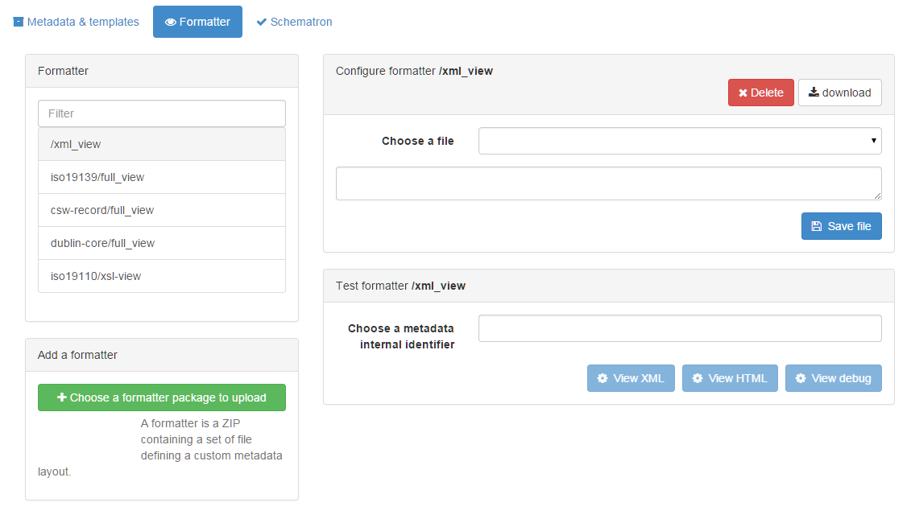

# Настройка представлений метаданных {#creating-custom-view}

GeoNetwork позволяет разработчикам легко изменять или добавлять представления метаданных. Пользователь может изменить представление в соответствии со своими потребностями.

По умолчанию начальное представление — это AngularJS-представление результатов, возвращаемых службой поиска. Поэтому это представление может содержать только поля из индекса Lucene. Если вам требуются дополнительные поля, вы можете либо добавить поля в индекс, либо не использовать AngularJS-представление. Это представление определено в файле `web-ui/src/main/resources/catalog/views/default/templates/recordView.html`.

Представления метаданных называются "форматтерами". Они располагаются в schema-plugin, связанном с метаданными, которые вы форматируете. Форматтеры используют либо XSLT, либо Groovy для преобразования XML в требуемый формат (html, xml, pdf, json).

Форматтер можно обновить через веб-интерфейс в `консоли администратора`, на вкладке `метаданные и шаблоны`, `форматтеры`. На этой странице вы можете загружать, изменять и просматривать форматтеры.

После создания нового форматтера вам нужно будет обновить код вашего приложения, чтобы вывод нового форматтера мог быть визуализирован. Если цель форматтера — ввести новое HTML-представление метаданных, вы можете добавить ссылку на него в файл `web-ui/src/main/resources/catalog/views/default/config.js` (в `searchSettings.formatter.list`).