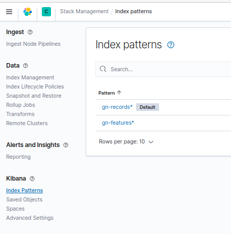
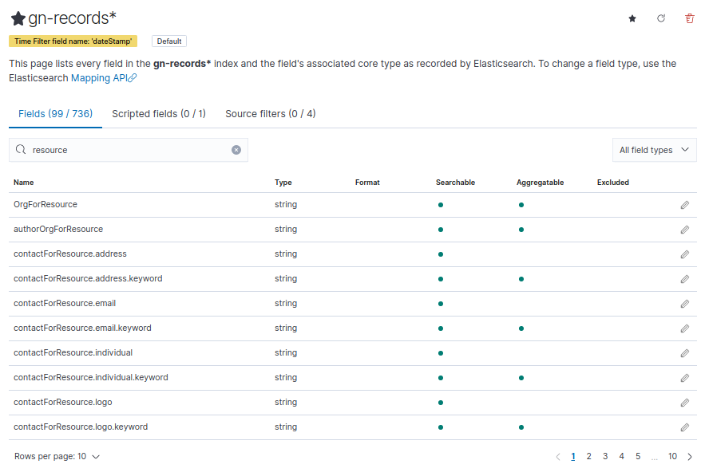
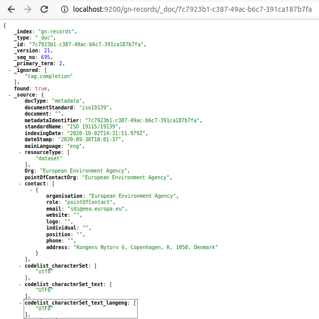
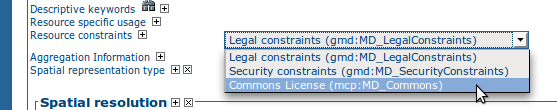

# Реализация плагинов схем {#implementing-a-schema-plugin}

## Схемы и профили метаданных

Схема метаданных описывает:

1.  имена, описания и любые кодовые списки (codelists) элементов в схеме метаданных
2.  расположение элементов схемы метаданных в документе метаданных (структура)
3.  ограничения для элементов и контента в документе метаданных
4.  документацию по использованию элементов схемы метаданных
5.  примеры документов метаданных и шаблоны метаданных
6.  скрипты для преобразования документов метаданных в другие схемы и из них

Схема метаданных обычно является реализацией стандарта метаданных.

Профиль метаданных — это адаптация схемы метаданных под нужды конкретного сообщества. Профиль метаданных содержит все компоненты схемы метаданных, но может расширять, ограничивать или переопределять эти компоненты.

## Реализация схемы или профиля метаданных

Существует множество способов реализации схемы или профиля метаданных. В этом разделе описывается способ реализации схем метаданных, используемый в [geonetwork/schema-plugins](https://github.com/geonetwork/schema-plugins) или [metadata101](https://github.com/metadata101).

Каждая схема метаданных представляет собой Maven-модуль, реализованный в виде дерева файловой системы. Корнем дерева является сокращенное имя схемы метаданных. Основные компоненты схемы метаданных находятся в папке `src/main/plugin/<schema_id>` и расположены следующим образом:

1.  Каталог **loc** с подкаталогами для каждого трехбуквенного кода языка, на который локализована эта информация, с контентом в XML-файлах (labels.xml, codelists.xml). Например: `loc/eng/codelists.xml` описывает английские кодовые списки для элементов метаданных
2.  Каталог **schema** и файл с именем **schema.xsd**, обеспечивающий единую точку входа в иерархию XSD. Например: `schema/gmd/gmd.xsd`
3.  Каталог **schematron** содержит ограничения на элементы и контент в документе метаданных, реализованные с использованием языка ISO Schematron
4.  Каталог **docs** содержит документацию о том, как следует использовать элементы схемы метаданных.
5.  Каталог **sample-data** содержит примеры документов метаданных
6.  Каталог **convert** содержит XSLT, которые преобразуют документы метаданных в другие схемы и из них

Дополнительная информация о содержимом этих каталогов и файлов будет приведена в следующем разделе.

!!! info "См. также"

    Некоторые схемы на <https://github.com/geonetwork/schema-plugins> или <https://github.com/metadata101> содержат больше информации, чем описано выше, поскольку они были реализованы как плагины схем GeoNetwork.

## Плагины схем

Плагин схемы, который можно использовать в GeoNetwork, представляет собой каталог таблиц стилей, описаний XML-схем (XSD) и другой информации, необходимой GeoNetwork для индексации, просмотра и (возможно) редактирования контента из XML-записей метаданных.

Для использования в GeoNetwork каталог схемы можно вручную поместить в подкаталог `schema_plugins` каталога данных GeoNetwork. Для некоторых схем необходимо добавить дополнительный JAR-файл в папку WEB-INF/lib. Расположение каталога данных GeoNetwork по умолчанию: `INSTALL_DIR/web/geonetwork/WEB-INF/data`.

Содержимое этих схем анализируется во время инициализации GeoNetwork. Если они корректны, они будут доступны для использования после запуска GeoNetwork.

Схемы также могут быть добавлены в GeoNetwork динамически, если создан ZIP-архив каталога схемы, который затем загружается в GeoNetwork одним из следующих способов с использованием функций меню «Администрирование»:

1.  Путь к файлу на сервере (указывается с помощью выбора файла)
2.  HTTP URL (например, `http://somehost/somedirectory/iso19139.mcp.zip`)
3.  Как онлайн-ресурс, прикрепленный к записи метаданных ISO19115/19139

Загруженные схемы также хранятся в подкаталоге `schema_plugins` каталога данных GeoNetwork.

!!! info "См. также"

    Шаблон модуля доступен на [geonetwork/schema-plugins](https://github.com/geonetwork/schema-plugins/tree/develop/iso19139.xyz) и является хорошим примером для начала работы.

### Содержимое схемы GeoNetwork

После установки схема GeoNetwork представляет собой каталог.

В `src/main/plugin/<schema_id>` могут присутствовать следующие подкаталоги:

-   **schema**: (*Необязательно*) Каталог, содержащий официальные XSD-файлы схемы метаданных. Если схема описана DTD, этот каталог необязателен. Обратите внимание, что схемы, описанные DTD, не могут редактироваться в GeoNetwork.
-   **schematron**: (*Необязательно*) Каталог, содержащий Schematron-файлы, используемые для проверки условий контента.
-   **docs**: (*Необязательно*) Документация по схеме.
-   **index-fields**: (*Обязательно*) Каталог XSLT, необходимых для индексации записей метаданных.
-   **loc**: (*Обязательно*) Каталог локализованной информации: метки, кодовые списки или специфические для схемы строки. Например, `loc/eng/codelists.xml`.
-   **convert**: (*Обязательно*) Каталог XSLT для преобразования метаданных из этой схемы или в эту схему. Это может быть преобразование метаданных в другие схемы или из других схем и форматов в данную схему. Например, `convert/oai_dc.xsl`.
-   **layout**: (*Обязательно для версии 3.x*) содержит конфигурацию для представления метаданных в редакторе.
-   **formatter**: (*Необязательно для версии 3.x*) содержит конфигурацию для представления метаданных с использованием форматтера Groovy или XSLT.
-   **present**: (*Обязательно для версии 2.x*) содержит XSLT для представления метаданных в средстве просмотра/редакторе.
-   **present/csw**: (*Обязательно*) содержит XSLT для ответов на запросы CSW для кратких, сводных и полных записей.
-   **process**: (*Необязательно*) содержит XSLT для обработки элементов метаданных механизмом предложений (см. **suggest.xsl** ниже).
-   **sample-data**: (*Необязательно*) Примеры метаданных для этой схемы. Примеры метаданных представлены в формате MEF, что позволяет им иметь миниатюры или изображения для просмотра, а также онлайн-ресурсы.
-   **templates**: (*Необязательно*) Каталог, содержащий записи-шаблоны и подшаблоны метаданных для этой схемы. Записи-шаблоны метаданных — это обычно записи с набором элементов (и контентом), которые будут использоваться для определенных целей. Например, схема iso19139.mcp имеет шаблон «Минимальный элемент» (Minimum Element), который содержит обязательные элементы для схемы и пример ожидаемого контента.

Могут присутствовать следующие таблицы стилей:

-   **extract-date-modified.xsl**: (*Обязательно*) Извлечение даты изменения из записи метаданных.
-   **extract-gml.xsl**: (*Обязательно*) Извлечение пространственного охвата из записи метаданных в виде элемента GML GeometryCollection.
-   **extract-thumbnails.xsl**: (*Необязательно*) Извлечение изображения для просмотра/миниатюры из записи метаданных.
-   **extract-uuid.xsl**: (*Обязательно*) Извлечение UUID записи метаданных.
-   **extract-relations.xsl**: (*Необязательно*) Извлечение ассоциированных ресурсов записи метаданных (например, онлайн-источник, миниатюры).
-   **set-thumbnail.xsl**: (*Необязательно*) Установка изображения для просмотра/миниатюры в записи метаданных.
-   **set-uuid.xsl**: (*Необязательно*) Установка UUID записи метаданных.
-   **suggest.xsl**: (*Необязательно*) XSLT, запускаемый службой предложений метаданных. XSLT содержит процессы, которые могут быть зарегистрированы и запущены для различных элементов записи метаданных. Например, развертывание поля ключевых слов с контентом, разделенным запятыми, в несколько полей ключевых слов. См. [Предложения по улучшению контента метаданных](../user-guide/workflow/suggestion.md) для получения дополнительной информации.
-   **unset-thumbnail.xsl**: (*Необязательно*) Удаление изображения для просмотра/миниатюры из записи метаданных.
-   **update-child-from-parent-info.xsl**: (*Необязательно*) XSLT для указания того, какие элементы в дочерней записи обновляются из родительской. Используется для управления иерархическими связями между записями метаданных.
-   **update-fixed-info.xsl**: (*Необязательно*) XSLT для обновления «фиксированного» контента в записях метаданных.

Могут присутствовать следующие конфигурационные файлы:

-   **oasis-catalog.xml**: (*Необязательно*) Каталог OASIS, описывающий любые сопоставления, которые следует использовать для этой схемы, например, сопоставление URL-адресов с локальными копиями, такими как schemaLocations. Например, `http://www.isotc211.org/2005/gmd/gmd.xsd` сопоставляется с `schema/gmd/gmd.xsd`. Имена путей в каталоге oasis указаны относительно расположения этого файла, то есть относительно каталога схемы.
-   **schema.xsd**: (*Необязательно*) Файл XML-схемы, который включает XSD, используемые данной схемой метаданных. Если схема использует DTD, этот файл не должен присутствовать. Записи метаданных из схем, использующих DTD, нельзя редактировать в GeoNetwork.
-   **schema-conversions.xml**: (*Необязательно*) XML-файл, который описывает конвертеры, которые могут быть применены к записям, принадлежащим этой схеме. Эта информация используется для отображения этих преобразований в качестве вариантов выбора для пользователя, когда запись метаданных этой схемы отображается в результатах поиска.
-   **schema-ident.xml**: (*Обязательно*) XML-файл, содержащий имя схемы, идентификатор, номер версии и подробную информацию о том, как распознать записи метаданных, принадлежащие этой схеме. Этот файл имеет определение XML-схемы в `INSTALL_DIR/web/geonetwork/xml/validation/schemaPlugins/schema-ident.xsd`, которое используется для его проверки при загрузке схемы.
-   **schema-substitutes.xml**: (*Необязательно*) XML-файл, который переопределяет набор элементов, которые могут использоваться в качестве заменителей для конкретного элемента.
-   **schema-suggestions.xml**: (*Необязательно*) XML-файл, который сообщает редактору, какие дочерние элементы сложного элемента следует автоматически разворачивать в редакторе.

В папке `index-fields` требуются следующие файлы:

-   **index.xsl**: (*Обязательно*) Индексация контента записи метаданных. Результатом является список полей и значений для индексации.

Чтобы помочь в понимании того, что представляет собой каждый из этих компонентов и что требуется, мы приведем пошаговый пример того, как создать schemaPlugin для GeoNetwork.

### Подготовка

Для создания плагина схемы для GeoNetwork необходимо выгрузить исходный код:

``` shell
git clone --recursive https://github.com/geonetwork/core-geonetwork
```

Затем вы можете выгрузить репозиторий плагинов схем, содержащий примеры:

``` shell
git clone --recursive https://github.com/geonetwork/schema-plugins
```

Чтобы работать с показанным здесь примером, создайте свой новый плагин схемы в подкаталоге модуля Maven `schemas` (см. `schemas`). Плагин `iso19139.xyz` из репозитория плагинов схем может стать хорошим стартом.

После создания необходимо зарегистрировать новый плагин в сборке приложения. Для этого:

-   Добавьте плагин как модуль модуля schemas (см. `schemas/pom.xml`):

    ``` xml
    <module>iso19139.xyz</module>
    ```

-   Зарегистрируйте плагин в веб-приложении в исполнении `copy-schemas` (см. `web/pom.xml`):

    ``` xml
    <resource>
       <directory>${project.basedir}/../schemas/iso19139.xyz/src/main/plugin</directory>
       <targetPath>${basedir}/src/main/webapp/WEB-INF/data/config/schema_plugins</targetPath>
     </resource>
    ```

-   Опционально зарегистрируйте зависимость, если ваш плагин реализует пользовательский Java-код (см. `web/pom.xml`):

    ``` xml
    <dependency>
      <groupId>${project.groupId}</groupId>
      <artifactId>schema-iso19139.xyz</artifactId>
      <version>${project.version}</version>
    </dependency>
    ```

### Пример — Морской профиль сообщества (MCP) ISO19115/19139

Морской профиль сообщества (MCP) — это профиль ISO19115/19139, разработанный для морского сообщества и совместно с ним. Профиль расширяет стандарт метаданных ISO19115 и реализован с использованием расширения XML-реализации ISO19115, описанной в ISO19139. Как стандарт метаданных ISO19115, так и его XML-реализация, ISO19139, доступны через каналы распространения ISO.

Документацию по Морскому профилю сообщества можно найти в [документе Marine Community Profile](http://www.aodc.gov.au/files/MarineCommunityProfilev1.4.pdf). Реализация в виде описаний XML-схем основана на подходе, описанном в [AppSchemas/MetadataProfiles](https://www.seegrid.csiro.au/wiki/AppSchemas/MetadataProfiles). Описания XML-схем (XSD) доступны по адресу `http://bluenet3.antcrc.utas.edu.au/mcp-1.4`.

Глядя на описания XML-схем, профиль добавляет несколько новых элементов к базовому стандарту ISO19139. Таким образом, основная идея определения схемы плагина Морского профиля сообщества для GeoNetwork заключается в том, чтобы максимально использовать базовую схему ISO19139, поставляемую с GeoNetwork.

Теперь мы опишем основные шаги по созданию каждого из компонентов схемы плагина для GeoNetwork, которая реализует MCP.

#### Создание файла schema-ident.xml

Теперь нам нужно предоставить информацию, необходимую для идентификации схемы и записей метаданных, принадлежащих этой схеме. Файл schema-ident.xml для MCP выглядит следующим образом:

``` xml
<?xml version="1.0" encoding="UTF-8"?>
<schema xmlns="http://geonetwork-opensource.org/schemas/schema-ident"
        xmlns:xsi="http://www.w3.org/2001/XMLSchema-instance">
  <name>iso19139.mcp</name>
  <id>19c9a2b2-dddb-11df-9df4-001c2346de4c</id>
  <version>1.5</version>
  <schemaLocation>
    http://bluenet3.antcrc.utas.edu.au/mcp
    http://bluenet3.antcrc.utas.edu.au/mcp-1.5-experimental/schema.xsd
    http://www.isotc211.org/2005/gmd
    http://www.isotc211.org/2005/gmd/gmd.xsd
    http://www.isotc211.org/2005/srv
    http://schemas.opengis.net/iso/19139/20060504/srv/srv.xsd
  </schemaLocation>
  <autodetect xmlns:mcp="http://bluenet3.antcrc.utas.edu.au/mcp"
              xmlns:gmd="http://www.isotc211.org/2005/gmd"
              xmlns:gco="http://www.isotc211.org/2005/gco">
    <elements>
      <gmd:metadataStandardName>
        <gco:CharacterString>
          Australian Marine Community Profile of ISO 19115:2005/19139|
          Marine Community Profile of ISO 19115:2005/19139
        </gco:CharacterString>
      </gmd:metadataStandardName>
      <gmd:metadataStandardVersion>
        <gco:CharacterString>
          1.5-experimental|
          MCP:BlueNet V1.5-experimental|
          MCP:BlueNet V1.5
        </gco:CharacterString>
      </gmd:metadataStandardVersion>
    </elements>
  </autodetect>
</schema>
```

Каждый элемент означает следующее:

-   **name** — имя, под которым схема будет известна в GeoNetwork. Если схема является профилем базовой схемы, уже добавленной в GeoNetwork, принято называть схему <base_schema_name>.<namespace_of_profile>.
-   **id** — уникальный идентификатор схемы.
-   **version** — номер версии схемы. В GeoNetwork может присутствовать несколько версий схемы.
-   **schemaLocation** — набор пар, где первый элемент пары — это URI пространства имен, а второй — официальный URL XSD. Содержимое этого элемента будет добавлено к корневому элементу любой записи метаданных, отображаемой GeoNetwork, в виде атрибута schemaLocation/noNamespaceSchemaLocation, если такой атрибут еще не существует. Он также будет использоваться всякий раз, когда требуется официальный schemaLocation/noNamespaceSchemaLocation (например, в ответе на запрос OAI ListMetadataFormats).
-   **autodetect** — содержит элементы или атрибуты (с контентом), которые должны присутствовать в любой записи метаданных, принадлежащей этой схеме. Это используется во время обнаружения схемы всякий раз, когда GeoNetwork получает запись метаданных неизвестной схемы.
-   **filters** — (Необязательно) содержит пользовательский фильтр, который применяется на основе прав доступа пользователя.

После создания этого файла вы можете проверить его вручную, используя определение XML-схемы (XSD) в `INSTALL_DIR/web/geonetwork/xml/validation/schemaPlugins/schema-ident.xsd`. Этот XSD также используется для проверки данного файла при загрузке схемы. Если schema-ident.xml не проходит проверку, схема не будет загружена.

#### Подробнее об автоопределении (autodetect)

Раздел autodetect файла schema-ident.xml используется, когда GeoNetwork необходимо идентифицировать, к какой схеме метаданных принадлежит запись.

Пять правил, которые можно использовать в этом разделе в порядке оценки:

1.  **Атрибуты** — поиск одного или нескольких атрибутов и/или пространств имен в документе. Пример варианта использования — профиль ISO19115/19139, который добавляет необязательные элементы в новом пространстве имен в gmd:identificationInfo/gmd:MD_DataIdentification. Чтобы обнаружить записи, принадлежащие этому профилю, раздел autodetect в файле schema-ident.xml может выглядеть следующим образом:

    ``` xml
    <autodetect xmlns:cmar="http://www.marine.csiro.au/schemas/cmar.xsd">
      <!-- захватить все записи cmar, имеющие элемент cmar vocab -->
      <attributes cmar:vocab="http://www.marine.csiro.au/vocabs/projectCodes.xml"/>
    </autodetect>
    ```

    Другие моменты касательно автоопределения по атрибутам:

    -   можно указать несколько атрибутов — все они должны соответствовать, чтобы запись была распознана как принадлежащая этой схеме.
    -   если атрибуты имеют пространство имен, то пространство имен должно быть указано в элементе autodetect или где-то в документе schema-ident.xml.

2.  **Элементы** — поиск одного или нескольких элементов в документе. Пример варианта использования — тот, что был показан в примере файла schema-ident.xml ранее:

    ``` xml
    <autodetect xmlns:mcp="http://bluenet3.antcrc.utas.edu.au/mcp"
                xmlns:gmd="http://www.isotc211.org/2005/gmd"
                xmlns:gco="http://www.isotc211.org/2005/gco">
      <elements>
        <gmd:metadataStandardName>
          <gco:CharacterString>
            Australian Marine Community Profile of ISO 19115:2005/19139|
            Marine Community Profile of ISO 19115:2005/19139
          </gco:CharacterString>
        </gmd:metadataStandardName>
        <gmd:metadataStandardVersion>
          <gco:CharacterString>
            1.5-experimental|
            MCP:BlueNet V1.5-experimental|
            MCP:BlueNet V1.5
          </gco:CharacterString>
        </gmd:metadataStandardVersion>
      </elements>
    </autodetect>
    ```

    Другие моменты касательно автоопределения по элементам:

    -   можно указать несколько элементов — например, как указано выше, были указаны и metadataStandardName, и metadataStandardVersion — все они должны соответствовать, чтобы запись была распознана как принадлежащая этой схеме.
    -   можно указать несколько значений для элементов. например, как выше, соответствие для gmd:metadataStandardVersion будет найдено для `1.5-experimental` ИЛИ `MCP:BlueNet V1.5-experimental` ИЛИ `MCP:BlueNet V1.5` — символ вертикальной черты '|' используется здесь для разделения вариантов. Также можно использовать регулярные выражения.
    -   если элементы имеют пространство имен, то пространство(а) имен должны быть указаны в элементе autodetect или где-то в документе schema-ident.xml перед элементом, в котором они используются — например, выше есть объявления пространства имен в элементе autodetect, чтобы не загромождать контент.

3.  **Корневой элемент** — корневой элемент документа должен совпадать. Пример использования — тот, что применяется для схемы eml-gbif. Документы, принадлежащие этой схеме, всегда имеют корневой элемент eml:eml, поэтому раздел autodetect для этой схемы выглядит так:

    ``` xml
    <autodetect xmlns:eml="eml://ecoinformatics.org/eml-2.1.1">
      <elements type="root">
        <eml:eml/>
      </elements>
    </autodetect>
    ```

    Другие моменты касательно автоопределения по корневому элементу:

    -   можно указать несколько элементов — любой элемент из набора, который совпадает с корневым элементом записи, вызовет совпадение.
    -   если элементы имеют пространство имен, то пространство(а) имен должны быть указаны в элементе autodetect или где-то в документе schema-ident.xml перед элементом, который их использует — например, как выше, в элементе autodetect есть объявление пространства имен для ясности.

4.  **Пространства имен** — поиск одного или нескольких пространств имен в документе. Пример использования — тот, что применяется для схемы csw:Record. Записи, принадлежащие схеме csw:Record, могут иметь три возможных корневых элемента: csw:Record, csw:SummaryRecord и csw:BriefRecord, но вместо использования автоопределения по нескольким корневым элементам, мы могли бы использовать общее пространство имен csw для автоопределения следующим образом:

    ``` xml
    <autodetect>
      <namespaces xmlns:csw="http://www.opengis.net/cat/csw/2.0.2"/>
    </autodetect>
    ```

    Другие моменты касательно автоопределения по пространствам имен:

    -   можно указать несколько пространств имен — все они должны присутствовать, чтобы запись была распознана как принадлежащая этой схеме.
    -   префикс игнорируется. Совпадение пространства имен происходит, если URI пространства имен, найденный в записи, совпадает с URI пространства имен, указанным в элементе автоопределения пространств имен.

5.  **Схема по умолчанию** — это предохранительный механизм для записей, которые не совпадают ни с одной из установленных схем. Значение для схемы по умолчанию указывается в конфигурации appHandler файла `INSTALL_DIR/web/geonetwork/WEB-INF/config.xml` или это может быть значение по умолчанию, указанное операцией, вызывающей autodetect (например, значение, полученное при пакетной загрузке пользователем некоторых записей метаданных). Из соображений гибкости и точности предпочтительнее, чтобы записи обнаруживались с использованием информации автоопределения установленной схемы. Схема по умолчанию — это просто «всеохватывающий» метод назначения записей определенной схеме. Элемент config в `INSTALL_DIR/web/geonetwork/WEB-INF/config.xml` выглядит следующим образом:

    ``` xml
    <appHandler class="org.fao.geonet.Geonetwork">
      .....
      <param name="preferredSchema" value="iso19139" />
      .....
    </appHandler>
    ```

#### Подробнее об оценке автоопределения

Правила автоопределения оцениваются следующим образом:

``` shell
для каждого типа правила autodetect в ( 'attributes/namespaces', 'elements',
                                   'namespaces', 'root element' )
  для каждой схемы
    если у схемы есть данный тип правила autodetect то
      проверить правило на совпадение
      если совпадение найдено, добавить к списку предыдущих совпадений
    конец если
  конец для каждой

  если совпадений больше одного, вызвать 'SCHEMA RULE CONFLICT EXCEPTION'
  если совпадение одно, установить совпадение = первому совпадению и прервать цикл
конец для каждой

если совпадения нет то
  если пространства имен записи и схемы по умолчанию пересекаются то
    установить совпадение = схема по умолчанию
  иначе вызвать 'NO SCHEMA MATCHES EXCEPTION'
конец если

вернуть совпавшую схему
```

В качестве примера предположим, что у нас есть три схемы iso19139.mcp, iso19139.mcp-1.4 и iso19139.mcp-cmar со следующими элементами autodetect:

##### iso19139.mcp-1.4

``` xml
<autodetect xmlns:mcp="http://bluenet3.antcrc.utas.edu.au/mcp"
            xmlns:gmd="http://www.isotc211.org/2005/gmd"
            xmlns:gco="http://www.isotc211.org/2005/gco">
  <elements>
    <gmd:metadataStandardName>
      <gco:CharacterString>
        Australian Marine Community Profile of ISO 19115:2005/19139
      </gco:CharacterString>
    </gmd:metadataStandardName>
    <gmd:metadataStandardVersion>
      <gco:CharacterString>MCP:BlueNet V1.4</gco:CharacterString>
    </gmd:metadataStandardVersion>
  </elements>
</autodetect>
```

##### iso19139.mcp-cmar

``` xml
<autodetect>
    <attributes xmlns:mcp-cmar="http://www.marine.csiro.au/schemas/mcp-cmar">
</autodetect>
```

##### iso19139.mcp

``` xml
<autodetect xmlns:mcp="http://bluenet3.antcrc.utas.edu.au/mcp">
  <elements type="root">
    <mcp:MD_Metadata/>
  </elements>
</autodetect>
```

Запись, проходящая обработку autodetect (например, при импорте), будет проверяться:

-   сначала iso19139.mcp-cmar, так как у нее есть правило 'attributes'
-   затем iso19139.mcp-1.4, так как у нее есть правила 'elements'
-   и наконец, по сравнению с iso19139.mcp, так как у нее есть правило 'root element'.

Идея этого алгоритма обработки заключается в том, что базовые схемы будут использовать правило 'root element' (или более сложно контролируемое правило 'namespaces'), а профили будут использовать более точное или специфическое правило, такое как 'attributes' или 'elements'.

#### Подробнее о фильтрах

Цель состоит в том, чтобы добавить возможность настройки загрузки и динамических операций на основе контента каталога, где они могут иметь различные значения в зависимости от:

-   схемы (например, URL для загрузки файла находится не в том же месте для Dublin Core и ISO19139)
-   правил кодирования записи (например, загрузкой могут быть ссылки WFS, а не только загруженный файл).

Конфигурация фильтра для каждого типа операций определяется в schema-ident.xml в разделе filters.

Фильтр определяет:

-   операцию (которая сопоставляется с методами canEdit, canDownload, canDynamic в AccessManager)
-   XPath для выбора элементов для фильтрации
-   необязательное определение элемента для замены замененного элемента (если найдено совпадение, атрибуты или дочерние элементы этого элемента вставляются). Это используется для выделения удаленного элемента.

``` xml
<filters>
  <!-- Фильтровать элемент, имеющий nilReason='withheld', для пользователя, который не может редактировать -->
  <filter xpath="*//*[@gco:nilReason='withheld']"
          ifNotOperation="editing">
    <keepMarkedElement gco:nilReason="withheld"/>
  </filter>
  <!-- Фильтровать элемент, имеющий протокол download для пользователя, который не может загружать -->
  <filter xpath="*//gmd:onLine[*/gmd:protocol/gco:CharacterString = 'WWW:DOWNLOAD-1.0-http--download']"
          ifNotOperation="download"/>
  <!-- Фильтровать элемент, имеющий протокол WMS для пользователя, который не может динамически использовать -->
  <filter xpath="*//gmd:onLine[starts-with(*/gmd:protocol/gco:CharacterString, 'OGC:WMS')]"
          ifNotOperation="dynamic"/>
</filters>
```

Фильтры применяются в XMLSerializer в соответствии с правами пользователя.

После настройки schema-ident.xml, наша новая схема плагина GeoNetwork для MCP содержит:

    schema-ident.xml

#### Создание файла schema-conversions.xml {#schema_conversions}

Этот файл описывает конвертеры, которые могут быть применены к записям метаданных, принадлежащим этой схеме. Каждый конвертер должен быть вручную определен как служба GeoNetwork (Jeeves), которую можно вызвать для преобразования конкретной записи метаданных в другую схему. Файл schema-conversions.xml для MCP выглядит следующим образом:

``` xml
<conversions>
   <converter name="xml_iso19139.mcp"
              nsUri="http://bluenet3.antcrc.utas.edu.au/mcp"
              schemaLocation="http://bluenet3.antcrc.utas.edu.au/mcp-1.5-experimental/schema.xsd"
              xslt="xml_iso19139.mcp.xsl"/>
   <converter name="xml_iso19139.mcp-1.4"
              nsUri="http://bluenet3.antcrc.utas.edu.au/mcp"
              schemaLocation="http://bluenet3.antcrc.utas.edu.au/mcp/schema.xsd"
              xslt="xml_iso19139.mcp-1.4.xsl"/>
   <converter name="xml_iso19139.mcpTooai_dc"
              nsUri="http://www.openarchives.org/OAI/2.0/"
              schemaLocation="http://www.openarchives.org/OAI/2.0/oai_dc.xsd"
              xslt="oai_dc.xsl"/>
   <converter name="xml_iso19139.mcpTorifcs"
              nsUri="http://ands.org.au/standards/rif-cs/registryObjects"
              schemaLocation="http://services.ands.org.au/home/orca/schemata/registryObjects.xsd"
              xslt="rif.xsl"/>
</conversions>
```

Каждый конвертер имеет следующие атрибуты:

-   **name** — имя конвертера. Это имя службы GeoNetwork (Jeeves), и оно должно быть уникальным (префикс имени службы `xml_<schema_name>` — хороший способ сделать это имя уникальным).
-   **nsUri** — основное пространство имен схемы, созданной конвертером. например, xml_iso19139.mcpTorifcs преобразует записи метаданных из iso19139.mcp в схему RIFCS. Записи метаданных в схеме метаданных RIFCS имеют основной URI пространства имен `http://ands.org.au/standards/rif-cs/registryObjects`.
-   **schemaLocation** — расположение (URL) определения XML-схемы (XSD), соответствующего nsURI.
-   **xslt** — имя XSLT, который фактически выполняет преобразование. Этот XSLT должен находиться в подкаталоге convert плагина схемы.

После настройки schema-conversions.xml, наша новая схема плагина GeoNetwork для MCP содержит:

    schema-conversions.xml schema-ident.xml

#### Создание каталога schema и файла schema.xsd {#schema_and_schema_xsd}

Компоненты schema и schema.xsd используются редактором GeoNetwork и функциями проверки.

Редактор GeoNetwork использует XSD для построения формы, которая не только правильно упорядочит элементы в документе метаданных, но и предложит варианты создания любых элементов, которых нет в документе метаданных. Идея этого подхода двояка. Во-первых, редактор может использовать правила определения XML-схемы, чтобы помочь пользователю избежать создания структурно некорректного документа, например, при отсутствии обязательных элементов или неправильном порядке элементов. Во-вторых, один и тот же код редактора можно использовать для любого XML-документа метаданных с определенным XSD.

Если вы определяете свою собственную схему метаданных, вы можете создать документ XML-схемы, используя язык XSD. Элементы этого языка можно найти в Интернете на [w3schools.com/schema](http://www.w3schools.com/schema/) или обратиться к учебнику, такому как Priscilla Walmsley "Definitive XML Schema" (Prentice Hall, 2002). Код разбора XML-схем GeoNetwork понимает почти весь язык XSD, за исключением redefine, any и anyAttribute (хотя последние два могут обрабатываться при особых обстоятельствах).

В случае Морского профиля сообщества мы по сути определяем ряд расширений для базового стандарта ISO19115/19139. Эти расширения определены с использованием механизма расширения XSD для типов, определенных в ISO19139. Следующий фрагмент показывает, как Морской профиль сообщества расширяет элемент gmd:MD_Metadata для добавления нового элемента под названием revisionDate:

``` xml
<xs:schema targetNamespace="http://bluenet3.antcrc.utas.edu.au/mcp"
           xmlns:mcp="http://bluenet3.antcrc.utas.edu.au/mcp">

  <xs:element name="MD_Metadata" substitutionGroup="gmd:MD_Metadata"
                                 type="mcp:MD_Metadata_Type"/>

  <xs:complexType name="MD_Metadata_Type">
    <xs:annotation>
      <xs:documentation>
       Расширяет элемент метаданных для включения revisionDate
      </xs:documentation>
    </xs:annotation>
    <xs:complexContent>
      <xs:extension base="gmd:MD_Metadata_Type">
        <xs:sequence>
          <xs:element name="revisionDate" type="gco:Date_PropertyType"
                      minOccurs="0"/>
        </xs:sequence>
        <xs:attribute ref="gco:isoType" use="required"
                      fixed="gmd:MD_Metadata"/>
      </xs:extension>
    </xs:complexContent>
  </xs:complexType>

</xs:schema>
```

Короче говоря, мы определили новый элемент mcp:MD_Metadata с типом mcp:MD_Metadata_Type, который является расширением gmd:MD_Metadata_Type. Под расширением мы понимаем, что новый тип включает в себя все элементы старого типа плюс один новый элемент, mcp:revisionDate. Обязательный атрибут (gco:isoType) также прикреплен к mcp:MD_Metadata с фиксированным значением, установленным на имя элемента, который мы расширили (gmd:MD_Metadata).

Определяя профиль таким образом, нет необходимости модифицировать базовые схемы ISO19139. Таким образом, каталог схемы для MCP по существу состоит из расширений плюс базовые схемы ISO19139. Одна из возможных структур каталогов выглядит следующим образом:

    extensions gco gmd gml gmx gsr gss gts resources srv xlink

Каталог extensions содержит один файл mcpExtensions.xsd, который импортирует пространство имен gmd. Остальные каталоги — это базовые схемы ISO19139.

Файл schema.xsd, который ищет GeoNetwork, будет импортировать файл mcpExtensions.xsd и любые другие пространства имен, не импортированные как часть базовой схемы ISO19139. Он выглядит следующим образом:

``` xml
<xs:schema targetNamespace="http://bluenet3.antcrc.utas.edu.au/mcp"
           elementFormDefault="qualified"
        xmlns:xs="http://www.w3.org/2001/XMLSchema"
        xmlns:mcp="http://bluenet3.antcrc.utas.edu.au/mcp"
        xmlns:gmd="http://www.isotc211.org/2005/gmd"
        xmlns:gmx="http://www.isotc211.org/2005/gmx"
        xmlns:srv="http://www.isotc211.org/2005/srv">
  <xs:include schemaLocation="schema/extensions/mcpExtensions.xsd"/>
  <!-- это логичное место для включения любых дополнительных схем, которые
       относятся к ISO19139, включая ISO19119 -->
  <xs:import namespace="http://www.isotc211.org/2005/srv"
             schemaLocation="schema/srv/srv.xsd"/>
  <xs:import namespace="http://www.isotc211.org/2005/gmx"
             schemaLocation="schema/gmx/gmx.xsd"/>
</xs:schema>
```

На данном этапе наша новая схема плагина GeoNetwork для MCP содержит:

``` shell
schema-conversions.xml  schema-ident.xml  schema.xsd  schema
```

#### Создание XSLT extract-\...

GeoNetwork должен извлекать определенную информацию из записи метаданных и переводить ее в общую упрощенную структуру XML, которая не зависит от схемы метаданных. Вместо того чтобы делать это с помощью XPath, закодированных в Java, используются XSLT для обработки XML и возврата общей упрощенной структуры XML.

Мы создадим три XSLT:

-   **extract-date-modified.xsl** — этот XSLT обрабатывает запись метаданных и извлекает дату последнего изменения записи метаданных. Для MCP эта информация хранится в элементе mcp:revisionDate, который является дочерним элементом mcp:MD_Metadata. Самый простой способ создать его для MCP — скопировать extract-date-modified.xsl из схемы iso19139 и модифицировать его под пространство имен MCP, а также использовать mcp:revisionDate вместо gmd:dateStamp.
-   **extract-gml.xsl** — этот XSLT обрабатывает запись метаданных и извлекает пространственный охват как элемент gml GeometryCollection. GML передается в geotools для вставки в пространственный индекс (либо shape-файл, либо пространственная база данных). Для ISO19115/19139 и профилей эта задача довольно проста, потому что пространственные охваты (кроме ограничивающей рамки) закодированы как GML в записи метаданных. Опять же, самый простой способ создать его для MCP — скопировать extract-gml.xsd из схемы iso19139 и модифицировать под пространство имен MCP.

Пример фрагмента ограничивающей рамки из записи метаданных MCP:

``` xml
<gmd:extent>
  <gmd:EX_Extent>
    <gmd:geographicElement>
      <gmd:EX_GeographicBoundingBox>
        <gmd:westBoundLongitude>
          <gco:Decimal>112.9</gco:Decimal>
        </gmd:westBoundLongitude>
        <gmd:eastBoundLongitude>
          <gco:Decimal>153.64</gco:Decimal>
        </gmd:eastBoundLongitude>
        <gmd:southBoundLatitude>
          <gco:Decimal>-43.8</gco:Decimal>
        </gmd:southBoundLatitude>
        <gmd:northBoundLatitude>
          <gco:Decimal>-9.0</gco:Decimal>
        </gmd:northBoundLatitude>
      </gmd:EX_GeographicBoundingBox>
    </gmd:geographicElement>
  </gmd:EX_Extent>
</gmd:extent>
```

Запуск extract-gml.xsl на записи метаданных, содержащей этот XML, даст:

``` xml
<gml:GeometryCollection xmlns:gml="http://www.opengis.net/gml">
  <gml:Polygon>
    <gml:exterior>
      <gml:LinearRing>
        <gml:coordinates>
          112.9,-9.0, 153.64,-9.0, 153.64,-43.8, 112.9,-43.8, 112.9,-9.0
        </gml:coordinates>
      </gml:LinearRing>
    </gml:exterior>
  </gml:Polygon>
</gml:GeometryCollection>
```

Если в записи метаданных несколько охватов, то они также должны появиться в этом элементе gml:GeometryCollection.

Чтобы узнать больше о GML, см. Lake, Burggraf, Trninic and Rae, "GML Geography Mark-Up Language, Foundation for the Geo-Web", Wiley, 2004.

Наконец, примечание о проекциях. Возможно наличие ограничивающих полигонов в записи MCP в проекции, отличной от EPSG:4326. GeoNetwork преобразует все проекции, известные GeoTools (и закодированные в форме, понятной GeoTools), в EPSG:4326 при записи пространственных охватов в shape-файл или пространственную базу данных.

-   **extract-uuid.xsl** — этот XSLT обрабатывает запись метаданных и извлекает идентификатор записи. Для MCP и базового стандарта ISO эта информация хранится в элементе gmd:fileIdentifier, который является дочерним элементом mcp:MD_Metadata.

Эти XSLT можно протестировать, запустив их на записи метаданных из схемы. Вам следует использовать процессор XSLT saxon. Например:

``` shell
java -jar INSTALL_DIR/web/geonetwork/WEB-INF/lib/saxon-9.1.0.8b-patch.jar
     -s testmcp.xml -o output.xml extract-gml.xsl
```

На данном этапе наша новая схема плагина GeoNetwork для MCP содержит:

    extract-date-modified.xsl  extract-gml.xsd   extract-uuid.xsl
    schema-conversions.xml  schema-ident.xml  schema.xsd  schema

#### Создание локализованных строк в каталоге loc

Каталог loc содержит локализованные строки, специфичные для этой схемы, организованные по аббревиатуре языка в подкаталогах.

Вы должны предоставить локализованные строки на всех языках, на которых, как вы ожидаете, будет использоваться ваша схема.

Локализованные строки для этой схемы могут использоваться в XSLT представления и сообщениях об ошибках schematron. Для XSLT представления:

-   кодовые списки для контролируемого словаря должны находиться в loc/<language_abbreviation>/codelists.xml, например `loc/eng/codelists.xml`
-   строки меток, которые заменяют имена XML-элементов на более понятные/альтернативные фразы, и строки справки при наведении курсора должны находиться в loc/<language_abbreviation>/labels.xml, например `loc/eng/labels.xml`.
-   все остальные локализованные строки должны находиться в loc/<language_abbreviation>/strings.xml, например `loc/eng/strings.xml`

Обратите внимание, что поскольку MCP является профилем ISO19115/19139 и мы следовали соглашению об именовании GeoNetwork для профилей, нам нужно включить только те метки и кодовые списки, которые специфичны для MCP или которые мы хотим переопределить. Остальные метки и кодовые списки будут получены из базовой схемы iso19139.

#### Подробнее о codelists.xml

Обычно кодовые списки генерируются из перечислимых списков в XSD схемы метаданных, таких как следующий из `http://www.isotc211.org/2005/gmd/identification.xsd` для gmd:MD_TopicCategoryCode в схеме iso19139:

``` xml
<xs:element name="MD_TopicCategoryCode" type="gmd:MD_TopicCategoryCode_Type"/>

<xs:simpleType name="MD_TopicCategoryCode_Type">
   <xs:restriction base="xs:string">
     <xs:enumeration value="farming"/>
     <xs:enumeration value="biota"/>
     <xs:enumeration value="boundaries"/>
     <xs:enumeration value="climatologyMeteorologyAtmosphere"/>
     <xs:enumeration value="economy"/>
     <xs:enumeration value="elevation"/>
     <xs:enumeration value="environment"/>
     <xs:enumeration value="geoscientificInformation"/>
     <xs:enumeration value="health"/>
     <xs:enumeration value="imageryBaseMapsEarthCover"/>
     <xs:enumeration value="intelligenceMilitary"/>
     <xs:enumeration value="inlandWaters"/>
     <xs:enumeration value="location"/>
     <xs:enumeration value="oceans"/>
     <xs:enumeration value="planningCadastre"/>
     <xs:enumeration value="society"/>
     <xs:enumeration value="structure"/>
     <xs:enumeration value="transportation"/>
     <xs:enumeration value="utilitiesCommunication"/>
   </xs:restriction>
 </xs:simpleType>
```

Ниже приведена часть записи codelists.xml, созданной вручную для этого элемента:

``` xml
<codelist name="gmd:MD_TopicCategoryCode">
  <entry>
    <code>farming</code>
    <label>Farming</label>
    <description>Разведение животных и/или выращивание растений. Примеры: сельское хозяйство,
      орошение, аквакультура, плантации, животноводство, вредители и болезни, поражающие сельскохозяйственные культуры и
      скот</description>
  </entry>
  <!-- - - - - - - - - - - - - - - - - - - - - - - - - -->
  <entry>
    <code>biota</code>
    <label>Biota</label>
    <description>Флора и/или фауна в естественной среде. Примеры: дикая природа, растительность,
      биологические науки, экология, дикая природа, морская жизнь, водно-болотные угодья, среда обитания</description>
  </entry>
  <!-- - - - - - - - - - - - - - - - - - - - - - - - - -->
  <entry>
    <code>boundaries</code>
    <label>Boundaries</label>
    <description>Юридические описания земель. Примеры: политические и административные
    границы</description>
  </entry>

  .....

</codelist>
```

Файл codelists.xml сопоставляет перечислимые значения из XSD с локализованной меткой и описанием через элемент code.

Локализованная копия codelists.xml предоставляется через XPath для XSLT представления, например /root/gui/schemas/iso19139/codelist для схемы iso19139.

XSLT metadata.xsl, который содержит шаблоны, используемые всеми XSLT представления схем метаданных, обрабатывает создание списка выбора/выпадающего меню в редакторе и отображение кода и описания в средстве просмотра метаданных.

Схема iso19139 имеет дополнительные кодовые списки, которые управляются вне XSD в файлах каталогов/словарей, таких как `http://www.isotc211.org/2005/resources/Codelist/gmxCodelists.xml`. Они также были добавлены в файл codelists.xml, чтобы их можно было локализовать, переопределять в профилях и включать расширенное описание для предоставления более полезной информации при просмотре записи метаданных.

Чтобы использовать кодовый список ISO19139 в профиле, вы можете добавить шаблон, указывающий на используемый кодовый список:

``` xml
<xsl:template mode="mode-iso19139.xyz" match="*[*/@codeList]">
  <xsl:param name="schema" select="$schema" required="no"/>
  <xsl:param name="labels" select="$labels" required="no"/>

  <xsl:apply-templates mode="mode-iso19139" select=".">
    <xsl:with-param name="schema" select="$schema"/>
    <xsl:with-param name="labels" select="$labels"/>
    <xsl:with-param name="codelists" select="$codelists"/><!-- Будет кодовым списком профиля -->
  </xsl:apply-templates>
</xsl:template>
```

Чтобы переопределить некоторые из кодовых списков ISO19139, вы можете проверить, определен ли кодовый список в профиле xyz, и если нет, использовать список ISO19139:

``` xml
<!-- сначала проверьте iso19139.xyz, затем вернитесь к iso19139 -->
<xsl:variable name="listOfValues" as="node()">
  <xsl:variable name="profileCodeList" as="node()" select="gn-fn-metadata:getCodeListValues($schema, name(*[@codeListValue]), $codelists, .)"/>
  <xsl:choose>
    <xsl:when test="count($profileCodeList/*) = 0"> <!-- сделать iso19139 -->
      <xsl:copy-of select="gn-fn-metadata:getCodeListValues('iso19139', name(*[@codeListValue]), $iso19139codelists, .)"/>
    </xsl:when>
    <xsl:otherwise>
      <xsl:copy-of select="$profileCodeList"/>
    </xsl:otherwise>
  </xsl:choose>
</xsl:variable>
```

Схема iso19139 имеет дополнительные шаблоны в своих XSLT представления для обработки этих кодовых списков, поскольку они специфичны для этой схемы. Они обсуждаются в разделе о XSLT представления позже в этом руководстве.

#### Подробнее о labels.xml

Локализованная копия labels.xml предоставляется через XPath для XSLT представления, например /root/gui/schemas/iso19139/labels для схемы iso19139.

Файл `labels.xml` также можно использовать для предоставления вспомогательных значений в виде выпадающего списка/списка выбора для полей свободного текста. Например:

``` xml
<element name="gmd:credit" id="27.0">
  <label>Credit</label>
  <description>Признание тех, кто внес вклад в ресурс(ы)</description>
  <helper>
    <option value="University of Tasmania">UTAS</option>
    <option value="University of Queensland">UQ</option>
  </helper>
</element>
```

Это приведет к тому, что редактор (через XSLT metadata.xsl) отобразит поле credit с этими вспомогательными опциями, перечисленными рядом с ним в выпадающем меню/списке выбора, примерно так:


#### Подробнее о strings.xml

Локализованная копия `strings.xml` предоставляется через XPath для XSLT представления, например /root/gui/schemas/iso19139/strings для схемы iso19139.

После добавления локализованных строк наша новая схема плагина GeoNetwork для MCP содержит:

    extract-date-modified.xsl  extract-gml.xsd  extract-uuid.xsl
    loc  present  schema-conversions.xml  schema-ident.xml  schema.xsd
    schema

#### Создание презентаций с использованием форматтера

!!! info "Добавлено в версии"

    3.0

!!! info "См. также"

    См. раздел formatter TODO для версии 3.x

#### Настройка редактора

!!! info "Добавлено в версии"

    3.0

!!! info "См. также"

    См. раздел конфигурации редактора TODO для версии 3.x

#### Создание XSLT презентаций в каталоге present

!!! warning "Устарело"

    3.0.0

Каждая схема метаданных должна содержать XSLT, которые отображают и, возможно, редактируют записи метаданных, принадлежащие этой схеме. Эти XSLT хранятся в каталоге `present`.

Для использования в иерархии include/import XSLT эти XSLT должны следовать соглашению об именовании: metadata-<schema-name>.xsl. Так, например, XSLT презентации для схемы iso19139 — это `metadata-iso19139.xsl`. Для MCP, поскольку имя нашей схемы — iso19139.mcp, XSLT презентации будет называться `metadata-iso19193.mcp.xsl`.

Любые XSLT, включенные XSLT презентации, также должны находиться в каталоге present (это соглашение для ясности — оно не является обязательным, так как URL-адреса include/import могут быть сопоставлены в oasis-catalog.xml для схемы с другими расположениями).

Существуют определенные шаблоны XSLT, которые должен иметь XSLT презентации:

-   **основной (main)** шаблон, который должен называться: metadata-<schema-name>. Для профиля MCP схемы iso19139 основной шаблон будет выглядеть следующим образом (взято из metadata-iso19139.mcp.xsl):

```{=html}
<!-- -->
```
    <xsl:template name="metadata-iso19139.mcp">
      <xsl:param name="schema"/>
      <xsl:param name="edit" select="false()"/>
      <xsl:param name="embedded"/>

      <xsl:apply-templates mode="iso19139" select="." >
        <xsl:with-param name="schema" select="$schema"/>
        <xsl:with-param name="edit"   select="$edit"/>
        <xsl:with-param name="embedded" select="$embedded" />
      </xsl:apply-templates>
    </xsl:template>

Анализ этого шаблона:

1.  Имя="metadata-iso19139.mcp" используется шаблоном обработки основного элемента в metadata.xsl: elementEP. Основные службы метаданных, show и edit, в конечном итоге вызывают metadata-show.xsl и metadata-edit.xsl соответственно с записью метаданных, переданной из службы Java. Оба этих XSLT обрабатывают запись метаданных, применяя шаблон elementEP из metadata.xsl к корневому элементу. Шаблон elementEP вызывает этот основной шаблон схемы, используя имя схемы iso19139.mcp.
2.  Задача этого основного шаблона — настроить обработку всех элементов записи метаданных с использованием шаблонов, объявленных с именем режима, которое соответствует имени схемы или имени базовой схемы (в данном случае iso19139). Эта модальная обработка гарантирует, что применяются только те шаблоны, которые предназначены для обработки элементов метаданных из этой схемы или базовой схемы. Причина этого в том, что почти все профили изменяют или добавляют небольшое количество элементов к тем, что есть в базовой схеме. Поэтому большинство элементов метаданных в профиле могут быть обработаны в режиме базовой схемы. Далее в этом разделе мы увидим, как переопределить обработку элемента в базовой схеме.

-   шаблон **completeTab**, который должен называться: <schema-name>CompleteTab. Этот шаблон будет отображать все вкладки, кроме вкладок «по умолчанию» (или простого режима) и «XML View», в левой рамке экрана редактора/просмотра. Вот пример для MCP:

``` xml
<xsl:template name="iso19139.mcpCompleteTab">
  <xsl:param name="tabLink"/>

  <xsl:call-template name="displayTab"> <!-- несуществующая вкладка - по профилю -->
    <xsl:with-param name="tab"     select="''"/>
    <xsl:with-param name="text"    select="/root/gui/strings/byGroup"/>
    <xsl:with-param name="tabLink" select="''"/>
  </xsl:call-template>

  <xsl:call-template name="displayTab">
    <xsl:with-param name="tab"     select="'mcpMinimum'"/>
    <xsl:with-param name="text"    select="/root/gui/strings/iso19139.mcp/mcpMinimum"/>
    <xsl:with-param name="indent"  select="'&#xA0;&#xA0;&#xA0;'"/>
    <xsl:with-param name="tabLink" select="$tabLink"/>
  </xsl:call-template>

  <xsl:call-template name="displayTab">
    <xsl:with-param name="tab"     select="'mcpCore'"/>
    <xsl:with-param name="text"    select="/root/gui/strings/iso19139.mcp/mcpCore"/>
    <xsl:with-param name="indent"  select="'&#xA0;&#xA0;&#xA0;'"/>
    <xsl:with-param name="tabLink" select="$tabLink"/>
  </xsl:call-template>

  <xsl:call-template name="displayTab">
    <xsl:with-param name="tab"     select="'complete'"/>
    <xsl:with-param name="text"    select="/root/gui/strings/iso19139.mcp/mcpAll"/>
    <xsl:with-param name="indent"  select="'&#xA0;&#xA0;&#xA0;'"/>
    <xsl:with-param name="tabLink" select="$tabLink"/>
  </xsl:call-template>

  ...... (то же самое, что и для iso19139CompleteTab в
 GEONETWORK_DATA_DIR/schema_plugins/iso19139/present/
 metadata-iso19139.xsl) ......

</xsl:template>
```

Этот шаблон вызывается шаблоном с именем «tab» (который также добавляет вкладки «default» и «XML View») в `INSTALL_DIR/web/geonetwork/xsl/metadata-tab-utils.xsl` с использованием имени схемы. Этот XSLT также содержит код для шаблона "displayTab".

'mcpMinimum', 'mcpCore', 'complete' и т.д. — это имена вкладок. Имя текущей или активной вкладки сохраняется в глобальной переменной "currTab", доступной для всех XSLT презентации. Логика принятия решения о том, что отображать, когда активна конкретная вкладка, должна содержаться в шаблоне обработки корневого элемента.

-   шаблон обработки **корневого элемента**. Этот шаблон должен соответствовать корневому элементу записи метаданных. Например, для схемы iso19139:

``` xml
<xsl:template mode="iso19139" match="gmd:MD_Metadata">
  <xsl:param name="schema"/>
  <xsl:param name="edit"/>
  <xsl:param name="embedded"/>

  <xsl:choose>

  <!-- вкладка метаданных -->
  <xsl:when test="$currTab='metadata'">
    <xsl:call-template name="iso19139Metadata">
      <xsl:with-param name="schema" select="$schema"/>
      <xsl:with-param name="edit"   select="$edit"/>
    </xsl:call-template>
  </xsl:when>

  <!-- вкладка идентификации -->
  <xsl:when test="$currTab='identification'">
    <xsl:apply-templates mode="elementEP" select="gmd:identificationInfo|geonet:child[string(@name)='identificationInfo']">
      <xsl:with-param name="schema" select="$schema"/>
      <xsl:with-param name="edit"   select="$edit"/>
    </xsl:apply-templates>
  </xsl:when>

  .........

</xsl:template>
```

Этот шаблон по сути является очень длинным оператором "choose" с предложениями "when", которые проверяют значение текущей определенной вкладки (в глобальной переменной currTab). Каждое предложение "when" отобразит набор элементов метаданных, соответствующих определению вкладки, используя "elementEP" напрямую (как в предложении "when" для вкладки 'identification' выше) или через именованный шаблон (как во вкладке 'metadata' выше). Для MCP наш шаблон похож на шаблон выше для iso19139, за исключением того, что совпадение было бы на "mcp:MD_Metadata" (и режим обработки может отличаться — см. раздел 'Альтернативный дизайн XSLT для профилей' ниже для получения более подробной информации).

-   шаблон **brief**, который должен называться: <schema-name>Brief. Этот шаблон обрабатывает запись метаданных и извлекает из нее нейтральную по формату сводку метаданных для таких целей, как отображение результатов поиска. Вот пример для схемы eml-gbif (потому что он довольно короткий!):

``` xml
<xsl:template match="eml-gbifBrief">
 <xsl:for-each select="/metadata/*[1]">
  <metadata>
    <title><xsl:value-of select="normalize-space(dataset/title[1])"/></title>
    <abstract><xsl:value-of select="dataset/abstract"/></abstract>

    <xsl:for-each select="dataset/keywordSet/keyword">
      <xsl:copy-of select="."/>
    </xsl:for-each>

    <geoBox>
        <westBL><xsl:value-of select="dataset/coverage/geographicCoverage/boundingCoordinates/westBoundingCoordinate"/></westBL>
        <eastBL><xsl:value-of select="dataset/coverage/geographicCoverage/boundingCoordinates/eastBoundingCoordinate"/></eastBL>
        <southBL><xsl:value-of select="dataset/coverage/geographicCoverage/boundingCoordinates/southBoundingCoordinate"/></southBL>
        <northBL><xsl:value-of select="dataset/coverage/geographicCoverage/boundingCoordinates/northBoundingCoordinate"/></northBL>
    </geoBox>
    <xsl:copy-of select="geonet:info"/>
  </metadata>
 </xsl:for-each>
</xsl:template>
```

Анализ этого шаблона:

1.  Шаблон соответствует элементу eml-gbifBrief, созданному шаблоном mode="brief" в metadata-utils.xsl. Запись метаданных будет первым дочерним элементом в /metadata XPath.
2.  Затем обрабатываются элементы метаданных для создания плоской структуры XML, которая используется search-results-xhtml.xsl для отображения сводки записи метаданных, найденной поиском.

Опять же, для профилей существующей схемы имеет смысл использовать немного другой подход, чтобы профилю не нужно было дублировать шаблоны. Вот пример из metadata-iso19139.mcp.xsl:

``` xml
<xsl:template match="iso19139.mcpBrief">
  <metadata>
    <xsl:for-each select="/metadata/*[1]">
      <!-- вызвать краткий обзор iso19139 -->
      <xsl:call-template name="iso19139-brief"/>
      <!-- теперь краткие элементы для специфических элементов mcp -->
      <xsl:call-template name="iso19139.mcp-brief"/>
    </xsl:for-each>
  </metadata>
</xsl:template>
```

Этот шаблон разделяет обработку между базовой схемой iso19139 и шаблоном brief, который обрабатывает элементы, специфичные для профиля. Это предполагает, что:

1.  Базовая схема отделила элемент <metadata> от остальной части своей обработки brief, чтобы ее могли вызывать профили
2.  Профиль включает ссылки на эквивалентные элементы, которые могут использоваться базовой схемой для обработки общих элементов, например, для ISO19139, элементы в профиле имеют атрибуты gco:isoType, которые дают имя базового элемента и могут использоваться в совпадениях XPath, таких как "gmd:MD_DataIdentification|*[@gco:isoType='gmd:MD_DataIdentification']".

-   шаблоны, которые соответствуют элементам, специфичным для схемы. Вот пример из схемы eml-gbif:

``` xml
<!-- ключевые слова обрабатываются для добавления имени тезауруса в скобках после этого
     в режиме просмотра -->

<xsl:template mode="eml-gbif" match="keywordSet">
  <xsl:param name="schema"/>
  <xsl:param name="edit"/>

  <xsl:choose>
    <xsl:when test="$edit=false()">
      <xsl:variable name="keyword">
        <xsl:for-each select="keyword">
          <xsl:if test="position() &gt; 1">,  </xsl:if>
          <xsl:value-of select="."/>
        </xsl:for-each>
        <xsl:if test="keywordThesaurus">
          <xsl:text> (</xsl:text>
          <xsl:value-of select="keywordThesaurus"/>
          <xsl:text>)</xsl:text>
        </xsl:if>
      </xsl:variable>
      <xsl:apply-templates mode="simpleElement" select=".">
        <xsl:with-param name="schema" select="$schema"/>
        <xsl:with-param name="edit"   select="$edit"/>
        <xsl:with-param name="text"    select="$keyword"/>
      </xsl:apply-templates>
    </xsl:when>
    <xsl:otherwise>
      <xsl:apply-templates mode="complexElement" select=".">
        <xsl:with-param name="schema" select="$schema"/>
        <xsl:with-param name="edit"   select="$edit"/>
      </xsl:apply-templates>
    </xsl:otherwise>
  </xsl:choose>
</xsl:template>
```

Анализ этого шаблона:

1.  В режиме просмотра отдельные ключевые слова из набора объединяются в строку, разделенную запятыми, с именем тезауруса в скобках в конце.
2.  В режиме редактирования keywordSet обрабатывается как сложный элемент, т.е. пользователь может добавлять отдельные элементы ключевых слов с контентом и одним именем тезауруса.
3.  Это пример типа обработки, который можно выполнить для элемента в записи метаданных.

Для профилей шаблоны для элементов могут быть определены таким же образом, за исключением того, что шаблон будет обрабатываться в режиме базовой схемы. Вот пример, показывающий первые несколько строк шаблона для обработки элемента mcp:revisionDate:

``` xml
<xsl:template mode="iso19139" match="mcp:revisionDate">
   <xsl:param name="schema"/>
   <xsl:param name="edit"/>

   <xsl:choose>
     <xsl:when test="$edit=true()">
       <xsl:apply-templates mode="simpleElement" select=".">
         <xsl:with-param name="schema"  select="$schema"/>
         <xsl:with-param name="edit"   select="$edit"/>

   ......
```

Если шаблон для профиля предназначен для переопределения шаблона в базовой схеме, то шаблон может быть определен в XSLT презентации для профиля с атрибутом priority, установленным на большое число, и условием XPath, которое гарантирует, что шаблон обрабатывается только для профиля. Например, в MCP мы можем переопределить обработку gmd:EX_GeographicBoundingBox в metadata-iso19139.xsl, определив шаблон в metadata-iso19139.mcp.xsl следующим образом:

``` xml
<xsl:template mode="iso19139" match="gmd:EX_GeographicBoundingBox[starts-with(//geonet:info/schema,'iso19139.mcp')]" priority="3">

......
```

Наконец, профиль может также расширять некоторые существующие кодовые списки в базовой схеме. Эти расширенные кодовые списки должны храниться в локализованном codelists.xml. Например, в iso19139 эти кодовые списки часто прикрепляются к элементам, подобным следующему:

``` xml
<gmd:role>
  <gmd:CI_RoleCode codeList="http://www.isotc211.org/2005/resources/Codelist/gmxCodelists.xml#CI_RoleCode" codeListValue="custodian">custodian</gmd:CI_RoleCode>
</gmd:role>
```

Шаблоны для обработки этих элементов находятся в XSLT презентации iso19139 `GEONETWORK_DATA_DIR/schema_plugins/iso19139/present/metadata-iso19139.xsl`. Эти шаблоны используют имя элемента (например, gmd:CI_RoleCode) и XPath кодового списка (например, /root/gui/schemas/iso19139/codelists) для создания списков выбора/выпадающих меню при редактировании и для отображения полного описания при просмотре. См. шаблоны рядом с шаблоном 'iso19139Codelist'. Эти шаблоны могут обрабатывать расширенные кодовые списки для любого профиля, потому что они:

-   соответствуют любому элементу, который имеет дочерний элемент с атрибутом codeList
-   используют имя схемы в XPath кодовых списков
-   возвращаются к базовой схеме iso19139, если кодовый список профиля не имеет необходимого кодового списка

Однако, если вам не нужны локализованные кодовые списки, часто проще и быстрее извлекать кодовые списки напрямую из файла `gmxCodelists.xml`. Это, по сути, и есть решение, принятое для MCP. Файл `gmxCodelists.xml` включается в XSLT презентации для MCP с помощью оператора, подобного этому:

``` xml
<xsl:variable name="codelistsmcp"
              select="document('../schema/resources/Codelist/gmxCodelists.xml')"/>
```

Проверьте шаблоны обработки кодовых списков в `metadata-iso19139.mcp.xsl`, чтобы увидеть, как это работает.

#### Альтернативный дизайн XSLT для профилей

Во всех мощных языках будет более одного способа достижения конкретной цели. Этот альтернативный дизайн XSLT предназначен для обработки профилей. Идея альтернативы основана на следующих наблюдениях за XSLT GeoNetwork:

1.  Все элементы изначально обрабатываются apply-templates в режиме "elementEP".
2.  Шаблон "elementEP" (см. `INSTALL_DIR/web/geonetwork/xsl/metadata.xsl`) в конечном итоге вызывает **основной** шаблон схемы/профиля.
3.  Основной шаблон может сначала обработать элемент в режиме, специфичном для профиля, и если это не удалось (т.е. нет совпадения шаблона и, следовательно, не возвращены HTML-элементы), обработать элемент в режиме базовой схемы.

Преимущество этого дизайна в том, что переопределение шаблона для элемента в базовой схеме не требует атрибута priority или проверки условия XPath по имени схемы.

Вот пример для MCP (iso19139.mcp) с базовой схемой iso19139:

-   **основной** шаблон, который должен называться: metadata-iso19139.mcp.xsl:

``` xml
<!-- основной шаблон - путь к обработке iso19139.mcp -->
<xsl:template name="metadata-iso19139.mcp">
  <xsl:param name="schema"/>
  <xsl:param name="edit" select="false()"/>
  <xsl:param name="embedded"/>

    <!-- обработать в режиме профиля сначала -->
    <xsl:variable name="mcpElements">
      <xsl:apply-templates mode="iso19139.mcp" select="." >
        <xsl:with-param name="schema" select="$schema"/>
        <xsl:with-param name="edit"   select="$edit"/>
        <xsl:with-param name="embedded" select="$embedded" />
      </xsl:apply-templates>
    </xsl:variable>

    <xsl:choose>

      <!-- если мы получили совпадение в режиме профиля, показать его -->
      <xsl:when test="count($mcpElements/*)>0">
        <xsl:copy-of select="$mcpElements"/>
      </xsl:when>

      <!-- в противном случае обработать в режиме базового iso19139 -->
      <xsl:otherwise>
        <xsl:apply-templates mode="iso19139" select="." >
          <xsl:with-param name="schema" select="$schema"/>
          <xsl:with-param name="edit"   select="$edit"/>
          <xsl:with-param name="embedded" select="$embedded" />
        </xsl:apply-templates>
      </xsl:otherwise>
    </xsl:choose>
</xsl:template>
```

Анализ этого шаблона:

1.  Имя="metadata-iso19139.mcp" используется шаблоном обработки основного элемента в metadata.xsl: elementEP. Основные службы метаданных, show и edit, в конечном итоге вызывают metadata-show.xsl и metadata-edit.xsl соответственно с записью метаданных, переданной из службы Java. Оба этих XSLT обрабатывают запись метаданных, применяя шаблон elementEP из metadata.xsl к корневому элементу. elementEP вызывает соответствующий основной шаблон схемы, используя имя схемы.
2.  Задача этого основного шаблона — настроить обработку всех элементов профиля метаданных. Обработка происходит в одном из двух режимов. Во-первых, элемент обрабатывается в режиме профиля (iso19139.mcp). Если совпадение найдено, HTML-элементы будут возвращены и скопированы в выходной документ. Если HTML-элементы не возвращены, элемент обрабатывается в режиме базовой схемы, iso19139.

-   шаблоны, которые соответствуют элементам, специфичным для профиля, имеют режим iso19139.mcp:

``` xml
<xsl:template mode="iso19139.mcp" match="mcp:taxonomicElement">
  <xsl:param name="schema"/>
  <xsl:param name="edit"/>

  .....
</xsl:template>
```

-   шаблоны, которые переопределяют элементы в базовой схеме, обрабатываются в режиме профиля iso19139.mcp

``` xml
<xsl:template mode="iso19139.mcp" match="gmd:keyword">
  <xsl:param name="schema"/>
  <xsl:param name="edit"/>

  .....
</xsl:template>
```

Заметьте, что заголовок шаблона профиля имеет более простой дизайн, чем тот, который используется для исходного дизайна? Ни атрибут priority, ни условие XPath схемы не требуются, потому что мы используем режим, отличный от режима базовой схемы.

-   Для поддержки обработки в двух режимах нам нужно добавить пустой шаблон в режим профиля iso19139.mcp следующим образом:

``` xml
<xsl:template mode="iso19139.mcp" match="*|@*"/>
```

Этот шаблон будет соответствовать всем элементам, для которых у нас нет специального шаблона в режиме профиля iso19139.mcp. Эти элементы будут обрабатываться в режиме базовой схемы iso19139 вместо этого, потому что пустой шаблон ничего не возвращает (см. обсуждение основного шаблона выше).

Остальная часть обсуждения в оригинальном дизайне, касающаяся вкладок и т.д., относится к альтернативному дизайну и здесь не повторяется.

#### XSLT презентации CSW

Сервер CSW можно попросить предоставить записи в ряде выходных схем. Две поддерживаемые GeoNetwork:

-   **ogc** - <http://www.opengis.net/cat/csw/2.0.2> - производная от Dublin Core
-   **iso** - <http://www.isotc211.org/2005/gmd> - ISO19115/19139

Из каждой из этих выходных схем можно запросить **brief** (краткий), **summary** (сводный) или **full** (полный) набор элементов.

Эти выходные схемы и наборы элементов реализованы в GeoNetwork как XSLT, и они хранятся в подкаталоге 'csw' каталога 'present'. XSLT выходной схемы ogc реализованы как ogc-brief.xsl, ogc-summary.xsl и ogc-full.xsl. XSLT выходной схемы iso реализованы как iso-brief.xsl, iso-summary.xsl и iso-full.xsl.

Чтобы создать эти XSLT для MCP, лучший вариант — скопировать и модифицировать XSLT презентации csw из базовой схемы iso19139.

После создания XSLT презентаций наша новая схема плагина GeoNetwork для MCP содержит:

    extract-date-modified.xsl  extract-gml.xsd  extract-uuid.xsl
    loc  present  schema-conversions.xml  schema-ident.xml  schema.xsd
    schema

#### Создание index.xsl для индексации контента из записи метаданных

Этот XSLT индексирует контент элементов в записи метаданных. Суть этого XSLT заключается в выборе элементов из записи метаданных и сопоставлении их с именами полей индекса. Используя Kibana, пользователь может просматривать индекс и проверять все доступные поля. Количество полей зависит от каталога, так как некоторые поля являются динамическими, например, кодовый список, тезаурус.

В Kibana перейдите в ``Stack Management --> Index pattern``



Выберите ``gn-records`` для получения списка полей:



Если экземпляр Elasticsearch доступен, пользователи могут получить подробную информацию о записи, используя `http://localhost:9200/gn-records/_doc/7c7923b1-c387-49ac-b6c7-391ca187b7fa` (также можно использовать **Dev Tools** в Kibana для получения подробностей документа):



Например, вот сопоставление, созданное между элементом метаданных mcp:revisionDate и полем индекса changeDate:

``` xml
<xsl:for-each select="mcp:revisionDate/*">
  <changeDate><xsl:value-of select="string(.)"/></changeDate>
</xsl:for-each>
```

Обратите внимание, что мы создаем новый документ XML. Элементы Field в этом документе считываются GeoNetwork для создания объекта документа для индексации (см. класс SearchManager в исходном коде GeoNetwork).

Опять же, поскольку MCP является профилем ISO19115/19139, вероятно, лучше модифицировать `index.xsl` из схемы iso19139 для обработки пространств имен и дополнительных элементов MCP.

На данном этапе наша новая схема плагина GeoNetwork для MCP содержит:

    extract-date-modified.xsl  extract-gml.xsd  extract-uuid.xsl
    index.xsl  loc  present  schema-conversions.xml  schema-ident.xml
    schema.xsd  schema

#### Создание каталога sample-data

Это простой каталог. Поместите в этот каталог MEF-файлы с примерами метаданных. Убедитесь, что они имеют суффикс `.mef`.

MEF-файл — это ZIP-архив с метаданными, миниатюрами, файловыми онлайн-ресурсами и информационным файлом, описывающим содержимое. Содержимое MEF-файла обсуждается более подробно в следующем разделе этого руководства.

Примеры данных в этом каталоге могут быть добавлены в каталог с помощью меню «Администрирование».

На данном этапе наша новая схема плагина GeoNetwork для MCP содержит:

    extract-date-modified.xsl  extract-gml.xsd  extract-uuid.xsl
    index-fields.xsl  loc  present  sample-data schema-ident.xml  schema.xsd
    schema

#### Создание Schematron для описания условий MCP

Schematron — это правила, которые используются для проверки условий и контента в записи метаданных как часть двухэтапного процесса проверки, используемого GeoNetwork.

Правила Schematron создаются в каталоге schematrons, который вы загрузили ранее — см. [Подготовка](implementing-a-schema-plugin.md#preparation) выше.

Пример правила:

``` xml
<!-- anzlic/trunk/gml/3.2.0/gmd/spatialRepresentation.xsd-->
<!-- ТЕСТ 12 -->
<sch:pattern>
  <sch:title>$loc/strings/M30</sch:title>
  <sch:rule context="//gmd:MD_Georectified">
    <sch:let name="cpd" value="(gmd:checkPointAvailability/gco:Boolean='1' or gmd:checkPointAvailability/gco:Boolean='true') and
      (not(gmd:checkPointDescription) or count(gmd:checkPointDescription[@gco:nilReason='missing'])>0)"/>
    <sch:assert
      test="$cpd = false()"
      >$loc/strings/alert.M30</sch:assert>
    <sch:report
      test="$cpd = false()"
      >$loc/strings/report.M30</sch:report>
  </sch:rule>
</sch:pattern>
```

Как и для большей части GeoNetwork, вывод этого правила может быть локализован на разные языки. Соответствующие локализованные строки:

``` xml
<strings>

  .....

  <M30>[ISOFTDS19139:2005-TableA1-Row15] - Описание контрольной точки требуется, если оно доступно</M30>

  .....

  <alert.M30><div>'checkPointDescription' является обязательным, если 'checkPointAvailability' = 1 или true.</div></alert.M30>

  .....

  <report.M30>Описание контрольной точки задокументировано.</report.M30>

  .....

</strings>
```

Процедура добавления правил Schematron, работая внутри каталога schematrons:

1.  Поместите ваши правила Schematron в 'rules'. Соглашение об именовании — 'schematron-rules-<suffix>.sch', например `schematron-rules-iso-mcp.sch`. Поместите локализованные строки для утверждений правила в 'rules/loc/<language_prefix>'.

Правила Schematron компилируются при загрузке схемы при запуске. Схему также можно перезагрузить с помощью API-операции http://localhost:8080/geonetwork/srv/api/standards/reload для обновления schematron.

На данном этапе наша новая схема плагина GeoNetwork для MCP содержит:

    extract-date-modified.xsl  extract-gml.xsd  extract-uuid.xsl
    index-fields.xsl  loc  present  sample-data  schema-conversions.xml
    schema-ident.xml  schema.xsd  schema  schematron/schematron-rules-iso-mcp.sch

#### Добавление компонентов, необходимых для создания и редактирования метаданных MCP

До сих пор мы добавили все компоненты, необходимые GeoNetwork для идентификации, просмотра и проверки записей метаданных MCP. Теперь мы добавим оставшиеся компоненты, необходимые для создания и редактирования записей метаданных MCP.

Мы начнем с XSLT, которые устанавливают содержимое различных элементов в записях метаданных MCP.

#### Создание set-uuid.xsl

-   **set-uuid.xsl** — этот XSLT принимает в качестве параметра UUID записи метаданных и записывает его в соответствующий элемент записи метаданных. Для MCP этот элемент такой же, как в базовой схеме ISO (называемой iso19139 в GeoNetwork), а именно gmd:fileIdentifier. Однако, поскольку MCP использует другое пространство имен для корневого элемента, этот XSLT необходимо модифицировать.

#### Создание XSLT update-\...

-   **update-fixed-info.xsl** — этот XSLT запускается после редактирования для исправления определенных элементов и содержимого в записи метаданных. Для MCP есть ряд действий, которые мы хотели бы предпринять, чтобы «жестко прописать» определенные элементы и содержимое. Для этого XSLT использует следующую логику обработки:

```{=html}
<!-- -->
```
    если элемент — тот, который мы хотим обработать то
      добавить шаблон с условием соответствия для этого элемента и обработать его
    иначе скопировать элемент в вывод

Поскольку MCP является профилем ISO19115/19139, самый простой путь к созданию этого XSLT — скопировать update-fixed-info.xsl из схемы iso19139 и модифицировать его для изменений в пространстве имен, требуемых MCP, а затем включить нужную нам обработку.

Простой пример обработки MCP — убедиться, что элементы gmd:metadataStandardName и gmd:metadataStandardVersion имеют содержимое, необходимое для того, чтобы запись была распознана как MCP. Для этого мы можем добавить два шаблона:

``` xml
<xsl:template match="gmd:metadataStandardName" priority="10">
  <xsl:copy>
    <gco:CharacterString>Australian Marine Community Profile of ISO 19115:2005/19139</gco:CharacterString>
  </xsl:copy>
</xsl:template>

<xsl:template match="gmd:metadataStandardVersion" priority="10">
  <xsl:copy>
    <gco:CharacterString>MCP:BlueNet V1.5</gco:CharacterString>
  </xsl:copy>
</xsl:template>
```

Обработка с помощью `update-fixed-info.xsl` может быть включена/отключена с помощью флажка *Автоматические исправления* в меню Конфигурация системы. По умолчанию она включена.

Некоторые важные задачи, решаемые в `upgrade-fixed-info.xsl`:

-   создание URL-адресов для метаданных с прикрепленными файлами (например, onlineResources с 'File for download' в iso19139)
-   установка штампа даты/даты ревизии
-   установка URL-адресов кодовых списков, указывающих на онлайн-каталоги кодовых списков ISO
-   добавление атрибутов системы пространственных координат по умолчанию к пространственным охватам

Конкретная задача, требуемая для MCP `update-fixed-info.xsl`, заключалась в автоматическом создании онлайн-ресурса с URL-адресом, указывающим на службу metadata.show с параметром, установленным на uuid метаданных. Это потребовало некоторых изменений в update-fixed-info.xsl, поставляемом с iso19139. В частности:

-   родительские элементы могут отсутствовать в записи метаданных
-   обработка элементов онлайн-ресурса для URL-адреса истины метаданных не должна мешать другой обработке элементов онлайн-ресурса

Вместо того чтобы описывать отдельные шаги, необходимые для реализации этого, и решения, требуемые на языке XSLT, взгляните на `update-fixed-info.xsl`, уже присутствующий для схемы MCP в каталоге iso19139.mcp, и обратитесь к пунктам выше.

#### Создание каталога templates

Это простой каталог. Поместите в этот каталог XML-файлы метаданных, которые будут использоваться как шаблоны. Убедитесь, что они имеют суффикс `.xml`. Шаблоны в этом каталоге могут быть добавлены в каталог с помощью меню «Администрирование».

#### Поведение редактора: Добавление schema-suggestions.xml и schema-substitutes.xml

-   **schema-suggestions.xml** — Поведение по умолчанию расширенного редактора GeoNetwork при построении форм редактора заключается в отображении элементов, которых нет в записи метаданных, как неразвернутых элементов. Чтобы добавить эти элементы в запись, пользователю придется нажать на значок '+' рядом с именем элемента. Это может быть утомительно, особенно потому, что некоторые стандарты метаданных имеют элементы, вложенные в другие (т.е. сложные элементы). Файл schema-suggestions.xml позволяет указать элементы, которые должны автоматически разворачиваться редактором. Пример этого — информация об онлайн-ресурсе в стандарте ISO19115/19139. Если следующий XML был добавлен в файл `schema-suggestions.xml`:

``` xml
<field name="gmd:CI_OnlineResource">
  <suggest name="gmd:protocol"/>
  <suggest name="gmd:name"/>
  <suggest name="gmd:description"/>
</field>
```

Эффект этого будет заключаться в том, что когда элемент онлайн-ресурса разворачивается, поля ввода для протокола (выпадающий список/список выбора), имени и описания автоматически появятся в редакторе.

Опять же, хорошим местом для начала при создании файла `schema-suggestions.xml` для MCP является файл `schema-suggestions.xml` для схемы iso19139.

-   **schema-substitutes.xml** — Вспомните из раздела [Создание каталога schema и файла schema.xsd](implementing-a-schema-plugin.md#schema_and_schema_xsd), что метод, который мы использовали для расширения базовых схем ISO19115/19139, заключается в расширении базового типа, определении нового элемента с расширенным базовым типом и разрешении новому элементу замещать базовый элемент. Например, в MCP мы хотим добавить новый элемент ограничения ресурса, который содержит Creative Commons и другую информацию о лицензировании общего типа. Это требует, чтобы тип MD_Constraints был расширен и был определен новый элемент mcp:MD_Commons, который может замещать gmd:MD_Constraints. Это показано в следующем фрагменте XSD:

``` xml
<xs:complexType name="MD_CommonsConstraints_Type">
  <xs:annotation>
    <xs:documentation>
      Добавить MD_Commons как расширение gmd:MD_Constraints_Type
    </xs:documentation>
  </xs:annotation>
  <xs:complexContent>
    <xs:extension base="gmd:MD_Constraints_Type">
      <xs:sequence minOccurs="0">
        <xs:element name="jurisdictionLink" type="gmd:URL_PropertyType" minOccurs="1"/>
        <xs:element name="licenseLink" type="gmd:URL_PropertyType" minOccurs="1"/>
        <xs:element name="imageLink" type="gmd:URL_PropertyType" minOccurs="1"/>
        <xs:element name="licenseName" type="gco:CharacterString_PropertyType" minOccurs="1"/>
        <xs:element name="attributionConstraints" type="gco:CharacterString_PropertyType" minOccurs="0" maxOccurs="unbounded"/>
        <xs:element name="derivativeConstraints" type="gco:CharacterString_PropertyType" minOccurs="0" maxOccurs="unbounded"/>
        <xs:element name="commercialUseConstraints" type="gco:CharacterString_PropertyType" minOccurs="0" maxOccurs="unbounded"/>
        <xs:element name="collectiveWorksConstraints" type="gco:CharacterString_PropertyType" minOccurs="0" maxOccurs="unbounded"/>
        <xs:element name="otherConstraints" type="gco:CharacterString_PropertyType" minOccurs="0" maxOccurs="unbounded"/>
      </xs:sequence>
      <xs:attribute ref="mcp:commonsType" use="required"/>
      <xs:attribute ref="gco:isoType" use="required" fixed="gmd:MD_Constraints"/>
    </xs:extension>
  </xs:complexContent>
</xs:complexType>

<xs:element name="MD_Commons" substitutionGroup="gmd:MD_Constraints" type="mcp:MD_CommonsConstraints_Type"/>
```

Для записей MCP редактор GeoNetwork покажет выбор элементов из группы подстановки для gmd:MD_Constraints при добавлении «Ограничений ресурсов» в документ метаданных. Теперь это будет включать mcp:MD_Commons.


Заметьте, что аналогичным процессом два других элемента, ныне устаревшие в пользу MD_Commons, также были добавлены как заменители для MD_Constraints. Если необходимо было ограничить варианты выбора, показанные в этом меню, например, чтобы удалить устаревшие элементы и ограничить выбор только юридическими, безопасностью и общими, то это можно сделать с помощью следующего фрагмента XML в файле schema-substitutes.xml:

``` xml
<field name="gmd:MD_Constraints">
  <substitute name="gmd:MD_LegalConstraints"/>
  <substitute name="gmd:MD_SecurityConstraints"/>
  <substitute name="mcp:MD_Commons"/>
</field>
```

Результат этого изменения показан ниже.



Опять же, хорошим местом для начала при создании файла schema-substitutes.xml для MCP является файл schema-substitutes.xml для схемы iso19139.

#### Добавление компонентов для поддержки преобразования записей метаданных в другие схемы

#### Создание каталога convert

Если новая схема плагина GeoNetwork должна поддерживать оперативный перевод записей метаданных в другие схемы, то каталог convert должен быть создан и заполнен соответствующими XSLT.

#### Поддержка преобразований OAIPMH

Сервер OAIPMH в GeoNetwork может доставлять записи метаданных из любой схемы, известной GeoNetwork. Он также может быть настроен на доставку схем, не известных GeoNetwork, если существует XSLT для преобразования записи метаданных в эту схему. Файл `INSTALL_DIR/web/geonetwork/WEB-INF/config-oai-prefixes.xml` описывает схемы (известные как префиксы в терминологии OAI), которые могут быть созданы с помощью XSLT. Простой пример содержимого этого файла показан ниже:

``` xml
<schemas>
  <schema prefix="oai_dc" nsUrl="http://www.openarchives.org/OAI/2.0/"
          schemaLocation="http://www.openarchives.org/OAI/2.0/oai_dc.xsd"/>
</schemas>
```

В случае префикса oai_dc, показанного выше, если конвертер схемы с префиксом *oai_dc* существует в файле `schema-conversions.xml` схемы GeoNetwork, то записи, принадлежащие этой схеме, будут преобразованы и включены в запросы OAIPMH для префикса *oai_dc*. См. [Создание файла schema-conversions.xml](implementing-a-schema-plugin.md#schema_conversions) для получения дополнительной информации.

Чтобы добавить поддержку oai_dc для MCP, самый простой метод — скопировать oai_dc.xsl из каталога convert схемы iso19139, модифицировать его для обработки различных пространств имен и дополнительных элементов MCP и добавить его в файл `schema-conversions.xml` для MCP.