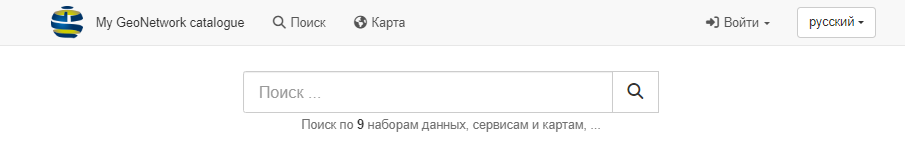
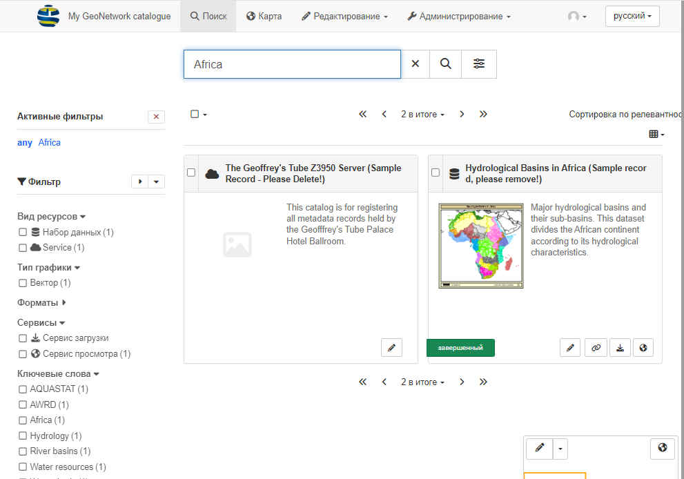
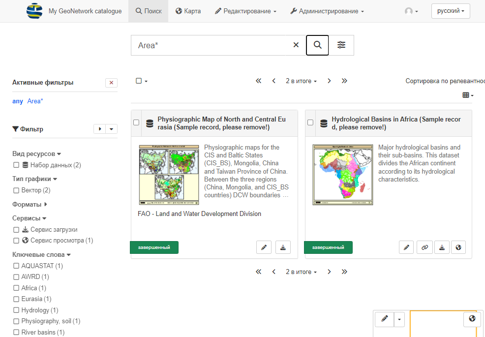
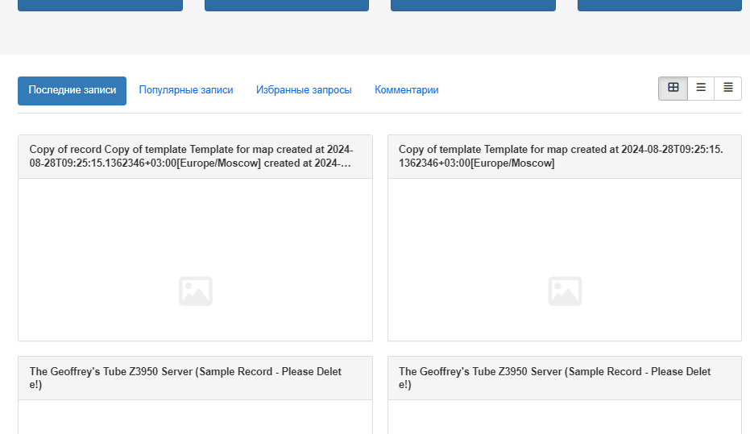
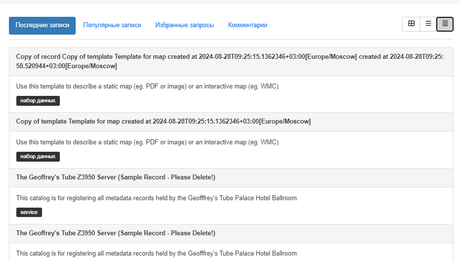
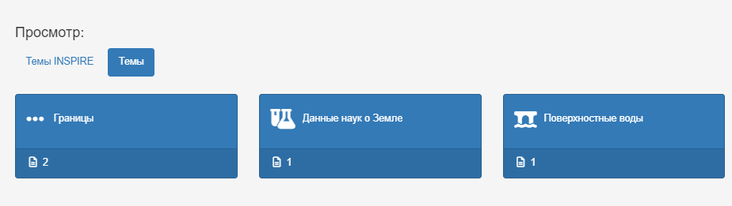
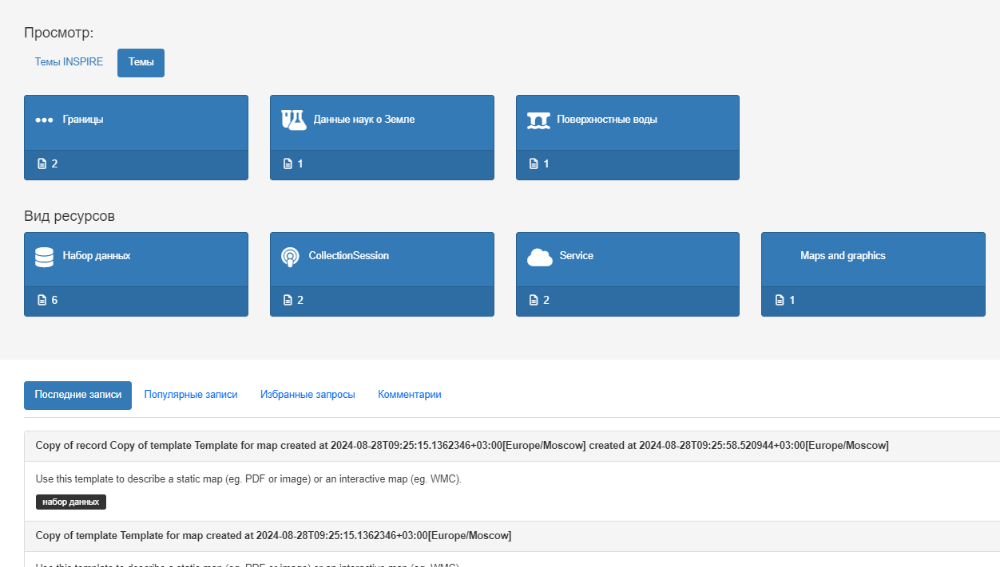

---
tags:
- Search
- Catalog
- Topics
- Grid
- List
- Home
hide:
  - tags
---

# Главная страница

Главная страница каталога используется для просмотра записей и содержит поле быстрого поиска.

## Быстрый поиск

1.  Введите нужные ключевые слова и условия поиска в поле **Поиск**
    в верхней части страницы и нажмите **:fontawesome-solid-magnifying-glass: Поиск**.
    (или воспользуйтесь клавишей ++enter++), чтобы вывести список результатов поиска.

    

    
    

    *Форма поиска*

2.  Поиск по полным словам.

    В поле **Поиск** введите на английском `Africa`.
    
    Результаты отображаются на странице **Поиск**.

    

    
    

    *Результаты поиска для слова "Africa"*

3.  Поиск с использованием символ `*` для поиска начала или конца слова. 
    Следует помнить, что поиск ведется по всему содержимому в записи, а не только по
    названию и описанию.
    
    Используйте поле **Поиск** для ввода: `Area*`.

    

    
    

    *Поиск по началу слова*

4.  Символ `*` также можно использовать несколько раз для определения соответствия части слова.

    Используйте поле "Поиск", чтобы ввести: "\*frica\*"

    

    
    * Поиск по части слова*

5. Результаты поиска отображаются на вкладке "Поиск", которая позволяет фильтровать и просматривать записи.

## Просмотр каталога

1.  Перейдите в **My GeoNetwork catalogue**, чтобы просмотреть записи.
    Ваша организация, возможно, изменила логотип и название каталога на свои.

2.  Страницу каталога можно изучить с помощью быстрых списков:

    - **Последние записи**: недавно обновленные записи
    - **Популярные записи**: часто используемые записи
    - **Избранные запросы**: добавленные пользователем избранные запрос
    - **Комментарии**: записи с новыми комментариями и обсуждениями
    
    

    
    

    *Последние новости*

3.  Записи могут отображаться как:
    -    :fontawesome-solid-table-cells-large: в виде блока
    -    :fontawesome-solid-bars: подробного списка
    -    :fontawesome-solid-align-justify: сокращённого списка
    
    с помощью переключателя справа.

    Нажмите на любую из перечисленных записей, чтобы просмотреть ее.

    

    
    

    *Отображение в виде сокращённого списка*

4.  Главная страница предоставляет ряд быстрых поисков для просмотра содержимое каталога:

    - Используйте **Поиск по темам**, чтобы для поиска записей по тематике.
      
    
    - Используйте **Поиск видам ресурсов**, чтобы для поиска различных видов содержимого.

      
      