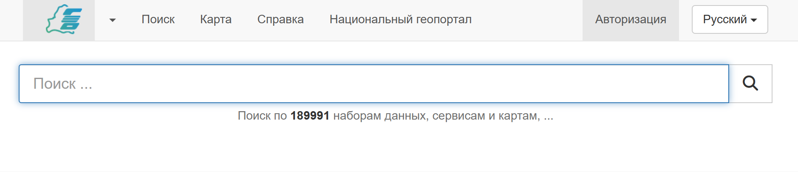
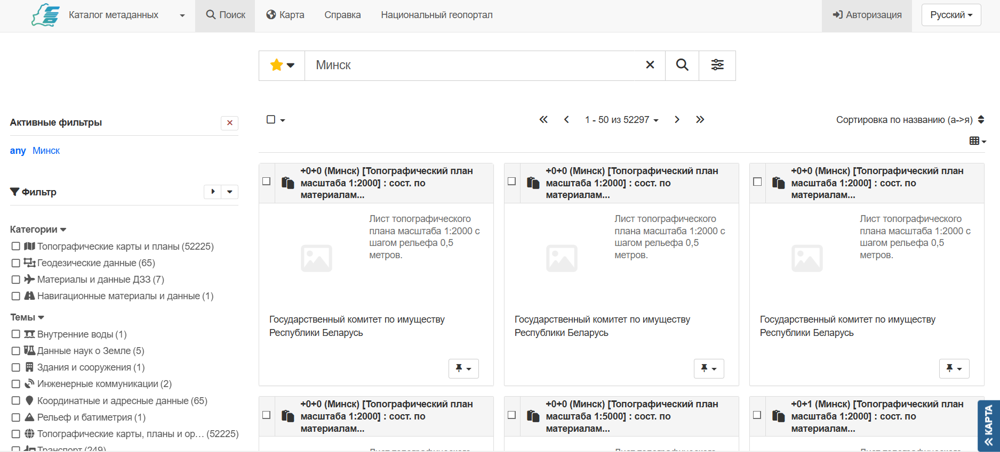
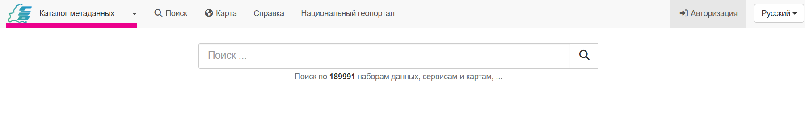
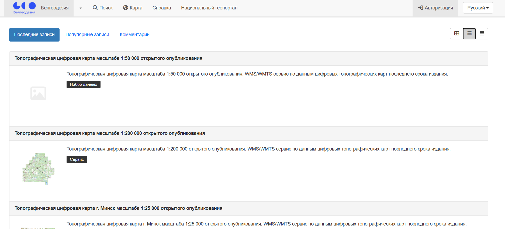
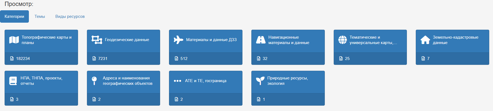
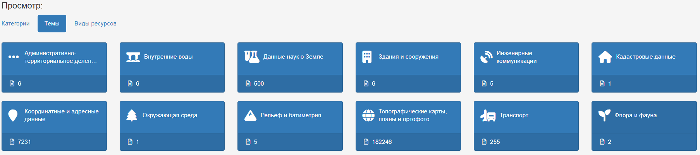

---
tags:
  - Поиск
  - Каталог
  - Темы
  - Сетка
  - Список
  - Главная
hide:
  - tags
---

# Главная страница каталога

Главная страница каталога метаданных используется для поиска среди существующих записей метаданных и быстрого их предпросмотра.

## Поиск по каталогу

1.  Введите нужные ключевые слова и поисковые термины в поле **Поиск**
    в верхней части страницы и нажмите кнопку **:fontawesome-solid-magnifying-glass: Поиск**
    (или используйте клавишу _enter_), чтобы вывести результаты поиска.

    

    
    

    *Поле поиска*

2.  Поиск по целым словам.

    Например, в поле **Поиск** введите поисковый запрос: `Минск`
    
    Результаты отображаются на вкладке **Поиск**.

    

    
    

    *Результаты поиска для запроса Минск*

3.  Используйте подстановочный знак `*` для поиска совпадений с началом или концом слова.
    Имейте в виду, что поиск производится по всему содержимому записи, а не только
    по заголовкам и описанию.
    
    Используйте поле **Поиск** для ввода запроса: `орто*`

    

    
    

    *Поиск по началу слова орто-*

4.  Подстановочный знак `*` также можно использовать несколько раз для поиска части слова.

    Используйте поле **Поиск** для ввода: `*гомель*`

    

    
    

    *Поиск по части слова*

5.  Для поиска целых фраз и точных совпадений, запрос нужно ввести в кавычках.

    Введите в поле **Поиск** запрос: `"Топографический план масштаба 1:2000"`

    

    
    

    *Поиск целой фразы или точного совпадения*

6.  Поисковая строка позволяет использовать расширенные возможности поискового движка, с помощью  q-запросов, которые используют специальный синтаксис запросов.

    Например, для поиска записей о наборах пространственных данных, созданных в 2024 году, составляется запрос: `q(+createDate:[2024-01-01 TO 2024-12-31])`

    

    
    

    *Расширенный поиск записей метаданных*

    > **Примечание:** подробное описание возможностей расширенного поиска (описание операторов, подстановочных знаков и диапазонов) движка Национального геопортала можно найти в официальной документации **[Elasticsearch - Query String Syntax](https://www.elastic.co/guide/en/elasticsearch/reference/current/query-dsl-query-string-query.html#query-string-syntax)**

7. Результаты поиска отображаются на вкладке **Поиск**, которая позволяет фильтровать и изучать записи.

## Просмотр каталога метаданных

1.  Просмотра записей осуществляется в **Каталоге метаданных** Национального геопортала. Переход к Каталогу метаданных доступен по ссылке в левом верхнем углу страницы.

    

    
    

    *Ссылка на каталог метаданных*

    Каждый поставщик данных имеет собственный субпортал (группу), в котором публикуются только записи этого поставщика. Название **каталога** и логотип поставщика соответствует названию и логотипу организации-поставщика. Открыть список субпорталов можно, нажав на значок **:fontawesome-solid-caret-down:**.

    

    
    

    *Ссылки на субпорталы поставщиков*

2.  Страницу любого **каталога** можно изучать с помощью быстрых списков:

    -   **Последние записи**: недавно обновленные записи
    -   **Популярные записи**: часто используемые записи
    -   **Комментарии**: записи с новыми комментариями и обсуждениями

    

    
    

    *Последние записи в каталоге субпортала НКА*

3.  Записи могут быть отображены в виде
    -    :fontawesome-solid-table-cells-large: блочного списка
    -    :fontawesome-solid-bars: большого списка
    -    :fontawesome-solid-align-justify: компактного списка
    
    используя переключатель справа.

    Нажмите на любую из перечисленных записей для просмотра.

    

    
    

    *Отображение списка последних записей в субпортале Белгеодезии в виде большого списка*

4.  Страница каталога предоставляет ряд быстрых поисков для просмотра
    содержимого каталога:

    -   **Категории** отображают распределение записей на основе категорирования.
        
        
        *Просмотр каталога метаданных*

    -   **Темы** распределяют записи по тематикам.

        
        *Просмотр каталога метаданных*

    -   **Виды ресурсов** позволяют найти наборы пространственных данных или сервисы нужной категории.

        
        *Просмотр каталога метаданных*

    