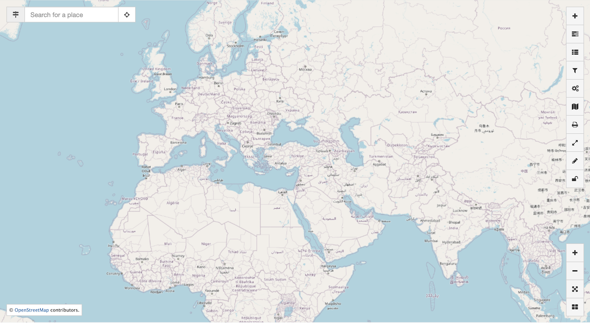
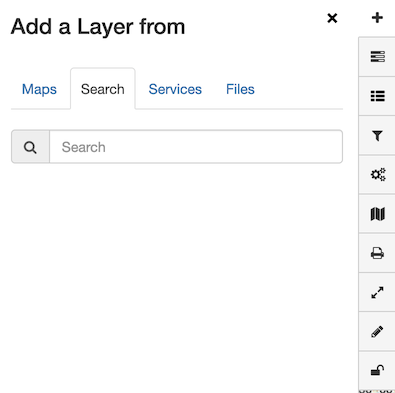
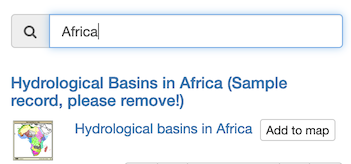
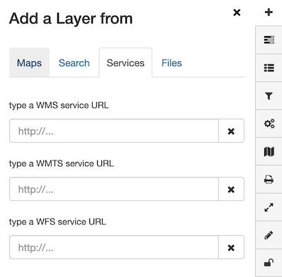
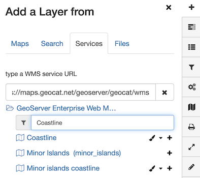
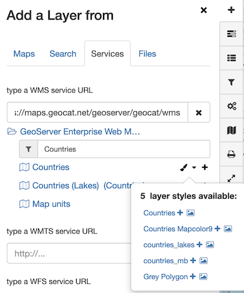
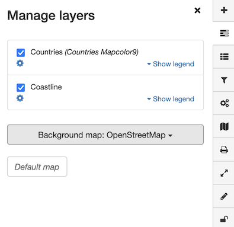
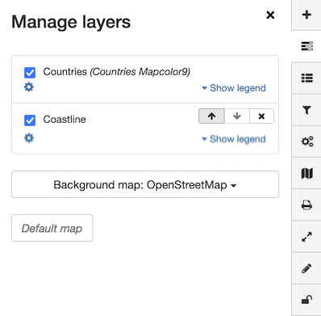
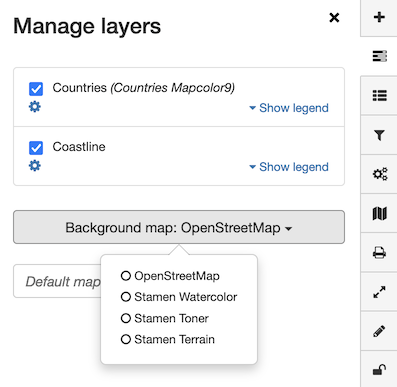
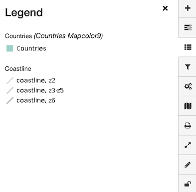

---
tags:
- Map
- Layers
- Background Layers
- Measure
hide:
  - tags
---

# Карта

Каталог содержит интерактивную карту, которая используется для предварительного просмотра наборов данных
(смотреть [Визуализация данных](visualize/index.md)).

## Область карты

Страница `Карта` имеет ряд функций для изучения данных:

* Интерактивная карта, используемая для предварительного просмотра содержимого.
  
  Используйте мышь масштабирования карты.

* Элементы управления, используемые для добавления и управления содержимым карты.

* Навигация, включая **Увеличение зума**, **Уменьшение зума** и **Зум в выбранную область**.

* Поиск местоположения, включая поиск текущего местоположения.

  

## Добавление слоёв

На интерактивной карте наборы данных представлены в виде отдельных слоев. Слои могут быть взяты из широкого спектра источников данных.

### Карта

Используйте записи в каталоге, содержащие сохраненную карту:

1. В окне просмотра **Карта** нажмите кнопку **Добавить слои** и перейдите на вкладку **Карта**.

   На этой вкладке перечислены записи, включающие сохраненную карту.

2. С помощью поля **Поиск** найдите запись, которую нужно отобразить.

3. Используйте команду **Добавить на карту**, чтобы включить содержимое карты.

### Поиск

Используйте записи в каталоге с помощью картографических веб-сервисов:

1.  В окне просмотра **Карты** нажмите кнопку **Добавить слои** и перейдите на вкладку **Поиск**.
 
    
   
2.  С помощью поля **Поиск** найдите запись для отображения.
   
    В списке отображаются только записи с командой **Добавить на карту**.

    

3.  Нажмите **Добавить на карту**, чтобы визуализировать набор данных.

### Добавьте сервисы

Используйте картографический веб-сервис:

1. В окне просмотра **Карты** нажмите кнопку **Добавить слои** и перейдите на вкладку **Сервисы**.

   

2. Чтобы просмотреть содержимое сервиса веб-карты, укажите URL-адрес описания сервиса
   (известный как документ ``GetCapabilities``).
   
   **Введите URL-адрес сервиса WMS:**.
   : ``https://maps.geocat.net/geoserver/geocat/ows?service=wms&version=1.3.0&request=GetCapabilities``.
   
   Содержимое службы веб-карты будет немедленно перечислено.

3. Используйте поле **Поиск** слоев WMS, чтобы найти слой ``Коастлайн``.
   
   **Поиск**
   : ``Coastline``
   
   

4. Нажмите **:fontawesome-solid-plus: Добавить на карту**.

5. С помощью поля **Поиск** слоев WMS найдите слой ``Страны``.

   **Поиск**
   : ``Страны``.
   
   Нажмите кнопку **:fontawesome-solid-paintbrush: Стили слоя**, чтобы получить список стилей, доступных
   для слоя ``Страны``.

   
   
6. Найдите стиль слоя ``mapcolor9`` и нажмите **Добавить на карту**.

### Добавление файлов

Использование файлов **`KML`** на карте.

## Управление слоями

### Порядок слоев

1.  В окне просмотра **Карты** нажмите кнопку **Управление слоями**.

    
    
2. При наведении курсора на слой отображаются кнопки **Переместить слой вверх**, **Переместить слой вниз** и **Удалить слой**.
    
    
    
3. Используйте эти кнопки для управления порядком слоев и их удаления.

### Добавление файлов

Использование файлов **`KML`** на карте.

## Управление слоями

### Порядок слоев

1.  В окне просмотра **Карты** нажмите кнопку **Управление слоями**.

    
    
2. При наведении курсора на слой отображаются кнопки **Переместить слой вверх**, **Переместить слой вниз** и **Удалить слой**.
    
    
    
3. Используйте эти кнопки для управления порядком слоев и их удаления.

### Фоновая карта

1.  В окне просмотра **Карта** нажмите **Управление слоями**.

2.  Измените **Фоновую карту** с `OpenStreetMap` на `Stamen Watercolor`.
    
    

## Легенда

1.  В окне просмотра **Карты** нажмите кнопку **Легенда**.

    

## Фильтрация данных

Выберите слой `WFS` для фильтрации содержимого, используя CQL-запрос.

## Использование процесса WPS

Используйте службу веб-обработки для выполнения анализа и отображения результатов.

## Карты

### Скачивание карты

1.  В окне просмотра **Карты** нажмите кнопку управления **Карты**.

2.  Нажмите кнопку ***Загрузить --> контекст OGC (XML)**.

### Загрузка карты

1.  В окне просмотра **Map** нажмите кнопку **Maps**.

2.  Нажмите кнопку ***Загрузить --> Из файла**.
    
    Выберите ранее загруженный контекстный файл OGC.

### Загрузка карты со сбросом настроек по умолчанию

1.  В окне просмотра **Карты** нажмите кнопку **Карты**.

2.  Нажмите кнопку ***Загрузить --> Карта по умолчанию**.
