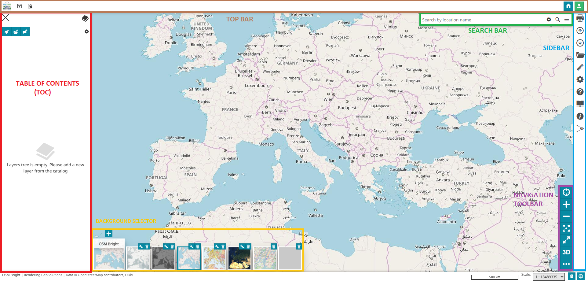

# Карта

Каталог содержит интерактивную карту, которая используется для предварительного просмотра наборов данных. Для перехода к интерактивной карте, нажмите кнопку `Карта` на верхней панели в Каталоге метаданных. 

# Интерфейс карты

Интерфейс страницы `Карта` состоит из следующих основных блоков:

{: .ms-docimage }

* [Cодержание (Table of Contents)](../../user-guide/map/toc.md#table-of-contents) - список загруженных на карту слоёв и групп слоёв. Её функционал позволяет как удалить или отредактировать слои и группы слоёв, так и добавить на карту новые.

* [Поисковая панель](../../user-guide/map/mapstore-toolbars.md#search-bar) для поиска мест по названиям.

* [Боковая панель](../../user-guide/map/mapstore-toolbars.md#side-toolbar), включающая ряд важных функций для просмотра, редактирования или печати карты.

* [Панель навигации](../../user-guide/map/navigation-toolbar.md), позволяющая ориентироваться на карте, а также перейти в режим 3D-отображения карты.

* [Панель выбора фоновой карты](../../user-guide/map/background.md#background-selector), на которой Пользователь может добавить, убрать или отредактировать фон своей карты.

* [Нижний колонтитул](../../user-guide/map/footer.md#footer), в котором Пользователь может: [выбрать требуемую для отображения систему координат](../../user-guide/map/footer.md#crs-selector) для своей карты; визуализировать координаты на карте в выбранной системе координат, соответствующие указателю мыши; визуализировать масштабную линейку, а также изменять её, увеличивая или уменьшая масштаб карты.

* *Область просмотра содержимого*, в которой Пользователь может видеть карту, а также совершать операции над ней.
