# Просмотр записи

Просмотр содержимого записи позволяет получить подробную информацию о записи и описываемом наборе данных.

Найдите запись для просмотра:

1.  В поиск введите `Africa` и откройте любую запись.

2.  Содержимое записи отображается в режиме **По умолчанию**.

    

    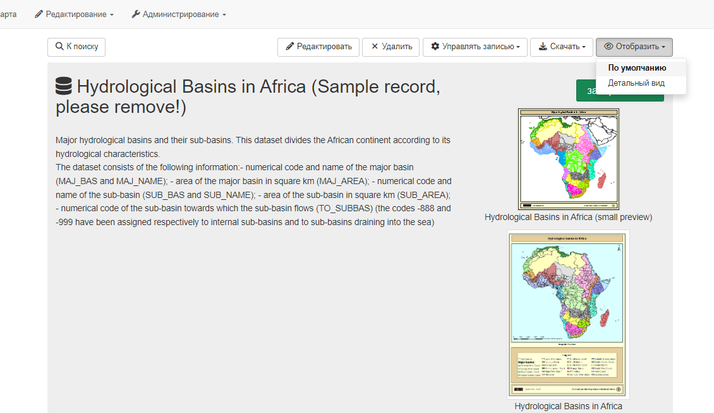
    

3.  Просматривая запись можно:
    
    - Если есть необходимые права доступа, то пользователь может `Редактировать`, `Удалить` и `Управлять записью`
    - `Экспортиоровать` запись метаданных в формате `ZIP`, `XML` или `PDF`.
    - Изменить режим отображения из `По умолчанию` на `Детальный вид`, чтобы просмотреть более подробную информацию.

    

    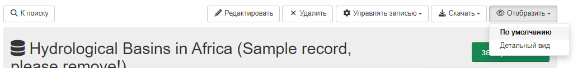
    

## Вид по умолчанию

Режим просмотра записи **По умолчанию** обеспечивает сводку самой важной информации:

1.  Используйте раскрывающиеся меню **Режим просмотра**, чтобы выбрать режим **По умолчанию**.

    

    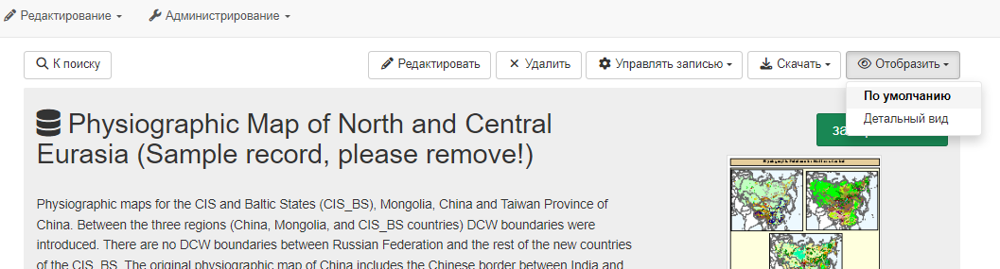
    

    *Режим просмотра по умолчанию*

2.  Заголовок и описание записи отображаются вверху страницы.

    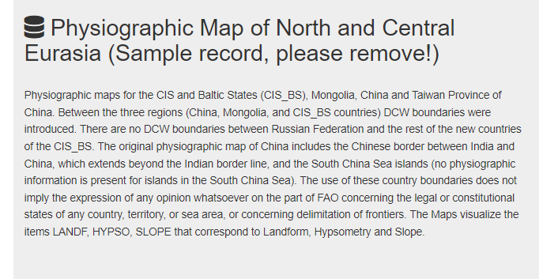
    *Описание страницы*

3.  **Обзор данных** предоставляет пространственную визуализацию описываемого ресурса.

4.  **Техническая информация** предоставляет информацию такую как *Дата создания*, *Язык*, *Масштаб*, *Тематика* и др.

    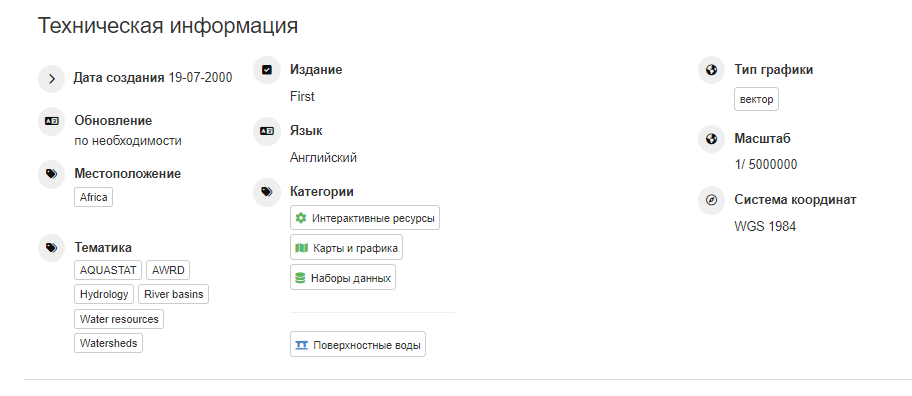
    *Техническая информация*

5.  **Информация о метаданных** предоставляет информацию о создании самой записи метаданных.

    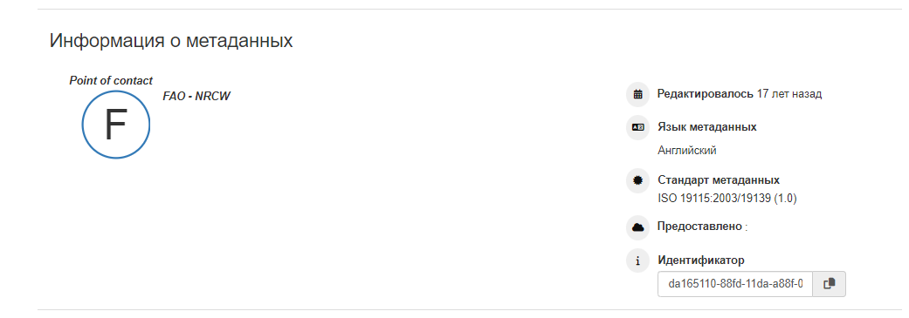
    *Информация о метаданных*

## Детальный вид

Режим просмотра **Детальный вид** используется, чтобы ознакомиться со всей информацией о метаданных.

1.  Используйте раскрывающиеся меню **Режим просмотра**, чтобы выбрать режим **Детальный вид**. 

2.  **Детальный вид** разделён на 6 вкладок:

    -   Идентификация (Identification)
    -   Распространение (Distribution)
    -   Качество (Quality)
    -   Пространственное представление (Spatial rep.)
    -   Система координат (Reference Systems)
    -   Метаданные (Metadata)

3.  На вкладке **Идентификация** представлена основная информация о записи:
        
    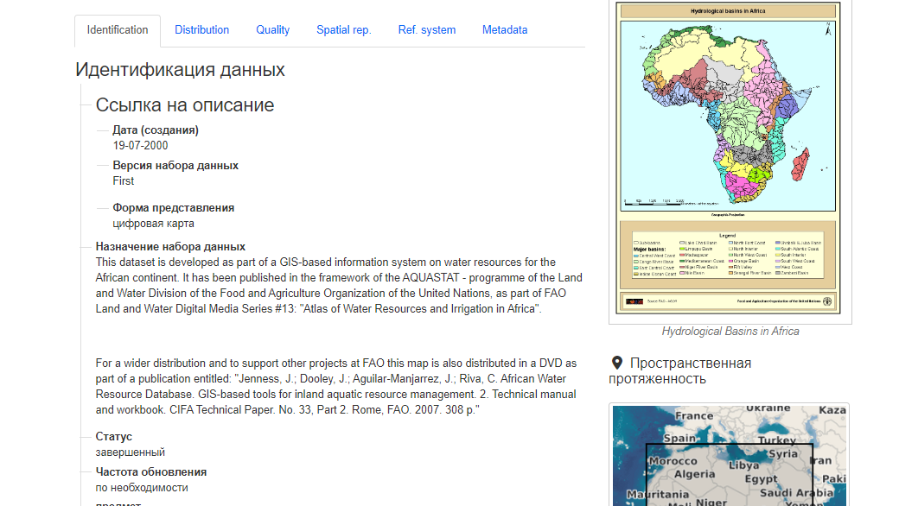

4.  На вкладке **Распространение** содержатся сведения о том, как можно получить доступ к содержимому.

    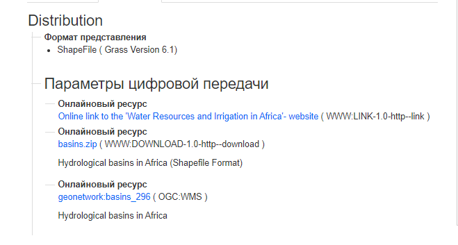

5.  На вкладке **Качество** перечислены сведения о качестве данных.

    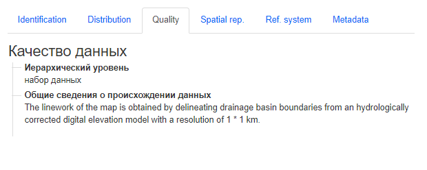

6.  На вкладке **Пространственное представление** можно просмотреть краткое описание пространственного представления.

    

7.  На вкладке **Система координат** содержится информация об используемой пространственной системе координат.

    Она предоставляется в виде машиночитаемого кода системы отсчета.
    
    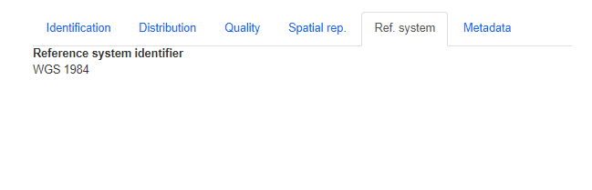

8.  На вкладке **Метаданные** указывается уникальный идентификатор файла, а также ссылка для просмотра XML-документа 
    и контактную информацию о записи.

    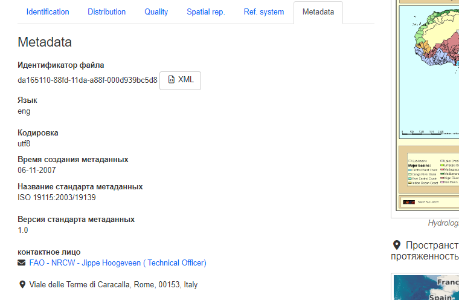

## Запись в формате XML

1.  Запись в формате XML может быть показана из любого режима просмотра:

    - **Вид по умолчанию**: в меню выбрать `Скачать` --> `Экспорт (XML)`
    
    - **Детальный вид**: открыть вкладку `Метаданные` и выбрать `XML`.
    
2.  Запись метаданных в виде XML откроется прямо в браузере:

    

    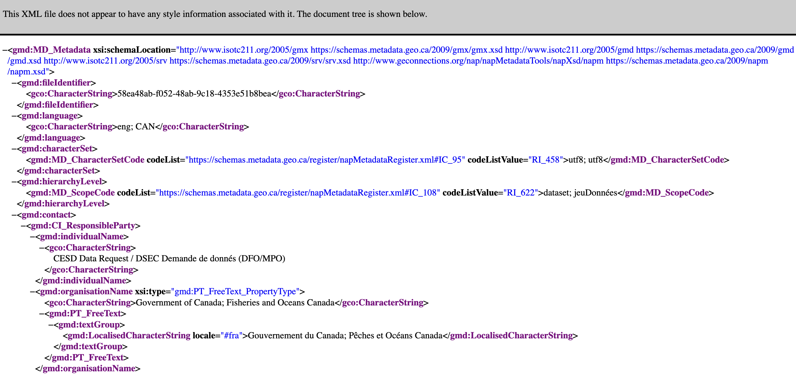
    

3.  Помните, что запись в формате XML не содержит прикрепленных документов или изображений.

    Чтобы загрузить полную информацию о записи, обратитесь к разделу загрузки.
    
## Загрузка из представления записи

Из меню просмотра запись можно экспортировать, нажав `Скачать`:

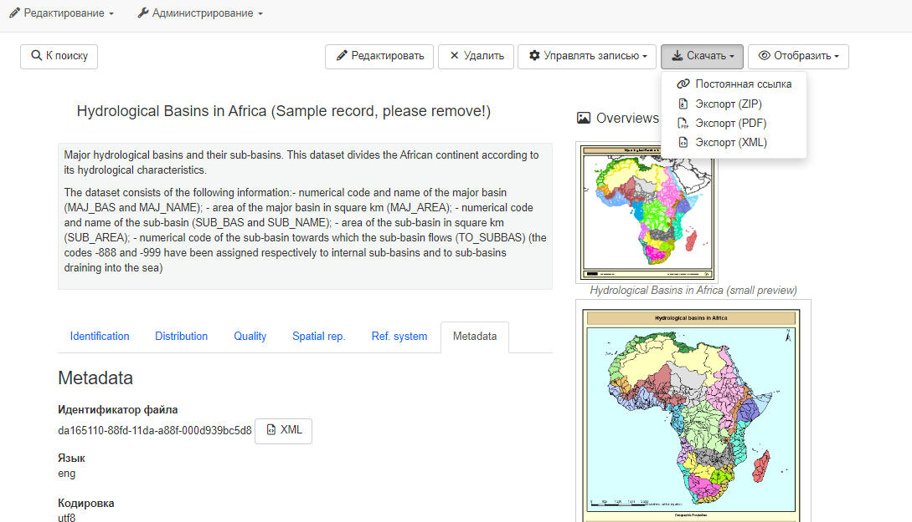

1. **Постоянная ссылка** предоставляет URL-путь к записи в каталоге, которым можно поделиться по электронной почте или в сообщении.

    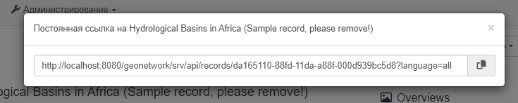

2.  **Экспорт (ZIP)**: zip-файл, включая записи в формате xml вместе с любыми вложениями и изображениями.

    Результирующий файл содержит:

    -   Папка, содержащая полную запись metadata.xml и упрощенную запись metadata-iso19139.xml

    -   Краткие описания *index.html* и index.csv*, описанные в [предыдущем разделе](#download-from-search-results).
        
3.  **Экспорт (PDF)**: PDF-документ с экспортированными записями.

    

4.  **Экспорт (XML)**: загрузка записи в виде xml.

    
