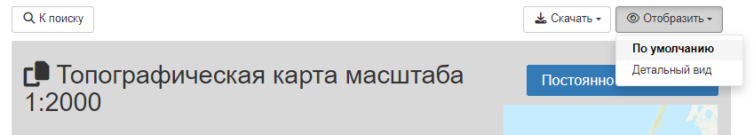
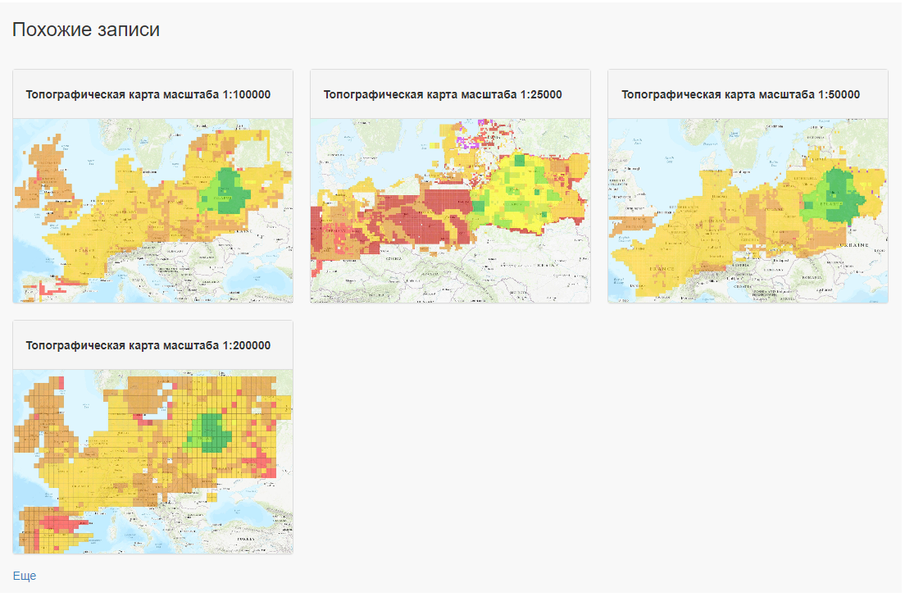
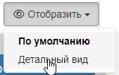
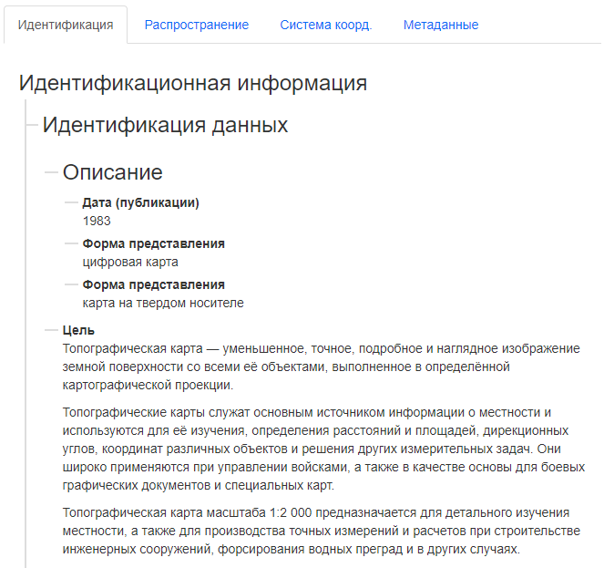
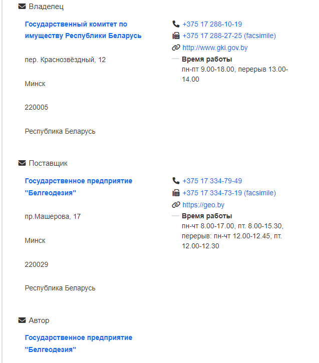
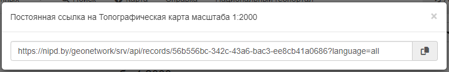
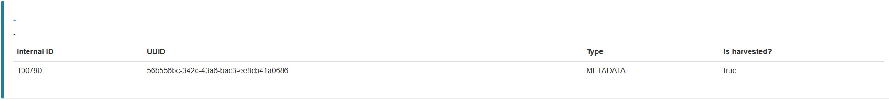

---
tags:
  - Запись
  - Метаданные
  - XML
  - PDF
  - RDF
  - ZIP
  - Просмотр
  - Экспорт
hide:
  - tags
---

# Просмотр записи

Чтобы узнать более подробную информацию о записи и описанном наборе данных, Вы можете просмотреть содержимое записи.

1.  Найдите запись для просмотра, используя поисковые механизмы Каталога метаданных.

2.  Выберите для просмотра любую найденную запись, включающую в заголовке заданное Вами поисковое условие.
    Фон записи станет серым, когда вы наведете курсор мыши на её название на странице результатов поиска:
    
    

    
    

    *Выделение записи при наведении на неё курсора мыши*

    Нажмите на запись левой кнопкой мыши для её подробного просмотра.

3.  Содержимое записи отображается в начальном
    режиме отображения **Вид по умолчанию**.

    

    
    

    *Вид по умолчанию*

4.  Действия с записью для просмотра и скачивания:

    -   Кнопка **К поиску** используется для возврата на страницу результатов поиска.
    -   **Скачать** используется для [экспорта записи](index.md#скачивание-из-режима-просмотра-записи)
        как `ZIP`, `XML` или `PDF`.
    -   Выпадающий список **Отобразить** позволяет переключаться между видом **По умолчанию** 
        и **Детальным** видом, который будет рассмотрен в этой статье [далее](#детальный-вид).

    

    
    

    *Действия с записью*

## Вид по умолчанию

Вид **по умолчанию** предоставляет краткую сводку содержимого записи:

1.  **Заголовок** и **описание** записи отображаются в верхней части страницы.

    
    *Описание записи*

2.  Раздел **Превью** содержит изображение пространственного овхата на мини-карте, описывающего действительное расположение данных, относящихся к выбранной записи.

    
    *Превью*

3. Раздел ссылок и формата - содержит ссылки:
    - на слои пространственных данных, доступные на Национальном геопортале для просмотра в средстве картографического просмотра Каталога метаданных, 
    - на данные ресурса, доступные для просмотра в Каталоге карт Национального геопортала,
    - формат данных, распространяемых данной записью

    
    *Превью*

4. Раздел **Техническая информация** содержит детали о записи, такие как дата публикации, категория и тематика записи, масштаб и система координат.

    
    *Техническая информация*

5. Раздел **Контактные данные** включает сведения о владельце, авторе и поставщике данных, представляемых в выбранной записи.
    
    
    *Контактная информация*

6. Раздел **Информация о метаданных** предоставляет ссылку на запись метаданных в Каталоге, информацию об авторе метаданных и
    уникальный идентификатор.

    
    *Информация о метаданных*

7.  Раздел **Оценки** будет включать информацию об оценках записи метаданных, оствленных другими пользователями.

    
    *Оценки*

8. Раздел **Похожие записи** предлагает несколько ссылок для быстрого перехода на записи метаданных, расположенные в Каталоге метаданных, которые совпадают по тематике/категории с открытой записью.

    
    *Похожие записи*

## Детальный вид

**Детальный вид** используется для отображения полного содержимого записи.

1.  Используйте выпадающее меню **Отобразить** для выбора **Детального вида**.

    
    *Выбор детального вида*

2.  Детальный вид разделяет запись на несколько вкладок:

    -   Идентификация
    -   Распространение
    -   Системы координат
    -   Метаданные

3.  Вкладка **Идентификация** предоставляет:

    -   Описание записи:
        
        
        *Описание записи*
        
    -   Статус и правовые ограничения:
        
        
        *Статус*

        
        *Ограничения*
        
    -   Подробную контактную информацию о владельце, поставщике и авторе данных:

         
        *Подробная контактная информация*

    -   Дополнительную информацию, включая временной, пространственный охват, тематику, предметную область и категории
        
        
        *Дополнительная информация об идентификации*
    
4.  Вкладка **Распространение** содержит детали о том, какой формат имеют данные, а также имеющиеся ссылки для доступа к данным, описываемым в записи.

    
    *Детали распространения данных*

5.  Вкладка **Система координат** охватывает информацию об используемой системе пространственных координат.

    
    *Система координат*

6.  Вкладка **Метаданные** предоставляет Пользователю:
    
    - уникальный идентификатор записи метаданных, информацию о контактном лице записи:

        
        *Детали метаданных записи*

    - информацию о типе ресурса, включая ссылку на метаданные (просмотр страницы в веб-браузере), дате создания/редакции данных, стандарте метаданных:

        
        *Детали метаданных записи*

7. В правой части интерфейса страницы записи метаданных, открытой в детальном виде, находятся:
    
    - окна **Предпросмотры** и **Пространственный экстент**, позволяющие Пользователю узнать пространственный охват для выбранной записи.

        
        *Предпросмотр и пространственный экстент*

    - перечень ключевых слов и категорий записей, которые позволяют классифицировать и описать запись метаданных для её более оптимального поиска в Каталоге.

        
        *Ключевые слова и категории*
    
    - раздел **Предоставлено**, содержащий ссылку на запись метаданных в Каталоге метаданных.

    - раздел **Связанные записи**, включающий ссылки на записи, которые связаны с выбранной записью метаданных, в Каталоге метаданных.

        
        *Предоставлено и связанные записи*

## Запись в формате XML

1.  Получить доступ к записи метаданных в формате XML можно, выбрав на странице записи (как в виде просмотра по умолчанию, так и из детального вида) в выпадающем окне **:fontawesome-solid-download: Скачать** вариант *Экспорт (XML)*:
        
    
    *Экспорт (XML)"*
    
2.  По нажатию левой кнопки мыши по варианту *Экспорт (XML)* либо откроется новая вкладка браузера с кодом XML, либо будет начато скачивание файла в формате XML.

    

    
    

    *Запись в формате XML, показанная в веб-браузере*

3.  Имейте в виду, что запись метаданных в формате XML не включает добавленные в неё документы или миниатюры.

    Информацию о том, как скачать полную информации о записи метаданных Вы найдете в [далее](index.md#скачивание-из-режима-просмотра-записи).
    
## Скачивание из режима просмотра записи

1.  В любом режиме просмотра записи, раскройте список опций **:fontawesome-solid-download: Скачать**:

    

    
    

    *Опции скачивания записи*

2.  Вариант **Постоянная ссылка** предоставляет URL, которым
    можно поделиться по электронной почте или в сообщении.

    
    *Постоянная ссылка на запись*

    Вы можете выделить текст ссылки в буфер обмена, выделив его полностью с помощью зажатой левой кнопки мыши либо нажав кнопку в правой части появившегося окна для копирования текста ссылки в буфер обмена:

    
    *Кнопка копирования постоянной ссылки*

3.  Архив, доступный для скачивания при выборе варианта **Экспорт (ZIP)**, включает:

    -   Папку, содержащую полную запись ***`metadata.xml`*** и упрощенную
        запись в формате XML ***`metadata-iso19139.xml`***.
    -   Сводки ***`index.html`*** и ***`index.csv`***, описанную в
        [предыдущем разделе](../search/index.md#скачивание-записей-метаданных-из-окна-поиска).

    
    *Сводка index.html экспорта (ZIP)*

    Этот файл полезен для обмена информацией между системами. Содержимое
    архива следует конвенции «Metadata Exchange Format», используемой
    для обмена записями между каталогами.

4.  При выборе варианта **Экспорт (PDF)** Пользователь скачает на компьютер файл в формате PDF, в котором будет текстовое и визуальное содержимое метаданных.

    

    
    

    *Документ экспорта (PDF)*