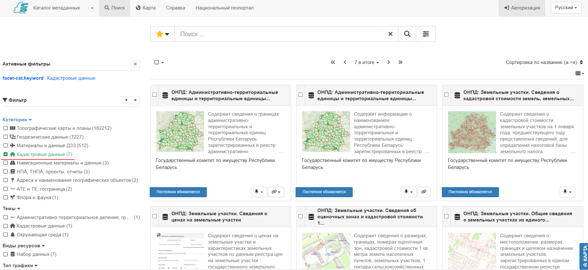
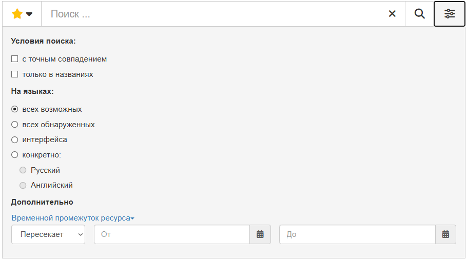
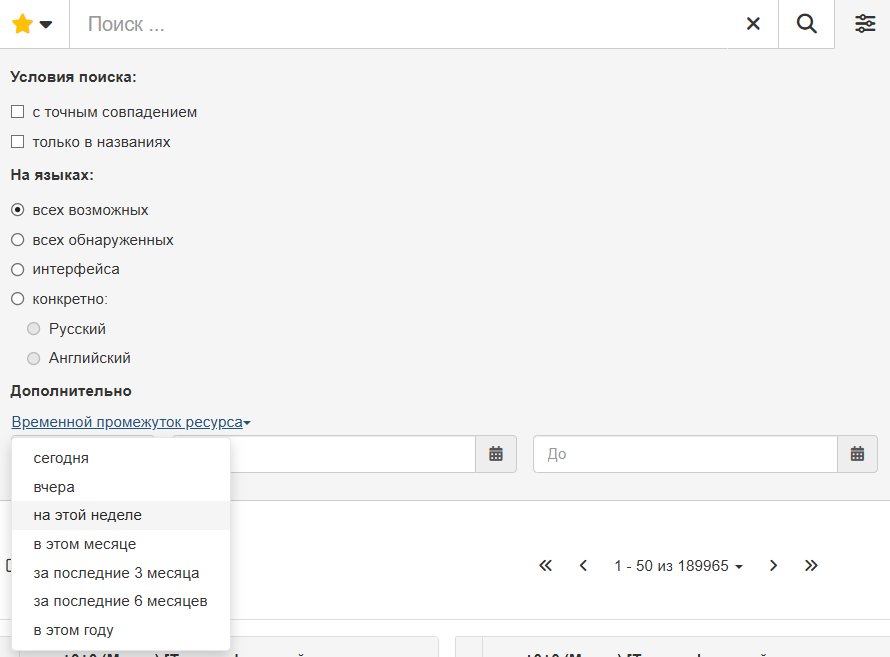
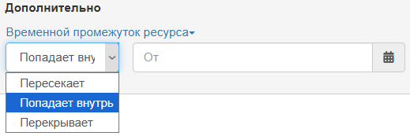
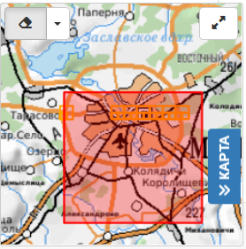
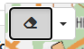
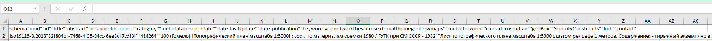

---
tags:
  - Поиск
  - Каталог
  - Фильтр
  - Сетка
  - Список
hide:
  - tags
---

# Страница поиска

Страница **Поиск** отображает результаты поиска для фильтрации и сортировки.

## Результаты поиска

Каталог метаданных позволяет детальнее изучить результаты поиска:

1.  Перейдите на страницу **:fontawesome-solid-magnifying-glass: Поиск** (просмотрите записи или выполните [поиск по каталогу](../home/index.md#поиск-по-каталогу), чтобы
    вывести результаты поиска).

    

    
    

    *Страница поиска*
    
2.  Используйте раздел **:fontawesome-solid-magnifying-glass: Фильтр** с правой стороны для уточнения результатов поиска,
    используя дополнительные поисковые фасеты, ключевые слова и детали, такие как формат скачивания.
    
    Для примера, отметьте «поисковый фасет» `Кадастровые данные`, чтобы отфильтровать результаты поиска до
    совпадающих записей.

    

    
    

    *Фильтрация результатов*

3.  Опции, доступные в верхней части результатов поиска:
    
    * Представление найденных записей (как **:fontawesome-solid-table-cells-large: Сетка**
    или **:fontawesome-solid-bars: Список**)
    * Сортировка результатов
    * Управление количеством отображаемых результатов на странице
    * Переход к дополнительным страницам результатов
    * Быстрый выбор записей

    

    
    

    *Просмотр результатов*

4.  Чтобы очистить результаты поиска, используйте кнопку **:fontawesome-solid-xmark: Очистить текущий поисковый запрос, фильтры и сортировки**
    в любое время. Эта кнопка находится в поле **Поиск** в верхней части страницы, а также в левой части интерфейса рядом с перечнем **Активных фильтров**.
	
	

    
    

    *Сброс поискового запроса, фильтрации, сортировки*

5.  **:fontawesome-solid-sliders: Параметры поиска** по Каталогу метаданных находятся в 
    поле **Поиск** в верхней части страницы.
    
    Эти параметры можно использовать для задания условия поиска (точное совпадение поискового запроса или поиск только по названию записи), выбора языка материалов Каталога метаданных для отображения искомых записей, а также выбор временного промежутка создания искомых записей метаданных.

    

    
    

    *Панель параметров поиска*

6.  Откройте панель **:fontawesome-solid-sliders: параметров поиска**.
    
    Используя выпадающее меню **Временной промежуток ресурса** выберите `на этой неделе`.
    Это действие заполнит поля календаря **От** и **До**.
    
    Нажмите кнопку **:fontawesome-solid-magnifying-glass: Поиск** для фильтрации с использованием этого диапазона дат.

    

    
    

    *Поиск записей, обновленных за прошлую неделю*
	
	Также в этой панели можно выбрать способ управления результатами поиска по временному промежутку. В окошке, левее поля **От**, Вы можете выбрать: даты обновления искомых записей будут пересекать заданный временной промежуток, попадать внутрь него или перекрывать.
	
	

    
    

    *Поиск записей, обновленных за прошлую неделю*

7.  В нижней части страницы поиска представлена **выдвижная карта**, обеспечиввающая визуальную обратную связь по охвату каждой записи.

    

    
    

    *Карта поиска*

    Выдвижной картой можно управлять, переключаясь между двумя режимами:

    -   Панорамирование: Нажмите и перетащите местоположение карты, используя колесико мыши для
        регулировки уровня масштабирования.

    -   Ограничивающий прямоугольник: Удерживайте _shift_ и, зажав левую кнопку мыши, проведите прямоугольник (синего цвета), который отмасштабирует экстент выдвижной карты в соответствии с границами этого прямоугольника.
	
	
	*Выбор зоны масштабирования*
	
	Чтобы определить охват, используемый для фильтрации записей, переведите выдвижную карту в режим рисования, нажав на иконку **:fontawesome-solid-pencil-alt: Карандаша**. После этого, зажав левую кнопку мыши, проведите прямоугольник (красного цвета), который определит экстент для фильтрации записей в Каталоге метаданных. После этого, в поиске останутся только те записи, которые или пересекаются, или находятся внутри размеченного прямоугольника.
	
	
	*Выбор охвата территории для фильтрации записей*
	
	!!! Внимание
        
        Выбор варианта отображения записей по результатам наложения пространственного экстента в выдвижной карте, осуществляется в выпадающем меню **:fontawesome-solid-caret-down:**, рядом с иконкой **:fontawesome-solid-pencil-alt: Карандаша**:
	
	    
	
	
	!!! Внимание
        
        Сбросить выбранный пространственный экстент возможно, нажав на **:fontawesome-solid-eraser: ластик**, который появится вместо **карандаша**, в момент его активации:
	
	    
    
## Скачивание записей метаданных из окна поиска
	
Для быстрой загрузки (в формате ZIP или CSW) или генерации PDF одной или нескольких записей из Каталога метаданных:
	
- эти записи сначала нужно выделить с использованием флажка, расположенного рядом с каждой из них в поисковом окне, 

- вернуться к строке поиска, нажать на выпадающий список **выбрано** для выбора варианта скачивания записей.

*Выбранные записи*

Архив, сформированный при нажатии на вариант **Экспорт (ZIP)**, включает в себя выбранные записи метаданных: для каждой экспортированной записи будет создана папка, содержащая сохранённую в формате `xml` запись метаданных вместе с соответствующими вложениями и миниатюрами. 
Также в архив помещены сводки содержимого скаченного файла в двух форматах: **html** (`index.html`) и **csv** (`index.csv`).

При выборе варианта **Экспорт (PDF)** на Ваш компьютер будет скачен PDF-файл с содержанием выбранных записей метаданных.

*Экспорт PDF*

Загрузка с использованием варианта **Экспорт (CSV)**, предоставит Вам
табличную сводку экспортированных записей в формате `csv`.

*Экспорт CSV*