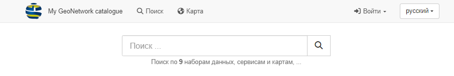

---
tags:
- Search
- Catalog
- Filter
- Grid
- List
hide:
  - tags
---

# Поиск

На странице **Поиск** перечислены результаты поиска, которые можно фильтровать и сортировать.

## Поиск по каталогу

1.  Введите нужные ключевые слова и условия поиска в поле **Поиск**
    в верхней части страницы и нажмите **:fontawesome-solid-magnifying-glass: Поиск**.
    (или воспользуйтесь клавишей ++enter++), чтобы вывести список результатов поиска.

    

    
    

    *Форма поиска*
    

2.  Поиск по полным словам.

    В поле **Поиск** введите на английском `Africa`.

    

    
    

    *Результаты поиска по "Africa"*

3.  Поиск с использованием символ `*` для поиска начала или конца слова. 
    Следует помнить, что поиск ведется по всему содержимому в записи, а не только по
    названию и описанию.
    
    Use **Search** field to enter: `Area*`

    

    
    

    *Поиск по началу слова*

4.  Символ `*` также можно использовать несколько раз для определения соответствия части слова.

    Используйте поле "Поиск", чтобы ввести: "\*frica\*"

    

    
    

    * Поиск по части слова*
    
5. Результаты поиска отображаются в [результатах поиска](#search-results), описанных ниже.

## Результаты поиска

Для дальнейшего изучения представленных в списке записей:

1. Перейдите на страницу **:fontawesome-solid-magnifying-glass: Поиск** (или просмотрите каталог, чтобы
просмотреть результаты поиска).

    

    
    

    *Страница поиска*
    
2.  Используйте **:fontawesome-solid-magnifying-glass: Фильтр** с правой стороны, чтобы уточнить результаты поиска
    используя дополнительные параметры поиска, ключевые слова и такие детали, как формат загрузки.
    
    Введите **Africa** в поле `Фильтр` --> `Ключевые слова`, чтобы отфильтровать результаты поиск по ключевому слову.

    

    
    

    *Фильтр по ключевым словам*

3.  В верхней части результатов поиска предусмотрены опции для:
    
    * Представление совпадающих записей (в виде **:fontawesome-solid-table-cells-large: Таблица**
    или **:fontawesome-solid-bars: Список**)
    * Сортировка результатов
    * Управление количеством результатов на странице
    * Переход к дополнительным страницам результатов
    * Быстрый выбор записей

    

    
    

    *Просмотр результатов*

4.  Чтобы очистить результаты поиска, используйте **:fontawesome-solid-xmark: Очистить текущий поисковый запрос, фильтры и сортировку** 
    в любое время. Эта кнопка находится в поле **Поиск** в верхней части страницы.

5.  Откройте панель параметров **:fontawesome-solid-ellipsis-vertical: Расширенный поиск** 

    Заполните поля **От** и **По**, чтобы выбрать записи в нужном диапазоне дат.
    
    Нажмите **:font awesome-solid-magnifying-glass:  Поиск**, чтобы выполнить фильтрацию по этому диапазону дат.

    

    
    

6.  Миникарта представлена в нижней части страницы, предоставляя визуальную информацию о записях.

    

    
    

    *Миникарта*

    Картой можно управлять, переключаясь между двумя режимами:

    - Щелкните и перетащите местоположение на карте, используя колесико мыши для регулировки масштаба.

    - Ограничивающая рамка: удерживайте ++shift++ и нажмите и перетащите, чтобы определить экстент, используемый для фильтрации.
        записи.
        
      Раскрывающийся список определяет, используется ли экстент для отображения списка
      только те записи, которые находятся внутри, или все записи, которые пересекаются.
        
      
      
7.  Можно выбирать записи (с помощью флажка, расположенного рядом с каждой из них)
    для быстрой загрузки или создания PDF-файла с одной или несколькими записями.

    

    
    

## Загрузка записей из результатов поиска

Для загрузки можно экспортировать несколько записей метаданных.

Для выбора записей из нескольких результатов поиска:

1.  Введите `Africa` в форму поиска

    

2.  Установите флажки рядом с каждой записью, чтобы выбрать содержимое для загрузки.

    

3.  В верхней части страницы отображается количество выбранных записей.

    Рядом с количеством выбранных записей находится раскрывающийся список `выбрано`,
    в котором предлагается несколько вариантов экспорта для загрузки.

4.  **Экспорт (ZIP)**: zip-файл, включая записи в формате xml вместе с любыми вложениями и изображениями.

    Результирующий файл содержит:

    -   Папку для каждой экспортированной записи метаданных

    -   ***`index.html`*** Краткое содержание
        

    - ***`index.csv`*** краткое содержание
        

5.  **Экспорт (PDF)**: PDF-документ с экспортированными записями.

    

6.  **Экспорт (CSV)**: загрузка, содержащая сводную информацию об экспортированных записях в виде csv-таблицы.

    
